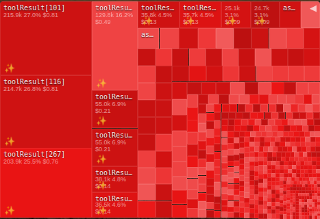

<p align="center">
  
</p>

<h1 align="center">TinkerClaw</h1>

<p align="center">
  <strong>An OpenClaw fork for people who check their token spend before breakfast.</strong>
</p>

<p align="center">
  <a href="https://github.com/openclaw/openclaw"></a>
  <a href="https://github.com/globalcaos/tinkerclaw/commits/main"></a>
  <a href="#-published-skills"></a>
  <a href="#-memory-research"></a>
  <a href="LICENSE"></a>
</p>

---

<p align="center">
  
  <br>
  <em>Every bar is a turn. Every color is a cost. The spike at 14:02? A 40K-token tool result nobody asked for.</em>
</p>

> The Tinker UI's token visualization was inspired by [Mission Control](https://github.com/crshdn/mission-control) (context anatomy dashboard) and [ClawMetry](https://github.com/vivekchand/clawmetry) (real-time agent observability). Both are excellent standalone tools for OpenClaw — we folded their ideas into a single embedded panel.

---

## The Problem

You ran Opus for 20 minutes. It felt productive. Then you checked the bill and discovered that "productive session" cost $23.

The worst part? $15 of that was context bloat — workspace files you forgot were injected, tool results the model never referenced, conversation history from six topics ago still sitting in the window.

You didn't overspend. You **overloaded**. And you had no way to see it happening.

Most people find out three days later. The observant ones set a budget alert after it's already too late. The really unlucky ones hit their API rate limit at 2 AM on a Tuesday and wake up to a dead agent and no idea why.

TinkerClaw exists because we got the $23 bill. Then we got angry. Then we built a dashboard. Then we couldn't stop — memory consolidation, self-improving crons, dozens of published skills, 7 research papers on how agent memory should actually work.

Because once you start tinkering, you don't stop.

---

## 🤝 Come Tinker With Us

This fork moves fast, but it would move faster with more hands.

We value people who **open PRs**, not issues. Who read the code before asking questions. Who break things on purpose to understand how they work. If that's you, we want you in the inner circle — direct access to the roadmap, early testing of experimental features, and co-authorship on whatever we build next.

**Start anywhere:** fix a typo, improve a skill, add a test, or propose something wild. The bar is curiosity, not credentials.

→ [Open a PR](https://github.com/globalcaos/tinkerclaw/pulls) or [start a discussion](https://github.com/globalcaos/tinkerclaw/discussions)

---

## Won't This Fork Fall Behind?

No. A nightly cron syncs upstream automatically, detects conflicts, and restores fork patches after every merge. Hundreds of commits ahead of vanilla OpenClaw and zero behind.

When upstream pushes a breaking change, we know within hours — not weeks.

---

## What You Get

### 🔍 Tinker UI — See Why Sessions Get Expensive

The Tinker UI is a command center embedded directly in OpenClaw. No separate install, no external service.

<p align="center">
  
  <br>
  <em>Chat interface with session switching, tool call inspection, and real-time streaming.</em>
</p>

- **Context treemap** — drill into what fills your 200K context window, from categories down to individual messages and raw text
- **Response treemap** — see exactly how much of each response is text, thinking, tool calls, or tool results
- **Timeline** — stacked bars per turn, spot the one that blew the budget
- **Overseer graph** — catch stalled sub-agents before they burn money
- **Cost dashboard** — per-provider usage with Claude's 5-hour rate-limit countdown

<table>
<tr>
<td width="50%">

<br><em>Context treemap: every block is tokens you're paying for.</em>
</td>
<td width="50%">

<br><em>Drill into a single category. These tool results cost $0.81 each.</em>
</td>
</tr>
</table>

After `pnpm build`, visit **`http://localhost:18789/tinker/`** · Dev: `cd tinker-ui && pnpm dev`

---

### 🧠 Memory That Improves Overnight

Every night, the agent reviews its day — not as a diary, but as an evolution loop.

- **ENGRAM consolidation** — raw daily logs → structured knowledge files → entity and project indices
- **Retrieval feedback** — tracks which memory search results actually got used, prunes what doesn't help
- **Structured compaction** — preserves decisions, tradeoffs, and open questions while discarding noise

Measured: 23.5KB injected context → 12KB. **49% smaller, zero quality loss.**

<p align="center">
  
  <br>
  <em>Multi-model dashboard: Claude, Gemini, and local models with live status.</em>
</p>

---

### 🔄 Self-Improving Agents

Each cron job carries a META file with its own instructions. After running, the agent reflects on what worked, updates the META, and the next run is better. No human needed.

Day 1: mediocre. Day 30: genuinely useful.

### 🧹 Fork Maintenance on Autopilot

- Nightly upstream sync with conflict detection
- Post-merge workspace cleanup (catches 20KB bloat)
- Fork patches auto-restored after conflicts
- Hundreds of commits ahead, zero maintenance burden

---

## 📦 Published Skills

> All on [ClawHub](https://clawhub.ai/u/globalcaos). Install any with `clawhub install globalcaos/<skill-name>`.
> Skills sometimes get delisted from the marketplace — this list is the permanent record.

### 🎤 Voice & Personality

| Skill | What it does |
|-------|-------------|
| [`jarvis-voice`](https://clawhub.ai/globalcaos/jarvis-voice) | Turn your AI into JARVIS. Voice, wit, and personality — the complete package. |

### 💬 Messaging & Channels

| Skill | What it does |
|-------|-------------|
| [`whatsapp-ultimate`](https://clawhub.ai/globalcaos/whatsapp-ultimate) | 3-rule security gate — agent speaks only when spoken to, in the right chat, by the right person. |

### 📹 Media & Content

| Skill | What it does |
|-------|-------------|
| [`youtube-ultimate`](https://clawhub.ai/globalcaos/youtube-ultimate) | Free transcripts, 4K downloads, video exploration — zero API quotas burned. |

### 💰 Cost & Token Management

| Skill | What it does |
|-------|-------------|
| [`tinker-command-center`](https://clawhub.ai/globalcaos/tinker-command-center) | The dashboard above. Every token, every dollar, every context byte — real time. |
| [`token-panel-ultimate`](https://clawhub.ai/globalcaos/token-panel-ultimate) | Multi-provider token tracking, budget alerts, REST API. |
| [`token-efficiency-guide`](https://clawhub.ai/globalcaos/token-efficiency-guide) | Go from weekly limit on Tuesday to weekly limit on Sunday. 10 steps, one afternoon. |

### 🏢 Enterprise Integrations (Browser Relay)

No API keys. No admin consent. Your authenticated browser session IS the API.

| Skill | What it does |
|-------|-------------|
| [`outlook-hack`](https://clawhub.ai/globalcaos/outlook-hack) | Reads Outlook all day, drafts replies — won't send without approval. Code-enforced. |
| [`teams-hack`](https://clawhub.ai/globalcaos/teams-hack) | Reads Teams chats, posts to channels, searches everything. One browser handshake. |
| [`factorial-hack`](https://clawhub.ai/globalcaos/factorial-hack) | Reads your HR portal — attendance, leave, payslips. No admin consent required. |

### 🤖 Agent & DevOps

| Skill | What it does |
|-------|-------------|
| [`coding-agent`](https://clawhub.ai/globalcaos/coding-agent) | Hand off a coding task, come back to a diff. Codex, Claude Code, or Pi — your call. |
| [`subagent-overseer`](https://clawhub.ai/globalcaos/subagent-overseer) | Sub-agents that go silent don't go unnoticed. Health checks, zero babysitting. |
| [`fork-and-skill-scanner-ultimate`](https://clawhub.ai/globalcaos/fork-and-skill-scanner-ultimate) | Scan 1,000 GitHub forks per run. Surface the gold, skip the clones. |
| [`ultimate-fork-and-skill-scanner`](https://clawhub.ai/globalcaos/ultimate-fork-and-skill-scanner) | Full fork + skill scanning with trend insights and actionable improvements. |
| [`memory-pioneer`](https://clawhub.ai/globalcaos/memory-pioneer) | Benchmark your agent's memory. Contribute anonymized scores to open research. |
| [`memory-bench-pioneer`](https://clawhub.ai/globalcaos/memory-bench-pioneer) | Peer-review-grade evaluation suite — LLM-as-judge, nDCG, MAP, MRR metrics. |
| [`model-prompt-adapter`](https://clawhub.ai/globalcaos/model-prompt-adapter) | Universal prompt addenda for cross-provider fallback chains. Fixes per-model failure modes. |
| [`smart-model-router`](https://clawhub.ai/globalcaos/smart-model-router) | Auto-selects the optimal model per task. Cost vs capability, no manual routing. |

### 🛡️ Security & Governance

| Skill | What it does |
|-------|-------------|
| [`agent-boundaries-ultimate`](https://clawhub.ai/globalcaos/agent-boundaries-ultimate) | Instruction-level guardrails so your agent won't go rogue or improvise ethics. |
| [`agent-memory-ultimate`](https://clawhub.ai/globalcaos/agent-memory-ultimate) | Long-term memory done right. Semantic search, daily consolidation, cross-session recall. |
| [`shell-security-ultimate`](https://clawhub.ai/globalcaos/shell-security-ultimate) | Classify every shell command as SAFE, WARN, or CRIT before your agent runs it. |

### 😂 Humor & Communication

| Skill | What it does |
|-------|-------------|
| [`ai-humor-ultimate`](https://clawhub.ai/globalcaos/ai-humor-ultimate) | Four humor patterns grounded in cognitive science. Funny when it should be, serious when it matters. |
| [`computational-humor`](https://clawhub.ai/globalcaos/computational-humor) | 12 humor patterns based on embedding space bisociation theory. |

### 📖 Knowledge & Onboarding

| Skill | What it does |
|-------|-------------|
| [`field-guide`](https://clawhub.ai/globalcaos/field-guide) | 37 battle-tested lessons for AI agents. Ethics, memory, budget, messaging security, epistemic hygiene. |

### 📋 Data & Migration

| Skill | What it does |
|-------|-------------|
| [`chatgpt-exporter-ultimate`](https://clawhub.ai/globalcaos/chatgpt-exporter-ultimate) | Leaving ChatGPT? Take your conversations with you. Full export, clean format. |

---

## 📚 Memory Research

7 papers on how agent memory works in production — not in theory.

| Paper | Topic | Key Idea |
|-------|-------|----------|
| 📄 [**ENGRAM**](docs/papers/engram.md) | Context Compaction | Nightly sleep cycle: daily logs → knowledge → entities → projects |
| 📄 [**HIPPOCAMPUS**](docs/papers/hippocampus.md) | Concept Indexing | Pre-computed concept index for O(1) memory retrieval |
| 📄 [**CORTEX**](docs/papers/cortex.md) | Persona-Aware Context | Context engineering for persistent AI identity across sessions |
| 📄 [**DENDRITE**](docs/papers/dendrite.md) | Fractal Memory | Self-similar architecture for scalable long-term memory |
| 📄 [**LIMBIC**](docs/papers/limbic.md) | Humor Generation | Bisociation in computational embedding space — making AI funny |
| 📄 [**SYNAPSE**](docs/papers/synapse.md) | Multi-Model Debate | Adversarial reasoning across provider-specific engines |
| 📄 [**THALAMUS**](docs/papers/thalamus.md) | Self-Improvement | Curiosity, memory, and the architecture of self-improving LLMs |

---

## 📖 The Field Guide

32 lessons from 6 weeks of running AI agents 24/7.

> *"Read is free, send is not."*
>
> *"Wind-down is evolution, not diary."*
>
> *"A stuck sub-agent is burning money. Kill fast, respawn small."*

**📖 [Read the Field Guide →](docs/guides/field-guide.md)**

---

## 🚀 Quick Start

```bash
git clone https://github.com/globalcaos/tinkerclaw.git
cd tinkerclaw
pnpm install && pnpm build
pnpm openclaw onboard --install-daemon
```

Drop-in replacement for vanilla OpenClaw. Same config, same workspace, same channels. Visit `http://localhost:18789/tinker/` for the command center.

---

## Acknowledgments

TinkerClaw builds on [OpenClaw](https://github.com/openclaw/openclaw) and was inspired by the work of:

- **[Mission Control](https://github.com/crshdn/mission-control)** by crshdn — context anatomy dashboard and agent orchestration UI
- **[ClawMetry](https://github.com/vivekchand/clawmetry)** by vivekchand — real-time token observability for OpenClaw agents

Both are excellent standalone tools. We folded their ideas into a single embedded panel and went from there.

---

<p align="center">
  <a href="https://thetinkerzone.com">🌐 thetinkerzone.com</a> · <a href="https://youtube.com/@thetinkerzone">🎬 YouTube</a> · <a href="https://clawhub.ai">🦞 ClawHub</a> · <a href="https://discord.gg/clawd">💬 Discord</a>
</p>

<p align="center">
  <strong>⭐ Star if you're tired of guessing what your AI costs.</strong>
</p>

<p align="center">
  <em>Built by <a href="https://github.com/globalcaos">globalcaos</a>. Your AI shouldn't cost more than your rent — and if it does, you should at least know why.</em>
</p>
