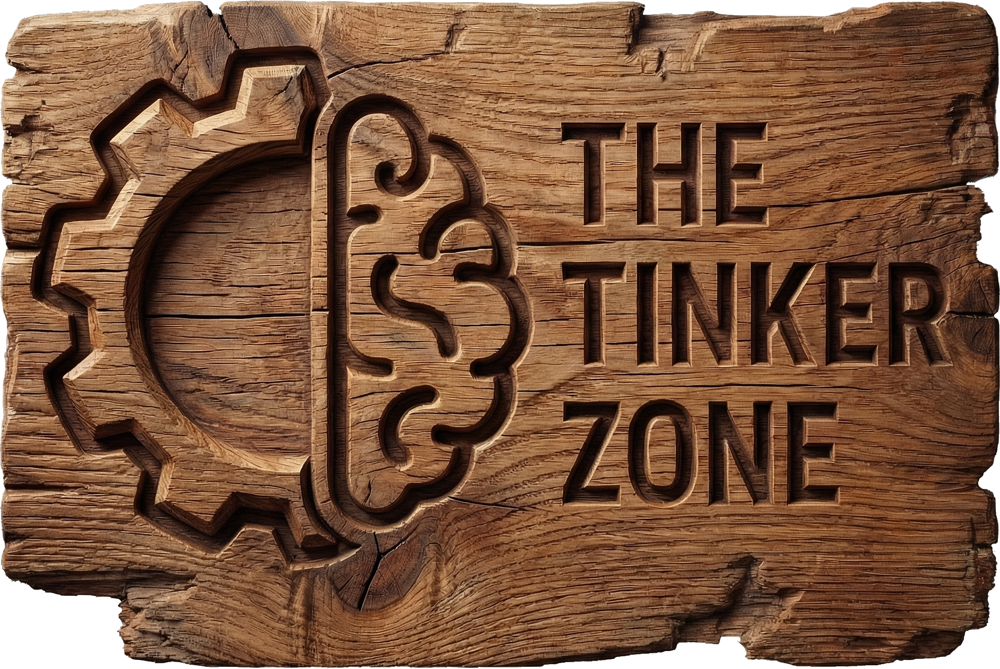
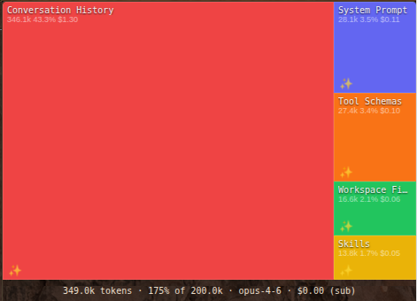
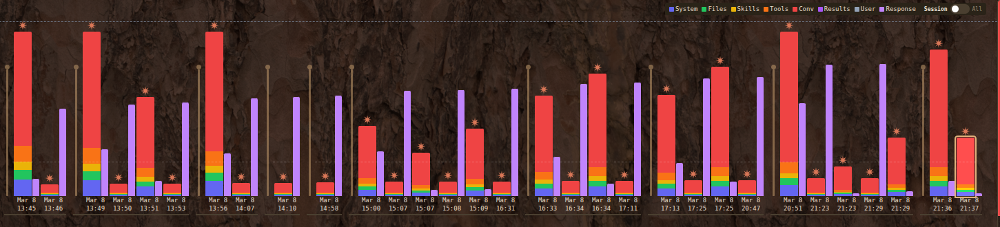
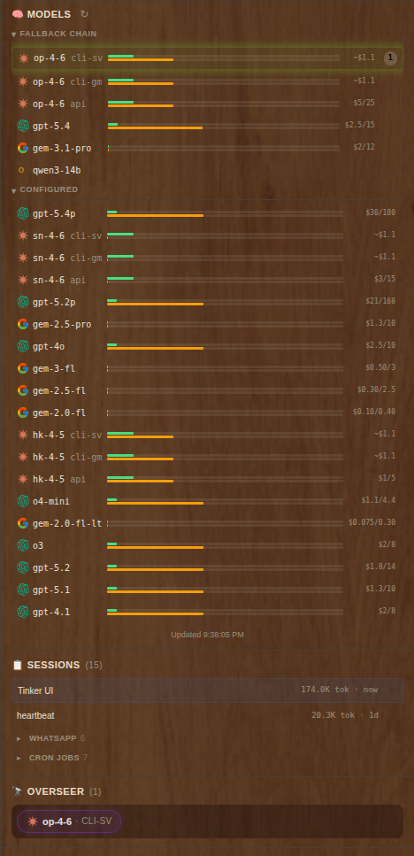
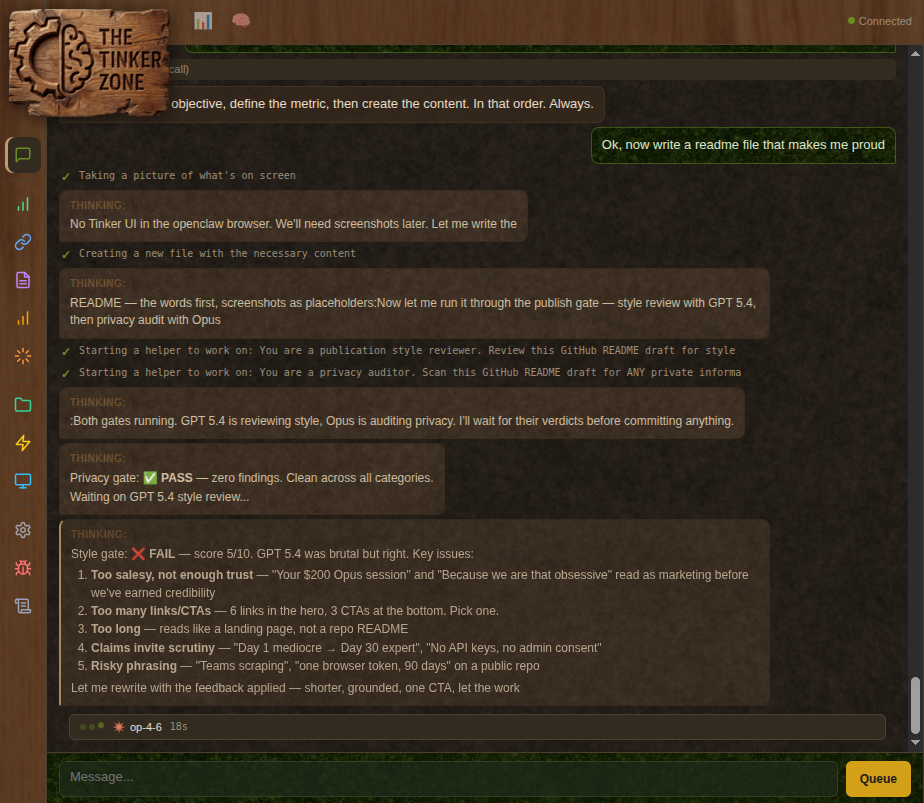

<p align="center">
  
</p>

<h1 align="center">TinkerClaw</h1>

<p align="center">
  <strong>An OpenClaw fork for people who check their token spend before breakfast.</strong>
</p>

<p align="center">
  <a href="https://github.com/openclaw/openclaw"></a>
  <a href="https://github.com/globalcaos/tinkerclaw/commits/main"></a>
  <a href="#skills"></a>
  <a href="#memory"></a>
  <a href="LICENSE"></a>
</p>

---

<p align="center">
  
  <br>
  <em>This is where your money goes. Every token, every file, every message.</em>
</p>

---

## The Problem

A single Opus conversation burns $20+ and you find out three days later on your provider dashboard. That's not a billing problem — it's a **visibility problem**.

TinkerClaw fixes that. And while we were at it, we fixed memory, maintenance, and about 20 other things we got tired of doing manually.

Because we are that obsessive.

---

## What You Get

<table>
<tr>
<td width="50%">

### 🔍 See Where Every Token Goes

Tinker UI shows why a session is expensive, bloated, or stuck. Context treemap, response breakdown, cost dashboard with rate-limit countdown.

You'll never wonder "why is my context 180K tokens?" again.

</td>
<td width="50%">


<em>Token usage over time — spot the turn that blew your budget.</em>

</td>
</tr>
<tr>
<td width="50%">


<em>Per-model usage, fallback chains, session health — one glance.</em>

</td>
<td width="50%">

### 🧠 Memory That Improves Overnight

Nightly consolidation turns raw session logs into structured knowledge. Retrieval tracks whether search results actually helped — and gets better over time.

We measured: 23.5KB → 12KB injected context. 49% smaller, zero quality loss.

</td>
</tr>
<tr>
<td width="50%">

### 🔄 Agents That Fix Themselves

Each cron carries a META file with its own instructions. After running, it reflects on what worked, updates the META, and the next run is better.

Day 1 mediocre. Day 30, genuinely useful. No human needed.

</td>
<td width="50%">

### 🧹 Maintenance You Never Think About

Nightly upstream sync. Post-merge cleanup. Workspace bloat detection. Prompt improvement loops. Fork-specific patches auto-restored after conflicts.

262 commits ahead. Zero maintenance burden.

</td>
</tr>
</table>

---

<p align="center">
  
  <br>
  <em>Not just a dashboard — a full command center with session management, tool inspection, and real-time streaming.</em>
</p>

---

## Skills

20+ published to [ClawHub](https://clawhub.com). 60+ in the workspace. Built from production needs, not weekends.

| | Skill | One line |
|---|-------|---------|
| 🔒 | **whatsapp-ultimate** | Message security gate — allowlists, trigger prefixes, owner override |
| 🔒 | **agent-boundaries-ultimate** | Trust framework across channels and contexts |
| 🧠 | **agent-memory-ultimate** | Consolidation, retrieval feedback, structured compaction |
| 🧠 | **memory-pioneer** | Benchmark your memory system's actual quality |
| 🔧 | **tinker-command-center** | The dashboard — every token, every dollar, real time |
| 🔧 | **model-router** | Auto-select model by task type. Opus for reasoning, Flash for extraction. |
| 💬 | **outlook-hack** | Reads Outlook all day. Drafts replies. Won't send one. Code-enforced. |
| 💬 | **teams-hack** | Reads Teams, searches everything. Browser relay, no admin consent needed. |
| 🤖 | **subagent-overseer** | Sub-agent health monitoring — zero AI tokens, pure OS-level |
| 📝 | **ai-humanizer** | 24 detectors, 500+ AI terms. Makes AI text sound human. |
| 🎤 | **jarvis-voice** | Custom TTS — sherpa-onnx, piper, pitch-shifted, metallic |

<details>
<summary><strong>+50 more →</strong></summary>

Google Workspace (Gmail, Calendar, Drive, Sheets), GitHub ops, video frames, PDF editing, weather, GIF search, image generation, Spotify, Sonos, Philips Hue, Apple Notes, Notion, Trello, Obsidian, coding delegation, and more. All installable: `clawhub install <skill>`.

</details>

---

## Memory Research

7 papers on how agent memory actually works in practice:

| Topic | Key finding |
|-------|------------|
| **ENGRAM consolidation** | Nightly sleep cycle: daily logs → knowledge → entities → projects |
| **HIPPOCAMPUS retrieval** | Semantic index with feedback loop — search gets better over time |
| **Retrieval feedback** | Log whether results helped, misled, or missed. Then act on it. |
| **Structured compaction** | Preserve: Context → Decision → Alternatives → Confidence → Open questions |
| **Wind-down as evolution** | Don't document the day. Fix the system. |
| **Context optimization** | 23.5KB → 12KB. Less context, better answers, lower cost. |
| **Multi-model memory** | Consolidation ≠ retrieval ≠ search. Different models for different jobs. |

---

## The Field Guide

32 lessons from 6 weeks of running AI agents 24/7. We taught our sibling agent everything we knew, then wrote it down for everyone else.

> *"Read is free, send is not."*
>
> *"A stuck sub-agent is burning money. Kill fast, respawn small."*
>
> *"Wind-down is evolution, not diary."*

**📖 [Read the Field Guide →](docs/guides/field-guide.md)**

---

## Quick Start

```bash
git clone https://github.com/globalcaos/tinkerclaw.git
cd tinkerclaw
pnpm install && pnpm build
pnpm openclaw onboard --install-daemon
```

Drop-in replacement for vanilla OpenClaw. Same config, same workspace, same channels. More of everything.

---

<p align="center">
  <a href="https://thetinkerzone.com">🌐 thetinkerzone.com</a> · <a href="https://youtube.com/@thetinkerzone">🎬 YouTube</a> · <a href="https://clawhub.com">🦞 ClawHub</a> · <a href="https://discord.gg/clawd">💬 Discord</a>
</p>

<p align="center">
  <strong>⭐ Star if you're tired of guessing what your AI costs.</strong>
</p>

<p align="center">
  <em>Built by <a href="https://github.com/globalcaos">globalcaos</a>. Because your AI shouldn't cost more than your rent — and if it does, you should at least know about it.</em>
</p>
