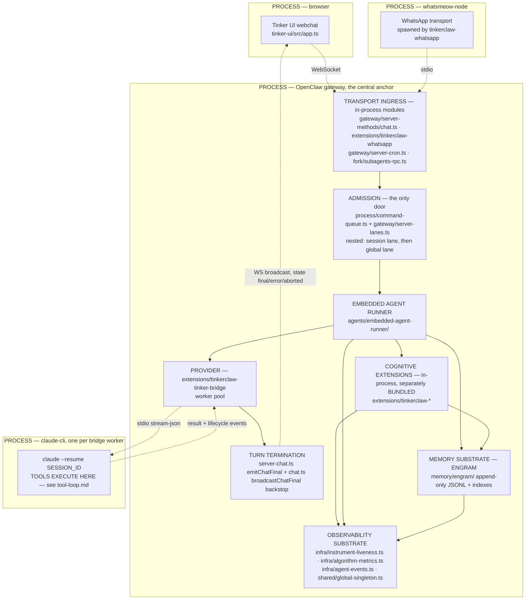
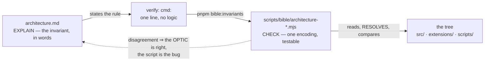
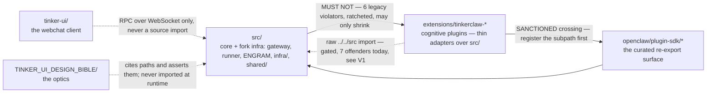

# Architecture — the blueprint

FOUNDATION says _what_ the harness is for. The optics say _how_ each area behaves. This file is the
missing middle: **what shape the system has, and which single mechanism owns each recurring problem
class.**

Its whole reason to exist is one rule:

> **The golden rule.** No two parts of the code do a thing that one well-orchestrated function could
> do. Similar mechanics are governed by a central mechanism, with a diagram that explains it.

A second implementation of a solved problem is not a local inefficiency — it is N−1 latent
contradictions with zero compiler signal (`design-principles.md` #18). The optics answer _"how does X
work?"_; this file answers _"which mechanism is X supposed to be using, and is anything else already
solving that problem a second way?"_

---

## The one-page picture

The distinction most readers get wrong is **process boundary vs in-process module boundary.** Almost
everything fork-side lives in ONE process; the only real process hops are the browser, the WhatsApp
transport, and the claude-cli workers. Dotted edges cross a process boundary; solid edges are
in-process function calls.

**How to read each boundary.** The right-hand column is the point: a boundary tells you what may NOT
be re-solved on the other side of it.

| Boundary                       | What crosses it                            | What must NOT be re-implemented across it                                                                |
| ------------------------------ | ------------------------------------------ | -------------------------------------------------------------------------------------------------------- |
| browser ↔ gateway (process)    | WS frames, token-authenticated             | admission, session identity, the done-signals contract — the UI DERIVES them, it never asserts them      |
| whatsmeow ↔ gateway (process)  | WA frames via `tinkerclaw-whatsapp`        | the trigger contract and delivery (`wa-triggers.md`)                                                     |
| gateway ↔ claude-cli (process) | stream-json NDJSON via tinker-bridge       | the tool loop — tools run INSIDE claude-cli, never re-hosted in gateway code (`tool-loop.md`)            |
| in-process module edges        | function calls, plugin hooks, RPC handlers | lane enqueue, engram append, `declareInstrument`/`noteInstrumentFired`, the config overlay, shared state |

Three consequences worth stating out loud, because each has cost a real incident:

- **Admission is the only door.** Every inbound — a Tinker tab, a WhatsApp message, a cron wake, a
  subagent spawn — converges on the same nested lane queues before any model work starts. Which lane
  a run lands on is load-bearing, not cosmetic: the 2026-07-22 stuck-tabs incident was embedded
  session runs defaulting to the shared `main` lane, where one wedged run froze every Tinker tab.
  The lane table and that don't-regress rule are owned by `topology.md`; do not restate them, but do
  not add a side entrance either.
- **Plugins are modules, not processes — but they are separately BUNDLED.** They load inside the
  gateway, so a plugin that throws on load removes capability silently (`tinkerclaw-round-table` and
  `tinkerclaw-total-recall` are both FAILING to load on a missing `@sinclair/typebox`, per
  `topology.md`). And because the bundles are separate, cross-module state needs the `globalThis`
  mechanism below — a module-level `Map` is per-bundle and will silently split in two, which is how
  `amygdala:nudge-write` went invisible in 2026-07 (`src/infra/instrument-liveness.ts:289`).
- **Tools do not round-trip through the gateway.** Anything that assumes it can observe a tool call
  by watching gateway RPCs is wrong.

Sister processes that are not part of the agent loop (ClawMetry, Mission Control, ollama, the Chrome
relay) are deliberately absent here; the full process/port inventory is owned by `topology.md` and
call sequences by `flows.md`. Neither is repeated.

---

## The central mechanisms

One row per recurring problem class. **Canonical module** is the single place that solves it;
**detail owned by** names the optic allowed to narrate it. Every path and symbol below was opened and
verified on 2026-08-03 and re-measured on 2026-08-04. Keeping it true is not left to discipline:
`scripts/bible/architecture-central-mechanisms.mjs` re-asserts on every run that each module still
exists (`--rung=1`) and still exports what its row claims (`--rung=2`). §"What the four checks
defend" explains why that is two rungs and not one.

| Problem class                     | The ONE mechanism                                                                                                         | Canonical module                                                                                                                                                                                        | Detail owned by                               | Status                                                                   |
| --------------------------------- | ------------------------------------------------------------------------------------------------------------------------- | ------------------------------------------------------------------------------------------------------------------------------------------------------------------------------------------------------- | --------------------------------------------- | ------------------------------------------------------------------------ |
| Admission + serialization         | nested per-lane command queues — the `session:<key>` lane for ordering, then a global lane for cross-session admission    | `src/process/command-queue.ts` · `src/gateway/server-lanes.ts` · `src/agents/embedded-agent-runner/lanes.ts`                                                                                            | `topology.md` (lane table)                    | SINGLE                                                                   |
| Session identity                  | one session-key family, three complementary layers — build/classify at the routing root, derive from context, parse above | `src/routing/session-key.ts` · `src/config/sessions/session-key.ts` (`deriveSessionKey`) · `src/sessions/session-key-utils.ts` (`parse…`)                                                               | `session-naming.md`, `lifecycles.md`          | SINGLE (three layers, not three twins)                                   |
| Turn termination                  | exactly one terminal `chat` broadcast (`final`/`error`/`aborted`) plus an RPC backstop when the lifecycle drops           | `src/gateway/server-chat.ts:865` `emitChatFinal` · `src/gateway/server-methods/chat.ts:1640` `broadcastChatFinal`                                                                                       | `done-signals.md`, `flows.md` F1              | ONE contract, a THIRD private emitter exists — see V4                    |
| Event persistence                 | append-only JSONL, one file per session, never rewritten                                                                  | `src/memory/engram/event-store.ts` (`createEventStore` → `events/<sessionKey>.jsonl`)                                                                                                                   | `memory-layout.md`                            | SINGLE since 2026-08-03 (twin collapsed — see V1)                        |
| Cross-bundle shared state         | one `globalThis[Symbol.for(…)]` slot, resolved per call, never a module-level `const`                                     | `src/shared/global-singleton.ts` — `resolveGlobalSingleton` for caches/registries; live mutable state uses the direct lookup the file names                                                             | this file; bundle-split fact is `topology.md` | SINGLE                                                                   |
| Instrument liveness               | declare and note-fired as SEPARATE calls; a declared instrument that never fires is a defect                              | `src/infra/instrument-liveness.ts`; the report is drained at `src/gateway/server-maintenance.ts:87`                                                                                                     | `design-principles.md` #20, `probes.md`       | SINGLE                                                                   |
| Measurement provenance            | the algorithm-effectiveness ledger — every number carries `source`; store PARTS, never ratios                             | `src/infra/algorithm-metrics.ts` (`recordAlgorithmOutcome`, `MetricProvenance`)                                                                                                                         | `design-principles.md` #20                    | SINGLE mechanism, poisoned inputs — see V2                               |
| Context-fill derivation           | `deriveContextPromptTokens` — parts not ratios, and a value larger than its denominator is REJECTED, never clamped        | `src/agents/usage.ts:247`                                                                                                                                                                               | `design-principles.md` #20                    | **BYPASSED — see V5**                                                    |
| In-process event fan-out          | the agent-event bus                                                                                                       | `src/infra/agent-events.ts` (`emitAgentEvent` / `onAgentEvent`)                                                                                                                                         | `probes.md`, `flows.md`                       | SINGLE                                                                   |
| Config resolution + overlay       | explicit `openclaw.json` wins per key; plugins register runtime defaults once, at load                                    | `src/config/io.ts` (`createConfigIO`) · `src/agents/plugin-provider-config-overlay.ts`                                                                                                                  | `config-shape.md`                             | SINGLE (`src/plugin-sdk/provider-config-overlay.ts` is a pure re-export) |
| Provider execution (claude-code)  | the tinker-bridge worker pool — a persistent claude-cli subprocess per worker                                             | `extensions/tinkerclaw-tinker-bridge/`                                                                                                                                                                  | `tool-loop.md`, `auth-routing.md`             | SINGLE                                                                   |
| Cross-cutting wrapper composition | `wrapper(next)(input) → output`, composed as data rather than nested closures                                             | `src/fork/pipeline.ts` (`compose`, `withRetry`, `withTimeout`, `withTrace`, `withCorrelationId`)                                                                                                        | `design-principles.md` #4                     | SINGLE mechanism, PARTIAL adoption (bespoke closures remain)             |
| Cron wake targeting               | `resolveCronWakeTarget`, reachable ONLY as an injected dep — the timer must never import the wake functions               | `src/gateway/server-cron.ts:222`                                                                                                                                                                        | `crons.md`                                    | SINGLE (restored `e09ba8d4c1e` — see V3)                                 |
| Subagent spawn                    | one RPC; the parent session key is the lever the child inherits                                                           | `src/fork/subagents-rpc.ts` (`fork.subagents.spawn`)                                                                                                                                                    | `subagents-and-recipes.md`                    | SINGLE                                                                   |
| Cross-session edit arbitration    | atomic file leases — `linkSync` claim, `renameSync` replace — behind the Edit/Write hook                                  | `extensions/tinkerclaw-orca/lease-core.mjs`                                                                                                                                                             | `orca-leases.md`                              | SINGLE                                                                   |
| Extension → core crossing         | a curated `openclaw/plugin-sdk/<subpath>` surface, registered and gated                                                   | `scripts/lib/plugin-sdk-entrypoints.json` · gate `scripts/check-no-extension-src-imports.ts` · exemplar `src/plugin-sdk/memory-engram.ts`                                                               | this file (§Layering rules)                   | **INCOMPLETE — see V1**                                                  |
| PII gating                        | one `PII_RE`, two scopes — the push range AND `origin/main..HEAD` accumulated drift                                       | `scripts/pii-pre-push.sh`                                                                                                                                                                               | `pii-boundary.md`, `branch-policy.md`         | SINGLE (collapsed 3 → 1 on 2026-08-03)                                   |
| Duplicate-derivation control      | a counted ledger plus an executable ratchet that fails the build when a count rises                                       | `TINKER_UI_DESIGN_BIBLE/canonical-derivations.md` (frontmatter `verify:`)                                                                                                                               | `canonical-derivations.md`                    | SINGLE                                                                   |
| UI session-activity indication    | ONE PREDICATE · ONE TRIGGER · ONE CLOCK · ONE STATE SET — the UI DERIVES "is it working?", it never asserts it            | `tinker-ui/src/run-state.ts` (`resolveSessionRunState`) · `tinker-ui/src/background-runs.ts` · `tinker-ui/src/pre-model-window.ts` · `tinker-ui/src/app.ts` (`repaintActivitySurfaces`, `activityTick`) | `done-signals.md` §2 #9 + R2                  | SINGLE since 2026-08-17 (six reports to get there — see V6)              |

**Reading the Status column.** `SINGLE` means the row's claim holds today. Anything else names the
second mechanism and points at the evidence below. A row that quietly said `SINGLE` while a twin
existed would make this table worse than no table — the honesty is the entire product.

**If a problem class is not in this table**, either it is not central (solve it locally) or the table
is incomplete. Add the row _before_ writing the second mechanism, not after.

---

## Where the architecture is currently violated

Every item was measured on 2026-08-03 and is reproducible from the paths named. **Counts of
duplicated symbols are owned by `canonical-derivations.md`** and are deliberately not restated here —
this section names the _shape_ of each breach and where its ratchet lives. Only two of these are
ratcheted by this file (V6, the directional import rule; V3, an unreachability property); the rest
are executable elsewhere, and duplicating a live gate here would be the same sin in miniature.

**V1 — TWO gates govern the extension → core boundary, and the crossing they assume does not exist.**
This is the biggest one, and it is structural rather than symbolic.

- The repo-wide gate `pnpm lint:plugins:no-extension-src-imports`
  (`scripts/check-no-extension-src-imports.ts`) forbids production extension files from importing
  `../../src/…`, with a 7-package fork allowlist. Run today it FAILS on **7 non-allowlisted
  production files**: `extensions/browser/src/browser/extension-relay-auth.ts`,
  `tinkerclaw-browser-relay/index.ts`, `tinkerclaw-fractal-reflection/{index.ts,src/fractal-result.ts}`,
  `tinkerclaw-learned-intuition/index.ts`, `tinkerclaw-tinker-bridge/src/{inflight-worker-registry,stream}.ts`.
- The per-extension gate did the same job again in each plugin's `__tests__/scaffold.test.ts`, and on
  2026-08-03 the architect DELETED it from `tinkerclaw-learned-intuition` — see §Layering rules for
  the reasoning, which is the more correct of the two positions.
- The crossing both gates assume — a `plugin-sdk` subpath for the observability substrate — **is not
  registered**: `scripts/lib/plugin-sdk-entrypoints.json` has no entry for `agent-events`,
  `algorithm-metrics` or `instrument-liveness`, which are exactly the three modules
  `extensions/tinkerclaw-learned-intuition/index.ts:21-23` imports.

`canonical-derivations.md` already proved where that ends: with no sanctioned crossing to ENGRAM,
`tinkerclaw-total-recall` vendored a 26-file private copy and drifted for four months, with the
`engram:retrieval-pack-inject` instrument welded to the dead half. The fix was to build the crossing
(`src/plugin-sdk/memory-engram.ts`) and delete the copy. **The same fix is outstanding for the
observability trio.** Until it ships, one problem class has two disagreeing gates and no legal route.

**V2 — one name, several derivations, none declaring which is canonical.** `estimateTokens` is the
ledger's worst entry, and the count _understates_ it, because the copies do not share an input type:

| Site                                  | Signature                       |
| ------------------------------------- | ------------------------------- |
| `src/agents/context-anatomy.ts:123`   | `estimateTokens(chars: number)` |
| `src/memory/engram/event-store.ts:52` | `estimateTokens(text: string)`  |
| `src/fork/deferred-tools.ts:36`       | `estimateTokens(tool: ToolDef)` |

Characters, text, and a tool definition under one name. "Collapse them" is therefore a semantics
reconciliation, not a rename — and any collapse must land the `MetricProvenance` field at the same
time, because none of them declares whether its output is estimated or measured (#20). The cheapest
adjacent collapse is a live numeric disagreement not yet on the ledger: `estimateTokensFromChars` is
`Math.ceil(Math.max(0, chars) / CHARS_PER_TOKEN_ESTIMATE)` at `src/utils/cjk-chars.ts:79` and
`Math.max(1, Math.round(chars / CHARS_PER_TOKEN_ESTIMATE))` at `extensions/ollama/src/stream.ts:546`
— at `chars = 5`, with the estimate at 4, they return **2 and 1**.

**V3 — a second route that skips the canonical derivation (the dangerous shape).** On 2026-08-03 a
new cron wake lane called `runCronWakeOnce` directly instead of through the injected dep, bypassing
`resolveCronWakeTarget` (`src/gateway/server-cron.ts:222`) and re-breaking the 2026-07-25 defect.
Repaired in `e09ba8d4c1e`; the incident itself is narrated in `canonical-derivations.md` §"The two
shapes this failure takes". The architectural point that belongs here: the canonical helper existed
and was correct — **the defence is not its existence but its being the only reachable path.** That
property leaves no duplicate to grep for, so a symbol ledger cannot express it, which is why this
file's frontmatter asserts both halves (four wake deps still resolve through it; the timer still does
not import the wake functions).

**V4 — a third `emitChatFinal`.** `src/tui/embedded-backend.ts:376` is a private method on the
terminal-UI backend with its own `LocalRunState` and `finalSent` flag — a second implementation of
"the turn is over, tell the client", on a surface `done-signals.md` does not cover. This is a
different thing from the sanctioned `broadcastChatFinal` backstop, which is a second _emitter_ of ONE
contract by design (FOUNDATION: "every turn ends in exactly one terminal broadcast with an RPC
backstop"). Not yet on the ledger; recorded here so the next agent finds it before writing a fourth.

**V5 — the context-fill chokepoint is cited in a comment instead of called.**
`src/agents/context-anatomy.ts:441` re-implements the reject-don't-fabricate plausibility gate inline
(`reportedIsPlausible`, falling back to the local char estimate) and closes the reasoning with "Same
rule as the `deriveContextPromptTokens` chokepoint — reject, do not fabricate." The rule is right and
the implementation is right; the problem is that it is a **second** implementation, so the next
correction to `deriveContextPromptTokens` (`src/agents/usage.ts:247`) will not reach the anatomy
path — and that event is the source the timeline, the treemap and the persisted anatomy DB all read.
Shape 2 again, live and unfixed.

**V6 — six `src/` modules reach into `extensions/`** — but not the six this file named yesterday.
`src/agents/tools/whatsapp-history-tool.ts`, `src/plugin-sdk/ollama.ts`, the three
`src/agents/pi-extensions/{cortex,limbic,synapse}-runtime.ts` runtimes, and
`src/fork/attempt-hooks.ts:921`, which reaches `tinkerclaw-tinker-bridge/src/tool-buffer.js` through
a deferred `await import(…)`. Each is a place a plugin can no longer fail to load, be disabled, or be
replaced without breaking core. Ratcheted as a **set**, not a count: swapping one violator for
another keeps the total at six and must still fail.

And that substitution had already happened, silently, under the check written to catch it.
`src/fork/process-message-hooks.ts` left the set on 2026-08-04 — the architect deleted a re-export
that existed only to forward a symbol, which had dragged the whole WhatsApp extension into the
`plugin-sdk` d.ts project and broken `pnpm build`; that file's header narrates it. Meanwhile
`attempt-hooks.ts` had been in the set all along, invisible because the check read only `from "…"`
and never a dynamic `import(…)`. One out, one in, total unchanged, gate green. The lesson is not
about regexes: **a ratchet that only asks "is anything NEW here?" cannot see a swap, and a paid-off
entry left in its known set is a standing permission slip** — nothing stops the retired import from
quietly returning. The check now fails in both directions, so retiring a violator forces the set to
shrink in the same commit.

Deferring an import is a mitigation, not an absence. `attempt-hooks.ts` boots fine with the bridge
extension missing, which is genuinely better than a static import — but core still names an optional
component, so the row stays until the shared code moves down into `src/` or the extension registers
into it.

**V7 — a whole module duplicated and already diverged: MMR.** `src/memory/mmr.ts` and
`extensions/memory-core/src/memory/mmr.ts` export the same nine symbols — `MMRItem`, `MMRConfig`,
`DEFAULT_MMR_CONFIG`, `tokenize`, `jaccardSimilarity`, `textSimilarity`, `computeMMRScore`,
`mmrRerank`, `applyMMRToHybridResults` — and the two files already differ (the extension copy added
CJK unigram/bigram tokenization the core copy does not have). V1's shape at module scale, **not yet
on the ledger**; add the row before the two rerankers start returning different orderings for the
same query.

**Not a violation — do not "fix" these.** Extensions sharing the `src/` observability substrate is
the _intended_ direction (see below); what is missing is the sanctioned crossing, not the sharing.
The third `deliverWebReply`, in `extensions/whatsapp.disabled-hostver/`, is a KEEP-DORMANT upstream
overlay that FOUNDATION requires (`FOUNDATION.md:133`, overlay-not-delete).
`src/plugin-sdk/provider-config-overlay.ts` is a pure re-export, not a second mechanism. Recording
which duplicates are policy and which are debt is the difference between a ledger and a list of
complaints.

---

## What the four checks defend

The frontmatter carries four `verify:` entries, and each is a one-line pointer at a script under
`scripts/bible/`. That split is FOUNDATION's, not a matter of taste: **explaining** is this file's
job, **enforcing** belongs to the running code, and **checking that this file still matches the tree**
is CI — and CI wants linting, review and tests of its own, none of which a program pasted into YAML
can have (`FOUNDATION.md` §"Three different jobs, three different homes"). Until 2026-08-04 this
optic carried 121 lines of Python above its first sentence of prose, and both bugs found in that
Python survived review for the same reason: the only way to exercise it was to copy it out of the
document and back.

Nobody should have to open a script to learn what it is protecting:

| Check                                          | The invariant, in one sentence                                                                                                                                                    | What it costs when it lapses                                                                                                                                                                                                                   |
| ---------------------------------------------- | --------------------------------------------------------------------------------------------------------------------------------------------------------------------------------- | ---------------------------------------------------------------------------------------------------------------------------------------------------------------------------------------------------------------------------------------------- |
| `architecture-layering-ratchet.mjs`            | No module under `src/` reaches into `extensions/` — by static import, dynamic `import()`, or `require()` — beyond the six legacy violators in V6, and that set may only shrink.   | Core starts depending on optional components: the plugin can no longer fail to load, be disabled or be swapped without breaking the gateway, and the bundle graph grows a cycle.                                                               |
| `architecture-central-mechanisms.mjs --rung=1` | Every canonical module named in the central-mechanisms table exists on disk.                                                                                                      | The table points nowhere. Either the mechanism moved and the row is stale, or a problem class lost its owner — and the next agent, finding no owner, writes the second implementation.                                                         |
| `architecture-central-mechanisms.mjs --rung=2` | Each of those modules still exposes the entry point its row claims.                                                                                                               | The quieter half. The file survives a refactor that renamed its export, so the table still _looks_ true while every row citing it has decayed into folklore.                                                                                   |
| `architecture-cron-wake-injection.mjs`         | The cron wake target is resolved only through the injected `resolveCronWakeTarget`, and `src/cron/service/timer.ts` never acquires the wake functions itself, by any import form. | The 2026-07-25 defect returns and wakes fire against the wrong session key. This is the one invariant here with no duplicate to grep for — it is a property of what is _reachable_, so it needs both a positive and a negative assertion (V3). |

Two of the four are **ratchets rather than assertions**, and that is deliberate. The layering rule
describes a direction the tree has not finished travelling; asserting it outright would fail the
first build and get the check switched off, which is precisely how `estimateTokens` reached double
digits. A counted debt that fails when it grows is worth more than a comfortable claim that passes —
and, as V6 now records, a ratchet must also fail when a debt is _paid_ and left in the ledger.

The scripts RESOLVE specifiers rather than pattern-matching them, which is why the layering check no
longer needs a `(?<!pi-)` lookbehind to keep `src/agents/pi-extensions/…` out of the results: that
path resolves under `src/`, so it simply is not a crossing. Resolution also closes the reverse hole a
substring match leaves open — `tsconfig.json` maps `@openclaw/*` onto `./extensions/*`, so a bare
specifier can land in `extensions/` without ever containing the word. They also prune `node_modules`
and `dist` _during_ the directory walk rather than filtering afterwards — a recursive glob over an
extension tree walks its `node_modules` and hangs the whole bible gate, which has happened once
already.

The scripts are an ENCODING of what is written above, never its source. When a script and this file
disagree, **this file is right and the script is the bug** — fix the script; or, if the rule itself
moved, change the prose first and the encoding second.

---

## Layering rules

**The direction extensions → `src/` is allowed, and for the observability substrate it is required.**
On 2026-08-03 the architect removed the `no-src-imports` assertion from
`extensions/tinkerclaw-learned-intuition/__tests__/scaffold.test.ts`. Its removal comment states why:
the rule had been red for weeks because `index.ts` imports exactly three things from core —
`agent-events`, `algorithm-metrics` and `instrument-liveness`, _"i.e. the observability substrate we
WANT every extension to share"_. A boundary that forbids the one thing that must not be duplicated
was "pushing extensions toward their own copies, which is how the 26-file engram twin and the
10-file amygdala twin were born." A rule written to prevent coupling produced duplication instead,
which is strictly worse: **coupling is visible, a drifting twin is not.** The comment also names the
right shape — "a curated plugin-sdk re-export, not a grep" — and `src/plugin-sdk/memory-engram.ts` is
the proof it works. So: share the substrate, never copy it; and when you share it, **register the
subpath in `scripts/lib/plugin-sdk-entrypoints.json` and import `openclaw/plugin-sdk/<subpath>`**
rather than a relative `../../src/…` path, which the repo-wide gate still rejects (V1).

**`src/` MUST NOT import from `extensions/`.** `src/` is the substrate; extensions layer on top. An
import in that direction makes core depend on an optional component — the plugin can no longer fail
to load, be disabled, or be swapped without breaking the gateway — and puts a cycle in the bundle
graph. The claim is **directional, not currently true** (V6), so the frontmatter ships a ratchet
rather than an assert: stating the rule while the tree breaks it is the honest position; asserting it
would fail the first build and get the check switched off, which is exactly how `estimateTokens`
reached double digits. To retire a violator, move the shared code **into** `src/` and import it from
both sides, or invert the dependency so the extension registers into a `src/` registry (the
`setIngestionRuntime` / `setLinkBuilderRuntime` pattern in
`src/agents/embedded-agent-runner/extensions.ts:174,181`) rather than core reaching outward.

**`tinker-ui/src` talks to the gateway over RPC only.** It is a separate process and cannot import
harness source at all.

---

## How to add a feature without breaking the architecture

1. **Name the problem class before naming the feature.** "I need to know when this turn ended" is a
   problem class; "add a done flag" is a second mechanism.
2. **Look it up in the central-mechanisms table.** If the class has a row, call that mechanism — not
   a wrapper around it, not a copy tuned to your case. Read §"currently violated" too: the mechanism
   may exist and already have been bypassed once.
3. **If no row exists**, place the code by the one-page picture — transport ingress, admission,
   runner, provider, memory substrate, observability substrate, or a `tinkerclaw-*` extension — and
   **add the row in the same commit**, with its canonical module and the optic that will own its
   detail. A mechanism absent from this table is invisible to the next agent, who will write the
   second one.
4. **Respect the layering direction.** Extensions reach `src/` through a registered `plugin-sdk`
   subpath; `src/` does not import `extensions/`. If you need the reverse, invert it with a
   registration hook. If the crossing you need does not exist, **ship the crossing** — do not vendor
   a copy and do not weaken the gate.
5. **Make the canonical path the only reachable one.** Injected beats importable; documented-as-
   canonical is the weakest form. V3 is what the documented-only version costs.
6. **Wire observability with the feature, not after it** (FOUNDATION first-principle #4,
   `design-principles.md` #9): `declareInstrument` + `noteInstrumentFired` at the real call site, and
   `recordAlgorithmOutcome` with a `source` for any value that will be compared, displayed, or
   decided upon (#20). Registration is static; being on the traffic path is dynamic, and only the
   second is worth anything.
7. **Pair the write surface with a read surface** (#11) and **add the `verify:` in the owning optic
   in the same commit** (#16) — a one-line `cmd:` pointing at a script in `scripts/bible/`, never an
   inline program. A rule that cannot fail a build does not hold a line — that is
   `canonical-derivations.md`'s founding observation; a check that cannot be tested barely holds one
   either.
8. **Finish at `canonical-derivations.md`.** If the concept is in the ledger, call the canonical
   implementation. If you collapsed two, LOWER the cap in the same commit. If it is a new
   must-be-singular concept, add the row and the incident that paid for it. A concept computed but
   not registered there is a future redundancy already in flight.

## Don't regress

- **A new row in the central-mechanisms table is a promise.** Adding one without a `verify:` that
  asserts its module and entry point turns this file into folklore within a month. Add it to the
  `MECHANISMS` table in `scripts/bible/architecture-central-mechanisms.mjs`, not to the frontmatter:
  a `verify:` here is a POINTER, never a program (`FOUNDATION.md` §"Three different jobs, three
  different homes"). A check that lives only inside YAML cannot be linted, reviewed or tested except
  by copying it out of the document — which is how both bugs in the version this file shipped on
  2026-08-03 survived review.
- **Never write `SINGLE` to make the table look better.** A row that names its second mechanism is
  the table doing its job; a false `SINGLE` is the bug being recorded as policy — the exact costume
  `canonical-derivations.md` was written to strip off.
- **The V6 ratchet may only shrink — and when a debt is paid, it must.** Enlarging the known-violator
  set is not a fix; it is a seventh place where core depends on a plugin. Retiring one is not
  optional bookkeeping either: a paid-off entry left in the set is a permission slip for the import
  to come back unnoticed. The check fails in both directions for exactly that reason, so the same
  commit that removes the dependency removes its line.
- **Do not re-introduce a scaffold rule banning `extensions/` → `src/infra` imports.** That ban is
  what grew the twins in V1. Build the crossing instead.
- **Do not re-vendor a `src/` subsystem under an extension.** Import it, or register a `plugin-sdk`
  re-export.
- **Do not use a module-level `Map` for state two bundles must share.** It splits silently; use the
  `globalThis` mechanism.
- **Counts live in the ledger, not here.** If you find yourself writing a number of implementations
  into this file, you are re-deriving a fact `canonical-derivations.md` owns — which is the very
  failure this optic exists to describe.
