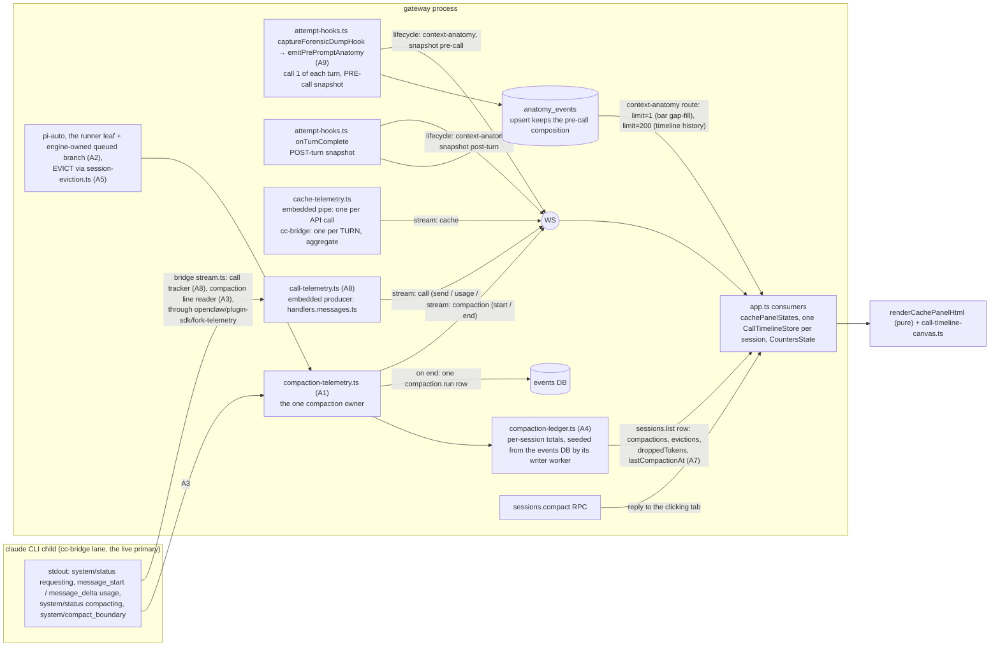

# CONTEXT WINDOW panel — data contract, findings, principles, call timeline

> Written 2026-09-24, before any fix, because the architect asked for exactly that order: _"the right
> procedure is to create a document in the bible about this particular mechanism, and then code it.
> The design principles are important to leave behind, they help us make less mistakes when coding."_
>
> The report that opened it: the **EVICT** and **COMPACT** buttons do not work; the **evicted** and
> **compactions** counts are always 0; _"it does not make sense to have a context window bar where we
> try to visualize how much input tokens we use every turn, while at the same time showing the
> results, that overflow the bar. And then we realize that the ethics, the most important asset, was
> being cut off from the bar."_ And a new visualisation: two horizontal lanes on a time axis — tokens
> we send on top, tokens coming back underneath — growing in real time, with the whole observed span
> always fitting the available width.

Every claim below carries its evidence. "Code-evident" means read in the source at
`last_verified_commit`; "measured" means counted on the live deployment on 2026-09-24; anything else
is marked **UNVERIFIED** and collected in §8. §1-§2 describe the code at `last_verified_commit`,
by identifier first (identifiers survive edits, line numbers do not; a line number kept from the first
draft is as found at 3e60ec36dd4). §3's findings keep the file:line evidence of 3e60ec36dd4, where
they were found, and each one now opens with its status and the commit that changed it.

## 1. What exists today

### 1.1 Where it lives

- A static `.model-group` (`data-section="cache"`, `id="cache-panel"`) inside MODELS, directly above
  the EEG (the static markup in `tinker-ui/src/app.ts`). The label carries the two buttons
  (`data-cache-act="evict"` / `"compact"`, their tooltip text owned by `CACHE_ACT_DESCRIPTION` in
  `tinker-ui/src/panels/context-buttons.ts`). The group body holds TWO siblings: `#cache-panel-body`,
  which is rewritten, and `#cache-timeline`, the call timeline's static host, mounted once (P9, B5).
- `renderCachePanel()` rewrites `#cache-panel-body.innerHTML` on **every** cache, anatomy, compaction
  or session-row event, through the pure renderer `renderCachePanelHtml`
  (`tinker-ui/src/panels/context-cache.ts`), then repaints the buttons (`paintCacheButtons`) and points
  the call timeline at the viewed session (`syncCallTimeline`). Anything stateful placed inside the
  body is destroyed within one model call — the constraint P9 exists for.
- Four sections: **WINDOW** (the only bar: a fixed 1M-token ruler, `CONTEXT_SCALE_TOKENS`, with the
  model's own window drawn as an outline and any excess blinking red; the figure above it is the sum
  of the spans drawn, and the meta line badges `· pre-call` / `· post-turn` from the row the
  composition came from), **THIS CALL** — headed **THIS TURN (aggregate)** when the billed figure is
  larger than the window (the cue that it is a turn sum; P5, and F7 for the sums it misses) —
  (numbers: moral code / cached / written / new / unitemised / evicted / output),
  **THIS SESSION** (numbers: turns / calls / compactions / evictions / dropped / saved, joined by
  `sessionCounters` in `tinker-ui/src/panels/context-counters.ts`), and the **CALL TIMELINE** canvas
  in `#cache-timeline` (§5; `panels/call-timeline.ts` + `panels/call-timeline-canvas.ts`).
- The 1M ruler and the outline are architect decisions of 2026-08-28; the "unbounded values are numbers,
  not bars" rule is 2026-08-29. Both stand; nothing below reverses them.

### 1.2 Data flow



### 1.3 State and lifetime

| State                                                                                                          | Where                                                                                                | Lifetime                                                                                             |
| -------------------------------------------------------------------------------------------------------------- | ---------------------------------------------------------------------------------------------------- | ---------------------------------------------------------------------------------------------------- |
| per-session call/composition state (`CachePanelState`, with `compositionSnapshot` and the row's run and round) | `cachePanelStates`, app.ts                                                                           | page memory                                                                                          |
| per-session call record (`CallTimelineStore`: calls, tools, compaction bands, turns)                           | `callTimelineStores`, app.ts; at most 16 (`CALL_TIMELINE_MAX_STORES`), never evicting the viewed one | page memory; history re-seeded from the session's anatomy rows (limit 200)                           |
| THIS SESSION live facts (`CountersState`: live calls, watched drops, press halves awaiting a pair)             | `cacheCounterStates`, a `WeakMap` keyed by the session's `CallTimelineStore`                         | page memory, bounded by the store LRU                                                                |
| THIS SESSION counts (compactions, evictions, dropped, last compaction)                                         | the session's `sessions.list` row (A7), from the gateway's compaction ledger (A4)                    | durable: `compaction.run` rows in the events DB; the ledger's memory is re-seeded after a restart    |
| lifetime compaction count (`SessionEntry.compactionCount`)                                                     | session store; on the row since A7                                                                   | session store; the UI reads it only as the FLAGGED fallback while the row carries no ledger          |
| backfill latches                                                                                               | `cacheBackfilled`, `callTimelineBackfilled`, app.ts                                                  | page memory; the timeline's latch re-arms 30 s after a failed fetch                                  |
| button state (RPC in flight, compaction started-at, nothing-to-do, armed confirm)                              | `cacheActInFlight`, `compactionStartedAt`, `cacheActNothingToDo`, `cacheActArm`, app.ts              | page memory, per session; replaced the tab-global `cacheBusyDepth` and the `cacheSessionStats` tally |

## 2. Live signal inventory — what is known, and when

| Signal                     | Producer                                                                                                                                                                       | Lane                                                                                           | Known                                       | Exact?                                      | Today                                                                                                                                                               |
| -------------------------- | ------------------------------------------------------------------------------------------------------------------------------------------------------------------------------ | ---------------------------------------------------------------------------------------------- | ------------------------------------------- | ------------------------------------------- | ------------------------------------------------------------------------------------------------------------------------------------------------------------------- |
| turn submitted             | `chat.send` ack, `lifecycle` start                                                                                                                                             | both                                                                                           | live                                        | exact time                                  | live                                                                                                                                                                |
| gateway preparation phases | `turn-phase` / `turn-stage` streams                                                                                                                                            | both                                                                                           | live, before the model                      | exact durations                             | live                                                                                                                                                                |
| per-call SEND time         | `stream:"call"` phase `send` (A8): the bridge maps the CLI's `system/status` `requesting` line                                                                                 | cc-bridge only                                                                                 | when the request leaves                     | exact                                       | live on cc-bridge; the embedded lane has none (U5 answered: pi hands the subscriber no send moment). The dead `lifecycle:round-start` pair is DELETED (568a2e20ca4) |
| per-call composition       | `lifecycle:context-anatomy`, twice per turn: `snapshot:"pre-call"` from `captureForensicDumpHook` (A9, call 1 of each turn), then `snapshot:"post-turn"` from `onTurnComplete` | both; on cc-bridge it measures the gateway's pi mirror                                         | before call 1; again at the end of the turn | estimated, ceil(chars/3.5)                  | live; the bar keeps the pre-call row (F5 RESOLVED). None on a session's first turn per process, none for tool-loop calls 2+                                         |
| exact input + cache split  | `stream:"cache"` (`src/infra/cache-telemetry.ts`, embedded producer in `handlers.messages.ts`); per call: `stream:"call"` `usage` / `end`                                      | embedded: per API call; cc-bridge `cache`: one per turn, aggregate; cc-bridge `call`: per call | end of call / end of turn                   | exact / aggregate                           | live; the call timeline never draws the cc-bridge `cache` aggregate as one call, but THIS CALL and the bar still do whenever the sum fits the window (F7)           |
| exact input at call START  | `stream:"call"` `usage` = Anthropic `message_start.message.usage` (bridge, A8); embedded: the first streamed update that carries usage                                         | both                                                                                           | first usage of each call                    | exact                                       | live (A8)                                                                                                                                                           |
| exact output per call      | `stream:"call"` `end` (`message_delta.usage` on cc-bridge, pi's `message_end` embedded); `cache.output` (embedded)                                                             | both                                                                                           | end of call                                 | exact                                       | live on both lanes (A8)                                                                                                                                             |
| thinking deltas            | `stream:"thinking"` {text, delta} (`embedded-agent-subscribe.ts`; the bridge feeds it)                                                                                         | both                                                                                           | live per delta                              | chars, so estimated                         | live                                                                                                                                                                |
| text deltas                | `stream:"assistant"` {text, delta} (`handlers.messages.ts`)                                                                                                                    | both                                                                                           | live per delta                              | chars, so estimated                         | live                                                                                                                                                                |
| tool start / result        | `stream:"tool"` (`handlers.tools.ts`; the bridge's stream.ts)                                                                                                                  | both                                                                                           | live                                        | exact times                                 | live                                                                                                                                                                |
| turn output total          | `stream:"effort"` final `output_tokens` (`src/infra/effort-telemetry.ts`; the bridge)                                                                                          | both                                                                                           | end of turn                                 | exact (cc-bridge: aggregate)                | live                                                                                                                                                                |
| compaction start / end     | `stream:"compaction"`, built ONLY by `compaction-telemetry.ts` (A1) for every executor (P7's trigger map)                                                                      | both: pi-auto, runner, EVICT (embedded / mirror); CLI (cc-bridge)                              | start + end                                 | src/ producers "estimated", the CLI "exact" | live. pi's own decider is still off in engram mode by design (F3c); the runner, EVICT and the CLI are heard                                                         |
| CLI-internal compaction    | stdout `system/status` `compacting`, then `system/compact_boundary` with snake_case `compact_metadata` (§6.0 b), read by the bridge (A3)                                       | cc-bridge                                                                                      | start + end                                 | exact                                       | live (A3, d904a1e1e1f): one `start` (latched), one `end` per boundary; a `compact_result:"failed"` status ends it incomplete                                        |
| manual compaction result   | `sessions.compact` reply (the eviction branch in `src/gateway/session-eviction.ts`)                                                                                            | both                                                                                           | end of RPC                                  | evict: chars/3.5; compact: engram chars/4   | reply to the clicking tab; the executor's A1 `end` reaches every tab and the ledger                                                                                 |
| durable compaction count   | the compaction ledger (A4), on the `sessions.list` row with `SessionEntry.compactionCount` (A7)                                                                                | every executor (the ledger); gateway-side only (`compactionCount`)                             | once the ledger is seeded                   | exact counts                                | live; ABSENT (not 0) on the first listing after a gateway start, until the seed answers                                                                             |

**cc-bridge signals still dropped:** the CLI's effective window, `result.modelUsage[model].contextWindow`
on every turn (exact, the CLI's own; the bridge's `CcStreamStdoutResult` does not declare it and nothing
reads it) — P12's source, owed (F8). Whether the CLI also sends `requesting` for a subagent's
requests is UNVERIFIED: if it does, each shows up as a send that the next main-thread request ends with
no counts (the bridge ignores `stream_event` lines that carry a `parent_tool_use_id`).

**Summary.** Known LIVE on both lanes: the timing of every thinking/text delta and every tool call,
each call's exact usage and output (A8), and every compaction the gateway or the CLI runs (A1-A3,
A5). Known exactly per call with a send time only on cc-bridge; the embedded lane's send is inferred
(§5.4). Known at the START of the turn: the pre-call composition of call 1 (A9). Known only at the
END of the turn: the cc-bridge `cache` aggregate and the post-turn composition. **Still dropped:** the
CLI's effective window (F8). **Missing outright:** a per-call send timestamp on the embedded lane (U5,
answered: pi exposes none).

## 3. Findings (root causes)

**Measured 2026-09-24 over the previous 30 days** (the gateway journal, plus the claude CLI's own
transcripts under the bridge's default working directory, `resolveDefaultCwd` in
`extensions/tinkerclaw-tinker-bridge/src/defaults.ts`) — because a count is evidence to decompose,
not a verdict:

| Event class                                                                       | Count | Reached the panel?                        |
| --------------------------------------------------------------------------------- | ----- | ----------------------------------------- |
| gateway gate `preemptive` decided to compact (`[compaction-diag] ... fires=true`) | 13    | no (F3b)                                  |
| gateway gate `tool-loop-guard` fired                                              | 5     | no (F3b)                                  |
| gateway gate `preflight/memory-flush` fired (a memory flush, not a compaction)    | 49    | n/a                                       |
| `sessions.compact` RPCs, all `res ✓`, 23.2–78.9 s each                            | 5     | the clicking tab only, until reload (F3e) |
| CLI-internal compactions (`type:"system"`, `subtype:"compact_boundary"` records)  | 9     | **no** (F3a)                              |

The nine CLI records all carry `trigger:"auto"`, `preTokens` 167k–981k, `postTokens` 7.7k–15.3k and
`durationMs` 121–217 s (lines that merely mention the string were excluded). Whether each `fires=true`
gate decision completed a compaction is not logged there. Separately, the gateway's
`instrument-liveness` reported on 2026-09-24 that `compaction:engram-executor` had **never fired**
since the last restart (~11 h). So the headline "the counter is always 0" decomposes into:
gateway-side compactions are genuinely rare (1M windows; the same journal shows fills of 3–38%),
**and** every compaction that did happen was invisible to the panel.

**Status at 5dea8d5fc15 (2026-09-25).** The measurement's second half is closed in code: every
compaction class in the table above now reaches the panel through the one owner (A2 for the
gateway's gates, A3 for the CLI's, A5 for EVICT); watching one arrive live is still owed (U11).
Its first half was never a defect — gateway-side compactions are rare on 1M windows — and the
panel now prints 0 only after reading a ledger that says so (P10). Each finding
below keeps its original evidence and opens with this status; the fixing commits carry their own
controls.

| Finding | Status                              | Changed by                                                            | Still open                                                                                                               |
| ------- | ----------------------------------- | --------------------------------------------------------------------- | ------------------------------------------------------------------------------------------------------------------------ |
| F1      | RESOLVED, primary lane              | A5 `bc5c36fb0c2`, `a893546e726`; B4 `77b2cf3372a`                     | U7; the reply's `tokensAfter` write double-counts Results (F5)                                                           |
| F2      | RESOLVED, button + typed `/compact` | B4 `77b2cf3372a`; A6 (option i, 2026-09-25 wave)                      | the `sessions.compact` RPC, called directly on the lane, still compacts the mirror                                       |
| F3a     | RESOLVED                            | A3 `d904a1e1e1f` (through the `3e607f8ec59` subpath)                  | —                                                                                                                        |
| F3b     | RESOLVED                            | A2 `4d2a4736ecf`; measured drop `a23b9a53ea3`, `263ae1cf971`          | a non-legacy engine that owns compaction, called from `run.ts`, stays silent (tier-1)                                    |
| F3c     | SUPERSEDED                          | `c44bcef86fe`, `812a9ab599d`                                          | pi's decider stays off in engram mode, by design                                                                         |
| F3d     | RESOLVED                            | B3 `cdee07eca5d`                                                      | —                                                                                                                        |
| F3e     | RESOLVED                            | A4 `332348d3319`, A7 `c0928c0452d`, B3 `cdee07eca5d`, `e8fc009ca69`   | `saved` and THIS CALL's `evicted` stay page-scoped, and say so                                                           |
| F4      | PARTLY RESOLVED                     | B3 `cdee07eca5d`, `eb148250396`; A5 `bc5c36fb0c2`                     | two estimate ladders in the dropped totals (P11); a partial drop sum reads as the total                                  |
| F5      | RESOLVED, two gaps                  | A9 `ac2160c717b`, `e7571a80356`; `a4d74c8bdbf`; B2 host `01452df3ac4` | no pre-call row on a session's first turn per process; a reply's `tokensAfter` double-counts                             |
| F6      | OPEN on cc-bridge                   | B1 + B2 `0fe537b2e49`; A9 `ac2160c717b`                               | cc-bridge rows paint ABSENT for a pack the CLI did receive (U8); the second marker literal                               |
| F7      | PARTLY RESOLVED                     | B2 `0fe537b2e49`; A8 `de82e7a412f`; B3 `cdee07eca5d`                  | a cc-bridge turn sum that fits the window is still headed THIS CALL and drives the bar (`usageProvenance` has no writer) |
| F8      | OPEN                                | —                                                                     | the CLI's own window is not read (P12)                                                                                   |
| F9      | RESOLVED                            | B6 `39947563790`; `568a2e20ca4`; A9                                   | —                                                                                                                        |
| F10     | RESOLVED                            | B4 `77b2cf3372a`                                                      | —                                                                                                                        |
| F11     | RESOLVED                            | A3 `d904a1e1e1f`; B4 `77b2cf3372a`; `cdee07eca5d`                     | a live CLI compaction pulsing end to end is UNVERIFIED                                                                   |
| F12     | PARTLY RESOLVED                     | A1-A5 events on the bus; A7 row; B3 re-read                           | the reply's bar overwrite and its toast stay in the clicking tab                                                         |

### F1 — EVICT does not shrink what the model sees on the primary lane, and the bar never moves

- **Status: RESOLVED 2026-09-24 on the primary lane (A5 `bc5c36fb0c2`, routed through A1 by
  `a893546e726`; B4 `77b2cf3372a`).** The eviction moved to `src/gateway/session-eviction.ts`
  (`evictSessionTranscript`; `sessions.ts` keeps one delegating call). It REFUSES, before it
  interrupts the run or opens the transcript, on a lane whose runtime owns the context — claude-code
  and every registered CLI backend (`resolveContextOwningRuntime`: `isCliProvider` over the live
  config) — resolved with the same `resolveSessionModelRef` the narrative branch uses, and replies
  `{ok:false, compacted:false, reason}`. The UI disables EVICT on claude-code with that reason (B4);
  another CLI backend's press still reaches the gateway, is refused there, and the refusal shows as
  an error toast. On an embedded lane the reply now carries `tokensBefore` / `tokensAfter` next to
  `evictedTokens`, all ceil(chars/3.5) over message CONTENT (the old figure measured the whole JSON
  entry, 1.16× the content), and the UI writes `tokensAfter` over the conversation segment, so the bar
  moves. A busy session asks for a confirming second press within 4 s (non-blocking). Still open: U7,
  and that write double-counts Results (F5, last bullets). The evidence below is as found at
  3e60ec36dd4.

- **Wrong target (code-evident).** `evict` → `sessions.compact {key, keepFraction: 0.5}`
  (`app.ts:2054-2057`) → the eviction branch rewrites the gateway's pi transcript
  (`sessions.ts:2046-2131`). On the claude-code lane the model's context is the claude CLI's OWN
  transcript, resumed with `--resume <sessionId>` (`extensions/tinkerclaw-tinker-bridge/src/worker.ts:736`).
  The bridge's worker key hashes the OpenClaw sessionId (`stream.ts:142-165`); eviction does not change
  the sessionId, so the same worker resumes the same untouched CLI transcript. The next call's prompt is
  as large as before.
- **The bar cannot move (code-evident).** The eviction reply carries no `tokensAfter`
  (`sessions.ts:2112-2124`), and `app.ts:2101-2114` only overwrites the composition when `tokensAfter`
  is present; the follow-up backfill is gap-fill only (`app.ts:1897-1910`). So even on an embedded lane
  where the eviction is real, the bar keeps showing the pre-eviction composition until the next turn.
- **Silent side effect.** Both branches call `interruptSessionRunIfActive` (`sessions.ts:2055-2067`,
  `2134-2146`): pressing a button during a turn aborts that turn. Nothing warns, nothing is disabled.
- A live before/after on an embedded lane is **UNVERIFIED** (U7).

### F2 — COMPACT compacts the wrong transcript on the primary lane

- **Status: RESOLVED for the button and a typed `/compact` (A6 option (i), the 2026-09-25 wave);
  OPEN for a direct `sessions.compact` call.** B4 (`77b2cf3372a`) first mitigated it by disabling
  COMPACT on the claude-code lane. Since A6 (§6.1 _A6 as landed_) the button sends the CLI's own
  `/compact` as a turn (`cacheActRoute`, never the RPC there), a typed `/compact` passes through the
  gateway's command handler on that lane instead of compacting the mirror, and the bridge writes it
  to the CLI bare, so both compact the context the model actually reads. What A6 did NOT change: the
  RPC. `sessions.compact {key}` called directly on a claude-code session still runs the narrative
  branch below and compacts the gateway's mirror. Since A2 such a compaction is heard with
  `lane:"cc-bridge"` and a non-`cli-internal` trigger, so the events DB row says it did not shrink
  the model's context; the ledger's `compactions` count on the session row does not split them (only
  `cli-internal` shrinks what the CLI resends). The evidence below is as found before A6; the line
  numbers are 3e60ec36dd4's (the narrative branch's call is `sessions.ts:1957` at `5dea8d5fc15`).
- `compact` → `sessions.compact {key}` → `compactEmbeddedPiSession` (`sessions.ts:2152-2170`). No
  extension registers an agent harness for claude-code (on this tree only the codex extension registers
  one), so the tinker-bridge runs on the **pi** harness, `maybeCompactAgentHarnessSession` returns `undefined`
  (`src/agents/harness/selection.ts:295-304`) and the context engine compacts the gateway's pi
  transcript; under `compaction.mode = "engram"` that is the pointer/marker executor
  (`src/agents/pi-extensions/compaction-engram.ts:109-294`).
- The transcript is not rotated (`truncateAfterCompaction` does not appear in the live `openclaw.json`,
  checked 2026-09-24; `compaction-successor-transcript.ts:29-31`), so the sessionId, the bridge worker
  key and the CLI's `--resume` target are unchanged: **the claude CLI's context is not compacted**
  (code-evident; a live before/after capture is U3's first half).
- The RPC does return: 5 × `res ✓` in 30 days, 23–79 s each (measured). The architect's earlier "it
  churned for a while, and nothing" (2026-09-07) is this: real work on a transcript the model does not
  read.
- On the claude-code lane the only lever that shrinks the model's context is inside the CLI (its own
  compaction). Whether a `/compact` line written to the worker's stream-json stdin triggers it is **U3**.
  _Answered live 2026-09-25 (§6.0 c): it does, when the line starts with `/compact`; A6 is built on it._

### F3 — `compactions` is always 0: blind producers, a wrong seed, no durable read

- **F3a (code-evident + measured) — the CLI's compactions are dropped.** The claude CLI records every
  internal compaction with exact numbers (§3 table). The bridge handles only `system/init`
  (`worker.ts:1074`) and never looks for `compact_boundary`; the only parser of that record in the repo
  is the history importer (`src/gateway/cli-session-history.claude.ts:630-659`), which feeds chat
  history, not telemetry. 9 compactions on the primary lane in 30 days, 0 reached the panel. They also
  ran 2–3.6 minutes each with **no busy pulse**, reading as a hang (F11).
  **RESOLVED 2026-09-24 (A3, `d904a1e1e1f`).** The bridge's `stream.ts` gained a pure
  `createCompactionLineReader()` (one per turn) and a `system` arm at the end of `handleLine` that hands
  every event it yields to `emitCompactionTelemetry`, through `openclaw/plugin-sdk/fork-telemetry`
  (§6.1, _A3 as landed_). Gate 5 (`bridge-hears-compact-boundary`) replaced this finding's pin.
- **F3b (code-evident) — the runner's compactions emit nothing.** The runner's recovery gates call
  `contextEngine.compact(...)` and bump `autoCompactionCount` (e.g. timeout recovery,
  `src/agents/embedded-agent-runner/run.ts:1225-1266`); `compact.queued.ts:154-164` does the same for
  queued compactions. Neither emits `stream:"compaction"`.
  **RESOLVED 2026-09-24 (A2, `4d2a4736ecf`),** without touching `run.ts` or `attempt.ts`: every runner
  gate reaches the leaf `compactEmbeddedPiSessionDirect` through the legacy engine's
  `delegateCompactionToRuntime`, and the leaf and the engine-owned queued branch each emit one pair
  (§6.1, _A2 as landed_). Not covered: a non-legacy engine that owns compaction is called by `run.ts`
  directly and stays silent unless it delegates to the leaf; wiring it needs the tier-1 `run.ts`.
- **F3c (code-evident) — the only emitter is switched off by design.** `stream:"compaction"` is emitted
  only by pi's own decider (`handlers.compaction.ts`, published through the A1 owner
  `src/infra/compaction-telemetry.ts` since 2026-09-24), and
  `shouldDisablePiAutoCompaction` disables that decider whenever the mode is not `"default"`
  (`src/agents/pi-settings.ts:150-158`); the live mode is `"engram"`. The UI consumer
  (`app.ts:9254-9288`) is correct and has nothing to hear.
  **SUPERSEDED 2026-09-25.** pi's decider is still off in engram mode, by design, but it is no longer
  the only emitter (A2, A3, A5). Its own events now carry the full A1 contract (`c44bcef86fe`: trigger
  `pi-auto`, lane from pi's session model, provenance `estimated`) and the run's session key
  (`812a9ab599d`), so its rows count for their session in the ledger.
- **F3d (code-evident) — the reload seed reads a per-ATTEMPT counter.** `backfillCachePanel` seeds
  `compactions` from the anatomy row's `compactionCycle` (`app.ts:1941-1947`). That field is
  `params.getCompactionCount()` (`attempt-hooks.ts:1029`), i.e. the subscriber's
  `let compactionCount = 0` (`src/agents/embedded-agent-subscribe.ts:152`), created fresh per attempt:
  "compactions inside THIS attempt", ≈ always 0. The durable per-session count exists
  (`SessionEntry.compactionCount`) but is not on the gateway session row (`session-utils.ts:1628`), so
  the UI cannot read it.
  **RESOLVED 2026-09-25 (B3, `cdee07eca5d`).** The seed is deleted; `app.ts` no longer reads
  `compactionCycle` at all, and THIS SESSION's counts come from the session row (A7). Gate 6
  (`counters-not-from-compactionCycle`) replaced this finding's pin.
- **F3e (code-evident) — client-memory accumulation.** Everything that does tick (`app.ts:2075-2082`,
  `9271-9282`) lives in `cacheSessionStats`, which a reload, another tab or another browser starts at 0.
  **RESOLVED 2026-09-25 (A4 `332348d3319`, A7 `c0928c0452d`, B3 `cdee07eca5d`, `e8fc009ca69`).**
  `cacheSessionStats` is gone. `compactions`, `evictions`, `dropped` and the last-compaction time are
  the gateway ledger's figures on the `sessions.list` row, so a reload, another tab or another browser
  reads the same numbers. What stays page-scoped does so by design and says so in its tooltip: `saved`
  (the drops this page watched) and THIS CALL's `evicted` (the last drop this page watched).

### F4 — the `evicted` numbers: two producers, two unit ladders, one wrong multiplier

- **Status: PARTLY RESOLVED 2026-09-25.** One increment path (B3 `cdee07eca5d`): nothing in the UI
  counts a compaction; the reply and the A1 `end` of one press are two HALVES of one drop, paired per
  button trigger within `DROP_PAIR_WINDOW_MS` (30 s) and sized once. `saved` integrates per drop
  (tokens × model calls since that drop), and the evicted × turns product is deleted
  (`eb148250396`). EVICT measures message content on the anatomy's ceil(chars/3.5) (A5). **Still
  open (P11):** the engram executor's `tokensEvicted` is ceil(chars/4), and since `a23b9a53ea3` /
  `263ae1cf971` it rides the runner `end` as `tokensDropped` unconverted, so the ledger's
  `droppedTokens` and the UI's `dropped` cell add a /4 figure to EVICT's /3.5 and the CLI's exact
  one. And the ledger reports `droppedTokens` as soon as ANY counted end carried a figure
  (`compaction-ledger.ts` `viewOf`), so a session where pi-auto (which measures no drop) also
  compacted shows a partial sum under a tooltip that says "every compaction and eviction".

- Producers: the manual RPC reply (`app.ts:2069-2081`) and pi-auto `end` (`app.ts:9271-9280`). Given
  F3a–F3c, on this deployment only the clicking tab's own manual presses can ever move them.
- Units disagree: eviction estimates with ceil(chars/3.5) (`sessions.ts:357-361`), the engram executor
  with ceil(chars/4) (`compaction-engram.ts:69-72`), and the panel adds both into one total.
- `saved` = `evictedTokens × turns` (`context-cache.ts:442-444`) multiplies by ALL turns of the session,
  including turns before the eviction happened — it overstates by construction. It should integrate
  "tokens dropped × calls since that drop".

### F5 — the bar mixes what went IN with what came OUT ("the results overflow the bar")

- **Status: RESOLVED 2026-09-25, with two gaps.** A9 (`ac2160c717b`) wired the dead
  `emitPrePromptAnatomy` from `captureForensicDumpHook` on call 1 of every turn, over a snapshot that
  appends the turn's own prompt (`buildPreCallMessagesSnapshot`), so the pre-call row itemises
  `userMessage` (the classifier did not change: asked at the right moment, the prompt IS the last
  message); `e7571a80356` pushes that row live. The anatomy DB keeps ONE row per (run, round) and
  the upsert keeps the pre-call composition; the bar follows the same rule (`keepsPreCallComposition`,
  `a4d74c8bdbf`) and badges `· pre-call` / `· post-turn` from the row it drew (`01452df3ac4`). Gate 17.
  **Gaps:** (1) a session's FIRST turn per gateway process gets no pre-call row, because the
  system-prompt report reaches `attempt-hooks.ts` only through `onTurnComplete`; closing it is a
  one-line tier-1 addition in `attempt.ts` (pass `systemPromptReport` into `captureForensicDumpHook`),
  deliberately not made. (2) Tool-loop calls 2+ get no row of their own; the bar keeps call 1's
  composition and the call timeline takes their sizes from A8. The fourth bullet below is still open.
- **Wrong moment (code-evident).** The only live anatomy writer is `onTurnComplete`
  (`attempt-hooks.ts:1023-1085`), fed `activeSession.messages.slice()` AFTER the prompt resolves
  (`src/agents/embedded-agent-runner/run/attempt.ts:3275-3289`). The composition therefore includes this
  turn's assistant replies (counted as **Conv**) and this turn's tool results (**Results**) — outputs of
  the turn drawn as if they were the input of a call. `emitPrePromptAnatomy` (`attempt-hooks.ts:589`), the
  pre-call writer, is dead (`attempt-hooks.ts:1086` says so).
- **"User" is structurally 0.** The classifier attributes a message to `userMessage` only when it is the
  LAST message (`src/agents/context-anatomy.ts:398-406`); post-turn the last message is the assistant's,
  so the user's prompt is filed under Conv.
- **The stack can outrun its own number — RESOLVED 2026-09-24 (B2).** It used to: `used` was
  `promptTokens` when that was context-sized, while the spans were the anatomy estimates. When the
  post-turn estimate exceeded the billed prompt (it holds the final reply the last call never
  received), segments + the `used`-based free span added up past 100%, and `.cache-seg` is
  `flex: 0 0 auto` inside `overflow: hidden`, so the tail was silently clipped and the coloured stack
  overshot the figure printed above it. Both halves are now closed by construction: `drawnTokens` (the
  sum of the spans actually drawn) is BOTH the printed figure and the ruler's third input, and
  `allocateBarSpans` lays the row out on an integer grid so the widths sum to exactly 100%. The clip is
  unreachable; `overflow: hidden` survives only as a corner mask and its comment in `base.css` says so.
- **A compaction can make the bar grow.** On a narrative compaction `app.ts:2104-2113` writes the reply's
  `tokensAfter` — a whole-context figure (`sessions.ts:2189-2194` banks it as the session's
  `totalTokens`) — into the single `conversationHistoryTokens` segment and leaves System, Files, Skills,
  Tools and Results in place, so those are counted twice. (Exact provenance of `tokensAfter`: U4.)
  **STILL OPEN (2026-09-25), and wider than first written.** The overwrite now lives in the click
  handler's reply branch and runs for EVICT too: since A5 an eviction reply carries `tokensAfter` =
  ceil(chars/3.5) over EVERY remaining message (`session-eviction.ts`), tool results included, so
  writing it into `conversationHistoryTokens` counts Results twice (code-evident). The honest options:
  replace Conv + Results + User with the reply's figure; keep the bar and badge it stale; or stop
  patching the composition from an RPC reply at all and let the NEXT call's pre-call row state it,
  which A9 makes possible for the first time. None is built; U4 still blocks the narrative half.
- **On the claude-code lane Conv/Results describe the gateway's mirror**, not what the CLI resends
  (it resends its own `--resume` transcript); the gap to the billed prompt is the `Unitemised` span.

### F6 — the ethics are cut off from the bar

- **No segment exists — RESOLVED 2026-09-24 (B1 + B2), with the producer still owed.** The palette now
  leads with `moralCode` (`#f472b6`, §5.8) and the bar's `BAR_FIELD_ORDER` draws it first, floored at
  2 device px and never the span that pays for anyone else's floor. What is NOT yet fixed is the
  MEASUREMENT: no producer reports `moralCodeTokens` until A9 lands, so on the 2026-09-24 tree every call was
  in the `unknown` state — no slot, a dash in THIS CALL — rather than `absent`. That is deliberate
  (P10: a missing reading is not a measured zero; painting a red "absent" on every call would be a
  fabricated claim), and it means F6's user-visible half closes only when A9 emits the field. **A9's
  contract, binding:** emit `moralCodeTokens: 0` when the pack is absent — do not omit the key, or the
  absent slot can never fire.
- **2026-10-02 — the CALL TIMELINE half is measured on cc-bridge, and the measurement found a delivery
  failure.** Each call's `usage` frame now carries its composition from the CLI's own transcript
  (tinker-bridge `cli-context.ts`, §5.3 "Where the buckets come from"), moral code included, counted
  as the CLI SENDS it. On the worker sessions of that day it is ≈480 tokens, not the ≈11.5k pack: the
  SessionStart hook delivers the 40k-char pack as additionalContext, the CLI (2.1.287) replaces any
  hook context over 10,000 chars with a ~2,000-char preview plus a file path, and no other copy is in
  the system prompt or any message (checked on the four newest worker transcripts: the only copy is a
  5,367-char hook context with the opening tag and no closing tag). The model sees the head of the pack
  and a path. FIXED the same day (bug-log `moral-code-reaches-cli-as-preview`, tool-loop.md): the hook
  now delivers the pack as complete parts under the cap, and the resume check counts only a complete
  delivery in what the CLI sends. The BAR and THIS CALL still read the anatomy rows, so the status below still holds for them.
- **Status: OPEN on the primary lane (2026-09-25; code-evident, live UNVERIFIED — U8).** A9
  (`ac2160c717b`) landed and every anatomy row now carries `moralCodeTokens`, so the `unknown` state
  above is over. On embedded lanes the pack is found by the one `MORAL_CODE_MARKER` and itemised.
  On **cc-bridge** the producer cannot see the pack: the `tinkerclaw-moral-code` plugin skips
  claude-code turns, the bridge delivers the pack inside the CLI's own transcript
  (`moral-code-delivery.ts`), and `buildContextAnatomy`'s `moralCodeInTranscript` /
  `moralCodePackChars` inputs have NO caller (reading a multi-MB CLI transcript per turn on the
  gateway loop is the stall class removed on 2026-09-21..23). So cc-bridge rows carry
  `moralCodeTokens: 0`, `moralCodeState` reads that as `absent`, and the bar paints the red
  "moral code: absent" slot — and THIS CALL prints 0 — for a pack the CLI did receive. The binding
  contract above was obeyed by a producer that did not measure, which is P10 broken from the producer
  side: a 0 there is a fabricated reading. **The fix belongs to the producer:** omit the field
  (unknown) on a lane whose transcript it cannot read, or pass the bridge's published-pack size when the
  CLI transcript is known to carry the marker. Not in this change (docs only); owed as a code unit.
- **Where the moral code actually goes (code-evident).** Non-Claude providers: the
  `tinkerclaw-moral-code` plugin returns `{prependContext: pack}` at priority 1000 on the first turn and
  after each compaction (`extensions/tinkerclaw-moral-code/index.ts:61-82`) — it becomes the head of that
  turn's user prompt, which the post-turn snapshot files under **Conv** (F5). Claude (cc-bridge): the
  pack arrives via the Claude Code `SessionStart` hook or a one-time prefix
  (`extensions/tinkerclaw-tinker-bridge/src/moral-code-delivery.ts:6-10`) inside the CLI's transcript —
  i.e. inside **Unitemised**. Either way the most important part of the prompt has no colour of its own.
- **Scale.** The pack measured 40,331 chars on 2026-09-23 (`tinker-ui/src/injected-context.ts:11-14`),
  ≈ 11.5k tokens: about 3 px of a ~280 px bar on the 1M ruler. Smaller spans (a few-hundred-token user
  message) are sub-pixel and vanish. Nothing guarantees any span a minimum visible width.
- The marker to detect it already exists: `MORAL_CODE_MARKER` (`src/moral-code/contract.ts:29`), and the
  chat already recognises it. B1 landed the UI's single copy — `MORAL_CODE_MARKER` /
  `MORAL_CODE_MARKER_CLOSE` in `tinker-ui/src/panels/context-timeline.ts`, same name as the gateway
  owner so one grep finds both (the tinker-ui bundle has its own vite root and cannot import `src/`).
  **STILL OWED:** `tinker-ui/src/injected-context.ts` keeps a second literal copy (`MORAL_CODE_OPEN` /
  `MORAL_CODE_CLOSE`); re-pointing it at the shared constants is a two-line delete, left out of B1 only
  because that file belongs to another edit-unit. Two literals is how the chat's recognition and the
  bar's accounting drift apart the day the envelope changes.

### F7 — THIS CALL is a turn aggregate on the primary lane; `turns` has three units

- **Status: PARTLY RESOLVED 2026-09-25.** The `turns` half is closed: `turns` and the new `calls` are
  the call store's totals (B3 `cdee07eca5d`), one turn per run and one call per model call, painted as
  a floor ("≥") while the history is loading or was cut at its row limit, because a history row is a
  whole turn drawn as one call. Per-call exact figures on cc-bridge now exist (A8 `de82e7a412f`) and
  the call timeline draws them, refusing to draw the `cache` aggregate as one call's prompt. **The
  THIS CALL half is still open (code-evident).** THIS CALL and the bar still read the `cache`
  sample, which on cc-bridge is the turn sum; B2 (`0fe537b2e49`) relabels the section **THIS TURN
  (aggregate)** only when that sum is LARGER THAN THE WINDOW (`promptTokensIsContextSized` false, the
  old 645% guard) or when the state says `usageProvenance: "aggregate"` — and nothing in `tinker-ui/src`
  writes `usageProvenance`. So a multi-call cc-bridge turn whose sum fits the window is still headed
  "THIS CALL", and its sum still sets the bar's unitemised span. The fix is a host line (mark a
  claude-code `cache` sample `aggregate`, the way the timeline's `cacheSample` already recognises it)
  or THIS CALL reading the last `stream:"call"` record; a gate that the provenance field has a writer
  comes with it.
- On cc-bridge the `cache` sample comes from the embedded producer with usage = the CLI's terminal
  `result` (`stream.ts:1533`), summed over every internal API call of the turn; the panel labels it
  "billed on this call" (`context-cache.ts:460-463`).
- `turns` += 1 per `cache` event (`app.ts:9227`) = per API call on embedded, per turn on cc-bridge; the
  reload seed is the anatomy `turn` = user messages in the pi snapshot (`app.ts:1938-1940`), which a
  compaction can shrink. Three units, one label.

### F8 — the window outline is the gateway's declaration, not necessarily the enforcing window

- **Status: OPEN (2026-09-25).** Nothing in the bridge reads `result.modelUsage[model].contextWindow`
  yet, so P12 is unimplemented and no plan row owns it; it is the next producer step on this lane.
- The outline comes from the anatomy/catalog window (`app.ts:9579-9583`, `1812-1833`). On cc-bridge the
  CLI compacts on ITS window: measured `preTokens` ≈ 167k (consistent with a 200k window) on
  2026-08-25..08-30 and 971k–981k (≈ 1M) on 2026-09-16/21. When the two disagree the outline and the red
  excess blink point at the wrong limit. Cause of the historical difference (Step 0 d, measured): every
  ≈167k record of 2026-08-25..08-30 was a **claude-sonnet-4-6** session (a 200k model); the ≈1M ones
  were Opus-family. A model difference, not a window change. The window the CLI enforces is reported
  on every `result` line (`modelUsage[model].contextWindow`), which is P12's source on this lane.

### F9 — dead wiring

- `round-start` / `round-complete` consumers (`app.ts:9613-9658`) wait for `emitRoundStart` /
  `emitRoundComplete` (`attempt-hooks.ts:768`, `804`), which have zero callers (also recorded in
  `src/agents/context-anatomy-db.ts:207-209`). `emitPrePromptAnatomy` is dead too (F5).
- **Status: RESOLVED 2026-09-25.** B6 (`39947563790`, 2026-09-24) deleted the `round-start` / `round-complete`
  consumers, with `eegInputByRun`, which only they fed; `568a2e20ca4` deleted `emitRoundStart` /
  `emitRoundComplete` and the per-run tool accumulator only they drained. The ctx-timeline's per-call
  column comes from the one `stream:"call"` consumer. `emitPrePromptAnatomy` is live (A9, F5). Gate 14
  keeps both halves of the round pair deleted. The two dead writers took opposite treatments, and
  that is the lesson: a producer nobody WANTS is deleted, or it keeps attracting consumers; a
  producer nobody CALLED is wired, and the consumers that were waiting start working. Both stood for
  months because "has zero callers" was recorded as a property rather than as a defect.

### F10 — the buttons have no availability model

- Always enabled (`app.ts:22216`), whatever the lane (F1/F2), whether a run is live (F1 side effect),
  whether anything is evictable (`evictTranscriptTail` needs ≥ 4 message entries,
  `sessions.ts:405-409`), or whether a session is attached.
- **Status: RESOLVED 2026-09-24 (B4, `77b2cf3372a`).** One pure `buttonState` in
  `panels/context-buttons.ts`, asked by the painter AND by the click handler at click time (§6.2,
  _B4 as landed_). "Nothing evictable" is not guessed from a message count the UI does not reliably
  hold: the gateway's own "nothing to do" answer on the last press is remembered until the session's
  next run. Gate 13.

### F11 — no pulse for the longest compactions

- The busy pulse (`app.ts:1988-1996`) is raised by the button and by `compaction` start. CLI-internal
  compactions (2–3.6 min each, measured) have no start event (F3a), so the panel sits still through the
  longest pause a turn can have.
- **Status: RESOLVED 2026-09-25 in code (A3 `d904a1e1e1f`, B4 `77b2cf3372a`, B3 `cdee07eca5d`).** The
  bridge emits an A1 `start` on the CLI's `compacting` status (latched: the CLI re-sends it every 30 s);
  the pulse is per SESSION (`compactionStartedAt`), heard for every session ahead of the viewed-session
  gate, so a compaction that started on a background tab pulses when you switch to it. The pure
  transition `compactionPulseStep` accepts an `end` with no `start` and an `end` with
  `completed:false` (both of which A3 sends), and a `start` is believed for at most 10 min
  (`COMPACTION_LIVE_MAX_MS`), so a lost `end` cannot pulse or lock the buttons forever. A live CLI
  compaction pulsing end to end is UNVERIFIED.

### F12 — the RPC reply updates one tab

- Manual results are applied in the clicking tab's click handler only (`app.ts:2058-2132`); another tab
  on the same session learns nothing (no event) — the same single-producer gap as F3.
- **Status: PARTLY RESOLVED 2026-09-25.** Every executor's A1 `start` / `end` reaches every tab (A2,
  A5), so every tab pulses; the counts are the session row's (A7), which a completed `end` makes every
  tab re-read (B3). Still in the clicking tab only: the reply's `tokensAfter` overwrite of the bar
  (itself still wrong, F5) and the result toast; another tab's bar moves at the session's next anatomy
  row. Broadcasting the result created the opposite risk — the clicking tab hears one drop twice,
  from the reply and from the stream, in either order — which is what B3's two-halves pairing exists
  to absorb.

## 4. Design principles for this panel

Each is written so a gate can check it (§6.4). Where one generalises beyond the panel, §9 proposes it
for `design-principles.md`.

1. **P1 — The bar is IN only.** It draws the tokens sent INTO the model on ONE call, measured at (or
   immediately before) that call. Never the post-turn transcript, never output, never a turn aggregate.
   Output belongs to the call timeline's bottom lane (§5) and to THIS CALL's `output` number, which
   since 2026-09-30 sits right after the THIS CALL label in `RESPONSE_COLOR` ("16.7k out"). Purple is
   output's colour and no input segment may wear it: `toolResults` was purple-500, 0.110 OKLab ΔE from
   `RESPONSE_COLOR`, and the owner read that fifth of the prompt as output on the bar (2026-09-30).
2. **P2 — The bar cannot overflow, by construction.** Minimum-width floors and rounding are paid by the
   free span first, then by the largest segment — never by the moral code. The ruler is max(1M, the
   model window, the DRAWN total). Nothing is ever clipped by `overflow: hidden`, and the number printed
   above the bar is the sum of the spans drawn in it.
   **LANDED 2026-09-24 (B2), with the mechanism made precise.** `allocateBarSpans` allocates on an
   INTEGER grid of hundredths-of-a-percent — the exact precision `wpct` hands the DOM — sized from a
   device-pixel budget (`BAR_BUDGET_DEVICE_PX = 394`: the 420 px rail less `.rpanel`'s padding and the
   bar's borders, held at dpr 1 so the floor is never under-generous). The floors are stated in device
   px, because "at least 2 px" is not something a percentage can say at an unknown rail width; every
   unfloored span keeps its EXACT share, so nothing that was never starved moves. _Rejected: emitting
   the widths in px._ The renderer runs on data events, not on resize, so baked pixels would desynchronise
   from the box on the first rail drag — and quantising widths that are already correct buys nothing.
   _Rejected: floats rounded on the way out._ Nine spans rounding up can sum to 100.05%, which is a clip
   again, just a small one; integers cannot. **The exclusion of the moral code is BY KEY, not by "is it
   floored".** The floored-proxy shortcut looks equivalent and is not: a LARGE pack is not floored, so it
   becomes the largest eligible victim. Under the renderer's own ruler the two agree (the only deficit
   is the floor itself); they part when a caller hands a ruler shorter than what is drawn — measured on
   5,000 cases from the property test's generator with the ruler held at max(1M, window), the proxy cut
   the moral code below its own floor in 607, by-key in 0. Measured after the fix: 0 over-budget, 0
   below floor, 0 negative, over 20,000 renderer-shaped cases. Gate: `bar-never-overflows`.
3. **P3 — Fixed order, moral code first, never truncated.** Order: moral code → system → files → skills
   → tools → conversation → tool results → user message → unitemised → free. The order is by
   importance, not by position in the prompt (on non-Claude lanes the pack physically sits inside a user
   message). The moral code is never narrower than 2 device px (the tooltip carries its true size).
   When a call carries NO moral code, an empty slot with a red outline is drawn in its place and the
   legend says "moral code: absent" — the absence of the ethics is a state to see, never a zero-width
   span.
   **LANDED 2026-09-24 (B1 + B2), with a THIRD state P3 did not name.** P3 has present and absent; P10
   forbids reading a missing measurement as a zero. Both bind here, so `moralCodeState` returns
   `present` / `absent` / `unknown`: the field missing (no producer yet — A9 was not in the tree on 2026-09-24) is
   `unknown`, which draws no slot and prints a dash. Two states would have painted a red "absent" on
   every call today, which is a confident claim about something nobody measured. When A9 lands, every
   row carries the field and the slot becomes unconditional with no further UI change — which is the
   point of splitting the state out rather than defaulting it. The floor is enforced twice on purpose:
   in the allocator (2 device px against the assumed budget) and in CSS (`min-width: 2px` on
   `.cache-seg--moral` and `.cache-seg--moral-absent`), because the allocator cannot see a rail dragged
   narrower than the budget it assumed; `.cache-seg--free` is the only shrinkable child, so the headroom
   pays there too. Gate: `moral-code-first`.
   **2026-09-25: A9 landed, and the `unknown` state is gone from the live bar.** Every anatomy row now
   carries `moralCodeTokens`. The three-state split held; the PRODUCER broke it on cc-bridge, where it
   sends 0 for a pack it cannot see, so the red absent slot fires on the primary lane for a pack the
   CLI did receive (F6, U8). The fix is on the producer side (P10).
4. **P4 — One canonical colour table.** `SEGMENT_COLORS` / `SEGMENT_LABELS`
   (`tinker-ui/src/panels/context-timeline.ts`) is the single owner for the bar, the call timeline, the
   ctx-timeline, the treemap and every legend. New keys (`moralCode`) are added there and imported,
   never declared locally (`scripts/bible/right-rail-cache-palette.mjs` already forbids local hex in
   `context-cache.ts`; the call-timeline modules inherit the same rule).
   **ENFORCED 2026-09-24 over four modules (`af341ded589`).** Until then "inherit" was prose. The
   script's `TARGETS` list now hex-scans (comments included) `context-cache.ts` and
   `call-timeline-canvas.ts` as PAINTERS, which must always import a palette binding, and
   `call-timeline.ts` and `context-buttons.ts` as non-painters, which must import one the moment their
   code names a palette identifier; a listed file that goes missing fails loudly, the import is looked
   for in comment-stripped source, and the script self-tests on every run. Its one caller is
   right-rail-interaction.md's `cache-panel-has-no-local-hex-and-does-import-the-palette` gate.
   `call-timeline.ts` goes further than the rule: its top-lane order is DERIVED from `SEGMENT_COLORS`'
   key order (`TOP_LANE_KEYS`), so a new palette key cannot be left out of the lane. Not covered: the
   treemap modules and `context-counters.ts` (which paints nothing); a treemap hex would pass this gate.
   The lesson generalises: a principle whose scope is stated in prose is unenforced for every file
   the gate does not open.
5. **P5 — Every number names its source and provenance:** `exact` (provider usage), `estimated`
   (ceil(chars/3.5)), `aggregate` (a turn-level sum) or `apportioned` (an aggregate split across calls).
   A turn aggregate is never labelled "this call"; the label changes with the provenance.
6. **P6 — Counters are durable and server-derived.** THIS SESSION numbers are read from a server-side
   ledger / session row, so a reload, another tab or another browser shows the same numbers. Live events
   trigger a re-read (or an optimistic increment reconciled by the next read); the client never
   accumulates what the server can count.
7. **P7 — One compaction event contract; every executor emits it.** pi-auto, the runner's preemptive /
   overflow / timeout gates, the manual RPC, eviction, the engram executor and the claude CLI's internal
   compaction all emit the same `start` / `end` pair with trigger, before / after / dropped tokens,
   duration and provenance — exactly once per compaction. A compaction the panel cannot hear is a
   producer defect, not a panel defect.
   **LANDED 2026-09-24/25, with the trigger map made exact.** One owner builds every event
   (`emitCompactionTelemetry`, `src/infra/compaction-telemetry.ts`); an executor names itself by a
   `CompactionTrigger` member, and a member exists only together with the producer that sends it:

   | Trigger        | Producer                                                          | Heard for                                                                                                                                                                                                            |
   | -------------- | ----------------------------------------------------------------- | -------------------------------------------------------------------------------------------------------------------------------------------------------------------------------------------------------------------- |
   | `pi-auto`      | `embedded-agent-subscribe.handlers.compaction.ts`                 | pi's own decider (off in engram mode, F3c)                                                                                                                                                                           |
   | `overflow`     | the runner, through `resolveRunnerCompactionTrigger` (`overflow`) | `run.ts`'s overflow recovery, reached by a provider overflow, `attempt.ts`'s preemptive precheck AND the tool-loop guard (`installToolResultContextGuard`, §3's `tool-loop-guard` gate; `run.ts` does not say which) |
   | `timeout`      | the runner (`timeout_recovery`)                                   | `run.ts`'s timeout recovery                                                                                                                                                                                          |
   | `queued`       | the runner (`budget`)                                             | the preflight compaction in `agent-runner-memory.ts`                                                                                                                                                                 |
   | `preemptive`   | the runner (`cli_budget`)                                         | `cli-compaction.ts`'s budget gate over a CLI session's gateway transcript                                                                                                                                            |
   | `manual`       | the runner (`manual`, a missing or an unlisted trigger)           | `sessions.compact` (the COMPACT button) and `/compact`                                                                                                                                                               |
   | `evict`        | `src/gateway/session-eviction.ts`                                 | the EVICT button                                                                                                                                                                                                     |
   | `cli-internal` | the tinker-bridge's `stream.ts` (A3)                              | the claude CLI's own compaction, the only one that shrinks what the CLI resends                                                                                                                                      |

   The trigger names the EXECUTOR, not the decision. A gate that only DECIDES is heard under the
   trigger of the executor it hands off to (which is why F3b needed no edit to `run.ts`), and that is
   why `tool-loop-guard` was removed from the union (`f322e9fb8a0`): no producer could send it. The same
   rule on the bridge: the CLI's own `compact_metadata.trigger` says `"auto"` or `"manual"`, and A3
   sends `cli-internal` either way, because on that lane the executor is the CLI whoever decided. Every src/
   producer sends provenance `estimated`, the bridge `exact`. "Exactly once" holds by construction on
   the runner path: the leaf and the engine-owned queued branch each open a pair, and the queued branch
   stamps the runtime context it hands an owning engine (`compactionTelemetryOwnedByCaller`), so a
   leaf reached by delegation stays silent. The upstream codex projector still writes its own
   trigger-less payload (gate 7 lists it by name), so it never reaches the ledger. Gates 7 and 10.

8. **P8 — A button acts on what the model actually sees, and says when it cannot.** Enabled only when
   the action will shrink the NEXT call's context on the viewed session's lane; otherwise disabled with
   the reason in its tooltip. Pressing while the viewed session is busy asks for confirmation (the RPC
   interrupts the run). The result reports the measured before → after of the model-visible context.
9. **P9 — Stateful children live beside `#cache-panel-body`, never inside it.** The body's innerHTML is
   rewritten on every event; the timeline canvas, its overlay and its legend sit in a static sibling
   (same rule as the EEG's sibling constraint in panels.md).
10. **P10 — Absent is not zero.** Unknown renders "—"; "0 compactions" is shown only after the ledger was
    read successfully.
    **LANDED 2026-09-24/25 as ONE rule at every hop.** A token count or a duration the producer did
    not measure is OMITTED, never sent as 0: `compactionTokenCount` (a finite value ≥ 0 is kept, so a
    measured 0 stays 0; NaN, ±Infinity, negatives and non-numbers are dropped) is the A1 owner's rule,
    and A8's `call-telemetry.ts` reuses it rather than restating it. It deliberately DIFFERS from
    `cache-telemetry.ts`'s `toCount`, which zeroes: that contract has required counts, these have none. The ledger returns nothing until a
    session is seeded, so the `sessions.list` row carries NO ledger fields on the first listing after
    a gateway start (a seed with no answer retries after 60 s), and reports `droppedTokens` as absent
    when compactions ran and none measured a drop. The UI mirrors the rule once more (`parseCallFrame`,
    `context-counters.ts`), paints "—" for every absent count, "≥" for a count it knows is only a floor,
    and splits the moral code into present / absent / unknown. **The rule has a producer side too,
    and it is broken today:** a producer that cannot see a quantity must omit it. cc-bridge anatomy rows
    send `moralCodeTokens: 0` for a pack they cannot see, and the bar paints a measured absence (F6).
11. **P11 — One estimator.** Every estimate the panel shows is ceil(chars/3.5), the anatomy ladder. A
    producer on another ladder (the engram executor's /4) converts before emitting, or the value is
    labelled with its own ladder.
12. **P12 — The outline is the window that enforces the call.** On a lane whose runtime owns the context
    (cc-bridge → the CLI), the outline and the excess blink use that runtime's effective window; the
    gateway catalog's declaration is a fallback, labelled as such.

**Where each principle stands at 5dea8d5fc15 (2026-09-25).** P2, P3, P4, P7 and P10 carry their notes
above; the rest in one line each.

| Principle | Status                 | Held by                                                                                                                                                                                                                                                                            |
| --------- | ---------------------- | ---------------------------------------------------------------------------------------------------------------------------------------------------------------------------------------------------------------------------------------------------------------------------------- |
| P1        | LANDED, call 1 only    | A9 pre-call row + `keepsPreCallComposition` (gate 17); calls 2+ of a tool loop keep call 1's composition, and a session's first turn per process falls back to a badged post-turn row (F5)                                                                                         |
| P5        | PARTLY LANDED          | THIS TURN (aggregate) heading, but only for a sum larger than the window (F7: `usageProvenance` has no writer); THIS CALL's `evicted` names its provenance; `calls` / `turns` paint "≥" when they are floors; the timeline keeps an apportioned ramp dotted forever                |
| P6        | LANDED, two exceptions | counts from the ledger on the session row (A4 / A7, gates 15-16); `turns` / `calls` come from the page's call store (live plus retained anatomy history, floored), and `saved` is an estimate over the drops this page watched — both say so                                       |
| P8        | LANDED                 | `buttonState` (gate 13) + the gateway's own refusal for EVICT (A5); since A6 (i) COMPACT on claude-code is the CLI's own `/compact`, which does shrink the next call: off while a turn runs instead of a confirm (it interrupts nothing), result read off the CLI's exact A1 `end` |
| P9        | LANDED                 | `#cache-timeline` beside `#cache-panel-body` (gate 12)                                                                                                                                                                                                                             |
| P11       | OPEN                   | EVICT and the call timeline use ceil(chars/3.5); the engram executor's drop is still ceil(chars/4), unconverted and unlabelled (F4)                                                                                                                                                |
| P12       | OPEN                   | no reader of `result.modelUsage[model].contextWindow` (F8)                                                                                                                                                                                                                         |

## 5. The call timeline (new — spec)

### 5.1 Purpose

Show every model call of the viewed session's LATEST PROMPT as it happens: what we sent (top lane),
what came back (bottom lane), on one time axis that starts when the prompt is sent and restarts at the
next one (owner, 2026-09-30; until then the axis was the whole observed span, see 5.3). It answers what the bar
cannot: how long we waited for the first token, how fast tokens came back, what the model was producing
(thinking, text, tool calls), where the tool loop spent its time, when a compaction paused the session.

**LANDED 2026-09-24 (B5, `b181d0a623f`; fed by the one call parser since B6, `39947563790`).** The
spec below is what was built, with the deviations named in §6.2 (_B5 as landed_) and a performance
budget that is measured but not yet established (§5.6).

### 5.2 Mockup (rail width, schematic)

```
┌ 💾 CONTEXT WINDOW  15%                                         [EVICT] [COMPACT] ┐
│ WINDOW                        148.2k / 1.0M · 15% · of 1.0M · claude-opus-5       │
│ ▌▐██▌███████████▒▒▒▒▒▒▒░░░░░░░░░░░░░░░░░░░░░░░░░░░░░░░░░░░░░░░░░░░░░░░░░░░░░░░▌ │
│ ↑ moral code, first, >= 2 px              ↑ unitemised (hatched)        ↑ outline │
│ ■Moral 11.5k ■System 6.5k ■Files 6.9k ■Skills 2.9k ■Tools 7.4k ■Conv 98.1k ...    │
│ CALL TIMELINE                        prompt 3 · 4 calls · 2 min 10 s    in ↑ 182k   │
│  ▕█▆▆▆▏   ▕█▇▇▇▇▏▕█▆▏         ▕█▆▏         ⫽    ▕██▇▇▇▇▏    ▕█▆▆▏                 │
│ ──┬──╌╌╌──◖bash◗──┼─◖read◗──┼───────┬──────⫽────┬┼──────────┼────────────▶ now   │
│       ◥▅▃▂          ◥▇▅▃▂       ◥▃▂                ◥█▇▅▃▁▁▁▁▁                     │
│                                                                   out ↓ 6.1k     │
│ THIS CALL  1.9k out              cached 140k  written 2.1k  new 6.0k  140k billed │
│ THIS SESSION · ledger          turns 3  calls 12  compactions 1  dropped 186.9k  │
└───────────────────────────────────────────────────────────────────────────────────┘
```

### 5.3 Encoding

- **Two lanes around one axis.** Canvas height is derived from the rail (default 72 CSS px): top lane,
  an 8 px axis band, bottom lane. Each lane states its own scale in its corner (`in ↑ 24.5k`, the
  largest prompt in view; `out ↓ 420`, the largest reply; until 2026-09-30 the words took the gateway's
  view, `out ↑` / `in ↓`, which captioned the input stack "out") — the two lanes have different
  denominators, so each carries its own label (right-rail-interaction.md §7's rule).
- **One column per call (owner, 2026-10-02: _"the graph has horizontal gaps where nothing is sent nor
  received, they should be cut out. ... some lines are very thin horizonally and vertically, so let's
  not be so rigorous with the time factor, and present a simplified graph where more area is
  painted"_).** Each call of the prompt on screen gets one column of EQUAL width (`columnSlots`), side
  by side in send order, so no stretch without data is drawn and no call is a sliver for being quick;
  a column 6 device px or wider keeps a 1 px seam on its right so neighbours read as separate calls.
  Its height is its token count against the lane's largest (`columnHeight`), at least 2 CSS px while it
  holds anything. Inside it the pieces stack by `stackHeights`: proportional, every present piece at
  least 2 CSS px whenever the column has room for all those floors, the excess taken from the largest
  pieces first and from the moral code only when nothing else is above its floor (P2, P3). With equal
  widths the area within a lane is still the token count. Time is no longer on the axis: the title
  carries the prompt's span (first send → last token), each call's tooltip its send → first token and
  duration. Measured on the e2e harness: the lanes are painted across 99.5 % of the width, against
  23.9 % (top) and 89.1 % (bottom) for the rate chart; 21,304 lane pixels against 7,197.
  Alternatives rejected: time-proportional widths with a minimum width (the empty stretches and the
  slivers come back, which is what was asked away); square-root or log heights (a column would no
  longer be its token count, and the corner figure would stop naming what the tallest one holds); the
  bar's allocator `allocateBarSpans` for the stack (built for a ~300 px bar with free space beside it;
  in a column a few pixels tall two floors outweigh the one piece it may cut, and it cut a third of
  the tokens to 0 px — pinned by a test).
- **Top lane — what each call SENT**, stacked upward from the axis in P3's order, moral code touching
  the axis. A call that carried no moral code (a measured 0) gets a red rule on the axis under its
  column. The remainder of an exact total over its buckets is the hatched `unitemised` piece (the
  bar's rule, reused) — since 2026-10-02 only when no producer itemised the call (next bullet).
- **Where the buckets come from (owner, 2026-10-02: _"I see some sent information is unitemised, why is
  that? Can you fix it and assign it a bucket?"_).** Why: on the cc-bridge lane the only breakdown the
  timeline had was the gateway's anatomy row, which describes the GATEWAY's mirror transcript, not what
  the claude CLI sends (the root F6 names: on this lane the gateway's producer "cannot see" the CLI's
  transcript, and reading it per turn on the gateway loop was a stall). Measured 2026-10-02 on a Tinker chat:
  the row itemised 126,558 tokens with tool results 0, while each CLI call billed 200k–540k, so most of
  every column was hatched. Fix: the call contract's `usage` frame carries `composition` (call-
  telemetry.ts `CallComposition`, the eight top-lane keys, summing to the billed prompt), produced on
  this lane by the tinker-bridge from the CLI's OWN transcript (`cli-context.ts`): its `prompt_snapshot`
  (system prompt), `instructions` (injected files), `skill_listing`, hook context (where the moral code
  arrives), deferred/MCP tool lines, queued prompts, messages, tool calls and tool results — each
  counted as the CLI SENDS it: a hook's raw stdout is never sent, and hook context over 10,000 chars
  is replaced by a ~2,000-char preview plus a file path (CLI 2.1.287; see bug-log
  `moral-code-reaches-cli-as-preview`). Two measured remainders are assigned by rule, not guessed: at
  a session's FIRST call, billed minus everything itemised is 31.1k–36.4k tokens on the Opus and
  Sonnet 5.x models and 9.7k–10.6k on Haiku 4.5 and Sonnet 4.6 (60 newest worker sessions,
  2026-10-02): the CLI's built-in tool definitions, never written to the transcript → `toolSchemas`.
  After that the remainder grows with the session (to 79k–109k at the last call of three replayed
  sessions): ceil(chars/3.5) undercounts the code and JSON in tool results and calls (billed growth ÷
  estimated growth 1.6–2.0) → apportioned over `conversation`, `toolResults` and `userMessage`, where
  that content is; largest-remainder rounding makes the eight buckets sum to the billed prompt. The
  read is incremental (one byte offset per transcript: the whole file once, 21–52 ms for 2.4–5.7 MB,
  then the bytes each call appends, 39 KB at the median; over 64 MB skipped), so it does not bring
  back F6's "multi-MB transcript per turn on the gateway loop" stall. The store applies it to exactly the call it names (one write
  with the frame's parts, so no unitemised piece flashes), marks it `source: "call"`, and no later
  anatomy row replaces it; the tooltip says "split estimated from what was sent, total exact". The
  legend lists what the frame painted, not every key the session ever saw. The embedded lane still
  uses the anatomy rows (its gateway builds the prompt itself), so a remainder can still show there.
- **Bottom lane — what each call got BACK**, stacked downward from the axis by kind
  (`responseThinking`, `responseText`, `responseToolCalls`): each kind's estimated share
  (ceil(chars/3.5) of what streamed), eased to the exact total when it lands (§5.4); a reply that
  never streamed to us (a tool-only answer) is its final total as one kind (`outputPieces`).
- SUPERSEDED 2026-10-02, kept for the record: both lanes were RATES (owner, 2026-10-01: _"the vertical
  axis is the bits/second sent (top) or received (bottom) by the AI, and the horizontal axis the time,
  because then the area becomes the amount of data"_). The top lane spread a call's prompt over its
  send → first token window, the bottom lane the slope of its cumulative output smoothed over 400 ms,
  one column per device px (`rateColumns`), each fitting its own peak (`in ↑ 103.3k tok/s`). The
  owner found the result full of empty stretches (tool runs, waits) and thin lines in both directions.
- **History rows are not drawn.** A history row is a whole turn whose per-call timing was never
  recorded; any shape for it would be invented. When the latest prompt is one, the last run that has a
  live record is drawn instead (next bullet); only when there is none (a browser restart, see the
  limit below) does the stage say so, and the next prompt draws live.
- **The last run stays on screen (owner, 2026-10-02: _"The CALL TIMELINE panel sometimes stays empty,
  it should always show the last run instead"_).** The panel used to go blank in three cases, all in
  `promptView`: after any page reload (the store lives in the page, so it held only history rows, and
  every rebuild pushes a reload), from the moment a new prompt was sent until its first call ("Preparing
  prompt N…", for ever if that preparation never became a run), and after a turn that made no call.
  Now, while the newest prompt has no live-recorded call, `promptView` HOLDS the last run that has one
  and names the newer prompt in `PromptView.newer`; the title adds `prompt N preparing…`,
  `prompt N: no model call` or `prompt N: no per-call record`. The view restarts on the new prompt at
  its first call (a `call` send, or its first token on a lane without one). Across a reload,
  `CallTimelineStore.lastRunSnapshot()` writes each session's newest FINISHED run with its output samples
  thinned to `SNAPSHOT_SAMPLES` (1,500 per run; `thinSamples` keeps every token and every change of
  kind) to localStorage `tinker.callTimeline.lastRun` (`call-timeline-persist.ts`, 16 sessions, matched
  with `sessionKeyMatches`), 1.5 s after the session goes quiet and on `pagehide`; the fresh store
  `restoreRun`s it when it is created, before the history backfill, which then skips that run's row by
  runId. A run still answering is never snapshotted, and a restore never overrides a run the store
  already knows. Alternatives rejected: drawing the history row (its first-token time and output shape
  were never recorded, so any lane drawn for it is invented, the rule above); a gateway backfill (no
  gateway record has per-call first-token times: the `call` stream is not persisted, the LLM ledger has
  send and end only and one row per turn on the cc-bridge lane, the anatomy table one row per turn);
  the ui-state file (a per-session data record in every chrome mirror POST).
  **THE LIMIT** (ui-persistence.md's client-rows table, same cause): the owner's Chrome profile wipes
  localStorage on a clean exit, so a reload, F5, a rebuild push and a tab switch keep the last run, and
  a browser restart does not; the history note shows until each tab's next prompt. Closing it needs a
  server-side per-call record (send, first token, end, parts, an output profile), which is not built.
- SUPERSEDED 2026-10-01, kept for the record: the top lane drew each call's prompt SIZE as a block
  spanning the whole call, and the bottom lane its CUMULATIVE output as a ramp. Neither height was a
  rate, so neither area meant anything; the owner read them as unexplained horizontal traces and
  triangles.
- **Axis band (2026-10-02).** One baseline across the width: with one column per call there is no
  idle stretch left to mark. A compaction inside the prompt is a 2 px red seam at the edge of the first
  column sent after it began. SUPERSEDED with the rate chart, kept for the record: tool executions as
  capsules from `tool` start to result, the gateway's preparation as a dotted segment, turn starts as
  1 px ticks, compactions as translucent full-height bands, and between the calls of one turn an empty
  top lane while tools ran. Tool runs now show only as the `responseToolCalls` part of the reply that
  asked for them.
- **x-axis — the latest prompt, restarting at each one (owner, 2026-09-30: _"a graph that restarts
  every prompt and it shows me on the top what is sent and in the bottom what is received"_).** Span =
  [t0, t1] = the prompt's DATA span (owner, 2026-10-01: _"it should only keep zooming out as new data
  arrives, always covering the full width ... freeze when nothing is being sent or received"_): t0 = its
  first call's send, t1 = its last token. No clock is in the axis, so nothing moves between data events
  and each new token re-fits the full width; until 2026-10-02 a stretch with no data longer than
  `IDLE_FOLD_MS` (2 s: a tool run, the wait between calls) folded into a ⫽ break, and since then the
  span only titles the columns (one per call, above). Which prompt: `CallTimelineStore.promptView`
  (the newest turn's tick, i.e. the start of its preparation window, or an open preparation window that
  began after that turn ended); a finished prompt keeps the whole width until the next one makes its
  first call (until 2026-10-02: until the next was sent, which blanked the panel, see the bullet on the
  last run). A preparation tick while a run is open never restarts it.
  The store still holds the whole session (THIS SESSION counts from it); only the view restarts, and the
  lane denominators are taken over the prompt's own calls. The rest of this bullet is the mapping inside
  that window, where a break now only appears for something after the turn (a later compaction).
  SUPERSEDED rule, kept for the record: t0 = the earliest retained event of the session, t1 = `now`
  while a run is live or the last event is within G of now, else the last event. Mapping is piecewise linear: every active interval
  (turns plus the gaps ≤ G between them) is laid out to scale; every idle gap > G is replaced by a
  fixed 6 px break drawn as `⫽`. Scale = (width − breaks × 6 px) ÷ total active time, recomputed every
  frame while live, so the history compresses continuously as time passes. When breaks would take more
  than a third of the width, adjacent old breaks merge.
- **G is derived, not frozen (design-principles #19):** G = max(60 s, 3 × the p90 of intra-turn gaps in
  the retained set), so a normal tool-loop pause never folds and an overnight idle always does.
- **Retention is bounded in space:** full detail for the newest K = 4 × canvas width (device px) calls;
  older calls merge into per-pixel bins (sum of tokens, min start, max end). The store compacts itself
  the way the context does.

### 5.4 Data per lane — estimated vs exact, and reconciliation

| Datum            | Preferred source (after §6 lane A)                                                                                                                  | Fallback today                                                                                  | Provenance shown                         |
| ---------------- | --------------------------------------------------------------------------------------------------------------------------------------------------- | ----------------------------------------------------------------------------------------------- | ---------------------------------------- |
| send time        | `stream:"call"` phase `send` (A8)                                                                                                                   | call 1: `turn-phase` end / `lifecycle` start; later calls: the previous call's last tool result | exact / inferred                         |
| first-token time | first `thinking` / `assistant` / `tool` delta of the call                                                                                           | same                                                                                            | exact                                    |
| prompt size      | `call` phase `usage` = `message_start.usage` (cc-bridge) or the embedded `cache` sample (per call)                                                  | anatomy total, badged `post-turn` (F5)                                                          | exact / estimated                        |
| composition      | the call's own `usage` frame `composition` (cc-bridge: the CLI's transcript, 2026-10-02, §5.3); else pre-call anatomy with a `moralCode` field (A9) | last post-turn anatomy, badged `post-turn`                                                      | estimated split, exact total / estimated |
| output growth    | cumulative ceil(delta chars / 3.5) per `thinking` / `assistant` / tool-input delta                                                                  | same                                                                                            | estimated (live)                         |
| output total     | `call` phase `end` (`message_delta.usage` / embedded `cache.output`)                                                                                | turn total from `effort` final, apportioned by each call's estimated share                      | exact / apportioned                      |
| compactions      | `stream:"compaction"` from every executor (A1–A3)                                                                                                   | none                                                                                            | exact                                    |

Reconciliation: while a call streams, its ramp uses the estimate and is drawn at reduced alpha with a
dashed edge. When the exact figure lands, the call's samples are rescaled by exact ÷ estimate, so the
ramp keeps its measured TIMING and ends at the exact TOTAL; the edge turns solid (120 ms ease, none
under reduced motion). Prompt blocks snap the same way. An apportioned value keeps a dotted edge
forever — it is never promoted to exact.

### 5.5 Rendering: canvas, not SVG

- **Chosen: Canvas 2D**, one element, redrawn per frame while live.
- **Why:** under continuous rescale every x changes every frame; SVG would rewrite N attributes per frame
  and pay style/layout per node, with N growing all session. Binning to device-pixel columns (the LOD
  rule above) maps directly onto canvas. Hatch patterns and ramps are cheap canvas fills.
- **Rejected — SVG** (the EEG's choice): the EEG redraws on events with a scale that does not rescale
  every frame; this chart does. **Rejected — WebGL**: context-loss handling and text for no measurable
  gain at ≤ a few thousand primitives. **Text** (scales, labels, legend, tooltip) is DOM overlay, not
  canvas text — crisp at any DPR and readable by assistive tech.

### 5.6 Performance budget

- ≤ 2 ms scripting per frame (p95) at 60 fps with 2,000 retained calls, measured with `performance.now()`
  around `draw()` and exposed in the debug snapshot — an unmeasured budget is not a budget
  (design-principles #20).
- Zero forced layouts per frame: size from a `ResizeObserver` cache, palette read once per theme change,
  no `getComputedStyle` in the loop.
- `requestAnimationFrame` runs only while (a run is live on the viewed session) OR (an ease is pending) OR
  (t1 is within G of now). Otherwise the chart redraws on data events and resizes only. It pauses when
  the CONTEXT WINDOW group is folded (`model:cache`), off-screen (`IntersectionObserver`) or the document
  is hidden.
- Memory: ≤ K calls plus bins per session store; sessions not on screen keep their store, not a canvas.
- **Measured, NOT established (2026-09-24, B5).** Each frame is timed into a 240-frame ring and
  `debugSnapshot()` reports p50 / p95 / max against `FRAME_BUDGET_MS = 2` with an `overBudget` flag
  (`window.__tinkerCallTimeline()` and a Debug-tab row). In the harness (jsdom, a no-op 2D context,
  2,000 retained calls, a 16-core host at load 6-12) p50 read 1.0-1.6 ms and p95 1.5-3.4 ms, the
  spread tracking the host load: the budget was NOT met there. The in-browser reading is the verdict
  and has not been taken (UNVERIFIED). Stores are capped at 16 sessions (`CALL_TIMELINE_MAX_STORES`),
  never evicting the viewed one.

### 5.7 Accessibility

- Legend in DOM, sharing the bar's swatches; canvas `role="img"` with an `aria-label` summary refreshed
  at each turn end; an `aria-live="polite"` region announcing one summary per completed turn.
- Focusable: ←/→ step through calls, the tooltip follows, Esc leaves. The tooltip carries every number
  as text with its provenance (P5): call n of turn m, model, send → first token, prompt (exact or
  estimated) with the cache split, top composition segments, output by kind, duration, tokens/s.
- `prefers-reduced-motion`: no eases, redraw ≤ 4 Hz. Kinds are also distinguishable by position (lane)
  and by the tooltip, not by colour alone.

### 5.8 Colour table (mirror of `SEGMENT_COLORS` — the code owns the values; verify gate 4 keeps it row-for-row)

| Key                                   | Label        | Value at 5dea8d5fc15                   | Used by                              |
| ------------------------------------- | ------------ | -------------------------------------- | ------------------------------------ |
| `moralCode` (B1, landed)              | Moral code   | `#f472b6`                              | bar (first), top lane (at the axis)  |
| `systemPrompt`                        | System       | `#6366f1`                              | bar, top lane, ctx-timeline, treemap |
| `injectedFiles`                       | Files        | `#22c55e`                              | bar, top lane, ctx-timeline, treemap |
| `skills`                              | Skills       | `#eab308`                              | bar, top lane, ctx-timeline, treemap |
| `toolSchemas`                         | Tools        | `#f97316`                              | bar, top lane, ctx-timeline, treemap |
| `conversation`                        | Conv         | `#ef4444`                              | bar, top lane, ctx-timeline, treemap |
| `toolResults` (off purple 2026-09-30) | Tool results | `#a3e635`                              | bar, top lane, ctx-timeline, treemap |
| `userMessage`                         | User         | `#94a3b8`                              | bar, top lane, ctx-timeline, treemap |
| `responseThinking`                    | Thinking     | `#06b6d4`                              | bottom lane, ctx-timeline            |
| `responseText`                        | Text Output  | `#10b981`                              | bottom lane, ctx-timeline            |
| `responseToolCalls`                   | Tool Calls   | `#f59e0b`                              | bottom lane, tool capsules (outline) |
| `unitemised` (B1, label only, no hex) | Unitemised   | hatch derived from `--text` (base.css) | bar, top lane                        |
| compaction band / moral-code-absent   | —            | `--red` token                          | both lanes, bar                      |

### 5.8a Why `#f472b6`, and against what it was checked (B1, measured 2026-09-24)

The candidate passed before it landed. OKLab ΔE to its nearest rivals: **0.133** (`RESPONSE_COLOR`),
0.150 (`conversation`), 0.145 (`--red`, the token the absent slot is outlined in) — all above the
**0.12** floor the test states, and better than two pairs the bar already ships (`toolSchemas` vs
`conversation`, 0.104). Rejected with its number: fuchsia-400 `#e879f9`, **0.068** against
`RESPONSE_COLOR`, i.e. under the 0.12 floor and under every pair the bar already draws — the magenta
end of this palette is already spent. The check is not a one-off note: it runs on every suite in
`context-cache.bar.test.ts`, with three ratchets set just UNDER their measured floors (0.12 for this
key against every rival, 0.10 for every pair the BAR draws — measured 0.1042 — and 0.05 for the whole
table, measured 0.0527 between `skills` and `responseToolCalls`, which never share a lane).

**CORRECTION (2026-09-24, B1).** This note used to demand the check "in both themes". There is only ONE
theme in the tree: `:root` in `base.css`, `color-scheme: dark`; `grep` finds no `data-theme`, no
`prefers-color-scheme` and no light palette anywhere in `tinker-ui/src`. The check therefore runs
against the two PAPERS a segment is actually drawn on — `--surface` (the bar host) and `--bg` (the rail
behind it), floor 0.38 against a measured 0.395 — which is the real form of the same question. A second
theme would add rows to that test rather than change this rule.

**Gate 4 constrains the import, not just the table.** Its regex for the palette import is not DOTALL, so
`context-cache.ts` must keep `import { SEGMENT_COLORS, SEGMENT_LABELS } from "./context-timeline.js";`
on ONE line. That is why the bar spells the `moralCode` / `unitemised` / `moralCodeTokens` keys as local
literals instead of importing three more names (the formatter would wrap the line and the gate would
fail on a change that had nothing to do with the palette). The `moral-code-first` gate asserts the two
files agree on those keys instead.

### 5.9 Alternatives rejected

- **A sliding window (last N minutes).** Rejected for the whole observed span, which the architect
  asked for first. SUPERSEDED 2026-09-30: the owner asked for a window after all, but a window per
  PROMPT, not per N minutes (5.3). A per-prompt window starts and ends on something he did; a clock
  window cuts a turn in half.
- **Log-scaled time.** Distorts durations, the one quantity the chart is for. Gap folding keeps linear
  time where it matters.
- **Pure linear time with no folding.** One overnight idle turns a day of work into a sliver.
- **Stacking output on top of input in one bar** — the current ctx-timeline shape. It is F5's mistake
  in another widget: two quantities with a 100:1 ratio and different meanings in one stack.
- **A prompt block only from send to first token.** At rail width that is usually 1 px — a skyline of
  needles; spanning the whole call keeps the composition readable and still shows the wait as the head.
- **Driving the timeline from the dead `round-start` events.** They have no producer (F9); the timeline
  gets the `call` contract instead, and the ctx-timeline is re-pointed at it (B6). Both halves of that
  pair are deleted (consumers: B6 `39947563790`, 2026-09-24; producers: `568a2e20ca4`, 2026-09-25).

## 6. Implementation plan (landed 2026-09-24/25; status per row)

One-hop steps. **Lane A** = producers (gateway / bridge), **Lane B** = UI, **Lane C** = docs. A and B run
in parallel from the contracts below; B degrades to the "fallback today" column of §5.4 until A lands.
Tier-1 (merge-driver) files are touched by **A5 only** (and A9 conditionally), each as a minimal
delegating edit (design-principles #8). `run.ts` and `attempt.ts` are NOT edited.

**As landed (2026-09-24/25).** Every row is in the tree; A6 came last, on 2026-09-25, once the owner
had chosen option (i) and U3 had been measured live (§6.0 c). The status table below says so row
by row, the plan tables after it keep the contracts as written, and the _as landed_ notes after each
plan table record what the code does where it differs from the plan. `run.ts`
and `attempt.ts` were not edited: A9's conditional tier-1 line was deliberately not made (F5's
first-turn gap), and `attempt.ts`'s comment above its `captureForensicDumpHook` call still calls
`emitPrePromptAnatomy` dead (stale, and a tier-1 file). The tier-1 edits that did land are minimal:
A5's delegating call in `sessions.ts` (plus the dropped `evictTranscriptTail` re-export,
`b5f50c2173c`), and one additive `exports` entry in `package.json` for the fork-telemetry subpath
(`3e607f8ec59`).

| Step | Status               | Commits                                                      | Where the code differs from the plan (details: the _as landed_ notes)                         |
| ---- | -------------------- | ------------------------------------------------------------ | --------------------------------------------------------------------------------------------- |
| A1   | ✅ landed            | `5d1e1cb799a`, `c44bcef86fe`, `f322e9fb8a0`, `812a9ab599d`   | legacy pi-auto shape retired; `tool-loop-guard` removed; the owner also writes the ledger     |
| A2   | ✅ landed            | `4d2a4736ecf`, `a23b9a53ea3`, `263ae1cf971`                  | the completed `end` carries the executor's own measured drop (engram, chars/4)                |
| A3   | ✅ landed            | `d904a1e1e1f` (subpath `3e607f8ec59`)                        | through `openclaw/plugin-sdk/fork-telemetry`, not agent-harness-runtime; failed status = end  |
| A4   | ✅ landed            | `332348d3319`                                                | on the events DB; read through the session row (A7), not a route or an RPC                    |
| A5   | ✅ landed            | `bc5c36fb0c2`, `a893546e726`, `b5f50c2173c`                  | also refuses every registered CLI backend, not only claude-code                               |
| A6   | ✅ landed (option i) | the 2026-09-25 A6 wave: bridge, gateway and UI units         | the owner decided (i); a direct `sessions.compact` RPC call still compacts the mirror (F2)    |
| A7   | ✅ landed            | `c0928c0452d`; UI reads the ledger count since `e8fc009ca69` | `compactions` (ledger) and `compactionCount` (lifetime) are different counts                  |
| A8   | ✅ landed            | `de82e7a412f`; mirror retired `23732b3cdef`                  | `lane` added to the identity; no embedded `send` (U5); `promptTokensEstimate` has no producer |
| A9   | ✅ landed, two gaps  | `ac2160c717b`; live `e7571a80356`                            | no row on a session's first turn per process; cc-bridge rows report the pack absent (F6)      |
| B1   | ✅ landed            | `0fe537b2e49`                                                | —                                                                                             |
| B2   | ✅ landed            | `0fe537b2e49`; host `01452df3ac4`, `a4d74c8bdbf`             | the THIS TURN relabel fires only above the window (F7)                                        |
| B3   | ✅ landed            | `cdee07eca5d`, `eb148250396`, `2c698124deb`, `e8fc009ca69`   | `compactionsLifetime` produced but its tooltip consumer is owed                               |
| B4   | ✅ landed            | `77b2cf3372a`                                                | "nothing to evict" is the gateway's own answer, not a client count                            |
| B5   | ✅ landed            | `b181d0a623f`                                                | named deviations; the 2 ms p95 is not established                                             |
| B6   | ✅ landed            | `39947563790`; producers deleted `568a2e20ca4`               | the 0-vs-1 `callIndex` identity rule                                                          |

### 6.0 Step 0 — measure before coding (DONE 2026-09-24; unblocks A3 / A8, informs A6)

The questions: (a) do `stream_event` lines carry `message_start.message.usage` and
`message_delta.usage`? (U2); (b) the stream-json shape of `compact_boundary` (U1); (c) does a
`/compact` user line on the worker's stdin trigger the CLI's own compaction? (U3); (d) the CLI's
effective window per model (U6).

**Evidence (read-only, 2026-09-24, claude CLI 2.1.281).** Three sources: the stream-json schema the
CLI itself validates against (its zod definitions, read out of the installed CLI); every
`compact_boundary` record in the CLI's per-project transcript dir (62 records, field NAMES and
numbers only); and ONE one-call print-mode capture with the bridge's own output flags
(`--output-format stream-json --include-partial-messages --verbose`) in a temp dir: event types and
usage field names recorded, content never printed, and the output plus the per-project dir the
capture created were deleted. No `/compact` was sent to a live worker.

- **(a) U2 — per-call usage IS on the stream (measured).** The capture's line sequence:
  `system/init` → `system/status` → `stream_event` `message_start` → `content_block_start` →
  `content_block_delta` → `assistant` → `content_block_stop` → `message_delta` → `message_stop` →
  `rate_limit_event` → `result`. `message_start.message.usage` carries `input_tokens`,
  `cache_read_input_tokens`, `cache_creation_input_tokens` and `output_tokens` (plus
  `cache_creation`, `service_tier`, `inference_geo`); `message_delta.usage` carries the same four
  (plus `iterations`, `output_tokens_details`), and `message_delta.delta` carries `stop_reason`.
  Every `stream_event` envelope also carries `ttft_ms` and `parent_tool_use_id`. A8's `usage` and
  `end` phases are therefore exact per call on the cc-bridge lane.
- **A per-call SEND marker exists on cc-bridge (code-evident + measured).** The CLI turns each API
  request start into `{type:"system", subtype:"status", status:"requesting"}`; the capture shows
  one `system/status` line (keys `type, subtype, status, uuid, session_id`) right before its one
  `message_start`. That is A8's `send` on this lane; only the embedded lane still lacks one (U5).
- **(b) U1 — the stream shape of a compaction (code-evident, from the CLI's schema).** START: a
  `system/status` line with `status:"compacting"`, re-sent every 30 s while a precomputed
  compaction is pending. RECORD: a `system/compact_boundary` line with `uuid`, `session_id`, an
  optional `logical_parent_uuid`, and `compact_metadata` holding `trigger` (`"manual"` or
  `"auto"`), `pre_tokens`, and optionally `post_tokens`, `duration_ms`,
  `cumulative_dropped_tokens`, `messages_summarized`, `precomputed`, `preserved_segment` and more:
  **snake_case on the stream**, camelCase `compactMetadata` in the transcript. The `system/status`
  schema also carries `compact_result` (`"success"` or `"failed"`) and an optional
  `compact_error` (the call site that sends them was not traced). Transcript side (measured, 62
  records): `compactMetadata` keys `trigger`, `preTokens`, `postTokens`, `durationMs`,
  `preservedSegment`, `preservedMessages`, plus `cumulativeDroppedTokens` (54 of 62) and
  `preCompactDiscoveredTools` (25 of 62); triggers 60 `auto`, 2 `manual`.
  **`cumulative_dropped_tokens` is a running total across every earlier compaction, not this
  compaction's drop** (the CLI's own description): A3 must never map it to `tokensDropped`, and the
  A1 type says so.
- **(c) U3, second half — `/compact` over stdin: ANSWERED LIVE 2026-09-25.** The code said it
  would work: the CLI registers `/compact` as a `local` command with `supportsNonInteractive: true`,
  disabled only by the `DISABLE_COMPACT` env var, and the bridge sets no such variable and passes no
  slash-command switch. The live check was run on a THROWAWAY claude CLI 2.1.281 session driven the
  way the bridge drives its workers (stream-json in and out, `--verbose`), never on a real worker:
  - a user line whose content is exactly `/compact` runs the CLI's own manual compaction. Measured
    sequence: `system/status` with `status:"compacting"` → the hook lines → `system/status` with
    `status:null, compact_result:"success"` → `system/init` → `system/compact_boundary` with
    `compact_metadata: {trigger:"manual", pre_tokens:26665, post_tokens:3380}` → two `user` lines →
    `result/success` with an **empty** result text. That is (b)'s shape with `trigger:"manual"`, so
    A3's reader already publishes it as an A1 `start` / `end` with `trigger:"cli-internal"`;
  - `/compact\n\nKeep it short.` ALSO compacts: the tail is taken as the compaction's own
    instructions, not as a second message;
  - a PREFIXED line (`[Thu 2026-09-25 10:00 GMT+2] /compact`, the gateway's own timestamp stamp) is
    **not** a command: the model simply answers it. The CLI runs a slash command only when the line
    STARTS with it, so whatever this fork writes in front of the owner's text (the gateway's stamp,
    the bridge's once-per-resume moral-code prefix, `worker.ts:1274-1280`) defeats it, and whatever it
    appends after (the UI's per-turn suffix, the bridge's chat-row contract) becomes the instructions.
    This is why A6 (i) needed its own unwrapping and its own stdin line (_A6 as landed_, §6.1).

  U3's first half (a gateway-side compaction leaves the CLI's context alone) stays code-evident only
  (F2); A6 did not change what the `sessions.compact` RPC does.

- **(d) U6 — the CLI's effective window (code-evident + measured).** Every `result` line carries
  `modelUsage[model].contextWindow` (and `maxOutputTokens`) in the CLI's schema: the window the
  CLI enforces, per model, every turn. The bridge's `CcStreamStdoutResult` does not declare it and
  nothing reads it. Pairing each transcript `compact_boundary` with the model of the assistant line
  before it: `claude-sonnet-4-6` auto-compacted at 167–173k in 25 of 27 records (2026-06-26 →
  08-30), so F8's ≈167k cluster is Sonnet 4.6 sessions, not an Opus window change. Opus-family
  records range from 168k to 1.01M, which this pairing does not explain; that part of U6 stays open.

### 6.1 Lane A — producers

| Step | What                                                                                                                                                                                                                                                                                                                                                                                                                                                                                                                                                                                                                                                                                                      | Files                                                                                                                     | Tier-1            | Test                                                                                                         |
| ---- | --------------------------------------------------------------------------------------------------------------------------------------------------------------------------------------------------------------------------------------------------------------------------------------------------------------------------------------------------------------------------------------------------------------------------------------------------------------------------------------------------------------------------------------------------------------------------------------------------------------------------------------------------------------------------------------------------------- | ------------------------------------------------------------------------------------------------------------------------- | ----------------- | ------------------------------------------------------------------------------------------------------------ |
| A1   | `src/infra/compaction-telemetry.ts` — single owner of the `stream:"compaction"` contract: `{phase: "start" or "end", trigger, lane, completed, tokensBefore?, tokensAfter?, tokensDropped?, durationMs?, provenance}`; absent fields omitted, never zeroed. **LANDED 2026-09-24**: see _A1 as landed_ below the table                                                                                                                                                                                                                                                                                                                                                                                     | new module; `src/agents/embedded-agent-subscribe.handlers.compaction.ts`                                                  | no                | unit: contract shape; omitted-not-zero                                                                       |
| A2   | Emit at the LEAF that actually compacts: `compactEmbeddedPiSessionDirect` (reached by the legacy engine, `src/context-engine/legacy.ts:19`, so it covers the runner gates and the manual RPC without touching `run.ts`), plus the engine-owned branch of `compact.queued.ts` that bypasses it (`compact.queued.ts:108-112`). Never both for one compaction. Verify first that the gates reach the leaf (F3b).                                                                                                                                                                                                                                                                                             | `src/agents/embedded-agent-runner/compact.ts`, `compact.queued.ts`                                                        | no                | unit: exactly one start + one end per compaction; none on a decline                                          |
| A3   | Bridge: on the CLI's `compact_boundary` line, emit A1 `end` with `trigger:"cli-internal"`, exact pre / post / duration and `start` on `system/status` `compacting`.                                                                                                                                                                                                                                                                                                                                                                                                                                                                                                                                       | `extensions/tinkerclaw-tinker-bridge/src/stream.ts` (or the `worker.ts` line router)                                      | no                | fixture line from Step 0 yields one event with exact numbers                                                 |
| A4   | Compaction LEDGER: the A1 owner is the single writer of one row per event (session, time, trigger, lane, before / after / dropped, provenance) + a read path (extend the context-anatomy route or a `context.compactions` RPC returning count / sums / last). If the logs-and-telemetry optic written in this same wave lands a telemetry DB, the ledger is a table there.                                                                                                                                                                                                                                                                                                                                | A1 module; `src/agents/context-anatomy-db.ts` or the telemetry DB; `extensions/tinkerclaw-tinker/index.ts` route          | no                | unit: count / sum; one manual compaction reported by RPC and stream is ONE row                               |
| A5   | Eviction: move the eviction branch body into `src/gateway/session-eviction.ts` (`evictTranscriptTail` moves with it); `sessions.ts` calls one function. The module emits A1 (`trigger:"evict"`), returns `tokensBefore` / `tokensAfter` (estimated), and REFUSES, with a reason string, on a lane whose runtime owns the context (claude-code), resolved with the same `resolveSessionModelRef` the narrative branch uses (`sessions.ts:2148`).                                                                                                                                                                                                                                                           | `src/gateway/server-methods/sessions.ts` (delegating edit), new module                                                    | **yes** (minimal) | existing eviction tests move with the function; new: lane refusal                                            |
| A6   | Manual compaction on the claude-code lane — an architect decision after Step 0 (c): (i) forward `/compact` to the live CLI worker, or (ii) keep the button disabled on that lane (P8). Default until decided: (ii). **LANDED 2026-09-25, option (i)** — the owner: "the button or /compact, either should work": see _A6 as landed_ below the table                                                                                                                                                                                                                                                                                                                                                       | bridge `cli-command.ts` (new), `worker.ts`, `stream.ts`; gateway `commands-compact.ts`; UI `context-buttons.ts`, `app.ts` | no                | per unit: the bridge's command grammar, the gateway's lane pass-through, the button's route (_A6 as landed_) |
| A7   | Session row: expose `compactionCount` (exists on `SessionEntry`) plus ledger-derived `evictions`, `droppedTokens`, `lastCompactionAt`.                                                                                                                                                                                                                                                                                                                                                                                                                                                                                                                                                                    | `src/gateway/session-utils.ts`, `session-utils.types.ts`                                                                  | no                | unit: the row carries the fields                                                                             |
| A8   | `src/infra/call-telemetry.ts` — `stream:"call"` contract `{phase: "send", "usage" or "end", callIndex, t, promptTokensEstimate?, input?, cacheRead?, cacheWrite?, output?, stopReason?, provenance}`. Producers: bridge (`system/status` → `send`; `message_start.usage` → `usage`; `message_delta.usage` → `end`); embedded (`handlers.messages.ts` message start / end; a send event if pi has one, U5).                                                                                                                                                                                                                                                                                                | new module; bridge `stream.ts`; `src/agents/embedded-agent-subscribe.handlers.messages.ts`                                | no                | unit per producer with recorded fixtures                                                                     |
| A9   | Pre-call composition + `moralCode`: `context-anatomy.ts` gains `moralCodeChars/Tokens` (marker detection in the prompt and messages; on cc-bridge, the published pack size when the CLI transcript carries the marker). Wire the dead `emitPrePromptAnatomy` from the existing pre-prompt hook call (`captureForensicDumpHook`, `attempt.ts:3118`) — call 1 of each turn; later tool-loop calls take their size from A8. Add `UNIQUE(run_id, round_number)` + upsert first, as `attempt-hooks.ts:1086-1088` requires. Post-turn rows stay, stamped `snapshot:"post-turn"`. If the system-prompt report can only be reached from `attempt.ts`, that is a one-line tier-1 addition — flag it in the commit. | `src/agents/context-anatomy.ts`, `src/fork/attempt-hooks.ts`, `src/agents/context-anatomy-db.ts`                          | conditional       | unit: marker attribution; pre-call `userMessage` > 0; no duplicate rows                                      |

**A1 as landed (2026-09-24; completed 2026-09-25).** `src/infra/compaction-telemetry.ts` owns the wire
contract: `phase`, `trigger`, `lane` and `provenance` always; `completed` on `end` (plus `willRetry`,
which pi-auto alone sends and no shipped consumer reads); and `tokensBefore`, `tokensAfter`,
`tokensDropped` and `durationMs` only when measured, through one absent-not-zero rule
(`compactionTokenCount`: a finite value ≥ 0 is kept, anything else is omitted). Every producer calls
`emitCompactionTelemetry`, whose type requires `trigger`, `lane` and `provenance`; the module exports no
other publisher. pi-auto moved onto the full contract (`c44bcef86fe`: trigger `pi-auto`, lane
`cc-bridge` when pi's session model is claude-code, provenance `estimated` because pi's
`tokensBefore` is last usage plus a chars/4 estimate) and its targets carry the run's session key
(`812a9ab599d`). The pre-A1 RATCHET, `emitPiAutoCompactionEvent` / `PiAutoCompactionEvent`, is deleted,
and so is the trigger member `tool-loop-guard`, which no producer could send (`f322e9fb8a0`).
`CompactionProvenance` is `exact` | `estimated` only: no producer's figure is a bare turn sum or an
apportioned one, so P5's other two values are not members until one is. The owner is also the ledger's
single writer (A4). Gates 7 and 10.

**A2 as landed (`4d2a4736ecf`, 2026-09-24).** The leaf `compactEmbeddedPiSessionDirect` (`compact.ts`)
opens the pair right before the model call, past every decline, closes it `completed:true` once the
transcript is compacted (before rotation, checkpoint and hooks), and its outer `finally` closes any pair
still open as `completed:false` (throw, abort, safeguard cancel); a reasoning-level retry re-enters with
the pair open and opens nothing new. The engine-owned branch of `compact.queued.ts` opens the pair
before `contextEngine.compact()` and closes it from the result. NEVER BOTH: that branch stamps the
runtime context it hands the engine (`compactionTelemetryOwnedByCaller`), so a delegating engine leaves
a stamped, silent leaf. Shared helpers: `createRunnerCompactionTelemetry`, the trigger map
`resolveRunnerCompactionTrigger` (P7's table) and `resolveRunnerCompactionLane` (claude-code →
`cc-bridge`, anything else `embedded`; under a cross-provider `agents.defaults.compaction.model`
override a tinker-bridge leaf reports `embedded`). Provenance is always `estimated`; a compaction
outside a run mints a `compaction:<uuid>` run id. The completed `end` also carries the executor's OWN
measured drop, `tokensDropped` = engram's `details.tokensEvicted` read by
`readMeasuredCompactionDrop` (engine-owned branch `a23b9a53ea3`, leaf `263ae1cf971`), never before minus
after (on the engram path `tokensBefore` is a store-wide running total). That figure is ceil(chars/4):
P11 is open (F4).

**A3 as landed (`d904a1e1e1f`, 2026-09-24).** A pure `createCompactionLineReader()` in the bridge's
`stream.ts`, one per turn (beside the call tracker), fed by a `system` arm at the end of `handleLine`;
each event it yields goes to `emitCompactionTelemetry({runId, sessionKey}, event)` when a runId is set.
The mapping, from the CLI's own stream-json schema (CLI 2.1.281):
`system/status` `status:"compacting"` → `start`, LATCHED (the CLI re-sends it every 30 s while a
precomputed compaction is pending; the latch resets on the boundary); `system/compact_boundary` →
`end`, `completed:true`, with `compact_metadata.pre_tokens` / `post_tokens` / `duration_ms` →
`tokensBefore` / `tokensAfter` / `durationMs` through `compactionTokenCount`;
`system/status` `compact_result:"failed"` → `end`, `completed:false`, no figures, latch reset. A
`compact_result:"success"` is NOT an end (the boundary is; mapping both would count twice). Every
event: `trigger:"cli-internal"`, `lane:"cc-bridge"`, `provenance:"exact"`. `snake_case` only (`camelCase` is
the transcript's spelling); `cumulative_dropped_tokens` is never read and `tokensDropped` never set.
A boundary with no start still ends, and nothing is invented in the start's place; no end is invented
at turn end for a start that saw no boundary, because a precomputed compaction can finish in a later
turn. The latch lives in the per-turn reader, so a compaction still pending when the next turn begins
sends that turn a second `start` (harmless: the ledger counts ends, and the pulse takes a repeated
start). The failed-status arm is code-evident in the installed CLI, not yet observed live.
**How the bridge reaches the owner — a correction:** the plan said a re-export in
`src/plugin-sdk/agent-harness-runtime.ts`. What landed is a new, fork-named subpath,
`openclaw/plugin-sdk/fork-telemetry` (`src/plugin-sdk/fork-telemetry.ts`, `3e607f8ec59`), re-exporting
both owners (A1's `emitCompactionTelemetry` + `compactionTokenCount`, A8's `emitCallTelemetry`,
`buildCallEventData`, `allocateCallIndex`, `callLaneForProvider`), registered like
`fork-inflight-steer`. Since `a30850a985f` (2026-09-25) the same subpath also re-exports the events
writer's `emitEvent` and the worker-resource sampler hooks `noteWorkerSpawn` / `noteWorkerExit`,
which logging.md owns. _Rejected: the upstream-owned `agent-harness-runtime`,_ because every upstream
merge would conflict on it; the bridge already imports fork-only subpaths. Gate 5.

**A4 as landed (`332348d3319`, 2026-09-25) — a different read path than planned.** On every `end`,
and only on an end, the A1 owner writes ONE `compaction.run` row to the events DB (logging.md §4.7:
label `completed` | `incomplete`, `dur_ms`, n1 tokens_before, n2 tokens_after, n3 tokens_dropped —
the measured drop first, else before minus after — and fields trigger / lane / provenance; the catalog
row dropped `diag_id`, which no producer can supply) and folds the same figures into an in-memory
per-session aggregate, `src/infra/compaction-ledger.ts`: `compactions` (completed, every trigger but
`evict`), `evictions` (completed `evict`), `droppedTokens`, `lastCompactionAt` (evictions excluded).
One row per fact: an eviction is a `compaction.run` whose trigger is `evict`, and `context.evict` stays
ENGRAM's pointer-level manifest. The session is the key the producer put on its target, never the
per-run fallback. After a restart the aggregate is SEEDED lazily: the first read of an unseeded
session queues it, one batched request per microtask goes to the events writer's WORKER
(`queryPriorBootLedger`; the main thread never reads the DB), and the query leaves out the boot ids of
every writer this process started, so a row is counted by exactly one half whatever the flush timing.
Until seeded, `readCompactionLedger` returns nothing (P10); a seed with no answer retries after 60 s.
The state sits on one `globalThis` slot, so a bundled copy reached through the plugin-sdk counts into
the same ledger. The planned context-anatomy route / `context.compactions` RPC was not built: the read
path is the `sessions.list` row (A7). Gate 15.

**A5 as landed (`bc5c36fb0c2`, 2026-09-24).** As F1's status says: `evictSessionTranscript` and
`evictTranscriptTail` live in `src/gateway/session-eviction.ts` (the re-export in `sessions.ts` was
dropped, `b5f50c2173c`, and `session-eviction.test.ts` fails if it returns, `b4177becf3b`); the
refusal (`resolveEvictionRefusal`) covers claude-code and every registered CLI backend; the reply's
`evictedTokens` / `tokensBefore` / `tokensAfter` are ceil(chars/3.5) over message content and are not
banked into `totalTokens`. A real eviction emits one A1 pair (`evict`, `embedded`, `estimated`) under a
minted `evict:<uuid>` run id, through the owner since `a893546e726`; a decline emits nothing.

**A6 as landed (2026-09-25) — option (i).** The owner decided: _"Compaction from tinkerclaw will be
done by the button or /compact, either should work."_ On the claude-code lane both reach the CLI as
its own `/compact`, which is the one compaction that shrinks what the model reads there (F2). U3 was
measured live first (§6.0 c), and it set the design's one hard rule: the CLI runs the command only
when the stdin line STARTS with `/compact`, and it takes whatever follows as the compaction's
instructions. So every hop's job is to deliver the owner's `/compact` with nothing in front of it and
nothing of this fork's behind it. Three code units (bridge, gateway, UI), in the order a press
travels backwards:

- **Bridge — the command grammar (`extensions/tinkerclaw-tinker-bridge/src/cli-command.ts`, new).**
  `extractCliCommand(userText)` returns `/compact` or `/compact <the owner's instructions>`, else
  null. It removes only what this fork wraps around typed text, each by an exact rule: the gateway's
  timestamp stamp (core's own strip regex), a trailing block the UI or a recipe appended after a
  `---` rule, recognised by the same sentinels the UI classifies such blocks by (never merely because
  it follows a `---`), and the bridge's own chat-row contract. Every doubt resolves to null, which is
  the old behaviour (the text reaches the model as prose): a closed allowlist of one command, a `---`
  block it does not recognise refuses the turn, and nothing another channel or agent put there is
  stripped, so a relayed `/compact` never compacts the owner's context.
- **Bridge — the stdin line (`worker.ts`).** `send()` asks `extractCliCommand` first and, on a
  match, writes the extracted line as the user message, bare. The once-per-resume moral-code prefix
  (armed at `worker.ts:749-757`, prepended at `worker.ts:1274-1280` before A6) is NOT spent on it:
  in front of `/compact` it would turn the command into prose the model answers, so it stays owed to
  the next prose turn (a compaction that succeeds also re-fires tinkerclaw-core's SessionStart hook,
  whose matcher includes `compact`: `claude-plugins/tinkerclaw-core/hooks/hooks.json`). `steer()`
  refuses a command line and returns `false`, its declared "not handled": what the CLI does with a
  slash command that lands MID-turn was not measured, so a `/compact` is never folded into a live
  turn; the gateway's steer fallback delivers it as a turn of its own, which `send()` then writes
  bare. `stream.ts` asks the same predicate three times: it sends a command turn without its
  chat-row contract, it keeps the init-wedge fast-fail from reading a compaction's silence as a
  wedge, and it answers the turn with one visible line built only from what the CLI reported (the
  boundary's figures, else its result text), because the measured `result` text is EMPTY and an
  empty reply reads downstream as a failed turn.
- **Gateway — the typed command (`src/auto-reply/reply/commands-compact.ts`).** Before A6,
  `handleCompactCommand` claimed a typed `/compact` on every lane and compacted the gateway's pi
  transcript, which on this lane the CLI never reads. It now resolves the lane the way the eviction
  refusal does (`resolveContextOwningRuntime` over `resolveSessionModelRef`, so the tab's model pin
  decides: the question is where the NEXT call goes), and on claude-code it returns
  `shouldContinue: true`: the text goes on to the runner as the turn prompt, where the bridge
  unwraps it. Every other lane compacts as before.
- **UI — the button and the composer (`tinker-ui/src/panels/context-buttons.ts`, `app.ts`).**
  `cacheActRoute(act, provider)` sends COMPACT on a context-owning lane down the `"cli-turn"` route:
  the click handler calls `send(CLI_COMPACT_COMMAND)`, the same path a typed prompt takes (outbox,
  idempotency key, bubble), never `sessions.compact`. `buildInjectedPrompt` returns a
  `/compact` prompt (`isCompactCommand`: bare or with instructions, typed or pressed, every lane)
  trimmed and WITHOUT the per-turn fractal suffix, which would otherwise become the summary's brief.
  `buttonState` still refuses EVICT on the lane; COMPACT there obeys rules 3-4 (a press in flight, a
  live compaction), is then OFF while a turn runs (`CLI_COMPACT_BUSY_REASON`: the CLI compacts
  between turns, and there is no interrupting RPC to confirm), and is enabled when the session is
  idle. Rule 5 ("nothing to do") does not apply: that was the gateway's answer about its own mirror.
- **Feedback is the A1 stream, not an RPC reply.** A `/compact` turn has no RPC reply to toast
  from. The bridge's A3 reader already turns the measured sequence into an A1 `start` (the pulse,
  B4) and an exact `end` with `trigger:"cli-internal"` (pre / post from `compact_boundary`); the UI
  toasts that `end` through `cliCompactionToast` (every CLI `end` of the viewed session, the CLI's own
  automatic ones included), and the `end` re-reads the session row (B3). The counters pair no press
  with it: `cli-internal` is not a press trigger.

**What A6 did not change: the `sessions.compact` RPC.** Called directly on a claude-code session it
still compacts the gateway's pi transcript (`sessions.ts:1957`, F2), real work the CLI never reads.
No shipped UI path calls it on that lane any more (`cacheActRoute`), and a typed `/compact` no longer
reaches the embedded compaction there; routing the RPC itself to the CLI was not built, so F2 stays
open for a direct caller only. Gates 13 (rewritten) and 18.

**A7 as landed (`c0928c0452d`, 2026-09-25).** `buildGatewaySessionRow` carries `compactionCount`, the
session entry's LIFETIME counter passed through as stored (absent when never recorded), and spreads the
ledger view whole or not at all: `compactions`, `evictions`, `droppedTokens`, `lastCompactionAt`,
read from memory only (no store read per row, failures.md M21). The two counts are NOT the same
quantity: `compactionCount` is bumped only by gateway-side executors, so the claude CLI's own
compactions and every EVICT press never reach it; the ledger's `compactions` counts every executor but
EVICT. The panel first read `compactionCount`, so the CLI's compactions never reached it; since
`e8fc009ca69` it paints `compactions` and falls back to `compactionCount` only while the row carries
no ledger (the pre-seed window after a gateway start), setting `compactionsLifetime` to say so. **Owed:**
that flag's one consumer, the `compactions` tooltip in `context-cache.ts`, has not landed (the flag is
produced and unread, and its docstring says to delete it if the follow-up does not come), and the same
tooltip still says "Last compaction or eviction", which the ledger's rule makes false. Gate 16.

**A8 as landed (`de82e7a412f`, 2026-09-24).** `src/infra/call-telemetry.ts` owns the contract, one event
per phase of one model call: `send` (cc-bridge: the CLI's `system/status` `requesting`; embedded:
none), `usage` (cc-bridge: `message_start.message.usage`; embedded: the first streamed update whose
usage carries a prompt, else `message_end`), `end` (cc-bridge: `message_delta` usage + `stop_reason`;
embedded: pi's `message_end`, its `stopReason` passed through unmapped). Always present: `phase`,
`callIndex`, `t`, `lane`, `provenance`; every count only when measured (A1's rule, reused); prompt
counts ship as the provider's parts, never a pre-added sum, and an `end` may re-report them.
**`lane` was added to the planned field list:** the identity of a call is (runId, lane, callIndex),
callIndex the 0-based ordinal of the calls ONE lane made for ONE run (per run, not per attempt, so a
retry continues the numbering). The embedded producer (`handlers.messages.ts`) skips the claude-code
provider, whose pi message is the turn aggregate (F7); the bridge's tracker ignores `stream_event`
lines with a `parent_tool_use_id` (a subagent's) and ends any call it can no longer follow with only
what it measured. U5 is answered in the owner's header: pi routes no pre-request moment to the
subscriber, and `message_start` arrives only after the HTTP response resolves, so the embedded lane
has no `send`. **Mirror retired (`23732b3cdef`):** the bridge first rebuilt the payload, the count
rule and its own call counter (it could not import core); since the fork-telemetry subpath it
publishes with the owner's `emitCallTelemetry` and numbers with `allocateCallIndex(runId, "cc-bridge")`,
whose counter is keyed by (lane, run) in a 256-pair LRU — sharing one counter without the lane key
would have shifted the bridge's indexes by the embedded calls of a failed-over run.
`promptTokensEstimate` is in the contract but no producer sends it (A9's estimate reaches the UI whole,
on its own live anatomy event). UNVERIFIED: whether the CLI sends `requesting` for a subagent's
requests. Gate 11.

**A9 as landed (`ac2160c717b`, 2026-09-24; live `e7571a80356`, 2026-09-25).** `context-anatomy.ts`'s
`contextSent` gains `moralCodeChars` / `moralCodeTokens`, found by the ONE `MORAL_CODE_MARKER` (the close
tag and the JSON-escaped form derived from it); a pack inside bytes a slab already counted is carved out
of that slab, a pack in bytes no slab counted is added. Each event is stamped
`snapshot: "pre-call" | "post-turn"`. `captureForensicDumpHook` calls `emitPrePromptAnatomy` on call 1
of each turn (`markRunStarted` answers "first call of this run"), over a snapshot that appends the
turn's own prompt (`buildPreCallMessagesSnapshot`: `attempt.ts` hands the hook the messages BEFORE
`prompt()` adds it); the insert is synchronous, before the request leaves, with its own liveness
instrument `eeg:anatomy-precall-write`. Schema v6 adds a `snapshot` column and a PARTIAL unique index
on (run_id, round_number) WHERE snapshot IS NOT NULL; the insert is an upsert that keeps the pre-call
`context_sent`, `snapshot` and `timestamp_ms` and COALESCEs the response-side columns, so the EEG's
interval for such a turn is [send, end]. Since `e7571a80356` the pre-call row is also pushed live
(`lifecycle:context-anatomy`), because B6 made every anatomy row merge by its (run, round). **Owed:**
the first turn of a session per gateway process has no pre-call row (the tier-1 one-liner, F5), and on
cc-bridge `moralCodeInTranscript` / `moralCodePackChars` have no caller, so those rows report the pack
ABSENT (F6, U8). Gate 17.

### 6.2 Lane B — UI

| Step  | What                                                                                                                                                                                                                                                                                                                                                                                                      | Files                                                    | Test                                                                                        |
| ----- | --------------------------------------------------------------------------------------------------------------------------------------------------------------------------------------------------------------------------------------------------------------------------------------------------------------------------------------------------------------------------------------------------------- | -------------------------------------------------------- | ------------------------------------------------------------------------------------------- |
| B1 ✅ | **LANDED 2026-09-24.** Palette: add `moralCode` (+ the `unitemised` name) to `SEGMENT_COLORS` / `SEGMENT_LABELS`; one shared marker constant for the UI; update §5.8 in the same commit.                                                                                                                                                                                                                  | `tinker-ui/src/panels/context-timeline.ts`               | unit: keys unique, hexes distinct                                                           |
| B2 ✅ | **LANDED 2026-09-24** (renderer `0fe537b2e49`; host `01452df3ac4` sets the badge from the drawn row; `a4d74c8bdbf` keeps pre-call over post-turn: see _B2 host as landed_). Bar: a device-pixel allocator implementing P2 / P3 (order, floors, absent slot, ruler over the drawn total, no clipping); IN-only composition (prefer the pre-call row, badge a post-turn one); honest THIS CALL labels (P5). | `tinker-ui/src/panels/context-cache.ts`, `base.css`      | property test: spans sum ≤ 100% for random inputs; moral code first and ≥ 2 px; absent slot |
| B3 ✅ | Counters: THIS SESSION from the session row / ledger (A4 / A7); delete the `compactionCycle` seed (`app.ts:1941-1947`); `turns` = turns and a new `calls`; `saved` integrates per drop; one increment path (no RPC + stream double count).                                                                                                                                                                | `tinker-ui/src/app.ts`, `context-cache.ts`               | unit on an extracted pure reducer                                                           |
| B4 ✅ | Buttons: availability model (lane, attached session, busy → confirm, nothing evictable); result toast from the reply's before / after; pulse bound to A1 start / end (so CLI compactions pulse for their 2–3.6 min).                                                                                                                                                                                      | `tinker-ui/src/app.ts` (click handler, markup `22216`)   | unit on an extracted `buttonState()`                                                        |
| B5 ✅ | Call timeline: `panels/call-timeline.ts` (pure store + geometry: gap folding, piecewise scale, LOD bins, estimate → exact rescale) and `panels/call-timeline-canvas.ts` (draw); mount a static `#cache-timeline` sibling of `#cache-panel-body` (P9); consume `call` with the §5.4 fallbacks.                                                                                                             | new modules; `tinker-ui/src/app.ts` (markup + consumers) | vitest on the geometry; perf probe in the debug snapshot                                    |
| B6 ✅ | Replace the dead `round-start` / `round-complete` consumers (`app.ts:9613-9658`) with the `call` consumer feeding both the ctx-timeline and B5.                                                                                                                                                                                                                                                           | `tinker-ui/src/app.ts`, `panels/context-timeline.ts`     | unit: a `call` event yields one ctx-timeline column                                         |

**B2 host as landed (`01452df3ac4`, 2026-09-24; `a4d74c8bdbf`, 2026-09-25).** `compositionSnapshotOf(row)` in
`app.ts` reads A9's `snapshot` and accepts only `"pre-call"` / `"post-turn"` (anything else is no badge,
never a guessed label). Both places that take a composition from an anatomy row — the live
`context-anatomy` consumer and the `backfillCachePanel` gap-fill — set the badge from the SAME row and
record which (run, round) it came from (`compositionRunId` / `compositionRound`). A post-turn row of
the same (run, round) as a held pre-call composition does not replace it (`keepsPreCallComposition`
in `context-cache.ts`), the rule `context-timeline.ts` `pushEvent` and the anatomy DB's upsert already
follow, so the bar, the ctx-timeline and a reload cannot disagree; the row's model, provider and
window still land. Any other row replaces it as before. Gate 17.

**B3 as landed (`cdee07eca5d`, 2026-09-25; `e8fc009ca69`, `eb148250396`, `2c698124deb`).** THIS
SESSION is no longer a client tally in `app.ts`. `panels/context-counters.ts` holds ONE pure reducer
(`reduceCounters`) over the live facts the row cannot carry and ONE projection (`sessionCounters`)
that joins them with the row and the call store:

- **The counts are the row's (P6).** `compactions` (the ledger's; `compactionCount` only as the flagged
  fallback, A7), `evictions`, `dropped` (`droppedTokens`) and the last compaction time. An absent field
  paints "—", never 0 (P10).
- **One increment path.** Nothing in the UI counts a compaction. A completed A1 `end`, or a reply that
  compacted, only schedules a debounced `sessions.list` re-read (1.5 s, at most 6 s), for every session,
  not just the viewed one; the row counts it. One press used to be counted twice (the reply AND its
  executor's `end`), and the engram `end`'s store-wide `tokensBefore` booked a saving ~61× too large.
- **The pairing window.** The `end` and the reply of one press are two HALVES of one drop, paired by the
  button's trigger (`manual` for COMPACT, `evict` for EVICT, one slot each) within
  `DROP_PAIR_WINDOW_MS` = 30 s, in either order; the first half that carries a size sizes the drop and
  the other adds nothing. A drop is sized by the `end`'s `tokensDropped`, by before − after only on
  `exact` provenance (the CLI's), else by the reply's `evictedTokens`.
- **Turns are turns, calls are calls (F7).** Both are the call store's `totals()`, fed by the one call
  parser and the §5.4 fallbacks; "≥" marks a floor while the history is loading or was cut at its 200-row
  limit, because a history row is a whole turn drawn as ONE call.
- **`saved` integrates per drop (F4):** each watched drop's tokens × the model calls since it, from two
  running sums; the evicted × turns product and its ratchet branch are deleted (`eb148250396`), and so is
  the dead `savedPerDrop` flag (`2c698124deb`).
- The live state is a `WeakMap` on the session's `CallTimelineStore`, so it is bounded by that store's
  LRU; evicting a store also clears its backfill latch. The pure pulse transition `compactionPulseStep`
  (in `context-buttons.ts`) landed in the same unit. Gates 6 and 16.

**B4 as landed (`77b2cf3372a`, 2026-09-24).** `panels/context-buttons.ts`, pure, asked by ONE painter
(`paintCacheButtons`, run at the end of `renderCachePanel` and wherever an input changes) and by the
click handler at click time, both through `viewedCacheButtonState`. `buttonState`'s first match wins:
(1) no session attached; (2) the next call's lane owns its context (`CONTEXT_OWNING_PROVIDERS` =
claude-code; the provider is `resolveNextCallProvider`: the tab's pin, then the row's durable pin, then
the provider that served last) — EVICT because the gateway refuses there, COMPACT because A6 was open
(until 2026-09-25: see _B4 since A6_ below);
(3) a button RPC already in flight on the session (BOTH buttons go off); (4) the A1 stream reports a
compaction running on it (a `start` is believed for at most 10 min); (5) the gateway said "nothing to
do" on this button's last press, remembered until the session's next run. Otherwise enabled; on a busy
session the first press ARMS (label "sure?", a toast says why) and a second within 4 s fires — never
`window.confirm`, which would freeze every stream handler. The result toast reports EVICT's
before → after (labelled estimated), COMPACT's after + freed (the nested store-wide `tokensBefore` is
never read), "Nothing to …" or "Could not …". The tab-global pulse counter became per-session maps,
and the pulse half of the compaction consumer runs for every session ahead of the viewed-session gate.
The static markup takes its tooltip text from `CACHE_ACT_DESCRIPTION`. Gate 13.

**B4 since A6 (2026-09-25).** Rule 2 now splits by button. EVICT on a context-owning lane is still
refused, with the same reason. COMPACT there no longer stops at rule 2: `cacheActRoute` names its
route `"cli-turn"` and its tooltip becomes `CLI_COMPACT_DESCRIPTION`; rules 3 and 4 still apply; it
is then OFF while the session is busy (`CLI_COMPACT_BUSY_REASON`, no two-press confirm: a `/compact`
turn interrupts nothing, and the bridge never folds one into a live turn), and enabled on an idle
session.
Rule 5 is skipped for it, since "nothing to do" was the gateway's answer about the gateway's mirror.
The click handler asks the same `cacheActRoute`, so the lane that enabled the button is the route the
press takes: `send("/compact")` instead of the RPC, no in-flight mark, no `ui.context.action` row (its
result is an RPC reply class this route does not have), and the composer's draft untouched. The
result toast is `cliCompactionToast` on the CLI's A1 `end` (§6.1 _A6 as landed_). The pre-A6 tooltip
that called forwarding `/compact` "an open decision" is gone, and gate 13 fails if it returns.

**B5 as landed (`b181d0a623f`, 2026-09-24).** `panels/call-timeline.ts` (pure store + geometry) and
`panels/call-timeline-canvas.ts` (Canvas 2D + DOM overlay), mounted once into `#cache-timeline`; one
store per session, fed for EVERY session from the top of the agent and chat handlers (above their early
returns; each feed swallows its own errors), key spellings reconciled with `sessionKeyMatches`, at most
16 stores. §5's encoding, gap folding, LOD bins, estimate → exact ease, accessibility and rAF gating are
as specified. **Deviations, named:**

- The canvas is a FIXED 72 CSS px (`CANVAS_CSS_HEIGHT`), not derived from the rail.
- `MIN_SPAN_MS` = 20 s: the axis never zooms in below 20 s, so a session's first seconds grow from the
  left instead of one call filling the lane. Not in the spec; kept below G's 60 s floor so it can never
  fold.
- `RUN_STALE_MS` = 10 min: an open run silent that long is not live, so a dropped terminator cannot pin
  the rAF loop or grow a phantom block toward `now`.
- History is backfilled from the session's anatomy rows (limit 200, re-armed 30 s after a failed
  fetch), each drawn as ONE turn-level block labelled `aggregate` — a fourth output provenance beside
  estimated / exact / apportioned, drawn dotted like apportioned. B3's `calls` floor follows from it.
- A call that carried no ethics pack gets a red rule at the axis (the lane's form of P3's absent slot)
  — which today fires on every cc-bridge call (F6).
- Subagent sessions are not drawn (their calls are their own); the cc-bridge `cache` aggregate is never
  drawn as one call's prompt (P5, F7).
- Producer timestamps are trusted only within 5 s of the browser's receipt (`CLOCK_TRUST_MS`); every
  other mark is placed by receipt time.
- Output deltas of one kind closer than 80 ms share a sample, and a call keeps at most 480 samples.
- **The 2 ms p95 budget is NOT established:** measured and exposed (`debugSnapshot()`,
  `window.__tinkerCallTimeline()`, a Debug-tab row), but the harness read p95 1.5-3.4 ms at 2,000 calls
  on a loaded host, and the in-browser reading has not been taken (§5.6, U9). Gate 12.

**B6 as landed (`39947563790`, 2026-09-24).** `parseCallFrame` (`panels/call-timeline.ts`) is the ONE
reader of the `stream:"call"` payload in the UI: it keeps a measured count (a 0 stays 0), drops an
unmeasured one, trusts the producer clock only within `CLOCK_TRUST_MS`, and reads the call's identity
as `wireKey` = `lane:callIndex`. `CallTimelineStore.applyCall` applies one parsed frame and returns the
call record it landed on: bound by `wireKey`, or adopting the call the §5.4 fallbacks already opened;
an `end` that re-reports prompt parts updates them without shrinking the ones it omits. That record is
what the ctx-timeline draws: `callColumn` builds ONE column per model call carrying only what the call
measured, and `pushCall` upserts it, so one parser feeds two views. **The 0-vs-1 identity rule:** the
wire's `callIndex` counts from 0 per (run, lane); the store's `TimelineCall.index` counts from 1; each is
an identity in its own space and NOTHING is derived from one about the other. The pre-B6 store read
the wire's 0-based index as its own 1-based one, so a run's second call overwrote its first (the fix
rode in this commit), and the lane is in the key so a failed-over run's two "call 0"s stay apart. The
dead `round-start` / `round-complete` consumers and `eegInputByRun` (the EEG input term, which had no
live producer) are deleted; `568a2e20ca4` deleted the producers. Gate 14.

### 6.3 Lane C — docs (in the same commits as the code, design-principles #21)

C1 `right-rail-interaction.md` §7 rewrite (see §9). C2 `bug-log.md`: two entries (§9). C3 `panels.md` +
`tinker-ui.md` when B5 lands. C4 J-series improvement notes (§9). C5 this file: each finding moves to
RESOLVED with its commit, and each pin is replaced by its §6.4 gate.

**Status 2026-09-25.** C5 is this change: every finding carries its status, the two pins are replaced
by their gates, and gates 10-17 hold what landed. C1-C4 are still OWED, and B5 has landed, so C3 is
due now; §9 lists each with what it must correct.

### 6.4 Gates (in the frontmatter; 1-17 as first written pass on 5dea8d5fc15, 13 as rewritten and 18 need A6)

Gates 1-4 guard the panel's existence and the §5.8 mirror. Each gate from 5 on was run against the
defect it names, on a scratch copy of the files it reads, and failed with its own message. Gate 13's
A6 rewrite and gate 18 were run on a scratch copy of this doc beside the A6 code units' files: both
pass there, each mutant below fails with its own message, and on a tree without those units both
fail (13 on the missing `/compact` literal, 18 on the missing `cli-command.ts`):

| #   | Gate                                  | Holds                                                                                                                                                    | Control that fails it                                                                                                                                                                                                |
| --- | ------------------------------------- | -------------------------------------------------------------------------------------------------------------------------------------------------------- | -------------------------------------------------------------------------------------------------------------------------------------------------------------------------------------------------------------------- |
| 5   | `bridge-hears-compact-boundary`       | A3, F3a, F11: the reader, its `compact_boundary` / `compacting` arms, the subpath import, the emit loop; no `cumulative_dropped_tokens`                  | the bridge's `stream.ts` at `d904a1e1e1f^`; the emit loop removed alone                                                                                                                                              |
| 6   | `counters-not-from-compactionCycle`   | B3, F3d: no `compactionCycle` in `app.ts`, one `sessionCounters` join, no UI increment, the pairing window                                               | `app.ts` at `cdee07eca5d^`; a planted `stats.compactions += 1`                                                                                                                                                       |
| 7   | one compaction emitter                | A1, P7: one owner of the stream literal (codex projector listed); the legacy pi-auto emitter stays deleted                                               | `compaction-telemetry.ts` at `f322e9fb8a0^` (the legacy emitter defined); a `stream: "compaction"` literal planted in `session-eviction.ts`                                                                          |
| 8   | `moral-code-first`                    | P3                                                                                                                                                       | `context-timeline.ts` at `0fe537b2e49^` (B1's parent: no `moralCode` key)                                                                                                                                            |
| 9   | `bar-never-overflows`                 | P2                                                                                                                                                       | `context-cache.ts` at `0fe537b2e49^` (B2's parent: no allocator)                                                                                                                                                     |
| 10  | `compaction-trigger-map`              | P7: `CompactionTrigger` equals the trigger map, and every member's producer still sends it                                                               | `compaction-telemetry.ts` at `f322e9fb8a0^` (`tool-loop-guard`, no producer)                                                                                                                                         |
| 11  | `one-call-emitter`                    | A8: the call stream literal only in `call-telemetry.ts` (comments excluded), no bridge mirror, a lane-keyed allocator                                    | the bridge's `stream.ts` at `23732b3cdef^` (the mirror)                                                                                                                                                              |
| 12  | `timeline-outside-the-rewritten-body` | B5, P9: `#cache-timeline` is the static sibling after an empty `#cache-panel-body`, never in the renderer                                                | the host moved inside the body                                                                                                                                                                                       |
| 13  | `buttons-have-an-availability-model`  | B4, P8, A6: one `buttonState` behind painter and click, claude-code context-owning, a `/compact` literal in code, no pre-A6 tooltip, no blocking confirm | `claude-code` dropped from `CONTEXT_OWNING_PROVIDERS`; a `window.confirm` planted in the handler; `"/compact"` renamed; the pre-A6 "open decision" tooltip text re-added                                             |
| 14  | `one-call-parser`                     | B6, F9: one `parseCallFrame` call, no wire fields or round pair in `app.ts` / `context-timeline.ts`, the lane:callIndex key                              | `app.ts`, `context-timeline.ts`, `call-timeline.ts` at `39947563790^`                                                                                                                                                |
| 15  | `ledger-single-writer`                | A4, P6: only the A1 owner writes `compaction.run` rows and the aggregate                                                                                 | a planted `noteCompactionLedgerEnd` in `session-eviction.ts`; `compaction-telemetry.ts` at `332348d3319^`                                                                                                            |
| 16  | `session-row-carries-ledger`          | A7: the row spreads the ledger, the types declare all five fields, the panel paints the ledger count first                                               | `context-counters.ts` at `e8fc009ca69^` (painted `compactionCount`)                                                                                                                                                  |
| 17  | `keeps-pre-call-composition`          | A9, B2, P1: the hook writes and pushes the pre-call row, the partial unique index, the bar's keep rule, the badge                                        | `attempt-hooks.ts` at `e7571a80356^`; `app.ts` + `context-cache.ts` at `a4d74c8bdbf^`                                                                                                                                |
| 18  | `cli-compact-forwards`                | A6: `extractCliCommand` exported and tested; `worker.ts` imports it, `send()` writes the extracted line to stdin, `steer()` refuses a command            | `cli-command.ts` deleted; `extractCliCommand` unexported; its test deleted; the import removed; `send()` not asking; `send()` writing `params.userText` instead (extract-and-discard); the `steer()` refusal removed |

The call emitter gate strips comments before it matches, because two producers name the stream in a
comment. The compaction emitter gate scans comments too, which is why `session-eviction.ts`'s header
does not quote the literal (`a893546e726`).

**A finding pin is a one-way instrument.** It asserts a defect is still present so the fixing commit
must come back here; once it fires it is swapped for its positive gate in the same change, never
re-armed and never left red, because a permanently failing gate trains the reader to ignore the
suite. **Owed with the open fixes, not before** (asserting today that these are fixed would be a
failing gate): F7 — the THIS CALL provenance
field has a writer in `app.ts`; F6 — no anatomy producer reports `moralCodeTokens` for a lane whose
transcript it did not read; F6 again — `injected-context.ts` imports the shared marker instead of its
own literal.

## 7. Mechanism evaluation (design-principles #22)

**CODE, throughout.** Every behaviour here has a structural producer to hang on — a stream event, a
pure renderer, a CSS class, a canvas — and the want is consistency: the same number, the same colour,
the same order, every call. Nothing here wants plasticity, so nothing is delegated to a prompt.

## 8. Unverified — open questions

- **U1** — **ANSWERED 2026-09-24** (§6.0 b; the CLI's own stream-json schema + 62 transcript records):
  snake_case `compact_metadata` on the stream, camelCase `compactMetadata` in the transcript, and a
  `system/status` `compacting` line as the start signal.
- **U2** — **ANSWERED 2026-09-24** (§6.0 a; one-call capture, field names only): both carry usage,
  with the cache split; the envelope also carries `ttft_ms`.
- **U3** — second half **ANSWERED LIVE 2026-09-25** (§6.0 c; a throwaway CLI 2.1.281 session over
  stream-json, never a real worker): a line that starts with `/compact` runs the CLI's own compaction
  (26,665 → 3,380 tokens, `trigger:"manual"`, an empty `result` text), `/compact <text>` compacts
  with `<text>` as its instructions, and a prefixed line is answered as prose. A6 (i) is built on it.
  First half still open: whether the gateway-side compaction the `sessions.compact` RPC still runs on
  the claude-code lane changes the CLI's context at all (code says no, F2; not measured live).
- **U12** (2026-09-25, A6) — the whole A6 path watched end to end on a live Tinker tab: a press (and a
  typed `/compact`) on a claude-code session producing the CLI's `compact_boundary`, the pulse, the
  `cliCompactionToast` and the moved `compactions` count. Each seam is unit-tested; U3's live check
  drove the CLI directly, not through the gateway, the bridge and the UI.
- **U4** what `tokensAfter` in the narrative reply measures (whole context vs messages only).
- **U5** — **ANSWERED 2026-09-24, code-evident** (A8; `src/infra/call-telemetry.ts` header): no. pi
  emits `turn_start` before each LLM call but ahead of the context transform and the API-key lookup,
  and the subscriber's dispatch switch does not route it; `message_start` arrives only after the HTTP
  response resolves. The embedded lane has no exact send time; the timeline infers it (§5.4).
- **U6** — **PARTLY ANSWERED 2026-09-24** (§6.0 d): the window is on every `result` line
  (`modelUsage[model].contextWindow`), and the ≈ 200k cluster until 2026-08-30 was Sonnet 4.6
  sessions. Open: the 168k–1.01M spread of the Opus-family compactions.
- **U7** a live before / after of an eviction on an embedded (non-Claude) lane (expected to shrink the
  next call's prompt; never measured).
- **U8** (2026-09-25) — does a live cc-bridge turn paint the red "moral code: absent" slot? Code says
  yes (F6: the anatomy rows carry `moralCodeTokens: 0` because no caller passes
  `moralCodeInTranscript`, and the plugin skips claude-code turns); not observed on a live panel.
- **U9** (2026-09-25) — the call timeline's in-browser p95 per frame at 2,000 retained calls
  (`window.__tinkerCallTimeline()`). The harness did not meet 2 ms (§5.6); the browser reading is the
  verdict and has not been taken.
- **U10** (2026-09-25) — whether the claude CLI sends `system/status` `requesting` for a subagent's
  requests. If it does, each shows as a send that the next main-thread request ends with no counts.
- **U11** (2026-09-25) — a live CLI compaction pulsing the panel from its `compacting` status to its
  boundary, and moving the session row's `compactions`: every hop is unit-tested with fixture lines,
  none was watched end to end.

## 9. Entries elsewhere this makes wrong or incomplete (owed by the next wave)

**Status 2026-09-25:** none of the entries below has landed; the wave made several of them MORE wrong,
and added four. Each is another optic's (or file's) edit, so it is listed here rather than made from
this file.

- **`right-rail-interaction.md` §7 is STALE.** It describes two bars (`WINDOW` against the model's
  window, `THIS CALL` against the call's prompt) and calls the panel CONTEXT CACHE. The code has one bar
  on a fixed 1M ruler with the model window as an outline (`context-cache.ts`, `contextScaleTokens`),
  THIS CALL (or THIS TURN (aggregate)) and THIS SESSION as numbers (bar removed 2026-08-29), the call
  timeline beside the body, and the name CONTEXT WINDOW. Rewrite §7 to the scoping rules only and point
  here for the data contract.
- **`bug-log.md`** — two entries: `[counter-blind]` compactions happen but no producer reaches the panel
  (F3), and `[wrong-target]` the buttons act on the gateway mirror, not the CLI's context (F1 / F2).
  Both can now be written as RESOLVED entries with their causes and commits, the more useful shape
  (`[wrong-target]`'s COMPACT half resolved by A6 on 2026-09-25, except for a direct
  `sessions.compact` call, F2).
  A third since 2026-09-25: `[fabricated-absence]` a producer that cannot see a quantity emits 0 and
  the UI paints a measured absence (F6 on cc-bridge; the class P10 exists for, from the producer side).
  A fourth: `[unwritten-field]` a renderer branch keyed on a state field no host writes
  (`usageProvenance`, F7), the mirror image of a field written and never read (`compactionsLifetime`,
  A7).
- **`panels.md` / `tinker-ui.md`** — the call timeline's placement and visual language, now due (B5
  landed). `tinker-ui.md` is also WRONG since B6: its EEG note says input is "accumulated per runId
  from `round-start` `inputTokensEstimate` (app.ts `eegInputByRun`)", and its ctx-timeline list says a
  `round-start` makes a new bar appear; both producers and consumers are deleted, and the ctx-timeline's
  per-call column comes from the one `stream:"call"` consumer.
- **`logging.md` §4.7** — the `compaction.run` row still names `compact.ts` as its producer and lists
  fields `trigger, diag_id`. Since A4 the one writer is `compaction-telemetry.ts` on every `end`, with
  n3 = tokens*dropped and fields trigger / lane / provenance (`diag_id` dropped from the catalog).
  Since A6 (2026-09-25) its `ui.context.action` catalog row ("one row per press that FIRED") is
  also incomplete: a COMPACT press on the claude-code lane fires as a `/compact` turn and records no
  such row, because the row's result is an RPC reply class that route does not have (\_B4 since A6*).
- **Code comments this wave left stale** (each in a file outside this optic): `context-cache.ts`'s
  `moralCodeState` doc still says A9 "is not in the tree yet", and the badge comment says "Silent until a
  host sets the field"; its `compactions` tooltip says "Last compaction or eviction" and does not read
  `compactionsLifetime` (A7); `attempt.ts` (tier-1) says `emitPrePromptAnatomy` is dead above its
  `captureForensicDumpHook` call.
- **`design-principles.md` candidate** — P7 generalised: an automatic behaviour has ONE event contract
  and every executor emits it; an executor that cannot be heard is a defect of the executor. It now
  has two instances, each with one owner and a gate (the compaction contract, gates 7 / 10; the call
  contract, gate 11), which is the evidence a general principle needs. A second candidate from the
  wave: P10's producer side — a producer that cannot observe a quantity omits it;
  it never sends the zero a consumer would read as measured.
- **J-series improvement notes** — J1 (Total Recall / ENGRAM): the engram executor never fired between
  restarts, the gateway's compactions were invisible, and the CLI's own compaction record is the exact
  source that was being dropped; since 2026-09-25 every executor is heard through one owner and
  counted in a durable ledger. J12 (MYELIN / budget prompting): the IN-only bar, per-call exact usage
  at `message_start`, and the moral code as a first-class, never-truncated budget line; since
  2026-09-25 the pre-call composition is measured before the request leaves, and the call timeline
  draws every call's send / usage / end.
