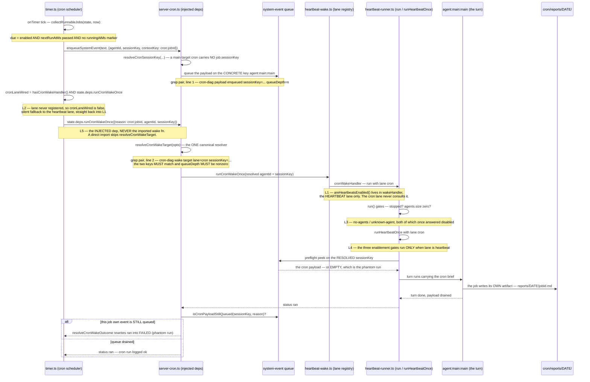

# Cron registry + auto-merge policy

> **Mid-incident?** Go straight to [The cron fire path](#the-cron-fire-path-and-the-five-layers-it-broke-at) and [How to prove a cron actually fired](#how-to-prove-a-cron-actually-fired). A green `status: ok` in the run log is **not** evidence that a cron did anything — believing it cost five debugging rounds and five days of a silently dead cron fleet.

## Job registry

Source: `~/.openclaw/cron/jobs.json`. Receipts: `~/.openclaw/cron/runs/<job>.jsonl`.

| Job id                   | Schedule    | Purpose                                                                                                                       | Status        | Notes                                                                                                  |
| ------------------------ | ----------- | ----------------------------------------------------------------------------------------------------------------------------- | ------------- | ------------------------------------------------------------------------------------------------------ |
| `morning-briefing`       | 07:00 daily | writes `memory/morning-briefings/YYYY-MM-DD.md` cumulative pass                                                               | enabled       | audit artifact; user `/new` is pass-1 (see M8 in failures.md)                                          |
| `model-rank-refresh`     | 06:30 daily | fetches Artificial Analysis leaderboard, updates `agents.defaults.models[*].rank` in openclaw.json                            | enabled       | skill: `~/.openclaw/workspace/skills/model-rank-refresh/SKILL.md`                                      |
| `people-profiles`        | every hour  | scans last hour of WhatsApp inbound, generates/updates `memory/people/<slug>/profile.md` for new aliases                      | enabled       | session: `agent:main:cron:people-profiles:profile:<slug>` per profile                                  |
| `life-butler`            | hourly      | (TBD — confirm purpose)                                                                                                       | enabled       | session: `agent:main:cron:life-butler`                                                                 |
| `cleaning-lady`          | daily       | memory consolidation pass, removes stale fragments                                                                            | enabled       |                                                                                                        |
| `fork-scanner`           | daily       | scans tinkerclaw + jarvis-workspace for new untracked memory artifacts and surveys upstream forks                             | enabled       |                                                                                                        |
| `marketplace-watcher`    | daily       | scans ClawHub / agent marketplaces for new skills relevant to the user                                                        | enabled       |                                                                                                        |
| `online-engagement`      | daily       | engagement state JSON refresh for online-presence                                                                             | enabled       |                                                                                                        |
| `security-updates-check` | daily       | OS / npm package security updates                                                                                             | enabled       |                                                                                                        |
| `self-evolution`         | daily       | self-improvement loop (Jarvis introspects on what to learn next)                                                              | enabled       |                                                                                                        |
| `spiritual-tech`         | daily       | spiritual-tech interests refresh                                                                                              | enabled       |                                                                                                        |
| `wind-down`              | nightly     | end-of-day digest + memory consolidation handoff                                                                              | enabled       |                                                                                                        |
| `engram-consolidate`     | 04:00 daily | ENGRAM sleep-consolidation: strategy-switch (U4) + skill-extraction (U6) + recipe-evolution (U1) + reconciliation (U8, gated) | **code-only** | descriptor in src, NOT in jobs.json — fired via RPC by the prompt-cron (see §engram-consolidate below) |
| `daily-fork-sync`        | daily       | **DISABLED 2026-05-09** — merges upstream + ships if pnpm build passes                                                        | **DISABLED**  | re-enable only after J15 merge gate ships                                                              |

Auto-extractable: ID, schedule, enabled. The Purpose/Notes columns are hand-written.

## Last-run probe

Today: `tail -1 ~/.openclaw/cron/runs/<job>.jsonl` returns the last receipt as JSONL.

> **This is a run log, not proof of work.** Calling it "the receipt" is the exact belief that let the phantom-run window last for days: `status: "ok"` here is fully compatible with the job having delivered nothing (layer L5 below). The run log is the right place to read _when_ a job fired and _why a wake was refused_ (grep the `wake-refused:` prefix). It is the wrong place to conclude the job did its work — see [How to prove a cron actually fired](#how-to-prove-a-cron-actually-fired).

Proposed `cron.lastRun({jobId})` RPC (see `probes.md`) would return:

```json
{
  "jobId": "morning-briefing",
  "startedAt": "2026-05-11T07:00:00+02:00",
  "endedAt": "2026-05-11T07:08:42+02:00",
  "exitCode": 0,
  "outcome": "ok",
  "outputTail": "...",
  "sessionKey": "agent:main:cron:morning-briefing"
}
```

## Cron session naming convention

Sessions spawned by a cron job follow `agent:main:cron:<jobId>` (single-shot job) or `agent:main:cron:<jobId>:<sub>:<slug>` (per-item job, e.g. people-profiles).

Cron sessions are SKIPPED by the restart-recovery main-session path (`shouldSkipMainRecovery` filters on `isCronSessionKey`). They have their own restart semantics: the cron scheduler re-fires on next schedule rather than resuming mid-turn.

**That convention covers ISOLATED jobs only.** A `sessionTarget: "main"` job does **not** open a `cron:` session at all: `executeMainSessionCronJob` (`src/cron/service/timer.ts:1337`) enqueues its payload onto the agent's own main session and then wakes that session on the cron lane. This is why a main-target cron normally carries no explicit `job.sessionKey` — and why the resolver in the next section exists.

## The cron fire path (and the five layers it broke at)

**Trigger:** the scheduler tick finds a job whose `nextRunAtMs` has passed.
**Entry:** `src/cron/service/timer.ts:835` — `onTimer` → `executeMainSessionCronJob` (`timer.ts:1337`).
**Exit:** the woken turn drains the payload and the job writes its own artifact under `~/.openclaw/cron/reports/<date>/`.

**The heartbeat is OFF permanently, by architect decision, and is not to be re-enabled — and crons still fire.** That is only true because cron and heartbeat are now **separate lanes through the same delivery primitive**. `runHeartbeatOnce` takes `lane?: "heartbeat" | "cron"` (`src/infra/heartbeat-runner.ts:831`), and the three heartbeat-enablement gates — global switch, per-agent enablement, polling interval — run **only** when `lane === "heartbeat"` (`heartbeat-runner.ts:842`). They answer _"should we poll?"_, never _"may we deliver?"_.

Between 2026-07-25 and 2026-08-03 the fleet fired on schedule and produced nothing, and each of five successive fixes only exposed the next layer down. The markers below are where each one sat, so this diagram doubles as the debugging map.



### The five layers, in the order they were peeled

Each layer is one commit. The history is the audit trail — if a layer regresses, its commit is the diff to read.

| #      | Layer                                                                                                                                                                                                                                                                                                           | Fixed by                                                                                 | Symptom while broken                                                                       |
| ------ | --------------------------------------------------------------------------------------------------------------------------------------------------------------------------------------------------------------------------------------------------------------------------------------------------------------- | ---------------------------------------------------------------------------------------- | ------------------------------------------------------------------------------------------ |
| **L1** | **The wake gate.** Every cron wake went out on the heartbeat lane, so `areHeartbeatsEnabled()` refused it. The gate now lives in `wakeHandler` (`heartbeat-runner.ts:1748`) — the heartbeat lane only.                                                                                                          | `169f3afc2a2` _decouple cron wake delivery from the heartbeat flag_                      | One operator switch silently disabled 18 unrelated jobs.                                   |
| **L2** | **The lane was never registered.** `setCronWakeHandler` had no call site, so `hasCronWakeHandler()` was false, so `cronLaneWired` was false, so every cron silently fell back to the heartbeat lane — straight back into L1.                                                                                    | `a06930d3e9d` _actually wire the cron wake lane — it had no call site_                   | "A lane with no registered handler is a dormant gene." Fixing L1 changed nothing.          |
| **L3** | **Agent registration.** The runner's agent map was built only from agents that HAD a polling interval; with `heartbeat.every` empty the map was EMPTY, so targeted delivery had nothing to address. Every known agent is now registered with `intervalMs 0` / `nextDueMs Infinity` — addressable, never polled. | `97d817073e4` _register interval-less agents so cron delivery has a target_              | An _addressing_ failure that read as a _switch_.                                           |
| **L4** | **The three enablement gates** at the top of `runHeartbeatOnce` were consulted for cron deliveries too. They now run only when `lane === "heartbeat"`.                                                                                                                                                          | `5c875b1f54e` _give runHeartbeatOnce an explicit lane; stop gating delivery on the poll_ | "The fourth and deepest place the heartbeat switch was consulted on the cron path."        |
| **L5** | **Wrong wake target — the phantom run.** The payload was enqueued on the agent's concrete main key, but the wake went out with `sessionKey=undefined` and landed on the generic configured heartbeat session. That turn peeked an _empty_ queue and answered a bare poll. Not a refusal — a **false success**.  | `e09ba8d4c1e` _route the cron lane through the shared wake-target resolver_              | `status: ok`, ~6 s, ~15 output tokens. **The fleet looked green while producing nothing.** |

**L5 is why `timer.ts` must not import the wake functions.** `resolveCronWakeTarget` (`src/gateway/server-cron.ts:222`) is the single canonical resolver, and the enqueue path and the wake path must derive the **same** key from it. So `timer.ts` reaches the cron lane **only** through `state.deps.requestCronWakeNow` / `state.deps.runCronWakeOnce` — the injected deps, which the gateway has already routed through the resolver. The comment sitting where the import used to be (`timer.ts:3`) says exactly this: the wake functions are deliberately **not** imported; `hasCronWakeHandler` stays because it answers _"is a handler registered?"_, not _"how do I wake"_; calling `runCronWakeOnce` directly is what re-introduced the 2026-07-25 wrong-session bug on 2026-08-03. The frontmatter `verify:` block asserts that **absence** (FIRE-2).

L5 also has a runtime backstop, because a resolver can always be bypassed again: `resolveCronWakeOutcome` (`server-cron.ts:63`) re-checks `isCronPayloadStillQueued` after the wake returns and rewrites a `ran` into **`failed` — phantom run** when this job's own `cron:<jobId>` event is still sitting on the queue. The event queue is ground truth: a woken turn drains what it receives.

### Lesson — a shared refusal string across distinct conditions is an anti-pattern

Four successive fix attempts each only exposed the next layer, because **seven distinct conditions all returned the single literal `"disabled"`**. The run log physically could not tell "the operator turned heartbeats off" from "no agents are registered" from "this agent is unknown" from "no polling interval is configured". Every fix was correct, changed exactly one layer, and left the identical word in the log — so every fix looked like it had failed.

The reasons are now distinct: `no-agents`, `unknown-agent`, `agent-heartbeat-off`, `no-interval`, and a wake refused for a reason about the _wake layer_ rather than about _this job_ is recorded with a greppable **`wake-refused:`** prefix (`timer.ts:1460`) so it can never be laundered into a quiet job-level skip.

**Generalised: if two conditions can fail independently, they must be distinguishable in the log, or debugging degenerates into peeling.** Two supporting rails: `OPERATOR_CHOSEN_CRON_SKIP_REASONS` is deliberately a _tiny_ allowlist — `quiet-hours`, `not-due` — and anything else is warned loudly by `warnUnchosenCronSkip`; and the delivery path is enrolled in the instrument-liveness registry as `cron:wake-delivery` with a 6 h silence budget (`timer.ts:89`), so a cron path that stops firing is reported as a declared-but-silent DEFECT instead of looking like calm. (`requests-in-flight` never reaches the allowlist — it is consumed earlier by the busy-retry loop at `timer.ts:1395`, which re-queues a recurring job on the cron lane rather than holding it open.)

## How to prove a cron actually fired

This subsystem cost five debugging rounds to learn one evidence rule. Apply it before claiming any cron works.

**`status: ok` is NOT evidence.** During the L5 window every job in the fleet logged `ok`. The status records that _a_ turn executed — never that the turn received _this cron's payload_.

**Duration is NOT evidence.** A phantom run takes ~6–8 s and ~15 output tokens: a bare heartbeat poll answered against an empty queue. Fast and green is the _signature of the failure_, not a sign of health.

**The only proof is the job's own artifact.** A cron that ran did work, and work leaves a file:

```bash
ls -la ~/.openclaw/cron/reports/$(date +%F)/
```

A report under `~/.openclaw/cron/reports/<YYYY-MM-DD>/<jobId>.md` whose content could only have been produced by this run is the evidence (shape: `~/.openclaw/workspace/CRON-REPORT-CONTRACT.md`). Nothing upstream of the artifact — not the status, not the duration, not the run-log line — survives contact with L5. **No file for today = the job did not do its work, whatever the status says.**

**Verify on an IDLE SCHEDULED fire, never a manual run.** Two independent reasons:

- A main-target cron **cannot run while the main session is busy**. The wake is correctly refused with `requests-in-flight` (`heartbeat-runner.ts:861`), and a recurring job deliberately re-queues and returns rather than holding the cron lane open. A check performed while you are actively working proves nothing about the scheduled path.
- `openclaw cron run` **is not the path under test.** It forces execution; it does not exercise the tick → due → enqueue → wake → resolve → peek chain that all five layers lived in. A manual run passing while scheduled fires silently no-op is _exactly_ the state this subsystem was in for days.

So: leave the session idle, let the schedule fire on its own, then look for the artifact. That is the whole rule. For a fast post-deploy sweep of this and the other repaired paths, `node scripts/post-deploy-smoke.mjs` prints **what it saw** (newest receipt per job) rather than a bare verdict.

## Where to watch it — the Exec Crons panel

The Exec **Crons** tab (`tinkerclaw-cron-panel`, added 2026-07-24) is the read-only board over this subsystem — the UI expression of the evidence rule above. It is a VIEW over `~/.openclaw/cron/jobs.json` + `jobs-state.json` and never writes them; when the board disagrees with `jobs.json`, `jobs.json` wins.

The one fact this optic owns about it: because the phantom-run guard reports an undelivered payload as `failed` rather than `ok`, a phantom cron now shows **red on day one** instead of green for a week. Everything else about the panel — its surface, RPC namespace, and deploy status — belongs to other optics and is deliberately not restated here:

- **see also:** `panels.md` — the exec-panel plugin split and where the Crons tab sits.
- **see also:** `topology.md` — the `tinkerclaw-cron-panel` plugin row.

## engram-consolidate — ENGRAM nightly sleep-consolidation (U1/U4/U6/U8)

```yaml
status: DEPLOYED (code descriptor + on-demand RPC); NOT in the stored jobs.json registry
last_verified: 2026-06-02
last_verified_commit: 06f8647fdc
see_also: subagents-and-recipes.md (recipe/skill stores), memory-layout.md (engram root), config-shape.md (ENGRAM_RECONCILE gate)
verify:
  - name: engram-consolidate cron descriptor source exists
    cmd: python3 -c 'import glob,os; assert glob.glob(os.path.expanduser("~/src/tinkerclaw/src/cron/jobs/engram-consolidate.ts"))'
  - name: U4 strategy-switch read RPC (what this cron produces into) is live
    cmd: python3 -c 'import subprocess; r=subprocess.run(["openclaw","gateway","call","fork.strategy.switch.list"],capture_output=True,text=True); assert "\"ok\"" in r.stdout, r.stdout[-400:]'
```

**The 12-upgrade procedural-evolution lane runner.** Added on `develop` 06f8647fdc (Sleep Consolidation paper, Upgrades 1/4/6/8). One nightly pass over every per-session ENGRAM event store that runs `runSleepConsolidation` (`src/memory/engram/sleep-consolidation.ts`) with four evolution lanes injected. Source: `src/cron/jobs/engram-consolidate.ts` (descriptor `engramConsolidateJob`, entry `runEngramConsolidate`).

### Registration model (IMPORTANT — not a jobs.json row)

The fork has **no coded cron scheduler registry** — its crons are prompt-driven (see `self-evolution-cron.ts`). So unlike every row in the registry table above (which lives in `~/.openclaw/cron/jobs.json`), `engram-consolidate` is **NOT** registered there. The `engramConsolidateJob` descriptor is instead reachable at runtime through the gateway RPC **`fork.engram.consolidate.run`** (`src/fork/memory-rpc.ts`), which the prompt-cron / Jarvis calls on the descriptor's schedule. The descriptor carries `schedule: "0 4 * * *"` (04:00 nightly — the canonical sleep slot); that string is the _intended_ cadence the prompt-cron honors, not a value the upstream `stored-CronJob` scheduler reads. The module deliberately does NOT mutate any registry (single-owner: registry edits belong to a Wire phase that, for this fork, is the prompt-cron, not jobs.json).

This is why the registry table marks it **code-only**: the source + on-demand RPC are deployed and verified live on 06f8647fdc, but a `grep engram-consolidate ~/.openclaw/cron/jobs.json` returns nothing — that absence is expected, not a missing-registration bug.

### What it produces (per nightly pass)

The deps are built once and shared across all sessions (so a strategy/skill/recipe recurring in multiple sessions accrues a single global history):

- **U4 strategy switches** — one shared `FailureStateMap` (loaded by `loadFailureStateMap`, mutated in place by the failure-count→strategy-switch loop, persisted by `saveFailureStateMap`). Gated switch _proposals_ are appended to the daily evolution manifest. Read surface: `fork.strategy.switch.list/apply/review`.
- **U6 extracted skills** — a never-delete `SkillLibrary` (`createSkillLibrary`, same store `fork.skill.search` reads) plus a deterministic no-LLM `defaultSkillExtractor`. The strict `isSkillWorthy` gate (completed, tool-using episode with ≥1 keyDecision) means today's `detectEpisodes` (emits `keyDecisions:[]`) extracts **zero** skills — byte-identical to pre-wiring — but the lane is live. An embed fn for semantic search is resolved exactly like `fork.prefrontal.embed`; absent provider → keyword fallback.
- **U1 recipe mutations** — a `RecipeArchive` (`createRecipeArchive`) so recipe-tagged episodes accrue Laplace-smoothed fitness + gated mutation _proposals_ into the daily manifest. (`RECIPE_AUTOAPPLY_ENABLED` is already true; see config-shape.md.)
- **U8 reconciliation decisions** — **dark-launched OFF**: only constructed when `ENGRAM_RECONCILE === "true"` (default unset → today's behavior). Even when on, the default `createAlwaysAddReconciler()` ADDs every event (nothing reconciled away), backed by a persisted ledger at `<engram>/reconciliation-ledger.json`. Result counts `reconciliationDecisions.{updated,deleted}` stay 0 with the default reconciler.

**Safe-default invariant:** absence of a backend (no embed provider, `ENGRAM_RECONCILE` unset, declining extractor) leaves consolidation output exactly as it was before this wiring — every lane is opt-in / no-op-by-default.

### Outputs on disk

- **Daily evolution manifest** (gated proposals, human-in-the-loop): `<engram>/recipe-mutations/<YYYY-MM-DD>.jsonl` — JSONL with a `type` discriminator (`recipe_mutation` | `strategy_switch`); written by `evolution-manifest.ts`. This is the single audit surface (paper §7.1); proposals are NOT auto-applied.
- **Cursors persisted atomically** at run end: `<engram>/consolidation-state.json` (per-session consolidation state) and the failure-state map.
- **Skill library** + **reconciliation ledger** as above.

`<engram>` = `$OPENCLAW_HOME/.openclaw/engram` (default `~/.openclaw/engram`). The `run` is idempotent; a `baseDir` param redirects the ENGRAM root for tests. Result summary (logged): `sessions / episodes / events / switches / skills / recipeMutations / reconcile`.

## Auto-merge policy (currently DISABLED)

The `daily-fork-sync` cron implements upstream-merge automation. It is DISABLED as of 2026-05-09 because the build-only gate failed to catch behavioral regressions (today's case study, see bible §11.6c/d/e).

### What it did when enabled

1. `git fetch upstream main`
2. A synthetic-base 3-way merge with conflict auto-resolution rules:
   - **TIER1 files** — paths the fork patches directly. On conflict, prefer fork.
   - **TIER2 files** — paths the fork modifies trivially. On conflict, prefer 3-way merge.
   - **TIER3 files** — upstream-only. Always prefer upstream.

   > **Pinned synthetic ancestor (S3, 2026-06-02).** A plain `git merge upstream/main` is a worst case here: the fork and `upstream/main` are **disjoint** (`git merge-base HEAD upstream/main` is EMPTY), so every differing file becomes an add/add conflict — the conflict multiplier. The TIER2 "prefer 3-way merge" rule now resolves against the **`upstream-base`** tag (pinned at the upstream content-anchor the fork carries; S3 = `7b07a0ab8fd`) as the explicit synthetic common ancestor, via `scripts/merge-drivers/upstream-3way.sh`. After each successful sync the cron **advances** `upstream-base` to the merged upstream commit (`git tag -f upstream-base <sha>`) and records the new SHA in its receipt. Full convention: `branch-policy.md` §4.

3. Apply fork patch functions for files the fork augments (not replaces).
4. `pnpm build`.
5. If build passes → commit + push to `tinkerclaw/develop`.
6. Otherwise → emit conflict report to memory and stop.

### Why it stopped being enough

Build-passing ≠ behavior-preserving. Three classes of silent regression:

- **Type A — fork handler wiped.** Upstream rewrote `server-methods.ts`, dropped the fork's added imports. Build still passes (no compile error). The RPC just returns `unknown method` on next call. (M3)
- **Type A — patch silently inverted.** A fork patch that adds a line near an upstream-rewritten block can land in the wrong place. Build passes; behavior is wrong.
- **Type A — config schema field dropped.** Upstream's plugin manifest validation tightened; fork's older manifests crash boot. (M6)

### The path forward (J15 §5 merge gate)

After merge + build, run `pnpm test:invariants`. Each section in the bible directory with `status: DEPLOYED` carries `verify` commands. The suite runs every command and refuses the merge if any newly-failing.

The gate is not yet wired. Until it is, `daily-fork-sync` stays disabled; merges happen manually with eyes on.

## SLO observations (informal)

- Most jobs run < 60s. The exception is `people-profiles` (per-profile parallel runs, each ~10–80s, capped at maxConcurrent=6).
- `morning-briefing` runs ~5–10 minutes when preflight is healthy.
- `daily-fork-sync` (when it was enabled) typically ran 2–5 minutes for clean merges, up to 30 minutes when patches needed manual review.

## Don't regress

- Cron sessions MUST NOT trip the main-session restart-recovery path. They are filtered out by `shouldSkipMainRecovery`; the filter rules are in `src/agents/main-session-restart-recovery.ts`.
- The `daily-fork-sync` job must stay DISABLED until the J15 merge gate ships. Documented in jobs.json + bible.
- When adding a new cron, follow the session naming convention; otherwise the people-profiles 7-second storm bug recurs (memory note `cron-people storm every 7s`).
- **Heartbeat OFF must never kill crons.** The heartbeat is off permanently by architect decision. Cron delivery goes out on `lane: "cron"`; never re-gate a cron wake on `areHeartbeatsEnabled()` or on any per-agent/interval heartbeat setting. A kill-switch must be scoped to the concern it kills.
- **`timer.ts` must not import `requestCronWake` / `runCronWakeOnce`.** Injected deps only (`state.deps.*`), because the gateway dep is what routes through `resolveCronWakeTarget`. This is the exact 2026-08-03 re-break; FIRE-2 asserts the absence.
- **Never collapse distinct skip/refusal reasons into one literal.** `wake-refused:*`, `no-agents`, `unknown-agent`, `agent-heartbeat-off`, `no-interval` must stay separate strings — the run log is the only thing that can tell you which layer you are standing on.
- **`status: ok` and duration never prove delivery.** Proof is `~/.openclaw/cron/reports/<date>/<jobId>.md` from an IDLE SCHEDULED fire — never a manual `openclaw cron run`.
- **Keep the phantom-run guard.** `resolveCronWakeOutcome` + `isCronPayloadStillQueued` must keep rewriting a `ran`-with-payload-still-queued into `failed`; without it an undelivered cron logs green again.

## Verify

```yaml
verify:
  - cmd: jq -r '.jobs[] | select(.id == "daily-fork-sync").enabled' ~/.openclaw/cron/jobs.json
    expect: "false"
  - cmd: jq '.jobs | length' ~/.openclaw/cron/jobs.json
    expect: "integer > 0"
```
