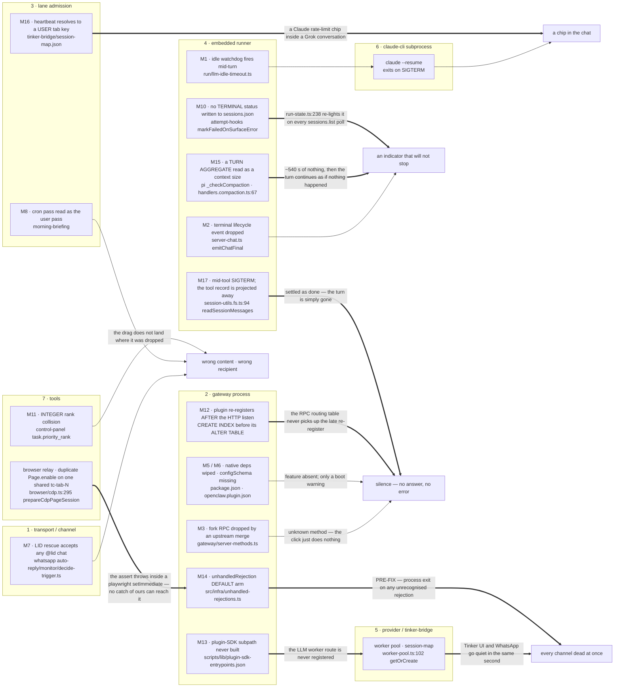
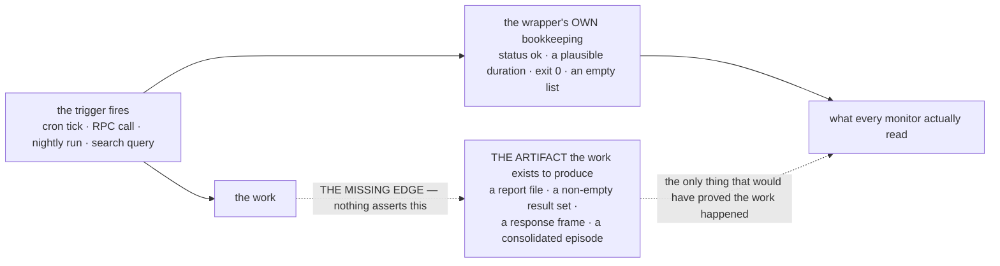

# Failure-mode map

Each row is one failure mode: where it originates → what envelope/symptom it produces → which channel it surfaces in → user-visible signal → resolution path.

## Symptom propagation — where a fault at each layer actually shows up

The M-rows below are indexed by ORIGIN. Debugging starts from the SYMPTOM, and in this harness the two are frequently in different layers — which is why the same wrong first suspect keeps getting picked. This graph is the inverse index.

The spine a request travels, in order: **transport → gateway → lane admission → embedded runner → provider/tinker-bridge → claude-cli subprocess → tools.**

**Thin arrows are the local path** — the symptom appears where the fault is, and the obvious suspect is the right one. **Thick arrows are the ones worth memorising: the symptom lands in a different layer than the origin**, so the obvious suspect is wrong. Every thick edge is a case an M-row already spells out as "looks like X; is actually Y" — the graph makes the existing prose visual, it does not add a claim.



**Reading the thick edges, in the order they will fool you:**

- **M14 runs UP the stack.** A layer-7 subsystem (the browser relay) killed the entire layer-2 process. Origin 7, exit 2, symptom "everything is dead with no code or deploy cause". Contained since 2026-06-09 — the edge stays drawn because the fault line is permanent even though the exit no longer is.
- **M13 enters BELOW layer 1.** A build-manifest gap, not a runtime fault: tinker-bridge never loads, both channels lose their worker route in the same second, and it reads as a worker-pool crash.
- **M16 crosses SESSIONS, not layers.** A background lane borrowed a user tab's identity, so a Claude quota error rendered inline in a conversation being driven on Grok — and the label named the wrong provider.
- **M10 and M2 surface in a POLL LOOP**, not at the failure site: nothing terminal was written, so the client re-derives "running" forever and the stop button cannot win.
- **M15 surfaces as the NETWORK.** A usage-accounting misread produces a nine-minute stall that reads as a hung model.
- **M12 surfaces as ONE RPC** while the whole plugin is gone — the routing table is the only visible casualty.

**One class is invisible on this graph**, because its edge is MISSING rather than mis-aimed: the work does not happen and a green status line is emitted anyway. See [Faults that surface as silence](#faults-that-surface-as-silence).

## Error envelope categories

The `__ERR_ENV__:` envelope (bible §5.69) is the single wire-level format for surfacing failures across channels. Categories and icons:

| Category                   | Icon | Fatal? | Triggered by                                                                            |
| -------------------------- | ---- | ------ | --------------------------------------------------------------------------------------- |
| `subscription`             | 💳   | yes    | OAuth subscription exhausted                                                            |
| `billing`                  | 💸   | yes    | metered API key billing failure                                                         |
| `auth`                     | 🔐   | yes    | 401, OAuth invalid                                                                      |
| `rate_limit`               | 🚦   | no     | 429                                                                                     |
| `overload`                 | 🌊   | no     | 500 / provider overload                                                                 |
| `network`                  | 📡   | no     | DNS, ECONNRESET, etc.                                                                   |
| `timeout`                  | ⏱️   | no     | LLM idle watchdog, request timeout                                                      |
| `lane_busy`                | 🔄   | no     | previous run still shutting down (and: gateway restart chip uses this with fatal=false) |
| `reply_run_already_active` | ⏳   | no     | duplicate idempotency                                                                   |
| `incomplete_turn`          | 🫥   | no     | stream ended without final                                                              |
| `tool_error`               | 🔧   | no     | exec tool failure surfaced                                                              |
| `compaction_error`         | 🧹   | no     | compaction pipeline failure                                                             |
| `generic`                  | ⚠️   | yes    | unclassified                                                                            |

Generation: from `src/fork/error-envelope.ts`. Update this table when categories are added.

**Pending category (2026-07-22):** `queued_behind_turn` (non-fatal) is being added in sibling commits for a second `chat.send` parked behind a busy turn — it replaces the misleading generic `lane_busy` "clears within a few seconds" ack for that case. Add its table row (icon from `error-envelope.ts`) when the commit lands. See `bug-log.md` [lane-busy-ack-misleading-and-block-acks-invisible] and `flows.md` F1 addendum.

## Failure modes

### M1. tinker-bridge SIGTERM (LLM idle watchdog)

- **diagnose_with:** `debug.session.config({provider:"claude-code"})` → assert `resolvedRequestTimeoutMs=600000`. `gateway.stuckSessions({thresholdMs:120000})` → if a session is past the old 120s threshold but `resolvedRequestTimeoutMs=600000`, the watchdog is correctly relaxed; otherwise the overlay broke. Journal grep `[idle-timeout-diag]` confirms per-turn resolution.
- **Origin:** `streamWithIdleTimeout` in `src/agents/embedded-agent-runner/run/llm-idle-timeout.ts`. Idle timer racing `streamIterator.next()`. tinker-bridge intentionally does NOT emit `stream` events during tool work (see `tool-loop.md`), so heavy turns can starve the timer.
- **Propagation:** idle timeout rejects → `idleTimeoutTrigger(error)` → `abortRun(true, error)` aborts `runAbortController` → tinker-bridge worker receives signal → `worker.kill("SIGTERM")` → claude-cli exits → `assistant-failover.ts` classifies as `surface_error reason=timeout`.
- **Envelope:** category `timeout` (icon ⏱️) or `lane_busy` if classified that way. Text: `"🤖 ⚠️ Something went wrong while processing your request."`
- **Surface:**
  - WhatsApp: envelope delivered as chunked text via `deliverWebReply`. User sees the chip.
  - Tinker UI: pre-2026-05-10 → spinner stuck on `sending...` (lifecycle event dropped). Post-fix → backstop `broadcastChatFinal` fires; chip renders, spinner clears.
- **Resolution:** ensure `timeoutSeconds` is correctly resolved (see config-shape.md M1 ↔ that file). Architectural fix LIVE 2026-05-11: tinker-bridge now emits an empty-delta heartbeat every 25s during a turn so the watchdog resets without re-executing tools. The 600s overlay is now belt-and-suspenders rather than load-bearing. See `tool-loop.md`.
- **Detection probe:** journal grep `[llm-idle-timeout]` lines, plus the `[idle-timeout-diag]` log shows the resolved timeout. Heavy turns hitting 138s/279s without `[idle-timeout-diag] idleTimeoutMs=600000` means the overlay path broke.
- **Bug history:** 2026-05-05 catalog `timeoutSeconds:600` was dead code; 2026-05-10 fixed via plugin overlay (bible §11.6d, §11.6e).

### M2. Webchat surface_error spinner stuck

- **diagnose_with:** `debug.dumpUiSnapshot()` then `Read(~/.openclaw/data/tinker-ui-snapshot.html)` and grep for `thinking-pending`. Cross-check with `debug.session.state({sessionKey})` — if `activeRunIds=[]` but a `thinking-pending` chip is in the snapshot, this is M2.
- **Origin:** `chat.send`'s `.then()` previously only emitted `broadcastChatFinal` when `!agentRunStarted`. On surface_error timeouts the agent did start; the lifecycle event from `server-chat.ts:emitChatFinal` was the only path to `state="final"`. If that path dropped (e.g. `isControlUiVisible=false`), TUI received NO final event.
- **Propagation:** lifecycle event dropped → no `state="final"` broadcast → TUI's `thinking-pending` indicator never clears.
- **Surface:** Tinker UI spinner stays on `sending...` indefinitely.
- **Resolution:** backstop in `chat.ts` `.then()` agentRunStarted branch always emits `broadcastChatFinal` with `deliveredReplies` content (FORK 2026-05-10, bible §11.6e). Idempotent vs lifecycle path because `broadcastChatFinal` deletes `agentRunSeq[runId]`.
- **Detection:** read `~/.openclaw/data/tinker-ui-snapshot.html` and grep for `thinking-pending`. If a session shows pending without an active run in the journal, this is the failure.
- **Bug history:** regression C from 2026-05-10.
- **Extension (2026-07-22) — error-content persistence:** the 2026-05-10 `.then()` backstop fixed the SPINNER but not error-content persistence — `broadcastChatFinal` was broadcast-only, so a turn-death's error text was invisible to any client that reconnected later, and `clearBufferedChatState` (server-chat) discarded the partial streamed text. Persistence now added for agent-started failures: the error (plus preserved partial text, flagged `isError`) is appended to the session transcript with idempotency key `${clientRunId}:assistant-final`. Broadcast-only terminal state is the anti-pattern; persist-then-broadcast (as F7 `chat.inject` already does) is the invariant. See `bug-log.md` [turn-death-invisible-in-ui].

### M3. Upstream-merge wipe of fork RPC handler

- **diagnose_with:** each fork RPC has its own probe in this file's `verify` block — `config.openExternalFile`, `files.resolveBareName`, `briefing.resolve`, `debug.dumpUiSnapshot`. If any returns `unknown method`, M3 fired during the last merge. The full set is enumerated under "Detection probe" below.
- **Origin:** weekly merge of upstream/main rebases `src/gateway/server-methods.ts`; conflicts that look "safe" can drop fork-added imports / spreads.
- **Propagation:** handler missing from `coreGatewayHandlers` → any RPC call to it returns `unknown method: <name>` (`INVALID_REQUEST`).
- **Surface:** the call site fails. For UI features (e.g., `.fs-link` click), the click silently does nothing or shows a console error.
- **Resolution:**
  - Short-term: restore the handler import + spread.
  - Long-term: J15 merge gate — a `verify` command for each fork-added RPC fails the merge.
- **Detection probe:** for each fork-added handler, `openclaw gateway call <method> --params '{...}'`. List of fork RPCs that need verify commands:
  - `config.openExternalFile` (FORK §5.68)
  - `briefing.resolve` (FORK §11.6b)
  - `files.resolveBareName` (FORK §11.6c)
  - `debug.dumpUiSnapshot` (FORK §11.6c)
  - `fork.subagents.spawn`
  - `fork.prefrontal.state.*`
- **Bug history:** regression A from 2026-05-10 (`config.openExternalFile` wiped 2026-04-29, surfaced 2026-05-09).

### M4. tinker-bridge channel context bleed (suspected but not real)

- **diagnose_with:** `Read(~/.openclaw/tinker-bridge/session-map.json)` and assert each WA channel + TUI channel produces a distinct `openclawSessionId`. If two channels share an openclawSessionId, the channel-isolation invariant has actually been violated (would be a real M4, not the suspected one). The 2026-05-09 evidence: WA=`a87a4e61`, TUI=`bf76b61f` — separate.
- **Origin:** suspected when `/new` was typed in TUI and a WhatsApp reply showed unexpected content.
- **Investigation result:** NOT bleed at tinker-bridge layer. The two channels have distinct `openclawSessionId` (e.g. WA=`a87a4e61`, TUI=`bf76b61f`); session-map's `getLatestResumeSessionIdByOpenclawSessionId` only resolves WITHIN one openclaw session.
- **Actual cause of the symptom:** M1 (tinker-bridge SIGTERM) on the WA turn + concurrent /new turn timing; the "something went wrong" envelope on WA was timing-correlated with the /new in TUI, leading to misattribution.
- **Resolution:** none required at tinker-bridge layer. Document that channel isolation is invariant: openclawSessionId is canonical, lookup priority is openclawSessionId-first.
- **Don't regress:** in `worker-pool.getOrCreate`, openclawSessionId lookup MUST come BEFORE sessionKey lookup. Reversing brings back stale-entry-wins behavior.

### M5. Plugin native-deps missing at boot

- **diagnose_with:** `plugin.boot.status({status:"error"})` returns every plugin that failed to load with `error`, `failurePhase`, and `failedAt`. The 2026-05-11 example we hit: `tinkerclaw-round-table` and `tinkerclaw-total-recall` both with `Cannot find module '@sinclair/typebox'`. Probe replaces the journal grep that used to be the only path.
- **manifest_via:** `debug.simulate.pluginLoadFail({pluginId:"__simulated-test", failurePhase:"load"})` (admin-scope) injects a fake plugin record with `status:"error"` directly into the in-memory registry; calling `plugin.boot.status --params '{"status":"error"}'` immediately after must include it. Cleanup with `debug.simulate.pluginLoadFail --params '{"action":"clear"}'`. Round-trip-tests the diagnose_with claim above.
- **Origin:** `pnpm.onlyBuiltDependencies` in `package.json` is wiped on upstream merges. After a merge, `better-sqlite3`, `opusscript`, `@discordjs/opus` are no longer pre-built.
- **Propagation:** plugin import fails with `Cannot find module '@sinclair/typebox'` or similar native-binding errors.
- **Surface:** gateway boot warning, plugin disabled, features silently missing. Today's example: `tinkerclaw-round-table` and `tinkerclaw-total-recall` fail to load.
- **Resolution:**
  - Add the deps back to `pnpm.onlyBuiltDependencies` in package.json.
  - Run `pnpm rebuild better-sqlite3 opusscript @discordjs/opus`.
  - Restart gateway with `--full`.
- **Detection probe:** parse boot journal for `failed to load plugin` lines.
- **Long-term fix:** a post-merge hook that asserts the deps are present.

### M6. plugin configSchema missing

- **diagnose_with:** `plugin.boot.status({status:"error"})` — if a plugin's `failurePhase` is `"validation"`, the manifest itself is invalid (M6 territory); `"load"` means import-time crash (M5 territory); `"register"` means the plugin loaded but its `register()` hook threw. The phase distinguishes the cascading-config-validation failure (gateway refuses to start at all) from a single-plugin native-deps issue.
- **Origin:** since 2026-03-05, upstream requires `configSchema` field in every `openclaw.plugin.json`. Forgetting it = config validation error loop blocks ALL plugins (cascading).
- **Surface:** gateway boot fails entirely.
- **Resolution:** add `configSchema: {}` (at minimum) to every fork plugin manifest. See bible's "Plugin manifests" rule.

### M7. WhatsApp self-DM trigger leak (LID rescue too permissive)

- **diagnose_with:** `wa.recentOutbound({n:20})` — scan for outbounds to LID chats that are NOT the owner's self-LID. Cross-reference with the trigger-gate unit tests (`extensions/tinkerclaw-whatsapp/src/auto-reply/monitor/decide-trigger.test.ts` covers the post-rescue gate). Also: `decide-trigger.test.ts` case (b) is a regression guard for this exact class.
- **Origin:** `inbound/monitor.ts` LID rescue used to accept ANY `@lid` chat with `fromMe=true` as self-DM. When the owner DMed a family contact via that contact's LID, rescue rewrote the chat to owner self-DM, trigger fired without prefix, reply leaked to the contact's DM.
- **Propagation:** rescue branch sets `from=lidString` and prompts pass; but the wrong recipient is computed for the outbound.
- **Surface:** unintended outbound to a non-owner chat.
- **Resolution (2026-05-04):** rescue is gated on `self.lid===remoteJid` OR (`remoteJid ∈ noPrefixChats ∧ allowFrom`). Anything looser = bug.
- **Resolution (2026-05-12):** `self.lid` is now populated from the whatsmeow SQLite store. `auth-store.ts:readWebSelfIdentity` falls back to `identity-whatsmeow-db.ts:readWhatsmeowDeviceIdentity` when `creds.json` is absent or its `me.lid` is null (which is always the case on whatsmeow-backed accounts, since whatsmeow doesn't write a JSON creds file). The `whatsmeow_device.lid` column is read read-only via `better-sqlite3`. Closes the open follow-up — path (a) `self.lid === remoteJid` is now the primary signal on every whatsmeow account.

### M8. Briefing cron pass ≠ user-delivered pass

- **diagnose_with:** `cron.lastRun({jobId:"morning-briefing"})` returns the receipt path. `Read(memory/morning-briefings/<date>.md)` shows the cron pass content. If the user-pass-1 output omits items present in the cron pass receipt, M8 is firing (delta-mode against an unread audit artifact).
- **Origin:** cron runs `morning-briefing` at 07:00 and writes `memory/morning-briefings/YYYY-MM-DD.md` as an audit artifact (deliver:false). User typing `/new` later expects a USER pass, not a delta on top of the cron pass.
- **Propagation:** Jarvis reads the cron pass, treats `/new` as Pass 2, renders "delta-only" → user is confused because they never saw Pass 1.
- **Surface:** user `/new` returns sparse content with no priorities visible.
- **Resolution:** the cron pass is an audit; `/new` is always user-pass-1 → render FULL content. Always ENUMERATE preflight reds/yellows by name (counts alone are useless). See memory note 2026-05-11.

### M9. Auto-merge silently breaks fork behavior

- **diagnose_with:** `pnpm bible:invariants` is the canonical post-merge probe. Every `verify:` in the bible files is a contract; the runner is what enforces them. `cron.lastRun({jobId:"daily-fork-sync"})` confirms whether the auto-merge ran. While the cron is disabled (2026-05-09), running the runner manually after every merge is the workaround.
- **Origin:** the daily-fork-sync cron (currently DISABLED 2026-05-09) merges upstream and ships if `pnpm build` passes. Build-passing ≠ behavior-preserving.
- **Propagation:** fork RPC wiped (M3), fork patch reverted, plugin manifest field dropped, native-deps array wiped (M5), etc.
- **Resolution:** J15 merge gate (paper §5) — run `pnpm test:invariants` after build; refuse merge if any `verify` command newly fails. Today this is proposed, not implemented. The merge cron stays disabled until the gate ships.

### M10. Stuck session.status=running

- **diagnose_with:** `gateway.stuckSessions({thresholdMs:60000})` returns processing sessions older than 60s, sorted by age. `debug.session.state({sessionKey})` then returns the persisted `sessions.json` entry plus the live `activeRunIds` — if entry shows `status:running` but `activeRunIds=[]`, the session is stuck in M10. `gateway.observability.snapshot` includes the stuck-session example list as one section of the single-call dashboard.
- **manifest_via:** `debug.simulate.stuckSession({ageMs:120000})` (admin-scope) injects a fake processing session aged 2 minutes; calling `gateway.stuckSessions` immediately after must include it in the returned list. Round-trip-tests the diagnose_with claim above. Cleanup with `debug.simulate.stuckSession --params '{"action":"clear"}'`.
- **Resolution (2026-05-12, PARTIAL — see 2026-07-30 below):** synchronous session-status transition on surface_error was wired. `src/agents/embedded-agent-runner/run.ts` calls `forkAttemptHooks.markFailedOnSurfaceError({sessionKey, reason})` at the `promptFailoverDecision.action === "surface_error"` throw site. The hook (in `src/fork/attempt-hooks.ts`) scans every agent's `sessions.json` and transitions the entry from `status:"running"` → `status:"failed"` with `abortedLastRun:true`. Best-effort — never blocks or masks the original throw. ⚠️ The claim that boot recovery became "belt-and-suspenders rather than load-bearing" was WRONG: that call site only covers `stage:"prompt"`.
- **Resolution (2026-07-30, architect report: "Grok is firing without stop. I stop its thinking indicator and it starts again"):** the 2026-05-12 wiring missed `stage:"assistant"`. `handleAssistantFailover` (`run/assistant-failover.ts`) returns `action:"throw"` for BOTH `fallback_model` and `surface_error`, and `run.ts`'s throw site for that branch never called the hook — so an xAI stream that dies mid-turn left `status:"running"` with no `endedAt` on disk. Live evidence: `runId=755f5fd8`, `xai/grok-4.5`, `stage=assistant decision=surface_error reason=timeout`; two tabs stuck simultaneously; `DISPATCH-ENTRY count: 1` and xAI quota flat at 53000000/53000000 — **nothing was re-running, only the indicator re-lit**. Fixed at the single terminal funnel instead of the branch: `src/auto-reply/reply/agent-runner-execution.ts` calls the hook where it logs `Embedded agent failed before reply`, which is the one exit for EVERY pre-reply failure (prompt stage, assistant stage, fallback exhaustion), after all retries are spent. The hook now takes an optional `storePath` (the reply runner already owns it) to mark directly instead of scanning, and an optional `abortedLastRun` — passed `false` here because `body.ts` turns that flag into a next-turn prompt prefix reading "The previous agent run was aborted by the user. Resume carefully or ask for clarification", which is false copy for a provider timeout. Tests: `src/fork/attempt-hooks.mark-failed-on-surface-error.test.ts`.
- **Origin:** L1 lifecycle (lifecycles.md) — on surface_error or timeout, the session.status stays `running` in `sessions.json` because no terminal lifecycle event is emitted, so `persistGatewaySessionLifecycleEvent` (`src/gateway/session-lifecycle-state.ts`) never writes `status`/`endedAt`/`runtimeMs`.
- **Propagation:** `tinker-ui/src/run-state.ts:237` resolves `"server-running"` from `status === "running"` on every `sessions.list` poll. The client's veto needs an `endedAt` it never received, so pressing **stop** clears only client state and the next poll re-lights the indicator — indefinitely.
- **Surface:** NOT merely cosmetic — the user reads a permanently spinning indicator as "the model is looping and burning tokens" and cannot stop it. Only a gateway restart clears it (via `markRunningMainSessionsAsInterrupted`).
- **Don't regress:** any new pre-reply bail-out must leave a TERMINAL status on disk. `run-state.ts` treats exactly `done|failed|killed|timeout` as terminal; anything else re-lights. Adding an early `return` above the `Embedded agent failed before reply` funnel reintroduces M10 for that path.

### M11. INTEGER rank collisions via midpoint arithmetic (control-panel)

- **diagnose_with:** `sqlite3 ~/.openclaw/data/control-panel.db "SELECT priority_axis, priority_rank, COUNT(*) FROM task WHERE status NOT IN ('dropped','dismissed','resolved') GROUP BY priority_axis, priority_rank HAVING COUNT(*) > 1 ORDER BY COUNT(*) DESC LIMIT 20"` — every row with `COUNT(*) > 1` is a rank-collision cluster. Pre-fix live evidence: 21 tasks at rank=30 + 17 at rank=40 in axis `ventures`.
- **Origin:** `task.priority_rank` is `INTEGER` in the schema. The pre-2026-05-23 Today-card DnD commit used midpoint arithmetic `(prevRank + nextRank) / 2` to compute the dropped task's new rank. Midpoint of two ints often produces a float that truncates back to an existing rank when stored, so over a few reorders adjacent tasks share the same integer rank.
- **Propagation:** sort key becomes undefined for tied ranks — SQLite picks an order, the UI renders something, the user's drag "doesn't land where they dropped it." Looks intermittent because only the cluster-internal tasks misbehave.
- **Surface:** user-visible regression — "I cannot move tasks properly within the same group" (the user, 2026-05-23). Looks like a DnD bug; is actually a rank-collision bug.
- **Resolution (2026-05-23, commit `76df31f68d`):** client renumbers ALL tasks in the destination axis with spacing 100 on every drop (parallel `tasks.update` RPCs). Strategy: "fresh ranks on every move" instead of "midpoint forever." Schema stays INTEGER. A one-shot `/tmp/renumber-ranks.py` cleaned the 60 currently-open tasks across 7 axes before the commit landed; the on-drop renumber prevents recurrence.
- **Don't regress:** if anyone reintroduces midpoint arithmetic on INTEGER ranks, the bug returns within ~5 reorders. The other safe direction is to migrate `priority_rank` to `REAL` — at which point midpoints stop colliding.
- **Detection probe:** the GROUP BY HAVING query above. Should always return 0 rows on a healthy DB.
- **Bug history:** see `bug-log.md` 2026-05-23 entry.

### M12. Schema-migration ordering bug (CREATE INDEX before ALTER TABLE)

- **diagnose_with:** `journalctl --user -u openclaw-gateway.service --since today --no-pager | grep -E 'SqliteError: no such column'`. Cross-check `openclaw gateway call plugin.boot.status --params '{"status":"error"}'` — a plugin with `failurePhase:"register"` and a SqliteError in its error trace is M12.
- **Origin:** `schema.ts` / `schema.sql` ran `db.exec(...)` at boot that included `CREATE INDEX ... ON <table>(<new_column>)` referencing a column added by a later migration. On any existing DB (where `<new_column>` doesn't exist yet because the migration hasn't run), `CREATE INDEX` throws `SqliteError: no such column`.
- **Propagation:** plugin registration crashes mid-schema. The loader silently re-registers several times after the initial failure — but those re-registrations land AFTER the HTTP server starts listening, so the RPC routing table never picks them up. Every `<plugin>.*` RPC call returns `unknown method`.
- **Surface:** the entire plugin disappears from the running gateway with no obvious symptom in the user-visible UI (just "RPC unknown" toasts when something tries to call it). The 2026-05-22 instance: `control-panel.*` calls all returned `unknown method` after a v3.5 boot on a v3.3 DB.
- **Resolution (2026-05-22, commit `e60c1f45c9`):** drop the offending `CREATE INDEX` from `schema.{sql,ts}` entirely; create it inside the migration that adds its column (`addAxisParentIdColumn` in `db.ts`, idempotent with `IF NOT EXISTS`). Fresh DBs: `CREATE TABLE` with the column → migration ALTER is no-op → migration CREATE INDEX runs. Existing DBs: `CREATE TABLE IF NOT EXISTS` no-op → ALTER adds column → CREATE INDEX builds successfully.
- **Prevention:** new regression test `db.test.ts` ("getDb() boot path on a pre-v3.5 DB") seeds a tmpdir with the older table shape (no `parent_id`), then calls `getDb()` which runs schema.exec + migrations in real boot order. Two assertions: must not throw; `parent_id` added + rows preserved + index present.
- **Rule:** indexes that depend on newly-added columns ALWAYS live in the migration that adds the column, never in `schema.{sql,ts}`. Schema files describe the **final state**; migrations describe the **transition**. Mixing them produces an unrecoverable boot crash on any DB that wasn't created in the post-migration era.
- **Bug history:** see `bug-log.md` 2026-05-22 entry.

### M13. Plugin-SDK export drift (new subpath ships without manifest entry)

- **diagnose_with:** `journalctl --user -u openclaw-gateway.service --since today --no-pager | grep -E "Cannot find module .*root-alias.cjs"`. Each match names the missing subpath. Cross-check via `openclaw gateway call plugin.boot.status --params '{"status":"error"}'` — a plugin with `failurePhase:"load"` and an `ERR_MODULE_NOT_FOUND` is M13.
- **Origin:** a new `src/plugin-sdk/<name>.ts` is added in the fork (for a plugin to import as `openclaw/plugin-sdk/<name>`), but its entry is missing from BOTH `scripts/lib/plugin-sdk-entrypoints.json` (the tsdown subpath manifest) AND the `./plugin-sdk/<name>` entry in `package.json#exports`. Result: tsdown never builds `dist/plugin-sdk/<name>.js`. In production `NODE_ENV=production` (systemd), `root-alias.cjs` prefers `dist/` over source, so the resolver synthesises a path to a file that doesn't exist and Node throws `ERR_MODULE_NOT_FOUND` on every plugin reload.
- **Propagation:** the importing plugin fails to load. If that plugin is tinker-bridge, BOTH the Tinker UI and WhatsApp DM go silent because the LLM worker route is no longer registered. The orphan worker pool from a pre-crash gateway can keep pre-restart workers alive but unreachable.
- **Surface:** Jarvis stops responding on every channel simultaneously after a gateway restart. Looks like a worker-pool crash; is actually a plugin-load crash with no audible signal in the chat UI itself (no error chip — the path never gets that far).
- **Resolution (2026-05-21, commit `e065bc94f5`):** add the entry to `scripts/lib/plugin-sdk-entrypoints.json`, regenerate `package.json#exports` via `pnpm plugin-sdk:sync-exports`, rebuild, restart. The 2026-05-21 instance: `src/plugin-sdk/provider-config-overlay.ts` had existed since 2026-05-10 (`566bf478a6`) but its manifest entry was missing; tinker-bridge had been importing it from source the entire time, and a cold module cache on a gateway restart finally surfaced the gap.
- **Prevention (commit `0b5c17f614`):** pre-push **Gate 4** (`pnpm lint:plugins:plugin-sdk-subpaths-exported` + `pnpm plugin-sdk:check-exports`) catches BOTH the src→manifest drift and the manifest→`package.json#exports` drift. Bypass for intentional WIP: `SDK_EXPORTS_GUARD=off git push`.
- **Don't regress:** never add a new `src/plugin-sdk/*.ts` file without also adding its entry to the manifest AND regenerating `package.json#exports` in the same commit. Gate 4 will block the push otherwise.
- **Bug history:** see `bug-log.md` 2026-05-21 entry.

### M14. Browser-relay CDP assert crashes the WHOLE gateway (subsystem fault isolation)

- **diagnose_with:** `journalctl --user -u openclaw-gateway.service --since today --no-pager | grep -nE 'Unhandled promise rejection|Assertion error|crConnection|CRSession._onMessage|stability bundle'`. The signature is an `Error: Assertion error` whose stack runs through `playwright-core/.../server/chromium/crConnection.js` (`CRSession._onMessage` → `assert`), immediately preceded by a burst of `[browser/extension-relay] [relay-cdp]` lines re-attaching CDP to a shared tab `tc-tab-N`. **The tell is a duplicate `Page.enable` on the same `tc-tab-N` within a few ms** (two `ext id=` for one sessionId) — a session-lifecycle race. systemd shows `ActiveState=failed`, `MainPID=0`; the stability bundle reason is `unhandled_rejection`. Live instances: 2026-06-08 (PID 127509) and 2026-06-09 (PID 1607).
- **Origin:** the browser/extension-relay re-attaches CDP to a shared tab and issues two `Page.enable` for the same `tc-tab-N` (concurrent attach, no dedupe). That desyncs **Playwright's own** internal CDP connection (`playwright-core` is a second consumer driving the same browser). Playwright's `CRSession._onMessage` hits an `assert()` and throws — and it throws inside a `setImmediate` callback buried in `playwright-core/.../server/transport.js:73`, so **no try/catch in our relay can ever reach it** (the relay's own `routeCdpCommand` dispatch IS already wrapped — that is not where it throws). The throw surfaces as an unhandled promise rejection.
- **Propagation (the real fault line):** PRE-FIX, the global handler in `src/infra/unhandled-rejections.ts` treated **any** unhandled rejection it did not specifically recognize as FATAL → `process.exit(1)`. So one subsystem's async hiccup (the browser relay) killed the entire gateway — chat, crons, channels, memory — and `Restart=no` (the `no-restart.conf` drop-in) kept it down until a manual restart. This is the same class as the 2026-05-28 whatsmeow leak (`isBenignGoProcessExit`): a subsystem async throw leaking into the global default-exit arm.
- **Surface:** gateway suddenly DOWN/frozen, Tinker UI shows no activity, Jarvis unresponsive on every channel — with NO code/deploy cause. Looks like a frontend or worker-pool failure; is actually a backend crash triggered by a background browser-automation burst.
- **Resolution (2026-06-09) — FOUNDATION, subsystem fault isolation:** the global `unhandledRejection` default arm is **inverted** from "exit" to "contain". `classifyUnhandledRejection()` now returns `contain` for any rejection that is not in the curated fatal class (`fatal` = OOM/worker-init, `config` = misconfig) or a known-survivable class (`abort`, `benign-go-exit`, `transient` network/SQLite). A contained rejection is **logged loudly + a forensic stability bundle is written** (`writeDiagnosticStabilityBundleForFailureSync("unhandled_rejection_contained", reason)`) but does **not** terminate the process. A **crash-loop circuit breaker** (`recordContainedUnhandledRejection`: > `CONTAINED_REJECTION_CRASH_LOOP_MAX` = 25 contained rejections within `CONTAINED_REJECTION_CRASH_LOOP_WINDOW_MS` = 60 s) is the ONLY path back to exit, so a genuinely wedged process (tight rejection loop) still dies for a clean recovery — this is a last-resort wedge guard, NOT a restart-on-crash crutch. Backed by `src/infra/unhandled-rejections.{test,fatal-detection.test}.ts` (pure classifier + handler + breaker, incl. the exact playwright-assert signature).
- **Resolution (Layer 2, source — OPEN follow-up, browser-relay owner):** eliminate the trigger by deduping concurrent `Page.enable` / re-attach per `tc-tab-N` sessionId in `src/browser/extension-relay.ts` so two `ext id=` never enable the same session. Layer 1 (containment) means a recurrence no longer crashes Jarvis; Layer 2 stops generating the bad CDP message in the first place. Defense in depth — ship both.
- **Don't regress:** the default arm of `installUnhandledRejectionHandler` MUST stay `contain` (log + forensic bundle, no exit). Only the curated `fatal`/`config` classes and the crash-loop breaker may call `process.exit`. **Never "fix" a recurring subsystem leak by re-enabling systemd `Restart=on-failure` as the primary remedy, and never widen the fatal class to catch a subsystem's throw** — a subsystem fault must be contained at the boundary and logged, not allowed to crash the gateway. Each new leak that reaches the `contain` arm is a source bug to fix (Layer 2), not a reason to make `contain` exit. Tripwire: the M14 `verify:` asserts the `contain` policy + crash-loop breaker are present in source.
- **Bug history:** see `reference_gateway_playwright_relay_crash` memory (2026-06-08 first instance, 2026-06-09 recurrence + this foundational fix).

### M15. Compaction fires at ~2% of the window, then hangs 540 s and is discarded

- **diagnose_with:** `journalctl --user -u openclaw-gateway --since today --no-pager | grep -nE '\[compaction-diag\]|\[context-overflow-diag\]|compaction retry aggregate timeout'`. The tell is a `[compaction-diag] gate=pi-auto` line whose `tokens=` is **larger than `window=`** on a turn that visibly holds only a few percent of real context, followed ~540 s later by `compaction retry aggregate timeout ... proceeding with pre-compaction state`.
- **Origin — there are FOUR deciders, not three.** Three are ours and instrumented (`gate=preemptive` in `run/preemptive-compaction.ts`, `gate=preflight/memory-flush` on `SessionEntry.totalTokens`, `gate=tool-loop-guard` in `tool-result-context-guard.ts`). The fourth is **pi's own** `AgentSession._checkCompaction` (`pi-coding-agent/dist/core/agent-session.js:1375-1445`), live because `applyPiAutoCompactionGuard` (`src/agents/pi-settings.ts:126-146`) only disables pi auto-compaction when the context engine sets `ownsCompaction:true`, and `LegacyContextEngine` (`src/context-engine/legacy.ts:22-26`) does not. **It is the one that actually fires**, which is why no `fires=true` line ever appeared on the other three.
- **The chain:** the fork persists a **turn aggregate** as each assistant message's `usage` (sums `cacheRead` across every API call in the turn — measured 2.3M / 12.3M / 23.7M). pi's `isContextOverflow` **silent-overflow branch** (`pi-ai/dist/utils/overflow.js:117-123`) reads `usage.input + usage.cacheRead` off a `stopReason:"stop"` message — a **successful** turn — and compares it to the 1M window. 23.7M > 1M ⇒ classified as overflow at ~2–4% real fill. pi then compacts with `willRetry:true`, and **the retry can never start**: pi's pre-retry cleanup strips the trailing assistant message only when `stopReason === "error"` (`agent-session.js:1563-1567`); here it is `"stop"`, so `Agent.continue()` throws `Cannot continue from message role: assistant` (`pi-agent-core/agent.js:242`) into a swallowing catch. Nothing resolves `pendingCompactionRetry`; the runner extends 180 s at a time to the 540 s hard cap (`run/attempt.ts:3047`) and discards the result. The compaction itself took **19 ms**. 29 such events in 7 days.
- **Surface:** a turn appears to stall for ~9 minutes with no output, then continues as if nothing happened (pre-compaction state). Reads as a hung model or a network fault; is actually a compaction retry that can never be issued.
- **Resolution (2026-07-27), three shipped fixes — all diagnostic/accuracy, none is the root fix:**
  - `b8d24a622a0` — the **preemptive gate scored the system prompt as 0 tokens**. It wrapped it in a synthetic `{role:"system"}` message and handed it to pi's `estimateTokens`, which switches on `role`, has no `system` case, and returns `0`. A 55k–61k char (~15k token) system prompt counted as zero. Now counted by chars, plus tool-schema chars, at both call sites (`run/attempt.ts`, `command/cli-compaction.ts`).
  - `d619fdaf2ae` — the **tool-loop guard tripped at ~45–55% of the window, not the nominal 90%**. Its estimate counted `toolResult.details` (stripped before send, `attempt.ts:493`) and then weighted tool results 2 chars/token against a budget denominated in 4 chars/token. Split into `raw` (wire semantics, drives the overflow predicate) vs `weighted` (pessimistic, still drives single-tool-result truncation).
  - `068f388df99` — **instrumented the fourth decider**: `gate=pi-auto` now logs pi's own `reason` and `result.tokensBefore` from `compaction_end`.
- **Don't regress:**
  - **Never hand pi's `estimateTokens` a `role:"system"` message** — it silently returns 0. Count the system prompt by chars.
  - **Never reconstruct compaction token figures at `compaction_start`.** By then pi has popped the triggering assistant message (`messages.slice(0,-1)`) and `clearStaleAssistantUsageOnSessionMessages` has zeroed assistant `usage` in place — a reconstruction prints `tokens=0` and reads as _refuting_ the overflow it exists to prove. Take the numbers from `compaction_end` only.
  - **Never compare the persisted per-message `usage` to a context window.** It is a turn aggregate, not a context size. Per-call figures live in the cache telemetry / context-anatomy DB.
  - Keep the three existing `gate=` names byte-stable; they are grepped by hand and by monitors.
  - **A `compaction_end` with no `result` is a BAIL, not a zero-token compaction.** pi's `_runAutoCompaction` has three early returns emitting `{result: undefined, aborted: false, willRetry: false}` without compacting: no model, `getApiKeyAndHeaders()` failure, and `prepareCompaction()` returning null. Never log those as `fires=true tokens=0` — that reads as a compaction over an empty context. `fires` must stay `producedResult && !aborted` (the same condition the handler already uses for `incrementCompactionCount()` and its `completed:` field), and the line must carry `result=ok|none`. Shipped `6e7b7a31ba8` after the first live bail (2026-07-28 04:37, a subagent holding 2 local messages that pi still called `reason=overflow`).
- **FIXED 2026-07-28 (`4be81d5684d`) — pi's decider is now switched OFF whenever one of our extensions owns compaction.** The guard existed all along but had **never once executed**: `shouldDisablePiAutoCompaction` tested only `contextEngineInfo?.ownsCompaction === true`, and `LegacyContextEngine` (`src/context-engine/legacy.ts:22-26`) does not set it. pi is a pinned `dist/` dependency and cannot be taught to read a better field, so the only lever is to disable its decider and let our own gates own compaction — which is what upstream does host-side (`upstream/main:src/agents/agent-settings.ts` `shouldDisableAgentAutoCompaction`, **three** disjuncts to our original one, including a `silentOverflowProneProvider` check whose doc comment describes this symptom verbatim, openclaw#75799). Two further details: the disable now goes through `applyOverrides` rather than `setCompactionEnabled` (both take effect immediately — pi's `save()` recomputes the merged snapshot synchronously, so a widely-repeated claim that `setCompactionEnabled` is a live no-op is **false** — but `setCompactionEnabled` also persists `enabled:false` into the user's GLOBAL pi settings file, outliving the run and suppressing manual `/compact`); and the guard **must be re-applied after `resourceLoader.reload()`**, which discards `applyOverrides` mutations exactly as it discards the reserve/keepRecent ones. **Deliberate divergence to reconcile on any future upstream sync:** upstream tests `compactionMode === "safeguard"` against a two-value enum; ours is `"default" | "safeguard" | "engram"` and the live mode is `engram`, so we test `!== "default"`.
- **The `Summarization failed: Connection error` burst was a DOWNSTREAM SYMPTOM of the false triggers, not an independent transport bug.** `extensions/tinkerclaw-tinker-bridge/src/catalog.ts:40-42` declares claude-code with `apiKey:"claude-code-oauth"` — a **non-empty literal**, so every auth gate PASSES and compaction proceeds — and `baseUrl:"local://claude-cli"`, a sentinel nothing in production intercepts (5 hits repo-wide, 4 of them in a test). pi's `compact()` therefore reaches `completeSimple` → the built-in anthropic provider → the SDK opens `local://claude-cli` → `APIConnectionError`. But that path is only REACHED when the engram `session_before_compact` handler DECLINES (`src/agents/pi-extensions/compaction-engram.ts:91`, empty preparation), which happens precisely when a false trigger fires compaction on a transcript with nothing old enough to summarize. Normal engram compactions return a pointer manifest and pi skips the HTTP call entirely (`fromExtension=true`). Kill the false triggers and this stops firing. Do NOT chase it as a transport bug.
- **⚠️ CORRECTION 2026-07-28 (later) — the 52,116 composition UNDER-reads, so the over-read ratios are lower bounds.** `context-anatomy.ts` classified messages with `msg.role === ("tool" as string)` while the production literal is `"toolResult"` (pi-ai `types.d.ts:154`), so **every tool result contributed ZERO** and the decoded "tool results: 0" meant _not counted_, not _not present_. The real context exceeded 52,116 by that turn's tool-result bytes. Therefore read every ratio below as **"at least"** — "19.8×" is a lower bound, not a measurement. **The conclusions are unaffected:** 6,448,106 and 1,029,656 against a 1,000,000-token window are impossible as context sizes whatever the true figure, so the turn-aggregate diagnosis stands. Fixed in `4dc725b62e0`: routed through the shared `isToolResultMessage`, plus a terminal else-branch that accumulates unattributed chars and logs a warning, so a future role addition is visible instead of silently shrinking the total. **The `as string` cast was what silenced the type error that would have caught this** — treat such a cast in a classifier as a defect, not a convenience.
- **MEASURED 2026-07-28 — the `threshold` path fires falsely TOO, not just `overflow`.** First live `gate=pi-auto` firing, on `agent:main:main`: pi reported `usedTokens=1029656` / `utilizationPercent=103` and compacted. The `anatomy_events` row for that same event (`turn=8`, `cycle=1`) decodes to a **real** context of `totalTokens=52116` (182,403 chars: sysprompt 6,564 + injected 6,894 + skills 2,887 + toolSchemas 7,386 + history 28,387). **Real fill was 5.2%, not 103% — pi over-read by 19.8×.** The arithmetic is exact: `cache_read 912,160 + cache_creation 113,065 + input ≈ 1,029,656`, i.e. `usedTokens` IS the turn aggregate. A second row minutes later (`claude-opus-5`, turn 9) shows `usedTokens=145706` vs real `totalTokens=37857` — 3.8× over. So `shouldCompact(calculateContextTokens(usage), …)` is poisoned by the same field as `isContextOverflow`: **both** of pi's branches are unreliable while the aggregate is persisted. Cross-check: the fixed preemptive gate read `tokens=52254` on this session, within **0.3%** of the anatomy figure — the fork's own estimate is sound; only the persisted `usage` is wrong.
- **FIXED 2026-07-28 (`62df91430eb`) — the DATA side: a turn aggregate can no longer be reported as a context size.** `deriveContextPromptTokens` (`src/agents/usage.ts`) is the chokepoint every "how full is the context?" answer funnels through. It gained a `contextWindow` plausibility test: **a value larger than the context window is definitionally not a context size**, so it is reported as UNKNOWN (`undefined`) rather than passed on. Callers already map `undefined` to `totalTokensFresh:false`, so a decider that knows it does not know will not compact a 5%-full session. `deriveSessionTotalTokens` **already accepted `contextTokens` and never used it** — passing it through is the whole fix, which is why this lands in one function instead of the nine-file type churn a proposed `contextUsage` port required. **The `promptTokens` override arm is guarded too, deliberately:** it fires first on the embedded lane (`auto-reply/reply/agent-runner.ts` → `derivePromptTokens`) and carries the same poison, so guarding only the usage buckets would have been a silent half-fix. This is the fork-local stand-in for upstream's typed `Usage.contextUsage` union (`upstream/main:packages/llm-core/src/types.ts:279-281`), which is NOT portable here: pi 0.70.5 is a pinned `dist/` and `normalizeUsage` is a fixed-shape 5-key projection that strips unknown keys at runtime. **Note the persisted `usage` field still CONTAINS the aggregate** — nothing now interprets it as a context size. A pinned test asserting the old behaviour (`"does not clamp derived session total tokens to the context window"`, expecting `2_400_027` against a 200,000 window) was **rewritten, not deleted**: its real intent was to forbid fabricating a window-sized clamp, and both guarantees are now explicit assertions.
- **OPEN — the remaining upstream convergence (no longer urgent):** make the per-message `usage` hold the **last API call's** figures, keeping the turn sum in the separate totals the fork already maintains (`embedded-agent-subscribe.ts:399-413 commitAssistantUsage`). That kills the false overflow _and_ the false threshold compactions _and_ the 540 s hangs at source. Blast radius: cost accounting, the cache panel, and EEG all read that field — it needs its own verified pass.
- **How to re-measure:** `anatomy_events` (`~/.openclaw/data/anatomy-timeline.db`) stores `context_sent` / `context_window` as **zlib-compressed JSON** — decompress, then `json.loads`. `context_window.usedTokens` is pi's (polluted) figure; `context_sent.totalTokens` is the real one. Open the DB **read-only** (`file:…?mode=ro`): a test once wrote to the production DB.
- **Bug history:** see `bug-log.md` → `[compaction-fires-at-2pct-pi-silent-overflow]`.

### M16. Heartbeat fires with nothing to do, in someone else's session (DISABLED 2026-07-30)

- **diagnose_with:** `python3 -c "import json,os;print(json.load(open(os.path.expanduser('~/.openclaw/openclaw.json')))['agents']['defaults']['heartbeat'])"` — `every:""` means the runner is off (`resolveHeartbeatIntervalMs` → `null` → `runHeartbeat` returns `{status:"skipped",reason:"disabled"}` before ANY preflight or dispatch). In the gateway log, `[heartbeat] disabled` at reload confirms it. To catch a live recurrence: `journalctl --user -u openclaw-gateway.service | grep 'turn start.*userText.len=659'` — the heartbeat prompt is a fixed 659 bytes (`[OpenClaw heartbeat poll]` + the chat-row contract).
- **Origin (TWO independent defects, both live 2026-07-30):**
  1. **The quiet gate is inverted on the case that actually occurs.** `resolveHeartbeatPreflight` (`src/infra/heartbeat-runner.ts:670-690`) skips the LLM with `skipReason:"empty-heartbeat-file"` when `HEARTBEAT.md` exists and `isHeartbeatContentEffectivelyEmpty()` — but on `ENOENT` it **returns the preflight unchanged and the run proceeds**. So an EMPTY heartbeat is free and an ABSENT one costs a full persona-loaded turn every interval. "I never set up a heartbeat" is the ABSENT case, so the gate built to keep it quiet never engaged. Live: `~/.openclaw/jarvis-workspace/HEARTBEAT.md` (the agent's workspace, `cwd` of every spawn) was MISSING, while `~/.openclaw/workspace/HEARTBEAT.md` existed at 226 bytes — the gate was looking at a file the runner never reads.
  2. **It ran in the user's tab session, not its own.** Config said `session:"heartbeat"`, but all six spawns resolved to `agent:main:tinker:ms77fk1l` (a user tab) via `~/.openclaw/tinker-bridge/session-map.json`. Same family as the cron wake-key bug already documented at `src/gateway/server-cron.ts:19-27`.
- **Propagation:** the heartbeat is pinned to `claude-code/claude-sonnet-4-6` regardless of the tab's own model. Because it borrows the tab's session identity, everything it emits is indistinguishable from the user's own turn — so when it hit the **Claude weekly subscription cap**, six `🚦 Rate limited` envelopes rendered inline in a conversation being driven on `xai/grok-4.5`. Contrast `suggestTitleViaBridge` (`src/gateway/server-methods/suggest-title.ts`), the other background one-shot (xAI Grok 4.6 since 2026-09-01; was Sonnet), which runs under a throwaway `temp:title-suggest` key and skips `payload.isError` — structurally incapable of this.
- **Surface:** the user reads "Rate limited" next to Grok's output and concludes Grok is throttled. Grok had **zero** rate-limit events in seven days. The advice the message implies (back off) is the exact wrong move, and retrying always worked — which is the tell that the label named the wrong provider. The envelope face carries no provider/model; `provider: claude-code` sits inside a collapsed "technical details" block.
- **Resolution (2026-07-30):** heartbeat **disabled** at the architect's direction (`agents.defaults.heartbeat.every = ""`, applied via `config.patch`, hot-reloaded — no restart). It had never produced a useful result. Note the schema is STRICT: an explanatory `disabledReason` key is REJECTED (`Unrecognized key`), so the rationale lives here, not in the config.
- **Don't regress:** if the heartbeat is ever re-enabled, BOTH defects must be fixed first — (a) treat a missing `HEARTBEAT.md` as "nothing to do" (skip), not as "let the LLM decide"; (b) run it under its own session key so it can never emit into a user tab. A background pass that borrows the user's session identity will always be able to lie about what the user's model is doing.

### M17. A mid-tool interruption is misread as a completed turn (restart recovery skips it)

- **diagnose_with:** the tell is a session whose thinking indicator vanished with **no answer, no fractal output, and no resume**. `debug.session.state({sessionKey})` shows `status:"done"` with `abortedLastRun:false` and an `endedAt` a few seconds AFTER the new gateway booted — a turn that "finished" without producing anything. Confirm against the RAW transcript (NOT `readSessionMessages`, which is precisely what cannot see it): pair the `{type:"custom", customType:"tinker-bridge-tool"}` records by `toolCallId`; an unpaired `phase:"start"` with no `phase:"result"` is the interrupted tool call. Since 2026-07-31 every detection is also appended to `<stateDir>/data/interrupted-runs.jsonl` (`src/agents/interrupted-run-ledger.ts`), so the class is greppable instead of invisible.
- **Live instance:** session `agent:main:dashboard:4da6037f`, model `claude-opus-5`, 2026-07-31 09:02 CEST. Dangling call `toolCallId toolu_018QJhbkqG6LU6Lf4oLkkNB5` — a `Bash` call waiting on the deploy log.
- **Trigger (NOT the bug):** the agent ran `scripts/deploy-worktree.sh` from inside its own session. The deploy calls `systemctl --user stop openclaw-gateway`, which SIGTERMs the cc-bridge worker running that very agent — transcript evidence: `__ERR_ENV__` with `"headline":"Gateway restarted"` and `"raw":"claude subprocess exited (code=null signal=SIGTERM)"`. **Detaching the deploy with `setsid nohup` saves the DEPLOY, never the AGENT** — the agent lives inside the process being stopped. That is unavoidable and is not the defect. The defect is that the interrupted run was never resumed.
- **Origin — the chain, six steps, one blind spot:**
  1. tinker-bridge persists tool calls as `{type:"custom", customType:"tinker-bridge-tool", data:{phase:"start"|"result", toolCallId, …}}` records — **not** as `tool_use` content blocks.
  2. `readSessionMessages` (`src/gateway/session-utils.fs.ts:94`) emits only `type:"message"` and `type:"compaction"`; every `custom` record is discarded.
  3. At SIGTERM the assistant's streamed TEXT had been flushed but its `tool_use` block had not — so the transcript tail is an assistant **text-only** message.
  4. `assistantTurnHasPendingToolUse()` therefore found no tool block, and `isIdleCompletedTail()` returned **true**.
  5. `settleIdleSession()` wrote `status:"done"`, `abortedLastRun:false`.
  6. The `status==="running" && abortedLastRun===true` gate in `recoverStore()` no longer matched, so recovery skipped the session entirely.

  **The blind spot in one line:** recovery decided resumability from a PROJECTION that structurally cannot represent the evidence it needed.

- **Proof it was `settleIdleSession` and not `markSessionFailed`:** the on-disk entry ended as `status:"done"` with `abortedLastRun:false` and `endedAt` **32 s after the new gateway booted**. `markSessionFailed` writes `status:"failed"` — so the M10 failure funnel never ran; recovery itself settled the session as complete. The only durable evidence the agent was mid-tool is the unpaired `phase:"start"` record — exactly the record class `readSessionMessages` throws away.
- **Surface:** silent work loss. No error chip after the restart chip, no answer, no resume — the user reads the vanished indicator as "it finished" and the turn is simply gone. Contrast M10: that one is loud and wrong (an indicator that will not stop); M17 is quiet and wrong, which is why it went undetected until a deploy made it reproducible.
- **Resolution (2026-07-31):** `src/agents/interrupted-run-probe.ts` reads the RAW transcript and pairs `tinker-bridge-tool` start/result records by `toolCallId`. `recoverStore()` consults it (`findDanglingToolCall`) and **refuses to settle a session as idle while an unpaired start exists**, forcing the existing resume path to run. Each detection is appended to `<stateDir>/data/interrupted-runs.jsonl` by `src/agents/interrupted-run-ledger.ts` so this class stops being invisible.
- **Also removed in the same change — the `--note` sentinel in `scripts/gateway-full-restart.sh`:** it wrote `session-resume.json` with a hardcoded single-session key, **clobbering** the v2 multi-session format owned by `src/infra/session-resume.ts` — and it had no reader at all (`writeSessionResume` / `consumeAllSessionResumes` have zero callers in `src/`). A write-only sentinel that corrupts a live format is strictly worse than no sentinel.
- **Don't regress:**
  - **Never decide "was this turn interrupted?" from `readSessionMessages`.** It is a message projection; tool activity lives in the `custom` records it drops. Resumability questions read the RAW transcript.
  - `main-session-restart-recovery.ts` MUST keep consulting `findDanglingToolCall` before any idle settle. The M17 `verify:` asserts that reference is still present, so a refactor that drops it fails the gate instead of silently restoring the swallow.
  - **Never reintroduce a hardcoded single-session resume key** in the restart scripts — the resume format is multi-session. The second M17 `verify:` asserts the string stays absent from `scripts/gateway-full-restart.sh`.
  - Settling a session to `done` ASSERTS the turn produced something. With no evidence of completion, prefer resuming: a redundant `[System] continue` is cheap, a silently dropped turn is not.
- **Bug history:** first instance 2026-07-31 (`agent:main:dashboard:4da6037f`); diagnosed and fixed the same day.

## Faults that surface as silence

Every mode above surfaces as _something_ — a chip, a spinner, wrong text, a dead channel. This section is the class the propagation graph structurally cannot draw, because the edge that fails is the one that was never there: **the work does not happen, and the only thing that reaches a human is a status line saying it went fine.**



**Read the graph.** The status line reaches the reader on a path that never touches the artifact. Sever `work → artifact` and _nothing observable changes_. That is why this class survives for months while a loud failure is fixed in an afternoon.

### The eight confirmed instances

Each was found by a human eventually reading a number that could not be true — none by a test, a gate, or a monitor.

**The first four**, July 2026 through 2026-08-03.

| what reported success                                                                              | what actually happened                                                                                                                                                                                                                                                                                                                               | the swallow point                                                                                                                                                                                                                                                                                                                                                                                                                                                                                                            | the artifact that would have caught it                                                                                                                                                                                                                                                                                                                                                                   |
| -------------------------------------------------------------------------------------------------- | ---------------------------------------------------------------------------------------------------------------------------------------------------------------------------------------------------------------------------------------------------------------------------------------------------------------------------------------------------- | ---------------------------------------------------------------------------------------------------------------------------------------------------------------------------------------------------------------------------------------------------------------------------------------------------------------------------------------------------------------------------------------------------------------------------------------------------------------------------------------------------------------------------- | -------------------------------------------------------------------------------------------------------------------------------------------------------------------------------------------------------------------------------------------------------------------------------------------------------------------------------------------------------------------------------------------------------- |
| 18 main-target crons, each firing on time and logging `status:"ok"`                                | the payload was enqueued on the agent's MAIN session queue while the wake resolved `sessionKey=undefined` and woke the GENERIC heartbeat session; that turn peeked an EMPTY queue and answered "no task in flight" — `status:"ok"`, ~6 s, 15 output tokens                                                                                           | **two faults, not one.** (a) `resolveCronWakeTarget` and `enqueueSystemEvent` resolved DIFFERENT keys in `src/gateway/server-cron.ts`; both now go through `resolveCronSessionKey` (fixed 2026-07-25). (b) that fix alone did NOT restore delivery — `get-reply-run.ts` still set `transcriptBodyBase = HEARTBEAT_TRANSCRIPT_PROMPT` for EVERY heartbeat run, demoting the cron instruction into appended system context, so the agent read its task as background trivia and acked. Closed by `heartbeatCarriesCronPayload` | a report file under `~/.openclaw/cron/reports/<date>/`, or a spawned subagent. **Zero had been written since the contract landed 2026-07-24.** Do NOT substitute the prompt for the artifact: a 25-char `current_prompt` is EXPECTED on a healthy delivery, so reading it proves nothing either way — that mistake cost hours. See `bug-log.md` [cron-main-payload-never-delivered-empty-heartbeat-poll] |
| `fork.memory.search` answered with an empty result list, never an error                            | EVERY query failed at PREPARE with `no such column: f`                                                                                                                                                                                                                                                                                               | `searchKeyword` addressed the FTS5 virtual table through its JOIN alias in `bm25(f)` and `f MATCH ?`; FTS5 exposes that hidden column under the TABLE name only. Hidden because `MemoryIndexManager.search` wrapped its retrieval stages in a bare catch-to-empty, so a thrown query and a genuine miss looked identical (fixed 2026-08-03)                                                                                                                                                                                  | a known-present chunk failing to come back under its own distinctive token. Now guarded by `src/memory/keyword-search.test.ts`, which runs the real `searchKeyword` against a real temp SQLite file with the real schema and FAILS against the pre-fix source, and by `logSearchStageFailure` (`src/memory/manager.ts:84`), which logs the throw before any degrade                                      |
| `engram.search` produced no response frame at all                                                  | the handler declared its OWN `respond: (data: unknown) => void` and called `respond({ results, … })`; the real `RespondFn` is `(ok, payload?, error?, meta?)` (`src/gateway/server-methods/shared-types.ts:33`) and the ws layer forwards those slots verbatim, so the results object landed in the boolean `ok` slot and `payload` stayed undefined | the handler typed its own respond instead of deriving it from the live registration signature (fixed 2026-08-02, structurally — the argument type is now derived, so wrong arity is a COMPILE error)                                                                                                                                                                                                                                                                                                                         | a non-empty payload, asserted. The tell: an UNKNOWN method errors INSTANTLY, so a hang — measured at 150 s, the caller's own timeout — means the method was FOUND and simply never answered                                                                                                                                                                                                              |
| the nightly ENGRAM sleep consolidation reported "0 episodes / 0 events / 0 summaries" and exited 0 | `scripts/engram-sleep.mjs` defaulted `--session-key` to the literal `live`, and `events/live.jsonl` has never existed                                                                                                                                                                                                                                | `createEventStore` mkdirs the parent but never creates the file, and `readAll()` on a missing file returns an empty list — so the report was TRUTHFUL and worthless                                                                                                                                                                                                                                                                                                                                                          | a non-zero `storesAvailable` / `eventsProcessed` on the consolidation report. It ran this way for **83 consecutive nights** while 575 real stores sat unconsolidated in the same directory                                                                                                                                                                                                               |

**Four more, all measured 2026-08-04** — found in a single day, which is itself the finding: once you go looking for the SHAPE rather than for errors, they are not rare.

| what reported success                                                                                                                                                                                                                 | what actually happened                                                                                                                                                                                                                                                                                                                                                                                                                                                                  | the swallow point                                                                                                                                                                                                                                                                                                                                                                                                                                                                                                                                                                             | the artifact that would have caught it                                                                                                                                                                                                                                                                                                                                                                                                                                                                                                                          |
| ------------------------------------------------------------------------------------------------------------------------------------------------------------------------------------------------------------------------------------- | --------------------------------------------------------------------------------------------------------------------------------------------------------------------------------------------------------------------------------------------------------------------------------------------------------------------------------------------------------------------------------------------------------------------------------------------------------------------------------------- | --------------------------------------------------------------------------------------------------------------------------------------------------------------------------------------------------------------------------------------------------------------------------------------------------------------------------------------------------------------------------------------------------------------------------------------------------------------------------------------------------------------------------------------------------------------------------------------------- | --------------------------------------------------------------------------------------------------------------------------------------------------------------------------------------------------------------------------------------------------------------------------------------------------------------------------------------------------------------------------------------------------------------------------------------------------------------------------------------------------------------------------------------------------------------- |
| `memory_search` kept answering and every sync completed. The only trace was `memory sync failed (search\|session-start\|session-delta)` at **warn** — 198 times in three days, buried under a quarter-million WhatsApp backfill lines | EVERY vector insert had been throwing `Expected 3072 dimensions but received 1024` for weeks, and retrieval had silently degraded to keyword-only. Measured on the live 1.5 GB index: `chunks` 5,258 rows, `chunks_fts` 5,305, `chunks_vec_rowids` **0**                                                                                                                                                                                                                                | two swallows in series. `dropVectorTable()` logged its own failure at `log.debug`; `ensureVectorTable()` then set `this.vector.dims = dimensions` **unconditionally**, even though `CREATE VIRTUAL TABLE IF NOT EXISTS` is a NO-OP when a wrong-shaped table survives. The recorded lie made the `dims === dimensions` early return permanent across restarts (`bc16efe811c`). That fix was itself half-right — the early return skipped the new verification entirely, because `this.vector.dims` is seeded from persisted `meta` and no CREATE was ever attempted — closed by `b5d18a37b46` | a non-zero `chunks_vec_rowids` against a non-zero `chunks`. The shape is now read back from `sqlite_master` once per manager BEFORE the fast path and again after every CREATE, and a shape that cannot be fixed **disables** vector search at `log.error` with the remedy instead of throwing per insert. Full contract in `memory-layout.md` → Vector store contract                                                                                                                                                                                          |
| `openclaw flows list` answered normally and every detached run came back with a task-flow record                                                                                                                                      | no detached run had registered a flow since 2026-04-01 — the list had been frozen for four months. 93 `Failed to create one-task flow for detached run` in the journal, 7 `errcode 1299` (`SQLITE_CONSTRAINT_NOTNULL`) on 2026-08-04 alone, with `fullFilePath` under `dist/`, i.e. the running build                                                                                                                                                                                   | on every pre-existing database the legacy `owner_session_key TEXT NOT NULL` column survived the migration — SQLite cannot drop a column or relax NOT NULL in place — while nothing wrote it, so every insert built from the production column list died on it. `task-executor.ts` then returned a record **byte-identical to the "not eligible" result** and logged at warn. The fresh-install DDL never had the column, so all 129 tests of the tasks project stayed green (`14b904b815c`)                                                                                                   | a `flow_runs` row newer than the last deploy. Now `getSingleTaskFlowRegistrationHealth()` lets a probe tell "no flows" apart from "registration is broken", and the failure logs on the **error** channel. Deliberately still not rethrown — the task row is already persisted and every caller swallows the throw anyway                                                                                                                                                                                                                                       |
| the Overseer loop and the idle curiosity chips ran to completion every cycle and proposed nothing — it "ran and had nothing to say"                                                                                                   | all 19 registered `fork.*` methods were absent from `METHOD_SCOPE_GROUPS`, and **unclassified is a two-sided trap**: the client (`resolveLeastPrivilegeOperatorScopesForMethod`) asks for `[]` while the server (`authorizeOperatorScopesForMethod`) falls back to `?? ADMIN_SCOPE`. The gateway journal carries **731** `missing scope` refusals naming a `fork.*` method, and not one nudge. Callers that passed explicit admin scopes kept working, so the surface looked half-alive | `missing scope: operator.admin` came back ~1 ms in, at **warn**, and the Overseer folded it into the generic `reason:"spawn-error"`; the idle timer's `.catch()`-only wiring discarded the failed cycle outright. A refusal was shaped exactly like a healthy decline (`6ffba48adb2`)                                                                                                                                                                                                                                                                                                         | a nudge — any non-empty Overseer output. Now `isOperatorScopeDenial()` logs a denied spawn at **error** (`src/fork/overseer-runtime.ts:116`, `:211`) and gives the idle loop a dedicated `scope-denied` reason inside the closed `IdleGoalReason` union (`src/fork/idle-goals.ts:56`), with `isIdleGoalFailure()` (`:65`) separating failure from decline at every call site. The repo's own exhaustiveness test in `src/gateway/method-scopes.test.ts` had been counting these all along and passing: **33** unclassified methods before the fix, **14** after |
| the memory READ path was visibly healthy — 141 `pack rebuilt` lines in three days — so retrieval kept serving a snapshot frozen a week earlier                                                                                        | ENGRAM had ingested nothing the architect said since 2026-07-28. `llm_output` is a CONVERSATION hook, and `src/plugins/registry.ts:1858` DROPS those at registration for any plugin whose origin is not `bundled` unless `plugins.entries.<id>.hooks.allowConversationAccess` is explicitly `true`. One config default silently disables an entire write path while the read path stays green                                                                                           | the refusal went ONLY to `pushDiagnostic()` — an array surfaced over an RPC nobody polls. A three-day journal grep for it returned **nothing** while a core feature was dead. The gate itself is a reasonable security boundary; the defect is that refusing it was invisible (`63a9c346194` — refusals now also log at warn as `conversation hook DROPPED` at `:1872`, grants at debug at `:1888`, so each boot states plainly which plugins hold conversation access)                                                                                                                       | a `user_message` row dated today under `~/.openclaw/engram/events/<sessionKey>.jsonl`. **Not claimed:** that the gate is why ingestion stopped — it is the leading candidate, and making the refusal visible is what confirms or refutes it on the next deploy. The ingestion repair is entangled with session-key normalisation (UI chats read `agent:main:tinker:*` stores that nothing writes)                                                                                                                                                               |

**The unifying lesson, sharpened by the second four: not one of these eight produced an ERROR. Every one produced a PLAUSIBLE NON-ERROR** — a green status line, an empty result set, a healthy-looking no-op, a `warn` nobody reads. That is the defining property of the class, and it is sharper than "they all reported success", because rows 5–8 mostly reported nothing at all; they simply _returned_. What they share is that **every value they emitted is a value the HEALTHY system also emits**: `ok`. `[]`. "not eligible". "no nudge this cycle". Zero vectors in a table that is legitimately empty on a fresh install. A monitor diffing against the healthy shape finds no difference, by construction — which is why all eight were caught by a human reading a number, and none by a gate.

A green status line records that the _wrapper_ completed its own bookkeeping. It is not evidence that the work happened, and it is fully compatible with a dead code path — a green status, a plausible duration and exit 0 were all present in each of the first four rows. **The only evidence of work is the artifact the work was supposed to produce.** Assert on the artifact — and pick one whose ABSENCE is not also a healthy state.

Corollaries, each earned:

- **A fast, clean run is the tell, not the reassurance.** ~6 s with 15 output tokens, and ~10 ms with `status:"skipped" error:"disabled"`, are both what doing nothing looks like from outside. They are **two different receipts** — the 2026-07-25 wake-key instance and the 2026-08-03 disabled-cron instance — and must not be merged into one incident.
- **Duration is not evidence in either direction.** A main-session turn that gets the empty poll still burns 20–120 s reading ~50k tokens of context before answering. Two prior "fix confirmed" calls (98,715 ms and 117,448 ms) were both this same no-op.
- **"No data" must never render as PASS.** A monitor that reports health while observing nothing is another instance of this same bug; `cron-health-gate.log` logged "OK: all cron jobs healthy" every 3 minutes across a full week of silence — the watchdog checked that jobs ran, never that they produced anything.
- **Never let a `catch` degrade to an empty result without logging the throw first.** Best-effort return contracts are fine; silent ones are not.
- **A handler's `respond` must be DERIVED from the live registration signature**, never re-declared locally. Deriving turns an arity mistake into a compile error; re-declaring turns it into a hang that reads as a slow model.
- **A default that names a store, session or file must fail loudly when that name resolves to nothing.** "Nothing to do" and "the path is dead" are different states and must exit differently, or 83 dead nights read as 83 quiet ones.
- **One fix per fault, verified separately.** Row 1 had two independent faults producing one receipt; the first fix shipped, the symptom persisted, and the natural reading was "the fix didn't work" rather than "there is a second fault". A repro run on a build that provably contains fix (a) is what separated them. Row 5 repeated it inside a single day: the verify-after-CREATE in `bc16efe811c` was correct and UNREACHABLE, because the early return above it took the fast path on a lying `meta`. **Deploy, then re-measure the same number** — the second measurement is what found it.
- **`warn` is where you put something you have already decided not to act on.** 198 identical `memory sync failed` lines in three days, under a quarter-million backfill lines, are indistinguishable from no signal at all. A fault that disables a feature belongs on the **error** channel, and the feature belongs disabled and named — not retried forever at warn.
- **Never record a measurement you did not take.** `ensureVectorTable` wrote `this.vector.dims = dimensions` after a CREATE that is a NO-OP on a surviving table, and `meta.vectorDims` then carried the lie across every restart. Persisted state is a CLAIM; the schema is the truth. Read it back before you trust it, and again after you change it (`design-principles.md` #20).
- **A failure must not return the success TYPE.** A failed flow registration returned a record byte-identical to "not eligible"; an unclassified RPC returned a completed Overseer cycle with nothing in it. When the failure and the healthy decline share a shape, the fix is a distinguishable OUTCOME — a closed reason union, a health accessor — not a louder log line on the same shape.
- **Unclassified is not neutral.** A method missing from the scope table made the client ask for `[]` and the server demand admin: a default-deny that reads as "nothing to do". Any registry with a fallback needs an exhaustiveness test that FAILS on the unclassified set rather than counting it — the one in `src/gateway/method-scopes.test.ts` had been passing on 33 of them.
- **A diagnostic nobody polls is not a diagnostic.** If a refusal disables a feature, it goes where people already look — the journal — in the same commit that adds the refusal. An in-memory array behind an RPC is a place for detail, never the only copy.
- **A green suite can be structurally blind.** The flow-registry defect exists only on a database created before the migration; the fresh-install DDL never had the offending column, so 129 passing tests said nothing about any real machine. When a fault is schema-history-dependent, the fixture must be a MIGRATED one.

### Where this class sits relative to the M-rows

| shape                   | example                                            | what the UI and the log say                | what actually happened                            |
| ----------------------- | -------------------------------------------------- | ------------------------------------------ | ------------------------------------------------- |
| **Loud and wrong**      | M10 — a session status that never leaves `running` | an indicator that will not stop            | the run is dead; the disk lied about "running"    |
| **Quiet and wrong**     | M17 — a mid-tool SIGTERM settled as `done`         | the indicator vanishes, no chip, no answer | the work is lost; recovery skipped the session    |
| **Silently successful** | the eight rows above                               | ok · an empty list · exit 0 · "healthy"    | the work never ran, and empty was read as success |

### What to run instead of trusting the status line

`scripts/post-deploy-smoke.mjs` was written for this class specifically, after these exact fixes. Its contract is the inverse of the failure — _every check prints what it SAW, not just a verdict_ — and blindness is a FAIL rather than a pass. `probes.md` owns the probe registry and the check table: go there for the call rather than inventing one. Neither is restated here. Three of the FIRST four shapes are covered by the smoke directly — a cron skipping itself into silence, the phantom `events/live.jsonl` store reappearing, and the instrument-liveness registry (written precisely to catch components registered but never run) shipping with no caller for its own report. Run it after every deploy.

**The 2026-08-04 four are NOT covered yet.** `S6`–`S9` are source assertions: they catch a REGRESSION of each fix, not a fresh recurrence on a live box. The live checks they still need are one query each — `chunks_vec_rowids` non-zero whenever `chunks` is non-zero; a `flow_runs` row newer than the last deploy; a non-empty scope set for every registered `fork.*` method; and a `conversation hook DROPPED` grep over the boot log. Those belong in the probe registry and the smoke runner, neither of which this optic owns — see `probes.md`.

A new failure of this class belongs in the tables above **and** gets a source-assertion `verify:` in this file's frontmatter that goes red when its guard is removed — eleven exist now, named `S1`–`S9` (with `S1b` and `S2b`). `S6`–`S9` are one-line pointers into [`scripts/bible/failures-silence-guards.mjs`](../scripts/bible/failures-silence-guards.mjs), per FOUNDATION.md's "Three different jobs, three different homes": the optic EXPLAINS, the script CHECKS. That script's `--self-test` proves each guard actually goes red when its token is removed, because **a guard that cannot fail is another instance of the very class this section is about.** Keep them OUT of the M-numbering: an M-row is indexed by origin and owes a `diagnose_with:` probe, and a fault whose defining property is that nothing observed its absence has no origin edge to hand such a probe.

## Verify commands (proposed)

```yaml
verify:
  - cmd: openclaw gateway call config.openExternalFile --params '{"path":"/dev/null"}'
    expect: ".ok != null" # M3 probe for this specific fork RPC
  - cmd: openclaw gateway call files.resolveBareName --params '{"name":"BRIEFING.md"}'
    expect: ".matches | length >= 1"
  - cmd: openclaw gateway call briefing.resolve
    expect: ".path != null"
```

Wire every M-row's "Resolution" column to a probe + verify cmd. Today: zero of these are wired into a merge gate. Future: J15 §5.
