# Flows — top pipelines

Each diagram below is the canonical sequence-of-calls for one pipeline. If the diagram disagrees with the code at HEAD, the diagram is stale and must be re-verified.

---

## F1. Tinker UI inbound: `chat.send` → cc-bridge → reply

**Trigger:** user types a message in Tinker UI webchat.
**Entry:** `src/gateway/server-methods/chat.ts:chatHandlers["chat.send"]`
**Exit:** TUI receives `chat` broadcast with `state="final"` or `state="error"`.

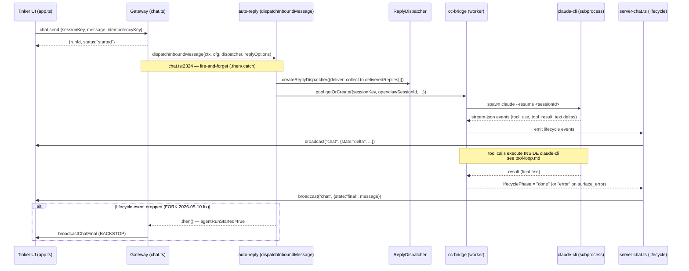

**Invariants:**

- Every `chat.send` run terminates with at least one `chat` broadcast where `state ∈ {final, error, aborted}`. Enforced by `server-chat.ts:emitChatFinal` (lifecycle path) + `chat.ts:2515` (backstop, FORK 2026-05-10, see bible §11.6e).
- `runId` returned by `chat.send` is the same `runId` carried in every subsequent `chat` broadcast for that run.
- `dispatchAgent:false` short-circuits after the synchronous ack — caller still receives `{runId, status:"started"}`, but no transcript write, no `dispatchInboundMessage`, no `chat` broadcasts. F1's invariant probe uses this so the bible merge gate does not surface "FLOWS-F1-VERIFY" + an agent reply in the user's Tinker UI session. `deliver` only governs OUTBOUND channel routing (WA etc.); the in-app `broadcast("chat", …)` fan-out is keyed by sessionKey and ignores `deliver`. Added `chat.ts:2068` (FORK 2026-05-12).

**Last verified:** 2026-05-12 — F1 runs with `dispatchAgent:false` (zero broadcasts, zero claude-cli spawns).

---

## F2. WhatsApp inbound DM → reply

**Trigger:** the owner sends a WhatsApp message that matches the trigger contract (owner+prefix or noPrefixChats).
**Entry:** `extensions/tinkerclaw-whatsapp/src/auto-reply/monitor/...` (wm adapter)
**Exit:** WhatsApp outbound delivered via `deliverWebReply` (misleading name, see topology.md).

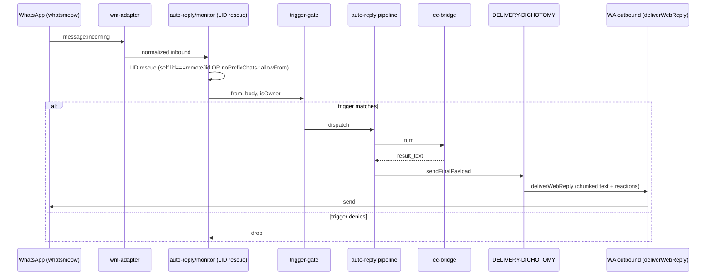

**Invariants:**

- LID rescue gates: `self.lid===remoteJid` OR (`remoteJid ∈ noPrefixChats ∧ allowFrom`). Anything looser triggers the 2026-05-04 sister-DM bug. See bible §13 + memory `Sister-DM trigger bug`.
- For `fromMe=true` self-DM: trigger fires only with explicit owner+prefix.
- Heartbeat reactions alternate 🤔/🤖 ~1/sec while processing; cleared with empty reaction on completion.

**Open follow-up:** populate `self.lid` from whatsmeow auth state (memory note 2026-05-04).

---

## F3. Surface-error → envelope → broadcast

**Trigger:** LLM/provider failure that the agent runner classifies as `surface_error` (timeout, overload, auth, etc.).
**Entry:** `src/agents/pi-embedded-runner/run/assistant-failover.ts`
**Exit:** Channel-appropriate error envelope delivered.

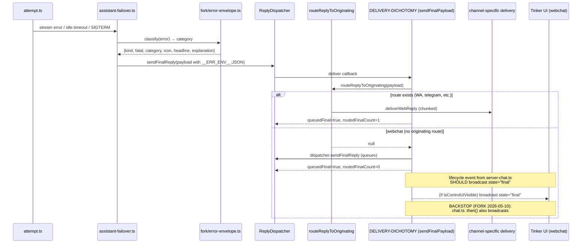

**Invariants:**

- `routedFinalCount=0` for webchat is normal (it's a count of _originating-channel_ routes; webchat uses the dispatcher path).
- The 2026-05-10 backstop in `chat.ts` `.then()` guarantees `broadcastChatFinal` fires even if the lifecycle path drops.

**Bug history:** see failures.md (regression C — chat.send broadcast hole).

---

## F4. Gateway restart → recovery → orange chip → resume

**Trigger:** gateway process exits (SIGUSR1 graceful, SIGTERM, or crash) and boots back up.
**Entry:** `src/gateway/server-startup-post-attach.ts` → `src/agents/main-session-restart-recovery.ts`
**Exit:** TUI sees orange `__ERR_ENV__` chip; agent run resumes on the existing session (cc-bridge resumes claude-cli via session-map openclawSessionId fallback).

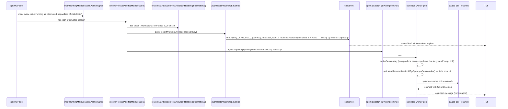

**Invariants:**

- Every status:`running` session at boot is marked interrupted, regardless of lock state.
- Tail-check is informational; resume is always attempted (FORK 2026-05-10).
- cc-bridge worker-pool prefers `getLatestResumeSessionIdByOpenclawSessionId` over hash-derived sessionKey (FORK 2026-05-10 fix for sessionKey hash drift after [System] continue).
- The envelope chip fires BEFORE the agent dispatch so the user sees the restart first, the resume second.
- **Client-side hold (FORK 2026-05-11):** before the WS closes, the gateway broadcasts `shutdown { restartExpectedMs }`. `tinker-ui/src/app.ts` marks every entry in `activeRuns` with `state: "restarting"`; the `ws addEventListener("close")` handler then preserves `activeRuns` instead of clearing them, and `renderThinkingIndicator()` paints a `RESTARTING` badge alongside the live dots. The resumed agent run's natural lifecycle `start` event replaces the entry on the new gateway, removing the badge. Safety-net: `scheduleUnconfirmedPrune` keeps restarting runs for 30 s (vs 5 s for normal unconfirmed runs) before evicting them — so even if the resume dispatch is delayed, the indicator clears cleanly rather than persisting forever.

**Last verified:** 2026-05-10 commit 78594ebd1a via marker-quote-back test (`MARKER-FIBONACCI-1-1-2-3-5-8-PROOF-FINAL`); client-side hold added 2026-05-11 commit `950b1a83c6`.

---

## F5. `/new` → briefing injection → agent

**Trigger:** user types `/new` in Tinker UI.
**Entry:** `tinker-ui/src/app.ts:buildInjectedPrompt`
**Exit:** Jarvis executes the morning-briefing pipeline.

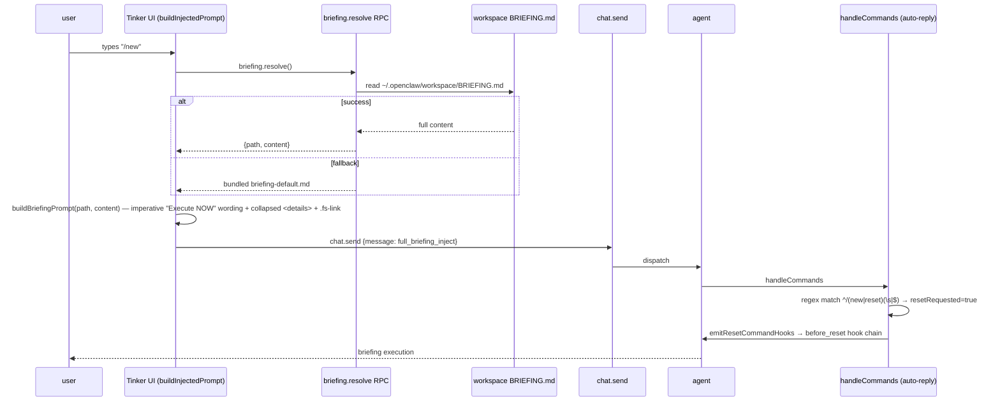

**Invariants:**

- Wording must include the imperative sentinel `"Execute the morning briefing NOW"` (regex-match-detected by `reconstructInjectionFields`).
- The path link in the user bubble uses `<code class="fs-link" data-path="...">` (reuses `config.openExternalFile` RPC).
- Falls back gracefully: RPC error → soft suffix; bundled missing → soft suffix.

**See also:** bible §11.6b for the imperative-wording rationale (model was acknowledging instead of executing).

---

## F6. cc-bridge tool call (claude-cli internal)

This flow is short by design and has its own document. See `tool-loop.md`.

**One-liner:** tool_use blocks are visible in the UI (via cc-bridge stream events) but NOT placed in `assistant.message.content`, to prevent pi-agent-core's agent-loop from re-executing them via the OpenClaw exec tool. FORK 2026-04-22.

---

## F7. chat.inject → transcript → webchat broadcast

**Trigger:** any code calls `chat.inject` (today: restart-recovery envelope, plugin error envelopes).
**Entry:** `src/gateway/server-methods/chat.ts:chatHandlers["chat.inject"]`
**Exit:** TUI subscription receives the injected message.

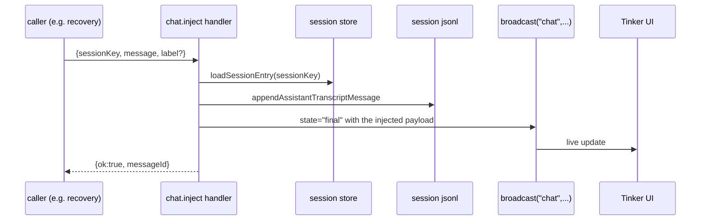

**Invariants:**

- The injected message is persisted to the session transcript BEFORE the broadcast, so a refresh shows it consistently.
- Used today for: the restart-warning orange chip (F4), error envelopes from non-agent paths.

---

---

## F-PLAN-RESUME. Gateway restart → plan-aware [System] continue

**Trigger:** gateway process boots up (SIGUSR1 graceful, SIGTERM, or crash); there is at least one active plan in `state/prefrontal/plans/*.md`.
**Entry:** `extensions/tinkerclaw-prefrontal/src/index.ts:register()` → `runRestartContinue` (30s debounce after boot)
**Exit:** Jarvis receives a plan-aware `[System] continue` dispatch and picks up execution from the correct step; TUI shows a grey `__SYS_PLAN_RESUME__` chip.

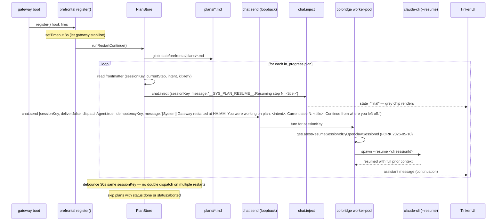

**Invariants:**

- Debounce window: 30s per sessionKey. If the gateway bounces twice in <30s only one dispatch fires.
- Plans with `status: done` or `status: aborted` are skipped.
- The `__SYS_PLAN_RESUME__` sentinel is injected via `chat.inject` BEFORE `chat.send` so the chip appears before the agent resumes.
- The dispatch uses `deliver: false, dispatchAgent: true` — INTERNAL_MESSAGE_CHANNEL routes to the agent, the webchat subscription sees only the chip (no duplicate user bubble). See flows.md F1 invariants.
- The `systemKind: "plan-resume"` annotation is carried in the loopback call metadata for diagnostic filtering.
- cc-bridge resume uses `getLatestResumeSessionIdByOpenclawSessionId` (FORK 2026-05-10) so sessionKey hash drift after the `[System] continue` message is tolerated.

**See also:** lifecycles.md L-PLAN, L-STEP; tinker-ui.md §**SYS_PLAN_RESUME** chip family.

---

## F-KIT-INSTALL. Journey kit install (sandboxed)

**Trigger:** caller invokes `prefrontal.kit.install { kitRef }`.
**Entry:** `extensions/tinkerclaw-prefrontal/src/recipe-rpcs.ts:handleKitInstall`
**Exit:** files written to `~/.openclaw/workspace/kits/<owner>/<slug>/`; caller receives `{ ok, installedPath, preflightResults, nextSteps }`.

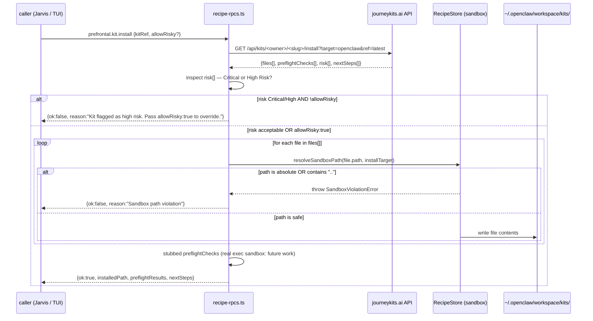

**Invariants:**

- Every file path in the install payload passes through `resolveSandboxPath` — no bypass, no trusted-path exceptions.
- Risk-gating is active: kits with `risk` containing `"Critical"` or `"High Risk"` require explicit `allowRisky: true`.
- Preflight execution is **stubbed** — `preflightChecks` are returned as-is from the API response. Real execution in a sandbox is future work.
- The install target is `~/.openclaw/workspace/kits/<owner>/<slug>/`. Source-tree kits (bundled at `extensions/tinkerclaw-prefrontal/kits/`) are never overwritten by install — they are separate.
- `nextSteps` is passed through verbatim from the Journey API response for the caller to display.

**See also:** lifecycles.md L-KIT-INSTALL; subagents-and-recipes.md §Kits.

---

## F-RECIPE-STATE. Recipe run → live recipe-state → RECIPES panel header

**Trigger:** caller invokes `prefrontal.recipe.run { kitRef, sessionKey, intent }` (the RECIPES-panel-backed kit execution path).
**Entry:** `extensions/tinkerclaw-prefrontal/recipe-rpcs.ts:"prefrontal.recipe.run"` → `recipe-runner.ts:runRecipe`
**Exit:** Tinker UI RECIPES panel paints the rich recipe header (recipeId + step M/N + parallelism cap + in-flight labels) from live data instead of the synthetic fallback plan.

**PRIOR GAP (fixed 18e618d241, FORK 2026-05-31):** the panel was dull because `runRecipe` NEVER emitted recipe-state — the rich header (`renderRecipeHeader`, panels.md) had no data source, so the panel always fell back to the synthetic 2-step "Thinking → Acting" plan. The fix wires the **producer** half: `runRecipe` now calls `onRecipeState` at kit start, on each parallel-group transition, and on completion.

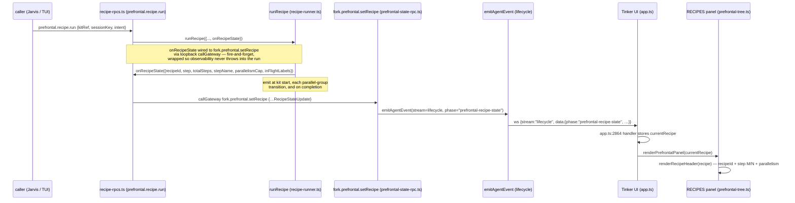

**Invariants:**

- The recipe-state emit is **best-effort, fire-and-forget**: `recipe-rpcs.ts` wraps the `callGateway` in `.catch(() => {})` and `runRecipe` wraps every `onRecipeState` call so observability NEVER throws into the execution loop. A dead/closed UI must not stall a run.
- `onRecipeState` is the PRODUCER seam (the half that was missing). The `RecipeStateUpdate` payload mirrors the `fork.prefrontal.setRecipe` param shape so `recipe-rpcs.ts` forwards it verbatim; progress fields are optional (the start emit may omit step detail).
- The lifecycle phase token is `prefrontal-recipe-state` (single owner of the emit: `src/fork/prefrontal-state-rpc.ts`; the UI gate keys on `p.data.phase === "prefrontal-recipe-state"`).
- The header data is **last-write-wins** in the UI: `currentRecipe` holds only the latest event, not a history.

**See also:** subagents-and-recipes.md §Kits (the parallel-group/runRecipe execution mechanism that GENERATES the transitions); panels.md (`renderRecipeHeader` render + RECIPES-panel fallback semantics); lifecycles.md L-STEP (per-step status barrier).

---

## F-RECIPE-EVOLVE. Episode complete → consolidation fitness → mutation self-apply → matcher re-reads (U1, J5+J13)

**Trigger:** the `engram-consolidate` cron fires `consolidate()` over the day's closed episodes; at least one episode carries a `recipe:<owner/slug>` attribution tag.
**Entry (producer of tags):** `extensions/tinkerclaw-prefrontal/recipe-runner.ts:runRecipe` stamps `recipe:<owner/slug>` via the `onTag` sink (wired by `prefrontal.recipe.run`) at run start + each task dispatch.
**Entry (loop):** `src/memory/engram/sleep-consolidation.ts:consolidate()` §3b (opt-in, only when `config.recipeEvolution` is injected).
**Exit:** for each `autoPromotable` proposal the on-disk recipe file is rewritten, the matcher's in-memory kit index is dropped, and the next turn's matcher re-scans the catalog with the new body + updated fitness boost.

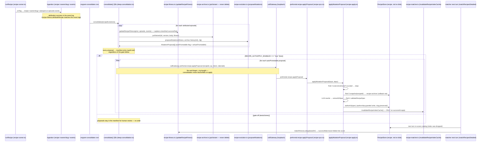

**Invariants:**

- **Attribution is explicit, never inferred.** `recipe-fitness.attributeRecipe` matches ONLY the literal `recipe:<owner/slug>` tag stamped by `recipe-runner.ts` `onTag`. No tag → no fitness update → no false attribution (`sleep-consolidation.ts:322` `continue`).
- **The archive never deletes.** `recipe-archive.putVariant` appends a versioned variant per consolidation pass; rollback is always possible. The apply path additionally snapshots the live body into `.recipe-archive/` (Rail 3) before any rewrite.
- **`autoPromotable` is the only auto-apply gate inside the loop**, AND the whole self-apply block is gated by `RECIPE_AUTOAPPLY_ENABLED === "true"` (strict equality — OFF in tests/clones; live in prod, see memory `Jarvis full-autonomy flags`). Every proposal lands in the manifest regardless, so the audit trail exists even when the apply is gated off.
- **`invalidateRecipeIndexCache()` fires only on a successful `authorKit`** (`recipe-apply.ts:208`) — a no-op/skip/reject never triggers a spurious catalog re-scan. Without this, an autonomous rewrite would only take effect after a process restart (or an unrelated dir-mtime bump).
- **Selection feedback closes the loop:** the matcher reads `makeFitnessLookup(engramBaseDir)` as the `feedback` arg into `matchRecipesDetailed` (`recipe-rpcs.ts:420`), so the just-updated `successRate` boosts the recipe's score on the next match. Precedence: base score → U1 fitness feedback → U12 rating tie-break (see config-shape.md scoreRecipe composition).
- **The rewrite is authorship-guarded** (Rail 2): `applyMutationProposal` refuses any recipe that is not `isJarvisAuthored` — hand-curated kits are never auto-mutated.

**State machines:** see lifecycles.md L-RECIPE / L-RECIPE-VARIANT (fitness/version transitions, archive lifecycle) — those are the single owner of the per-recipe state facts; this diagram owns only the call sequence.

**See also:** config-shape.md (`RECIPE_AUTOAPPLY_ENABLED` flag + scoreRecipe precedence + the 5 apply rails); subagents-and-recipes.md §Kits (`runRecipe`/`onTag` producer mechanics); failures.md (apply-failure → keep-original fallbacks).

---

## F-TOT-DELIBERATE. Pre-prompt Tree-of-Thoughts deliberation → turn-local prompt → trace persist (U10, J3↔J13)

**Trigger:** an interactive turn is about to call `activeSession.prompt(...)` AND `fork.cognitive.reasoning` config is `"tree"` or `"lats"` (default `"none"` → pure pass-through).
**Entry:** `src/agents/pi-embedded-runner/run/attempt.ts:~2783` (the pre-prompt deliberation block) → `src/fork/reasoning-runtime.ts:maybeRunThoughtSearch`.
**Exit:** the model runs THIS turn with a `## Deliberation` block folded into the system prompt; the search tree is persisted as a `reasoning_tree_state` MemoryEvent on turn complete; the base prompt is restored so nothing leaks into the next turn.

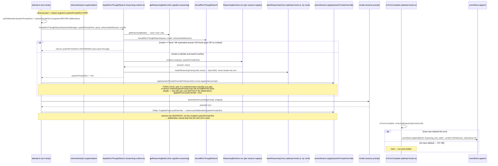

**Invariants:**

- **Default-off.** `getReasoningMode` returns `"none"` unless `fork.cognitive.reasoning ∈ {tree, lats}`; `maybeRunThoughtSearch` is then a pure identity on the system prompt. ToT is opt-in/expensive.
- **Deliberation runs AFTER retrieval/reinject augmentation** so the search sees the fully assembled context, then folds `## Deliberation` onto that augmented base.
- **Skips automated sessions.** `isAutomatedReasoningSession` is true for subagent/ACP/probe/`cron:`/`heartbeat`/`isolated:` keys and missing keys — a search before every cron tick is wasteful and risks recursive triggering.
- **TURN-LOCAL, leak-proof (BUGFIX, FORK U10).** `preDeliberationSystemPromptText` snapshots the TRUE base BEFORE the deliberation augments it; the `finally` restores that snapshot (gated on `appliedTurnLocalOverride`), NOT the mutated `systemPromptText`. The prior bug: when a `runtimeContext` override was present the session held `runtimeSystemPrompt` built from the pre-deliberation base, so either the deliberation never reached the model OR it leaked into the next turn — fixed by re-deriving `runtimeSystemPrompt` from the augmented base for the turn and restoring the captured pre-deliberation base in `finally`.
- **Trace persistence is producer→consumer by `runId`.** `maybeRunThoughtSearch` is the producer (`stashReasoningTrace(runId, trace)`); `onTurnComplete` is the consumer (`consumeReasoningTrace(runId)` → `reasoning_tree_state` MemoryEvent, `importance:4`). Both legs are best-effort try/caught — a stash/persist failure never breaks the turn. No trace stashed (the default) → consume path is inert, no event written.
- **NOT a fractal trigger.** The fractal/round-table escalation fires separately post-turn; the ToT deliberation is strictly pre-prompt and single-session.

**State machines:** see lifecycles.md L-REASONING (none→tree→lats tri-state + the per-turn apply/restore states) — the single owner of the reasoning-mode state facts; this diagram owns only the call sequence.

**See also:** config-shape.md (`fork.cognitive.reasoning` key + the `fork.reasoning.search` RPC that runs a model — do NOT add it to a verify block); memory-layout.md (`reasoning_tree_state` EventKind + importance ranking); failures.md (deliberation failure → pass-through).

---

## Auto-validation

Each diagram should be paired with an `[idle-timeout-diag]`-style probe that emits one log line per traversal. Today only F1 has this (the `idle-timeout-diag` line). Probes for F2–F7 are listed as proposed in `probes.md`.

## Update cadence

Refactor-driven. A flow diagram changes only when the call graph between named components changes. If you touch any of the file paths cited above, re-validate the diagram and bump `last_verified_commit`.
