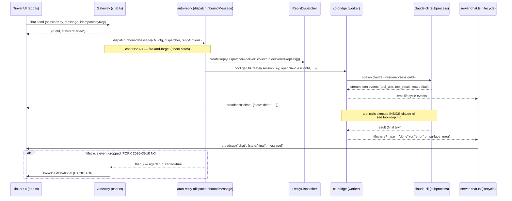
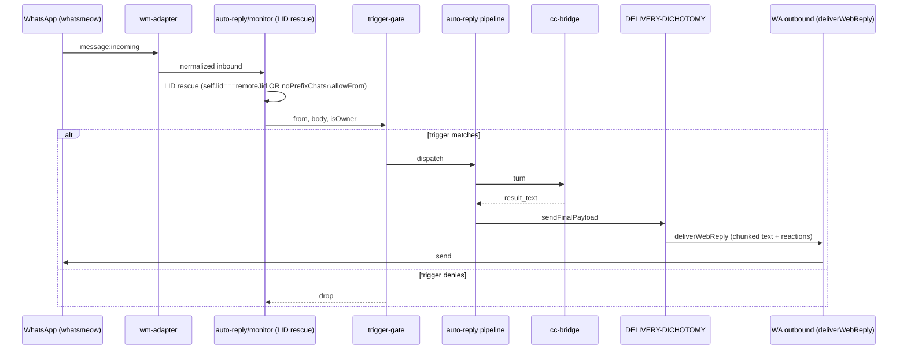
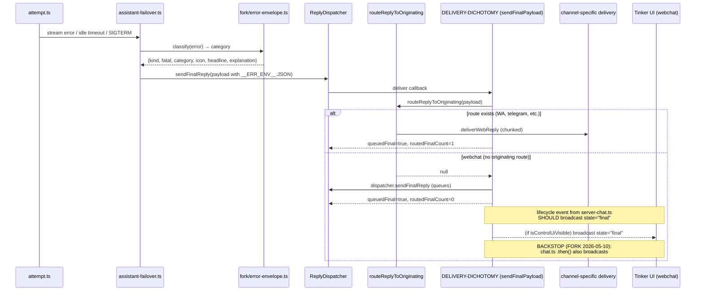
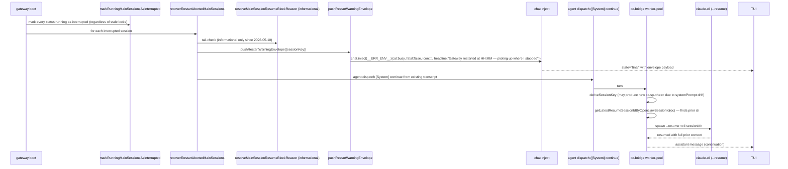
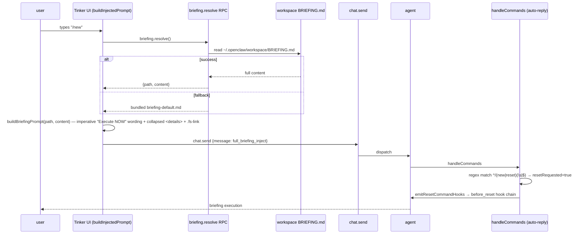
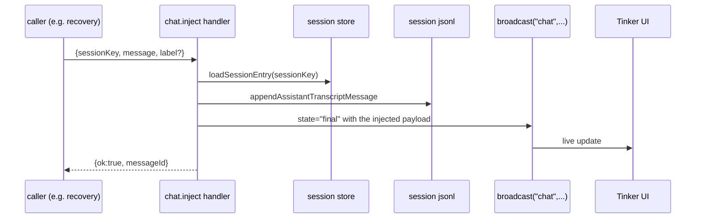

# Flows — top pipelines

Each diagram below is the canonical sequence-of-calls for one pipeline. If the diagram disagrees with the code at HEAD, the diagram is stale and must be re-verified.

---

## F1. Tinker UI inbound: `chat.send` → cc-bridge → reply

**Trigger:** user types a message in Tinker UI webchat.
**Entry:** `src/gateway/server-methods/chat.ts:chatHandlers["chat.send"]`
**Exit:** TUI receives `chat` broadcast with `state="final"` or `state="error"`.

**Invariants:**

- Every `chat.send` run terminates with at least one `chat` broadcast where `state ∈ {final, error, aborted}`. Enforced by `server-chat.ts:emitChatFinal` (lifecycle path) + `chat.ts:2515` (backstop, FORK 2026-05-10, see bible §11.6e).
- `runId` returned by `chat.send` is the same `runId` carried in every subsequent `chat` broadcast for that run.

**Last verified:** 2026-05-10 commit 78594ebd1a via the `FIX-VERIFY-Q1` test (`status="final"` received within 30s).

---

## F2. WhatsApp inbound DM → reply

**Trigger:** the owner sends a WhatsApp message that matches the trigger contract (owner+prefix or noPrefixChats).
**Entry:** `extensions/tinkerclaw-whatsapp/src/auto-reply/monitor/...` (wm adapter)
**Exit:** WhatsApp outbound delivered via `deliverWebReply` (misleading name, see topology.md).

**Invariants:**

- LID rescue gates: `self.lid===remoteJid` OR (`remoteJid ∈ noPrefixChats ∧ allowFrom`). Anything looser triggers the 2026-05-04 sister-DM bug. See bible §13 + memory `Sister-DM trigger bug`.
- For `fromMe=true` self-DM: trigger fires only with explicit owner+prefix.
- Heartbeat reactions alternate 🤔/🤖 ~1/sec while processing; cleared with empty reaction on completion.

**Open follow-up:** populate `self.lid` from whatsmeow auth state (memory note 2026-05-04).

---

## F3. Surface-error → envelope → broadcast

**Trigger:** LLM/provider failure that the agent runner classifies as `surface_error` (timeout, overload, auth, etc.).
**Entry:** `src/agents/pi-embedded-runner/run/assistant-failover.ts`
**Exit:** Channel-appropriate error envelope delivered.

**Invariants:**

- `routedFinalCount=0` for webchat is normal (it's a count of _originating-channel_ routes; webchat uses the dispatcher path).
- The 2026-05-10 backstop in `chat.ts` `.then()` guarantees `broadcastChatFinal` fires even if the lifecycle path drops.

**Bug history:** see failures.md (regression C — chat.send broadcast hole).

---

## F4. Gateway restart → recovery → orange chip → resume

**Trigger:** gateway process exits (SIGUSR1 graceful, SIGTERM, or crash) and boots back up.
**Entry:** `src/gateway/server-startup-post-attach.ts` → `src/agents/main-session-restart-recovery.ts`
**Exit:** TUI sees orange `__ERR_ENV__` chip; agent run resumes on the existing session (cc-bridge resumes claude-cli via session-map openclawSessionId fallback).

**Invariants:**

- Every status:`running` session at boot is marked interrupted, regardless of lock state.
- Tail-check is informational; resume is always attempted (FORK 2026-05-10).
- cc-bridge worker-pool prefers `getLatestResumeSessionIdByOpenclawSessionId` over hash-derived sessionKey (FORK 2026-05-10 fix for sessionKey hash drift after [System] continue).
- The envelope chip fires BEFORE the agent dispatch so the user sees the restart first, the resume second.
- **Client-side hold (FORK 2026-05-11):** before the WS closes, the gateway broadcasts `shutdown { restartExpectedMs }`. `tinker-ui/src/app.ts` marks every entry in `activeRuns` with `state: "restarting"`; the `ws addEventListener("close")` handler then preserves `activeRuns` instead of clearing them, and `renderThinkingIndicator()` paints a `RESTARTING` badge alongside the live dots. The resumed agent run's natural lifecycle `start` event replaces the entry on the new gateway, removing the badge. Safety-net: `scheduleUnconfirmedPrune` keeps restarting runs for 30 s (vs 5 s for normal unconfirmed runs) before evicting them — so even if the resume dispatch is delayed, the indicator clears cleanly rather than persisting forever.

**Last verified:** 2026-05-10 commit 78594ebd1a via marker-quote-back test (`MARKER-FIBONACCI-1-1-2-3-5-8-PROOF-FINAL`); client-side hold added 2026-05-11 commit `950b1a83c6`.

---

## F5. `/new` → briefing injection → agent

**Trigger:** user types `/new` in Tinker UI.
**Entry:** `tinker-ui/src/app.ts:buildInjectedPrompt`
**Exit:** Jarvis executes the morning-briefing pipeline.

**Invariants:**

- Wording must include the imperative sentinel `"Execute the morning briefing NOW"` (regex-match-detected by `reconstructInjectionFields`).
- The path link in the user bubble uses `<code class="fs-link" data-path="...">` (reuses `config.openExternalFile` RPC).
- Falls back gracefully: RPC error → soft suffix; bundled missing → soft suffix.

**See also:** bible §11.6b for the imperative-wording rationale (model was acknowledging instead of executing).

---

## F6. cc-bridge tool call (claude-cli internal)

This flow is short by design and has its own document. See `tool-loop.md`.

**One-liner:** tool_use blocks are visible in the UI (via cc-bridge stream events) but NOT placed in `assistant.message.content`, to prevent pi-agent-core's agent-loop from re-executing them via the OpenClaw exec tool. FORK 2026-04-22.

---

## F7. chat.inject → transcript → webchat broadcast

**Trigger:** any code calls `chat.inject` (today: restart-recovery envelope, plugin error envelopes).
**Entry:** `src/gateway/server-methods/chat.ts:chatHandlers["chat.inject"]`
**Exit:** TUI subscription receives the injected message.

**Invariants:**

- The injected message is persisted to the session transcript BEFORE the broadcast, so a refresh shows it consistently.
- Used today for: the restart-warning orange chip (F4), error envelopes from non-agent paths.

---

## Auto-validation

Each diagram should be paired with an `[idle-timeout-diag]`-style probe that emits one log line per traversal. Today only F1 has this (the `idle-timeout-diag` line). Probes for F2–F7 are listed as proposed in `probes.md`.

## Update cadence

Refactor-driven. A flow diagram changes only when the call graph between named components changes. If you touch any of the file paths cited above, re-validate the diagram and bump `last_verified_commit`.
