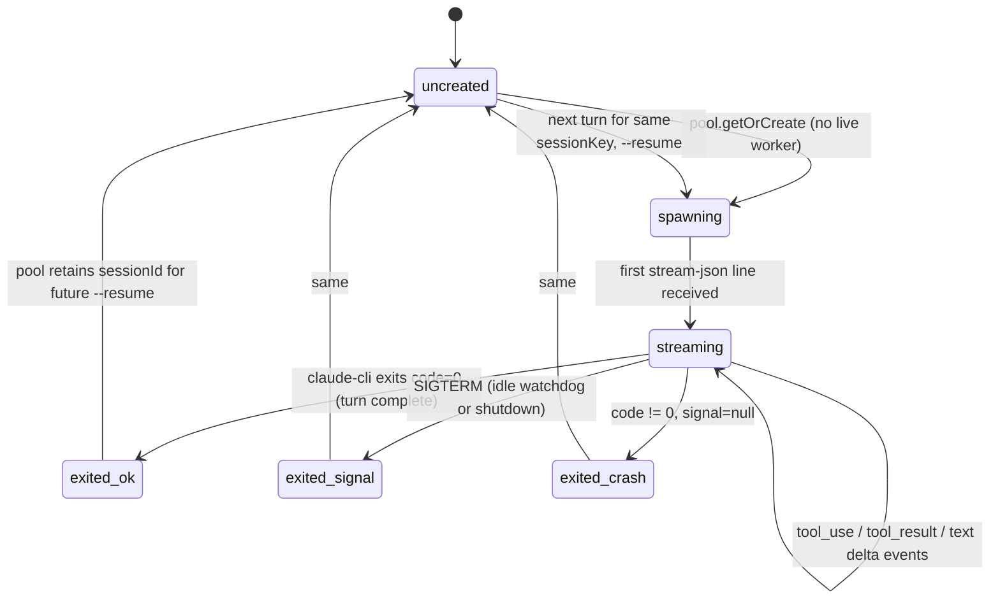
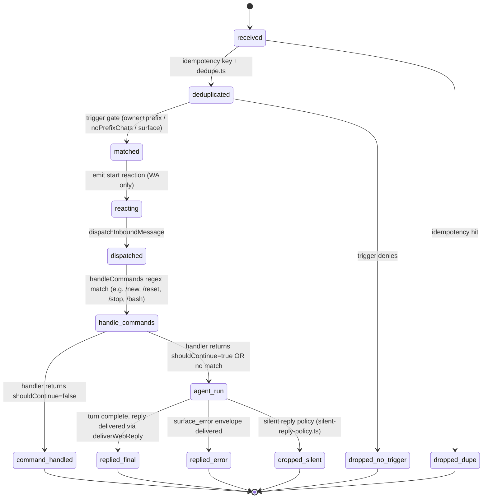
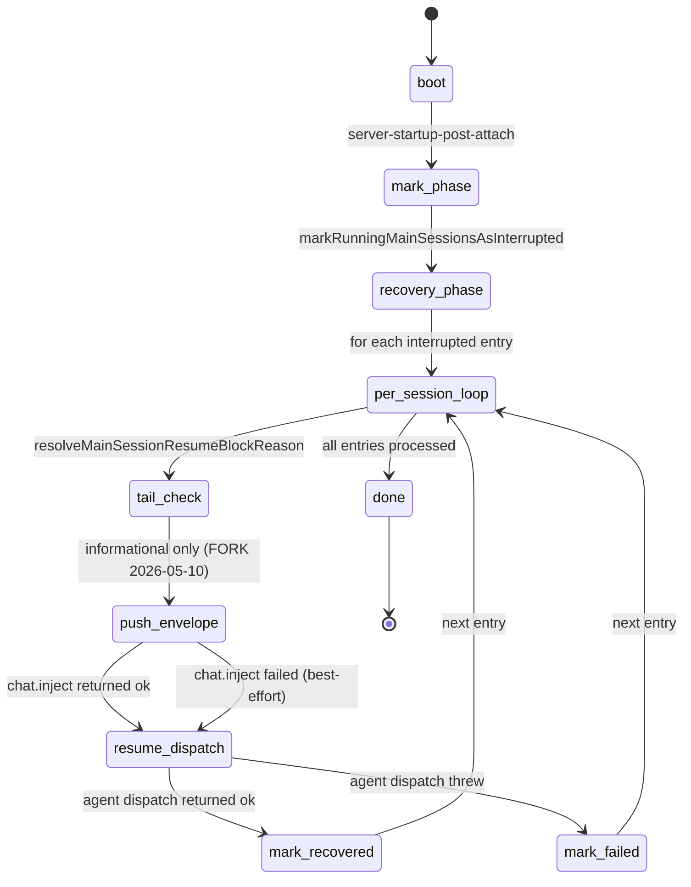
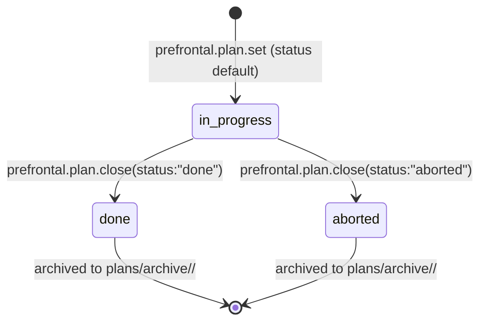
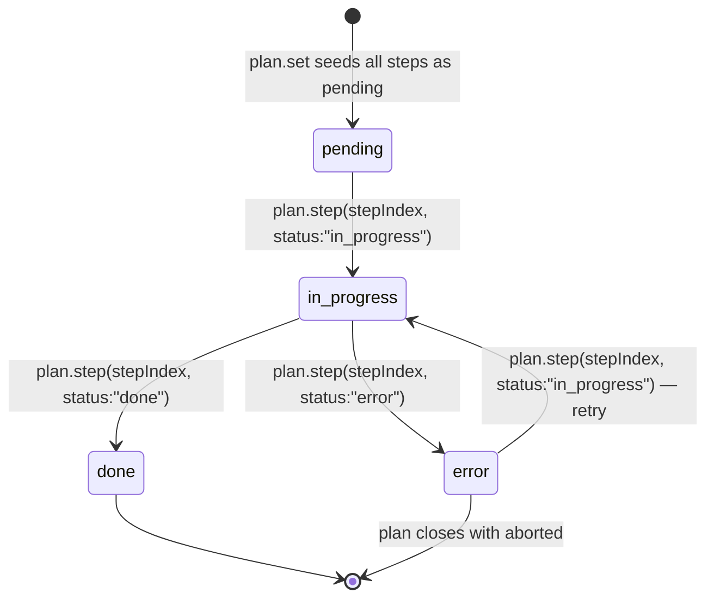
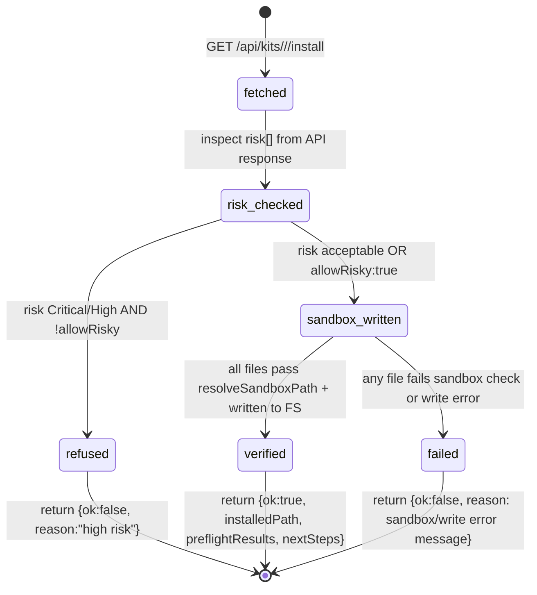

# Lifecycles — state machines

Each diagram below is the canonical state machine for one entity. If a transition that fires in code does not appear in the diagram, the diagram is incomplete (or the transition is the bug).

---

## L1. Agent session (`agent:main:*`)

**Entity:** entry in `~/.openclaw/agents/<agentId>/sessions/sessions.json`.

```mermaid
stateDiagram-v2
  [*] --> idle: session created
  idle --> running: chat.send / agent dispatch
  running --> done: turn complete, no error
  running --> failed: surface_error (model auth, billing, fatal classification)
  running --> aborted: explicit /stop or chatAbortController.abort
  running --> timeout: run timeoutMs exceeded
  running --> interrupted: gateway boot detects status:running (markRunningMainSessionsAsInterrupted)
  interrupted --> running: recoverRestartAbortedMainSessions → resume dispatch
  interrupted --> failed: tail-check informational; still attempts resume (FORK 2026-05-10)
  done --> idle: next user message
  failed --> idle: next user message
  aborted --> idle: next user message
  timeout --> idle: next user message
```

**Invariants:**

- `running + abortedLastRun=true` at boot ALWAYS becomes `interrupted` then `running` again via recovery (FORK 2026-05-10, see bible §11.6c).
- `running` should never persist past the agent's `timeoutSeconds` without a state transition. Today this is _not_ enforced synchronously — the recovery code catches it on next boot. **Open follow-up** to mark `failed` on surface_error inside the lane, not just on next reboot.

**Probe:** `debug.session.state({sessionKey})` (proposed) — returns current status, abortedLastRun, lane state, queued replies.

---

## L2. cc-bridge claude-cli worker

**Entity:** `ClaudeCodeWorker` instance held by `SessionWorkerPool`, one per cc-bridge sessionKey.



**Resume lookup priority** (worker-pool.ts, FORK 2026-05-10):

1. `getLatestResumeSessionIdByOpenclawSessionId(openclawSessionId)` — canonical, survives sessionKey hash drift
2. `getResumeSessionId(sessionKey)` — fallback for legacy entries

**Invariants:**

- A worker that has SIGTERMed retains its `sessionId` in session-map.json so the NEXT turn resumes the same claude-cli conversation.
- Worker pool is gateway-wide singleton; `killAll()` runs on `exit`/`SIGTERM`/`SIGINT`.
- A turn's `signal: AbortSignal` parameter, when aborted, calls `worker.kill("SIGTERM")` — this is how the LLM idle watchdog terminates a stuck worker.

**Probe:** `cc-bridge.workerInfo({sessionKey})` (proposed) — alive?, current cli sessionId, last turn duration.

---

## L3. Inbound message (any channel)

**Entity:** one message arriving from a channel adapter.



**Invariants:**

- For WhatsApp: every state transition is reflected in chat reactions (🤔 thinking, 🤖 active, ✅ done, ⚠️ error).
- `dropped_dupe` and `dropped_no_trigger` are the only states with NO outbound; everything else emits something the user can see.
- `handle_commands` runs BEFORE `agent_run` and can short-circuit (e.g., `/stop`, `/bash`, `/restart`).

---

## L4. Restart-recovery flow (boot)

**Entity:** the gateway boot sequence for main-session recovery.



**Invariants:**

- The envelope (orange chip) ALWAYS fires before the resume dispatch, so the user sees the restart first.
- Resume is attempted regardless of tail-check result (FORK 2026-05-10).
- Only `agent:main:*` sessions are eligible. Subagent, cron, ACP sessions are skipped (`shouldSkipMainRecovery`).
- Recovery is bounded: `DEFAULT_RECOVERY_DELAY_MS=5000`, `MAX_RECOVERY_RETRIES=3`, exponential backoff.

---

## L5. chat.send run (single turn)

**Entity:** one `chat.send` RPC invocation, identified by `runId`.

```mermaid
stateDiagram-v2
  [*] --> accepted
  accepted --> dispatched: dispatchInboundMessage fire-and-forget
  dispatched --> streaming: cc-bridge spawns / pi-agent-core streamFn
  streaming --> streaming: state="delta" broadcasts
  streaming --> finalizing_ok: lifecyclePhase=done
  streaming --> finalizing_error: lifecyclePhase=error OR surface_error
  streaming --> aborted_ext: chatAbortController.abort (user /stop, gateway shutdown)
  finalizing_ok --> broadcast_final: emitChatFinal jobState="done"
  finalizing_error --> broadcast_error: emitChatFinal jobState="error"
  aborted_ext --> broadcast_aborted: emitChatFinal jobState="error" (errorKind=aborted)
  broadcast_final --> cleanup: agentRunSeq.delete + chatAbortControllers cleanup
  broadcast_error --> cleanup
  broadcast_aborted --> cleanup
  cleanup --> [*]
  Note right of broadcast_final: BACKSTOP (FORK 2026-05-10):<br/>chat.ts .then() also fires<br/>broadcastChatFinal when<br/>agentRunStarted=true. Idempotent<br/>via agentRunSeq.delete.
```

**Invariants:**

- Every `runId` ends in a broadcast with `state ∈ {final, error, aborted}`.
- `agentRunSeq` map is the source of truth for run sequence numbers; `delete` is the cleanup signal.

**Open follow-up:** unify the lifecycle path (`server-chat.ts:emitChatFinal`) and the backstop path (`chat.ts:.then() broadcastChatFinal`) into a single emitter. Today they coexist as defense-in-depth; ultimately one should call the other.

---

---

## L-PLAN — Plan lifecycle (plan-store managed)

**Entity:** one plan document at `~/.openclaw/workspace/state/prefrontal/plans/<sessionKey-slug>.md`.



**Invariants:**

- `prefrontal.plan.set` always creates with `status: in_progress` unless an explicit `status` is passed.
- `prefrontal.plan.close` transitions to `done` or `aborted` and moves the file to the archive directory.
- The archive path is `~/.openclaw/workspace/state/prefrontal/plans/archive/<YYYY-MM-DD>/<sessionKey-slug>.md`.
- `prefrontal.plan.get` returns `null` for plans that have been closed/archived.
- A sessionKey can have at most one active (in_progress) plan at a time — calling `plan.set` again replaces the existing plan.

**Probe:** `prefrontal.plan.get({ sessionKey })` — returns `{ plan }` with current frontmatter.

---

## L-STEP — Step lifecycle within a plan

**Entity:** one step entry within a plan document (indexed 0-based by `currentStep`).



**Invariants:**

- **At most one step may be `in_progress` at a time per plan.** Calling `plan.step` with `status: "in_progress"` for step N automatically demotes any previously `in_progress` step back to `pending`. Enforced by plan-store, not caller.
- Setting a step to `done` does not automatically advance `currentStep` — the caller must explicitly promote the next step.
- An `error` step can be retried by calling `plan.step` again with `status: "in_progress"`.
- Steps cannot be removed or reordered after the plan is created — only status mutations are allowed.

---

## L-KIT-INSTALL — Kit install lifecycle

**Entity:** one `prefrontal.kit.install` invocation.



**Invariants:**

- `fetched → risk_checked` is always synchronous — risk check happens before any file write.
- `sandbox_written` is atomic per-file: if any file fails, the whole install returns `{ok:false}`. Files already written in a partial install are NOT rolled back (future work: transactional write).
- Preflight execution is stubbed in the current implementation. `preflightResults` is returned verbatim from the API response; no actual script execution happens.
- The `verified` state does NOT mean the installed kit has been run or tested — only that all files were written without sandbox violations.

---

## Validation strategy

Each state machine should be paired with a probe that returns the entity's current state. Today only L1 has a partial probe (`sessions.json` direct read); L2–L5 need probes (see `probes.md`).

When a state transition is added in code, the diagram must be updated in the same PR. The merge gate (J15 §5) eventually enforces this by failing when a code path leaves a state with no diagram arrow.
