# Lifecycles — state machines

Each diagram below is the canonical state machine for one entity. If a transition that fires in code does not appear in the diagram, the diagram is incomplete (or the transition is the bug).

---

## L1. Agent session (`agent:main:*`)

**Entity:** entry in `~/.openclaw/agents/<agentId>/sessions/sessions.json`.

```mermaid
stateDiagram-v2
  [*] --> idle: session created
  idle --> running: chat.send / agent dispatch
  running --> done: turn complete, no error
  running --> failed: surface_error (model auth, billing, fatal classification)
  running --> aborted: explicit /stop or chatAbortController.abort
  running --> timeout: run timeoutMs exceeded
  running --> interrupted: gateway boot detects status:running (markRunningMainSessionsAsInterrupted)
  interrupted --> running: recoverRestartAbortedMainSessions → resume dispatch
  interrupted --> failed: tail-check informational; still attempts resume (FORK 2026-05-10)
  done --> idle: next user message
  failed --> idle: next user message
  aborted --> idle: next user message
  timeout --> idle: next user message
```

**Invariants:**

- `running + abortedLastRun=true` at boot ALWAYS becomes `interrupted` then `running` again via recovery (FORK 2026-05-10, see bible §11.6c).
- `running` should never persist past the agent's `timeoutSeconds` without a state transition. Today this is _not_ enforced synchronously — the recovery code catches it on next boot. **Open follow-up** to mark `failed` on surface_error inside the lane, not just on next reboot.

**Probe:** `debug.session.state({sessionKey})` (proposed) — returns current status, abortedLastRun, lane state, queued replies.

---

## L2. tinker-bridge claude-cli worker

**Entity:** `ClaudeCodeWorker` instance held by `SessionWorkerPool`, one per tinker-bridge sessionKey.

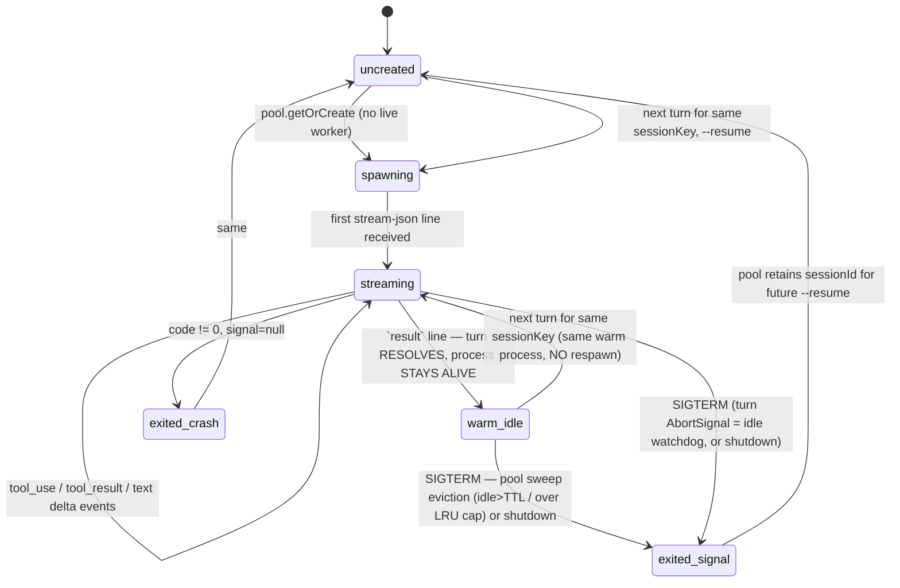

> NOTE (corrected 2026-05-16): the claude subprocess is **persistent**
> (`claude --input-format stream-json`). A completed turn does NOT exit the
> process — it stays warm for the next turn on the same sessionKey. The
> earlier diagram's `exited_ok: claude-cli exits code=0 (turn complete)`
> edge was wrong and is why the unbounded-sessionKey leak went unmodelled.

**Resume lookup priority** (worker-pool.ts, FORK 2026-05-10):

1. `getLatestResumeSessionIdByOpenclawSessionId(openclawSessionId)` — canonical, survives sessionKey hash drift
2. `getResumeSessionId(sessionKey)` — fallback for legacy entries

**Invariants:**

- The claude process is **persistent**: a completed turn keeps it warm; only SIGTERM (abort / pool eviction / shutdown) or a crash ends it.
- A worker that has SIGTERMed retains its `sessionId` in session-map.json so the NEXT turn resumes the same claude-cli conversation.
- Worker pool is gateway-wide singleton; `killAll()` runs on `exit`/`SIGTERM`/`SIGINT`.
- A turn's `signal: AbortSignal` parameter, when aborted, calls `worker.kill("SIGTERM")` — this is how the LLM idle watchdog terminates a stuck worker.
- **The pool is BOUNDED (FORK 2026-05-16, `worker-pool.ts`).** `SessionWorkerPool` sweeps on every `getOrCreate`: a non-busy worker idle past `idleTtlMs` (default 15 min) is SIGTERMed, and the pool is hard-capped at `maxWorkers` (default 32, LRU eviction of the least-recently-used non-busy worker). A worker mid-turn (`isBusy()`) and the sessionKey being requested are never evicted; evicted workers keep their `sessionId` in session-map.json so a later turn `--resume`s the same thread. Without this, a caller minting a unique sessionKey per work item (people-profiles cron — one key per profile) leaks one persistent ep_poll-blocked `claude` proc per item indefinitely (observed: 53 procs, oldest 7+ days, 2026-05-16). Enforced by the L2 `verify:` invariant above.

**Probe:** `tinker-bridge.workerInfo({sessionKey})` (proposed) — alive?, current cli sessionId, last turn duration.

---

## L3. Inbound message (any channel)

**Entity:** one message arriving from a channel adapter.

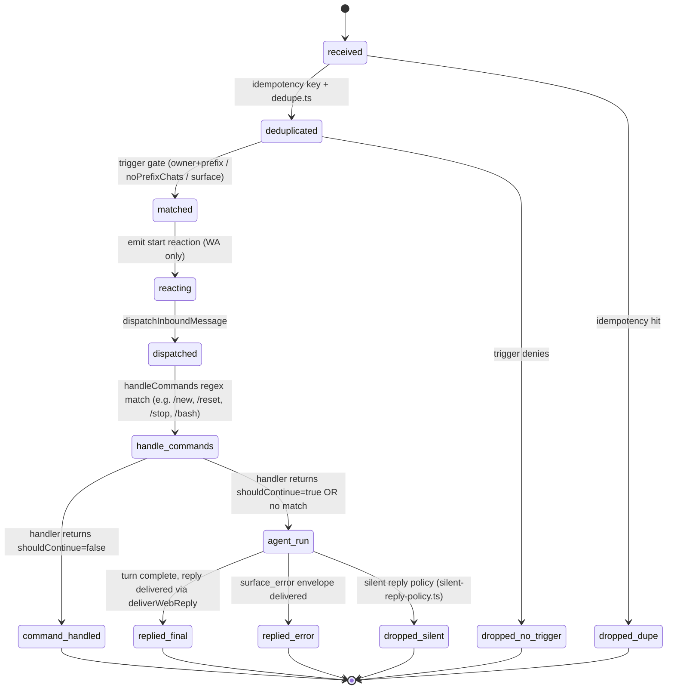

**Invariants:**

- For WhatsApp: every state transition is reflected in chat reactions (🤔 thinking, 🤖 active, ✅ done, ⚠️ error).
- `dropped_dupe` and `dropped_no_trigger` are the only states with NO outbound; everything else emits something the user can see.
- `handle_commands` runs BEFORE `agent_run` and can short-circuit (e.g., `/stop`, `/bash`, `/restart`).

---

## L4. Restart-recovery flow (boot)

**Entity:** the gateway boot sequence for main-session recovery.

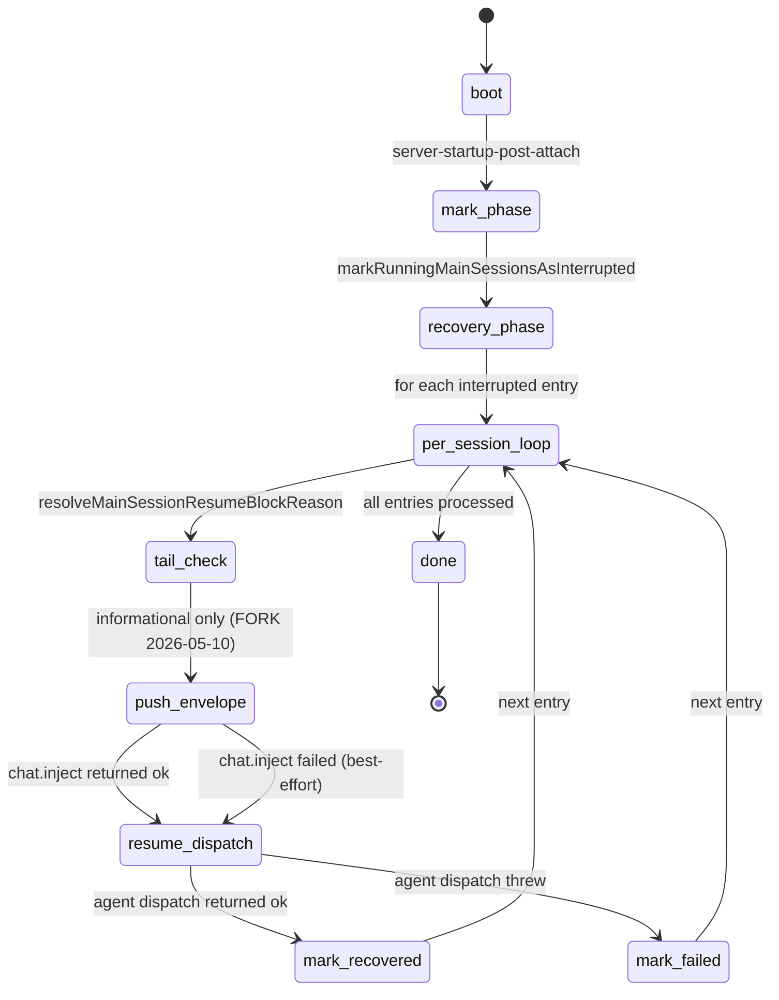

**Invariants:**

- The envelope (orange chip) ALWAYS fires before the resume dispatch, so the user sees the restart first.
- Resume is attempted regardless of tail-check result (FORK 2026-05-10).
- Only `agent:main:*` sessions are eligible. Subagent, cron, ACP sessions are skipped (`shouldSkipMainRecovery`).
- Recovery is bounded: `DEFAULT_RECOVERY_DELAY_MS=5000`, `MAX_RECOVERY_RETRIES=3`, exponential backoff.

---

## L5. chat.send run (single turn)

**Entity:** one `chat.send` RPC invocation, identified by `runId`.

```mermaid
stateDiagram-v2
  [*] --> accepted
  accepted --> dispatched: dispatchInboundMessage fire-and-forget
  dispatched --> streaming: tinker-bridge spawns / pi-agent-core streamFn
  streaming --> streaming: state="delta" broadcasts
  streaming --> finalizing_ok: lifecyclePhase=done
  streaming --> finalizing_error: lifecyclePhase=error OR surface_error
  streaming --> aborted_ext: chatAbortController.abort (user /stop, gateway shutdown)
  finalizing_ok --> broadcast_final: emitChatFinal jobState="done"
  finalizing_error --> broadcast_error: emitChatFinal jobState="error"
  aborted_ext --> broadcast_aborted: emitChatFinal jobState="error" (errorKind=aborted)
  broadcast_final --> cleanup: agentRunSeq.delete + chatAbortControllers cleanup
  broadcast_error --> cleanup
  broadcast_aborted --> cleanup
  cleanup --> [*]
  Note right of broadcast_final: BACKSTOP (FORK 2026-05-10):<br/>chat.ts .then() also fires<br/>broadcastChatFinal when<br/>agentRunStarted=true. Idempotent<br/>via agentRunSeq.delete.
```

**Invariants:**

- Every `runId` ends in a broadcast with `state ∈ {final, error, aborted}`.
- `agentRunSeq` map is the source of truth for run sequence numbers; `delete` is the cleanup signal.

**Open follow-up:** unify the lifecycle path (`server-chat.ts:emitChatFinal`) and the backstop path (`chat.ts:.then() broadcastChatFinal`) into a single emitter. Today they coexist as defense-in-depth; ultimately one should call the other.

---

## L-PROMPT — One user prompt, from keystroke to answer (client lane)

**Status:** DEPLOYED (FORK 2026-08-28). L5 above is the SERVER's view of the same turn, keyed by `runId`; this is the BROWSER's view of the same act, keyed by `_clientMsgId`. They meet at `chat.send`.

**Entity:** one user prompt in `tinker-ui`, identified by the single `clientMsgId` minted in `send()` (`tinker-ui/src/app.ts`) and reused as the outbox id, the bubble id and the gateway `idempotencyKey`.

### The distinction the whole diagram exists to make

"Queued" was one word for two orthogonal facts, and every bug in this area came out of the confusion:

|                       | question                                                                                                          | who owns the answer                                       | surface allowed to paint it                  |
| --------------------- | ----------------------------------------------------------------------------------------------------------------- | --------------------------------------------------------- | -------------------------------------------- |
| **DEFERRED**          | _where is the bubble stored?_ — held out of `messages[]` so the running turn's later bubbles cannot land above it | the CLIENT (`pendingQueuedSends`, gated by `shouldQueue`) | the trailing dimmed bubble, and nothing else |
| **transport backlog** | _is the server holding the text unprocessed?_                                                                     | the SERVER (`queueDepth` in diagnostics)                  | a server-sourced surface, or nothing         |

**`chat.send` is not gated by the deferral decision.** It fires on every send, deferred or not. Therefore a client-side "queued" bubble NEVER means "your words are still in your browser" — it means only "this bubble is parked below the fold". A surface that reads DEFERRED and says _queued_ to the user is asserting a transport fact it does not hold, which is why "it says queued while it is obviously the one being processed" was a truthful bug report and not a race.

`_undelivered` is the third, genuinely different fact — _nobody has this but your browser_ — and must never be styled like either of the others.

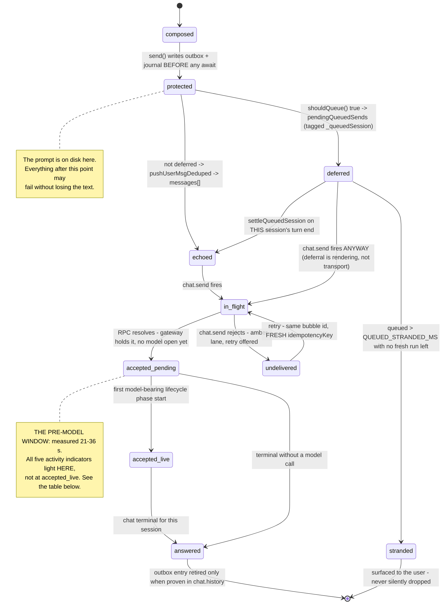

**Invariants:**

- **PROTECTED precedes every yield.** The outbox write, the journal write and the one `clientMsgId` all happen before the first `await` in `send()`. Everything downstream is recoverable because of this, and it is why the 2026-08-26 crash cost seconds rather than the prompt itself.
- **ECHO IS SYNCHRONOUS AND UNCONDITIONAL.** A prompt reaches `echoed` or `deferred` on the same task that cleared the composer — never after a network round-trip. The composer's keydown handler does not `await send()`, so a throw inside `send()` blanks the box regardless: **any exception on this path costs the user their text on screen.** The deferral decision is therefore wrapped and fails safe to _not deferred_ — cosmetic misordering beats a prompt that vanishes.
- **DEFERRED never gates transport.** `chat.send` sits outside every deferral branch. Moving it inside would convert a rendering choice into a delivery choice, which is the bug class this whole entry documents.
- **One prompt, one bubble.** The outbox backstop re-injects from disk only for ids absent from BOTH `messages[]` and `pendingQueuedSends`; de-duplicating against `messages[]` alone paints a second, amber copy of every deferred prompt within 5 s.
- **Deferral is per SESSION, not per tab.** Every deferred entry carries `_queuedSession`; the render filters by it and the drain keys on the session whose turn ended, not on the tab being viewed (2026-06-08).
- **ACK IS NOT DURABILITY.** The outbox entry is retired only when `chat.history` proves the turn, never in the `chat.send` `.then()` (2026-08-24).

### The five activity indicators

The architect's rule (2026-08-28): **all five light from the moment the prompt is sent until the answer arrives** — i.e. across `accepted_pending` AND `accepted_live`, not from the first model token. They are deliberately synchronized for user simplicity, even though the models panel is strictly speaking naming a model that has not started computing yet.

| #   | surface                   | trigger membership                                                                                                                                       |
| --- | ------------------------- | -------------------------------------------------------------------------------------------------------------------------------------------------------- |
| 1   | chat thinking pill        | `repaintActivitySurfaces()`                                                                                                                              |
| 2   | tab glow                  | `repaintActivitySurfaces()`                                                                                                                              |
| 3   | sessions-panel row        | `repaintActivitySurfaces()`                                                                                                                              |
| 4   | models panel              | `repaintActivitySurfaces()`                                                                                                                              |
| 5   | recipes / prefrontal tree | **sibling call in `activityTick`, NOT in the trigger** — and the only one that never consults `resolveSessionRunState`, so it carries no freshness bound |

**The consequence the architect accepted, and the condition attached to it:** because all five light during the pre-model window, **AUTO model selection must stay fast.** The synchronization is only honest while "which model?" is a cheap decision. **If model selection becomes materially more expensive — a routing call, a scoring pass, a negotiation — the (models, recipes) pair must be dissociated from the (chat, tab, sessions) trio,** so the first three keep meaning _your turn is being worked on_ while the last two go back to meaning _this specific model is computing_. That dissociation is NOT implemented today; this note is the trigger condition for building it.

see also: done-signals.md (owns which signal wins when they disagree, and the R2a rule that a predicate clears nothing), architecture.md (the ONE PREDICATE · ONE TRIGGER · ONE CLOCK · ONE STATE SET row for UI session-activity indication), turn-latency.md (owns the measured cost of the pre-model stages), tinker-ui.md (owns the visual language of the three bubble lanes), bug-log.md (the 2026-08-26 incident this entry was written from).

---

## L6. Restart-deferral drain (task freshness gate)

**Status:** DEPLOYED (FORK 2026-07-21, `aec445bfbb` + `dbfc255cbe`). last_verified 2026-07-21.

**Entity:** one reconciled queued/running `TaskRecord`, as seen by the gateway restart/reload drain (`waitForActiveWorkBeforeChannelReload` and the restart gate in `src/gateway/server-reload-handlers.ts`).

**Code:** `getRestartBlockingTaskSummary` in `src/tasks/task-registry.maintenance.ts`; consumed by `getActiveCounts` in `src/gateway/server-reload-handlers.ts`.

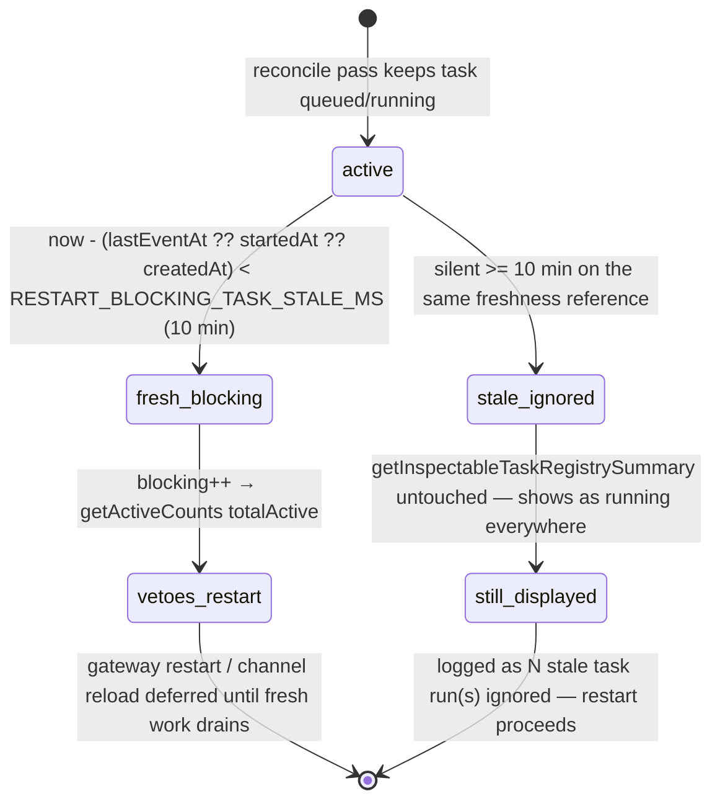

**Invariants:**

- Freshness reference = `lastEventAt ?? startedAt ?? createdAt` — the SAME chain as `hasLostGraceExpired`, so the restart gate and lost-marking never disagree about what "silent" means. Silent ≥ 10 min (`RESTART_BLOCKING_TASK_STALE_MS`) → `staleIgnored`; otherwise → `blocking`.
- **Fresh/stale is a restart-gate VIEW, not a status transition.** A stale task still displays as running everywhere (`getInspectableTaskRegistrySummary` untouched); it only stops vetoing a gateway restart or channel reload.
- `getActiveCounts` folds ONLY `blocking` into `totalActive`; `staleIgnored` surfaces in deferral messages as `<n> stale task run(s) ignored`, so the drain's decision stays auditable in the logs.
- The same reconcile pass runs first (durable cron recovery + lost-marking still apply); the fresh/stale partition only touches tasks that SURVIVE reconciliation.
- **Why (2026-07-21):** a running task whose session-store entry still exists is never marked lost (`hasBackingSession`), so a dead worker could block restarts indefinitely — observed live: 10 zombies deferring a gateway restart 4+ hours.

see also: config-shape.md (owns config-key semantics — the 10-min threshold is the code constant `RESTART_BLOCKING_TASK_STALE_MS` today, `staleAfterMs` is an opts override, no config key yet), failures.md (deferral that never completes), flows.md (restart drain sequence).

**Probe:** none dedicated yet — `getRestartBlockingTaskSummary()` is callable in-process; the deferral log line (`<n> stale task run(s) ignored`) is the observable surface.

---

---

## L-PLAN — Plan lifecycle (plan-store managed)

**Entity:** one plan document at `~/.openclaw/workspace/state/prefrontal/plans/<sessionKey-slug>.md`.

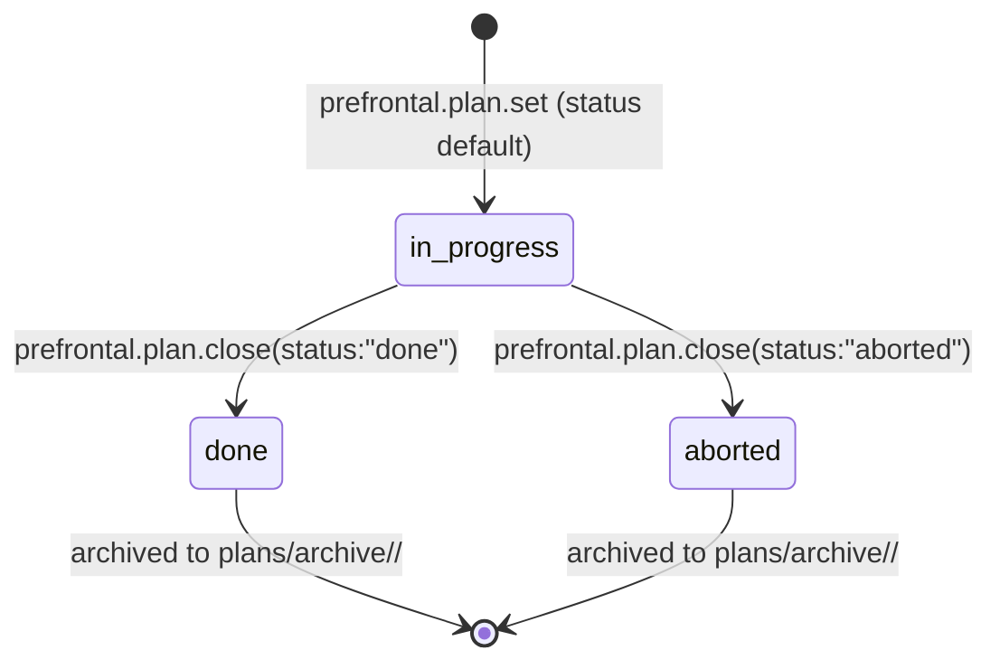

**Invariants:**

- `prefrontal.plan.set` always creates with `status: in_progress` unless an explicit `status` is passed.
- `prefrontal.plan.close` transitions to `done` or `aborted` and moves the file to the archive directory.
- The archive path is `~/.openclaw/workspace/state/prefrontal/plans/archive/<YYYY-MM-DD>/<sessionKey-slug>.md`.
- `prefrontal.plan.get` returns `null` for plans that have been closed/archived.
- A sessionKey can have at most one active (in_progress) plan at a time — calling `plan.set` again replaces the existing plan.

**Probe:** `prefrontal.plan.get({ sessionKey })` — returns `{ plan }` with current frontmatter.

---

## L-STEP — Step lifecycle within a plan

**Entity:** one step entry within a plan document (indexed 0-based by `currentStep`).

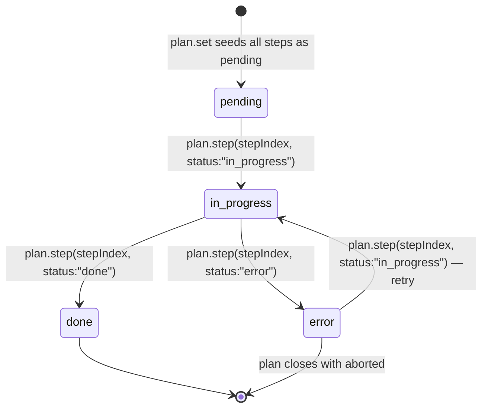

**Invariants:**

- **At most one step may be `in_progress` at a time per plan.** Calling `plan.step` with `status: "in_progress"` for step N automatically demotes any previously `in_progress` step back to `pending`. Enforced by plan-store, not caller.
- Setting a step to `done` does not automatically advance `currentStep` — the caller must explicitly promote the next step.
- An `error` step can be retried by calling `plan.step` again with `status: "in_progress"`.
- Steps cannot be removed or reordered after the plan is created — only status mutations are allowed.

---

## L-KIT-INSTALL — Kit install lifecycle

**Entity:** one `prefrontal.kit.install` invocation.

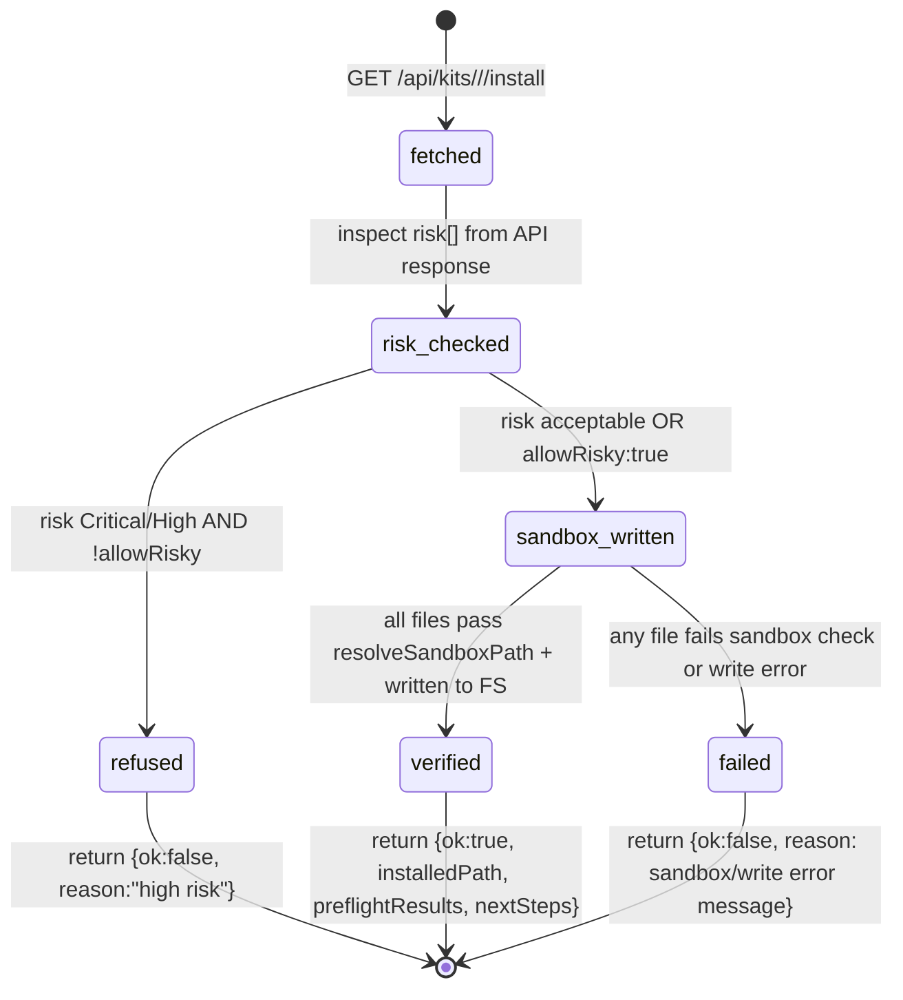

**Invariants:**

- `fetched → risk_checked` is always synchronous — risk check happens before any file write.
- `sandbox_written` is atomic per-file: if any file fails, the whole install returns `{ok:false}`. Files already written in a partial install are NOT rolled back (future work: transactional write).
- Preflight execution is stubbed in the current implementation. `preflightResults` is returned verbatim from the API response; no actual script execution happens.
- The `verified` state does NOT mean the installed kit has been run or tested — only that all files were written without sandbox violations.

---

## L-STRATEGY — Strategy-switch state machine (U4)

**Status:** DEPLOYED (develop `06f8647fdc`, gateway restarted clean; `fork.strategy.switch.list` VERIFIED-LIVE → `{ok:true,decisions:[]}`). last_verified 2026-06-02.

**Entity:** one per-strategy `StrategyState` (keyed by `strategyId`) inside the durable `FailureStateMap` at `~/.openclaw/engram/failure-state.json`. A "strategy" is the named approach a cron/task currently uses (canonical: `fork-sync:always-merge`, the B010 cascade).

**Code:** transition fns in `src/memory/engram/failure-tracking.ts` (PURE: `recordFailure`/`recordSuccess`/`applySwitch`); decision logic in `src/memory/engram/strategy-switch.ts` (`decideSwitch`); atomic temp+rename persistence in `src/memory/engram/failure-tracking-store.ts` (`updateFailureStateMap` read-modify-write); review/apply RPCs in `src/gateway/server-methods/engram-strategy.ts`. Driven offline by the engram-consolidate cron. See also flows.md (the consolidate→decide→manifest sequence).

```mermaid
stateDiagram-v2
  [*] --> tracking: createInitialStrategyState (consecutiveErrors=0)
  tracking --> tracking: recordFailure → consecutiveErrors++
  tracking --> tracking: recordSuccess → consecutiveErrors=0 (reset, stamps recoveredAfter)
  tracking --> below_threshold: decideSwitch & consecutiveErrors < threshold (default 3)
  below_threshold --> tracking: more turns
  tracking --> stale_suppressed: consecutiveErrors >= threshold BUT lastFailureTime older than windowMs (default 24h)
  stale_suppressed --> tracking: recency guard suppresses; keep accumulating
  tracking --> switch_proposed: consecutiveErrors >= threshold AND within window (shouldSwitch=true)
  switch_proposed --> needs_human_review: toStrategy==null (no fallback) OR confidence < minConfidence (default 0.8)
  switch_proposed --> applyable: registered fallback AND confidence >= minConfidence
  applyable --> switched: fork.strategy.switch.apply → applySwitch (currentStrategy=to, counter reset, switchHistory += record)
  needs_human_review --> switched: human (or autonomy loop) calls fork.strategy.switch.apply with explicit toStrategy
  needs_human_review --> tracking: human declines; no switch
  switched --> tracking: post-switch failures counted via failuresSinceSwitch
  switched --> recovered: recordSuccess after switch → recoveredAfter stamped on the switch record
  recovered --> tracking: counter clean, new pattern can start
```

**Invariants:**

- `switch_proposed` requires BOTH conditions: `consecutiveErrors >= threshold` AND the most recent failure is within `windowMs` (`DEFAULT_STRATEGY_SWITCH_CONFIG`: threshold 3, windowMs 24h, minConfidence 0.8). A stale-but-numerous failure run is `stale_suppressed`, NOT a switch — the recency guard exists so an old burst doesn't trip a switch weeks later.
- `decideSwitch` is pure/read-only: `fork.strategy.switch.list` and `.review` recompute it on every call from the on-disk map; they never mutate state. Only `fork.strategy.switch.apply` writes (via `applySwitch` inside the atomic `updateFailureStateMap`).
- `needsHumanReview` is set when `toStrategy === null` (no entry in `DEFAULT_FALLBACKS`, which ships `fork-sync:always-merge → fork-sync:ask-before-merge` + `always-merge → ask-before-merge`) OR `confidence < minConfidence`. `apply` will still proceed if given an explicit `toStrategy` — the review flag is advisory, not a hard gate.
- Confidence is lowered by 0.25 when the last switch on this strategy did not recover (`recoveredAfter` undefined or > 0) — an anti-thrash penalty so the machine doesn't ping-pong between two strategies.
- `recordFailure`/`recordSuccess` are idempotent within a consolidation window via `countedEventIds` (bounded to 200), guarding against episode-split double counting.
- Every write goes through `updateFailureStateMap` (re-read fresh inside the atomic helper, temp+rename) so a concurrent writer's strategies are never clobbered (feedback_atomic_store_writes).

**Probe:** `fork.strategy.switch.review({strategyId?})` — full per-strategy `StrategyState` plus its current `decision`; the human audit surface. `fork.strategy.switch.list` returns only the `shouldSwitch===true` decisions (the open-proposal queue).

---

## L-RECIPE-VARIANT — Recipe variant evolution (U1)

**Status:** DEPLOYED (develop `06f8647fdc`). Gated by `RECIPE_AUTOAPPLY_ENABLED` (already `true`). last_verified 2026-06-02.

**Entity:** one recipe variant (`recipeId` @ a `version`) tracked by fitness in the never-delete archive at `<engram-baseDir>/recipe-archive/<recipeId-slug>/v<n>.json` (+ `index.json`). A `MutationProposal` is the transient object the evolution operator emits per consolidation.

**Code:** `src/memory/engram/recipe-fitness.ts` (Laplace-smoothed `successRate`, `loadRecipeFitness`/`makeFitnessLookup`); `src/memory/engram/recipe-evolution.ts` (`proposeMutations` + `isAutoPromotable`); `src/memory/engram/recipe-archive.ts` (`putVariant`/`deprecate`/`rank` — never deletes). PRODUCER of attribution: `recipe-runner.ts` stamps `recipe:<owner/slug>` tags via `onTag` (threaded by `prefrontal.recipe.run`); selection feeds `makeFitnessLookup` into `matchRecipesDetailed`. The actual recipe WRITE (turning an `autoPromotable` proposal into a kit-file edit) lives in the Prefrontal kit layer, OUT of scope of this operator — the Cerebellum only proposes + flags. See also subagents-and-recipes.md (selection/scoring precedence) and flows.md (consolidate→propose sequence).

```mermaid
stateDiagram-v2
  [*] --> running: recipe-runner runs a recipe (onTag stamps recipe:<owner/slug> attribution)
  running --> fitness_updated: outcome folded into recipe-fitness (Laplace-smoothed successRate)
  fitness_updated --> no_proposal: runs < minRuns (default 3) — low-n, stay quiet
  no_proposal --> running: more runs accumulate
  fitness_updated --> no_proposal: successRate >= floor (default 0.5) AND no latency regression
  fitness_updated --> proposed: successRate < floor AND runs >= minRuns (proposeMutations → add_step + tighten_criteria)
  fitness_updated --> proposed_efficiency: avgLatencyMs regressed > ratio (default 0.25) vs window mean (remove_step/reorder)
  proposed --> auto_promotable: isAutoPromotable (successRate <= floor*autoFloorRatio[0.5] AND runs >= autoMinRuns[8])
  proposed --> parked_for_review: needsHumanReview=true (under floor but not FAR under, or runs < autoMinRuns)
  proposed_efficiency --> parked_for_review: latency proposals are NEVER auto-promotable (always human-gated)
  auto_promotable --> applied_archived: Prefrontal kit layer writes new variant → putVariant(v+1); prior version stays readable
  parked_for_review --> applied_archived: human approves → new variant written + archived
  parked_for_review --> dropped: human declines (no mutation; archive unchanged)
  applied_archived --> deprecated: a superseding variant marks the prior deprecate() — body NEVER deleted (rollback path)
  applied_archived --> running: new variant enters rank() selection (epsilon-greedy, difficulty-aware)
  deprecated --> running: rollback re-promotes an archived variant (read() works on deprecated bodies)
```

**Invariants:**

- The evolution operator NEVER writes a recipe and NEVER applies a mutation — it only emits `MutationProposal`s and flags `autoPromotable`/`needsHumanReview`. The `applied_archived` edge is the Prefrontal kit layer's responsibility (cross-subsystem), not this module's.
- `autoPromotable` requires ALL THREE: HIGH-CONFIDENCE (`successRate <= successFloor * autoFloorRatio`, i.e. FAR below the floor, not merely under it), WELL-EVIDENCED (`runs >= autoMinRuns`, default 8, strictly greater than the `minRuns`=3 proposal threshold), and REVERSIBLE (always true — the never-delete archive). When `autoPromotable` is true, `needsHumanReview` drops to false.
- Only corrective (low-success-rate) proposals are ever `auto_promotable`. Efficiency/latency proposals (`remove_step`/`reorder`) are always `needsHumanReview:true` — they are not the high-confidence correctness win the autonomy gate targets.
- **Never-delete is the rollback safety net.** `deprecate()` only flips a flag; `read()` still returns a deprecated variant's body. There is NO delete path. This is what makes auto-promotion bounded/safe (self-reinforcing-error-spiral mitigation).
- `rank()` returns LIVE (non-deprecated) variants best-`successRate`-first with an epsilon-greedy explorer slot (default ε 0.1; deterministic when a seeded RNG is injected) and an optional `taskDifficulty` bias (Gödel: difficulty-aware selection).

**Probe:** none yet (proposed `fork.recipe.fitness({recipeId})` would return current fitness + archived versions + open proposals). Today inspect `recipe-archive/index.json` + the per-version sidecars directly. See probes.md.

---

## L-CURIOSITY-GAP — Curiosity gap lifecycle (U2)

**Status:** DEPLOYED (develop `06f8647fdc`). 2a hedge-detector + 2d idle-goal trigger live; RPCs present. 2c LoRA training is an EXTERNAL STUB ONLY (no GPU/Python training; out of scope — see config-shape.md dead-code registry). last_verified 2026-06-02.

**Entity:** one `Gap` record in the append-only JSONL buffer at `~/.openclaw/workspace/memory/curiosity-gaps/YYYY-MM-DD.jsonl` (auto-indexed by memorySearch). Resolution is itself an appended row, folded back by `dedupeKey` — history is never rewritten.

**Code:** `src/fork/curiosity-store.ts` (`makeGap`/`appendGap`/`readGaps`/`topGaps`/`markResolved`/`rescore`/`dedupeGaps`); RPCs in `src/fork/curiosity-rpc.ts` (`fork.curiosity.logGap`/`topGaps`/`resolveGap`). PRODUCERS: 2a hedging-detector wired in `attempt-hooks.ts` `onTurnComplete` (`detectUncertaintySpans` → `extractTopic` → `makeGap` source `lcm-entropy` → `appendGap`, fire-and-forget); 2d idle trigger in `src/fork/idle-goals.ts` (`proposeIdleGoals`, debounced per-session timer re-armed by `noteTurnActivity` in `onTurnComplete`). See also flows.md (NO-MATCH → gap → active-learning sequence).

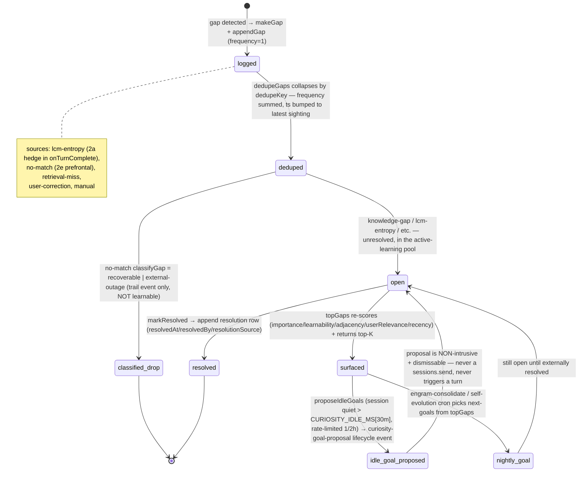

**Invariants:**

- **No self-output-as-truth (§9.3):** `source:"lcm-entropy"` gaps are _questions_, never facts; they may only ever be resolved from an EXTERNAL channel (the store records `resolutionSource`; "external only" enforcement lives in the active-learning cron body).
- `classifyGap` gates which NO-MATCH failures even become a learnable gap: `recoverable` (permission/auth — user can grant) and `external-outage` (network/timeout/5xx) emit a trail event but NO `Gap`; only `knowledge-gap` feeds the buffer (recon risk #2 — don't waste active-learning on a transient outage).
- The `idle_goal_proposed` edge is deliberately a dead-end back to `open`: a proposal is a NON-intrusive `curiosity-goal-proposal` lifecycle event (a dismissable chip), NOT a `sessions.send` — it must never trigger a Jarvis turn or interrupt the user. Rate-limited (≥2h/session) and skipped for automated/subagent/cron sessions.
- Resolution is append-only: `markResolved` writes a _resolution row_ (copy of the gap with resolution fields stamped) to today's file; `dedupeGaps` folds it onto the original by `dedupeKey`. History is never rewritten (atomic-append discipline; the daily file is `O_APPEND` single-write safe).
- JSONL append never blind-overwrites; a torn tail line degrades to "skip that line", never an exception that crashes the cron.

**Probe:** `fork.curiosity.topGaps({k})` — the current open active-learning queue (deduped, re-scored, top-K). `fork.curiosity.resolveGap({id,by,source})` transitions a gap to `resolved`. No state-snapshot probe for a single gap id yet.

---

## Validation strategy

Each state machine should be paired with a probe that returns the entity's current state. Today only L1 has a partial probe (`sessions.json` direct read); L2–L5 need probes (see `probes.md`).

When a state transition is added in code, the diagram must be updated in the same PR. The merge gate (J15 §5) eventually enforces this by failing when a code path leaves a state with no diagram arrow.
