# Lifecycles — state machines

Each diagram below is the canonical state machine for one entity. If a transition that fires in code does not appear in the diagram, the diagram is incomplete (or the transition is the bug).

---

## L1. Agent session (`agent:main:*`)

**Entity:** entry in `~/.openclaw/agents/<agentId>/sessions/sessions.json`.

```mermaid
stateDiagram-v2
  [*] --> idle: session created
  idle --> running: chat.send / agent dispatch
  running --> done: turn complete, no error
  running --> failed: surface_error (model auth, billing, fatal classification)
  running --> aborted: explicit /stop or chatAbortController.abort
  running --> timeout: run timeoutMs exceeded
  running --> interrupted: gateway boot detects status:running (markRunningMainSessionsAsInterrupted)
  interrupted --> running: recoverRestartAbortedMainSessions → resume dispatch
  interrupted --> failed: tail-check informational; still attempts resume (FORK 2026-05-10)
  done --> idle: next user message
  failed --> idle: next user message
  aborted --> idle: next user message
  timeout --> idle: next user message
```

**Invariants:**

- `running + abortedLastRun=true` at boot ALWAYS becomes `interrupted` then `running` again via recovery (FORK 2026-05-10, see bible §11.6c).
- `running` should never persist past the agent's `timeoutSeconds` without a state transition. Today this is _not_ enforced synchronously — the recovery code catches it on next boot. **Open follow-up** to mark `failed` on surface_error inside the lane, not just on next reboot.

**Probe:** `debug.session.state({sessionKey})` (proposed) — returns current status, abortedLastRun, lane state, queued replies.

---

## L2. tinker-bridge claude-cli worker

**Entity:** `ClaudeCodeWorker` instance held by `SessionWorkerPool`, one per tinker-bridge sessionKey.

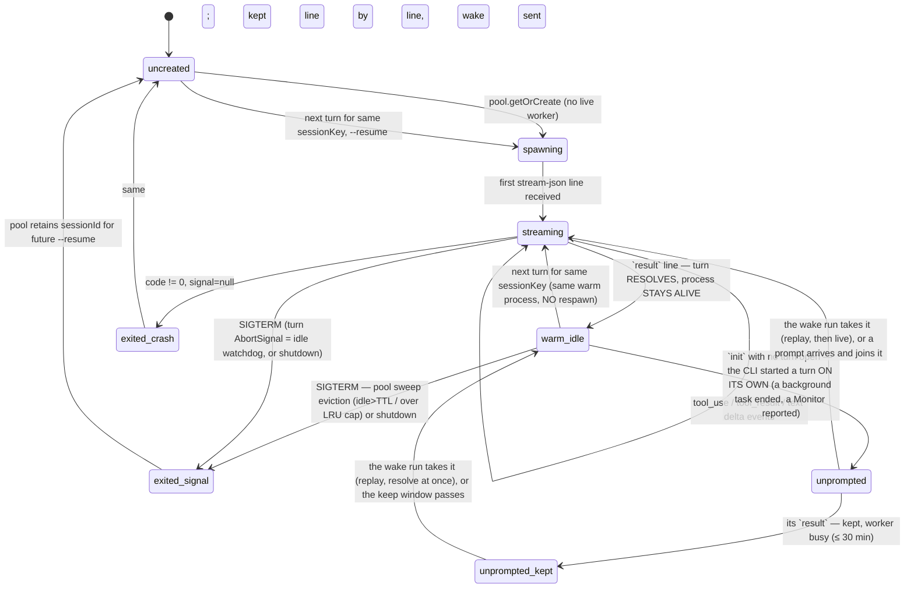
```mermaid
stateDiagram-v2
  [*] --> uncreated
  uncreated --> spawning: pool.getOrCreate (no live worker)
  spawning --> streaming: first stream-json line received
  streaming --> streaming: tool_use / tool_result / text delta events
  streaming --> warm_idle: `result` line — turn RESOLVES, process STAYS ALIVE
  warm_idle --> streaming: next turn for same sessionKey (same warm process, NO respawn)
  warm_idle --> exited_signal: SIGTERM — pool sweep eviction (idle>TTL / over LRU cap) or shutdown
  streaming --> exited_signal: SIGTERM (turn AbortSignal = idle watchdog, or shutdown)
  streaming --> exited_crash: code != 0, signal=null
  exited_signal --> uncreated: pool retains sessionId for future --resume
  exited_crash --> uncreated: same
  uncreated --> spawning: next turn for same sessionKey, --resume <stored sessionId>
  warm_idle --> unprompted: `init` with no turn open — the CLI started a turn ON ITS OWN (a background task ended, a Monitor reported); kept line by line, wake sent
  unprompted --> unprompted_kept: its `result` — kept, worker busy (≤ 30 min)
  unprompted --> streaming: the wake run takes it (replay, then live), or a prompt arrives and joins it
  unprompted_kept --> warm_idle: the wake run takes it (replay, resolve at once), or the keep window passes
```

> NOTE (corrected 2026-05-16): the claude subprocess is **persistent**
> (`claude --input-format stream-json`). A completed turn does NOT exit the
> process — it stays warm for the next turn on the same sessionKey. The
> earlier diagram's `exited_ok: claude-cli exits code=0 (turn complete)`
> edge was wrong and is why the unbounded-sessionKey leak went unmodelled.

**Resume lookup priority** (worker-pool.ts, FORK 2026-05-10):

1. `getLatestResumeSessionIdByOpenclawSessionId(openclawSessionId)` — canonical, survives sessionKey hash drift
2. `getResumeSessionId(sessionKey)` — fallback for legacy entries

**Invariants:**

- The claude process is **persistent**: a completed turn keeps it warm; only SIGTERM (abort / pool eviction / shutdown) or a crash ends it.
- A worker that has SIGTERMed retains its `sessionId` in session-map.json so the NEXT turn resumes the same claude-cli conversation.
- Worker pool is gateway-wide singleton; `killAll()` runs on `exit`/`SIGTERM`/`SIGINT`. Since 2026-09-30 it kills only PIPE workers at SIGTERM/SIGINT; file-transport workers stay attached for the restart drain and are let go (never killed) at `exit` (L4b).
- **Two transports (2026-09-30, `worker-transport.ts`).** `pipe` (default): `systemd-run --pipe`, whose stdio proxy lives in the gateway's cgroup, so a gateway stop cuts the CLI mid-turn. `file` (plugin config `transport`, env `TINKERCLAW_BRIDGE_TRANSPORT` wins): the unit owns its stdio — a FIFO it holds open read-write, `out`/`err` files it appends to, `exit` written by its shell, and `meta.json` (session, CLI session, the current turn's start offset) — under `$XDG_RUNTIME_DIR/tinkerclaw-workers/<unit>/`. Extra states on this transport: `frozen` (cgroup freezer, at an API-call boundary), `detached` (the gateway went; the unit stays) and `adopted` (a new gateway took it in at `gateway_start`; a turn it left in flight is `pendingTurn` until a run takes it, and counts as busy).
- A turn's `signal: AbortSignal` parameter, when aborted, calls `worker.kill("SIGTERM")` — this is how the LLM idle watchdog terminates a stuck worker.
- **The pool is BOUNDED (FORK 2026-05-16, `worker-pool.ts`).** `SessionWorkerPool` sweeps on every `getOrCreate`: a non-busy worker idle past `idleTtlMs` (default 15 min) is SIGTERMed, and the pool is hard-capped at `maxWorkers` (default 32, LRU eviction of the least-recently-used non-busy worker). A worker mid-turn (`isBusy()`) and the sessionKey being requested are never evicted; evicted workers keep their `sessionId` in session-map.json so a later turn `--resume`s the same thread. Without this, a caller minting a unique sessionKey per work item (people-profiles cron — one key per profile) leaks one persistent ep_poll-blocked `claude` proc per item indefinitely (observed: 53 procs, oldest 7+ days, 2026-05-16). Enforced by the L2 `verify:` invariant above.

- **A turn the CLI starts on its own reaches the chat (2026-10-01, `worker.ts` + `unprompted-turn.ts`; bug-log `[monitor-notify-idle-session-lost]`).** claude CLI 2.1.286 starts a turn by itself when a background task ends or a Monitor reports while no turn is open: a fresh `init`, the answer, its own `result` (measured 2026-10-01 for a background Bash and for a Monitor event; the Monitor case prints no `task_notification` first). The worker opens an `unprompted` turn on an `init` that comes with no turn of ours open and nothing queued, keeps its lines, and asks the owning chat for a run with `chat.send` (the user lane every working wake uses), pinned to the worker's own model so Auto routing cannot send the wake outside the bridge. The message carries `[bg-turn <id>]`. The run that sees it (`stream.ts`) takes the kept turn (`takeUnpromptedTurn`): it replays the lines from `init` and follows the turn to its `result`, and writes nothing to the CLI. A prompt that arrives while the CLI's own turn is still running joins it (`send()` replays its lines first, then writes the prompt, as a mid-turn prompt). A wake that reaches a live turn is refused by `steer()` while its turn is still kept (it then runs as its own turn), and swallowed once a prompt has joined it. A wake run that finds nothing to take answers one fixed line and sends the CLI nothing. Activity with no `init` before it is logged once (`[unprompted-turn] … not kept`), never guessed at.
- **Busy (`isBusy()`) means the CLI still owns work (2026-10-01).** A turn in flight or queued, an adopted frozen turn (L4b), **live background tasks** (the CLI's `background_tasks_changed` list: a Workflow, a Monitor, Bash in the background) or a kept unprompted turn (until a run takes it, or for 30 min once it ended). The pool never evicts, respawns or LRU-drops a busy worker, so a worker that ends its turn while its Workflow runs is no longer reaped with it. Idle time counts from the later of the last turn handed over and the last stdout line (`lastActivityAt`, 2026-10-01). A Monitor that never ends keeps its worker for as long as it runs; that is the price of not killing it.

**Probe:** `tinker-bridge.workerInfo({sessionKey})` (proposed) — alive?, current cli sessionId, last turn duration.

---

## L3. Inbound message (any channel)

**Entity:** one message arriving from a channel adapter.

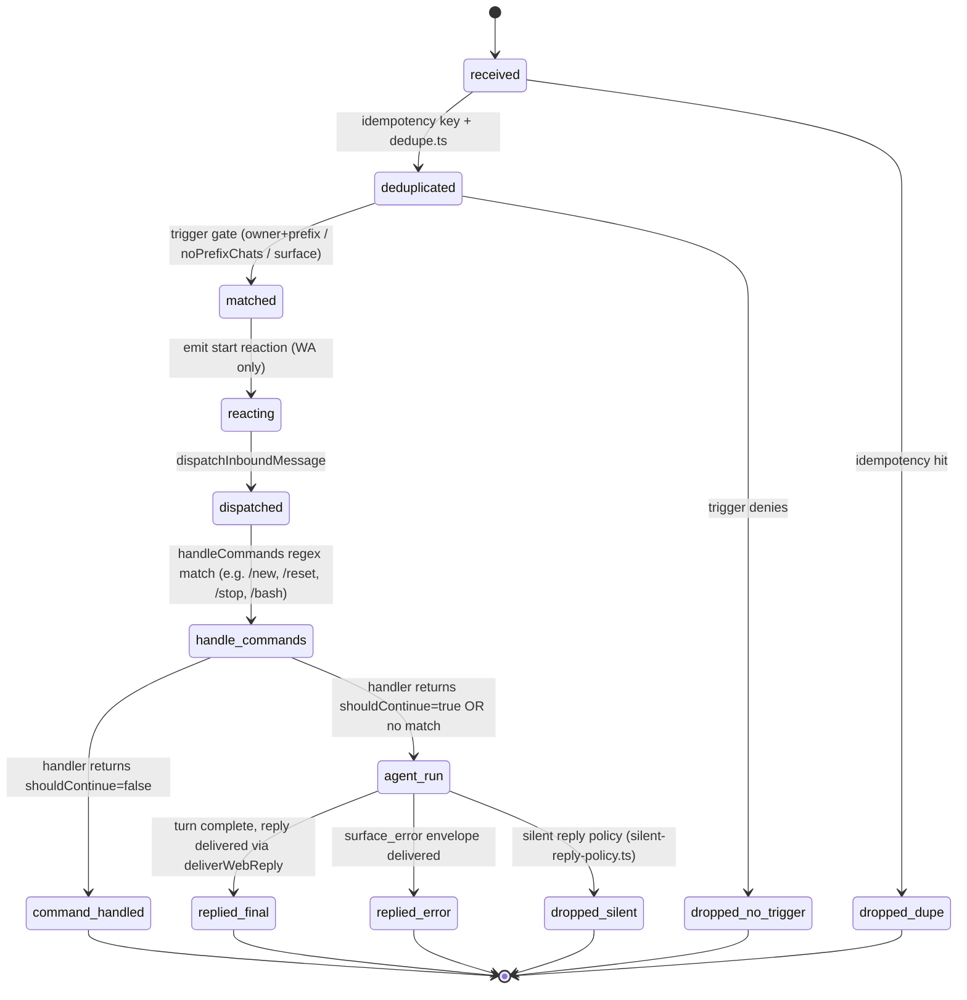
```mermaid
stateDiagram-v2
  [*] --> received
  received --> deduplicated: idempotency key + dedupe.ts
  received --> dropped_dupe: idempotency hit
  deduplicated --> matched: trigger gate (owner+prefix / noPrefixChats / surface)
  deduplicated --> dropped_no_trigger: trigger denies
  matched --> reacting: emit start reaction (WA only)
  reacting --> dispatched: dispatchInboundMessage
  dispatched --> handle_commands: handleCommands regex match (e.g. /new, /reset, /stop, /bash)
  handle_commands --> command_handled: handler returns shouldContinue=false
  handle_commands --> agent_run: handler returns shouldContinue=true OR no match
  agent_run --> replied_final: turn complete, reply delivered via deliverWebReply
  agent_run --> replied_error: surface_error envelope delivered
  agent_run --> dropped_silent: silent reply policy (silent-reply-policy.ts)
  command_handled --> [*]
  replied_final --> [*]
  replied_error --> [*]
  dropped_dupe --> [*]
  dropped_no_trigger --> [*]
  dropped_silent --> [*]
```

**Invariants:**

- For WhatsApp: every state transition is reflected in chat reactions (🤔 thinking, 🤖 active, ✅ done, ⚠️ error).
- `dropped_dupe` and `dropped_no_trigger` are the only states with NO outbound; everything else emits something the user can see.
- `handle_commands` runs BEFORE `agent_run` and can short-circuit (e.g., `/stop`, `/bash`, `/restart`).

---

## L4. Restart-recovery flow (boot)

**Entity:** the gateway boot sequence for main-session recovery.

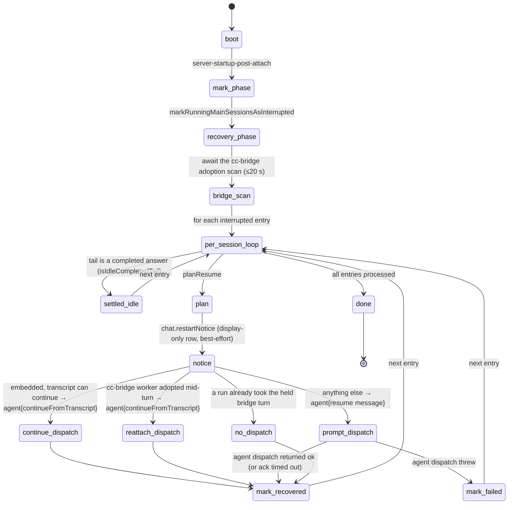
```mermaid
stateDiagram-v2
  [*] --> boot
  boot --> mark_phase: server-startup-post-attach
  mark_phase --> recovery_phase: markRunningMainSessionsAsInterrupted
  recovery_phase --> bridge_scan: await the cc-bridge adoption scan (≤20 s)
  bridge_scan --> per_session_loop: for each interrupted entry
  per_session_loop --> settled_idle: tail is a completed answer (isIdleCompletedTail)
  per_session_loop --> plan: planResume
  plan --> notice: chat.restartNotice (display-only row, best-effort)
  notice --> continue_dispatch: embedded, transcript can continue → agent{continueFromTranscript}
  notice --> reattach_dispatch: cc-bridge worker adopted mid-turn → agent{continueFromTranscript}
  notice --> prompt_dispatch: anything else → agent{resume message}
  notice --> no_dispatch: a run already took the held bridge turn
  continue_dispatch --> mark_recovered
  reattach_dispatch --> mark_recovered
  prompt_dispatch --> mark_recovered: agent dispatch returned ok (or ack timed out)
  prompt_dispatch --> mark_failed: agent dispatch threw
  no_dispatch --> mark_recovered
  settled_idle --> per_session_loop: next entry
  mark_recovered --> per_session_loop: next entry
  mark_failed --> per_session_loop: next entry
  per_session_loop --> done: all entries processed
  done --> [*]
```

**Invariants:**

- The restart notice fires before the dispatch, so the user sees the restart first. Since 2026-09-29 it is a transcript `custom` entry (`openclaw.restart-notice`, `gateway/restart-notice.ts`) served by `chat.history` as a `role:"system"` row and pushed live on the `chat.notice` event; the model never sees it. The old `chat.inject` `__ERR_ENV__` envelope was an assistant MESSAGE: it became the transcript tail, which `Agent.continue()` refuses.
- The notice says how the chat came back: `continued` (embedded, `Agent.continue()` from the transcript), `reattached` (the live cc-bridge worker's turn), or `prompted` (the resume message).
- Resume is attempted regardless of tail-check result (FORK 2026-05-10).
- Only `agent:main:*` sessions are eligible. Subagent, cron, ACP sessions and internal `temp:*` one-shots (tab namer, title suggester, Jev's explainer; since 2026-10-07, bug id `recovery-resumes-temp-session`) are skipped (`shouldSkipMainRecovery`).
- Recovery is bounded: `DEFAULT_RECOVERY_DELAY_MS=5000`, `MAX_RECOVERY_RETRIES=3`, exponential backoff.

### L4b. Planned restart — drain, stop, start, continue (2026-09-29, 2026-09-30)

- **WANT (the architect, 2026-09-29):** an agent may restart the gateway after an upgrade without asking, as long as the restart skill works: every turn it interrupts continues, once, and nothing keeps running unseen. Then: "go primal" — resume a chat low-level, WITHOUT an extra prompt; show a "restart" message in each active session; waste no tokens, so the pause waits for the current LLM CALLS (not whole turns) to finish.
- **Fixed gaps:**
  - A graceful stop used to settle a chat that was mid-tool as `status:"done"` (observed 2026-09-29 21:58), so L4 resumed only after a crash. Since `c87064c9e42` the close handler marks the shutdown first (`gateway-shutdown-state.ts`); a run it ends is stored `running` + `abortedLastRun`, and a failure row at the tail no longer reads as a completed turn.
  - Every resume was a PROMPT, and it failed when the model misread its own transcript ("nothing to resume", 2026-09-29). The cut itself killed a paid LLM call mid-stream.
- **The drain (`infra/restart-drain.ts`).** Participants register under a global key (`Symbol.for("openclaw.restartDrain")`); `drainForRestart(budget)` runs them in parallel. The close handler drains first (budget `OPENCLAW_RESTART_DRAIN_MS`, default 75 s, inside systemd's 120 s); the RPC `gateway.drain {budgetMs ≤30 min, reason}` drains with no systemd timeout, and `gateway.drainRelease` calls the restart off.
  - **Embedded runs** (`boundary-pause.ts`): the outermost `streamFn` wrapper holds the NEXT model call. The call streaming finishes and its tools run, so the transcript ends in tool results or the prompt. A run that starts during a drain is held before its first call. An in-process restart aborts held runs (the process stays).
  - **cc-bridge runs are NOT held by the embedded gate.** A bridge run is one pi call for a whole Claude Code turn; holding it kept its prompt from the CLI session, and the resume prompt then referred to a turn the CLI never saw. On the FILE transport (L2) the bridge's own participant waits for the top-level API call's `message_delta` stop reason, then freezes the unit (`systemctl --user freeze`); past the budget it freezes anyway (a frozen call may repeat after the thaw; a killed turn is lost whole). On the pipe transport the stop cuts the turn, as before.
- **The resume (boot, L4 `planResume`).**
  - Embedded: `agent{continueFromTranscript:true}` → the runner plans the context (`continuation.ts`: trim an aborted empty stub; close a tool call the stop cut with an error `toolResult` that says so) and calls `Agent.continue()`. No prompt. The resume message rides along only as the fallback when the plan fails.
  - **A failover retry is the same move (2026-10-05).** A run makes a second attempt when its provider fails over or run.ts retries a thinking level. That attempt used to call `prompt()` again, which wrote the prompt a second time, unkeyed, after the failed attempt's rows (bug-log `failover-reprompt`). Now an attempt that finds the row its run's marker claims on the branch (`findPromptRowClaimedOnBranch`: a marker for one of the run's keys, then the first user row, no compaction after it) plans the context and continues. A fallback into claude-code keeps the prompt, because its CLI session never received it. The plan reads its tail past trailing `custom` messages, since pi writes the turn's runtime context right after the prompt, and `prePromptMessageCount` restarts where the continued context ends, so a one-message answer counts as the attempt's own.
  - cc-bridge on the file transport: the bridge adopts every unit still alive (`restart-reattach.ts`) and lists a turn left in flight in `Symbol.for("openclaw.bridgeReattach")`. The scan runs ONCE, on first need: recovery calls it through that registry, the first bridge turn awaits it, `gateway_start` is only the backstop (live test 2026-09-30: `gateway_start` comes after the channel sidecars, over two minutes after boot, and recovery had already resumed by prompt into a second claude on the same CLI session). Recovery then dispatches `continueFromTranscript`, and the first run of the session takes the turn: the worker's output is replayed from the turn's start offset (text, thinking and tool rows are rebuilt, nothing was persisted for it) and the unit is thawed. A prompt of the architect's that arrives first takes it instead and is steered into it; recovery then dispatches nothing. A chat cut in its FIRST turn has nothing on disk (no assistant message yet), so the run takes the held turn through the prompt path; the resume text is only the visible row.
  - A leftover whose session already has a live worker (same pool key or not: the key hashes the system prompt, and it moved across a restart) is stopped, never adopted: two claudes on one CLI session is worse than a prompted resume.
  - Anything else keeps the resume prompt.
- **The notice:** L4 invariants. `writeRestartContext` (stop time, the drain's reason) is written by the close handler and read once per boot.
- **The skill (outside this repo, workspace `freeze-thaw` / `gateway-restart`):** manifest of the live chats → `gateway.drain` with the reason → stop the gateway → stop the worker units except the file-transport ones kept for reattach → start (`ExecStartPre` applies a staged build and waits for the model API) → after 60 s, resume by prompt only the manifest chats L4 did not → report, verify the build SHA and that no orphan worker is left (adopted workers are not orphans).
- **The buttons (2026-09-30):** ↻ next to ▶ in the SESSIONS header runs the whole upgrade: tinker-prod-ui `POST /api/rebuild/be` → `scripts/rebuild-and-restart.sh` = `deploy-worktree.sh --dry-run --keep-worktree` on develop → that worktree's Tinker UI build → stage both (the start hook swaps the gateway, then the UI) → the skill's restart. The colourful ↻ right beside it (the same pill in rainbow; it replaced the topbar's 🎨) rebuilds only the Tinker page and reloads. The workspace skill `tinker-rebuild` starts the same two jobs for an agent (`by=agent`: never skips the skill's restart-loop guard; a page click does). POST needs `X-Tinker-Action: rebuild` (the `isPageCaller` guard). Pages poll every 15 s, so a run an agent starts spins the button and reloads the page when it succeeds. Without the host skill the script falls back to the classic deploy.
- **Hot deploy (2026-09-30, the owner: "make code changes and deploy them hot, from now on"):** a deploy is live only when open pages run it. Every production page asks tinker-prod-ui `GET /api/ui-build` which bundle it serves (every 20 s, and when the tab becomes visible) and reloads onto a new one through `requestUiReload` — the SAME path as dev HMR: never on top of a turn in flight, never while the composer is being typed in, a 10-minute ceiling after which only live streaming holds it back. tinker-prod-ui restarts itself (4 s later, `systemd-run --on-active`) after a successful rebuild when its own source changed on disk, and keeps the job's result in `~/.local/state/tinkerclaw/rebuild-<kind>.json` across that restart. Measured before: every UI deploy of the night reached the server and none reached the page, which still ran the bundle of the day before. **Push, and a census (2026-09-30, the owner: "bake a refresh into the skill… so I can see it without having to refresh manually"):** tinker-prod-ui watches `dist/index.html` (fs.watch + a 3 s check) and pushes `event: ui-build` to every open page over the SSE stream `GET /api/ui-events?have=<bundle>`; the page reloads through the same `requestUiReload`. The 20 s poll stays as the fallback. Each stream says which bundle its page runs, so `GET /api/ui-build` answers `pages: {open, onServed, stale}` and skill `tinker-rebuild` ends every run with "Live on screen: N/N open Tinker page(s)" or names the pages still waiting.
- **Every reload and every restart is on the record (2026-10-03, the owner: "The tinker ui is refreshing all the time. I wish we had a way to trace who triggers it and why"):** measured over the 48 h to 10-03 06:01, 29 gateway restarts asked for by 11 different chats, terminals and a cron, and 43 page reloads, 15 of which matched no trigger at all. Three changes.
  1. **One reload path that names its cause.** The page reloads itself only through `reloadPage(cause, detail, when)`, the one `location.reload()` in app.ts. It leaves `{cause, detail, when, wait, idle, busy}` in sessionStorage (`tinker.reloadCause`); the first call wins, because `location.reload()` only starts a navigation and a poll firing during the unload would overwrite the real cause. The next load posts it to tinker-prod-ui `POST /api/page-load` (header `X-Tinker-Action: page-load`; cause `new-build` | `rebuild-button` | `hmr` | `manual` | `opened`, a load with no fresh record being a hand F5 or a first open) and shows a 10 s toast naming the build and who asked for it.
  2. **The ↻ buttons no longer reload other pages.** Their status poll used to call `location.reload()` in EVERY open page the moment any run ended, an agent's run too (its 15 s check attaches to those), mid-reply, with no record. Now only the page whose own click started the run reloads, and only onto a different bundle; every other page gets the build through the push and `requestUiReload`'s rules.
  3. **One ledger, `~/.local/state/tinkerclaw/disruptions.jsonl`** (JSON lines `{at, event, …}`, rolled to `.1` at 5 MB). tinker-prod-ui writes `rebuild` start and end (kind, by, requester, origin, reason, status, tookS), `build-push` (bundle, open pages, and its cause: the rebuild running, else the one that ended in the last 10 s, else null for a build made outside the job; a 5-min window booked a hand build 33 s after a full rebuild to that rebuild on its first live day) and `page-load`. `freeze_thaw.py restart` writes `gateway-restart` (requester, reason, drain, downtime, health) and `gateway-restart-refused`. The requester is words a person reads (the Tinker tab of the chat that asked, or the terminal Claude session's name), passed `tinker_rebuild.py` → `/api/rebuild/{fe,be}?requester=` → `rebuild-and-restart.sh --requester` → `freeze_thaw.py restart --requester`; a click is always "Tinker page button". The ui-build push and `GET /api/ui-build` (`lastPush`) carry the same cause. `tinker_rebuild.py why [--hours N]` prints the timeline and a tally per requester.

  Proof, in Chromium against a sandbox prod-ui and the chat-viewport mock gateway, with an agent's frontend rebuild ending while a reply streams: develop's build reloads mid-reply, and its next load can only call that reload "manual"; this build waits for the reply (109 s), reloads once, records `new-build` / `after-turn` with the requester and reason, and the toast is on screen (the `.toast` rule in base.css is new as well: nothing styled it, so every `showToast` landed out of sight). **Not on the record yet:** a restart the gateway's own config watcher makes (no requester; its journal says `config change requires gateway restart (<keys>)`).

- **A pushed build waits for the gateway to answer (2026-10-06, the owner: "When a ui rebuild or gateway restart happens, the chats take forever to reload their content").** On a `full` rebuild the staged Tinker page is swapped in by the gateway's start hook, so tinker-prod-ui pushed the new bundle the second the old gateway stopped (06:15:33) and the page reloaded onto a gateway that refused history for 47 s: everything it was showing was gone for a minute. `requestUiReload` and its drain now also wait for `gatewayAnswersHistory()` (connected, and a `chat.history` answered since that connection), so the page keeps its content through the restart and reloads onto a gateway that has just served that history; the ten-minute ceiling still applies and does not wait. Page side of the same report: tinker-ui.md §5.8AH (the moving indicator, the one-second retry during a start, the viewed tab first, the Jev store index).

- **A start's first model catalog (2026-10-06, the owner: "let's speed up the gateway restart if possible").** Between `http server listening` and `[gateway] ready` the start runs its sidecars on the same event loop that answers the page. The first `loadModelCatalog` (the page's `sessions.list` or `chat.history`) calls `discoverAuthStorage` → `addEnvBackedPiCredentials`, which held that loop for about 17 s: one env-key lookup per provider (83 here), each rebuilding the provider candidate map from the plugin manifest registry. The `session-locks` store write behind it (659 ms on its own) then held its lock 24–30 s, and ready came about 25 s after listening (07:10). The map is now built once per `addEnvBackedPiCredentials` call and passed to each `resolveEnvApiKey` (240–295 ms for the loop). **Don't regress:** a loop over providers never calls a helper that rebuilds a registry-derived map per item; build the map once and pass it in. Never cache it globally either: upstream rebuilds it per call with parameters on purpose (`0f887662521`), so a plugin installed at runtime is seen. bug-log `env-key-rebuild-per-provider`.

- **Always on:** an `ExecStopPost` drop-in (`freeze_thaw.py sweep-workers`) stops every worker unit when the gateway stops, crashes included, EXCEPT those with a `meta.json` in `$XDG_RUNTIME_DIR/tinkerclaw-workers/`, which the next gateway adopts.
- **Don't regress:**
  - An upgrade restart goes through the skill, never a bare `systemctl restart`; a bare restart still gets the 75 s drain, the notice and the resume, but no reason and no report.
  - Never remove the worker sweep, and never let it stop a reattachable unit.
  - Never let the restart notice become a model-visible message again (it would block `continue()`).
  - The drain flag is cleared at server start (`void releaseRestartDrain()` in `startGatewayServer`); left on, an in-process restart holds every new run forever.
  - A writer that merges a session entry it snapshot at run start never writes the lifecycle-owned fields (`status`, `startedAt`, `endedAt`, `runtimeMs`, `lastResumeAt`, `restartResumeToolCallId`; `withoutRunLifecycleFields` in `agents/command/session-store.ts`). The end-of-run writer used to, and a chat resumed after a restart (snapshot while `running`) then stayed `running` after every later turn (live test 2026-09-30).
- see also: failures.md M17 (dangling tool call), M18 (config-reload restarts wait for idle), L6; spec jarvis-icu `docs/superpowers/specs/2026-09-29-seamless-gateway-restart-design.md`.

---

- **Prompts still preparing (2026-10-01, `ed608a01501`, `4d7a8792a8f`).** A `preparing` participant holds every prompt chat.send acked until holder C releases it (`onAgentRunStart`, disposition, abort, settle or throw). The drain waits within its budget until nothing is preparing, reports what left as `ended`, and logs `restart drain (preparing): UNFINISHED key=… sessionKey=… preparingMs=…` for what is left. A memory flush no longer STARTS while a drain is active (`runMemoryFlushIfNeeded`): the drain would hold the flush at its own first model call, and the prompt behind it could never leave preparation (the 2026-09-30 loss, bug-log `[chat-divergence]` cause 6). A flush already running when the drain starts still blocks.
- **A replay names the turn it resumes (2026-10-01, `b646682dc8b`).** `worker.send` records the turn's runId in meta.json; the run that takes a frozen turn carries `resumesRunId` and `resumesTurnStartedAt` on its lifecycle start, text-block breaks and effort events, and the webchat anchors that run's `_watchedFrom` to the frozen turn's prompt, so the gap-fill skips the turn's served rows instead of drawing the answer twice. The first restart after this lands replays meta from the old gateway (no runId) and uses the carried start time only.

## L5. chat.send run (single turn)

**Entity:** one `chat.send` RPC invocation, identified by `runId`.

```mermaid
stateDiagram-v2
  [*] --> accepted
  accepted --> dispatched: dispatchInboundMessage fire-and-forget
  dispatched --> streaming: tinker-bridge spawns / pi-agent-core streamFn
  streaming --> streaming: state="delta" broadcasts
  streaming --> finalizing_ok: lifecyclePhase=done
  streaming --> finalizing_error: lifecyclePhase=error OR surface_error
  streaming --> aborted_ext: chatAbortController.abort (user /stop, gateway shutdown)
  finalizing_ok --> broadcast_final: emitChatFinal jobState="done"
  finalizing_error --> broadcast_error: emitChatFinal jobState="error"
  aborted_ext --> broadcast_aborted: emitChatFinal jobState="error" (errorKind=aborted)
  broadcast_final --> cleanup: agentRunSeq.delete + chatAbortControllers cleanup
  broadcast_error --> cleanup
  broadcast_aborted --> cleanup
  cleanup --> [*]
  Note right of broadcast_final: BACKSTOP (FORK 2026-05-10):<br/>chat.ts .then() also fires<br/>broadcastChatFinal when<br/>agentRunStarted=true. Idempotent<br/>via agentRunSeq.delete.
```

**Invariants:**

- Every `runId` ends in a broadcast with `state ∈ {final, error, aborted}`.
- `agentRunSeq` map is the source of truth for run sequence numbers; `delete` is the cleanup signal.

**Open follow-up:** unify the lifecycle path (`server-chat.ts:emitChatFinal`) and the backstop path (`chat.ts:.then() broadcastChatFinal`) into a single emitter. Today they coexist as defense-in-depth; ultimately one should call the other.

---

## L-PROMPT — One user prompt, from keystroke to answer (client lane)

**Status:** DEPLOYED (FORK 2026-08-28). **The state diagram moved out on 2026-09-25** (this entry re-verified against the wave-0924 tree at `5dea8d5fc15`). prompt-queue.md §2 is now the ONE state machine of a pending prompt, SAVED to LOST, with one owner and one indicator per state. U2 landed on 2026-09-24, so `tinker-ui/src/prompt-state.ts` derives exactly §2's thirteen state names (`PromptStateName`) and msg-order.ts `promptBubbleMarks` paints them: §2 is the implemented machine, not a target. It is not redrawn here, because two drawings of one prompt are two opinions about it (PQ-2), and the drawing this entry carried until then had fallen behind the code on six edges (listed under "Edges" below). What stays here is what §2 does not own: the CLIENT's placement choice (deferral), the ordering guarantees around `send()`, and the five activity indicators.

L5 above is the SERVER's view of the same turn, keyed by `runId`; this is the BROWSER's view of the same act, keyed by `_clientMsgId`. They meet at `chat.send`.

**Entity:** one user prompt in `tinker-ui`, identified by the single `clientMsgId` minted in `send()` (`tinker-ui/src/app.ts`) and reused as the outbox id, the bubble id and the gateway `idempotencyKey`.

### The distinction this entry exists to make

"Queued" was one word for two orthogonal facts, and every bug in this area came out of the confusion:

|                       | question                                                                                                          | who owns the answer                                                                                                     | surface allowed to paint it                                                                                                                                                                                                                       |
| --------------------- | ----------------------------------------------------------------------------------------------------------------- | ----------------------------------------------------------------------------------------------------------------------- | ------------------------------------------------------------------------------------------------------------------------------------------------------------------------------------------------------------------------------------------------- |
| **DEFERRED**          | _where is the bubble stored?_ — held out of `messages[]` so the running turn's later bubbles cannot land above it | the CLIENT (`pendingQueuedSends`, gated by `shouldQueue`)                                                               | placement only: the bubble TRAILS. Since U2 the badge is never the deferral's. prompt-state.ts derives it from gateway facts: ACCEPTED (no badge, not dimmed), BEHIND (grey "waiting for the current turn", dimmed), STEERED (committed in place) |
| **transport backlog** | _is the server holding the text unprocessed?_                                                                     | the SERVER (`queueDepth` in diagnostics, process-wide; per prompt since G5, the `sessions.list` row's `pendingPrompts`) | a server-sourced surface, or nothing. Since U3 and U4 that surface exists: BEHIND "waiting for the current turn", from G2's `backlogged` disposition or a `pendingPrompts` entry in state `behind`                                                |

**`chat.send` is not gated by the deferral decision.** It fires on every send, deferred or not. Therefore a client-side "queued" bubble NEVER means "your words are still in your browser" — it means only "this bubble is parked below the fold". A surface that reads DEFERRED and says _queued_ to the user is asserting a transport fact it does not hold, which is why "it says queued while it is obviously the one being processed" was a truthful bug report and not a race.

_Nobody has this but your browser_ is a third, genuinely different fact, and it must never be styled like either of the others. Since U2 it is not a flag. It is `_promptState.transport`: `rejected` derives UNSENT (amber, dashed, `not sent · retrying`), and replays exhausted at `OUTBOX_MAX_ATTEMPTS` derive LOST (amber, solid, `not in history`). msg-order.ts `isBrowserOnlyPrompt` reads it (prompt-queue.md §3.2).

### The lifecycle lives in prompt-queue.md §2

Read §2 for the states and §6.1 for what each one shows. Until 2026-09-25 this entry drew the lifecycle under other names. The map, for anyone reading an older commit, test or comment:

| this entry's old state   | prompt-queue.md §2                                             | what changed                                                                                                                                                                                                 |
| ------------------------ | -------------------------------------------------------------- | ------------------------------------------------------------------------------------------------------------------------------------------------------------------------------------------------------------ |
| `composed` → `protected` | SAVED                                                          | nothing: the outbox and journal writes still precede the first `await`                                                                                                                                       |
| `echoed` / `deferred`    | not a state: a PLACEMENT                                       | §1: "Deferral is not a seventh fact. It is a placement choice." Its release rule is edge 1 below                                                                                                             |
| `in_flight`              | SENDING                                                        | nothing                                                                                                                                                                                                      |
| `accepted_pending`       | ACCEPTED, then PREPARING, STEERED or BEHIND                    | the gateway REPORTS which (G2 `disposition`, G5 `pendingPrompts`), so the UI no longer guesses (PQ-8)                                                                                                        |
| `accepted_live`          | RUNNING                                                        | nothing                                                                                                                                                                                                      |
| `answered`               | ANSWERED                                                       | the prompt's OWN run `final` records it (app.ts `notePromptTerminal`) and, since 2026-10-01, stamps `answeredAt` on the outbox entry (`markAnswered`), so neither the live bubble nor a reload calls it LOST |
| `undelivered`            | UNSENT, then LOST once `OUTBOX_MAX_ATTEMPTS` replays are spent | the second lane is gone (U2), and the replay key was drawn wrong (edge 4)                                                                                                                                    |
| `stranded`               | LOST, derived                                                  | edge 2                                                                                                                                                                                                       |
| (not drawn)              | RETRYING, FAILED, CANCELLED                                    | edges 5 and 6                                                                                                                                                                                                |

### Edges the old drawing had missing or wrong, as implemented at HEAD

1. **The deferred release is KEYED, not session-wide (U3, `7a86de80b48`; PQ-7, contradiction C2).** The old edge `deferred → echoed: settleQueuedSession on THIS session's turn end` released every deferred prompt of the session on ANY terminal, including the early `final` that a steered or backlogged prompt gets for its own key while the host turn still runs. queued-sends.ts `chatTerminalScope` now decides ONCE which entries a terminal names, and `settleQueuedSession(…, scope)` releases only those:

   | the event                                                                                            | scope     | releases                                                                                                         |
   | ---------------------------------------------------------------------------------------------------- | --------- | ---------------------------------------------------------------------------------------------------------------- |
   | `final` with `disposition: "steered"` (G2)                                                           | `prompt`  | only the entry whose `_clientMsgId` is its `runId`, committed in place: it IS part of the running turn now       |
   | `final` with `disposition: "backlogged"` (G2)                                                        | `prompt`  | nothing: the BEHIND prompt keeps trailing                                                                        |
   | a follow-up run's `start` on the `followup` stream (G3 `promptKeys`), and every terminal of that run | `linked`  | exactly those keys. The start commits them, so the answer streams UNDER its prompt                               |
   | any other `final`, `error` or `aborted`                                                              | `session` | every entry of the session: the old rule, kept for an old gateway and as the fallback when a link frame was lost |

   A released entry is committed on the viewed tab and dropped on a background one, where the transcript is authoritative. Known limit (queued-sends.ts): two prompts backlogged behind the SAME turn are both released by that turn's terminal, so the second is drawn above the first one's answer.

2. **`stranded → surfaced` is implemented, as a derived LOST (U4, `5c4118d6eb5`; closes C4).** `strandedQueuedEntries` had no caller. Its caller is now app.ts `strandedPromptIds`, which hands it the viewed session's OUTBOX entries, not `pendingQueuedSends`. Its verdict is one input to prompt-state.ts `gatewayHolderFacts`, and since 2026-09-25 only the FALLBACK one: a session row that carries G5's `pendingPrompts` backs LOST from the key's absence there plus this page's own idleness, with no age bound. Either way LOST also needs the prompt acked, a row read after the ack with `run.live` false, and a transcript read after the ack that did not prove it. The derivation runs on the one activity clock and is display-only (done-signals.md, R2a corollary): it clears no run, settles no queue and sends nothing.

3. **"Retry offered" is real now (U4).** The old `in_flight → undelivered: … retry offered` promised a control that no code drew (C7). A LOST prompt now carries **Resend** and **Dismiss** on its bubble (PQ-12). Resend (`resendLostPrompt`) is a NEW prompt through `send()`: a fresh key and a fresh bubble, linked by `retryOf`. The old entry is retired through the journaled Dismiss only once the new copy is on disk. Dismiss (`dismissLostPrompt` → outbox.ts `dismissOutboxEntry`) is the ONE non-proof retirement, and the journal keeps the text (PQ-9).

4. **The automatic replay reuses the ORIGINAL key.** The old `undelivered → in_flight: retry - same bubble id, FRESH idempotencyKey` had the key wrong. UNSENT → SENDING is the outbox's replay tick: the SAME entry and bubble under `idempotencyKey: entry.id`, after a 15 s grace (`OUTBOX_REPLAY_GRACE_MS`), at most `OUTBOX_MAX_ATTEMPTS` (8) times, and only for an UNACKED entry, because the gateway's dedupe must recognise it. A FRESH key always means a NEW prompt (a ladder fire, a Resend): re-sending an ACKED key would only echo the finished run (`65ba434b5c9`). Since `c801f804a65` an entry whose own run was stopped (`cancelledAt`) is never replayed either.

5. **The retry ladder's edge creates an outbox entry (U5, `eac696e809b`; closes C8).** RETRYING → SENDING: `retryLastTurn` first writes the fire's outbox entry and journal row, synchronously (outbox.ts `enqueueLadderRetry`: a fresh key, and `retryOf` = the prompt the owner typed). It then draws the fire as its own user bubble and sends it through `resendOutboxEntry`, the one outbox send path, which also applies the preamble the raw ladder text used to skip. A transport failure no longer climbs the ladder: the fire is UNSENT, and UNSENT belongs to the outbox (PQ-3). Known limit: "stop retrying" ends the LADDER, not a fire that is already UNSENT.

6. **CANCELLED edges, one terminal each (PQ-6).**
   - **Stop.** An `aborted` whose `runId` is the prompt's own key records CANCELLED (queued-sends.ts `ownRunTerminal`). The FIRST own-run terminal stands, so a stop that lands after the `final` never rewrites ANSWERED. Since `6186bbdaf5a` the stop is also stamped on the outbox entry (`markCancelled`), so a reload re-draws CANCELLED, not LOST with a Resend of the prompt the owner just stopped.
   - **`sessions.delete` and `sessions.reset`** end every pending turn through `endSessionTurns` (G1, `3b0ef8e7b5e`; prompt-queue.md §6.2): one `aborted` per chat run and per backlogged prompt key.
   - **A `/new` or `/reset` TYPED in chat** (`ae8261ea05d`, `b5dbfc9d573`). chat.send has no command fast path, so the command dispatches at once while the old turn runs on. `initSessionState` now awaits `endTypedResetSessionTurns` (src/auto-reply/reply/session.ts) before it rotates the sessionId. That calls the same `endSessionTurns` with `reason: "session-reset"` and `exceptRunIds` set to the command's own runId, so each prompt of the old session gets its one terminal and the command's own chat.send keeps its own.
   - **Still open.** A stale-session rollover (idle or daily expiry, no command) clears the old backlog with no terminal. A reset with no chat-run state (TUI, ACP, or a typed reset that arrives on a channel) ends the run but only counts its backlog (`unannouncedBacklog`). A gateway restart loses the in-memory follow-up queue. A Tinker prompt caught in any of these is derived LOST (edge 2), with Resend and Dismiss, and no terminal announces it (failures.md M22).

**Invariants:**

- **PROTECTED precedes every yield.** The outbox write, the journal write and the one `clientMsgId` all happen before the first `await` in `send()`. Everything downstream is recoverable because of this, and it is why the 2026-08-26 crash cost seconds rather than the prompt itself.
- **ECHO IS SYNCHRONOUS AND UNCONDITIONAL.** A prompt is drawn (committed to `messages[]`, or deferred to `pendingQueuedSends`) on the same task that cleared the composer — never after a network round-trip. The composer's keydown handler does not `await send()`, so a throw inside `send()` blanks the box regardless: **any exception on this path costs the user their text on screen.** The deferral decision is therefore wrapped and fails safe to _not deferred_ — cosmetic misordering beats a prompt that vanishes.
- **DEFERRED never gates transport.** `chat.send` sits outside every deferral branch. Moving it inside would convert a rendering choice into a delivery choice, which is the bug class this whole entry documents.
- **One prompt, one bubble.** The outbox backstop re-injects from disk only for ids absent from BOTH `messages[]` and `pendingQueuedSends`; de-duplicating against `messages[]` alone paints a second, amber copy of every deferred prompt within 5 s. A retry-ladder fire (U5) and a Resend (U4) do not break this rule: each is a NEW prompt with its own key and its own bubble, linked to the original by `retryOf`.
- **Deferral is per SESSION, not per tab.** Every deferred entry carries `_queuedSession`; the render filters by it and the drain keys on the session whose turn ended, not on the tab being viewed (2026-06-08). Its RELEASE is per PROMPT wherever the gateway names one (edge 1, U3). The session-wide release survives only as the old-gateway rule and the fallback for a lost link.
- **ACK IS NOT DURABILITY.** The outbox entry is retired only when `chat.history` proves the turn, never in the `chat.send` `.then()` (2026-08-24). An entry retires in exactly two ways: keyed transcript proof, or the owner's journaled Dismiss (PQ-9).

### The five activity indicators

The architect's rule (2026-08-28): **all five light from the moment the prompt is sent until the answer arrives** — i.e. across ACCEPTED / PREPARING AND RUNNING (prompt-queue.md §2), not from the first model token. They are deliberately synchronized for user simplicity, even though the models panel is strictly speaking naming a model that has not started computing yet.

| #   | surface                   | trigger membership                                                                                                                                                                                                                                                                                                         |
| --- | ------------------------- | -------------------------------------------------------------------------------------------------------------------------------------------------------------------------------------------------------------------------------------------------------------------------------------------------------------------------- |
| 1   | chat thinking pill        | `repaintActivitySurfaces()`                                                                                                                                                                                                                                                                                                |
| 2   | tab glow                  | `repaintActivitySurfaces()`                                                                                                                                                                                                                                                                                                |
| 3   | sessions-panel row        | `repaintActivitySurfaces()`                                                                                                                                                                                                                                                                                                |
| 4   | models panel              | `repaintActivitySurfaces()`                                                                                                                                                                                                                                                                                                |
| 5   | recipes / prefrontal tree | `repaintActivitySurfaces()` since 2026-08-28 (before that, a sibling call in `activityTick`) — but still the only one that never consults `resolveSessionRunState`: it derives from the raw `activeRuns` map (`scopedActiveRuns`), so it carries no freshness bound and no server lane. One trigger, not yet one predicate |

**The consequence the architect accepted, and the condition attached to it:** because all five light during the pre-model window, **AUTO model selection must stay fast.** The synchronization is only honest while "which model?" is a cheap decision. **If model selection becomes materially more expensive — a routing call, a scoring pass, a negotiation — the (models, recipes) pair must be dissociated from the (chat, tab, sessions) trio,** so the first three keep meaning _your turn is being worked on_ while the last two go back to meaning _this specific model is computing_. That dissociation is NOT implemented today; this note is the trigger condition for building it.

**2026-10-05 — the trigger fired for the chat, and this is what changed.** THALAMUS made Auto's choice a scoring pass, and the owner reported the result: _"the tinker UI first assigns the last model used and, when and if the model Thalamus choses to use is different, then the whole line changes, pretending nothing happened."_ The split now in force: LIVENESS still lights at send on every surface (pill, tab, row, unchanged); the MODEL NAME on the chat's surfaces (the pill's name, the answer rail's colour, logos and hover name) waits until the turn names its model (L-RAIL below, `app.ts inFlightTurnModel`). Read from the code while doing it (not observed on screen): the models-panel count has no input during an Auto pre-model window (no client run, and `run.live` is false), so the sentence above about it naming "a model that has not started computing yet" would hold only for a pinned send (the provisional run). Still open: the tab glow, the session-row glow and the models-panel count take `resolveSessionRunState`'s model, which falls back to the session row (the previous turn's model in Auto) when the client holds no evidence of the run; the gateway-side fix is named in tinker-ui.md §5.8X2.

---

## L-RAIL — the answer rail of one run (client lane, 2026-10-05)

**Status:** DEPLOYED (2026-10-05 rule live in build `7701dc3d8e3`, 2026-10-06 03:54); the 2026-10-06 amendment (TURN TIMING never railed) live after the next tinker-ui build. **Entity:** one run of the chat (the rows between two prompts, tinker-ui.md §5.8b) and the rail `chat-units.ts` draws beside the units of it a MODEL wrote. A TURN TIMING block is never one of them (2026-10-06): it is the browser's and the gateway's measurement of the turn. **Owner of the decision:** `chat-rail.ts runRailState`, fed by `app.ts chatRunRail`. **Visual language:** tinker-ui.md §5.8X2.

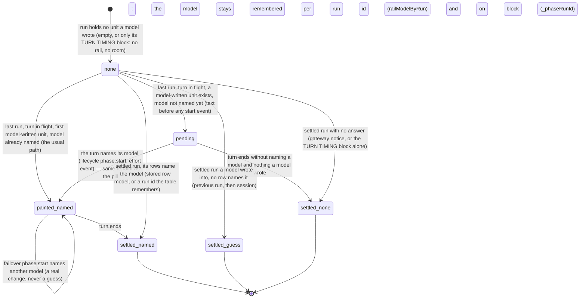
```mermaid
stateDiagram-v2
  [*] --> none: run holds no unit a model wrote (empty, or only its TURN TIMING block: no rail, no room)
  none --> pending: last run, turn in flight, a model-written unit exists, model not named yet (text before any start event)
  none --> painted_named: last run, turn in flight, first model-written unit, model already named (the usual path)
  pending --> painted_named: the turn names its model (lifecycle phase:start, effort event) — same repaint as the pill
  painted_named --> painted_named: failover phase:start names another model (a real change, never a guess)
  painted_named --> settled_named: turn ends; the model stays remembered per run id (railModelByRun) and on the block (_phaseRunId)
  pending --> settled_none: turn ends without naming a model and nothing a model wrote
  none --> settled_named: settled run, its rows name the model (stored row model, or a run id the table remembers)
  none --> settled_guess: settled run a model wrote into, no row names it (previous run, then session)
  none --> settled_none: settled run with no answer (gateway notice, or the TURN TIMING block alone)
  settled_named --> [*]
  settled_guess --> [*]
  settled_none --> [*]
```

**What each state draws:**

| state                            | `.turn-seg` room (20 px left, 18 px caps) | line, logos, colour, hover name | pill (same repaint)        |
| -------------------------------- | ----------------------------------------- | ------------------------------- | -------------------------- |
| `none`, `settled_none`           | no                                        | no                              | —                          |
| `pending`                        | yes (`PENDING_RAIL`, `.is-pending`)       | no                              | pending label or "working" |
| `painted_named`, `settled_named` | yes                                       | yes, the named model            | the same model's name      |
| `settled_guess`                  | yes                                       | yes, the guessed model          | —                          |

**Invariants:**

- **No guess while the turn is in flight.** The last run's rail, while `viewedTurnInFlight()`, is `inFlightTurnModel()` or pending. Never the previous run's model, never the session row's (the row keeps the previous turn's model until the gateway persists the new one at run end, `session-usage.ts`).
- **One answer for the pill and the rail.** Both read `inFlightTurnModel()`; lifecycle `phase:start` writes the run table and then calls `updateChat()`, which repaints both units in one pass.
- **The room never moves.** Pending and painted rails have the same box, so every unit of the run stays put when the colour arrives. The one remaining shift is a turn that ends with nothing a model wrote and no named model (`pending → settled_none`): the room is given back.
- **TURN TIMING is never railed (2026-10-06).** Its unit is skipped (`chat-units.ts timingKeys`), the logos bracket only the model-written units, and a block between two of them leaves a gap in the line. So the block sits flush under its prompt from its first paint to the end, and no line ever appears beside it.
- **A painted rail is not repainted with a different model** except by a later `phase:start` for the same run (a real failover). `railModelByRun` and the block's `_phaseRunId` keep the settled run on the model the live run showed.

**Code:** `tinker-ui/src/chat-rail.ts` (`runRailState`, `answeringModel`, `namedModel`, `PENDING_RAIL`), `tinker-ui/src/chat-units.ts` (`runRail(rows, prev, tail)`), `tinker-ui/src/app.ts` (`chatRunRail`, `inFlightTurnModel`, `viewedRunsForIndicator`, `viewedTurnInFlight`, `closePreModelWindow(runId)`). **Tests:** `chat-rail.test.ts` ("runRailState", "namedModel", the TURN TIMING cases), `chat-units.test.ts` (the `tail` flag, the pending rail; 2026-10-06: the rail opens below TURN TIMING, a block-only run asks no resolver, a block after the answer sits outside the rail). **Sequence:** flows.md F-TURN-MODEL.

see also: prompt-queue.md (§2 IS this prompt's state machine; §4 the gateway holders of "live"; §5 the PQ principles these invariants answer to), done-signals.md (owns which signal wins when they disagree, row 10 for a disposition `final`, and the R2a rule that a predicate clears nothing), architecture.md (the ONE PREDICATE · ONE TRIGGER · ONE CLOCK · ONE STATE SET row for UI session-activity indication), turn-latency.md (owns the measured cost of the pre-model stages), tinker-ui.md (owns the visual language of the three bubble lanes), bug-log.md (the 2026-08-26 incident this entry was written from).

---

## L6. Restart-deferral drain (task freshness gate)

**Status:** DEPLOYED (FORK 2026-07-21, `aec445bfbb` + `dbfc255cbe`). last_verified 2026-07-21.

**Entity:** one reconciled queued/running `TaskRecord`, as seen by the gateway restart/reload drain (`waitForActiveWorkBeforeChannelReload` and the restart gate in `src/gateway/server-reload-handlers.ts`).

**Code:** `getRestartBlockingTaskSummary` in `src/tasks/task-registry.maintenance.ts`; consumed by `getActiveCounts` in `src/gateway/server-reload-handlers.ts`.

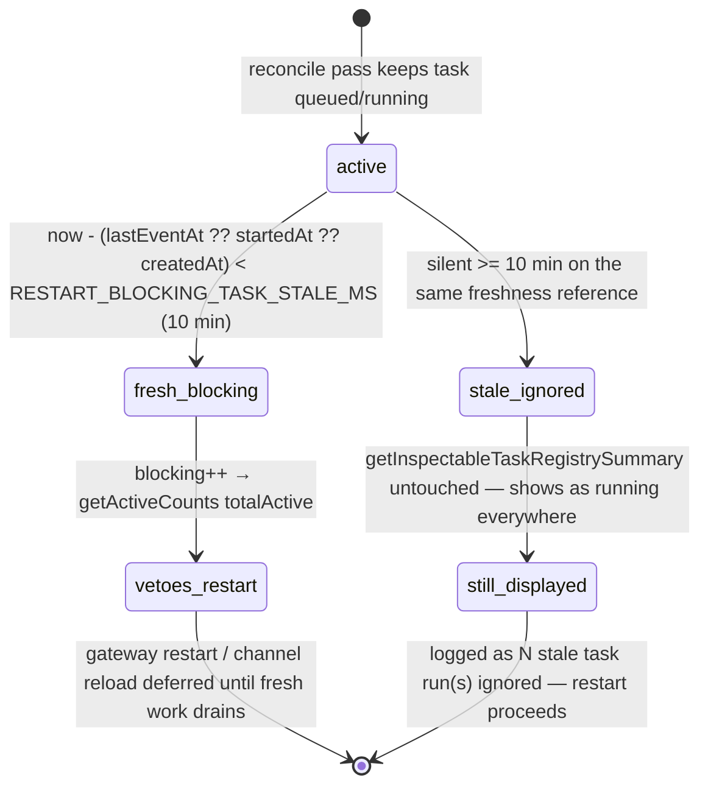
```mermaid
stateDiagram-v2
  [*] --> active: reconcile pass keeps task queued/running
  active --> fresh_blocking: now - (lastEventAt ?? startedAt ?? createdAt) < RESTART_BLOCKING_TASK_STALE_MS (10 min)
  active --> stale_ignored: silent >= 10 min on the same freshness reference
  fresh_blocking --> vetoes_restart: blocking++ → getActiveCounts totalActive
  stale_ignored --> still_displayed: getInspectableTaskRegistrySummary untouched — shows as running everywhere
  vetoes_restart --> [*]: gateway restart / channel reload deferred until fresh work drains
  still_displayed --> [*]: logged as N stale task run(s) ignored — restart proceeds
```

**Invariants:**

- Freshness reference = `lastEventAt ?? startedAt ?? createdAt` — the SAME chain as `hasLostGraceExpired`, so the restart gate and lost-marking never disagree about what "silent" means. Silent ≥ 10 min (`RESTART_BLOCKING_TASK_STALE_MS`) → `staleIgnored`; otherwise → `blocking`.
- **Fresh/stale is a restart-gate VIEW, not a status transition.** A stale task still displays as running everywhere (`getInspectableTaskRegistrySummary` untouched); it only stops vetoing a gateway restart or channel reload.
- `getActiveCounts` folds ONLY `blocking` into `totalActive`; `staleIgnored` surfaces in deferral messages as `<n> stale task run(s) ignored`, so the drain's decision stays auditable in the logs.
- The same reconcile pass runs first (durable cron recovery + lost-marking still apply); the fresh/stale partition only touches tasks that SURVIVE reconciliation.
- **Why (2026-07-21):** a running task whose session-store entry still exists is never marked lost (`hasBackingSession`), so a dead worker could block restarts indefinitely — observed live: 10 zombies deferring a gateway restart 4+ hours.

- **FORK 2026-09-14 (`c6445ba0788`) — the deferral cap never forces over live work.** `deferGatewayRestartUntilIdle({canForceOnTimeout})`: once `gateway.reload.deferralTimeoutMs` (default 15 min) has elapsed, the restart fires only when `embeddedRuns + activeTasks === 0`; otherwise the poll continues (`restart deferral cap reached after <ms> but <n> live turn(s) remain … NOT forcing`, every 30 s) and the restart lands at the first idle instant. The cap still clears LEAKED bookkeeping counters (queue ops, pending replies) on its own, so a config change cannot wedge. Why: 2026-09-14 12:46:28 the unconditional cap ("restarting anyway") SIGTERMed eight live runs, one 21 minutes old — failures.md M18.

see also: config-shape.md (owns config-key semantics — the 10-min threshold is the code constant `RESTART_BLOCKING_TASK_STALE_MS` today, `staleAfterMs` is an opts override, no config key yet), failures.md (deferral that never completes), flows.md (restart drain sequence).

**Probe:** none dedicated yet — `getRestartBlockingTaskSummary()` is callable in-process; the deferral log line (`<n> stale task run(s) ignored`) is the observable surface.

---

---

## L-PLAN — Plan lifecycle (plan-store managed)

**Entity:** one plan document at `~/.openclaw/workspace/state/prefrontal/plans/<sessionKey-slug>.md`.

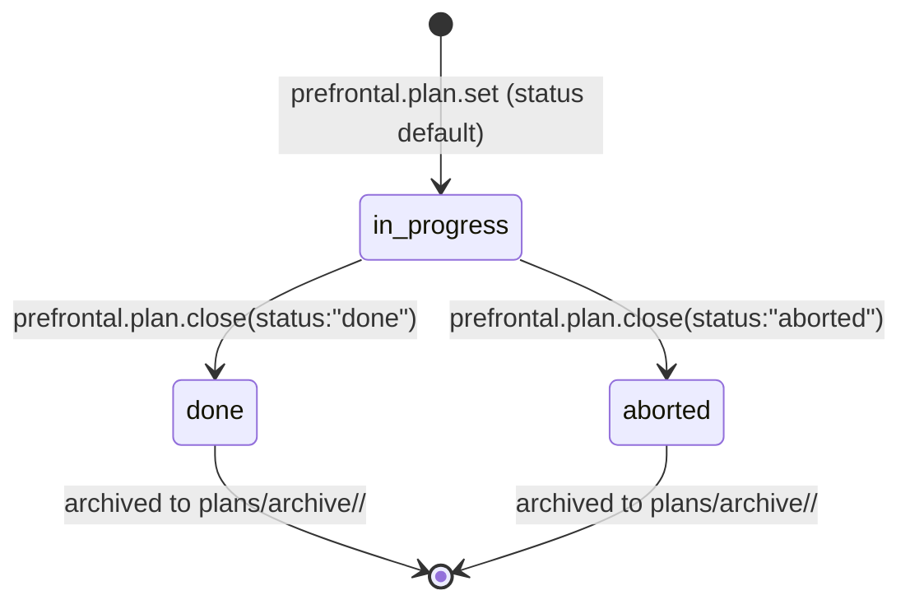
```mermaid
stateDiagram-v2
  [*] --> in_progress: prefrontal.plan.set (status default)
  in_progress --> done: prefrontal.plan.close(status:"done")
  in_progress --> aborted: prefrontal.plan.close(status:"aborted")
  done --> [*]: archived to plans/archive/<YYYY-MM-DD>/
  aborted --> [*]: archived to plans/archive/<YYYY-MM-DD>/
```

**Invariants:**

- `prefrontal.plan.set` always creates with `status: in_progress` unless an explicit `status` is passed.
- `prefrontal.plan.close` transitions to `done` or `aborted` and moves the file to the archive directory.
- The archive path is `~/.openclaw/workspace/state/prefrontal/plans/archive/<YYYY-MM-DD>/<sessionKey-slug>.md`.
- `prefrontal.plan.get` returns `null` for plans that have been closed/archived.
- A sessionKey can have at most one active (in_progress) plan at a time — calling `plan.set` again replaces the existing plan.

**Probe:** `prefrontal.plan.get({ sessionKey })` — returns `{ plan }` with current frontmatter.

---

## L-STEP — Step lifecycle within a plan

**Entity:** one step entry within a plan document (indexed 0-based by `currentStep`).

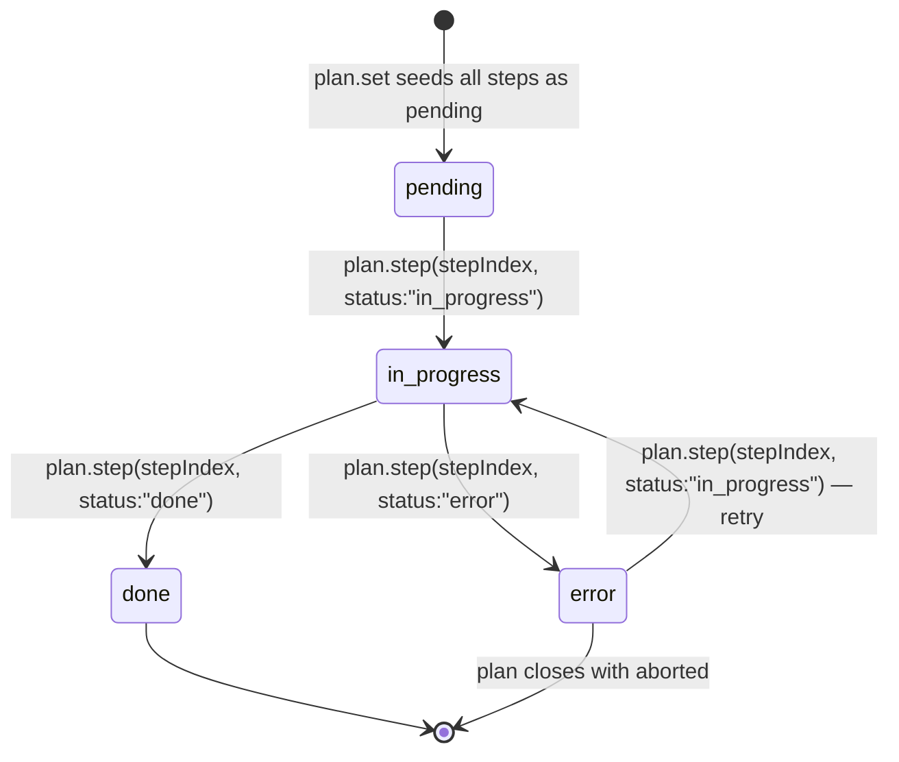
```mermaid
stateDiagram-v2
  [*] --> pending: plan.set seeds all steps as pending
  pending --> in_progress: plan.step(stepIndex, status:"in_progress")
  in_progress --> done: plan.step(stepIndex, status:"done")
  in_progress --> error: plan.step(stepIndex, status:"error")
  error --> in_progress: plan.step(stepIndex, status:"in_progress") — retry
  done --> [*]
  error --> [*]: plan closes with aborted
```

**Invariants:**

- **At most one step may be `in_progress` at a time per plan.** Calling `plan.step` with `status: "in_progress"` for step N automatically demotes any previously `in_progress` step back to `pending`. Enforced by plan-store, not caller.
- Setting a step to `done` does not automatically advance `currentStep` — the caller must explicitly promote the next step.
- An `error` step can be retried by calling `plan.step` again with `status: "in_progress"`.
- Steps cannot be removed or reordered after the plan is created — only status mutations are allowed.

---

## L-KIT-INSTALL — Kit install lifecycle

**Entity:** one `prefrontal.kit.install` invocation.

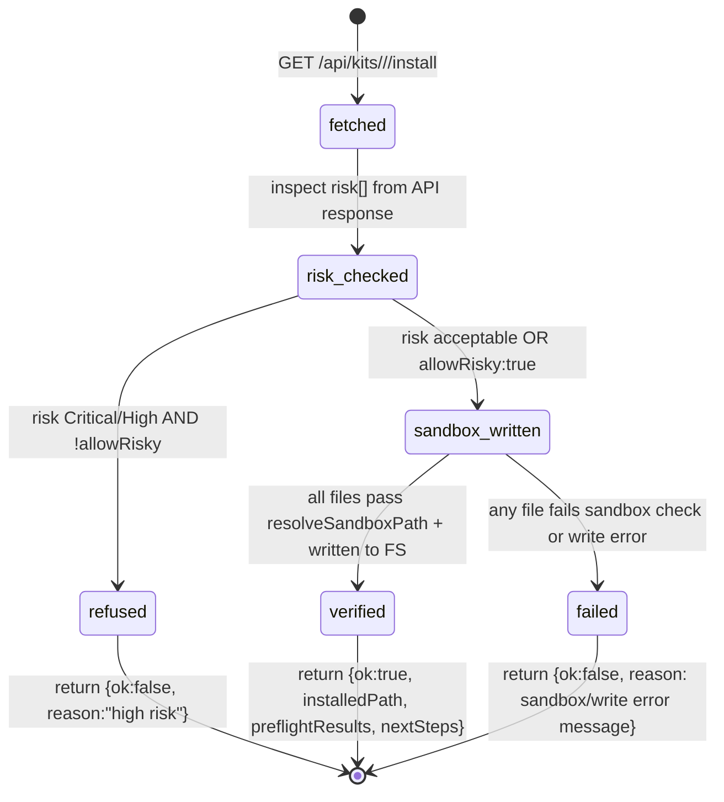
```mermaid
stateDiagram-v2
  [*] --> fetched: GET /api/kits/<owner>/<slug>/install
  fetched --> risk_checked: inspect risk[] from API response
  risk_checked --> refused: risk Critical/High AND !allowRisky
  risk_checked --> sandbox_written: risk acceptable OR allowRisky:true
  sandbox_written --> verified: all files pass resolveSandboxPath + written to FS
  sandbox_written --> failed: any file fails sandbox check or write error
  verified --> [*]: return {ok:true, installedPath, preflightResults, nextSteps}
  refused --> [*]: return {ok:false, reason:"high risk"}
  failed --> [*]: return {ok:false, reason: sandbox/write error message}
```

**Invariants:**

- `fetched → risk_checked` is always synchronous — risk check happens before any file write.
- `sandbox_written` is atomic per-file: if any file fails, the whole install returns `{ok:false}`. Files already written in a partial install are NOT rolled back (future work: transactional write).
- Preflight execution is stubbed in the current implementation. `preflightResults` is returned verbatim from the API response; no actual script execution happens.
- The `verified` state does NOT mean the installed kit has been run or tested — only that all files were written without sandbox violations.

---

## L-STRATEGY — Strategy-switch state machine (U4)

**Status:** DEPLOYED (develop `06f8647fdc`, gateway restarted clean; `fork.strategy.switch.list` VERIFIED-LIVE → `{ok:true,decisions:[]}`). last_verified 2026-06-02.

**Entity:** one per-strategy `StrategyState` (keyed by `strategyId`) inside the durable `FailureStateMap` at `~/.openclaw/engram/failure-state.json`. A "strategy" is the named approach a cron/task currently uses (canonical: `fork-sync:always-merge`, the B010 cascade).

**Code:** transition fns in `src/memory/engram/failure-tracking.ts` (PURE: `recordFailure`/`recordSuccess`/`applySwitch`); decision logic in `src/memory/engram/strategy-switch.ts` (`decideSwitch`); atomic temp+rename persistence in `src/memory/engram/failure-tracking-store.ts` (`updateFailureStateMap` read-modify-write); review/apply RPCs in `src/gateway/server-methods/engram-strategy.ts`. Driven offline by the engram-consolidate cron. See also flows.md (the consolidate→decide→manifest sequence).

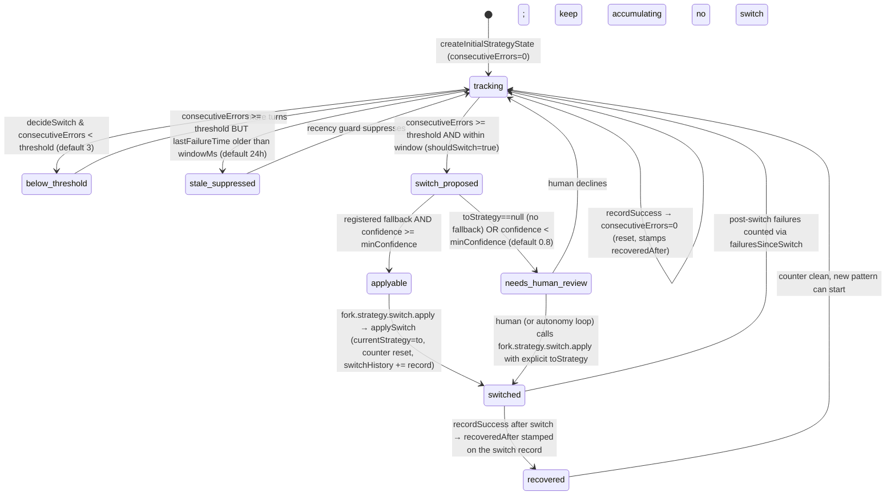
```mermaid
stateDiagram-v2
  [*] --> tracking: createInitialStrategyState (consecutiveErrors=0)
  tracking --> tracking: recordFailure → consecutiveErrors++
  tracking --> tracking: recordSuccess → consecutiveErrors=0 (reset, stamps recoveredAfter)
  tracking --> below_threshold: decideSwitch & consecutiveErrors < threshold (default 3)
  below_threshold --> tracking: more turns
  tracking --> stale_suppressed: consecutiveErrors >= threshold BUT lastFailureTime older than windowMs (default 24h)
  stale_suppressed --> tracking: recency guard suppresses; keep accumulating
  tracking --> switch_proposed: consecutiveErrors >= threshold AND within window (shouldSwitch=true)
  switch_proposed --> needs_human_review: toStrategy==null (no fallback) OR confidence < minConfidence (default 0.8)
  switch_proposed --> applyable: registered fallback AND confidence >= minConfidence
  applyable --> switched: fork.strategy.switch.apply → applySwitch (currentStrategy=to, counter reset, switchHistory += record)
  needs_human_review --> switched: human (or autonomy loop) calls fork.strategy.switch.apply with explicit toStrategy
  needs_human_review --> tracking: human declines; no switch
  switched --> tracking: post-switch failures counted via failuresSinceSwitch
  switched --> recovered: recordSuccess after switch → recoveredAfter stamped on the switch record
  recovered --> tracking: counter clean, new pattern can start
```

**Invariants:**

- `switch_proposed` requires BOTH conditions: `consecutiveErrors >= threshold` AND the most recent failure is within `windowMs` (`DEFAULT_STRATEGY_SWITCH_CONFIG`: threshold 3, windowMs 24h, minConfidence 0.8). A stale-but-numerous failure run is `stale_suppressed`, NOT a switch — the recency guard exists so an old burst doesn't trip a switch weeks later.
- `decideSwitch` is pure/read-only: `fork.strategy.switch.list` and `.review` recompute it on every call from the on-disk map; they never mutate state. Only `fork.strategy.switch.apply` writes (via `applySwitch` inside the atomic `updateFailureStateMap`).
- `needsHumanReview` is set when `toStrategy === null` (no entry in `DEFAULT_FALLBACKS`, which ships `fork-sync:always-merge → fork-sync:ask-before-merge` + `always-merge → ask-before-merge`) OR `confidence < minConfidence`. `apply` will still proceed if given an explicit `toStrategy` — the review flag is advisory, not a hard gate.
- Confidence is lowered by 0.25 when the last switch on this strategy did not recover (`recoveredAfter` undefined or > 0) — an anti-thrash penalty so the machine doesn't ping-pong between two strategies.
- `recordFailure`/`recordSuccess` are idempotent within a consolidation window via `countedEventIds` (bounded to 200), guarding against episode-split double counting.
- Every write goes through `updateFailureStateMap` (re-read fresh inside the atomic helper, temp+rename) so a concurrent writer's strategies are never clobbered (feedback_atomic_store_writes).

**Probe:** `fork.strategy.switch.review({strategyId?})` — full per-strategy `StrategyState` plus its current `decision`; the human audit surface. `fork.strategy.switch.list` returns only the `shouldSwitch===true` decisions (the open-proposal queue).

---

## L-RECIPE-VARIANT — Recipe variant evolution (U1)

**Status:** DEPLOYED (develop `06f8647fdc`). Gated by `RECIPE_AUTOAPPLY_ENABLED` (already `true`). last_verified 2026-06-02.

**Entity:** one recipe variant (`recipeId` @ a `version`) tracked by fitness in the never-delete archive at `<engram-baseDir>/recipe-archive/<recipeId-slug>/v<n>.json` (+ `index.json`). A `MutationProposal` is the transient object the evolution operator emits per consolidation.

**Code:** `src/memory/engram/recipe-fitness.ts` (Laplace-smoothed `successRate`, `loadRecipeFitness`/`makeFitnessLookup`); `src/memory/engram/recipe-evolution.ts` (`proposeMutations` + `isAutoPromotable`); `src/memory/engram/recipe-archive.ts` (`putVariant`/`deprecate`/`rank` — never deletes). PRODUCER of attribution: `recipe-runner.ts` stamps `recipe:<owner/slug>` tags via `onTag` (threaded by `prefrontal.recipe.run`); selection feeds `makeFitnessLookup` into `matchRecipesDetailed`. The actual recipe WRITE (turning an `autoPromotable` proposal into a kit-file edit) lives in the Prefrontal kit layer, OUT of scope of this operator — the Cerebellum only proposes + flags. See also subagents-and-recipes.md (selection/scoring precedence) and flows.md (consolidate→propose sequence).

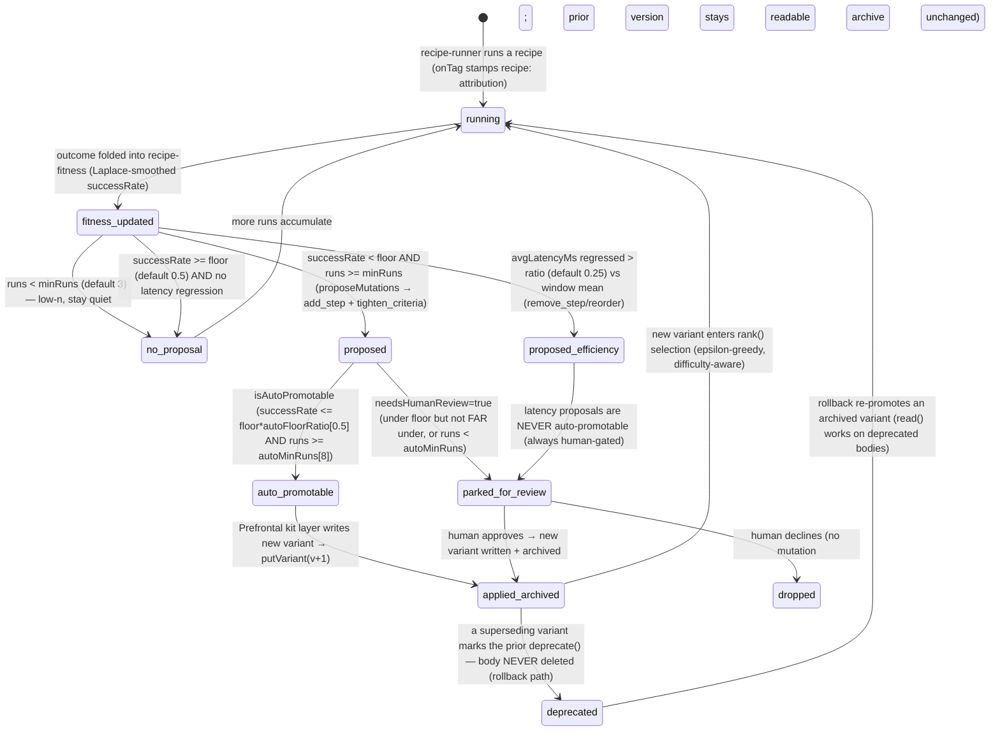
```mermaid
stateDiagram-v2
  [*] --> running: recipe-runner runs a recipe (onTag stamps recipe:<owner/slug> attribution)
  running --> fitness_updated: outcome folded into recipe-fitness (Laplace-smoothed successRate)
  fitness_updated --> no_proposal: runs < minRuns (default 3) — low-n, stay quiet
  no_proposal --> running: more runs accumulate
  fitness_updated --> no_proposal: successRate >= floor (default 0.5) AND no latency regression
  fitness_updated --> proposed: successRate < floor AND runs >= minRuns (proposeMutations → add_step + tighten_criteria)
  fitness_updated --> proposed_efficiency: avgLatencyMs regressed > ratio (default 0.25) vs window mean (remove_step/reorder)
  proposed --> auto_promotable: isAutoPromotable (successRate <= floor*autoFloorRatio[0.5] AND runs >= autoMinRuns[8])
  proposed --> parked_for_review: needsHumanReview=true (under floor but not FAR under, or runs < autoMinRuns)
  proposed_efficiency --> parked_for_review: latency proposals are NEVER auto-promotable (always human-gated)
  auto_promotable --> applied_archived: Prefrontal kit layer writes new variant → putVariant(v+1); prior version stays readable
  parked_for_review --> applied_archived: human approves → new variant written + archived
  parked_for_review --> dropped: human declines (no mutation; archive unchanged)
  applied_archived --> deprecated: a superseding variant marks the prior deprecate() — body NEVER deleted (rollback path)
  applied_archived --> running: new variant enters rank() selection (epsilon-greedy, difficulty-aware)
  deprecated --> running: rollback re-promotes an archived variant (read() works on deprecated bodies)
```

**Invariants:**

- The evolution operator NEVER writes a recipe and NEVER applies a mutation — it only emits `MutationProposal`s and flags `autoPromotable`/`needsHumanReview`. The `applied_archived` edge is the Prefrontal kit layer's responsibility (cross-subsystem), not this module's.
- `autoPromotable` requires ALL THREE: HIGH-CONFIDENCE (`successRate <= successFloor * autoFloorRatio`, i.e. FAR below the floor, not merely under it), WELL-EVIDENCED (`runs >= autoMinRuns`, default 8, strictly greater than the `minRuns`=3 proposal threshold), and REVERSIBLE (always true — the never-delete archive). When `autoPromotable` is true, `needsHumanReview` drops to false.
- Only corrective (low-success-rate) proposals are ever `auto_promotable`. Efficiency/latency proposals (`remove_step`/`reorder`) are always `needsHumanReview:true` — they are not the high-confidence correctness win the autonomy gate targets.
- **Never-delete is the rollback safety net.** `deprecate()` only flips a flag; `read()` still returns a deprecated variant's body. There is NO delete path. This is what makes auto-promotion bounded/safe (self-reinforcing-error-spiral mitigation).
- `rank()` returns LIVE (non-deprecated) variants best-`successRate`-first with an epsilon-greedy explorer slot (default ε 0.1; deterministic when a seeded RNG is injected) and an optional `taskDifficulty` bias (Gödel: difficulty-aware selection).

**Probe:** none yet (proposed `fork.recipe.fitness({recipeId})` would return current fitness + archived versions + open proposals). Today inspect `recipe-archive/index.json` + the per-version sidecars directly. See probes.md.

---

## L-CURIOSITY-GAP — Curiosity gap lifecycle (U2)

**Status:** DEPLOYED (develop `06f8647fdc`). 2a hedge-detector + 2d idle-goal trigger live; RPCs present. 2c LoRA training is an EXTERNAL STUB ONLY (no GPU/Python training; out of scope — see config-shape.md dead-code registry). last_verified 2026-06-02.

**Entity:** one `Gap` record in the append-only JSONL buffer at `~/.openclaw/workspace/memory/curiosity-gaps/YYYY-MM-DD.jsonl` (auto-indexed by memorySearch). Resolution is itself an appended row, folded back by `dedupeKey` — history is never rewritten.

**Code:** `src/fork/curiosity-store.ts` (`makeGap`/`appendGap`/`readGaps`/`topGaps`/`markResolved`/`rescore`/`dedupeGaps`); RPCs in `src/fork/curiosity-rpc.ts` (`fork.curiosity.logGap`/`topGaps`/`resolveGap`). PRODUCERS: 2a hedging-detector wired in `attempt-hooks.ts` `onTurnComplete` (`detectUncertaintySpans` → `extractTopic` → `makeGap` source `lcm-entropy` → `appendGap`, fire-and-forget); 2d idle trigger in `src/fork/idle-goals.ts` (`proposeIdleGoals`, debounced per-session timer re-armed by `noteTurnActivity` in `onTurnComplete`). See also flows.md (NO-MATCH → gap → active-learning sequence).

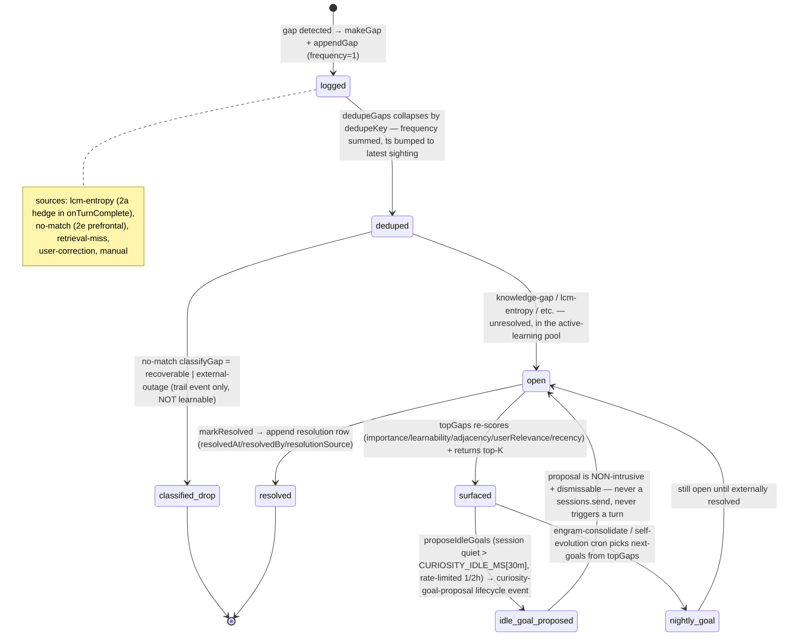
```mermaid
stateDiagram-v2
  [*] --> logged: gap detected → makeGap + appendGap (frequency=1)
  note right of logged
    sources: lcm-entropy (2a hedge in onTurnComplete),
    no-match (2e prefrontal), retrieval-miss,
    user-correction, manual
  end note
  logged --> deduped: dedupeGaps collapses by dedupeKey — frequency summed, ts bumped to latest sighting
  deduped --> classified_drop: no-match classifyGap = recoverable | external-outage (trail event only, NOT learnable)
  classified_drop --> [*]
  deduped --> open: knowledge-gap / lcm-entropy / etc. — unresolved, in the active-learning pool
  open --> surfaced: topGaps re-scores (importance/learnability/adjacency/userRelevance/recency) + returns top-K
  surfaced --> idle_goal_proposed: proposeIdleGoals (session quiet > CURIOSITY_IDLE_MS[30m], rate-limited 1/2h) → curiosity-goal-proposal lifecycle event
  idle_goal_proposed --> open: proposal is NON-intrusive + dismissable — never a sessions.send, never triggers a turn
  surfaced --> nightly_goal: engram-consolidate / self-evolution cron picks next-goals from topGaps
  nightly_goal --> open: still open until externally resolved
  open --> resolved: markResolved → append resolution row (resolvedAt/resolvedBy/resolutionSource)
  resolved --> [*]
```

**Invariants:**

- **No self-output-as-truth (§9.3):** `source:"lcm-entropy"` gaps are _questions_, never facts; they may only ever be resolved from an EXTERNAL channel (the store records `resolutionSource`; "external only" enforcement lives in the active-learning cron body).
- `classifyGap` gates which NO-MATCH failures even become a learnable gap: `recoverable` (permission/auth — user can grant) and `external-outage` (network/timeout/5xx) emit a trail event but NO `Gap`; only `knowledge-gap` feeds the buffer (recon risk #2 — don't waste active-learning on a transient outage).
- The `idle_goal_proposed` edge is deliberately a dead-end back to `open`: a proposal is a NON-intrusive `curiosity-goal-proposal` lifecycle event (a dismissable chip), NOT a `sessions.send` — it must never trigger a Jarvis turn or interrupt the user. Rate-limited (≥2h/session) and skipped for automated/subagent/cron sessions.
- Resolution is append-only: `markResolved` writes a _resolution row_ (copy of the gap with resolution fields stamped) to today's file; `dedupeGaps` folds it onto the original by `dedupeKey`. History is never rewritten (atomic-append discipline; the daily file is `O_APPEND` single-write safe).
- JSONL append never blind-overwrites; a torn tail line degrades to "skip that line", never an exception that crashes the cron.

**Probe:** `fork.curiosity.topGaps({k})` — the current open active-learning queue (deduped, re-scored, top-K). `fork.curiosity.resolveGap({id,by,source})` transitions a gap to `resolved`. No state-snapshot probe for a single gap id yet.

---

## Validation strategy

Each state machine should be paired with a probe that returns the entity's current state. Today only L1 has a partial probe (`sessions.json` direct read); L2–L5 need probes (see `probes.md`).

When a state transition is added in code, the diagram must be updated in the same PR. The merge gate (J15 §5) eventually enforces this by failing when a code path leaves a state with no diagram arrow.
