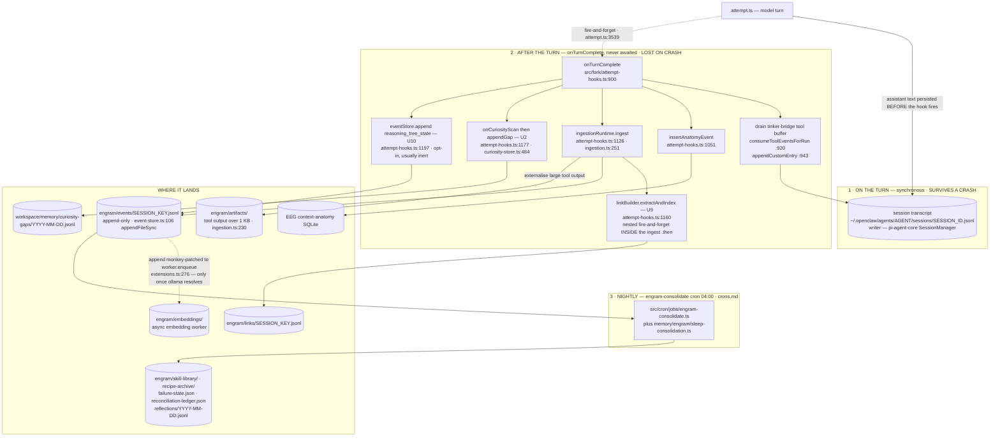
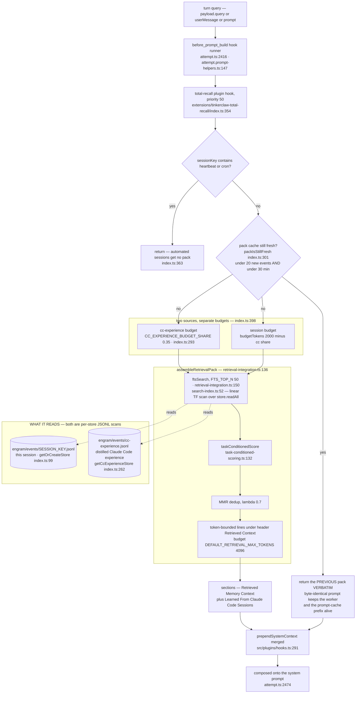
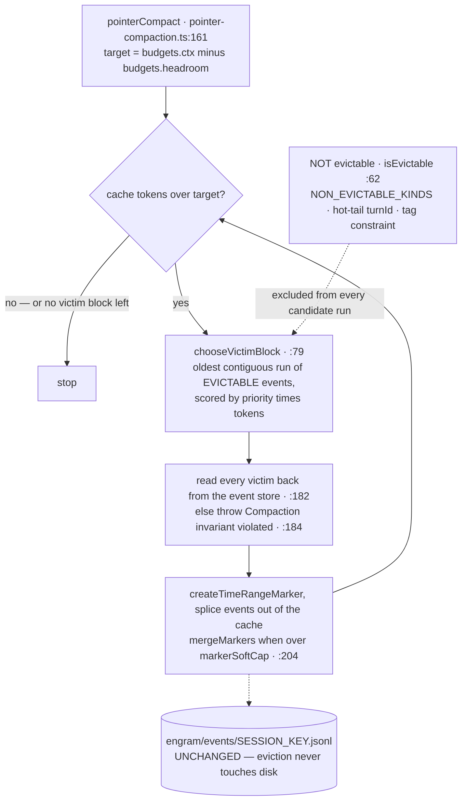

# Memory layout — workspace directory map

All paths below are under `~/.openclaw/workspace/memory/` unless otherwise noted. This entire tree is PRIVATE (lives in jarvis-brain GitLab repo). It is NEVER symlinked into public tinkerclaw.

## The two paths — W (write) and R (read)

Memory has more moving parts than any other subsystem in the harness. Read these two diagrams before the directory map: the map says WHAT each store holds, the diagrams say HOW a turn's data gets in and back out.

> **Scope (single-owner discipline).** These diagrams own **where each piece of a turn LANDS and what survives a crash** — store ownership + durability. They do NOT own the sequence of calls (flows.md), state machines (lifecycles.md), or the duplicate-implementation ledger (canonical-derivations.md). If the call ORDER changes, edit flows.md; if a piece of a turn starts landing in a different store, edit here.

### W. Write path — what a turn produces, and where each piece lands

The load-bearing fact: **`attempt.ts` returns the turn without waiting for a single memory write.** The post-turn hook is dispatched fire-and-forget — `_forkAttemptHooks.onTurnComplete({…})` at `src/agents/embedded-agent-runner/run/attempt.ts:3539`, `.catch()`-chained at `:3555`, with the `return` immediately after at `:3559`. That gives exactly two durability classes:

- **Synchronous, on the turn — survives a crash.** The session transcript. pi-agent-core's `SessionManager` has already persisted the assistant text before the hook runs; that ordering is precisely why `onTurnComplete`'s tool entries trail the assistant message in jsonl order and need a reorder pass on read (`src/gateway/session-utils.fs.ts:305`, applied at `:301` via `reorderTinkerBridgeToolBlocks` `:349`).
- **Deferred, after the turn — lost on a crash.** Every ENGRAM write, the EEG anatomy row, the link index, the curiosity gap, the reasoning trace. Kill the process (or restart the gateway) between "turn returned" and "hook finished" and all of them vanish silently: the reply the user saw is in the transcript but never entered memory.



**Invariants**

- The transcript is the ONLY per-turn record with a durability guarantee. Anything that must survive a crash cannot be written from `onTurnComplete`.
- `createIngestionPipeline` keeps an internal cursor (`ingestedCount`, `ingestion.ts:254`) so re-calling `ingest()` on a growing snapshot never double-writes — `attempt.ts` retry loops are safe.
- Every store above is either **append-only JSONL** (events, links, curiosity gaps, reflections) or **whole-file JSON written temp-then-rename**. Nothing on the write path is mutated in place.
- The embeddings lane is CONDITIONAL: `eventStore.append` is monkey-patched to enqueue into the embedding worker only after the ollama provider resolves (`src/agents/embedded-agent-runner/extensions.ts:276`, enqueue at `:279`). Ollama down ⇒ events still land, semantic recall silently degrades.
- This whole lane is inline-ENGRAM, gated by `isInlineMode("engram")` (`attempt-hooks.ts:74`, key `fork.cognitive.engram`, absent ⇒ inline) and by `agents.defaults.compaction.mode === "engram"` at session setup (`extensions.ts:146`). Set either off and every deferred write above is silently absent — see config-shape.md.

### R. Read path — query → retrieval pack → prompt

**The live injector is the memory PLUGIN, not the inline runtime.** `tinkerclaw-total-recall` registers a `before_prompt_build` hook (`extensions/tinkerclaw-total-recall/index.ts:354`, priority 50) and returns `{ prependSystemContext }`; the plugin host merges it (`src/plugins/hooks.ts:291`) and `attempt.ts:2474` composes it onto the system prompt. The pack itself is built by `assembleRetrievalPack` (`src/memory/engram/retrieval-integration.ts:136`), reached across the sanctioned boundary crossing `openclaw/plugin-sdk/memory-engram` → `src/plugin-sdk/memory-engram.ts:61`.



**⚠️ The whole INLINE retrieval lane is DEAD — and its instrument reads NEVER by construction** (verified at HEAD `e57d22f5fcf`). This is exactly the "registered means running" conflation `src/infra/instrument-liveness.ts` exists to catch, so read it carefully before touching retrieval:

1. **`injectRetrievalPack`** (`src/fork/attempt-hooks.ts:309`) has ZERO callers. `attempt.ts` imports `* as _forkAttemptHooks` but calls only `applyMidContextReinjectHook` (`:2892`), `captureForensicDumpHook` (`:2975`), `interceptTextToolCalls` (`:3345`) and `onTurnComplete` (`:3539`). The single textual hit elsewhere (`src/fork/reasoning-runtime.ts:227`) is a COMMENT describing a wiring that does not exist.
2. Because that function is the only reader of `rt.assemble` (`attempt-hooks.ts:326`), **`buildDefaultAssemble` (`src/agents/pi-extensions/retrieval-runtime.ts:156`) assembles a pack nothing consumes.** Everything reachable only from it is therefore dead too: `loadTodayDailyLog`, `hasWriteIntent`/`findContradictions`, `extractEntities`/`entitiesToQueries`, `expandViaBacklinks` (`:85`), the recency boost (`:239`), and `mmrRerank` at `:249`.
3. **`RetrievalRuntime.pushPack`** (`retrieval-runtime.ts:57`) has ZERO readers.
4. The `engram:retrieval-pack-inject` instrument is DECLARED at `attempt-hooks.ts:59` and FIRED at `:335` — inside the uncalled function. **It can only ever report NEVER; do not read it as evidence either way.**

**Consequence — `engram-fts.db` is on the dead lane.** `globalFtsSearch` / `globalFtsMultiSearch` (`src/memory/engram/global-fts-bridge.ts:22` / `:93`) are the only readers of `~/.openclaw/engram/engram-fts.db` (`:16`), and they are wired only into the inline runtime (`extensions.ts:185` and `:262`, `retrieval-runtime.ts:197`, plus `contradiction-gate.ts:128` which is itself reached only from `buildDefaultAssemble`). Nothing in the repo WRITES that file either. The pack the model actually gets comes from a linear scan of two JSONL stores, so **recall today is lexical TF over this session plus the cc-experience store — there is no cross-session semantic recall on the live path.** `vectorSearch` (`search-index.ts:120`) exists and is session-local (`applyFilters(store.readAll(), filters)` at `:137`) but sits behind the same dead runtime.

**Twin collapse — done, do not redraw it.** The 26-file vendored copy under `extensions/tinkerclaw-total-recall/src/` was deleted at HEAD `e57d22f5fcf`; `assembleRetrievalPack` now has ONE implementation and the plugin reaches it through the plugin-SDK surface. The duplicate ledger and the "boundary rule with no crossing launders coupling into duplication" reasoning are owned by canonical-derivations.md — see there, not here.

## Directory map

### `people/` — people-profile cards

- **Writer:** `tinkerclaw-people` plugin (via `people.update_consulted_at`) + the `people-profiles` cron (auto-generation from WhatsApp inbound).
- **Reader:** `tinkerclaw-people` plugin (`people.{resolve,read,list}` RPCs); auto-reply pipeline (sender-profile prefetch via `people-prefetch.ts`).
- **Layout:** `people/<slug>/profile.md` + aliases file.
- **Cardinality:** ~1014 aliases / ~1223 profile files (2026-05-04 snapshot).
- **Retention:** unbounded; consolidation cron removes stale alias mappings.

### `morning-briefings/`

- **Writer:** `morning-briefing` cron at 07:00; user `/new` flow may also append a user-pass.
- **Reader:** Tinker UI `/new` flow, user.
- **Layout:** `YYYY-MM-DD.md` (cumulative passes) + `YYYY-MM-DD-preflight.json` (preflight matrix).
- **Critical:** cron pass = audit; user `/new` = pass-1. See M8 in failures.md.

### `knowledge/`

- **Writer:** mostly hand (Jarvis adds knowledge files at user request).
- **Reader:** memorySearch retrieval, ad-hoc reads.
- **Notable files:** `INDEX.md`, `evolution-log.md`, `ripple-tracker.md`, `tinkerclaw-tinker-bridge.md`, `tinkerclaw-people-plugin.md`, `tinkerclaw-whatsapp-plugin.md`, `wa-owner-prefix-invariant.md`, `whatsapp-strategy.md`, `cost-aware-model-routing.md`, `hermes-agent-analysis.md`, `operational-lessons.md`, `serra-projects-state.md`.

### `butler-log/`

- **Writer:** `life-butler` cron + user-facing butler interactions.
- **Reader:** morning-briefing cron (carryover), Jarvis context.
- **Layout:** `INDEX.md`, `butler-scope.md`, `dates-registry.md` (anniversaries / birthdays / flowers), `YYYY-MM-DD.md` per day.

### `online-presence/`

- **Writer:** `online-engagement` cron.
- **Reader:** morning-briefing (online income priority axis).
- **Layout:** `engagement-state.json` + `YYYY-MM-DD.md` daily.

### `security-reports/`

- **Writer:** `security-updates-check` cron.
- **Layout:** `META.md` + `YYYY-MM-DD-report.md` daily.

### `self-evolution/`

- **Writer:** `self-evolution` cron.
- **Layout:** `index.md`, `model-intelligence-state.json`, `YYYY-MM-DD.md` daily.

### `spiritual-tech/`

- **Writer:** `spiritual-tech` cron.
- **Layout:** `interests.md`, `ethics-codex.md`, `YYYY-MM-DD.md` daily.

### `whatsapp-summaries/`

- **Writer:** wind-down or related cron (TBD; confirm).
- **Layout:** `YYYY-MM-DD.md` per day.

### `consolidation-logs/`

- **Writer:** `cleaning-lady` (memory consolidation) cron.
- **Layout:** `YYYY-MM-DD.md` daily.

### `maintenance-reports/`

- **Writer:** `fork-scanner` cron + ad-hoc.
- **Layout:** `YYYY-MM-DD.md` + `YYYY-MM-DD-fork-sync.md` + `YYYY-MM-DD-wind-down.md`.

### `cron-receipts/`

- **Writer:** cron scheduler itself.
- **Layout:** `YYYY-MM-DD-<jobId>.json` per run.
- **Note:** this is a flat archive of run outcomes; the rolling `~/.openclaw/cron/runs/<jobId>.jsonl` is the live tail.

### `bugs/`

- **Writer:** Jarvis when documenting unresolved bug reports.
- **Layout:** `INDEX.md` + `BNNN-<slug>.md` files.

### `ai-research/`

- **Writer:** Jarvis tracking external AI development.
- **Layout:** `agent-oss-tracklist.json`, `fork-watchlist.json`, `fork-survey/YYYY-MM-DD.md`.

### `chat-profiles/`

- **Writer:** auto-reply pipeline writing per-chat config (chat-rhythm settings, response policy overrides).
- **Layout:** per chat-jid subdirectories.

### `shopping/`

- **Writer:** marketplace-watcher cron, ad-hoc.
- **Layout:** `watchlist-state.json`.

### `curiosity-gaps/` — U2 intrinsic-motivation episodic buffer (J8 THALAMUS)

- **Writer:** `appendGap()` in `src/fork/curiosity-store.ts`. PRODUCERS: the `2a` hedging/uncertainty detector wired into `attempt-hooks.ts` `onTurnComplete` (`source:"lcm-entropy"`), a prefrontal NO-MATCH (`2e`, `source:"no-match"`), retrieval miss, or user correction. RPC surface: `fork.curiosity.logGap/topGaps/resolveGap` (`curiosity-rpc.ts`).
- **Reader:** `readGaps()`/`topGaps()`; auto-indexed by `memorySearch` (any new dir under workspace/memory/ is picked up — see "Writer ↔ reader summary").
- **Layout:** `YYYY-MM-DD.jsonl` — one append-only JSONL of `Gap` records per day.
- **Atomic-write:** JSONL append is naturally append-safe (single `O_APPEND` write); any future daily-index summary must go read-modify-write-rename (`feedback_atomic_store_writes`).
- **Invariant — no self-output-as-truth:** `source:"lcm-entropy"` gaps are _questions_, not facts; resolution must come from an EXTERNAL channel (`resolutionSource` recorded here; "external-only" enforced in the active-learning cron body).
- **Dedupe:** NO-MATCH spam collapses by `(recipe|tool|reason)`; other sources by `(source|topic)` — frequency counted, never duplicated.
- **Note:** the ONLY OSS-harness (U1–U12) store under `workspace/memory/`; the rest live under the ENGRAM root — see below.

## Engram + compaction state

- `consolidation-state.json` — top-level pointer for the memory consolidation engine (engram pointer-mode, ENGRAM_POINTER_COMPACTION=1). (Lives under `workspace/memory/`; a per-session copy also lives at the ENGRAM root — see next section.)
- See J1 (ENGRAM) and J14 (MNEMOSYNE) for the full memory-engine theory.

## ENGRAM root — `~/.openclaw/engram/` (OSS-harness stores)

A SECOND private memory tree, distinct from `workspace/memory/`. Root resolves to `join(process.env.HOME ?? OPENCLAW_HOME, ".openclaw", "engram")` (see `src/agents/embedded-agent-runner/extensions.ts:159` for the inline-runtime branch; `engramRoot(baseDir?)` in `src/fork/skill-rpc.ts` + `src/cron/jobs/engram-consolidate.ts` use the same default with an `OPENCLAW_HOME` override for tests). Pre-existing contents: `events/`, `embeddings/`, `engram-fts.db`, `artifacts/`, `reflections/`, daily `YYYY-MM-DD.jsonl` event logs, and a per-session `consolidation-state.json`. The OSS-harness upgrades (commit 06f8647fdc, on top of 70ad58e45d) add the stores below. This tree is PRIVATE — never symlinked into the public fork.

Convention shared by these stores: **atomic write = write-temp-then-rename** (`feedback_atomic_store_writes`) for whole-file JSON; **append-only JSONL** for per-event logs; **defensive read** (missing/corrupt → empty, never throw); **never-delete** for the versioned knowledge stores (supersession marks `deprecated`, body stays readable + recoverable). The single highest-leverage WRITER here is the `engram-consolidate` cron (04:00 daily, code-only descriptor — see crons.md); RPC handlers (`fork.skill.*`, `fork.curiosity.*`) are the live read/write surface.

### `recipe-archive/` — U1 recipe-evolution versioned store (J5 + J13)

- **Writer:** `createRecipeArchive()` in `src/memory/engram/recipe-archive.ts`. PRODUCER chain: `recipe-runner.ts` stamps `recipe:<owner/slug>` attribution tags via `onTag` (threaded by `prefrontal.recipe.run`); the `engram-consolidate` cron runs `proposeMutations()` (`recipe-evolution.ts`) and writes new variants. Gated by `RECIPE_AUTOAPPLY_ENABLED` (already "true").
- **Reader:** `loadRecipeFitness(baseDir, slug)` / `makeFitnessLookup()` (`recipe-fitness.ts`) — a SYNC reader threaded as a `FitnessLookup` feedback into `matchRecipesDetailed` (turn-start seed + `recipe.match`). `rank()` returns variants best-fitness-first with an epsilon-greedy explorer slot.
- **Layout:** `index.json` (`{ recipeId -> { recipeId, versions: number[] } }`) + `<recipeId-slug>/v<n>.json` (`{ body, fitness, deprecated }`). `recipeId` is the canonical `owner/slug`; dir-name slugify escapes non-`[A-Za-z0-9._-]`.
- **No separate fitness store:** `recipe-fitness.ts` has NO file of its own — each variant's Laplace-smoothed `successRate` lives INSIDE its `v<n>.json` under `.fitness`. Default for an unmeasured recipe is the neutral `laplace(0,0)` = 0.5 (never penalised).
- **Retention:** NEVER deletes — supersession sets `deprecated:true`; the body stays readable for rollback (self-reinforcing-error-spiral mitigation). On-disk dir is created lazily on first promoted mutation (absent until then).
- **Behavior owner:** selection/scoring precedence (base → U1 fitness feedback → U12 rating tie-break) lives in subagents-and-recipes.md; this optic owns only the on-disk shape.

### `skill-library/` — U6 Voyager skill-library-as-code (J5 + J2)

- **Writer:** `createSkillLibrary()` in `src/memory/engram/skill-library.ts`. PRODUCER: `skill-extraction.ts` (structured-procedure `Skill`, optional `verifiedCode`) injected into the `engram-consolidate` cron; `skill-invocation.ts` records outcomes back. RPC: `fork.skill.search` / `fork.skill.recordOutcome` (`src/fork/skill-rpc.ts`).
- **Reader:** embed-ranked search (an injected `EmbedFn` embeds the query + all live skill texts in ONE batch, cosine-ranked) with a token-overlap keyword fallback when no `EmbedFn` is wired.
- **Layout:** `library.json` (`{ skillId -> SkillLibraryIndexEntry }`) + `skill-<skillId>/v<n>.json` (full `Skill` body per version). Whole-file writes go temp-then-`renameSync` (atomic).
- **Retention:** NEVER deletes — `deprecate()` marks obsolete while `read()` still returns the body. Re-extraction of a same-named skill bumps `version`; a near-identical skill (Jaccard > 0.8, `SKILL_DEDUP_JACCARD`) merges `sourceEpisodeIds` rather than duplicating (library-bloat mitigation).
- **On-disk now:** the `skill-library/` dir EXISTS (empty until the consolidation cron extracts a skill).

### `links/<sessionKey>.jsonl` — U9 A-MEM Zettelkasten link index (J3)

- **Writer:** `createLinkIndex()` in `src/memory/engram/link-index.ts` (same JSONL-append + in-memory-cache pattern as `event-store.ts`). PRODUCER: `setLinkBuilderRuntime` registered at the session-setup site `src/agents/embedded-agent-runner/extensions.ts:179` (beside `setIngestionRuntime`); `extractAndIndex()` fires fire-and-forget in `attempt-hooks.ts` `onTurnComplete`, parsing `[[wikilink]]` + entity refs via `mention-parser.ts`.
- **Reader:** `getBacklinks(targetKey)` — 1-hop backlink expansion folded into `retrieval-runtime.ts`. `resolveTargets(eventStore)` late-binds normalized mention keys to concrete event ids (a target may be mentioned before the note it names exists).
- **Layout:** `links/<sessionKey>.jsonl` — append-only `LinkRecord` rows (`{ id, sourceId, targetKey, mentionText, kind, createdAt }`); two in-memory `Map`s (`forward` / `backward`) rebuilt from the JSONL on first read.
- **Atomic-write:** `appendFileSync` (single append); never a blind whole-file overwrite.
- **On-disk now:** the `links/` dir EXISTS (per-session files appear once a turn writes a mention).

### `failure-state.json` — U4 failure→strategy-switch durable store (J5)

- **Writer:** `updateFailureStateMap()` / `saveFailureState()` in `src/memory/engram/failure-tracking-store.ts`, driven by the `engram-consolidate` cron. RPC: `fork.strategy.switch.list/apply/review` (`src/gateway/server-methods/engram-strategy.ts`); proposals come from `strategy-switch.ts`.
- **Layout:** single JSON file `~/.openclaw/engram/failure-state.json` holding the per-strategy `FailureStateMap`.
- **Atomic-write:** write-temp-then-`renameSync`; `updateFailureStateMap` is a read-modify-write under that helper so a concurrent writer's fields are never clobbered (always re-reads the FRESH on-disk copy, not a stale snapshot). Defensive read → empty map on missing/corrupt (torn write degrades to "start fresh").
- **On-disk now:** absent until the cron proposes the first switch (`fork.strategy.switch.list` → `{ok:true,decisions:[]}` verified live).

### `reconciliation-ledger.json` — U8 Mem0 write-reconciliation ledger (J1)

- **Writer:** `createReconciliationLedger({ filePath })` in `src/memory/engram/reconciliation-ledger.ts`; the `engram-consolidate` cron passes `filePath: join(baseDir, "reconciliation-ledger.json")`. `reconciler.decide()` (`reconciliation.ts`, ADD/UPDATE/DELETE/NONE) runs in the ingestion append hot-path; `reconcileWindow` runs in consolidation.
- **Layout:** `{ entries: Record<eventId, LedgerEntry>, tail: LedgerEntry[] }` — UPDATE/DELETE take effect as _logical_ supersede/tombstone rows (one per fact-key, latest wins) + a bounded rolling tail of raw decisions. The underlying event JSONL is NEVER physically mutated (append-only audit plane).
- **Atomic-write:** whole-file `writeFileSync(JSON.stringify(...))` (a future hot path should move to temp-then-rename if it leaves consolidation-only writes); `filePath` absent ⇒ in-memory only.
- **DARK-LAUNCHED:** gated behind `ENGRAM_RECONCILE` (default OFF → default reconciler is always-ADD = today's behavior, no ledger written). On-disk absent until the flag is set and the cron runs.

### MEMORY.md writer (U8) — bounded, idempotent, **suggest-only**

- **Writer:** `src/memory/engram/memory-md-writer.ts` — a PURE function `facts + summaries + {maxLines} → { content, demotions, ... }`. It NEVER touches disk and NEVER decides to overwrite `MEMORY.md`. The Wire phase (behind `ENGRAM_RECONCILE`, default OFF) decides whether to persist the content and how to act on demotion suggestions.
- **Output target (when wired):** the user's `MEMORY.md` digest. Bounding mirrors MEMORY.md's own "one-line index entry; move detail to a topic file" discipline — when facts + summaries exceed `maxLines`, the LOWEST-importance facts are DEMOTED to a linked detail-file reference (never dropped). Deterministic/idempotent: facts sorted by (importance desc, key asc) → byte-identical output; re-serializing the bounded survivor set is a fixpoint.
- **Retention/authorship:** suggest-only by default PRESERVES MEMORY.md's hand-edited authorship — reconciliation can only _suggest_ prunes, never silently rewrite.

## Retention and eviction

Two different mechanisms, routinely confused:

- **Retention** — does the row ever leave DISK? Across this optic the answer is essentially always **no**.
- **Eviction** — does the row stay in the model's CONTEXT? Often no. Eviction is a context-window operation performed by `pointerCompact` (`src/memory/engram/pointer-compaction.ts:161`): it splices events out of the in-memory `ContextCache` and leaves a `TimeRangeMarker` in their place. **The event JSONL is never touched.** Eviction is lossless by construction — `pointerCompact` reads every victim back out of the store first (`:182`) and throws `Compaction invariant violated` (`:184`) if one is missing.

### What is evictable

| Event kind                                                                          | Evictable from context?        | Eviction priority (higher = evicted first) |
| ----------------------------------------------------------------------------------- | ------------------------------ | ------------------------------------------ |
| `tool_result`                                                                       | yes                            | 1.0 — biggest, cheapest to drop            |
| `tool_call`                                                                         | yes                            | 0.8                                        |
| `agent_message`                                                                     | yes                            | 0.5                                        |
| `user_message`                                                                      | yes                            | 0.5                                        |
| `artifact_reference`                                                                | yes                            | 0.3 — already a pointer                    |
| any kind not listed (`probe_result`, `humor_*`, `debate_*`, `reasoning_tree_state`) | yes                            | 0.5 (default)                              |
| `compaction_marker`                                                                 | **NO** — `NON_EVICTABLE_KINDS` | —                                          |
| `persona_state`                                                                     | **NO** — `NON_EVICTABLE_KINDS` | —                                          |
| `system_event`                                                                      | **NO** — `NON_EVICTABLE_KINDS` | —                                          |

`NON_EVICTABLE_KINDS` is exactly `{compaction_marker, persona_state, system_event}` (`src/memory/engram/event-types.ts:57`, re-confirmed unchanged at HEAD `e57d22f5fcf`); the priority column is `EVICTION_PRIORITY` (`pointer-compaction.ts:17`). Two further overrides in `isEvictable` (`pointer-compaction.ts:62`) beat priority entirely: an event whose `turnId` falls in the **hot tail** (the `budgets.hotTailTurns` newest turns, `:172`) is never evicted, and neither is an event whose `metadata.tags` includes `"constraint"` (`:69`).

**Token accounting:** `estimateTokens(text) = Math.ceil(text.length / 4)` (`src/memory/engram/event-store.ts:52`), stamped onto `MemoryEvent.tokens` at ingest (`ingestion.ts:179`) and summed by `estimateCacheTokens` (`pointer-compaction.ts:53`), plus a flat `MARKER_TOKEN_ESTIMATE = 40` per marker (`:48`). It is a HEURISTIC, not billing — never report it as measured token usage.



### Retention by store

- **Daily dirs** (`butler-log/YYYY-MM-DD.md`, `self-evolution/YYYY-MM-DD.md`, etc.) — retained indefinitely; cleaning-lady cron consolidates rather than deletes.
- **Cron receipts** — retained indefinitely as audit trail.
- **People profiles** — retained until explicitly archived. Stale aliases (no inbound > 90 days) flagged but not auto-deleted.
- **Knowledge files** — manual lifecycle.
- **ENGRAM versioned stores** (`recipe-archive/`, `skill-library/`) — NEVER deleted; supersession sets `deprecated:true` and old `v<n>.json` bodies stay on disk for rollback/audit. Bloat is bounded by dedup (Jaccard merge), not deletion.
- **`links/<sessionKey>.jsonl`** — append-only, retained indefinitely (rebuilt into memory on read).
- **`curiosity-gaps/YYYY-MM-DD.jsonl`** — daily JSONL, retained indefinitely; resolved gaps stay (audit), dedupe collapses frequency rather than dropping rows.
- **`failure-state.json` / `reconciliation-ledger.json`** — single bounded JSON files (latest-wins per key + a rolling tail); not append-growing.

## Writer ↔ reader summary

Writers are mostly crons + the auto-reply pipeline. Readers are mostly Jarvis context-injection at session start and memorySearch retrieval.

The single highest-leverage Reader is `agents.defaults.memorySearch` (Ollama embeddings + FTS hybrid). It indexes EVERYTHING under workspace/memory/ + sessions. Any new directory added under workspace/memory/ will be picked up automatically.

## Vector store contract — memorySearch's sqlite-vec index

`memorySearch` is the highest-leverage reader named above, and its semantic half is a **sqlite-vec** index living in the same SQLite file as the keyword half. None of this was written down before 2026-08-04, which is a large part of why the index sat dead for weeks while every status line stayed green (`failures.md` → _Faults that surface as silence_, row 5).

**Where it lives.** One file: `~/.openclaw/memory/main.sqlite` (2,758,135,808 bytes on 2026-08-04). It holds the row store `chunks`, the FTS5 index `chunks_fts`, the vector index `chunks_vec`, and a `meta` key/value table. "The memory index" is therefore a **single artifact** — a wholly broken vector half does NOT show up as a missing file, a failed open, or a smaller DB.

**The table.** `chunks_vec` is a `vec0` VIRTUAL TABLE:

```sql
CREATE VIRTUAL TABLE IF NOT EXISTS chunks_vec USING vec0(
  id TEXT PRIMARY KEY,
  embedding FLOAT[<dims>]
)
```

`vec0` is not a plain table. Creating it also creates **shadow tables** — `chunks_vec_chunks`, `chunks_vec_info`, `chunks_vec_rowids`, `chunks_vec_vector_chunks00` (all four confirmed in `sqlite_master` on the live DB). Those are ordinary tables and they **survive a partial drop**: if `DROP TABLE chunks_vec` fails, or removes only the virtual table, the shadows remain and the next `CREATE VIRTUAL TABLE` can fail against them. `dropVectorTable()` (`src/memory/manager-sync-ops.ts:315`) therefore clears the four shadows explicitly and **returns whether the table is actually gone** (`:326`) — a failed drop must never look like a success. `chunks_vec_rowids` is also the row you COUNT: it is the honest answer to "how many vectors are in this index?", and the number that exposed the outage.

**`dims` is frozen at CREATE time and must equal the embedder's output width.** It is baked into the column type and cannot be altered. Changing the embedding model therefore REQUIRES dropping and recreating the table — and the vectors already in it are **unusable**: embeddings from a different model are not comparable, so they must be discarded and recomputed, never migrated. Live values today: **`mxbai-embed-large` via ollama, 1024 dims** (`agents.defaults.memorySearch.{provider,model}`; the prior Gemini embedder was 3072).

**`meta.vectorDims` is a CLAIM, not the truth.** It is what some previous run _recorded_ (one JSON blob under the `meta` key `memory_index_meta_v1`, seeded back into `this.vector.dims` at `manager.ts:298-299`); the schema is what _is_. They diverged in production: on 2026-08-04 `meta` said `vectorDims=1024` while `chunks_vec` was declared `FLOAT[3072]`. The real dimension must be read back out of `sqlite_master`:

```sql
SELECT sql FROM sqlite_master WHERE type='table' AND name='chunks_vec';  -- then parse FLOAT[N]
```

That readback is `readVectorTableDims()` (`:238`) and it is called **twice**, deliberately:

1. **once per manager, before the `this.vector.dims === dimensions` fast path may be taken** (`:257`, guarded by `vectorDimsVerified`). Without it a lying `meta` short-circuits the whole check and the mismatch can never heal — that is the gap that made the first fix half-right;
2. **again immediately after every CREATE** (`:293`), because `CREATE VIRTUAL TABLE IF NOT EXISTS` is a **NO-OP** when a wrong-shaped table survived. The CREATE returning without error proves nothing.

**Degrade honestly.** When the shape cannot be made right, `ensureVectorTable` sets `vector.available = false` (`:301`), records the mismatch in `vector.loadError`, and logs at **error** (`:306`) with the remedy: stop the gateway, drop `chunks_vec` plus its `chunks_vec_*` shadows, resync. Keyword search keeps working. The pre-fix behaviour was the opposite and is the anti-pattern — a per-insert throw surfaced as `memory sync failed (…): Expected 3072 dimensions but received 1024` at **warn**, 198 times in three days, while retrieval quietly fell back to keyword-only. Measured then: `chunks` 5,258 rows, `chunks_fts` 5,305, `chunks_vec_rowids` **0** (`bc16efe811c`, corrected by `b5d18a37b46`). Measured after the resync: `chunks` 26,978, `chunks_fts` 26,975, `chunks_vec_rowids` **24,284**, table `FLOAT[1024]`.

**History (FORK 2026-06-23, `a33cc632002`).** The first version of this correction landed on the plugin copy: `ensureVectorTable` began reading the on-disk `FLOAT[N]` out of `sqlite_master` and dropping + recreating only on a **genuine** mismatch, instead of gating the correction on `this.vector.dims` being truthy — which after a gateway restart is `undefined`, so the old guard short-circuited, a stale 3072-dim table survived, and every 1024-dim insert threw (79× before a reboot). See `bug-log.md` FIXED 2026-06-23 (memory-core vec0 dim). The 2026-08-04 work is the same lesson one level deeper: reading the shape is not enough if a persisted claim can skip the read.

### Two live trees own this table, and only one has the 2026-08-04 fix

`const VECTOR_TABLE = "chunks_vec"` is declared in **seven** non-test files across **two** implementations, and both are on live call paths:

| tree                                          | files declaring `VECTOR_TABLE`                                                                         | reached from                                                                                                                    |
| --------------------------------------------- | ------------------------------------------------------------------------------------------------------ | ------------------------------------------------------------------------------------------------------------------------------- |
| `src/memory/` (fork core)                     | `manager.ts:43`, `manager-sync-ops.ts:73`, `manager-embedding-ops.ts:34`, `storage/sqlite-store.ts:15` | `src/fork/memory-rpc.ts:40` → `src/memory/search-manager.js` — the `fork.memory.search` RPC                                     |
| `extensions/memory-core/src/memory/` (plugin) | `manager.ts:61`, `manager-sync-ops.ts:71`, `manager-embedding-ops.ts:48`                               | `extensions/memory-core/index.ts:14` → `src/runtime-provider.ts:3` → `./memory/index.js` — the `memory_search` tool and the CLI |

Upstream `cab4a192534` (2026-03-26, "move memory engine into memory plugin") moved the engine into the plugin; the fork's core copy is still on the live path for its own RPC, so **both trees run**. The 2026-08-04 verify-the-shape work landed **only in `src/memory/`**. The plugin twin still stands at `a33cc632002`: it sets `this.vector.dims = dimensions` unconditionally after the CREATE (`extensions/memory-core/src/memory/manager-sync-ops.ts:289`) and swallows a failed drop into `log.debug` (`:315`). **A fix to one copy leaves the other path unfixed** — and note that the 2026-06-23 `verify:` in this file's frontmatter asserts against the PLUGIN copy, so it stays green on the unfixed one; the three `VECTOR CONTRACT` gates beside it assert the copy that was actually repaired.

The duplicate ledger and the collapse policy are owned by `canonical-derivations.md` — this seven-site derivation is not in its ledger yet and belongs there. The `--check=derivations` gate here is only a ratchet keeping the table above honest; do not collapse the sites from this optic.

## Don't regress

- Never symlink workspace/memory/ OR ~/.openclaw/engram/ subdirs into the public fork — both trees are PRIVATE.
- Cron receipts MUST stay as flat JSON (parseable by `cron.lastRun` probe when wired).
- The consolidation-state.json schema is owned by ENGRAM (J1); changes must coordinate.
- `recipe-archive/` + `skill-library/` are NEVER-DELETE: a "cleanup" that physically removes a `v<n>.json` breaks rollback and the never-delete invariant. Mark `deprecated`, don't unlink.
- The reconciliation ledger is the logical-supersede/tombstone plane: never mutate the underlying event JSONL in place to "apply" a reconciliation — the append-only audit plane is load-bearing.
- The MEMORY.md writer is suggest-only by default (gated by `ENGRAM_RECONCILE`); do not let consolidation silently overwrite the hand-edited `MEMORY.md`.
- Whole-file JSON stores here (`failure-state.json`, `reconciliation-ledger.json`, `skill-library/library.json`, `recipe-archive/index.json`) must use temp-then-rename and re-read-before-write — never blind `writeFileSync` of an in-memory snapshot onto a shared file (`feedback_atomic_store_writes`).
- Nothing that MUST survive a crash may be written from `onTurnComplete` — the turn has already returned and the hook is fire-and-forget (`attempt.ts:3539`). If a new fact needs a durability guarantee, write it ON the turn or accept that it is best-effort.
- Eviction is a CONTEXT operation, never a disk operation: `pointerCompact` must never delete from `engram/events/*.jsonl`. The store-readback guard (`pointer-compaction.ts:182`) is what enforces losslessness — do not weaken it to "skip missing events".
- The pack the model actually receives is built by `assembleRetrievalPack` and injected by the `tinkerclaw-total-recall` `before_prompt_build` hook. Before "fixing" retrieval, confirm which path you are on: the inline `retrieval-runtime.ts` lane (`buildDefaultAssemble`, `injectRetrievalPack`, `pushPack`, the `globalFts*` bridge) is DEAD, and its `engram:retrieval-pack-inject` instrument reads NEVER by construction. Fixing a bug there ships nothing.
- `chunks_vec`'s `dims` is frozen at CREATE and must equal the live embedder's output width. **Never trust `meta.vectorDims`** — read the declared `FLOAT[N]` back from `sqlite_master` before any fast path may be taken, AND again after every `CREATE VIRTUAL TABLE IF NOT EXISTS` (which is a NO-OP when a wrong-shaped table survived). Changing the embedding model means DROP + recreate + full reindex; vectors from another model must be discarded, never migrated.
- A `vec0` drop is not done until its shadow tables (`chunks_vec_{chunks,info,rowids,vector_chunks00}`) are gone — they survive a partial drop and can make the next CREATE fail. `dropVectorTable()` must keep RETURNING whether the table is actually gone; a failed drop that logs at debug is the first domino of a permanently broken index.
- A vector-index fault must DISABLE vector search loudly (`log.error` + `vector.available = false`) rather than throw on every insert at warn level. Keyword search keeps answering either way, so the only user-visible signal is quietly worse recall — the class `failures.md` calls a plausible non-error.
- The memory engine exists in TWO live trees: `src/memory/` (the `fork.memory.search` RPC) and `extensions/memory-core/src/memory/` (the `memory_search` tool and CLI). Patch the one you measured, then CHECK THE OTHER before claiming the index is fixed — and make sure the `verify:` you add points at the copy you changed.

## Verify

```yaml
verify:
  - cmd: ls ~/.openclaw/workspace/memory/people | head -1 | wc -l
    expect: "integer > 0"
  - cmd: stat -c '%Y' ~/.openclaw/workspace/memory/morning-briefings/$(date +%Y-%m-%d).md 2>/dev/null
    expect: "recent (after today 07:00)" # confirms briefing cron ran
```
