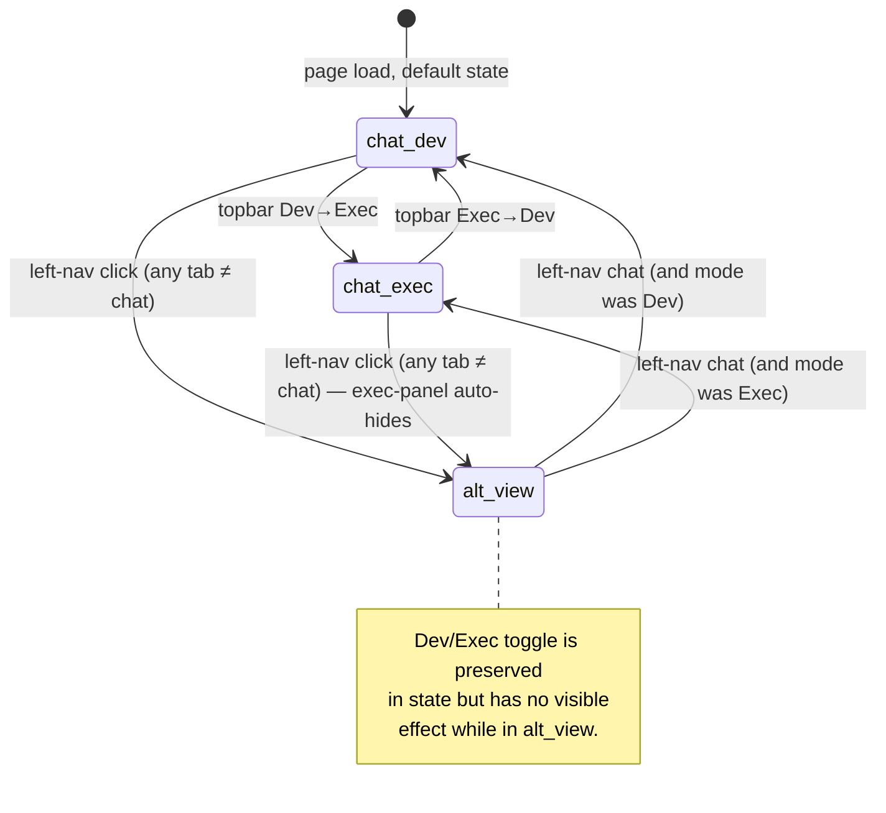

# Tinker UI panel system

This file owns one fact: **for any given UI state, which DOM regions are visible, and which are hidden**. It is the contract every panel renderer and every event handler in `tinker-ui/src/` must satisfy. The verify blocks above turn the contract into merge-gate invariants — change the layout, change this doc, change the code, all three.

## Surface inventory

The Tinker UI is a single-page HTML app. The DOM has a small set of named regions, each with one purpose. Every panel lives in exactly one region.

```
┌────────────────────────────────────────────────────────────────────┐
│ topbar                                  (always present, mode-aware)│
├──┬─────────────────────────────────┬───────────────────────────────┤
│  │                                 │ right-panels                  │
│  │ chat-area                       │   ├─ prefrontal               │
│ L│   (messages, input)             │   ├─ sessions                 │
│ E│                                 │   ├─ budget                   │
│ F│                                 │                               │
│ T├─────────────────────────────────┤                               │
│ N│ ctx-timeline                    │                               │
│ A│   (compaction/turn anatomy)     │                               │
│ V├─────────────────────────────────┴───────────────────────────────┤
│  │ bottom-right                                                    │
│  │   (status, scope chips, version)                                │
└──┴─────────────────────────────────────────────────────────────────┘
```

Plus two **overlays** that can sit ON TOP of the layout:

- **alt-view** — full-pane replacement for the chat-mode layout. Mounted at the same place as `chat-area` + `right-panels` + `ctx-timeline` + `bottom-right`, but covers them. Activated by any left-nav tab other than `chat`.
- **exec-panel** — persistent left-edge HUD (FORK 2026-05-12 control-panel plugin). Three sections: graphs / 7-day calendar strip / live task board. Mounted directly under `app`, NOT inside `.right-panels`. Controlled by the **Dev↔Exec** toggle in the topbar — orthogonal to tab nav.

## Two orthogonal state axes

The UI surface is the cartesian product of two axes, **not** a flat tab list.

### Axis A — left-nav tab (13 values)

One of `chat`, `overview`, `channels`, `sessions`, `usage`, `cron`, `agents`, `skills`, `nodes`, `config`, `debug`, `logs`, `recipes`. Default: `chat`. Persists to `localStorage[tinker-active-tab]`.

| `tab`      | What it shows                                                                                                |
| ---------- | ------------------------------------------------------------------------------------------------------------ |
| `chat`     | Default chat layout: chat-area + right-panels + ctx-timeline + bottom-right are visible; alt-view is hidden. |
| `overview` | alt-view: high-level dashboard.                                                                              |
| `channels` | alt-view: WhatsApp / Discord / Slack / etc. channel state.                                                   |
| `sessions` | alt-view: list of all sessions across agents.                                                                |
| `usage`    | alt-view: per-provider usage / cost graphs.                                                                  |
| `cron`     | alt-view: cron job inventory + last-status.                                                                  |
| `agents`   | alt-view: agents config + auth profiles.                                                                     |
| `skills`   | alt-view: skill / kit catalog (see `recipes`; partially overlapping today, will converge).                   |
| `nodes`    | alt-view: prefrontal node tree across subagents.                                                             |
| `config`   | alt-view: openclaw.json viewer + dotfiles.                                                                   |
| `debug`    | alt-view: gateway debug snapshots, run-state diagnostics.                                                    |
| `logs`     | alt-view: rolling gateway logs.                                                                              |
| `recipes`  | alt-view: kit / recipe library — browseable, searchable, source-aware (ours + downloaded from Journey).      |

### Axis B — Dev↔Exec mode (2 values)

A persistent topbar toggle, default `Dev`. Drives `<html>` or `<body>` class. Independent of tab nav. Persists to `localStorage[tinker-mode]`.

| Mode | exec-panel visibility | Effect on the rest of the UI                                                                                 |
| ---- | --------------------- | ------------------------------------------------------------------------------------------------------------ |
| Dev  | hidden                | The plain chat-mode or alt-view-mode layout described above.                                                 |
| Exec | visible               | exec-panel slides in on the left edge over the chat-area's left margin; the rest stays as defined by Axis A. |

The two axes are **truly orthogonal**: Dev/Exec mode does not affect which tab is active, and tab switches do not affect Dev/Exec.

## Visibility matrix

The matrix below is the COMPLETE contract. Every panel maps `(tab, mode) → visible?`. Any other behavior is a bug.

| Panel        | `chat`+Dev | `chat`+Exec | `tab≠chat`+Dev | `tab≠chat`+Exec |
| ------------ | :--------: | :---------: | :------------: | :-------------: |
| topbar       |     ✓      |      ✓      |       ✓        |        ✓        |
| left-nav     |     ✓      |      ✓      |       ✓        |        ✓        |
| chat-area    |     ✓      |      ✓      |       ✗        |        ✗        |
| ctx-timeline |     ✓      |      ✓      |       ✗        |        ✗        |
| right-panels |     ✓      |      ✓      |       ✗        |        ✗        |
| bottom-right |     ✓      |      ✓      |       ✗        |        ✗        |
| alt-view     |     ✗      |      ✗      |       ✓        |        ✓        |
| exec-panel   |     ✗      |      ✓      |       ✗        |        ✓        |

### Why exec-panel hides when `tab ≠ chat`

The user-mental-model rule, decided 2026-05-14: **only the chat layout is "Exec-aware"**. When the user navigates to a full-pane view (sessions, agents, logs, recipes, …) they want the WHOLE pane — no HUD slicing off the left edge. Dev/Exec is a chat-layout concept; navigating away from chat-mode is implicitly a "Dev" act regardless of the toggle's last value. The toggle's state is preserved; it just doesn't render the exec-panel until the user returns to `chat`.

This rule was added to fix the bug "Control Panel wrongly still visible when I click Sessions/Config/etc." — the exec-panel had no hide-branch in `switchTab()` and persisted on top of alt-view.

## Mutual-exclusion rules

- **chat-area XOR alt-view.** Exactly one of these is visible at any time. The transition is `switchTab(tab)`: `tab==="chat"` → chat-area on, alt-view off; otherwise the inverse.
- **right-panels and bottom-right follow chat-area.** They are children-in-spirit of chat-mode and inherit its visibility. (They are _not_ DOM children — the layout is a CSS grid — but they MUST hide and show together with chat-area.)
- **exec-panel implies tab=chat.** If the exec-panel is visible, `tab` must be `chat`. The reverse is NOT true (chat + Dev still hides the exec-panel).
- **Sub-panels inside right-panels are always all-visible together.** When right-panels is on, all of {prefrontal, sessions, budget} render. Individual sub-panels do not toggle on/off independently — they manage their own internal "empty state" placeholders.

## The prefrontal sub-panel is "always active"

FORK 2026-05-14: the prefrontal panel inside right-panels MUST always render content when right-panels is visible. There is no "panel is empty" mode. Three render levels, in priority order:

1. **Explicit plan** — `currentPlan` (from `prefrontal-plan-state` WS event) with `status: in_progress`. Render the full checklist.
2. **Implicit 2-step plan** — when no explicit plan but `tree.active === true` (an LLM run is alive). Render a synthetic 2-step plan: `▶ Thinking` while the run's phase is `thinking` / `reflecting`; `▶ Doing` once a tool call or text delta has fired. The two steps share the run's `runId` and `model`. Status transitions automatically: thinking ✓ when first tool/text fires; doing ✓ when the run reaches `state: final`.
3. **Idle** — no plan AND no active run. Show `○ Idle — waiting for the next turn` plus the last completed turn's summary if available. This is the only "nothing's happening" state, and it explicitly says so rather than rendering blank.

The implicit and idle states are derived from the same data the call-tree block already consumes — no new WS event needed. They use the same `.pf-plan` CSS family (with an additional `.pf-plan-synthetic` class for visual distinction).

The "no active recipe" placeholder text used until 2026-05-14 is REMOVED — it conflicts with this contract. The recipe header collapses into the plan header now (recipe = source kit; plan = live instance).

## Event-driven transitions



The single function authoritative for ALL these transitions is `switchTab(tab)` in `tinker-ui/src/app.ts`. Any other place that toggles visibility on chat-area / alt-view / exec-panel is a bug.

## Verify (the merge gate)

The frontmatter's `verify:` block already enforces three of these:

1. Every `data-tab` attribute in `app.ts` is listed in the tab matrix above.
2. `switchTab` (or a sibling function it calls) contains a branch that hides `exec-panel` when `tab !== "chat"`. The specific code shape doesn't matter — only that some such branch exists in `tinker-ui/src/app.ts`.
3. The prefrontal panel render is wired (no conditional return that would render NOTHING when right-panels is visible).

Future invariants worth adding (defer until first regression):

- `localStorage[tinker-active-tab]` and `localStorage[tinker-mode]` are read at page-load and applied via `switchTab` exactly once.
- `prefrontal.plan.get` returning `null` does NOT crash the panel — the implicit 2-step or idle render takes over.

## How to evolve this doc

1. **Add a new tab** → append a row to the Axis A table AND add a column to the visibility matrix (or, more practically, add a note "renders alt-view" to keep the matrix tight). The first verify will fail until the matrix has it.
2. **Add a new overlay** (a third axis or another full-pane state) → add an axis section + extend the matrix. Make the contract explicit; don't smuggle it into app.ts as ad-hoc display toggles.
3. **Change Dev/Exec semantics** → update the orthogonality rule and the matrix. The "exec-panel implies tab=chat" rule is load-bearing; if you change it, audit every caller of `switchTab` and update.

## Cross-file responsibilities

- `tinker-ui.md` — visual language of each panel's content (chips, fonts, colors, animations). Does NOT redefine which panels are visible when.
- `flows.md` — event flows that update panel data (e.g. F-PLAN-RESUME drives the prefrontal panel). Does NOT define visibility.
- `topology.md` — which process owns the renderer. Does NOT define layout.
- `panels.md` — **this file** — spatial + visibility contract.
