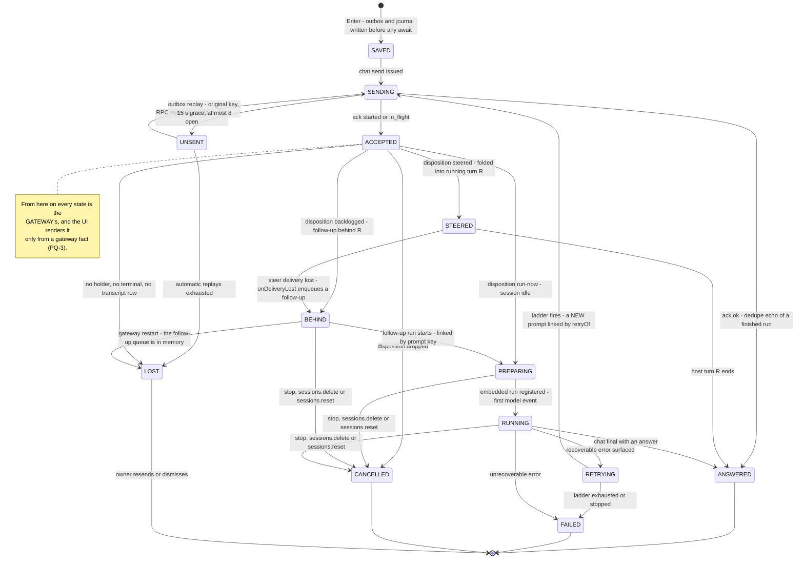

# Prompt queue — pending, queued, retrying and lost prompts

> The owner, 2026-09-24: _"We have two mechanisms for displaying queued prompts, one that just says queued (mostly working), and another that says something like 'will retry later' in orange, which was patched on top of the old mechanism erroneously I believe, although it might have been trying to fix some bugs from the first mechanism. … Remember that the right procedure is to create a document in the bible about this particular mechanism, and then code it. The design principles are important to leave behind."_

This optic is that document. It was written before the code on purpose. The next wave implemented §6 by following §7 (landed 2026-09-24/25; §7 records the deviations and §11 what is still open), and the PQ principles in §5 are the review checklist for that wave and for every later change in this area.

---

## 0. The answer in one screen

- **Update 2026-09-25: the whole plan landed (§7), so the bullets after the next one are the design-time record.** The gateway now REPORTS what it did with each prompt (G2, `disposition`), links a follow-up run to every prompt it answers (G3, on its own `followup` stream), ends every pending turn with exactly one terminal on delete, on reset and on a typed or agent-method `/new` (G1 and its follow-ups), announces what its run-set sweep drops (G4), serves each session's pending prompts on `sessions.list`, including the span before the reply pipeline places a prompt (G5 and the holder-C mark), and names the reply phase on the stuck-session line (G6). The UI keys every terminal to the prompt it names (U3), derives LOST and offers Resend and Dismiss on the prompt (U4), sends retry-ladder fires through the outbox (U5), and keeps the pre-model glow while a fresh report says `preparing` (U6). What is still open is §11.
- **U2 (2026-09-24) made it ONE badge.** Every user bubble carries one `_promptState` holding its facts: transport, outbox attempts and deferral, and since U3/U4 also the gateway's disposition, its pending phase and the prompt's own terminal. Its badge, tone and border come from prompt-state.ts's §6.1 table through msg-order.ts `promptBubbleMarks`, and base.css keys them by tone. The grey `QUEUED` word and both amber outbox badges are retired. A deferred prompt the gateway acked is ACCEPTED (trailing, no badge, not dimmed) only until the gateway says more: its disposition `final` makes it STEERED or BEHIND, and a `pendingPrompts` report re-derives that after a reload. The bullets below record the tree BEFORE U2, and why it had to change.
- **There are three indicators today, not two, and two of them share one badge slot.** Grey dashed **`QUEUED`** is the client deferral (M-A). Amber **`NOT DELIVERED · WILL RETRY`** / **`ACCEPTED · NOT IN HISTORY`** is the durable outbox (M-B). The centered orange pulsing **`retry n/6, retrying in …`** is the recoverable-error ladder (M-C). The owner's "will retry, in orange" matches M-B's text and M-C's colour. Both are covered below.
- **M-B really was patched on top of M-A.** The render code says so: _"the undelivered state reuses these two slots"_ (`tinker-ui/src/app.ts:15813-15824`). Its precedence lets `queued` hide `not delivered` (C1). M-B was NOT an attempt to fix M-A's bugs. It fixes a different fault: typed prompts that were lost on a page reload, on a gateway restart, or when `loadChat` wiped the page (2026-08-16 onwards). The **store** is sound and must stay. The **second display lane** is the erroneous part.
- **The two mechanisms collided exactly where the owner saw it.** The lingering amber boxes were mostly prompts typed WHILE a turn ran, which is M-A's territory. Those prompts landed on a transcript branch that the running turn then abandoned, so their outbox proof could never arrive (`527bdc90efb`: 65 of 464 prompt keys unprovable, measured live).
- **The "live in six places" finding is related.** Every pending indicator ends on a terminal event. Today the UI treats ANY terminal of a session as the end of EVERY pending prompt in it (C2). Meanwhile delete/reset of a turn that is still pending emit NO terminal at all (C10, C11). Fixing the display without fixing who owns "live" would just move the stuck indicator somewhere else.
- **Verdicts (all executed 2026-09-24/25, §7):** KEEP the deferral (placement), but stop it claiming "queued". KEEP the outbox store, and fold its two honest states into the one indicator as UNSENT and LOST. KEEP the retry ladder as the only RETRYING indicator, and route its re-send through the outbox. The gateway REPORTS each prompt's disposition, and the UI stops guessing it. delete/reset end every pending turn with exactly one terminal (§6.2).

---

## 1. One prompt, six facts

Every bug in this area confused two of these. Each has exactly one owner.

| #   | fact            | the question it answers                                                                                                  | owner                                                      | today                                                                                                                                                                                                                                                                           |
| --- | --------------- | ------------------------------------------------------------------------------------------------------------------------ | ---------------------------------------------------------- | ------------------------------------------------------------------------------------------------------------------------------------------------------------------------------------------------------------------------------------------------------------------------------- |
| F1  | **TEXT SAFE**   | would the typed text survive a reload / restart / crash?                                                                 | UI — outbox + append-only journal (localStorage)           | `enqueueOutbox` + `appendJournal` before the first `await` in `send()` (`app.ts:13205-13233`)                                                                                                                                                                                   |
| F2  | **TRANSPORT**   | does the gateway hold it?                                                                                                | UI — it alone sees the `chat.send` ack                     | `_promptState.transport` becomes `acked` on ack (since U2; before it, `_undelivered` was cleared there); `markAcked` parks the entry. Ack statuses `started`/`in_flight`/`ok`/`error` are documented at `app.ts:12623-12635`                                                    |
| F3  | **DISPOSITION** | what did the gateway do with it: run it now, fold it into the running turn, put it behind that turn, drop it, cancel it? | GATEWAY — `src/auto-reply/reply/agent-runner.ts:952-1061`  | **Reported since G2 + U3.** The early `final` carries `disposition`, recorded as a prompt fact (app.ts `onPromptDispositionFinal`), and `sessions.list` `pendingPrompts` re-derives it (G5). At design time it was not reported, and the UI guessed with its deferral predicate |
| F4  | **PROGRESS**    | how far is its turn: preparing (before the model), running, answered?                                                    | GATEWAY — reply-operation phase, run set, chat terminal    | pending pill + thinking indicator (done-signals.md). Since G5 also `pendingPrompts` (`preparing`, `running`), which U6 reads to keep the pre-model glow                                                                                                                         |
| F5  | **RETRY**       | is a failed turn being retried automatically?                                                                            | UI — `retry-lifecycle.ts` + `retry-policy.ts`              | orange countdown bubble. Since U5 each ladder fire is its own outbox entry, linked by `retryOf`                                                                                                                                                                                 |
| F6  | **PROOF**       | is it in the transcript?                                                                                                 | GATEWAY transcript (keyed user row), read by the UI outbox | `reconcileWithHistory` (`outbox.ts:494`)                                                                                                                                                                                                                                        |

**Deferral is not a seventh fact. It is a placement choice.** While F3/F4 say "behind" or "folded in", the bubble is drawn trailing, so the running turn's later bubbles cannot land under it (bug U5, 2026-06-04; bug C, 2026-06-19). lifecycles.md L-PROMPT owns the rule that deferral never gates `chat.send`.

**Gateway queue configuration** (the live `openclaw.json`, read 2026-09-24): `messages.queue.mode = "interrupt"`, `messages.queue.byChannel.webchat = "steer-backlog"`. So for a Tinker prompt typed during a live turn, the gateway first tries to **steer** it into that turn (tool-loop.md "In-flight steer"). It **backlogs** the prompt as a follow-up turn only when the steer cannot land. config-shape.md does not document these keys yet (see §7, bible duties).

---

## 2. The lifecycle (target), with one owner and one indicator per state

**As built (2026-09-25).** The table's "held in" column is as built. CANCELLED is held by the prompt's own `aborted` (recorded on the bubble) and by `cancelledAt` on its outbox entry. Three edges have no event of their own. `BEHIND → CANCELLED` on a Stop is not produced yet: a Stop drops the backlog with no terminal, and the UI derives LOST instead (§11 O5). `ACCEPTED → CANCELLED` on `dropped`: the gateway reports `dropped` only for an active session's heartbeat, and chat.send never sends one, so no Tinker prompt takes this edge. A `final` that did carry `dropped` would take the UI's session-wide path (queued-sends.ts `PlacementDisposition` leaves it out on purpose). `BEHIND → LOST` on a restart has no event by construction: the follow-up queue lives in memory, so the UI DERIVES LOST once a `sessions.list` row asked for after the ack no longer names the key (U4, PQ-5). The badge half of the indicator column is built for every state. The pill half of PREPARING (the gateway's phase label and elapsed time) is not (§11 O6).

| state         | the ONE owner                                  | held in (as built, last_verified_commit)                                                                                                                            | the ONE indicator (target, §6.1)                             | left by                                        |
| ------------- | ---------------------------------------------- | ------------------------------------------------------------------------------------------------------------------------------------------------------------------- | ------------------------------------------------------------ | ---------------------------------------------- |
| **SAVED**     | UI                                             | outbox entry + journal (`outbox.ts`)                                                                                                                                | none (it lasts microseconds)                                 | `chat.send` issued                             |
| **SENDING**   | UI                                             | `sending` latch + pre-model window (`pre-model-window.ts`)                                                                                                          | pending pill "sending"                                       | ack / reject                                   |
| **UNSENT**    | UI                                             | outbox entry without `ackedAt`                                                                                                                                      | amber badge "not sent · retrying"                            | ack, or exhaustion → LOST                      |
| **ACCEPTED**  | gateway                                        | chat abort controller (holder C, §4) and its accepted mark (`session-utils.ts` `trackAcceptedChatSend`), which `pendingPrompts` reports as `preparing`              | pending pill "preparing context"                             | disposition                                    |
| **BEHIND**    | gateway                                        | follow-up queue (`enqueueFollowupRun`), one `pendingPrompts` entry per key an item carries (`resolveFollowupRunPromptKeys`)                                         | grey badge "waiting for the current turn", trailing          | linked follow-up run starts / cancel / restart |
| **STEERED**   | gateway                                        | steer buffer → the live worker's stdin; the key is RECORDED on the host turn's reply operation (`recordSteeredReplyPrompt`), which lives exactly as long as STEERED | grey badge "added to the current turn"                       | host turn's terminal                           |
| **PREPARING** | gateway                                        | reply operation, created with the turn's `promptKeys`, in `queued → preflight_compacting → memory_flushing` + run set                                               | pending pill with the gateway's phase label + elapsed time   | first model event                              |
| **RUNNING**   | gateway                                        | the same reply operation in `running`, with a run-set entry active since it began (holder B) + embedded run (holder E)                                              | thinking indicator                                           | chat terminal                                  |
| **RETRYING**  | UI                                             | `retryState`, and each ladder fire's own outbox entry (U5)                                                                                                          | orange countdown bubble under the failed answer, with Stop   | ladder fires / exhausted / stopped / success   |
| **ANSWERED**  | gateway                                        | transcript                                                                                                                                                          | none                                                         | —                                              |
| **FAILED**    | gateway (UI for ladder exhaustion)             | transcript error row / persisted error bubble                                                                                                                       | red bubble                                                   | —                                              |
| **CANCELLED** | gateway                                        | —                                                                                                                                                                   | static grey tag "stopped · not answered"                     | — (history)                                    |
| **LOST**      | UI, DERIVED from the gateway snapshot + outbox | outbox entry that no gateway holder has and no transcript row proves (prompt-state.ts `gatewayHolderFacts`)                                                         | amber badge "not in history" + **Resend** / **Dismiss** / 🐛 | the owner's action                             |

**A steered prompt's transcript row, written once (2026-10-05).** Which writer records a STEERED prompt depends on where it lands. Through the claude-cli stdin (`inflight-steer`), or into the codex harness, nothing else writes a row, so the delivery callback writes one keyed by `followupRun.messageId`. Into a pi-native run (`next-round`), pi persists the row itself when it injects the steer at the next turn boundary. That row used to carry no key, and the callback's keyed copy, written under chat.send's marker, was stranded by the running turn's next append: the reader served both (bug-log `steer-written-twice`). Now the run's handle steers a message that carries the buffer's last key (`run/steer-message.ts`) and says it persists the row (`persistsSteeredPrompt`), and the callback, told `persistedByRun`, writes nothing. A slash command keeps pi's own steer, which expands it, and keeps the callback's row. A steer pi never injects (the run ends before the next boundary) now has no row and shows LOST with Resend, where the callback's row used to claim a delivery the model never saw.

---

## 3. Today's mechanisms, mapped onto the lifecycle

### 3.1 M-A — grey `QUEUED` (the client deferral)

- **What it shows.** A dimmed (opacity 0.45), dashed, trailing bubble with a small grey `QUEUED` badge (`tinker-ui/src/styles/base.css:4314-4332`), drawn from `queuedRows` (`app.ts:17117`).
- **What triggers it.** `sendWouldDefer()` (`app.ts:3889`) → `shouldQueue()` (`queued-sends.ts:72`). It fires on a fresh client run (`RUN_STALE_MS` = 90 s), a live stream writer, or the `sending` latch. The entry goes to `pendingQueuedSends` (`app.ts:1404`, pushed at `:13325`), tagged `_queued` + `_queuedSession` (`:13313`).
- **What ends it.** ANY `final | error | aborted` chat event for the session. For the viewed tab, `settleQueuedSession(…, true)` commits the entry into `messages[]` (`app.ts:8731-8742`). For a background tab, it is dropped and the history re-fetch shows it (`:8010-8021`).
- **The only fact it can honestly claim:** "this bubble is parked below the running turn" (lifecycles.md L-PROMPT). It holds no transport fact and no disposition fact, yet the word `queued` asserts one.
- **History.** `0bdb090c437` (2026-06-04, prompt drawn in the middle of the answer → trailing buffer). `1e54681814a` (06-08, per-session scope: stuck forever and shown in every tab). `14ecaccc42f` (06-19, bug C: flush after the answer is finalized). `00a5bdab0c5` (08-26, gate on a FRESH run: one ghost run swallowed every later prompt). `3ae43a96a6e` (08-28, the gate threw and the prompt vanished from the composer).
- **Verdict: KEEP the placement, REPLACE the claim.** The text comes from F3 (§6.1), and the release is keyed by prompt, not by session (C2, U3).
- **Since U2 (2026-09-24): the claim is replaced.** `_queued` is gone. The deferral is recorded as `_promptState.deferred`, a placement fact only (PQ-8), next to `_queuedSession`, which still scopes the bubble to its session and drives the settle. Nothing draws the word `queued` any more. A deferred, acked prompt derives ACCEPTED (trailing, no badge, not dimmed) until the gateway reports more.
- **Since U3 (2026-09-24): the release is keyed by prompt.** The prompt's disposition `final` makes it STEERED (committed in place, grey, not dimmed) or BEHIND (still trailing, grey, dimmed). That `final` releases only its own prompt (steered) or nothing (backlogged), and a linked follow-up run's start and terminal release exactly its keys (queued-sends.ts `chatTerminalScope`, `settleQueuedSession`). A terminal that names no prompt is still session-wide, which is the old-gateway rule (§6.3).

### 3.2 M-B — amber `NOT DELIVERED · WILL RETRY` / `ACCEPTED · NOT IN HISTORY` (the outbox)

- **What it shows.** An amber dashed border plus an amber badge (`base.css:4338-4355`). The copy depends on the entry: `not delivered · will retry` when it is unacked, `accepted · not in history` when it is acked and was re-injected from disk (`app.ts:15817-15824`).
- **What triggers it.** `_undelivered: true` is stamped on EVERY new bubble when it is created (`app.ts:13318`) and cleared on ack (`:13472`). `reinjectOutboxBubbles` (`:12906-12964`) redraws every unproven entry absent from both `messages[]` and `pendingQueuedSends`. It runs on load, in `loadChat`, and every 5 s (`:7152-7153`). The 20 s tick (`:7130`) replays an unacked entry after a 15 s grace, at most `OUTBOX_MAX_ATTEMPTS` = 8 times, with its ORIGINAL key. It always reads `chat.history` first (`flushOutbox`, `:12778`).
- **Why it exists — not M-A's bugs.** It exists because prompts were LOST. `85beff1d5c7` + `e517e86b600` (2026-08-16): an HMR reload inside `send()`'s first `await`, a gateway restart rejecting in-flight sends, and `loadChat` replacing the page each destroyed the only copy. `c57160a04c7`: an OLD identical prompt "confirmed" a new one. `65ba434b5c9` (09-04): a replay's ack deleted the last copy. `5bbce51c022` (09-08): proof by served key, never by text. `527bdc90efb` (09-23): stranded-branch rows and superseded keys, and the acked copy stopped claiming "will retry".
- **How it was stacked on M-A.** It reuses M-A's two render slots (`app.ts:15813-15816`), and `_queued` wins the precedence (C1).
- **Where the two collided.** `921cd9cf467` / `54b89479dea` (2026-08-28): every deferred prompt was painted twice, grey and amber, because the backstop looked only in `messages[]`. `527bdc90efb` (2026-09-23, measured live over the 40 newest transcripts): 65 of 464 prompt keys could never be proven, so their amber boxes lingered. A prompt appended while a turn was running forked onto a branch that `getBranch()` never serves. Recovered: 14 by serving stranded rows and 38 by honouring `supersededIdempotencyKeys`. The remaining 13 have no persisted user row at all. bug-log.md 2026-09-23 records one more cause: a session's FIRST prompt can never be proven. Since 2026-10-01 (`f81c15e456d`) the embedded runner writes that prompt's marker itself, just before the prompt, so it is keyed in pi's first flush; a prompt queued behind a cold first turn and claude-cli runs still are not (bug-log `[chat-divergence]`).
- **Verdict: KEEP the store (PQ-9), REMOVE the second lane.** Its two honest states become UNSENT and LOST of the one indicator, and its false copy goes (C7).
- **Since U2 (2026-09-24): the second lane is removed.** `_undelivered` and `_undeliveredAcked` are gone. A new bubble starts as `{ transport: "in-flight" }`. The ack records `acked` (ACCEPTED, no badge). A rejected send records `rejected` (UNSENT: amber, dashed, `not sent · retrying`). Each replay records its attempt count, and at `OUTBOX_MAX_ATTEMPTS` the bubble derives LOST (amber, solid, `not in history`), so the page no longer promises a retry that `dueForReplay` will not make (the badge half of C7). A replay's ack records `acked` too, so a re-sent prompt stops warning as soon as the gateway holds it. `reinjectOutboxBubbles` draws an unacked entry as UNSENT or LOST and an acked, unproven one as LOST (`outboxPromptFacts`). A keyed transcript proof records `PROVEN_PROMPT_FACTS`. `isClientOnlyBubble` now derives "only this browser holds it" from the same facts (`isBrowserOnlyPrompt`). **Known limit until G5 and U4 (closed 2026-09-24/25):** an acked prompt that is still BEHIND a running turn across a reload has no transcript row yet either, so it was re-drawn as LOST. Since U4 the re-draw spreads the gateway's evidence over those facts (`reinjectOutboxBubbles` → prompt-state.ts `gatewayHolderFacts`): a key the `pendingPrompts` report names, or whose linked follow-up run has started, is drawn in that phase, and LOST carries Resend and Dismiss. A stopped prompt is re-drawn CANCELLED from its `cancelledAt` stamp (`6186bbdaf5a`).

### 3.3 M-C — orange `retry n/6, retrying in …` (the recoverable-error ladder)

- **What it shows.** A centered, pulsing orange bubble: `⚠️ {label} — retry n/6, retrying in {wait}… stop retrying` (`app.ts:16059`, `:16326`; `base.css:1221-1260`). At exhaustion it turns red: `🛑 Gave up after 6 retries`.
- **What triggers it.** A surfaced recoverable error, or a `final` whose whole body is a recoverable provider error (`retry-lifecycle.ts:111-165`). It is scheduled per session (`scheduleRetry`, `app.ts:5243`; `advanceRetryLifecycle`, `:5405`).
- **What it sends.** `retryLastTurn` (`app.ts:5314`) → `chat.send` with a FRESH `uuid()` key (`:5342-5348`), the RAW text, and NO outbox entry (C8).
- **History.** tinker-ui.md §5.8j (`6d9320d97e`, `c618805fcd`, …). `ad39f57a551` (per session; cancelled by `/clear`). `62c93ee4a85` (a 529 that read as an answer).
- **Verdict: KEEP it as the only RETRYING indicator.** Its re-send becomes a new, protected, linked prompt (U5).
- **Since U5 (2026-09-24): the re-send is protected.** `retryLastTurn` writes each fire as a NEW outbox entry before its first await (outbox.ts `enqueueLadderRetry`: a fresh key, `retryOf` the prompt the owner typed, refusing the original's key), draws it as its own user bubble, and sends it through `resendOutboxEntry`, the one outbox send path, which applies the injection and pins `send()` applies. A transport failure leaves the fire UNSENT for the outbox's own replay. The countdown renders through the §6.1 RETRYING row. Known limit: Stop retrying and `/clear` end the ladder, not a fire already UNSENT (§11 O8).

### 3.4 Already retired — do not resurrect

- **The server-side "queued" attachment row** was removed 2026-08-28 (`src/sessions/session-attachments.ts:151-169`) after the owner's _"there are two redundant mechanisms to either track or visualize how a prompt is being queued"_. Its "Clear" button ran a session-wide `chat.abort`, which would have killed the IN-FLIGHT turn.
- **The §5.49 gateway-drain auto-resend.** Its copy ("your message will be resent automatically") has zero hits in `app.ts`, and §5.8j absorbed the behaviour. tinker-ui.md §5.49 still reads `DEPLOYED`, which is stale.

### 3.5 Contradictions found (each violates a principle in §5)

| id  | contradiction                                                                                                                                                                                                                                                                                                                                                                                                                                                                                                                                              | evidence                                                                                                                                                                                                                     | breaks       | fixed by   |
| --- | ---------------------------------------------------------------------------------------------------------------------------------------------------------------------------------------------------------------------------------------------------------------------------------------------------------------------------------------------------------------------------------------------------------------------------------------------------------------------------------------------------------------------------------------------------------- | ---------------------------------------------------------------------------------------------------------------------------------------------------------------------------------------------------------------------------- | ------------ | ---------- |
| C1  | The badge precedence hides UNSENT behind QUEUED. Suppose a deferred prompt's `chat.send` was rejected: the gateway never got it, yet the bubble reads `queued`.                                                                                                                                                                                                                                                                                                                                                                                            | `app.ts:15817-15824`; `_queued` and `_undelivered` are both stamped at creation (`:13313`, `:13318`)                                                                                                                         | PQ-2, PQ-4   | U1, U2     |
| C2  | A SESSION-level terminal ends PROMPT-level state. When a prompt is steered or backlogged, its own `chat.send` finishes without starting a run and broadcasts a `final` for its key right away. The UI treats that as the session's terminal, and it does three things while the host turn is still running: it settles every deferred bubble of the session; it stamps `sessionEndedAt`, which vetoes the server's `run.live` until the next delta; and it closes the host turn's timing block. **Read from code only, not reproduced live — UNVERIFIED.** | gateway `chat.ts:3116-3127` (`agentRunStarted`), `:3151-3313` (`!agentRunStarted` → `broadcastChatFinal`); `agent-runner.ts:1023-1029`, `:1044-1060` return without a run. UI `app.ts:7894-7901`, `:8010-8021`, `:8731-8742` | PQ-7         | G2, U3     |
| C3  | A backlogged prompt cannot be linked to its own run. The follow-up run mints a fresh `runId`, and no event carries the prompt's key, so the UI cannot show "now running" for it.                                                                                                                                                                                                                                                                                                                                                                           | `src/auto-reply/reply/followup-runner.ts:162`                                                                                                                                                                                | PQ-1         | G3         |
| C4  | Stranded-queue detection is dead code. `strandedQueuedEntries` is exported and tested but has zero call sites in `app.ts`. lifecycles.md L-PROMPT's edge `stranded → surfaced to the user` is therefore not implemented. A queued bubble behind a run that died unobserved waits for a terminal that never comes.                                                                                                                                                                                                                                          | `queued-sends.ts:174`; grep of `app.ts`                                                                                                                                                                                      | PQ-5         | U4         |
| C5  | Dead un-queue loops. Two loops strip `_queued` from `messages[]`, where no deferred entry has lived since 2026-06-04. tinker-ui.md §5.27 still documents "Un-queued on delta/final when LLM absorbs via steer".                                                                                                                                                                                                                                                                                                                                            | `app.ts:8103-8108`, `:8349-8354`                                                                                                                                                                                             | comment/code | U6         |
| C6  | `markPromptDelivered`'s docstring says delivery is proven when "chat.send resolved". That has been false since 2026-08-24 (ACK IS NOT DURABILITY). Its only caller is the transcript reconcile.                                                                                                                                                                                                                                                                                                                                                            | `app.ts:12601-12602`; the only call is at `:12896`                                                                                                                                                                           | comment/code | U6         |
| C7  | A promised manual retry does not exist. `outbox.ts` says exhausted and acked entries stay visible "with a manual retry", but no handler exists. An exhausted, unacked entry still reads `not delivered · will retry` although `dueForReplay` will never pick it again.                                                                                                                                                                                                                                                                                     | `outbox.ts:43-46`, `:75-79`, `:599-619`; grep of `app.ts` for any outbox click handler                                                                                                                                       | PQ-4, PQ-12  | U1, U4     |
| C8  | The retry ladder's re-send is unprotected. It creates no outbox entry, so a reload during a ladder step loses it and nothing proves it. It also sends the raw text without the injection `send()` applies.                                                                                                                                                                                                                                                                                                                                                 | `app.ts:5342-5348` vs `:13277`, `:13395`                                                                                                                                                                                     | PQ-9         | U5         |
| C9  | The pre-model bounds are shorter than measured waits. The UI stops believing the pre-model window after 120 s. The run-set sweep drops a context after 30 min of silence and broadcasts nothing, and a turn waiting before the model emits no events. Waits of 21–49 min were measured live on 2026-09-23. Whether those turns still held a run-set entry at minute 30 is **UNVERIFIED**.                                                                                                                                                                  | `pre-model-window.ts:31`; `src/infra/agent-events.ts:248-264`; bug-log.md 2026-09-23                                                                                                                                         | PQ-5, PQ-10  | G4, U6     |
| C10 | delete/reset leave a pending turn alive and silent (§4).                                                                                                                                                                                                                                                                                                                                                                                                                                                                                                   | `src/gateway/session-reset-service.ts:196-247`                                                                                                                                                                               | PQ-6         | G1         |
| C11 | Backlogged prompts vanish silently. delete/reset clear the follow-up queue and only COUNT what they dropped. A restart loses the queue, because it is held in memory (bug-log FOLLOW-UP 2026-07-22).                                                                                                                                                                                                                                                                                                                                                       | `src/auto-reply/reply/queue/cleanup.ts:52-73`                                                                                                                                                                                | PQ-6         | G1, G5, U4 |
| C12 | tinker-ui.md §5.8j says `retryAfter` is "intentionally omitted". That has been false since 2026-09-07: `broadcastChatError` fills it in.                                                                                                                                                                                                                                                                                                                                                                                                                   | `src/gateway/server-methods/chat.ts:2097-2109`                                                                                                                                                                               | stale optic  | bible duty |

**Status of these rows, 2026-09-25.** The table describes the design-time tree `3e60ec36dd4`. At `last_verified_commit` every row but C12 is fixed, most by more than one commit:

- **C1 FIXED by U2** (`2cc105eaf1d`). One derived state, one badge: the amber fact can no longer hide behind `queued`.
- **C2 FIXED by G2 + U3** (`06985ead65b`, `7a86de80b48`). The UI classifies each terminal once (queued-sends.ts `chatTerminalScope`). A `final` with a `steered` or `backlogged` disposition goes to app.ts `onPromptDispositionFinal` and returns before any session effect. A linked follow-up run's terminal keeps every session effect and narrows only the release to its keys. Still session-wide by design: a terminal that names no prompt, which includes an enqueue the gateway refused without reporting why (§11 O4). The row's UNVERIFIED note stands: C2 was fixed without ever being reproduced live, and U3's tests drive the branch directly.
- **C3 FIXED by G3** (`03596317446`; every coalesced key `7989149571e`). The follow-up run keeps a fresh runId (§6.4) and names its prompt keys on its `followup` start event, before the model. U3 consumes it (`onFollowupRunStart`).
- **C4 FIXED by U4** (`5c4118d6eb5`). app.ts `strandedPromptIds` calls `strandedQueuedEntries`, and the verdict is one input of `gatewayHolderFacts`. Since `0e7c3842d4d` it backs LOST only for a row with no `pendingPrompts` report (§7 U4).
- **C5 FIXED by U6** (`11612a6e9ec`; the last no-op `_queued` strip `72b407b5b3d`).
- **C6 FIXED by U6** (`96fb55cbbe3`). The docstring names the transcript reconcile, not "chat.send resolved".
- **C7 FIXED by U2 + U4 + U6.** An exhausted entry reads LOST `not in history`, never `will retry` (U2). Resend and Dismiss exist, drawn only for LOST (U4). outbox.ts no longer promises a manual retry (U6, `96fb55cbbe3`).
- **C8 FIXED by U5** (`eac696e809b`, §3.3).
- **C9 FIXED by G4 + U6** (`2010c1f492b`, `a31fe9411d9`, `ba0db7c4655`). The sweep keeps a context its reply operation or chat controller still owns, and announces what it drops. The glow outlives 120 s while a fresh report says `preparing`. The pill's phase label is still open (§11 O6).
- **C10 FIXED by G1** (`3b0ef8e7b5e`, `endSessionTurns`), and on every reset path by its follow-ups: the `agent` method's `/new` and `/reset` (`592958b30d9`) and a `/new` or `/reset` typed in chat (`ae8261ea05d`, `b5dbfc9d573`). **D2 FIXED by G1** (the completion path guards on `chatAbortedRuns`).
- **C11 delete/reset half FIXED by G1; restart half SURFACED by G5 + U4.** Each dropped backlog item gets its own `aborted` (but only under its `messageId`, §11 O3). A restart still loses the in-memory queue and sends nothing. The UI derives LOST once a row asked for after the ack no longer names the key, which is the PQ-5 fallback for "no end event can come", not a terminal. Two more drops still send no terminal, and the UI derives LOST for them the same way: a stale-session rollover's backlog (§11 O1) and prompts the queue cap drops (§11 O2).
- **C12 NOT FIXED.** It is a bible duty in tinker-ui.md §5.8j, still owed (§7).

The `verify:` block pins each fix as a positive gate, and every open gap with a clean code predicate (§11 O1, O3, O5, O12) as a gap pin (§9).

---

## 4. Who holds "live" today

Summary of the Task 15 investigation (bug-log.md 2026-09-23, "Investigated, NOT fixed"). Line numbers were re-checked on the design-time tree where cited. Six gateway holders and the UI's own lanes each say whether a session is working. Each has its own writers and sweepers. The table is the design-time finding, except that row C now names holder C's accepted mark. What the wave changed for each holder is listed under the table.

| #   | holder                                                                                                                                                                | set                                                                                           | cleared                                                                             | sweeper                                               | touched by delete/reset (design time)?                      |
| --- | --------------------------------------------------------------------------------------------------------------------------------------------------------------------- | --------------------------------------------------------------------------------------------- | ----------------------------------------------------------------------------------- | ----------------------------------------------------- | ----------------------------------------------------------- |
| A   | diagnostic session state (`src/logging/diagnostic-session-state.ts`)                                                                                                  | `dispatch-from-config.ts` `markProcessing`                                                    | `markIdle` when dispatch returns                                                    | idle entries only                                     | no                                                          |
| B   | **run set** `runContextById` (`src/infra/agent-events.ts:121-135`) → `sessions.list` `row.run`                                                                        | `agent-runner-execution.ts` BEFORE the model; the follow-up runner (`followup-runner.ts:171`) | `clearAgentRunContext` on lifecycle end/error                                       | `sweepStaleRunContexts` (`:248`): 30 min, **silent**  | no                                                          |
| C   | chat abort controllers (`src/gateway/chat-abort.ts:69`) **plus, since G5, the accepted mark** (`session-utils.ts` `trackAcceptedChatSend`, a named exception to §6.4) | `chat.send`                                                                                   | dispatch `.finally` (`chat.ts:3430-3433`); `abortChatRunById` (`chat-abort.ts:153`) | run timeout + grace                                   | no                                                          |
| D   | reply-operation registry (`src/auto-reply/reply/reply-run-registry.ts`)                                                                                               | `createReplyOperation` (`agent-runner.ts:1120`, `followup-runner.ts:155`)                     | complete / fail / `abortByUser` (`:373`)                                            | force-clear on the next begin                         | no                                                          |
| E   | embedded run registry (`src/agents/embedded-agent-runner/runs.ts`)                                                                                                    | `setActiveEmbeddedRun`, AFTER the lanes and the attempt prelude                               | `clearActiveEmbeddedRun`                                                            | none                                                  | **yes — the only one** (`session-reset-service.ts:227-228`) |
| F   | persisted `status:"running"` in `sessions.json`                                                                                                                       | lifecycle persistence                                                                         | lifecycle persistence; abort settle; boot recovery                                  | —                                                     | delete stamps `deletedAt`                                   |
| G   | UI lanes `activeRuns`, `backgroundRuns`, `preModelSince`                                                                                                              | lifecycle start, delta self-heal, `send()`                                                    | tier-1 chat terminal; debounced lifecycle end                                       | freshness bounds (`RUN_STALE_MS`, `PRE_MODEL_MAX_MS`) | via events only                                             |

**As built at `last_verified_commit`, per holder:**

- **A** is unchanged, and its stuck-session line now names the reply phase (G6). It goes idle by itself when dispatch returns (§6.2 step 7), so delete and reset still do not touch it.
- **B**, the run set, now also feeds `pendingPrompts`, read under the holder key (§6.3). Delete and reset clear it (`clearAgentRunContextsForSession`, G1 step 5, after the waits). The sweep (`sweepStaleRunContextsDetailed`) still drops a context after 30 min of silence, but it KEEPS one that its chat controller or its session's reply operation still owns (6 h ceiling), and it ANNOUNCES what it drops (G4).
- **C** is the controllers plus the accepted mark: set right after the ack, and released on placement (`onAgentRunStart`, `onPromptDisposition`), on the controller's abort, and when the dispatch settles or throws. Delete and reset end every controller of the session (G1 step 4). A typed reset spares its own run (`exceptRunIds`).
- **D**, the reply operation, now carries the turn's `promptKeys` and its STEERED record. Delete and reset abort it and wait up to 15 s (`waitForIdle`, G1 step 3). It ends with its turn: the runner that created it completes it in its `finally`, on every path (`agent-runner.ts` and `followup-runner.ts`). Until 2026-10-02 the main runner never ended it on success, so a finished turn stayed registered as `running`, the reset's abort (which clears only a `queued` one) left it there, and every reset after a turn answered "still active" until a gateway restart (bug-log `[reset-refused-after-a-turn]`). It clears the registry only while it still owns its key, so one that a newer operation replaced cannot delete the newer entry. A reset that gives up logs the key form, the phase before and after its abort, and the age (`[gateway/session-reset] … not ended`).
- **E** is unchanged. Delete and reset still end it (G1 step 6).
- **F** is unchanged.
- **G**: the chat terminal is keyed by U3. Past `PRE_MODEL_MAX_MS`, a fresh `preparing` report keeps the pre-model window open (U6).

**What delete/reset missed for a turn still before the model (design time; FIXED by G1, §6.2).** They do not abort the reply operation (D), so the turn keeps going and can run against a soft-deleted session whose transcript is being archived. They do not abort the chat controller (C), so the UI never gets a terminal for that runId. They do not clear the run set (B), so `run.live` stays true until the silent 30-minute sweep. Holder A stays `processing` until dispatch returns. `clearSessionQueues` removes nothing here: the session-lane wrapper is ACTIVE while it waits on the global lane (`src/agents/embedded-agent-runner/run.ts:364-366`). `abortEmbeddedPiRun` sees only registered runs.

**The three existing abort primitives and their traps:**

1. `chat.abort` → `settleSessionAfterAbort` is requester-authorized, so a delete issued from a page that does not own the run would newly FAIL. It also stamps `abortedLastRun`, which on reset reaches the next turn as a false _"The previous agent run was aborted by the user"_ (failures.md M10). And it writes abort partials into a transcript that is being archived.
2. `abortChatRunsForSessionKey` (`chat-abort.ts:187-206`) is not authorized and broadcasts `aborted` at once. But the dispatch's `.then` / `.catch` (`chat.ts:3149-3429`) never consult `chatAbortedRuns`, so a SECOND terminal for the same runId is possible (decision D2, §6.2).
3. `replyRunRegistry.abort(key)` stops the turn, but it tells the UI nothing.

G1 avoids trap 1 (it never calls `chat.abort`), closes trap 2 with the D2 guard, and pairs trap 3 with step 4's one `aborted` per runId. Step 4 is chat-abort.ts's `abortChatRunsForSessionKey` walk, inlined so that it can skip an excepted run (§6.2 "As built").

**Why this is the same problem as the queue display.** Every pending indicator is ended by a terminal. A holder that never emits one leaves its indicator alive (C10, C11). A terminal that is broadcast to the whole session ends indicators that belong to other prompts (C2). A UI bound on the pre-model window, or a silent server sweep, turns a slow prompt into one that looks idle (C9).

---

## 5. Design principles for pending prompts

Each principle is short, has a test, and names the defect that falsifies it. The contradictions in §3.5 are cited by id.

- **PQ-1 · ONE IDENTITY.** A prompt has one id from Enter to its terminal: `clientMsgId` = outbox id = bubble id = gateway `idempotencyKey`. Every gateway event about the prompt carries that id: disposition, follow-up run start, cancel. _Falsified by:_ any transition the UI can attribute only by session or by text (C3).
- **PQ-2 · ONE STATE, ONE INDICATOR.** At any instant a prompt is in exactly one §2 state, and exactly one surface shows that state (§6.1). _Falsified by:_ two badges on one bubble, one prompt drawn twice, or a badge and the pill both describing the same state (C1; `921cd9cf467`).
- **PQ-3 · ONE OWNER PER STATE.** SAVED, SENDING, UNSENT and RETRYING belong to the browser. Every state after the ack belongs to the gateway. The UI renders a post-ack state only from a gateway fact, never from its own run map. _Falsified by:_ a UI predicate choosing between BEHIND, STEERED and PREPARING.
- **PQ-4 · FOUR QUESTIONS AT A GLANCE.** Without hovering, the owner can tell whether a prompt is (a) waiting behind another turn, (b) waiting for the gateway, (c) being retried, or (d) lost and in need of him. Text and tone both differ. **Grey** means the gateway has it, so wait. **Orange, pulsing** means an automatic retry that you may stop. **Amber** means only your browser has it, or the gateway lost it. **Red** means it gave up. _Falsified by:_ two of the four sharing text or tone (C1, C7).
- **PQ-5 · NO INDICATOR OUTLIVES ITS STATE, AND NONE VANISHES SILENTLY.** The event that ends a state clears its indicator. When no such event can come (the holder is gone, the gateway restarted), the state is DERIVED as LOST from the gateway snapshot plus the outbox. A UI clock never times it out (done-signals.md R2), and it is never silently dropped. _Falsified by:_ an indicator still visible after its end event, or a pending prompt with no gateway holder that shows nothing (C4, C9).
- **PQ-6 · EXACTLY ONE TERMINAL PER PROMPT.** Every accepted prompt ends with exactly one of ANSWERED, FAILED, CANCELLED or LOST, and its owner announces it. That includes stop, `sessions.delete`, `sessions.reset` and restart. _Falsified by:_ zero or two tier-1 terminals for one runId or prompt key (C10, C11, D2).
- **PQ-7 · TERMINALS ARE KEYED.** A terminal ends only the prompt or run it names. It must not release, veto or close any other prompt's or run's state in the same session. _Falsified by:_ C2.
- **PQ-8 · DISPOSITION IS REPORTED, NOT GUESSED.** For each accepted prompt, the gateway reports run-now, steered, backlogged or dropped. The UI's deferral predicate chooses only the PLACEMENT while that report is outstanding. _Falsified by:_ "waiting" or "queued" shown for a prompt that the gateway ran at once or folded in.
- **PQ-9 · TEXT OUTLIVES EVERY INDICATOR.** Indicator logic never deletes text. An outbox entry retires in only two ways: keyed transcript proof, or the owner's explicit **Dismiss**, which is the one non-proof retirement and is recorded in the journal. An ack is not durability. _Falsified by:_ any `removeFromOutbox` reachable from neither of those (pinned in `verify:`).
- **PQ-10 · ONE OWNER OF "LIVE" PER SESSION.** In the gateway, the run set (`runContextById`) owns "this session is working". Every other holder is registered and cleared together with it, through ONE function per direction. _Falsified by:_ a path that clears one holder and leaves another set for the same turn (§4).
- **PQ-11 · STATE SURVIVES THE TAB.** A tab switch, reload or reconnect re-derives each pending prompt's state from the gateway snapshot plus the outbox, not from a latch saved in the page. _Falsified by:_ a badge that changes across a reload with no gateway event in between.
- **PQ-12 · ACTION WHERE THE PROBLEM IS.** A state that needs the owner (UNSENT when exhausted, LOST, RETRYING, FAILED) offers its action on the prompt itself: Resend, Dismiss or Stop retrying. No copy may promise work that no code will do. _Falsified by:_ "will retry" on an entry `dueForReplay` will never return (C7).

---

## 6. Target design

### 6.1 State → indicator

There is one badge slot per user bubble (top right, where `QUEUED` sits today). The pending pill shows only the viewed session's in-flight turn. The tab glow means only "session live", as done-signals.md defines it. Nothing else describes a pending prompt.

| state                         | badge on the prompt                              | tone and placement                                                | other surface                                                                                                                 | cleared by                        |
| ----------------------------- | ------------------------------------------------ | ----------------------------------------------------------------- | ----------------------------------------------------------------------------------------------------------------------------- | --------------------------------- |
| SAVED / SENDING               | —                                                | normal bubble                                                     | pill `sending`                                                                                                                | ack / reject                      |
| UNSENT (replaying)            | `not sent · retrying`                            | amber, dashed                                                     | —                                                                                                                             | ack → ACCEPTED; exhaustion → LOST |
| ACCEPTED (no disposition yet) | —                                                | normal; trailing if the deferral predicate said so                | pill `preparing context`                                                                                                      | disposition                       |
| BEHIND                        | `waiting for the current turn`                   | grey, dimmed, TRAILING (the deferral placement)                   | —                                                                                                                             | linked follow-up run starts       |
| STEERED                       | `added to the current turn`                      | grey, NOT dimmed, committed in place (it IS part of the turn now) | —                                                                                                                             | host turn's terminal              |
| PREPARING                     | —                                                | normal                                                            | pill: the gateway's phase label + elapsed time; past turn-latency.md's measured normal it adds `waiting for the gateway · 4m` | first model event                 |
| RUNNING                       | —                                                | normal                                                            | thinking indicator                                                                                                            | chat terminal                     |
| RETRYING                      | —                                                | —                                                                 | the orange countdown bubble under the failed answer, with **Stop retrying**                                                   | fire / exhausted / stop / success |
| FAILED                        | —                                                | —                                                                 | red bubble                                                                                                                    | — (history)                       |
| CANCELLED                     | `stopped · not answered`                         | grey, static                                                      | —                                                                                                                             | — (history)                       |
| LOST                          | `not in history` + **Resend** · **Dismiss** · 🐛 | amber, solid                                                      | —                                                                                                                             | the owner's action                |

**Resend** sends the text as a NEW prompt with a new key, after an explicit click. An acked entry is never replayed with its original key, because the gateway's dedupe cache would only echo the finished run (`65ba434b5c9`). **Dismiss** is the only non-proof retirement of an outbox entry, and the journal keeps the text.

**As built (U2, U4, and the CANCELLED follow-ups).** Every badge row is prompt-state.ts's indicator table, derived from the bubble's facts and rendered by msg-order.ts `promptBubbleMarks`. Resend and Dismiss are drawn by `promptActionsHtml` for LOST only, in their own slot, and served by app.ts's delegated `#messages` click handler. Resend goes through `send()` under a fresh key linked by `retryOf`, and retires the old entry through `dismissOutboxEntry` (with `resentAs`) only once the new one is on disk. Dismiss stamps the journal row BEFORE the entry leaves, and retires nothing if the journal cannot record it. The 🐛 (2026-09-26, the architect: a prompt that "already went through" still read `not in history`) retires nothing: app.ts `reportPromptBug` gathers the LOST verdict's inputs, re-runs the transcript proof over two fresh `chat.history` reads (the proof read and the tail read), and hands them to prompt-bug-report.ts `buildPromptBugReport`, whose `headline` says whether the text is served, under which key, and whether the proof passes now. It posts the report to prod-ui `/api/bug-report` (scripts/tinker-prod-ui.mjs, page-caller guard), which adds the gateway journal lines for the key, the journal around the ack and the transcript lines holding the key or the text, and writes `~/.openclaw/data/bug-reports/<day>/<hhmmss>-prompt-lost-<key8>.json` (0600, git-ignored) plus a line in `index.jsonl`. Not an events-database row: logs.ingest refuses free text and session keys (logging.md L4), and a prompt report is made of both. CANCELLED comes from the prompt's OWN `aborted`, whether a Stop or a delete or reset (queued-sends.ts `ownRunTerminal`). The first own-run terminal stands (PQ-6): holder C outlives the run's first `final`, so a late `aborted` must not relabel an answer. The stop is stamped as `cancelledAt` on the outbox entry (outbox.ts `markCancelled`, a stamp and never a retirement), so a reload re-draws CANCELLED and `dueForReplay` never re-sends a stopped prompt. The "other surface" column is declared in the table, but no renderer reads it: the pills behave as before, except for U6's glow (§11 O6).

### 6.2 Liveness ownership — P1, adopted and refined

There is one gateway function, `endSessionTurns({ keys, reason })`. It lives in `src/gateway/session-reset-service.ts`, is called from `ensureSessionRuntimeCleanup` for both `sessions.delete` and `sessions.reset`, and is the ONLY terminator of a session's turns on those paths (PQ-10). In order:

1. **Resolve every key form once.** That means the canonical key, the store keys, the requested key and the sessionId. `abortChatRunById` compares keys exactly (`chat-abort.ts:166`), so a short-versus-canonical mismatch would otherwise miss.
2. **Backlog.** For each follow-up item for those keys, emit one `chat` `aborted` carrying ITS prompt key and `stopReason: "session-delete" | "session-reset"`, then clear it. `clearSessionQueues` must return the items, not just count them (C11).
3. **Reply operation.** Call `replyRunRegistry.abort(k)` for each key, then `await replyRunRegistry.waitForIdle(canonical, 15_000)`. On timeout, return today's `UNAVAILABLE "still active"`, the same as the embedded path. This covers `queued` → `running`-but-unregistered, which `abortEmbeddedPiRun` cannot see.
4. **Chat controllers.** Call `abortChatRunsForSessionKey(createChatAbortOps(context), …)` for each key form. It needs no requester authorization: the handler is already authorized to mutate the session. The result is exactly one `chat` `aborted` per runId.
5. **Run set.** Call the new `clearAgentRunContextsForSession(sessionKey)` in `src/infra/agent-events.ts`. It is a derivation over `runContextById`, matching `getSessionRunLiveness`, not a second index. After it runs, `sessions.list` stops reporting `run.live` at once.
6. **Embedded run.** `abortEmbeddedPiRun` + `waitForEmbeddedPiRunEnd`, unchanged.
7. **Holder A** goes idle by itself when dispatch returns through `markIdle`. A test asserts this; it is not reimplemented.
8. **Reset only:** never write `abortedLastRun`, and never call `settleSessionAfterAbort`. A test asserts that the fresh entry has no `abortedLastRun`.

**D2 — decided: guard the one completion path.** The `chat.send` dispatch's `.then` / `.catch` (`chat.ts:3149-3429`) skip `broadcastChatFinal` / `broadcastChatError` when `context.chatAbortedRuns.has(clientRunId)`. That is one guard in the one place a second terminal can come from. The UI's `rememberTerminated` de-duplication stays as defence in depth, not as the proof.

**Sweep (C9).** `sweepStaleRunContexts` must not drop a context whose session still has an active reply operation. Reply-operation phase changes refresh `lastActiveAt`. When a sweep does remove a context, it emits the terminal (`chat` `error`, `reason: "stale-sweep"`) and `sessions.changed`, never silence.

**How the UI learns.** Through events it already handles: a tier-1 `chat` `aborted` per runId and per backlogged prompt key, plus `sessions.changed` → `sessions.list`. No new UI timer.

**As built (G1 `3b0ef8e7b5e`, G4, and the follow-ups).**

- **Order.** Steps 1–8 are session-reset-service.ts `endSessionTurns`, with one reordering that is load-bearing: every ABORT (steps 2, 3, 4 and 6) fires before the first await, so the D2 guard sees the mark before any dispatch can settle. The run-set close (step 5) comes AFTER the waits, and only for contexts registered before the cleanup began (`registeredAtOrBefore`), so a turn another tab starts meanwhile keeps its entry. Each wait is 15 s.
- **Callers.** It is the one terminator on every path that deletes or resets a session. `sessions.delete` and `sessions.reset` call it. So does the `agent` method's `/new` and `/reset` (`runSessionResetFromAgent`, whose `chatAbortOps` is now REQUIRED, `592958b30d9`). The TUI and ACP resets call it with no chat-run state, so their chat runs get no terminal. A `/new` or `/reset` TYPED in chat calls it too (auto-reply session.ts `endTypedResetSessionTurns`, `ae8261ea05d`): it lifts the chat-run state from the gateway request scope its dispatch inherits, and it runs before `initSessionState` rotates the sessionId. A typed reset that arrives on a channel has no request scope, so its chat controllers are out of reach.
- **`exceptRunIds`** (`b5dbfc9d573`). A typed reset spares its OWN run by runId. Its chat.send controller is already registered under the session it is about to reset, and that chat.send sends the key's one terminal. Step 4 walks the caller's REAL controller map with that run skipped, so every other run it aborts leaves the map at once. A backlog item carrying the excepted key is neither ended nor counted in `unannouncedBacklog`. This replaced a Proxy over the map, which handed such a backlog item a wrong `aborted`.
- **Split keys, deliberately NOT routed here.** Delete and reset rotate only the store entries they name, and `initSessionState` keys an entry and its turns alike. Ending a folded entry's turn (reply-registry-key.ts) would send `session-reset` to a session that was not reset. The other holder reads do route through it (§6.3).
- **Named deviation, step 2.** A backlog item is announced under its `messageId` only (§11 O3). Prompts the queue cap had folded into a summary are counted in `unannouncedBacklog` and logged, never announced (§11 O2).
- **Sweep (G4, `2010c1f492b`, `a31fe9411d9`).** The maintenance timer's keep-alive keeps a context while a chat controller holds its runId, or while its session's reply operation began no later than the context registered and the context has been silent for at most 6 h. Reply-operation phase changes refresh `lastActiveAt` (`touchAgentRunContextsForSession`). A dropped context gets one `chat` `error` (`reason: "stale-sweep"`), but only while its chat stream is still open (`agentRunSeq`), so an answered run does not gain a false red bubble. Its `sessions.changed` goes to the `sessions.subscribe` connections, like every other emitter's. The count-only `sweepStaleRunContexts` still sweeps silently. It remains for callers that own no holder.

### 6.3 Wire contract (additive; every field optional; an absent field means "old gateway, keep today's behaviour")

- **`chat` event `disposition?: "steered" | "backlogged" | "dropped"`** on the early `final` from the `!agentRunStarted` branch (`chat.ts:3151`). A `final` WITH a `steered` or `backlogged` disposition is neither a prompt terminal nor a session terminal. It stamps no `sessionEndedAt`, settles no other prompt and closes no timing block (C2).
- **Follow-up run start carries `data.promptKeys: string[]`** (`queued.messageId` plus any keys coalesced into that run), so the UI can move BEHIND → PREPARING (C3).
- **`chat` `aborted` for a backlogged prompt's key** on stop, delete or reset (§6.2 step 2).
- **`sessions.list` row `pendingPrompts?: { key, state: "behind" | "steered" | "preparing" | "running", since }[]`** is DERIVED when the list is built, from the follow-up queue, the steer buffer, the reply operation and the run set. `ReplyOperation` gains the `promptKey` it was created for. This snapshot is what PQ-5 and PQ-11 derive LOST and re-derive state from after a reconnect.

**The contract as built (2026-09-25).** Every field is additive and optional. Only `disposition` is a protocol-schema field (G2 regenerated the Swift models for it). The rest ride payloads the schema already allows: an agent event takes any `stream` and a free `data` record, and the `sessions.list` row is not declared in a protocol schema.

- **`disposition`** (G2, `06985ead65b`) is the optional three-literal union on `ChatEventSchema` (`logs-chat.ts`), mirrored by `PromptDisposition` in `get-reply-options.types.ts`. It rides only on the early `final` of the `!agentRunStarted` branch. The reply pipeline reports `steered` the moment the steer buffer accepts the text. It reports `backlogged` only on a PROVEN enqueue: an ordinary follow-up, or a lost steer re-enqueued by `onDeliveryLost`, whose correction may land after the `final` has shipped, by design. It reports `dropped` only for an active session's heartbeat, which chat.send never sends. **Decided: no fourth literal for "run now".** An absent field means run-now, an old gateway, or a report that lost the race with the broadcast, and all three mean "keep today's behaviour". A prompt that runs now is named by its own run's events (its runId is its key) and by `pendingPrompts`. An enqueue the gateway refused reports nothing (§11 O4).
- **The follow-up link** (G3, `03596317446`, `7989149571e`). **Named deviation:** it is its own agent event, `{ stream: "followup", runId, data: { phase: "start", promptKeys } }`, NOT a lifecycle start. The gateway stamps a model onto every lifecycle event, and the UI reads a model-bearing lifecycle event as "the model has started", which is the opposite of a pre-model signal. A second lifecycle start would also persist a running status and restart the UI's run clock. It fires after the run context registers and before preflight compaction and the model, and only for a Control-UI-visible run with a session and at least one key. The keys are queue/types.ts `resolveFollowupRunPromptKeys`: the item's `promptKeys` in order, then its `messageId`, trimmed and de-duplicated. A collect batch names every batched item's key. A lost steer's re-enqueued run names every buffered caller's key (the steer buffer keeps them all, runs.ts). The summary-only and overflow-summary runs name none (§11 O2). The runId stays fresh (§6.4). The UI keeps the link in a map bounded at 256 runs (queued-sends.ts `FOLLOWUP_LINKS_MAX`).
- **`chat` `aborted` per backlogged key** (G1) is sent on delete, on reset, and on a typed or agent-method `/new`, with `stopReason` `session-delete` or `session-reset`, under the session's canonical key. It is NOT sent on a Stop: `chat.abort` clears the follow-up queue and logs a count (§11 O5).
- **`pendingPrompts`** (G5, `8d1c226c2b1`; wired `7989149571e`; holder C `44f2ae2d1dc`) is session-utils.ts `deriveSessionPendingPrompts`, called by `buildGatewaySessionRow` with in-memory holders only (no session-store read, failures.md M21). The field is ABSENT, never `[]`, when nothing is pending. One key has one state, and when two holders name a key the first wins: the reply operation's own keys (PREPARING while its phase is `queued`, `preflight_compacting` or `memory_flushing`; RUNNING once it is `running` AND the run set holds a run active since the operation began, otherwise nothing), then the follow-up queue (BEHIND, one entry per key an item carries), then the STEERED record (only while the host turn is RUNNING), then holder C's accepted mark (PREPARING, never for a key the reply operation names). **Named deviation:** `ReplyOperation` carries `promptKeys`, an ordered, frozen list sharing one `since`, and `promptKey` stays as `promptKeys[0]`. One operation per key would break one operation per session, and keeping the extra keys only on the queue item would report them BEHIND while their turn runs. **STEERED is held by the reply-operation record** (`recordSteeredReplyPrompt`, a WeakMap keyed by the host operation), not by the steer buffer, which empties within 1.5 s. **Holder C's mark** is the named exception to §6.4's "no per-prompt store" (§4 row C): only chat.send knows whether a controller whose key no operation names is not placed yet or already answered. **Split keys:** the holders are read under the key the pipeline registered the turn under (reply-registry-key.ts `resolveReplyHolderKey`, `81d238d82d2`), and the row's run set is read there too (`f97728bd1c1`). `chat.abort` also tries every registry key the store folds into the row, so a Stop reaches what the row shows.
- **What the UI does with it** (U4, U6). It reads a whole pushed row that leaves `pendingPrompts` out as "nothing pending" (session-rows-live.ts `mergeChangedRow`, `ab2c237cf4d`), while a partial push never touches the field. It dates a snapshot by when the `sessions.list` REQUEST was sent, not when the reply arrived (`0e7c3842d4d`).

### 6.4 Alternatives rejected

- **Keep both lanes and restyle them.** Two flags on one bubble are two opinions about one prompt (C1, PQ-2).
- **Drop the deferral and draw every prompt in place.** This re-opens U5 / bug C for backlogged prompts, whose answer really does come after the running turn.
- **Let the UI infer disposition from timing or from its run map.** The gateway knows the answer (PQ-8). An inferred answer is how `queued` ended up shown for a prompt that was being processed.
- **A UI timer that expires pending indicators.** done-signals.md R2 forbids a timer that clears state. LOST is derived from the gateway snapshot, never timed.
- **Route delete/reset through `chat.abort`.** Its authorization would newly fail deletes, it stamps a false `abortedLastRun`, and it writes partials into an archiving transcript (§4, trap 1).
- **A new per-prompt store in the gateway.** That would be an eighth holder of "live". Derive from the holders that exist, as `getSessionRunLiveness` already does. **One named exception (2026-09-25):** holder C's accepted mark (§4 row C, §6.3). It holds no "live" of its own: it marks holder C's unplaced span, it is released by every exit holder C has, and nothing but `deriveSessionPendingPrompts` reads it.
- **Let the follow-up run reuse the prompt's key as its runId.** The UI has already `rememberTerminated`-ed that runId on the early `final`, so the follow-up's deltas would be swallowed.
- **Retire U4's two page-liveness vetoes now that holder C is reported** (rejected 2026-09-25, `71e82bea101`). The page cannot tell a gateway that marks holder C from one that does not, because both serve a `pendingPrompts` list, and a page outlives the gateway it talks to. Without the vetoes an older gateway would bring back the false LOST, with a Resend offered for a prompt that is about to run. They cost a current gateway nothing (§11 O9).

---

## 7. Implementation plan — LANDED 2026-09-24/25

There are two lanes that can run in parallel once §6.3 is agreed. Every UI step tolerates an old gateway. Every step names its tests, including a **CONTROL**: the same test run against the pre-change tree, which must be recorded as FAILING, so that a green result cannot come from a broken fixture.

**Every step has landed.** Each row's change cell now opens with its commits. The plan text is kept as written, so each named deviation (listed under its table) can be read against it. Each commit message records that step's CONTROL run. Those runs were read for this update, not re-run. The optic's own gates were re-run (§9).

### Gateway lane

| step | change                                                                                                                                                                                        | files / functions                                                                                                                                                                                                                                                                                                                                                                                                            | tests (with control)                                                                                                                                                                                                                                                                                                                                                                                                                                                                                                                                                                                                |
| ---- | --------------------------------------------------------------------------------------------------------------------------------------------------------------------------------------------- | ---------------------------------------------------------------------------------------------------------------------------------------------------------------------------------------------------------------------------------------------------------------------------------------------------------------------------------------------------------------------------------------------------------------------------- | ------------------------------------------------------------------------------------------------------------------------------------------------------------------------------------------------------------------------------------------------------------------------------------------------------------------------------------------------------------------------------------------------------------------------------------------------------------------------------------------------------------------------------------------------------------------------------------------------------------------- |
| G1   | **LANDED** (`3b0ef8e7b5e`; follow-ups `592958b30d9`, `ae8261ea05d`, `b5dbfc9d573`, `176186cee0b`). `endSessionTurns` (§6.2 steps 1–8) + the D2 guard                                          | `src/gateway/session-reset-service.ts` (`ensureSessionRuntimeCleanup` :196), `src/gateway/server-methods/sessions.ts` (`sessions.reset` :1818, `sessions.delete` :1845 pass `createChatAbortOps(context)`), `src/infra/agent-events.ts` (new `clearAgentRunContextsForSession`), `src/auto-reply/reply/queue/cleanup.ts` (`clearSessionQueues` returns items), `src/gateway/server-methods/chat.ts` (`.then`/`.catch` guard) | new `src/gateway/server-methods/sessions.delete-pending-turn.test.ts`. (a) delete with a `queued` reply op + a chat controller + a run context gives exactly one `chat aborted` per runId, `isActive` false, `run.live` false, and the queued task never starts. (b) reset: the same, plus the new entry has no `abortedLastRun`. (c) delete with no live turn gives no `chat` broadcast. (d) a backlogged follow-up gets one `aborted` for its key. (e) D2: abort, then the dispatch resolves or rejects, gives exactly one terminal. CONTROL: a, b, d and e fail before the change. Flip gap pins C10, D2 and C11 |
| G2   | **LANDED** (`06985ead65b`). report the disposition                                                                                                                                            | `src/auto-reply/reply/agent-runner.ts` :952-1061 (steer / enqueue-followup / drop report through a new reply-options callback), `get-reply-run.ts` (thread it), `chat.ts` :3151 branch (`disposition` on `broadcastChatFinal`), `src/gateway/protocol/schema/logs-chat.ts` (`ChatEventSchema` optional `disposition`)                                                                                                        | steer gives `final.disposition === "steered"`; enqueue gives `"backlogged"`; `onDeliveryLost` gives `"backlogged"`; an idle send gives none. CONTROL: today's early final has no field                                                                                                                                                                                                                                                                                                                                                                                                                              |
| G3   | **LANDED** (`03596317446`; every coalesced key `7989149571e`). link follow-up runs to their prompts                                                                                           | `src/auto-reply/reply/followup-runner.ts` :162 (lifecycle start `data.promptKeys`)                                                                                                                                                                                                                                                                                                                                           | a coalesced follow-up carries every key. CONTROL: no key today. Flip the C3 half of that pin                                                                                                                                                                                                                                                                                                                                                                                                                                                                                                                        |
| G4   | **LANDED** (`2010c1f492b`; `sessions.changed` to subscribers only `a31fe9411d9`). no silent sweep of a pending turn                                                                           | `src/infra/agent-events.ts` :248, `src/gateway/server-maintenance.ts` (the sweep caller emits the terminal + `sessions.changed`), reply-op phase hook refreshes `lastActiveAt`                                                                                                                                                                                                                                               | fake clock: an active reply op at 31 min of silence is NOT swept (CONTROL: today it is); a swept context gives exactly one terminal                                                                                                                                                                                                                                                                                                                                                                                                                                                                                 |
| G5   | **LANDED** (`8d1c226c2b1`; wired `7989149571e`; registry key `81d238d82d2`; run set under the holder key `f97728bd1c1`; holder C `44f2ae2d1dc`). `pendingPrompts` snapshot on `sessions.list` | the `sessions.list` row builder (`src/gateway/session-utils.ts`), `ReplyOperation.promptKey` at `createReplyOperation`                                                                                                                                                                                                                                                                                                       | the derivation matches each holder; the field is absent when nothing is pending; no store read is added (M21)                                                                                                                                                                                                                                                                                                                                                                                                                                                                                                       |
| G6   | **LANDED** (`905dba34d9d`; the gateway injects the probe `8d31a82b88c`). observability (Task 15 P3)                                                                                           | `src/logging/diagnostic.ts` stuck-session line gains the reply-op phase through an injected probe                                                                                                                                                                                                                                                                                                                            | the line reads `phase=queued` for a turn that has not reached the model                                                                                                                                                                                                                                                                                                                                                                                                                                                                                                                                             |

**Gateway lane — as built, named deviations and follow-ups:**

- **G1.** It landed as planned for `sessions.delete` and `sessions.reset`. Two reset paths were found afterwards and routed through it: the `agent` method's `/new` and `/reset` (`592958b30d9`, whose `chatAbortOps` is now required) and a `/new` or `/reset` typed in chat (`ae8261ea05d`, with `exceptRunIds` from `b5dbfc9d573`). The typed path is not a command fast path, so the init runs while the old turn is still running (§6.2 "As built"). Still outside it: a stale-session rollover (§11 O1) and a Stop (§11 O5). Step 2 announces a backlog item under its `messageId` only (§11 O3).
- **G2.** The report travels through a new `GetReplyOptions.onPromptDisposition` callback, so get-reply-run.ts needed no threading edit. It reports `backlogged` only on a PROVEN enqueue, because a wrong `backlogged` would strand the badge and a wrong `dropped` would offer Resend for a queued prompt. `dropped` reaches no Tinker prompt (§2 "As built"). A lost steer's `STEERED → BEHIND` correction may arrive after the early `final` has shipped. That is by design: the authoritative move is G3's link and G5's BEHIND entry. There is no "run now" literal (§6.3).
- **G3.** **Deviation: the `followup` stream, not lifecycle** (§6.3). The plan's "flip the C3 half of that pin" did not apply: the fresh runId is the design (§6.4), so the pin was relabelled to a positive gate (§9). The first commit carried one key per run. The coalesced half (`7989149571e`) added `FollowupRun.promptKeys`, and collect batches and lost steers now name every key. Summary runs name none (§11 O2).
- **G4.** Besides the reply operation, the keep-alive also honours a live chat controller for the same runId, with a 6 h ceiling. The terminal is sent only while the run's chat stream is still open: a named deviation from "always emit the terminal", so that an answered run gains no false red bubble. `sessions.changed` goes to `sessions.subscribe` connections only (`a31fe9411d9`).
- **G5.** `8d1c226c2b1` alone reported only BEHIND in production, because no runner passed a key yet. `7989149571e` wired PREPARING, RUNNING and STEERED. **Deviations:** `ReplyOperation.promptKeys` is a list, not one `promptKey`. STEERED is held by the reply-operation record, not by the steer buffer. The holders are read under the registry key (**split-key registry keys via reply-registry-key.ts**, `81d238d82d2`), and so is the row's run set (`f97728bd1c1`). **Holder C's accepted mark** (`44f2ae2d1dc`) is a named exception to §6.4, so that the span between the ack and the reply pipeline is reported PREPARING, not left out (§6.3, §4 row C).
- **G6.** The seam landed first with no caller (`905dba34d9d`), so production printed nothing until gateway startup injected the probe (`8d31a82b88c`, `startGatewayDiagnosticHeartbeat`). The probe finds the operation by the raw key, then by its registry key (reply-registry-key.ts `findReplyOperation`). The line ends ` phase=<phase>`, ` phase=none` when no operation is held, or ` phase=unknown` when the probe throws.

### UI lane (U1 first, then U2–U6 in parallel)

| step | change                                                                                                                                                                                                                                                                                                                                                                                                                                | files / functions                                                                                     | tests (with control)                                                                                                                                                                                                         |
| ---- | ------------------------------------------------------------------------------------------------------------------------------------------------------------------------------------------------------------------------------------------------------------------------------------------------------------------------------------------------------------------------------------------------------------------------------------- | ----------------------------------------------------------------------------------------------------- | ---------------------------------------------------------------------------------------------------------------------------------------------------------------------------------------------------------------------------- |
| U1   | **LANDED** (`f5c5b803564`). a pure `tinker-ui/src/prompt-state.ts`: `derivePromptState(inputs)` + `promptIndicator(state)` implementing §6.1                                                                                                                                                                                                                                                                                          | new module + `prompt-state.test.ts`                                                                   | table-driven one state → one indicator. Deferred + unacked gives UNSENT (CONTROL: today's precedence gives `queued`). Exhausted unacked gives LOST, never "will retry". No disposition (old gateway) gives today's behaviour |
| U2   | **LANDED** (`2cc105eaf1d`). render through it: replace `queuedClass`/`queuedBadge` and the flag triple `_queued`/`_undelivered`/`_undeliveredAcked` with one `_promptState`; re-key the single CSS declaration site by tone                                                                                                                                                                                                           | `app.ts:15812-15824`, `base.css:4307-4355`, `msg-order.ts` `CLIENT_ONLY_FLAGS`                        | a re-injected LOST bubble survives `loadChat` (`prompt-state.render.test.ts`, with the C1 CONTROL). Gap pin C1 flipped. Not in U2: reading `disposition` (U3), Resend and Dismiss (U4)                                       |
| U3   | **LANDED** (`7a86de80b48`). terminals keyed by prompt: a `final` with a `steered`/`backlogged` disposition settles nothing else, stamps no `sessionEndedAt` and closes no timing block; `settleQueuedSession` takes the terminal's key                                                                                                                                                                                                | `queued-sends.ts:219`, `app.ts:7894-7901`, `:8010-8021`, `:8731-8742`                                 | `queued-sends.test.ts`: a disposition final releases only its own entry. CONTROL: today it releases every entry of the session                                                                                               |
| U4   | **LANDED** (`5c4118d6eb5`; follow-ups `0e7c3842d4d`, `ab2c237cf4d`, `a891a143865`, `6186bbdaf5a`, `c801f804a65`, `45b9c5bb03c`, `71e82bea101`). LOST + actions: derive LOST (from the snapshot + the outbox, or from `strandedQueuedEntries` when there is no snapshot) on the one activity clock as a DISPLAY derivation that clears no run (done-signals.md R2a); add Resend (new key, explicit) and Dismiss (journaled retirement) | `app.ts` (`activityTick`, render), `queued-sends.ts:174`, `outbox.ts` (a `dismissOutboxEntry` helper) | Resend never reuses an acked key; Dismiss keeps the journal row. Flip gap pin C4                                                                                                                                             |
| U5   | **LANDED** (`eac696e809b`). the retry ladder goes through the outbox: `retryLastTurn` enqueues a new keyed entry linked by `retryOf` and sends the injected prompt                                                                                                                                                                                                                                                                    | `app.ts:5314-5358`                                                                                    | a ladder fire during a disconnect survives a reload. CONTROL: today it does not                                                                                                                                              |
| U6   | **LANDED** (glow `ba0db7c4655`; C5 `11612a6e9ec`, `72b407b5b3d`; C6 and C7 `96fb55cbbe3`). cleanups: delete the dead un-queue loops (C5); fix the `markPromptDelivered` docstring (C6) and `outbox.ts`'s manual-retry comments (C7); the pill trusts a gateway `preparing` state past `PRE_MODEL_MAX_MS` (keep 120 s only for an old gateway)                                                                                         | `app.ts:8103-8108`, `:8349-8354`, `:12601`; `outbox.ts:43-46`, `:75-79`; `pre-model-window.ts`        | a pending turn still glows at minute 5 when the snapshot says `preparing`. CONTROL: dark after 120 s today                                                                                                                   |

**UI lane — as built, named deviations and follow-ups:**

- **U3.** The UI consumes G3's `followup` stream in the agent handler (`onFollowupRunStart`), above every viewed-session gate, and returns there, so that no later phase of that stream becomes a system bubble. A STEERED prompt ends at its session's next RUN terminal. A run terminal records ANSWERED, FAILED or CANCELLED on every prompt keyed to it (`endPromptsKeyedToRun`). Known limit: §11 O7.
- **U4.** LOST is a DISPLAY fact (done-signals.md R2a), derived on the one activity clock (`derivePendingPromptFacts`) and on reload (`reinjectOutboxBubbles`) by prompt-state.ts `gatewayHolderFacts`. It retires nothing, and only the owner's click acts. Every LOST verdict needs all of these: the prompt was acked; the row was asked for after the ack; the row names no holder and its run set is not live; and a transcript read made after the ack, and no earlier than the session's last write, did not prove it. A linked follow-up run that has started outranks any older row (**deviation**, re-derived on the combined tree: G5's queue item outlives its run's start). **The stranded bound backs LOST only as a fallback** (`0e7c3842d4d`). A row that carries a `pendingPrompts` report needs only the page's own idleness (`clientIdle`). A row with no report (an old gateway, or nothing pending, which G5 omits rather than send `[]`) still needs `strandedQueuedEntries`' `QUEUED_STRANDED_MS` bound. **The two page-liveness vetoes are KEPT on both paths** (a named deviation from U4's "drop both"): `run.live`, and the page's own fresh run or open pre-model window. At first they covered holder C's unreported span. Holder C's mark (G5) now closes that span at its source. They stay anyway because the page cannot tell a gateway that marks holder C from one that does not (both serve a `pendingPrompts` array), and a page outlives the gateway it talks to. They cost a current gateway nothing, and they are facts, not clocks. Retire them when the row carries the gateway's capability, not on a date (§11 O9). **CANCELLED via `cancelledAt`:** a prompt's own `aborted` records CANCELLED, and the first own-run terminal stands (`a891a143865`). The stop is stamped on the outbox entry, so a reload re-draws CANCELLED (`6186bbdaf5a`) and the replay never re-sends a stopped prompt (`c801f804a65`). A prompt's own keyed `final` records ANSWERED, so an unprovable first prompt is never called LOST. Since `bdf1c2751ba` (2026-10-01) the answer is also stamped on the outbox entry (`markAnswered`), so that holds after a reload too: an answered entry is never redrawn, replayed, proof-read or derived LOST, and it still retires only on keyed proof or Dismiss. A redrawn bubble is placed by RENDER order (`placeByTime`, `dc6f18b8d3c`), not by array position, which drew it at the bottom of an already-numbered page. The ladder starts and advances only for a run this page sent (`isOwnRun`, `280ff61508c`), and a fire re-sends the failed run's own prompt. A whole pushed row that leaves `pendingPrompts` out clears the field (`ab2c237cf4d`).
- **U5.** As planned (§3.3 "Since U5"). Known limit: §11 O8.
- **U6.** The glow half landed: past `PRE_MODEL_MAX_MS` the window is believed only while a report no older than 150 s names this session's key `preparing`. `behind`, `steered` and `running` do not lift the bound, and a report never OPENS a window. The re-ask (`refreshPreModelReport`, on the activity clock) starts 20 s before the bound and runs at most once a minute. The pill's phase label did not land (§11 O6). C5, C6 and C7 landed as comment and dead-code cleanups, re-derived on the combined tree.
- **Beyond the plan: `ui.prompt.state`.** logging.md §9 step 7 wired the one derived state's TRANSITIONS as event rows (prompt-state.ts `createPromptStateTracker`, sent by tinker-ui event-ingest.ts `promptStateEvent`, `434d442fa13`). This optic owns their vocabulary (§10). The gateway refuses every one of those rows today (§11 O12).

**Order (as planned).** G1 ∥ G2 ∥ G4 ∥ U1. G1 and G2 both edit `chat.ts`, so under ORCA they serialize on its lease. G3 and G5 follow G2. U2–U6 follow U1, and U3 consumes G2's field but tolerates its absence. Verify every UI step on the BUILT `dist`, not only on `src/`.

**Bible duties — STILL OWED at `last_verified_commit`, except the J-series notes.** A grep on 2026-09-25 found none of these optics carrying the wave yet. Each is its own edit-unit. A stale optic is read and believed:

- **lifecycles.md L-PROMPT.** Its diagram becomes a pointer to §2 here, and its `_undelivered` sentence goes (U2 retired the flag). The `stranded → surfaced` edge is now built (U4: LOST with Resend and Dismiss), and so is the "retry offered" claim (Resend). `undelivered → in_flight`: the automatic replay reuses the ORIGINAL key, and only the `retryProvider` path and the ladder use a fresh one.
- **tinker-ui.md.** Its "Queued message indicator" line still names `_queued`, `.msg-queued`, `.queued-badge` and "Un-queued on delta/final", all retired. Also owed: §5.27 (the un-queue sentence, C5), §5.49 (status, §3.4), §5.73 (the text now comes from disposition), §5.8j (`retryAfter`, C12), and a feature entry for the badges, Resend and Dismiss, CANCELLED, and the ladder-fire bubbles.
- **done-signals.md.** Add a signal row: a disposition `final` is not a session terminal, and a linked follow-up's terminal narrows the release to its keys.
- **failures.md.** Add a new M-row: a pending turn survived delete/reset (fixed, G1), plus the drops that still send no terminal (§11 O1, O2, O5). Also reword M10/M20: `sessionId=unknown` means "accepted, embedded run not yet registered", not "orphaned".
- **architecture.md.** Add the registry row "Pending-prompt indication", status ONE (`prompt-state.ts`, rendered by msg-order.ts `promptBubbleMarks`).
- **config-shape.md.** Document `messages.queue.mode`, `messages.queue.byChannel`, and the queue cap and drop policy defaults (20, `summarize`; §11 O2).
- **design-principles.md.** Promote PQ-2, PQ-6 and PQ-7 as general rules, anchored in FOUNDATION and INDEX.
- **INDEX.md.** Its prompt-queue.md row still reads "DESIGN (2026-09-24), written before the code".
- **bug-log.md.** One entry per contradiction fixed (C1–C11), each with its failure class. Also one for §11 O12, whose class is a vocabulary copied across a seam: each side's tests passed against its own copy of the list.
- **J-series — DONE.** J13 (prefrontal: done-signals / run liveness) and J15 (intermediate abstractions: a design-first optic) `improvement_notes.md` each carry a 2026-09-25 note on this wave.

---

## 8. Mechanism evaluation — code, not prompt

Every want here is CONSISTENCY: the same state must show the same way on every turn. Each one has a structural producer to hang the code on: the `agent-runner.ts` steer and enqueue branches, the one `chat.send` completion path, the follow-up runner, the reset service, and one render function. Nothing here benefits from plasticity, so no part of this design lives in a prompt, SKILL.md or AGENTS.md (design-principles.md #22). The wave kept that choice. Every step landed as code with a `verify:` gate (§9). The one judgment left open, when to retire U4's liveness vetoes, is recorded as a code condition (§11 O9) and not left to a prompt.

## 9. Gates — the gap pins retired, and the positive gates that replaced them

Every design-time gap pin is retired. U4 made pin C4 fail by design: `strandedQueuedEntries(` gained its call site. Pin C3 never could fail, because the fresh runId it grepped is the design (§6.4), so it was relabelled rather than flipped.

| pin (in `verify:`) | status at `last_verified_commit`                                                                         | the gate that holds it now                                                                                |
| ------------------ | -------------------------------------------------------------------------------------------------------- | --------------------------------------------------------------------------------------------------------- |
| C1                 | RETIRED 2026-09-24 by U2                                                                                 | `U2 / PQ-2`: the badge renders through `prompt-state.ts`                                                  |
| C4                 | RETIRED by U4 (`5c4118d6eb5`), flipped 2026-09-25; U4's commit recorded that the pin failed from then on | `U4 / PQ-5, PQ-12`: LOST derived on the activity clock, the stranded bound fallback-only, the vetoes kept |
| C10                | RETIRED by G1 (`3b0ef8e7b5e`)                                                                            | `G1 / PQ-6`, and `G1 follow-ups / PQ-6` for the agent-method and typed resets                             |
| D2                 | RETIRED by G1 (`3b0ef8e7b5e`)                                                                            | `G1 / D2`                                                                                                 |
| C3                 | RELABELLED 2026-09-25: it pinned the fresh runId, which is the design (§6.4), not the defect             | `G3 / PQ-1`: the fresh runId AND the `followup` start carrying `promptKeys`                               |
| C11                | RETIRED for delete/reset by G1; the restart half is derived LOST (G5 + U4) with no terminal              | `G1 / C11`                                                                                                |

**Open gap pins** (each passes while its gap is open, and its label names the flip):

| open pin (in `verify:`) | the gap (§11)                                                                       | flip it to, in the fixing commit            |
| ----------------------- | ----------------------------------------------------------------------------------- | ------------------------------------------- |
| O1                      | a stale rollover clears the backlog with no terminal                                | the rollover goes through `endSessionTurns` |
| O3                      | delete/reset announce a backlog item under its `messageId` only                     | step 2 announces every key an item carries  |
| O5                      | a Stop clears the backlog with no terminal                                          | a Stop announces each backlogged key        |
| O12                     | the page sends `ui.prompt.state` states in upper case, and the gateway refuses them | the page sends the lower-case state names   |

**Positive gates added 2026-09-25**, one per landed step that had none: `G2 / PQ-8`, `U3 / PQ-7`, `G4 / PQ-5`, `G5 / PQ-11` (the wiring and the split-key reads), `HOLDER C`, `G6` (the probe injected at startup, not only the seam), `U5 / PQ-9` (it replaced the bare fresh-key check), `U6`, `CANCELLED survives a reload`, the `ui.prompt.state` vocabulary, and the reset-path gate. `PQ-9` now counts Dismiss as the second retirement, and `NUMBERS` carries the wave's constants. **CONTROL:** each of these gates, as written above, was run on 2026-09-25 against the tree this optic was written on (`6c9ac7ecc02`), where all FAILED, and against `last_verified_commit`, where all PASS. The four open pins PASS at `last_verified_commit`, as a gap pin must while its gap is open.

---

## 10. `ui.prompt.state` — the vocabulary this optic owns

logging.md §4.5 declares the row and defers its values to this optic: "label=to_state (prompt-queue.md's vocabulary, not restated here)". The row records one TRANSITION of the one derived state. It is not a render. prompt-state.ts `createPromptStateTracker` is fed where a prompt's facts are written (app.ts `notePromptFactsById`) and where its state is derived for the paint (`renderMsg`), and it answers only when the verdict CHANGES. tinker-ui event-ingest.ts `promptStateEvent` sends the row through `logs.ingest`. `runId` is the prompt key, sent only when it is a UUID (PQ-1). `n1` is the time spent in `from`, as this page saw it.

- **`label` (to_state) and `from`** are §2's thirteen states, LOWER-case on the wire and in storage, like every stored label: `saved`, `sending`, `unsent`, `accepted`, `behind`, `steered`, `preparing`, `running`, `retrying`, `answered`, `failed`, `cancelled`, `lost`. The code owner is prompt-state.ts `PROMPT_STATES`, which spells them in §2's upper case. The gateway's ingest gate holds the lower-case `UI_PROMPT_STATES` (src/infra/events/ingest.ts) and matches exactly, and ingest.test.ts fails when the two lists part, compared case-folded. A new state lands in §2 first, then in both lists, in the same commit. **The page does not yet send the lower-case name (§11 O12).**
- **`reason`** is a closed set that says WHICH of §1's six facts changed: `text_safe` (F1), `transport` (F2), `disposition` (F3), `progress` (F4), `retry` (F5), `proof` (F6). It has two more values: `owner`, for a transition the owner's own action on the prompt caused (Resend, Dismiss, Stop retrying), and `snapshot`, for a state re-derived from the gateway's `pendingPrompts` snapshot after a reload or reconnect (PQ-11). The gateway's gate holds it as `UI_FIELD_VALUES["ui.prompt.state"].reason`. **As built, the UI sends no `reason`.** event-ingest.ts's closed shape leaves it out, because the `(from, to)` pair already names the edge, so the client refuses an event that carries one. A producer that starts sending it adds `reason` to that shape and uses only these values. A new value lands here first, then in ingest.ts, in the same commit.
- **Reading the rows.** A page's first sighting of a key is a baseline and records nothing. Two changes between two observations are ONE row, from the first state to the last. Past 500 keys the least recently changed key is forgotten. So a `(from, to)` pair that is not a §2 edge is not, on its own, a forbidden transition: test it against reachability in §2, not adjacency. Two pairs are forbidden in any case. A row out of `answered`, `failed` or `cancelled` means a terminal was relabelled (PQ-6). `ownRunTerminalRecorded` prevents one such case: a late `aborted` after the answer. A row out of `lost` into a gateway state (`behind`, `steered`, `preparing` or `running`) means a LOST verdict was false, which is the failure U4's liveness vetoes exist to prevent. These two are the answer to the catalog row's question, "does any transition happen that prompt-queue.md forbids?".

---

## 11. Open items — still true at `last_verified_commit`

Each item is read from code, not reproduced live, unless it says otherwise. The ones with a clean code predicate carry a gap pin.

- **O1 · A stale-session rollover drops the backlog with no terminal.** An idle or daily expiry in `initSessionState` (no command) still only calls `clearSessionResetRuntimeState`. `endSessionTurns` is reached by a typed `/new` or `/reset`, not by a rollover. The UI derives LOST for the dropped keys. GAP PIN O1.
- **O2 · The queue cap drops prompts with no terminal, and the overflow summary runs carry no key.** At the cap (default 20, drop policy `summarize`), utils/queue-helpers.ts `applyQueueDropPolicy` splices the OLDEST items and keeps only a summary line for each, not its key. So a collect-mode dropped key gets no terminal. Collect mode's two summary-only runs name no key. The non-collect overflow-summary run consumes one real item but sends only the summary, so it names no key on purpose: naming it would move a prompt the model never read to PREPARING and then to answered. On delete or reset these prompts are counted in `unannouncedBacklog` and logged, never announced. The UI derives LOST for each key. That is the truth about the key, although the model may have read a summary of its text. Closing it needs the drop policy to keep keys (queue/enqueue.ts, queue/state.ts, utils/queue-helpers.ts). No gap pin: no single line holds the gap.
- **O3 · delete and reset announce a backlog item under its `messageId` only.** A lost steer is re-enqueued as ONE item that carries every buffered caller's key in `promptKeys`, under the LAST caller's `messageId`. `endSessionTurns` step 2 reads only `item.messageId`, so the earlier keys get no `aborted`. GAP PIN O3.
- **O4 · A refused enqueue reports nothing.** `enqueueFollowupRun` returns false for a recent message-id dedupe hit, for an identical queued item, and for a full queue under drop policy `new`, and the boolean cannot tell them apart. So agent-runner.ts reports no disposition. The early `final` then has none, the UI takes the session-wide path for that one terminal (the C2 behaviour), and it records the prompt ANSWERED from its own keyed `final` (`ownRunTerminal`). For a discarded prompt that is wrong until a reload re-draws it LOST. **UNVERIFIED live.** Closing it needs `enqueueFollowupRun` to return a reason.
- **O5 · A Stop drops the backlog with no terminal.** `chat.abort` → `settleSessionAfterAbort` clears the follow-up queue (`clearSessionQueues`) and logs a count, but it reads none of the items that call returns. A BEHIND prompt therefore gets no `aborted`, although §6.3 planned one "on stop, delete or reset". The UI derives LOST for it, with a Resend for a prompt the owner's Stop cancelled. GAP PIN O5.
- **O6 · The PREPARING pill shows no gateway phase label.** §6.1 wants the gateway's phase label and elapsed time, and past turn-latency.md's measured normal `waiting for the gateway · 4m`. `pendingPrompts` carries a state, not a phase, and no renderer reads the indicator table's "other surface" column. U6 built the glow half only.
- **O7 · Two prompts backlogged behind the same turn are released together** by that turn's terminal (U3's known limit), so the second one is drawn above the first one's answer.
- **O8 · Stop retrying and `/clear` end the ladder, but not a fire already UNSENT** (U5's known limit). The outbox still delivers that fire when the socket returns.
- **O9 · U4's two liveness vetoes stay** until the `sessions.list` row carries the gateway's capability (§7 U4). The code condition to retire them is "the row says this gateway marks holder C", not a date.
- **O10 · A reset with no chat-run state ends no chat controller.** The TUI and ACP resets, and a typed reset that arrives on a channel (no request scope), end the reply operation, the embedded run and the run set. Their chat runs get no terminal.
- **O11 · The restart half of C11 is DERIVED, not announced.** This is PQ-5 working as designed ("when no such event can come … derived as LOST"). It is listed so that nobody reads it as PQ-6 coverage.
- **O12 · The gateway refuses every `ui.prompt.state` row the page sends.** tinker-ui event-ingest.ts `promptStateEvent` sends `label: t.to` and `from: t.from` as prompt-state.ts spells them: `SENDING`, `ACCEPTED`, and so on. The gateway's gate (src/infra/events/ingest.ts `validateIngestRecord`) checks the label against the lower-case `UI_PROMPT_STATES` with an exact `has(label)`, so every row is refused as `undeclared_field` and only a `logs.ingest.rejected` row is written. **Proven 2026-09-25 against the real gate function, with a CONTROL:** the page's own event for `SENDING → ACCEPTED`, built by `promptStateEvent`, returned `{ ok: false, reason: "undeclared_field" }`, and the same event lower-cased returned `ok: true`. Not observed on a live gateway. No test spans the seam: the gateway's tests send lower case, the page's tests check upper case against the page's own shape, and event-ingest.test.ts's parity check covers the outbox and context-action labels but not this one. The fix belongs in event-ingest.ts (lower-case the label and `from`), together with a test that runs the page's event through `validateIngestRecord`. GAP PIN O12.

see also: lifecycles.md L-PROMPT (current client lane) and L5 (server run lane) · done-signals.md R1/R2 · failures.md M10/M20 · tinker-ui.md §5.8W (outbox proof by cursor) · tool-loop.md (in-flight steer) · turn-latency.md (the measured pre-model window) · logging.md §4.5 (the `ui.prompt.state` row whose vocabulary §10 owns)
