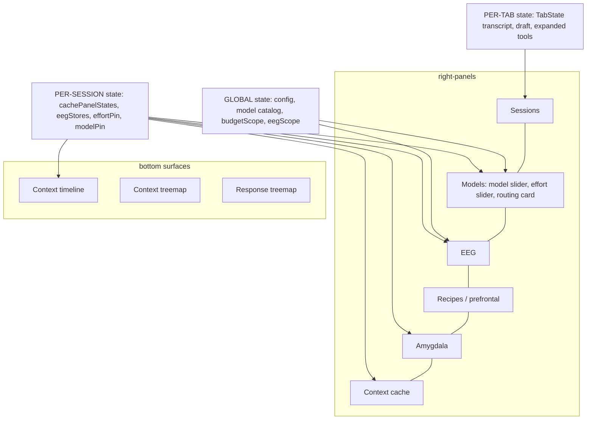
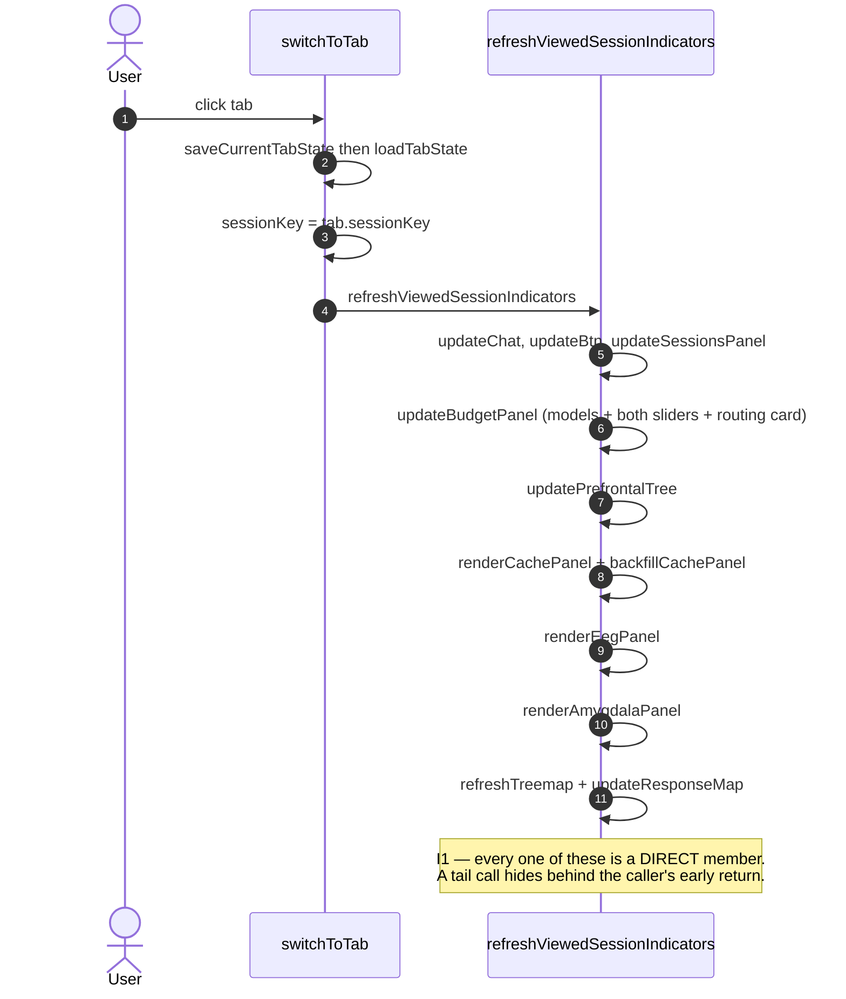
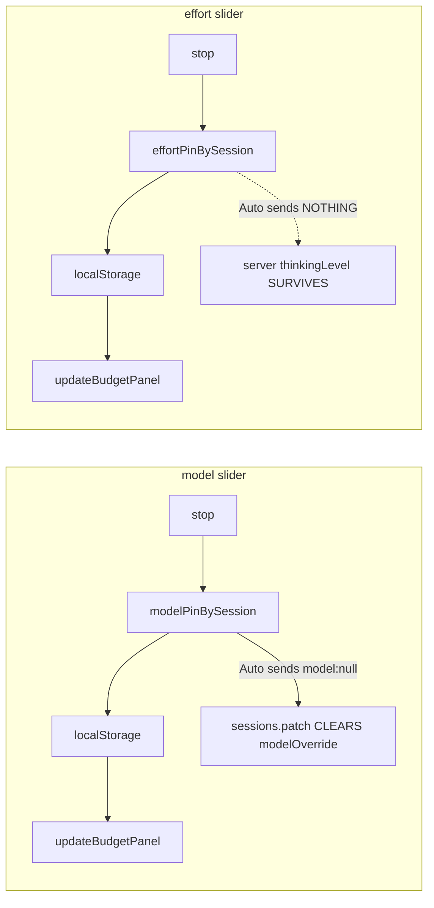

# Right-rail interaction model

> Written 2026-07-26 after the architect reported six symptoms at once ("there are a lot of bugs
> here"). A forensic sweep found **26 defects**. Nearly all of them are the _same_
> invariant violated in a different panel. This file is the model those invariants come
> from, so the next panel is built right instead of debugged later.

## 1. Three state classes

Every piece of rail state is exactly one of these. Choosing wrong is the root of most
defects below.

| Class           | Meaning                                                        | Storage shape                                     | Repaint trigger                    |
| --------------- | -------------------------------------------------------------- | ------------------------------------------------- | ---------------------------------- |
| **GLOBAL**      | same for every tab — config, catalogs, rail chrome             | module-level `let`/`const`                        | its own setter                     |
| **PER-SESSION** | belongs to the _viewed session_, must survive a tab round-trip | `Map<sessionKey, State>` + a `…For(key)` accessor | `refreshViewedSessionIndicators()` |
| **PER-TAB**     | belongs to the _tab shell_, not the session behind it          | `TabState` in `tabStates`                         | `switchToTab` save/load            |

The reference implementation of PER-SESSION is `cachePanelStates` + `cacheStateFor()` +
funnel registration (`app.ts`). Every per-session defect is that same cure applied
elsewhere.

## 2. The invariants

| #       | Invariant                                                                                                                                              | Status 2026-07-26                                                                                   |
| ------- | ------------------------------------------------------------------------------------------------------------------------------------------------------ | --------------------------------------------------------------------------------------------------- |
| **I1**  | Every viewed-session surface is a **direct member** of `refreshViewedSessionIndicators()` — never a tail call behind another panel's early return.     | **enforced** (verify gate above)                                                                    |
| **I2**  | There is **one** scope concept ("Session vs All") and one mutator.                                                                                     | **ASPIRATIONAL** — 3 variables, 4 semantics. See §4.                                                |
| **I3**  | Scope filters **display**, never **admission**. Events are recorded for every session; the toggle only decides what is drawn.                          | **VIOLATED** — this is why "All" looks dead. See §4.                                                |
| **I4**  | Model ids cross two namespaces — provider-prefixed (`xai/grok-4.5`) and bare (`grok-4.5`). Every crossing compares on the bare tail (`bareModelTail`). | **enforced 2026-08-29** (`4b83f9c0026`) — both crossings go through `serverModelStopIndex`.         |
| **I5**  | The rail shows what **is/did serve**, never what config says _would_ serve. A prediction is labelled as a prediction.                                  | **VIOLATED** in the routing card.                                                                   |
| **I6**  | The **client pin is the source of truth** for model and effort; the server row is a mirror.                                                            | **PARTIAL** — model gained a clear path 2026-08-29 (`5792cb0ab4c`); **effort still has none** (§5). |
| **I7**  | Any control that mutates rail state repaints through the same function.                                                                                | **enforced 2026-07-26** for both sliders.                                                           |
| **I8**  | A control's option set is stamped into the DOM at render and read back at event time — never re-derived.                                               | **ASPIRATIONAL** — `readThinkStop` re-derives.                                                      |
| **I9**  | A repaint must not destroy a control the user is manipulating.                                                                                         | **ASPIRATIONAL** — `updateBudgetPanel` does `innerHTML =`. Repaint on `change`, never `input`.      |
| **I10** | Per-session state lives in a `Map` + accessor, never a module-level object.                                                                            | **PARTIAL** — amygdala, recipe/plan/trail, timeline buffer, treemap drill state still global.       |
| **I11** | The effort ladder is a **closed string enum** end to end; no numeric value reaches a transport.                                                        | **enforced** at 6 chokepoints. Prices the numeric-effort feature — see §5.                          |
| **I12** | Effort ticks and EEG columns share one geometry source.                                                                                                | **VIOLATED** — filtered length vs fixed 7.                                                          |

## 3. Rail composition

## 4. Tab switch — who repaints

Before 2026-07-26 the last four were **not** members: EEG was a tail call of
`updateBudgetPanel` (so any switch before `config.models` resolved kept the old paper),
amygdala was never repainted here at all, the context treemap was cleared and never
reloaded, and the response treemap had no reload path. That is the whole of "the right
panel is mostly dependent on which tab we are selecting".

## 5. Scope — the contract that does not exist yet

Today there are **three variables and four meanings**:

| Toggle                    | Variable      | Actual meaning                                              |
| ------------------------- | ------------- | ----------------------------------------------------------- |
| Models, Recipes, Amygdala | `budgetScope` | viewed session vs all                                       |
| EEG                       | `eegScope`    | viewed session vs all                                       |
| Context timeline          | `filterMode`  | viewed session vs all                                       |
| (Amygdala, in practice)   | `budgetScope` | **live ring vs persisted feed** — a different axis entirely |

**Why "All" looks dead (I3).** `activeRuns` can only ever contain viewed-session runs —
lifecycle admission hard-returns for foreign sessions _before_ the insert, and EEG
recording for a foreign session is itself gated on `eegScope === "all"`, which is
chicken-and-egg. So switching to All has nothing to reveal. The fix is to **split
admission from display**: record for every session, filter at draw time. It must land
together with the terminator fix, or "All" fills with runs that never stop "thinking".

## 6. Model and effort control chain

Both sliders are **client-side pins** re-applied on the next `chat.send`. The dotted edge
is the trap: selecting _Auto_ only clears the **client** pin, the server-side override
persists, and the session keeps being served by the old model / old effort while the rail
says Auto.

**MODEL: fixed 2026-08-06, landed 2026-08-29.** Reported live — a tab pinned to
`openrouter/qwen` kept answering on qwen with the picker reading Auto, because
`chat.send`'s `model` param persists a durable `modelOverride`
(`modelOverrideSource:"user"`) and Auto simply omitted the param. The picker could SET a
server pin and never CLEAR it. Reported again 2026-08-28 in its second population — _"when
the model is set to auto, it uses either opus (the proper one) or the last one chosed for
that chat"_: sessions that never carried a pin resolve correctly to
`agents.defaults.model.primary`, sessions that carried one once stay stuck on it forever.
The picker now patches the selection through on every press —
`sessions.patch { key, model: <id> | null }`, where `null` reaches
`applyModelOverrideToSessionEntry({isDefault:true})` and deletes
`modelOverride`/`providerOverride`. The webchat guard grew a second narrow carve-out for
this (`isModelOnlyPatch`, beside `isDisplayNameOnlyPatch`): `model` is the only mutable
field allowed through, and only when it is the whole patch. It grants no new authority —
the same client could already WRITE an override via `chat.send`; it could just never clear
one.

**EFFORT: still open.** `chat.send` omits `thinking` when unpinned, the command layer only
assigns when truthy, and `thinkingLevel` is NOT in the webchat carve-out — so Auto on the
effort axis remains a client-only clear with the server level surviving. (`app.ts:24607`
still calls `sessions.update`, which is not a real method, so that path fails silently.)
Closing it means either widening `isModelOnlyPatch` to a general "session-routing fields"
patch or giving effort the same explicit-reset channel model now has.

**Numeric effort (I11).** The ladder is a closed string enum at six chokepoints
(directive scanner, `normalizeThinkLevel`, the profile clamp, three level→budget tables,
the persistence schema). A percentage must therefore be **additive** — a `thinkingPct`
travelling _beside_ the named level, never replacing it — otherwise the EEG, the
allocator's calibration histogram and the schema all break. Note also that on Anthropic
adaptive models (opus) a token budget is not expressible at all: the wire takes a string
effort, so a percentage there is _intent_, re-bucketed to a named level.

## 7. Context-cache panel contract

**Where it lives (2026-08-06):** not its own `.rpanel` any more — a **static `.model-group`
inside `#models-panel`, directly above the EEG** (the architect: _"move the context cache panel on top
of the EEG, inside MODELS"_), so the rail reads SMART MODELS → MORE MODELS → THINKING →
THALAMUS → CONTEXT CACHE → EEG. Static and outside `#budget-panel` for the same load-bearing
reason the EEG is: `updateBudgetPanel()` reassigns that element's `innerHTML` on every repaint,
while `renderCachePanel()` writes `#cache-panel-body` by id and the fold handler binds ONCE at
boot. Fold it into the generated HTML and the panel goes silently dead. Fold state is
`model:cache`; the `cache-panel` id stays on the wrapper because the read/write flash needs it.

Two bars, **different denominators on purpose** — which is exactly why each carries its
own title row above it and its own legend below it:

| Bar         | Denominator                                                      | Segments                                           |
| ----------- | ---------------------------------------------------------------- | -------------------------------------------------- |
| `WINDOW`    | the model's real context window (per-model, changes mid-session) | anatomy composition + `Unitemised` + free headroom |
| `THIS CALL` | that one API call's `promptTokens`                               | cache-read / cache-write / fresh                   |

Rules:

- Measured components render **at true scale**, never stretched onto the billed total. The
  shortfall is drawn as one labelled `Unitemised` band.
- **Never** read `contextWindow.usedTokens` or `utilizationPercent` — turn-aggregate
  counters, observed at 2372%.
- Any "snapshot" larger than the window is an accumulated counter, not a context size.
  Guard it (the anatomy `cacheReadTokens + cacheCreationTokens` fallback is exactly this —
  it produced a 938% bar).
- The window denominator **changes when the model changes mid-session**. That is truthful
  and must stay; annotate the rescale rather than pinning a session-wide denominator.

## 8. Verify — where the gates live, and what was wrong with them

_(2026-08-04)_ The three `verify:` entries in the frontmatter are now one-line pointers into
`scripts/bible/`. That is FOUNDATION.md's rule — _"Three different jobs, three different homes"_:
this file's job is to **explain** the model, a script's job is to **check that the code still
matches it**, and only the script can be linted, reviewed and given its own test.

Moving them was not cosmetic. **All three were passing vacuously**, and each claim below was
measured on a copy of the real tree, not reasoned about:

| Gate                | Was                                     | Demonstrated hole                                                                                                                                                                                        |
| ------------------- | --------------------------------------- | -------------------------------------------------------------------------------------------------------------------------------------------------------------------------------------------------------- |
| I1 funnel           | `body.includes(name + "(")` on raw text | Delete `renderEegPanel();` and leave `// renderEegPanel() moved into updateBudgetPanel` — still **green**. So is nesting the real call inside an `if`, which I1 explicitly forbids ("direct member").    |
| cache-bar legends   | `source.includes("cache-legend--…")`    | Replace the emitted `class="cache-legend cache-legend--window"` with a bare `cache-legend` plus the trailing comment `// cache-legend--window removed` — still **green**. A dead constant passes it too. |
| cache-panel palette | no local hex ⇒ print `palette imported` | Run it against an **empty file**: it prints `ok: palette imported, no local hex`. The negative half was real; the printed claim was never checked. That is design-principles.md #20's dead instrument.   |

One nuance worth recording, because it is the reason this kind of gate feels safe: the funnel body
does carry 15 lines of FORK comment, but only **one** surface (`updateBudgetPanel`) is named in
them and **none** with a trailing `(`. So the old check was not green-by-accident _today_ — it was
green _conditionally_, and the condition was a comment-formatting habit no one had written down.

What the scripts assert instead:

- **`right-rail-funnel.mjs`** blanks comments and string literals, then requires each surface to be
  invoked as a **top-level statement** of the body (brace depth 0, paren depth 0). That is what
  "DIRECT member" means in I1, so a call buried in an `if` no longer counts either.
- **`right-rail-cache-legends.mjs`** strips comments and accepts a class token only when it is
  actually **emitted inside a `class="…"` attribute**.
- **`right-rail-cache-palette.mjs`** keeps the hex scan byte-for-byte — including inside comments,
  where over-strictness is the safe direction — and adds the positive half: the panel must **import**
  a palette binding. The binding is matched by name, not by module path, so relocating the owner is
  not a gate failure (no frozen list — design-principles.md #19).

Each script runs its own fixtures **before** the real check, on every invocation: a call named only
in a comment, a call nested in an `if`, and a class named only in a comment must all be rejected, or
the script refuses to run. A vacuity guard that is never exercised is the defect it was written to
prevent. `pnpm bible:invariants` runs all three.
