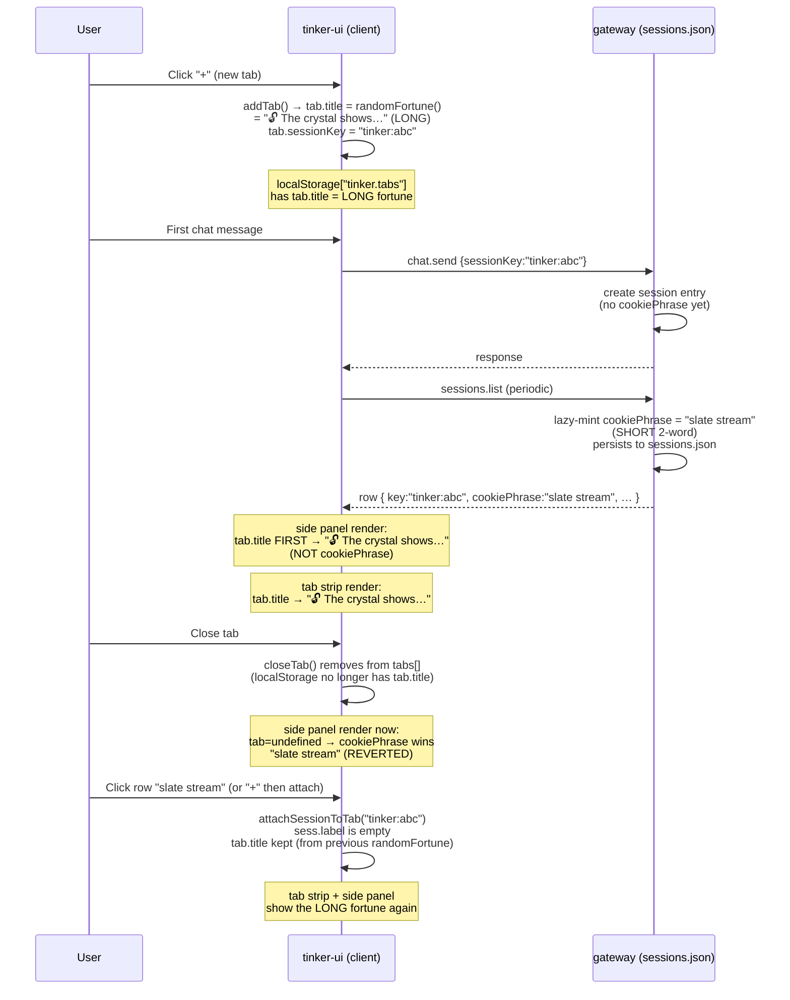

# Session-naming contract

There is exactly ONE visible name per session. The user sees it in three places: the right-panel sessions list row, the active tab strip tab, and any session-selector dropdown. These three surfaces must always agree.

Today they don't. This file maps why.

## The four name signals

| Signal         | Where minted                                                              | Format                                                 | Persisted where                                                     | Lifetime                                                                 |
| -------------- | ------------------------------------------------------------------------- | ------------------------------------------------------ | ------------------------------------------------------------------- | ------------------------------------------------------------------------ |
| `tab.title`    | client (`tinker-ui/src/app.ts`)                                           | varies — see Tab.title sources below                   | `localStorage["tinker.tabs"]`                                       | until tab closed (and even then, if persisted)                           |
| `cookiePhrase` | gateway (`src/gateway/session-cookie-phrase.ts`)                          | `"<adjective> <noun>"` — "ivory anvil", "slate stream" | `sessions.json` (SessionEntry.cookiePhrase)                         | burned-in forever once minted; survives every restart, rotation, close   |
| `label`        | server (whatever set it — chat.send origin, group title, manual edit)     | freeform — usually empty for chat-originated sessions  | `sessions.json` (SessionEntry.label)                                | until cleared                                                            |
| `displayName`  | server, derived from `origin.label` or `channel`/`subject`/`groupChannel` | freeform                                               | `sessions.json` (SessionEntry.displayName) OR computed at list-time | mostly persistent; the "Tinker UI" generic-WS-client leak (filtered now) |

## Tab.title sources (the client-side mint sites)

Five callsites currently set `tab.title`. They use different generators:

1. **`addTab()`** (`app.ts:5251`) — new tab from the "+" button.
   - Currently: `title: randomFortune()` → picks ONE of ~hundreds of LONG poetic greetings from `FORTUNE_COOKIES` (`app.ts:156`). Example: `"🔓 The thought you are most tempted to believe without questioning is the one most worth examining…"`

2. **`/clear` handler** (`app.ts:11928`) — rotates main session, gives the rotated tab a fresh title.
   - Currently: `tab.title = randomFortune()` (same generator as 1).

3. **`attachSessionToTab(key)`** (`app.ts:5302`) — when the user clicks a row in the sessions panel to open it in the active tab.
   - Currently: `if (sess?.label) tab.title = sess.label.slice(0, 30)`. If `sess.label` is empty (the common case for chat-originated sessions), tab.title stays as whatever it was — which is the LONG randomFortune from step 1.

4. **Auto-title** (Gemini-generated topic phrase from the chat content) — fires after the first turn.
   - Sets `tab.title` to a topic summary like `"🔧 Fix auth bug"`. This is the meaningful-title path; we want to preserve it.

5. **`loadTabs()`** restore at module load — reads `localStorage["tinker.tabs"]` and restores `tab.title` for previously-persisted tabs (`app.ts:635-636` for tab-main force "🏠 Main"). No new minting here.

## Side-panel name resolution (the read site)

`renderSessionRow(s, shortLabel)` at `app.ts:6180` uses this priority chain:

```
1. tab?.title                                    (the open tab matching this session)
2. s.cookiePhrase                                (the server's burned-in phrase)
3. meaningfulSessionLabel(s.label)               (generic-filtered server label)
4. meaningfulSessionLabel(s.displayName)         (generic-filtered server displayName)
5. shortLabel                                    (key-derived fallback like "mpgj631q")
```

Tab strip rendering: `renderTabs()` just reads `tab.title` directly — no resolution chain, no fallback.

## Current divergence (the bug)

Trace one session through the system as it stands today (2026-05-24, post-cb0a6b4e1e):



**What the user sees:**

- "I see 'ivory anvil', 'glass verse'…" → the SHORT cookiePhrase (sess.cookiePhrase) showing in side panel for sessions with no matching open tab.
- "When I click them they correctly display a fortune cookie phrase from our repertoire" → opening a tab shows the LONG fortune. They're calling it "from our repertoire" because it's still emoji+poetic — but it's a DIFFERENT cookiePhrase family (FORTUNE_COOKIES, not the 2-word generator).
- "When I close the session tab the title in the side panel reverts" → the priority chain falls from tab.title to cookiePhrase. Two different signals; the side panel changes.
- "Upon opening a new tab the fortune cookie title is different" → addTab() rolls a fresh random — never the same as the server's persisted cookiePhrase.

## Root cause

There are TWO independent naming systems with NO sync between them:

1. **Client tab.title** uses `randomFortune()` from `FORTUNE_COOKIES` (long poetic greetings). Persists in `localStorage`. Never reconciled with anything server-side.
2. **Server cookiePhrase** uses `generateCookiePhrase()` from the adjective×noun word lists (short 2-word). Persists in `sessions.json`. Never read by tab.title.

The label-resolution chain prefers `tab.title` over `cookiePhrase`, so as long as a tab is open the user sees the LONG fortune; the moment they close it, they see the SHORT cookiePhrase.

## The unified contract (TARGET state)

1. **Single phrase pool.** Both client and server use the SAME adjective×noun word lists. The client phrase format MUST match the server format (`/^[a-z]+ [a-z]+( \d{2})?$/` per the suffix rule in `session-cookie-phrase.ts`).

2. **Server is authoritative.** `cookiePhrase` in `sessions.json` is the canonical name. Client `tab.title` mirrors it; never the other way around.

3. **Tab.title sourcing rule:**
   - `addTab()` mints a client-side phrase from the SAME generator. Used as a placeholder until sessions.list reconciles.
   - `/clear` mints a client-side phrase (rotated main session is treated as new).
   - `attachSessionToTab(key)` uses `sess.cookiePhrase` if present, else falls through to current behavior.
   - Auto-title (Gemini topic phrase) STILL OVERRIDES — it's the only meaningful user-facing customization and should beat both cookie phrases.
   - After every `sessions.list` response, sync: for each tab whose sessionKey matches a session with a `cookiePhrase`, if `tab.title` looks like a default phrase (matches the 2-word regex) AND differs from `sess.cookiePhrase`, set `tab.title = sess.cookiePhrase` and persist. This converges client-mint phrases to the server-authoritative ones over the first sessions.list round-trip.

4. **Side-panel resolution chain unchanged** — tab.title still wins because step (3) keeps it in sync with cookiePhrase OR carries a meaningful auto-title.

5. **Deprecate `randomFortune()` for tab titles.** `FORTUNE_COOKIES` should either move to a chat-greeting feature (its own surface) OR be deleted entirely. Tab titles only ever use the 2-word phrase or the auto-title.

## Fix plan (commits to ship)

| #   | Change                                                                                                                                                                                                                                                                                                                                 | File                                  |
| --- | -------------------------------------------------------------------------------------------------------------------------------------------------------------------------------------------------------------------------------------------------------------------------------------------------------------------------------------- | ------------------------------------- |
| 1   | Port the 40×78 word lists from server `session-cookie-phrase.ts` to client `app.ts`. Add `randomCookiePhrase()` using identical algorithm.                                                                                                                                                                                             | `tinker-ui/src/app.ts`                |
| 2   | Replace `randomFortune()` → `randomCookiePhrase()` at the two tab-creation sites (`addTab`, `/clear` handler).                                                                                                                                                                                                                         | `tinker-ui/src/app.ts:5254`, `:11928` |
| 3   | `attachSessionToTab` reads `sess.cookiePhrase` first, then `sess.label`.                                                                                                                                                                                                                                                               | `tinker-ui/src/app.ts:5302`           |
| 4   | In the `sessions.list` response handler (`loadSessions` at `app.ts:2576`), after `sessions = res.sessions`, sync tab.title for any tab whose `sessionKey` matches a session with a `cookiePhrase`, IF tab.title matches the default-phrase regex `/^[a-z]+ [a-z]+( \d{2})?$/` AND differs from `sess.cookiePhrase`. Then `saveTabs()`. | `tinker-ui/src/app.ts:~2580`          |
| 5   | (Optional, later) Delete `FORTUNE_COOKIES` and `randomFortune()` entirely — they have no other consumers.                                                                                                                                                                                                                              | `tinker-ui/src/app.ts:156`, `:395`    |

## Don't regress

- Never re-introduce `randomFortune()` for tab titles. The long poetic phrases are now a separate concern. The bible verify below asserts this.
- Never let the client mint a phrase format different from the server. The wordlist MUST be a literal port. If you change the server's lists in `session-cookie-phrase.ts`, change the client's at the same time, in the same commit.
- The auto-title path (Gemini topic phrase) STILL wins over cookiePhrase — it's the user-meaningful name. Don't break that by always clobbering tab.title from cookiePhrase. Use the default-phrase regex gate.

## Verify (proposed for next ship)

```yaml
verify:
  - name: addTab uses randomCookiePhrase, not randomFortune (FORK 2026-05-24)
    cmd: |
      python3 -c '
      import re, os
      t = open(os.path.expanduser("~/src/tinkerclaw/tinker-ui/src/app.ts")).read()
      # locate addTab block by signature
      m = re.search(r"function addTab\([^{]*\{(.*?)^\}", t, re.S | re.M)
      assert m, "addTab block not found"
      block = m.group(1)
      assert "randomCookiePhrase" in block, "addTab must use randomCookiePhrase, not randomFortune"
      assert "randomFortune" not in block, "randomFortune must not appear in addTab"
      '
  - name: client + server wordlists agree in length (canary for drift)
    cmd: |
      python3 -c '
      import re, os
      srv = open(os.path.expanduser("~/src/tinkerclaw/src/gateway/session-cookie-phrase.ts")).read()
      cli = open(os.path.expanduser("~/src/tinkerclaw/tinker-ui/src/app.ts")).read()
      def count_words(src, key):
        m = re.search(key + r"\s*=\s*\[([^]]+)\]", src)
        if not m: return 0
        return m.group(1).count(",")
      assert count_words(srv, "ADJECTIVES") == count_words(cli, "COOKIE_ADJECTIVES"), "adjective lists drifted"
      assert count_words(srv, "NOUNS") == count_words(cli, "COOKIE_NOUNS"), "noun lists drifted"
      '
```
