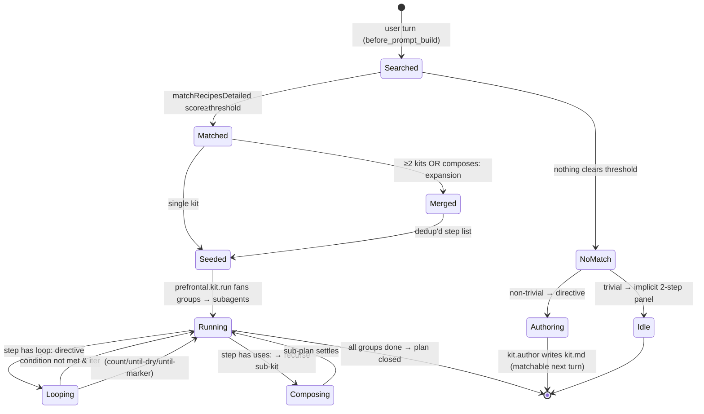
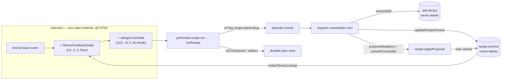

# Subagents, kits, plans, and Prefrontal observability

## Why the fork has its own subagent path

cc-bridge sessions use claude-cli internally; claude-cli has its own subagent mechanism (`Task` tool, agents-md hierarchy). But the fork needs a SECOND path: spawn an OpenClaw subagent that uses a non-cc-bridge provider (e.g., openai, google), or an OpenClaw subagent that runs orchestration logic separate from claude-cli's tool tree.

The fork RPC for this is `fork.subagents.spawn` (`src/fork/subagents-rpc.ts`, FORK 2026-04-20). It wraps `spawnSubagentDirect` from the agent runtime.

## The spawn helper

`~/src/tinkerclaw/scripts/openclaw-spawn-subagent.mjs` is the CLI wrapper Jarvis uses from cc-bridge:

```
node ~/src/tinkerclaw/scripts/openclaw-spawn-subagent.mjs \
     --task "<instruction>" \
     --label "<short-name>" \
     [--model claude-code/claude-opus-4-7] \
     [--thinking medium] \
     [--timeout 600] \
     --json
```

Stdout (with `--json`) returns `{childSessionKey, runId}`.

When the active provider is a regular LLM (anthropic, openai, google, ollama), the **native `sessions_spawn` tool** takes over automatically — no orchestration code rewrite required. The helper is the fallback for the claude-cli mode where the native tool isn't exposed.

## Kits

### Kit format (kit/1.0)

The kit/1.0 format is documented at https://www.journeykits.ai/api/docs/kit-md. Each kit is a markdown file (`kit.md`) with:

- YAML frontmatter: `schema: "kit/1.0"`, `name`, `description`, `triggers[]`, `steps[]` (optional inline), `constraints[]`, `safety_notes[]`
- Markdown body: numbered Steps, each with a title + optional tool list + success criteria

### Kit RPCs

Eight RPCs in `prefrontal.kit.*` (was five; `run` added 2026-05-16, `author` + `match` added 2026-05-29):

| RPC                      | Params                                                                               | Returns                                                   |
| ------------------------ | ------------------------------------------------------------------------------------ | --------------------------------------------------------- |
| `prefrontal.kit.search`  | `{ query: string, limit?: number }`                                                  | `{ results: KitSummary[] }`                               |
| `prefrontal.kit.get`     | `{ kitRef: string }`                                                                 | `{ kit: KitManifest, body: string }`                      |
| `prefrontal.kit.install` | `{ kitRef: string, allowRisky?: boolean }`                                           | `{ ok, installedPath, preflightResults, nextSteps }`      |
| `prefrontal.kit.publish` | `{ slug, body, apiKey? }`                                                            | `{ ok, url }`                                             |
| `prefrontal.kit.list`    | `{}`                                                                                 | `{ kits: LocalKitEntry[] }`                               |
| `prefrontal.kit.run`     | `{ kitRef, sessionKey, intent, parameters?, dryRun? }`                               | `{ ok, planId, dryRunPlan?, results? }`                   |
| `prefrontal.kit.author`  | `{ slug, title, summary, tags, category?, steps[], parallelismGroups?, overwrite? }` | `{ ok, kitRef, path, stepCount }`                         |
| `prefrontal.kit.match`   | `{ prompt, limit? }`                                                                 | `{ confidence, catalogSize, recommendAuthor, matches[] }` |

`kitRef` format: `<owner>/<slug>` (e.g., `globalcaos/feature`). Search and get hit `https://www.journeykits.ai`.

### Kit storage layout

- **Source tree (bundled):** `extensions/tinkerclaw-prefrontal/kits/<slug>/kit.md`
- **Downloaded at install:** `~/.openclaw/workspace/kits/<owner>/<slug>/` (contains `kit.md` + any installed files)

### Sandbox enforcement

Every file path written by kit-install goes through `resolveSandboxPath`:

- Absolute paths are refused
- `..` traversal sequences are refused
- Only relative paths within the install target dir are accepted
- Kits with `risk: ["Critical"]` or `risk: ["High Risk"]` require `allowRisky: true` in the install call

## Canonical kit translation contract

There is exactly ONE kit data shape in this codebase. It is the kit.md frontmatter
as defined by the kit/1.0 spec (https://www.journeykits.ai/api/docs/kit-md). The
RPC `prefrontal.kit.list` parses every kit.md (both ours and downloaded) via
`yaml.parse` and returns a normalized array:

| Field      | Source                                                                                                     |
| ---------- | ---------------------------------------------------------------------------------------------------------- |
| `kitRef`   | `<owner>/<slug>` derived from path                                                                         |
| `owner`    | `globalcaos` for ours; remote owner for downloaded                                                         |
| `slug`     | frontmatter `slug` field, falls back to dir name                                                           |
| `title`    | frontmatter `title`                                                                                        |
| `summary`  | frontmatter `summary` (block scalars folded by `yaml.parse`)                                               |
| `tags`     | frontmatter `tags`                                                                                         |
| `category` | derived: explicit `category` field → tag match → pattern fallback (parser-internal `inferCategory`)        |
| `source`   | `"ours"` for `extensions/tinkerclaw-prefrontal/kits/*` / `"downloaded"` for `~/.openclaw/workspace/kits/*` |
| `path`     | absolute path to kit.md                                                                                    |

**There is no `RECIPE_CATALOG` or any hand-coded kit list in the UI.** Adding a
kit means dropping a kit.md on disk — the gateway picks it up and the UI shows
it on next render. Deleting a kit means deleting the file.

**Adding a new field to kit/1.0:** add it to `RecipeFrontmatter` type in
`recipe-rpcs.ts`, surface it in the RPC response, consume it in the UI. Update the
table above. The merge gate (verify block in this file's frontmatter) catches
kit.md parse failures.

### Kit catalog

Hand-written orchestration kits live at `~/src/tinkerclaw/extensions/tinkerclaw-prefrontal/kits/`. Each subdirectory is a kit slug containing a `kit.md`.

Catalog entries (per `kits/CATALOG.md`):

| Kit                                   | Triggers (informal)            | Purpose                                                                            |
| ------------------------------------- | ------------------------------ | ---------------------------------------------------------------------------------- |
| `writing/revise-paper/kit.md`         | revise / improve a paper draft | structure audit → evidence check → prose tightening → fresh additions → final pass |
| `writing/write-paper/kit.md`          | new paper from scratch         | sketch → outline → draft → review                                                  |
| `writing/brainstorm/kit.md`           | open-ended ideation            | divergent generation → cluster → prioritize                                        |
| `writing/write-plan/kit.md`           | implementation plan            | spec → step decomposition → invariants                                             |
| `coding/code-review/kit.md`           | review code                    | systematic pass with checklist                                                     |
| `coding/debug/kit.md`                 | debug issue                    | hypothesis → probe → confirm → fix                                                 |
| `coding/feature/kit.md`               | implement feature              | scope → design → implement → verify                                                |
| `coding/refactor/kit.md`              | refactor existing code         | tests-first → behavior-preserving change                                           |
| `coding/plan/kit.md`                  | plan a coding task             | step decomposition + risk identification                                           |
| `coding/verify/kit.md`                | verify completion              | checklist + probe runs                                                             |
| `analysis/investigate/kit.md`         | investigate unknown            | data gathering → pattern recognition → conclusions                                 |
| `analysis/dependency-analysis/kit.md` | dependency mapping             | static + dynamic analysis                                                          |

Usage discipline: when the user's task matches a kit's `triggers`, READ the kit FIRST, use its Steps as the skeleton of the plan, and reference the kit id in orchestration narration. Kits are PLAYBOOKS, not executable code. Combine them with the spawn helper: dispatch each Step in a kit to its own subagent when independent and parallelisable.

## Plans

Plans are the runtime counterpart of kits. A kit is a template; a plan is an instance of execution rooted in a session.

### Plan file location

`~/.openclaw/workspace/state/prefrontal/plans/<sessionKey-slug>.md`

Active plans live here. On `plan.close`, the file is archived to:
`~/.openclaw/workspace/state/prefrontal/plans/archive/<YYYY-MM-DD>/<sessionKey-slug>.md`

### Plan RPCs

Four RPCs in `prefrontal.plan.*`:

| RPC                     | Params                                                                                         | Returns                          |
| ----------------------- | ---------------------------------------------------------------------------------------------- | -------------------------------- |
| `prefrontal.plan.set`   | `{ sessionKey, intent, runId, steps?: [{title,note?}], kitRef?: string, status?: PlanStatus }` | `{ ok, planPath }`               |
| `prefrontal.plan.step`  | `{ sessionKey, stepIndex, status: StepStatus, note?: string }`                                 | `{ ok }`                         |
| `prefrontal.plan.get`   | `{ sessionKey }`                                                                               | `{ plan: PlanDocument \| null }` |
| `prefrontal.plan.close` | `{ sessionKey, status: "done" \| "aborted" }`                                                  | `{ ok, archivedPath }`           |

### Plan frontmatter shape

```yaml
---
schema: plan/1.0
sessionKey: agent:main:main
runId: abc123
intent: "implement the feature branch"
kitRef: globalcaos/feature # optional — if seeded from a kit
status: in_progress # in_progress | done | aborted
currentStep: 1 # 0-indexed, index of the active step
---
```

Steps follow as a numbered markdown list in the body. Each step has `status` tracked in frontmatter or inline metadata.

### Plan step statuses

`pending` → `in_progress` → `done` | `error`

### The `currentStep` invariant

**At most one step may be `in_progress` at a time per plan.** When `plan.step` is called with `status: "in_progress"` for step N, any previously `in_progress` step is automatically demoted to `pending` before step N is promoted. This invariant is enforced by the plan-store, not the caller.

### Plans-as-instances vs kits-as-templates

When `plan.set` is called with `kitRef: "globalcaos/feature"`:

1. recipe-rpcs fetches the kit from the Journey registry (or local source tree)
2. The kit's `steps[]` body is used as the seed for the plan's step list
3. `kitRef` is recorded in the plan frontmatter so the origin is traceable
4. Subsequent `plan.step` mutations track execution of those steps

Without `kitRef`, steps are provided inline in the `plan.set` call.

### The recipe-matcher — auto-seed at turn start (FORK 2026-05-16)

`extensions/tinkerclaw-prefrontal/recipe-matcher.ts` is the **matching half** of the smart router; `recipe-runner.ts` is the execution half. Before 2026-05-16 nothing called the execution half from a normal conversational turn — Jarvis had to remember to invoke `prefrontal.kit.run`, and he didn't (the 2026-05-14 plan-not-set incident: a 7-minute turn with no plan, so restart-continue had nothing to resume). Per the "force rules in code" preference, matching now fires automatically.

Flow:

1. Registered as a second `before_prompt_build` hook in `index.ts` (priority 20, separate concern from the anti-goldplating hook at 40). The hook event carries `{ prompt, messages }`; ctx carries `{ sessionKey, trigger, runId }`.
2. Gate: only `sessionKey` ending `:main` (not `:subagent:`), and `trigger` not `heartbeat`/`cron`. Every other user turn is scored — there is **no complexity heuristic**; "no match" frequency is itself the signal (see below).
3. `loadRecipeIndex(ownRecipesDir)` scans the local catalog's frontmatter (slug/title/summary/tags), cached by the kits-dir mtime. No Journey network call on the hot path.
4. `matchRecipes` scores each kit: exact phrase tag in prompt = 5, single-word tag hit = 3, title word = 2, summary word = 1. Threshold 3, top 3 kits.
5. `buildMergedPlan` concatenates matched kits' steps (parsed via the exported `parseKitStepsAndParallelism`), deduped by normalized title, highest-scored kit's phrasing wins. This is the user's "merge into one plan" decision (2026-05-14).
6. `planStore.set` seeds the plan — UNLESS an `in_progress` plan already exists (explicit/prior-turn plans win; never clobbered).
7. No match → a `WARN [recipe-matcher] NO-MATCH … prompt="…" (catalog=N kits)` line. **This is the recipe-gap signal**: if it fires often for a class of prompts, the catalog is too thin, or the work has drifted into new territory, or we need on-the-fly kit authoring. Mining this WARN is how the catalog grows. The implicit 2-step panel (content-rich, see `tinker-ui.md` / `prefrontal-tree.ts` `humanizeRootStatus`) is the acceptable recovery UX for genuinely trivial no-match turns.

Recovery contract: because the matcher seeds a plan for substantially every non-trivial turn, **restart-continue almost always has an `in_progress` plan to resume** — that is the "working recovery system against restart." Trivial no-match turns are short enough that a restart just means the user re-asks; no plan-replay machinery is needed (deliberately not built — minimal blast radius).

## Composition, loops, and on-the-fly authoring (FORK 2026-05-29/30)

The matcher's fuzzy scorer (`matchRecipesDetailed`, stem + prefix + edit-distance-1, with a `none|low|high` confidence) feeds three capabilities that close most of the gap vs Claude Code's dynamic workflows:

- **Composition — recipes built from recipes.** A kit's frontmatter `composes: [slug, ...]` expands those kits' steps into the merged plan ahead of its own (cycle-guarded). A step body whose **leading directive** is `uses: <owner/slug>` (or a bare own-slug) makes `recipe-runner` recurse into that sub-kit at runtime on a derived `sessionKey` (`…::uses::<idx>`), depth-capped (`MAX_USES_DEPTH=3`) + cycle-guarded by the `_usesChain`. A `uses:` buried in prose or a code fence does NOT fire — only the **consecutive leading directive lines** are parsed (`leadingDirectives`), a 2026-05-29 review fix.
- **Loops — the structural gap, now closed.** A leading `loop:` directive repeats a step (spawn or sub-kit) until a condition or a hard cap: `loop: count <N>`, `loop: until-dry [max <M>]` (stops when the subagent's done-note reads "dry" per `isDryNote`), or `loop: until <MARKER> [max <M>]`. Bounded by `DEFAULT_LOOP_MAX=5`, hard-capped at `HARD_LOOP_MAX=25` — a recipe can never spin forever. `uses:` and `loop:` coexist on the leading lines (loop a whole sub-recipe until dry).
- **Typed values + ports (SS1, 2026-06-04).** Two more **leading step-body directives** make data flow typed (gradual — untyped steps are byte-for-byte unchanged): `out: <JSON-Schema>` declares a step's structured output; `in: [{name, from}]` declares named input ports bound from a prior step's typed output via a `steps.<n>.out[.<path>]` reference (1-based step number). A typed step's subagent is told to emit one ```json fenced block; `recipe-runner`extracts + Ajv-validates it (shared`stepAjv`), persists the full validated object as `PlanStep.output` (`outputKind:"json"`) alongside the ≤500-char prose `artifact` digest, and on schema mismatch re-dispatches a **budget-derived** number of times (`deriveRedispatchBudget`— J16: never a frozen`MAX_SCHEMA_RETRIES`), emitting a `schema-mismatch`trail on each and a recorded step error on exhaustion (never a silent pass). Downstream`{{steps.<n>.out.<path>}}` refs are resolved from the live plan (`resolveStepRefs`); a seed-time `checkPortWiring`fails fast if any`in:`port references a non-existent/later step or a field the producer's`out:`schema doesn't declare. The value-flow helpers live in`recipe-types.ts`(single owner of the wire format). Like`uses:`/`loop:`, `out:`/`in:`are parsed only from the **consecutive leading directive lines**; the runner strips them before the subagent sees the body. SS3 adds a third leading-directive sibling,`invoke skill:`, which reuses this exact validate→budget-redispatch→persist output path — see §SS3.
- **On-the-fly authoring.** On NO-MATCH for a non-trivial turn, the `before_prompt_build` hook injects a `<recipe_gap>` directive telling Jarvis to call `prefrontal.kit.author` ({slug,title,summary,tags,steps,parallelismGroups}). `recipe-author.ts` validates (traversal-safe slug, parallelism coverage, no phantom `### N.` headings), assembles `kit.md`, and writes it to the own-kits dir (curated kits are never overwritten — only `authoredBy: jarvis-*` kits, and only with `overwrite:true`). The new kit is matchable next turn. `prefrontal.kit.match` is the LLM-free lookup Jarvis can call to inspect candidates first. SS3 inserts `prefrontal.recipe.compose` (search the skill stdlib, assemble `invoke skill:` steps) AHEAD of this from-scratch author, riding the same `authoredBy: jarvis-*` overwrite guard — see §SS3.



Every transition emits a provenance trail verb (`searched`/`matched`/`merged`/`composed`/`authored`) the RECIPES panel renders as its decision trail.

## The OSS-harness upgrades — how recipes/skills/plans LEARN (FORK 06f8647fdc, 2026-06-02)

Twelve OSS-harness upgrades landed together on `develop` (`06f8647fdc` on top of `70ad58e45d`); the five that change how **recipes/kits/plans/skills behave** are owned here (U1, U5, U6, U11, U12). The Cerebellum-side STORES they read/write — `recipe-archive/`, `skill-library/`, `failure-state.json` — are owned by `memory-layout.md`; the gateway RPC SURFACE (`fork.skill.*`, `fork.prefrontal.*`) is owned by `probes.md`. This optic owns the BEHAVIOR.

The recurring fork-wide pattern across all five: **a SYNC producer-side reader memoized once per turn**, threaded into `scoreRecipe`/`seedPlanFromPrompt` as an injected lookup, with **graceful degradation to neutral** when the store/network is absent (an offline or fitness-less deploy keeps pure-lexical scoring byte-identical). The matcher never blocks on disk or network on the hot path.

### U1 — the recipe-evolution loop (fitness-aware selection ↔ measurement)

The closed loop is: a kit RUNS → its outcome is ATTRIBUTED to the recipe → fitness is MEASURED at consolidation → the next match PREFERS the empirically-better recipe → a chronically-failing recipe gets a MUTATION PROPOSAL → an applied mutation re-enters the catalog and is re-measured. Three Cerebellum modules + two Prefrontal seams:

- **Fitness** (`src/memory/engram/recipe-fitness.ts`): `updateRecipeFitness` folds one episode into a `RecipeFitness` (Laplace-smoothed `successRate = (successes+1)/(runs+2)` so 1/1 is not a perfect 1.0; running-mean latency/tokens; mean `turnCount` as Gödel "difficulty"). `attributeRecipe` reads a `recipe:<owner/slug>` tag off the episode's events — **no tag ⇒ null ⇒ the episode is counted against NO recipe** (no false attribution).
- **Archive** (`recipe-archive.ts`): an append-only, **never-delete** versioned variant store (modeled on `artifact-store.ts`: `<baseDir>/recipe-archive/index.json` + `<slug>/v<n>.json`). `deprecate()` marks a variant obsolete but its body stays readable — so every mutation is **reversible** (the rollback guarantee the autonomy gate depends on). `rank()` is best-fitness-first with an epsilon-greedy explorer slot and optional `taskDifficulty` biasing (Gödel: difficulty-aware selection).
- **Evolution operator** (`recipe-evolution.ts`): `proposeMutations` emits `add_step`/`tighten_criteria` when `successRate < floor` (default 0.5) AND `runs >= minRuns` (3), or `remove_step`/`reorder` on a latency regression vs the window mean. `isAutoPromotable` flags a corrective proposal to skip human review ONLY when it is high-confidence (`successRate <= floor × autoFloorRatio`, i.e. FAR below the floor) AND well-evidenced (`runs >= autoMinRuns`, 8) AND reversible (always — the never-delete archive). Latency/efficiency proposals stay human-gated. This module never WRITES a recipe; the apply lives in the Prefrontal layer (`prefrontal.recipe.applyProposal`, see the autonomous-evolution observability below).

**The PRODUCER (the missing half that made fitness inert until U1):** `recipe-runner.ts` stamps the attribution tag via the `onTag` sink — a `TagStamp` (`tag: "recipe:<owner/slug>"`, `phase: "start"|"dispatch"`) emitted ONCE at run start and once per actually-dispatched step (skipped resume steps do NOT stamp, so the tag count tracks real dispatches). `recipe-rpcs.ts` `prefrontal.recipe.run` forwards each `TagStamp` to `fork.prefrontal.trailEvent` (kind `recipe-tag`); the tag rides into the run's episode events so `attributeRecipe()` can attribute the outcome at consolidation. Best-effort + fire-and-forget: a broken sink can NEVER throw into the dispatch loop.

**The SELECTION feedback:** `recipe-fitness.makeFitnessLookup(baseDir)` returns a SYNC `(slug) => successRate | undefined` (memoized per-lookup; reads the latest archived variant's `.fitness`; degrades to the Laplace-neutral 0.5 → `undefined` on any read failure). It is threaded as `feedback` into `matchRecipesDetailed`/`seedPlanFromPrompt`. In `scoreRecipe` it is applied AFTER the lexical base via `fitnessFeedbackDelta`: `successRate <= 0.5 → +0` (FLOOR — the matcher never DEMOTES a lexically-relevant recipe; demotion is recipe-evolution's job), `> 0.5 → a bounded integer boost in (0, 3]` on the same scale as the tag/title/summary weights. The turn-start seed (`index.ts`) and the local-match RPCs (`recipe.match`, the `recipe.search` local fallback) all build this lookup. Gated by `RECIPE_AUTOAPPLY_ENABLED` (already `true`; the apply half) — config key owned by `config-shape.md`.

### U5 — durable checkpointing (resume / artifact carry-forward)

A long `prefrontal.recipe.run` survives a gateway restart. `recipe-runner.runRecipe` gained three seams (all in `recipe-runner.ts`):

- **`resume?: boolean`** — when `true`, an existing `in_progress` plan for this `sessionKey` whose `kitRef` AND step-count MATCH is resumed: dispatch starts at `plan.currentStep`, already-`done` rows are SKIPPED (idempotent — trust the durable row over re-running work), and a stale/unrelated plan is never hijacked. **Architect policy (2026-05-30): NO silent re-attach** — a bare run always force-restarts at step 0. `prefrontal.recipe.run` gates this on `resume: p.resume === true`, and `resume` is a field in `PrefrontalKitRunParamsSchema` (`src/gateway/protocol/schema/prefrontal-kit.ts`). A partially-written plan that fails to parse is quarantined (`store.get()` → null) → fresh run (Risk 4 lossy-recovery mitigation).
- **Per-step artifact persistence** — each successful step persists a ≤500-char `artifact` digest (`summarizeOutput`, bounded by `ARTIFACT_DIGEST_MAX=500`, the plan schema's `artifact` field cap) alongside the full `note`. `collectPriorArtifacts` + `withPriorArtifacts` then prepend a `## Prior step outputs` block to each downstream step's task so a subagent reads upstream output. The live plan is re-read each dispatch, so artifacts produced earlier THIS run are included, not just the resume snapshot.
- **`onCheckpoint`** — a heartbeat fired every `CHECKPOINT_INTERVAL_MS` (120s) while a step polls, so a long-polling step is observably alive (`prefrontal.recipe.run` forwards it to `fork.prefrontal.trailEvent` kind `checkpoint`). Lets the guardian distinguish a stalled poll from genuine long work.

### U6 — the Voyager skill library (extract on consolidation → retrieve by embedding → invoke + record)

Distinct from recipes (markdown playbooks): a **Skill** is a first-class, addressable, structured PROCEDURE (named `steps[]` + `prerequisites[]` + `testCases[]` + `successMetrics`, with an OPTIONAL `verifiedCode` — the true-Voyager skill-as-code opt-in). Three Cerebellum modules, the same own-fitness / Prefrontal-executes split as U1:

- **Extract** (`skill-extraction.ts`): `extractSkill` runs at consolidation on a COMPLETED, skill-worthy episode. `isSkillWorthy` is a STRICT gate (completed AND used a tool AND recorded ≥1 key decision) — the primary defense against library bloat / retrieval pollution. The procedure body comes from an injected LLM callback (deterministic stub in tests); a malformed/declined body yields null (no spurious skills). One skill per worthy episode; higher-order clustering is deferred.
- **Library** (`skill-library.ts`): a versioned, **never-delete** registry (`<baseDir>/skill-library/library.json` + `skill-<id>/v<n>.json`, atomic tmp+rename writes). `put` versions a same-named OR Jaccard>0.8 near-identical skill instead of duplicating (merges provenance, never resets metrics). `search` reuses the recall-tool embedding path — one BATCH embed of `[query, ...skillTexts]` (no N+1), cosine-ranked — and a keyword (Jaccard) fallback when no `EmbedFn` is wired. `rank` is by `successRate` (Laplace), recency tie-break. `recordOutcome` updates the monotonic counters so a skill encoding an obsolete API SINKS and becomes deprecation-reachable.
- **Invoke** (`skill-invocation.ts`): `invokeSkill` gates on prerequisites + validates inputs against `testCases`, runs via an INJECTED runner (the Prefrontal recipe-runner in production), and records the outcome back into the library — but only when the skill actually RAN (a prerequisite/validation refusal records nothing, so a never-run skill is not penalized). `recordSkillOutcome` is the externally-observed-outcome callback the Wire phase hands the runner.

RPC surface: `fork.skill.search(query, k)` + `fork.skill.recordOutcome(skillId, success)` (`src/fork/skill-rpc.ts`, schema owned by `probes.md`). The library is INJECTED into the `engram-consolidate` cron (`src/cron/jobs/engram-consolidate.ts` via `sleep-consolidation.ts` `createSkillLibrary`) — the same library the `fork.skill.*` RPCs read.

## SS3 — skill-stdlib + `invoke skill:` + compose-from-library (FORK 24237e0cd22, 2026-06-04)

SS3 is the recipe-programming-system's L3+L5 built directly atop the U6 Voyager skill library above, governed by the same J16 SALIENCE discipline the rest of this optic inherits (no frozen bounds; overlay-not-delete; no silent failure). It CLOSES the U6 flywheel gap: `lib.put` existed but was never exposed as an RPC (a reusable skill was undepositable), and the consolidation extractor always emitted `keyDecisions: []` so `isSkillWorthy` never fired and the live library never grew organically. The recipe-runner + the new RPCs live in the J13 Prefrontal extension; the Skill STORE is owned by `memory-layout.md`, the `fork.skill.*` schema surface by `probes.md`. This optic owns the BEHAVIOR. Nine changes:

### Typed Skill record + seeded stdlib (the primitives)

The U6 `Skill` shape gains two ADDITIVE optional facets (`src/memory/storage/types.ts`): `inputSchema?`/`outputSchema?: JsonSchema` (`= Record<string, unknown>`, the SS1 typed-ports schema type) and a flat `lineage? { composedFrom: "compose"|"extraction"|"promotion", composedSkills?, composedRecipes?, sourceQuery? }`. Untyped prose skills round-trip byte-for-byte (every field optional). `skill-library.ts` `put()`'s version-bump path ADOPTS a freshly-provided schema/lineage, mirroring how `verifiedCode` is adopted — never resetting metrics.

`seedStdlibSkills(lib)` (`extensions/tinkerclaw-prefrontal/seed-skills/index.ts`) bootstraps an empty library with four typed primitives — `summarize-text`, `extract-json-field`, `web-search-and-cite`, `classify-text` — each carrying an input + output JSON Schema and `lineage.composedFrom: "promotion"` (so they read as curated seeds, not organic extractions).

### The extractor fix — why the live library finally grows

`episode-detection.ts` `buildEpisode` now derives `keyDecisions` from the episode's `tool_call` trace (`extractKeyDecisions(events)`): ≥2 distinct actions ⇒ a multi-step procedure ⇒ the U6 `isSkillWorthy` gate passes; a lone one-shot tool call ⇒ `[]` ⇒ declined. This closes the gap where `detectEpisodes` always emitted `keyDecisions: []`, so `isSkillWorthy` (UNCHANGED — only its INPUT was wrong) never fired and the organic skill-library was permanently dead. The threshold here is a plain tunable, distinct from the J16 live-margin bounds elsewhere.

### `invoke skill:` — a third leading-directive sibling of `uses:`/`loop:`

`invoke skill:<id>` is a leading step-body directive that calls a stdlib skill primitive inline, parsed by `parseInvokeSkillDirective()` in `recipe-runner.ts`. The two-word form is recognized by BOTH io-scanners — `recipe-types.ts` `OTHER_DIRECTIVE_RE` (`/^(?:uses|loop):|^invoke\s+skill:/i`) and `recipe-runner.ts` `leadingDirectives` — so it can sit in any order among the leading directive lines (the exact order-dependence bug a single-scanner addition would reintroduce). `StepDispatch` carries `skillId?`; `RecipeRunOptions` gains `skillLibrary?`/`onSkillOutcome?`.

EXECUTE half (`executeOnce`): injects the skill's procedure into the task (plus its `verifiedCode` hint; `inputSchema` surfaced as guidance), ADOPTS the skill's `outputSchema` (a step `out:` still NARROWS it), and reuses the SS1 typed-output path verbatim — validate → budget-bounded redispatch (`deriveRedispatchBudget`, never a frozen N) → `persistTypedArtifact` → `schema-mismatch` trail, never a silent pass. It fires `onSkillOutcome(skillId, ok)` → `fork.skill.recordOutcome` (the fitness loopback) — but NOT on the resume-skip path, so a skipped durable step never re-records fitness. A missing/deprecated skill fails CLOSED (`invoke skill: <id> not found or deprecated`, a recorded step error). `compileSteps` EAGERLY lifts the skill's `outputSchema` so the seed-time `checkPortWiring` validates downstream `in:` ports against it. `recipe-rpcs.ts` `prefrontal.recipe.run` constructs the engram skill library (`createSkillLibrary`) and wires `onSkillOutcome` → `fork.skill.recordOutcome`. DEFERRED: a hard structured-input gate vs `inputSchema` is left to SS2's structured-call model — this path binds inputs as prompt TEXT (there is no structured input object to reject without false-failures); OUTPUT is always strictly validated.

### `fork.skill.search` is now semantic (was keyword-only)

`src/fork/skill-rpc.ts` resolves an in-process embed fn via the shared `resolveSkillEmbedFn` (`src/memory/engram/skill-embed.ts`) — the SAME path the consolidation cron uses (DRY) — so search batched-embeds `[query, ...skillTexts]` and cosine-ranks live; it falls back to the U6 keyword (Jaccard) path only when no provider is wired.

### `prefrontal.recipe.compose` — mechanical compose-from-library

`prefrontal.recipe.compose` (`extensions/tinkerclaw-prefrontal/recipe-rpcs.ts`; `PrefrontalKitComposeParamsSchema {sessionKey, query, k?, label?}` in `src/gateway/protocol/schema/prefrontal-kit.ts`) is MECHANICAL — deterministic, never runs a model: `fork.skill.search` → emit one `invoke skill:` step per hit in rank order → `validateRecipeSpec` → `persistKitSpec` (`buildRecipeMd` stamps `authoredBy: "jarvis-on-the-fly"` so the authorship guard allows it; a curated kit is never clobbered) → `snapshotKit` with lineage. `recipe-author.ts` `RecipeStepSpec` gains `invokeSkill?` and `buildRecipeMd` emits the directive. Compose is the search-first sibling of `prefrontal.kit.author` (see "On-the-fly authoring" above).

### `fork.skill.put` — the deposit RPC (the genuine flywheel gap)

`fork.skill.put` (`src/fork/skill-rpc.ts`) finally exposes `lib.put`, so "deposit a reusable skill" is RPC-callable (compose + consolidation are the callers). The deposit gate: fail-CLOSED on a malformed skill (a non-empty `name` and ≥1 `steps` entry are required); reversible for free (the U6 never-delete archive; dedup/version-bump on a same name); a curated-overwrite guard refuses to auto-clobber a `lineage.composedFrom: "promotion"` seed unless `allowReplace: true`. `promote: true` applies `clearsPromotionBar(candidateRate, existingRates)` — a LIVE-MARGIN fitness bar (the candidate's MEASURED `successRate` must exceed `mean + 1 std-dev` of the library's CURRENT rate distribution; J16, never a frozen N; an empty library is permissive). The replay-before-promote check is the CALLER's pre-step, not part of the RPC.

### Compose-first trigger + lineage in the frontmatter

`extensions/tinkerclaw-prefrontal/index.ts` REORDERS the NO-MATCH flow: the `<recipe_gap>` directive now instructs `prefrontal.recipe.compose` FIRST (skill-search), THEN from-scratch `prefrontal.recipe.author`. A `<recipe_low_confidence>` advisory branch fires on a WEAK seeded match, gated on the LIVE MARGIN of the score distribution (the top score must clear the field's `mean + 1 std` — never `DEFAULT_THRESHOLD+3` / `second>=2`; J16). `recipe-snapshot.ts` `snapshotKit(..., lineage?)` + `injectLineageFrontmatter()` stamp `composedFrom`/`sourceQuery`/`composedSkills` into the snapshot FRONTMATTER (frontmatter keys, NOT a sidecar file).

### Live proof

VERIFIED 2026-06-04 / 24237e0cd22 end-to-end: `fork.skill.put` deposited 2 skills → `fork.skill.search` ranked them SEMANTICALLY (cosine 0.71 — the live embed provider, not keyword) → `prefrontal.recipe.compose` emitted `globalcaos/composed-…` whose `recipe.md` carried `invoke skill: dep-…` steps + `authoredBy: "jarvis-on-the-fly"`, and the `.recipe-archive` snapshot carried `lineage:` frontmatter. 68 SS3 tests green; tsgo type-clean; `pnpm build` EXIT 0; merged + restarted + live.

### U11 — external recipe acquisition (CC SKILL.md import + local search fallback + transitive deps)

Three ways the catalog grows beyond hand-authoring + on-the-fly authoring:

- **CC-skills bridge** (`cc-skills-bridge.ts`): imports a Claude-Code `SKILL.md` (frontmatter `name`/`description` + a documented procedure) as a recipe/1.0. `skillMdToRecipeSpec` infers an ordered step list from the body's `### N.` / `### Step N -` headings and transpiles to a `RecipeSpec`, then runs it through the EXISTING `recipe-author.ts` guards (`validateRecipeSpec` + `buildRecipeMd`) — the phantom-step + slug-traversal guards apply for free (no validator fork). Bridged recipes are stamped `authoredBy: "cc-bridge"` (low-trust / filterable) and land under `<sandbox>/bridged-skills/<slug>/`, which the matcher scans (`loadRecipeIndex` extraDirs) so they're matchable next turn. Untrusted-content safety: `assertNoSymlink` vets every path segment with `lstat` before any read (`resolveSandboxPath` blocks `../` but NOT symlinks). Triggered via `prefrontal.recipe.install { skillMd }`.
- **Local search fallback** (`recipe.search`): when Journey is unreachable the search degrades to the LOCAL catalog (own-kits + bridged imports) scored with the SAME fitness+rating signals as the turn-start seed (`source: "local"`, `fallbackReason` set) — same Risk-7 graceful-degradation posture as the marketplace, never hard-fails a search.
- **Transitive dependency resolver** (`recipe.install`): after a kit is written, `installDeps` parses its frontmatter `composes: [...]` AND leading `uses: <ref>` step directives and installs each, recursively, cycle-guarded by a `seen` set. Each dep resolves with its OWN declared constraint (a trailing `@<constraint>`) or `latest` — **the root install's `p.ref` constraint is NEVER inherited by a transitive dep**. The risk-gate + sandbox write apply uniformly to root and deps.

### U12 — the recipe marketplace (versioning / immutability / clamped rating tie-break)

`recipe-marketplace.ts` layers SEMANTICS on the existing `prefrontal.recipe.publish` plumbing (pure logic + one injectable `MarketplaceFetch` + a ~1h TTL cache; mirrors `semantic-matcher.ts`):

- **Versioning + immutability** (`recipe.publish`): an OWNER check (frontmatter `owner:` must equal the publishing identity), then `bumpVersion` per `level` (default `patch`; a missing/garbage version starts the chain at `1.0.0`), then — if a marketplace is wired and the bumped version is already published (`hasVersion`) — REFUSE: **versions are immutable; a bad recipe is yanked + re-bumped, never overwritten in place**.
- **Version resolution** (`recipe.get`/`recipe.install`): `resolveVersion(kitRef, constraint)` accepts `latest` | exact `1.2.3` | caret/tilde/`>=` ranges. `latest`/range skip `yanked` versions; an EXACT pin can still hit a yanked version (pinned consumers stay reproducible). Risk-7: on fetch failure it degrades to the (even stale) cache and NEVER throws — a marketplace outage degrades a match to local cache, never hard-fails a turn.
- **Discovery tie-break** — `getRatingBonusSync(slug)` reads the WARMED in-memory cache only (no fetch — `scoreRecipe` is sync) and returns the recipe's `ratingBonus(meta)` (rating 0–5 dominant + a log-scaled download nudge, clamped to `[0, MAX_RATING_BONUS=2]`). `makeRatingLookup` wraps it into the matcher's `rating` lookup. In `scoreRecipe` it is folded in LAST via `ratingScoreDelta` — re-clamped to a tiny **±0.2** band centered on the 1.0 midpoint, so popularity only breaks ties between otherwise equally-relevant recipes and can NEVER rescue a lexical mismatch or override empirical fitness.

**The composed precedence (the load-bearing ordering in `scoreRecipe`):** `base (lexical) → feedback (U1 empirical fitness, integer 0..3, floor-preserving) → rating (U12 popularity, ±0.2, tie-breaker only)`. The order is an invariant: `if (feedback)` MUST be applied before `if (rating)`. So a strong-fitness proven recipe dominates a merely-popular one, and a lexical mismatch is never rescued by popularity. Both lookups omitted ⇒ pure lexical scoring (historical behaviour, byte-identical).



## Prefrontal observability — the kit-state CLI

Kits coordinate; Prefrontal observes. The kit-state CLI publishes orchestration state to the Prefrontal panel (which renders it as the call tree visible in Tinker UI).

`~/src/tinkerclaw/scripts/openclaw-recipe-state.mjs`:

```bash
# announce or advance kit state (call on every Step transition)
node ~/src/tinkerclaw/scripts/openclaw-recipe-state.mjs --recipe revise-paper \
     --step 3 --total 6 --step-name "evidence check" --cap 3 \
     --in-flight '§3-oauth-check,§7-ev'

# push a trail event (dispatch, complete, note, transition, warn)
node ~/src/tinkerclaw/scripts/openclaw-recipe-state.mjs --trail dispatch \
     --label '§7-ev' --message 'sonnet, ~240s budget'

node ~/src/tinkerclaw/scripts/openclaw-recipe-state.mjs --trail complete \
     --label '§2-threat-ref' --message '6s · 340w delta'

node ~/src/tinkerclaw/scripts/openclaw-recipe-state.mjs --trail transition \
     --label 'Step 3 → Step 4' --message 'evidence clean; tightening prose'
```

Rule of thumb: every spawn gets a paired `--trail dispatch` BEFORE the spawn, and a paired `--trail complete` (or `--trail warn`) AFTER the child's result. Every kit-step change gets a `--recipe ... --step N` call.

### runRecipe emits recipe-state in-process (FORK 18e618d241) — the dead-panel fix

The CLI above is the OUT-OF-PROCESS path (Jarvis narrating a hand-driven kit). The IN-PROCESS path is `recipe-runner.ts` `runRecipe`, and until 18e618d241 it was **silent** — it never emitted `prefrontal-recipe-state`. That was the root cause of the dull RECIPES panel: the rich recipe header (render owned by `panels.md`) had no data source, so the panel always fell back to the synthetic 2-step "Thinking → Acting" plan (`prefrontal-tree.ts` `humanizeRootStatus`, see `tinker-ui.md`).

Now `runRecipe` emits at THREE points: (1) kit start, (2) each parallel-group transition, and (3) through `uses:` composition (a sub-kit inherits the same sink, so the latest emit wins in the UI — the deepest active recipe is what shows).

Mechanism:

- `RecipeRunOptions.onRecipeState?: (state: RecipeStateUpdate) => void` is an optional sink. `RecipeStateUpdate` mirrors the `fork.prefrontal.setRecipe` param shape (`recipeId`, optional `step`/`totalSteps`/`stepName`/`parallelismCap`/`inFlightLabels`/`sessionKey`) so the caller forwards it verbatim.
- `recipe-rpcs.ts` (`prefrontal.recipe.run`) wires the sink to `callGateway('fork.prefrontal.setRecipe', {...})` — the same loopback `callGateway` pattern `surfaceKitOutcome` already used. That RPC broadcasts the `prefrontal-recipe-state` lifecycle event.
- **Best-effort, fire-and-forget:** recipe-runner wraps every emit so observability can NEVER throw into the dispatch loop. A failed broadcast loses a header update, not a kit step.

(The `fork.prefrontal.setRecipe` RPC + its param schema are owned by `probes.md`; the header RENDER is owned by `panels.md`.)

### emitTrail now carries a structured payload (FORK 18e618d241)

The in-extension `emitTrail` helper (`index.ts`, the `before_prompt_build` matching half — distinct from the CLI `--trail`) gained an optional 4th `payload` arg broadcast on the `prefrontal-trail-event` lifecycle event alongside the prose message. Payload fields: `recipeId`, `confidence` (`none`/`low`/`high`), `score`, `matches`, `catalogSize`, `composedFrom`, `semanticInvoked`, `recoveredBySemantic`. Added to the `matched` / `merged` / `searched` / `composed` emits so the UI can render confidence chips + composition sub-lines from `d.payload` instead of re-parsing prose. (Chip/sub-line styling owned by `tinker-ui.md`.)

### Autonomous-evolution trail events (FORK 18e618d241)

`recipe-rpcs.ts` `prefrontal.recipe.applyProposal` (the J5 self-rewrite loop — previously RPC-only, invisible) now emits `recipe-apply` / `recipe-reject` trail events via `fork.prefrontal.trailEvent`. That RPC was extended to forward the structured `payload` too (same shape as above), so a recipe rewriting itself shows up in the decision trail. (`fork.prefrontal.trailEvent` + its payload are owned by `probes.md`.)

### Per-subagent task surfaces as the tree-node summary

In the `prefrontal-tree` broadcast, each node's `summary` is the subagent's task text: `prefrontal-monitor.ts` `runToNode` sets `summary = stored?.summary ?? run.task.slice(0, 200)` — a stored live summary (`updateNodeProgress`) wins when present, otherwise the first 200 chars of the dispatched task. This is what makes each spawned subagent legible in the call tree without a separate trail line.

## Split of concerns

The split is structural and load-bearing:

| Channel                                           | Owns                                                                  | Should NOT contain      |
| ------------------------------------------------- | --------------------------------------------------------------------- | ----------------------- |
| **Prefrontal panel** (via kit-state CLI + trails) | orchestration mechanics: dispatches, kit steps, spawn/complete trails | substance               |
| **Chat text** (assistant message content)         | substance: what was found, what changed, what's stuck                 | orchestration mechanics |

These complement each other. Do not duplicate orchestration into chat; do not push substance into trails. If the user has to flip between panels to know where the agent is, the split was wrong.

## Subagent guidelines

- **Spawn only when the work parallelizes.** Small tasks stay inline.
- **Pick the model by task weight:** `claude-code/claude-haiku-4-5` for minimal tasks (lookups, format); `claude-code/claude-sonnet-4-6` for standard work; `claude-code/claude-opus-4-7` for genuinely hard reasoning.
- **Always pass a short `--label`.** Prefrontal tree readability depends on it.
- **Do NOT narrate dispatches in chat.** Use trails. Chat is for substance.

## Prefrontal infrastructure status

From bible / memory:

- Monitoring loop: 5s rebuild, stall detection at 180s threshold.
- UI: `tinker-ui/src/panels/prefrontal-tree.ts`.
- Guardian: Phase 3.5 in `scripts/cron-health-gate.sh` kills sessions stalled >5min and preserves recovery state in `/tmp/prefrontal/recovery.json`.
- HTTP API: gateway-internal, served by the Prefrontal plugin.

The infrastructure is COMPLETE (2026-04-01). Plan/kit RPCs added 2026-05-13 (Phases 1–7 of the plan-board implementation).

## Kit parallelism

The `parallelism:` frontmatter block declares which step-groups can fan out:

```yaml
parallelism:
  groups:
    - [0, 1, 2]
    - [3]
    - [4, 5]
  notes: |
    Explore steps (0-2) are read-only and parallelizable; the design
    step (3) needs the prior reads. Write steps (4-5) can fan out per
    file/module.
```

Semantics: each inner array is a parallel group; groups execute sequentially. The
`prefrontal.kit.run` RPC consumes this block — for each group, it dispatches one
subagent per step via `scripts/openclaw-spawn-subagent.mjs` and waits for ALL of
them before advancing to the next group. The plan-row for each step is the per-step
write barrier (status:`in_progress` → status:`done`).

**Step indices are 0-based**, matching the `### N. Title` heading sequence
(heading "1." → index 0, "2." → index 1, etc.).

Absent `parallelism:` block → fully sequential execution (one step per group).

### prefrontal.kit.run RPC

```
prefrontal.kit.run { kitRef, sessionKey, intent, parameters?, dryRun? }
→ { ok, planId, dryRunPlan?, errorMessage? }
```

- `kitRef`: `"<owner>/<slug>"` e.g. `"globalcaos/code-review"`
- `sessionKey`: plan session key (used as the plan row identifier)
- `intent`: user-visible label for the plan
- `parameters`: optional `Record<string, string>` for `{{key}}` substitution in step body text
- `dryRun: true`: returns the dispatch plan (groups + step tasks) without spawning anything

Live mode returns `planId` immediately; dispatch runs in the background. Watch the
TUI plan board for live step progress.

### Implementation files

| File                                                | Role                                                                                                                                                                                                                              |
| --------------------------------------------------- | --------------------------------------------------------------------------------------------------------------------------------------------------------------------------------------------------------------------------------- |
| `extensions/tinkerclaw-prefrontal/recipe-runner.ts` | Core runner — loads kit, resolves groups, fans out via spawn helper, polls plan-store for step completion; emits `prefrontal-recipe-state` via the optional `onRecipeState` sink (start / group-transition / `uses:` composition) |
| `extensions/tinkerclaw-prefrontal/recipe-rpcs.ts`   | `prefrontal.kit.run` RPC wired here, delegates to recipe-runner; wires `onRecipeState` → `fork.prefrontal.setRecipe`, and `prefrontal.recipe.applyProposal` → `recipe-apply`/`recipe-reject` via `fork.prefrontal.trailEvent`     |
| `src/gateway/protocol/schema/prefrontal-kit.ts`     | `PrefrontalKitRunParamsSchema` added (kitRef, sessionKey, intent, parameters, dryRun)                                                                                                                                             |
| `scripts/openclaw-spawn-subagent.mjs`               | CLI helper invoked per-step for gateway subagent dispatch                                                                                                                                                                         |

### Parallelism decision rules (heuristics)

- **Read-only / exploratory** (Read/Grep/Glob/WebFetch) → fan out freely
- **Analytical / synthesising** → single-step barrier
- **Write / mutating** (Edit/Write/destructive Bash) → serialize (shared file = collision risk)
- **Verify** (test/build) → barrier after the writes it verifies
- **Safety-ordered** (credential-rotation, deploy, incident contain) → fully serial regardless

### Anti-patterns

- Never fan steps that write the same output file (merge conflict)
- Never parallelize safety gates (revoke-before-verify, deploy-before-test)
- Never fan steps with strict data dependencies (reproduce→diagnose→fix→verify)
- Do not fan steps faster than ~30s expected duration (spawn overhead dominates)

Reference playbook: `docs/superpowers/specs/2026-05-13-kits-parallelism-playbook.md`
(in the jarvis-icu repo) for the per-kit recommendations and per-pattern speedup
estimates.

## ORCA — the external parallel multi-agent CODING orchestrator (FORK-adjacent, 2026-06-05)

The kit-parallelism above governs the fork's OWN subagent dispatch. **ORCA** is the
complementary tool for _writing code across many files at once_: a Claude-Code
Workflow (not a kit) that any session — Claude Code or this runtime via cc-bridge —
should reach for **by default whenever a coding task touches 2+ independently-editable
files**, instead of editing them serially.

- **Design:** lease-based, three-phase. Phase A (NO lease, fully parallel) — every edit-unit
  reads + drafts its EXACT patch (~95% of wall-clock). Phase B (brief per-file lease, fast
  handoff) — acquire the file leases → apply the prepared patch → verify → release. Disjoint
  files run concurrently; shared files serialize; a staleness guard makes a Phase-B agent
  AUTO-RE-DERIVE a patch that no longer applies. "Clean merge" is a non-event. This is the
  right tool for `tinker-ui/src/app.ts`-class contention between parallel sessions.
- **Phase C — fast committing (on by default):** commits each applied unit as its OWN commit so
  nothing is left as an orphan pile. Commits are SERIALIZED (git's index/HEAD is one shared
  resource → concurrent commits would race) and stage ONLY that unit's files — NEVER `git add -A`,
  so a parallel session's WIP is never swept in. Enforces a commit-message ruleset (subject
  `<type>(<scope>): summary` ≤72; body = what+why from the unit task; quote task IDs; co-author
  trailer; no `--no-verify`/`--force`). `commit:false` to skip; `commitScope`/`coAuthor` to tune.
- **Surfaces:** Claude Code skill `orca` (the workflow `meta` IS the skill — no SKILL.md) and
  the runtime skill `~/.openclaw/workspace/skills/orca/SKILL.md`.
- **Invoke:** Workflow tool, `scriptPath:
jarvis-icu/docs/superpowers/parallel-implement.workflow.js`, `args:{repoRoot,
units:[{id,task,writes:[paths]}], wrapPath?, verifyHint?}`. Spec:
  `docs/superpowers/specs/2026-06-04-parallel-multi-agent-coding-design.md`.

## Don't regress

- The `--trail` verbs are a small fixed set: `dispatch`, `complete`, `note`, `transition`, `warn`. Adding a new verb requires coordinating with the Prefrontal renderer.
- `runRecipe` MUST emit `prefrontal-recipe-state` (via `onRecipeState`) at kit start + every group transition + `uses:` recursion. A silent runner is exactly the bug 18e618d241 fixed: the RECIPES header loses its data source and the panel rots back to the synthetic 2-step plan. Keep every emit best-effort-wrapped — observability never throws into the dispatch loop.
- The kit catalog's `triggers` are documentation only; the matching is informal. Do not over-engineer it.
- The split between Prefrontal panel and chat text is the single most important orchestration invariant. If it breaks, both panels become useless noise.
- The `currentStep` invariant (at most one `in_progress` step per plan) is enforced by the plan-store. Never bypass it.
- Kit sandbox enforcement (`resolveSandboxPath`) must run on every file in every install — no exceptions, no trusted-path bypass.
- **U1+U12 score precedence (`scoreRecipe`) is `base → feedback → rating`** — the `feedback` (empirical fitness) delta MUST be applied before the `rating` (popularity) delta, and `fitnessFeedbackDelta` MUST preserve the lexical floor (`successRate <= 0.5 → +0`). Reordering or letting either signal demote a lexically-relevant recipe re-introduces the rich-get-richer / fitness-tyranny failure the clamps prevent. The verify block asserts the source order.
- **U1 attribution producer must stay wired.** `recipe-runner.onTag` stamping `recipe:<owner/slug>` (and `recipe.run` forwarding it) is the ONLY producer of the tag `recipe-fitness.attributeRecipe()` reads. Drop it and empirical fitness silently goes inert again (everything still runs, nothing is ever measured) — the exact dead-loop U1 closed. Keep it best-effort-wrapped.
- **U5 auto-resume requires explicit `resume:true`** (architect policy: no silent re-attach). A bare `recipe.run` always force-restarts at step 0, and resume only re-attaches a plan whose `kitRef` AND step-count match.
- **Never-delete is an invariant for BOTH stores.** `recipe-archive` and `skill-library` deprecate, never delete — it is what makes every recipe mutation reversible (the precondition for `isAutoPromotable`) and keeps obsolete skills auditable. A real delete breaks rollback.
- **U11 transitive deps resolve with their OWN constraint** — the root install's `p.ref` must never leak onto a `composes:`/`uses:` dependency, and the symlink guard (`assertNoSymlink`) must run on every imported SKILL.md path.
- **U12 published versions are immutable** — publish bumps + refuses an already-published version (`hasVersion`); yank + re-bump, never overwrite. Marketplace fetch failures degrade to cache, never throw into a turn (Risk 7).
- **SS3 `invoke skill:` must stay recognized by BOTH io-scanners** — `recipe-types.ts` `OTHER_DIRECTIVE_RE` AND `recipe-runner.ts` `leadingDirectives` parse the two-word form, so directive order is irrelevant. Teaching only one scanner reintroduces order-dependence (the exact bug SS3 fixed).
- **The `invoke skill:` output path always strictly validates** via the SS1 validate→budget-redispatch→persist path and **fails CLOSED on a missing/deprecated skill** — never a silent pass. `onSkillOutcome` must NOT fire on the resume-skip path (skipped durable steps never re-record fitness).
- **Compose + deposit must stamp `authoredBy: "jarvis-on-the-fly"`** and respect the curated/promotion-seed overwrite guard — never clobber a curated kit or a `lineage.composedFrom:"promotion"` seed without `allowReplace:true`.
- **`clearsPromotionBar` is a LIVE-MARGIN J16 bar** (`mean + 1 std` of the CURRENT `successRate` distribution), never a frozen N — and lineage lands in the snapshot FRONTMATTER, never a sidecar.
- **ORCA (parallel multi-agent CODING) is the default for any 2+ independent-file edit** — its lease-based Phase-A-parallel / Phase-B-per-file-serialized design is what keeps concurrent writes from clobbering (esp. `tinker-ui/src/app.ts` between parallel sessions). Don't regress to serial hand-edits when files are disjoint. The canonical workflow `meta.name` is `orca`; the file keeps the `parallel-implement` name. Surfaces as Claude Code skill `orca` + runtime skill `~/.openclaw/workspace/skills/orca/`.
- **`prefrontal.recipe.read` is the single parsed-recipe source for the UI (BROCA visibility).** It returns a `BrocaRecipe` (steps with `skillId`/`ins`/`out`/`when`/`returns`/`prose`) via `recipe-parse.ts` `parseRecipeMd` — the SAME parser the runner uses, so the recipe page + composition panel render what actually executes. Keep `parseRecipeMd` single-source (do NOT fork a second client-side parser). The `prefrontal-recipe-state` event carries optional `turnId` (stable per prompt) + per-step `skillId` so the UI can scope composition to the current turn and color the exact skill — both OPTIONAL/back-compat; old clients ignore them. `TreeNode.skill` is wired end-to-end but stays `undefined` until the subagent-spawn lifecycle event carries `skill` (a gateway/`src/agents` follow-up); until then the UI joins recipe-state `{inFlightLabels, skillId}` to a node by label. See `tinker-ui.md` §5.75. (Server half landed test-only on develop; goes live at the next safe build — develop is currently build-gated.)
