# Tinker UI — layout, visual language, feature registry

## 3. Layout

```
┌────┬─────────────────────────────┬──────────────────┐
│LOGO│ Topbar      [📊🧠] [status]│                  │
│  ↘ │─────────────────────────────┤ Right Panels     │
│    │                             │ (3fr:1fr ratio)  │
│ 🖼 │ Chat Area (messages +       │ ┌──────────────┐ │
│ 💬 │  input + send button)       │ │Sessions      │ │
│────│                             │ ├──────────────┤ │
│ 📊 │  — OR —                     │ │Models [S/All]│ │
│ 🔗 │                             │ ├──────────────┤ │
│ 📄 │ Alt View (full-width tab    │ │Prefrontal    │ │
│ 📈 │  content when non-chat tab  │ └──────────────┘ │
│ ⏰ │  selected)                  ├──────────────────┤
│────│                             │                  │
│ 📁 │─────────────────────────────┤ Treemap tabs     │
│ ⚡ │ Context Timeline (bottom)   │                  │
│ 🖥️ │                             │                  │
│────│                             │                  │
│ ⚙️ │                             │                  │
│ 🐛 │                             │                  │
│ 📜 │                             │                  │
└────┴─────────────────────────────┴──────────────────┘

Grid: 48px sidebar | 3fr content | 1fr right
Rows: 48px topbar | 3fr content | 1fr bottom
Sidebar: spans rows 1-2 (column 1), padding-top 140px for logo clearance
Topbar: column 2 only, row 1. padding-left 140px to clear logo overhang
Right panels: span rows 1-2 (touch top of window)
Alt-view: spans columns 2-3, rows 1-3 when active (hides chat + right + bottom)
Logo: position:absolute in topbar, z-index 50, overlaps sidebar + chat corner
```

### Floating Logo (2026-03-08)

Logo (108px, `icon.png`) floats over the sidebar/chat corner via `position:absolute` on `.topbar .logo`.

- **Position:** `top:12px; left:-38px` (relative to topbar col 2 — bleeds left over sidebar)
- **z-index:** 50 (above all grid content)
- **Effect:** `drop-shadow(0 2px 8px rgba(0,0,0,.6))` for depth
- **Click:** "New session" button (`#new-session-btn`)
- **Sidebar clearance:** `padding-top:140px` pushes nav icons below the logo
- **Topbar clearance:** `padding-left:140px` pushes toolbar icons right of the logo

### Sidebar Navigation (2026-03-08)

48px left sidebar with 13 Lucide-style SVG icon buttons matching upstream tabs.
Buttons grouped with `nav-sep` dividers into 4 groups (same as upstream):

1. **Chat** (olive green `#6b8e23`)
2. **Control:** Overview (`#4ade80`), Channels (`#60a5fa`), Sessions (`#c084fc`), Usage (`#f59e0b`), Cron (`#fb923c`)
3. **Agent:** Agents (`#34d399`), Skills (`#facc15`), Nodes (`#38bdf8`)
4. **Settings:** Config (`#a1a1aa`), Debug (`#f87171`), Logs (`#94a3b8`)

Active tab shown with `nav-active` class: surface2 bg + inset 3px accent left border.
Tooltip text on mouseover via `data-hint` attribute + global hint system.

### Alt-View Panel (2026-03-08)

When a non-chat tab is clicked, the chat area, topbar, timeline, and right panels
are hidden (`display:none`) and a full-width `.alt-view` panel takes over columns 2-3.
Content fetched from gateway RPC methods and rendered as `.alt-card` elements.

| Tab      | RPC Method(s)                                        | Content                                                                                                                                                                 |
| -------- | ---------------------------------------------------- | ----------------------------------------------------------------------------------------------------------------------------------------------------------------------- |
| Overview | `status`, `health`, `system-presence`, `cron.status` | Connection card, system stats, presence list, health JSON                                                                                                               |
| Channels | `channels.status`                                    | Per-channel cards (status/running/connected/linked), account cards, WhatsApp QR/Relink/Probe/Logout, Telegram probe                                                     |
| Sessions | `sessions.list`                                      | Filterable table (active-within/sort/limit/global/unknown), thinking-level dropdown per row, input/output/total token split, model+provider columns, delete             |
| Usage    | `sessions.usage`, `usage.cost`                       | Date range presets (Today/7d/30d/90d), 4-card summary (tokens/cost/insights/breakdown), CSS bar chart for daily cost, session usage table sorted by tokens, export JSON |
| Cron     | `cron.status`, `cron.list`, `cron.runs`              | Summary strip, job cards with schedule/payload/delivery/status, per-job actions (enable/disable/run/run-if-due/remove), run history panel with job filter               |
| Agents   | `agents.list`, `tools.catalog`                       | Agent cards with emoji/description/model/provider/fallback chain/channels/skills, tool profiles grid with tool chips, tool groups                                       |
| Skills   | `skills.status`                                      | Grouped cards with version/author, enable/disable toggle, missing deps detail, API key status, issue indicators                                                         |
| Nodes    | `node.list`, `device.pair.list`                      | Pending device requests (approve/reject), paired devices with roles/last-seen/token, exec node cards with online/offline badge + capabilities                           |
| Config   | `config.get`, `config.schema`, `models.list`         | Status card, models list, section navigation buttons, section detail view, validation issues, apply/export actions, full config JSON                                    |
| Debug    | `status`, `health`, `last-heartbeat`, `models.list`  | Local state card, JSON snapshots (scrollable), RPC console with preset buttons, call history with replay, clear history                                                 |
| Logs     | `logs.tail` (polled 3s)                              | Structured log parsing (time/level/subsystem/message columns), text filter + level toggles, auto-follow, export/clear, line counter, 2000-line DOM cap                  |

Clicking Chat tab returns to normal layout with all panels restored.

### Collapsible Panels (2026-03-08)

Two toolbar icons toggle panel visibility with smooth CSS grid animations:

| Button      | Icon           | Hint       | Toggles                                            | CSS class               |
| ----------- | -------------- | ---------- | -------------------------------------------------- | ----------------------- |
| 📊 Timeline | `#tb-timeline` | "Timeline" | Bottom row (context-timeline + bottom-right-panel) | `#app.bottom-collapsed` |
| 🧠 Models   | `#tb-models`   | "Models"   | Right column (right-panels + bottom-right-panel)   | `#app.right-collapsed`  |

- **Animation:** `grid-template-rows` / `grid-template-columns` transition 0.5s with `cubic-bezier(.25,.1,.25,1)`. Uses matching `fr` units (`3fr 1fr` → `3fr 0fr`) for smooth interpolation.
- **Opacity stagger:** On collapse, content fades out fast (0.15s) before the grid shrinks. On expand, content fades in after a 0.15s delay.
- **Active state:** `.tb-active` class gives icon a warm glow (`box-shadow: 0 0 8px rgba(193,154,107,.35)`) + accent color + surface2 background.
- Both start active (panels visible). Both can be collapsed simultaneously.

---

## 4. Visual Language

### Theme — "Earth" (dark, textured)

- **Dark earthy color scheme**, `color-scheme: dark`
- Background: `#1a1510` (deep brown-black)
- Surface: `#2a2318` / `#332b1f` (warm dark brown)
- Text: `#e8e0d4` (warm off-white)
- Accent: `#c19a6b` (sandstone gold)
- Natural textures layered via CSS `background-image` with `background-blend-mode: multiply`:
  - Chat area: `earth-chat-bg.jpg` (opacity 0.15)
  - User bubbles: `moss-input.jpg` on `#4B5338` (olive green)
  - Assistant bubbles: `marble-assistant.jpg` on `#5a4a3a` (warm brown)
  - Input bar: `moss-input.jpg` on `#4B5338`
  - Right panels: `wood-panel.jpg` on `#6B5545`
  - Prefrontal graph: `wood-panel.jpg` on `#4E3B31` with multiply blend (darker variant)
  - Timeline / bottom-right: `bark-timeline.jpg` on `#4E3B31`
  - Thinking messages: `earth-thinking.jpg` (opacity 0.10)
  - Treemap footer: `bark-timeline.jpg` on `#4E3B31`
- Timeline/panel text: `#7CFC00` (lawn green) for data readouts
- Muted text: `#9a8e7a` (warm grey)

### User Bubbles

- Background: moss texture on `#4B5338` (olive)
- Text: `#dce8cc` (pale green)
- Border: `rgba(107,142,35,0.5)` (olive green)

### Assistant Bubbles

- Background: marble texture on `#5a4a3a` (warm brown)
- Text: `#f0c878` (warm amber-gold)

### Provider Colors (used across model glow, timeline, treemap)

| Provider  | Color       | Hex       |
| --------- | ----------- | --------- |
| Anthropic | Olive Green | `#6b8e23` |
| Google    | Green       | `#16a34a` |
| OpenAI    | Gray        | `#6b7280` |
| Ollama    | Amber       | `#ca8a04` |
| DeepSeek  | Blue        | `#2563eb` |
| Meta      | Blue        | `#1877f2` |
| Mistral   | Orange      | `#f97316` |

### Treemap Segment Colors

| Segment       | Color                                                    |
| ------------- | -------------------------------------------------------- |
| systemPrompt  | `#6366f1` (indigo)                                       |
| injectedFiles | `#22c55e` (green)                                        |
| skills        | `#eab308` (yellow)                                       |
| toolSchemas   | `#f97316` (orange)                                       |
| conversation  | `#ef4444` (red)                                          |
| toolResults   | `#a3e635` (lime; off purple 2026-09-30, purple = output) |
| userMessage   | `#94a3b8` (slate)                                        |

### Error Styling

- Background: `rgba(239, 68, 68, 0.15)`
- Text: `#fca5a5`
- Border: `rgba(239, 68, 68, 0.3)`

### Pending-prompt tones (2026-09-24)

A prompt between Enter and its answer shows at most ONE indicator, and its TONE answers prompt-queue.md PQ-4's four questions at a glance. The states, the state → indicator table and every word of copy belong to prompt-queue.md §6.1 and `tinker-ui/src/prompt-state.ts`; this entry is the look.

| Tone            | Means                                                            | Drawn as                                                                                                         | CSS (`base.css`)                                                                                                       |
| --------------- | ---------------------------------------------------------------- | ---------------------------------------------------------------------------------------------------------------- | ---------------------------------------------------------------------------------------------------------------------- |
| grey            | the gateway has it, wait (BEHIND, STEERED, CANCELLED)            | a muted badge on the prompt; BEHIND is also dimmed to 0.45 and trailing                                          | `.prompt-badge.prompt-tone-grey`, `.msg.prompt-dimmed`                                                                 |
| amber           | only your browser has it (UNSENT), or the gateway lost it (LOST) | a `#d97706` badge and bubble border: dashed while replays remain, solid once it wants you, with Resend / Dismiss | `.msg.prompt-tone-amber`, `.msg.prompt-dashed`, `.prompt-badge.prompt-tone-amber`, `.prompt-actions.prompt-tone-amber` |
| orange, pulsing | an automatic retry you may stop (RETRYING)                       | the countdown bubble under the FAILED ANSWER, never on the prompt (§5.8j)                                        | `.msg-overload-bubble.retrying`                                                                                        |
| red             | it gave up (FAILED)                                              | the exhausted retry bubble, or the error bubble                                                                  | `.msg-overload-bubble.exhausted`, the error bubble's own rule                                                          |

- **One emitter, one declaration site.** Only msg-order.ts `promptBubbleMarks` (the bubble's classes and its badge, at every user-bubble render site) and prompt-state.ts `promptActionsHtml` (Resend / Dismiss) emit these classes, and `base.css` declares each selector ONCE, in one block. The bug class this prevents (2026-08-28): a byte-identical copy of the old grey pair sat ~3,500 lines above its twin and lost the cascade, so edits to that copy never reached the screen. `.msg.prompt-dashed` must follow `.msg.prompt-tone-amber`, whose `border` shorthand would otherwise reset the style to solid. Gate: `§4 pending-prompt tones` (frontmatter).
- **Rejected:** the two stacked lanes this replaced — a dimmed grey `QUEUED` pair and an amber `NOT DELIVERED` pair on the same two render slots. Two opinions about one prompt, and the grey word hid the amber fact (prompt-queue.md C1).
- **Mechanism: CODE** (design-principles #22): one render function over one derived state is a structural producer, and the want is the same look every time.

### Animations

- **Model breathe:** 2s ease-in-out infinite box-shadow pulse in olive green (`rgba(107,142,35,…)`)
- **Thinking dots:** 3 bouncing spans with olive green `--thinking-dot-color: #6b8e23`
- ~~**Timeline placeholder:**~~ Removed 2026-03-08. Bars only appear when real data arrives.
- **Message flash:** `msg-flash` box-shadow pulse when scrolling to a message from timeline
- **Panel collapse/expand:** 0.5s grid-template transition with staggered opacity (content fades before/after grid resizes)
- **Toolbar icon glow:** `.tb-active` warm accent glow with 0.25s box-shadow transition

---

## 5. Feature Registry

### Status Legend

| Status              | Meaning                                                                 |
| ------------------- | ----------------------------------------------------------------------- |
| `CONFIRMED`         | Code deployed, manually tested and verified working. Includes date.     |
| `DEPLOYED-UNTESTED` | Code is in the codebase and built, but not verified after latest merge. |
| `NOT-WORKING`       | Known broken. Includes reason.                                          |
| `PLANNED`           | Design exists, code not yet written.                                    |

---

### 5.1 Markdown Rendering

- **Status:** `CONFIRMED` (2026-03-06)
- **Deployed:** 2026-03-04 (commit `b8b6caf19`)
- **What:** Replaced basic regex `md()` with `markdown-it` parser
- **Config:** `html: false, linkify: true, breaks: true`
- **Post-processing:** Jarvis voice styling — `**Jarvis:** *text*` → `.jarvis-voice` (purple italic)
- **Table fix (2026-03-06):** `md()` pre-inserts a blank line before table-header rows (`| ... |\n|---...|\n`) so markdown-it parses them even when directly after a list or paragraph. Tables also get `overflow-x:auto;display:block;max-width:100%` for horizontal scroll on wide tables.
- **CSS:** Styles for `.msg a/ul/ol/li/blockquote/h1-h6/table/th/td/hr`
- **Files:** `app.ts` (import + parser init + md function), `base.css` (element styles)
- **Dep:** `markdown-it@^14.1.1` in tinker-ui/package.json
- **Known side effect:** `pnpm add` in tinker-ui can break `better-sqlite3` hoisted symlinks — fix with `pnpm add -w better-sqlite3 bindings` at root

### 5.2 Active Model Breathing Glow

- **Status:** `CONFIRMED` (2026-03-17, glow isolation verified)
- **Deployed:** 2026-03-02 (commits `81800be95`, `5f9a1f5c1`)
- **What:** Model rows in right panel glow with provider-colored breathing animation when a run is active on that model. Per-model agent count badge shows parallel usage. For multi-key providers (e.g., anthropic with 3 auth profiles), only the active auth profile row glows.
- **Architecture:** Runner emits lifecycle `start` events with `model`, `modelProvider`, and `authProfileId`. Gateway (`server-chat.ts`) preserves runner-provided fields when present, falls back to `resolveSessionModelRef()` for events without model info (e.g., CLI providers). UI maintains `activeRuns` Map keyed by runId, derives per-model/per-profile counts, re-renders budget panel.
- **State:** `activeRuns` Map keyed by runId → `{ model, provider, authProfileId, startedAt }`. Persisted to `sessionStorage["tinker-activeRuns"]`. Stale runs pruned after 5 min.
- **CSS:** `@keyframes model-shimmer`, `.model-row.model-live`, `.model-agent-count`
- **Gateway patch:** `server-chat.ts` — prefers runner-provided model/provider/authProfileId over session-entry resolution
- **Files:** `app.ts` (tracking + rendering), `base.css` (animation), `server-chat.ts` (enrichment), `embedded-agent-subscribe.handlers.lifecycle.ts` (authProfileId source)
- **Bug fix #1 (2026-03-05):** Multi-key providers never glowed. `getAuthKeyCounts` stored count under model ID (authProfileId was undefined), but multi-key rendering looked up by auth profile key — always 0. Fix: fall back to model-level count when per-key count is 0.
- **Bug fix #2 (2026-03-05):** All 3 auth key rows glowed simultaneously instead of just the active one. Root cause: `server-chat.ts` enrichment was overwriting the runner-provided `model`/`modelProvider` with session-entry values via `resolveSessionModelRef()`, discarding the runner-provided `authProfileId` context. Fix: when lifecycle events already carry `model` and `modelProvider` from the runner, preserve them and pass through `authProfileId` instead of overwriting with session-entry resolution.
- **Bug fix #3 (2026-03-17):** All 3 auth key rows STILL glowed simultaneously. Root cause: model-fallback system doesn't pass `authProfileId` to the `run` callback, so embedded agent's `handleAgentStart` emits lifecycle `start` without `authProfileId`. UI fallback `modelCount` caused all rows to glow. Fix: two-part — (a) UI infers `authProfileId` from `modelConfigData.authOrder` on `start` events, preferring profiles with fresh budget data and no errors; (b) `renderAuthKeyRows` only broadcasts `modelCount` to all rows when NO per-key counts exist (`hasAnyKeyCount` guard).
- **Bug fix #4 (2026-03-17):** Stale `providerErrors` in localStorage caused wrong profile to show errors after gateway restart. Fix: `loadBudget()` now clears `providerErrors` for profiles that have fresh `claudeProfiles` usage data.
- **Bug fix #5 (2026-03-22):** Glow never appeared for any run. Root cause: upstream lifecycle `start`/`end`/`error` events (from `agent-command.ts`) carry `sessionKey` at the top level of the WS payload (enriched by `server-chat.ts`) but NOT inside `data`. The UI checked only `p.data.sessionKey`, silently dropping all upstream lifecycle events — so `activeRuns` was never populated. Fix: fall back to `p.sessionKey` when `p.data.sessionKey` is absent (`p.data.sessionKey ?? p.sessionKey`). Fork-specific events (`fallback-error`, `tool-exec-start`, etc.) still use their explicit `data.sessionKey` (`round-start` led this list until B6 deleted its consumer, 2026-09-24, §5.9).
- **Bug fix #6 (2026-03-28):** Single-key providers never glowed. Root cause: `authProfileId` is undefined in lifecycle `start` events, so `getAuthKeyCounts` stored count under model ID. Single-key render path looked up by auth profile key only — never fell back to model-level count. Multi-key path already had the fallback. Fix: `counts.get(keyId || modelId) || counts.get(modelId) || 0` in single-key path.
- **Visual rework (2026-03-28):** Replaced breathing `box-shadow` outline with center-out radial gradient + narrow right-to-left shimmer sweep. No border. Provider-colored via CSS variables (`--glow-color`, `--glow-bg`, `--glow-bg2`). 1s animation cycle. CSS: `@keyframes model-shimmer`, radial-gradient background layer.
- **Recent pin + who-is-running hover (2026-10-02, owner's ask):** a collapsed SMART MODELS group shows only `.model-live` and `.model-recent` rows. `.model-recent` used to be ONE model, the last one the viewed tab ran, so a second model starting anywhere unpinned the first within seconds. It is now every model seen live in any session over the last 30 min (`RECENT_MODEL_STICKY_MS`, `tinker-ui/src/model-recent-use.ts`), plus the newest one at any age (bug #1 kept). Global, like the count badge. Kept in `localStorage["tinker-model-recent-use"]`, so a reload or a frontend rebuild keeps it.
  - Hover: a live row's `data-hint` lists the sessions behind its count badge, one line per name with ×N, so the lines add up to the badge. An idle pinned row lists who ran it and how long ago. The list comes from `liveRunSessionsByModel` (run-state.ts), the same walk the count is now derived from, so the hover cannot name a different number of sessions than the badge shows. Names: the tab's title; for a subagent, `<owning tab> › subagent`; otherwise the SESSIONS panel's own label (`sessionRowLabel`, lifted out of `renderSessionRow`), prefixed `cron ·` / `WhatsApp ·`.
  - Key rule: the ledger is keyed by `modelCountKey` and read through `catalogKeyIn` (exact `provider/model`, then the bare tail), the rule `liveCountForModel` uses. `.model-recent` no longer goes through `modelMatchesCatalogRow`; that predicate now governs only the auth-key split.
  - Hover across repaints: `updateBudgetPanel` swaps the panel's innerHTML on change and every 5s, which detached a hovered row and froze its hint. `reanchorOpenHint()` runs after the swap and re-resolves the hint from the element now under the pointer.

### 5.3 Per-Profile Fallback Error Visibility

- **Status:** `DEPLOYED-UNTESTED`
- **Deployed:** 2026-03-03 (multiple commits)
- **What:** When model fallback fires, each failed attempt shows as a red error bubble in chat:
  - Per-profile: `↳ model profileId [profile N/M] — reason → trying next-profile`
  - Per-model: `⚠ [N/M] model (profileId) failed (reason) → falling back to next-model (provider)`
- **Fallback chain visibility (2026-03-21):** Error messages now show what comes next in the fallback chain instead of generic "jumping to backup". Profile-level errors show `→ trying cli-gm` (next auth profile). Model-level errors show `→ falling back to gemini-3.1-pro (google)` (next model+provider). When no next target exists, the suffix is omitted.
- **Retry button:** `↻` on each error bubble — clears error state, re-sends last user message
- **Error descriptions:** `describeError()` translates raw codes to plain English (billing cap, rate limited, OAuth revoked, overloaded, etc.)
- **Error scoping (2026-03-09):** `providerErrors` Map keys are scoped to the most specific level available:
  - `fallback-profile-error` → keyed by `profileId` (e.g., `"anthropic:cli-sv"`)
  - `fallback-error` → keyed by `failedProfileId || failedModel || failedProvider` (prevents provider-level bleed)
  - Rendering lookups fall back to `modelId` (not bare provider) — errors only show on the specific model that failed
  - **Per-profile clearing (2026-03-09):** Lifecycle `start` handler only clears the specific `authProfileId` that succeeded + the `startModel` key. Does NOT wipe all profiles of the same provider — so when cli-sv hits rate limit and cli-gm succeeds, cli-sv's error badge persists correctly.
  - Clearing logic (start phase, health poll, retry) also clears model-keyed entries (`provider/model` pattern)
- **Gateway patches:** `run.ts` (6 emission sites for `fallback-profile-error`), `model-fallback.ts` (`onError` for cooldown skips), `followup-runner.ts` + `agent-runner-execution.ts` (`failedProfileId` extraction + `onError` for `fallback-error`)
- **Files:** `app.ts` (handlers + rendering + retry), `run.ts`, `model-fallback.ts`, `followup-runner.ts`, `agent-runner-execution.ts`
- **Merge-guardian checks:** `fallback-profile-error` in run.ts, `failedProfileId` in followup-runner.ts
- **Auth chain cleanup (2026-03-22):** Removed `anthropic:cli-sv` from config (SV account deleted — org rejects OAuth with 403 `permission_error`). Also purged ghost `anthropic:oauth-gm` profile from `auth-profiles.json` store (stale OAuth token, was being rediscovered by profile resolver despite not being in `openclaw.json` auth.order — caused spurious 403 errors before fallback to `cli-gm`). Cleared stale `anthropic:api` billing cooldown. Auth order now: `cli-gm → api` (two profiles only, no ghosts). Known issue: first-profile failure in `run.ts:812` catch block doesn't emit `fallback-profile-error` event — silent skip makes it invisible in the side panel.

### 5.4 Error Message Persistence

- **Status:** `CONFIRMED` (2026-03-09)
- **Deployed:** 2026-03-03 (chat bubbles), 2026-03-09 (provider error state)
- **What:** Two persistence layers:
  1. **Chat error bubbles:** survive page refresh via `localStorage["tinker-errors"]`. Functions: `persistErrorMsg(sk, msg)`, `loadPersistedErrors(sk)`, `clearPersistedErrors(sk)`. Clear trigger: successful response (`state === "final"`)
  2. **Provider error state:** `providerErrors` Map persisted to `localStorage["tinker-providerErrors"]` with 2-hour TTL. Functions: `persistProviderErrors()`, `restoreProviderErrors()`. Restored on page load — errored model rows show red backfill immediately after refresh. Entries older than 2h are auto-pruned on restore.
- **Files:** `app.ts` (persist call sites + load on init + clear on success)
- **Correction (2026-09-29, §5.8AB) — the clear trigger above now reads: a `final` whose message carries NO `outcome`.** A final that carries one is not a success and must not clear the saved bubble; the backstop final the gateway sends after an error used to, erasing the only visible trace of the failure. When the persisted outcome row for the same run arrives, the saved bubble for that run is dropped, so exactly one bubble shows. **No executable gate yet:** this half lives in `app.ts` and no test drives it (the ladder half is tested, §5.8AB). Named gap; it closes when the decision moves into a pure module with a test.

### 5.5 Session Delete from Right Panel

- **Status:** `CONFIRMED` (2026-03-05)
- **Deployed:** 2026-03-04 (commit `b8b6caf19`)
- **What:** Users can delete non-main sessions from the sessions panel. Upstream blocks webchat from deleting sessions.
- **Gateway patch:** `sessions.ts` — 3-line early return before the webchat rejection guard. Guard string: `"Allow webchat delete"`. Auto-applied by `apply-fork-wiring.mjs` → `patchSessions()`.
- **Files:** `app.ts` (delete button + handler), `sessions.ts` (bypass guard)
- **Session data on delete:** Metadata entry removed from `sessions.json`, but transcript `.jsonl` files are renamed with `.deleted.<timestamp>` suffix (preserved on disk, not destroyed). Main session (`agent:main:main`) is protected — delete is refused.
- **Tab auto-close (2026-03-30):** Deleting a session that has an open tab now calls `closeTab()` — removes the tab, cleans up `tabStates`, and switches to main if it was the active tab. Previously only detached the tab, leaving an orphan with no session.
- **Event delegation (2026-03-30):** Row clicks and delete button clicks consolidated into a single delegated handler on `#sessions-list`. Delete button checked FIRST to prevent the row navigation handler from firing. Per-element listeners were destroyed on every `innerHTML` re-render — delegation survives. Delete adds visual feedback: row fades to 30% opacity.
- **Session key preservation on detach (2026-03-30):** When a session is no longer on the server (gateway restart), the tab keeps its `sessionKey` (only `isAttached=false`). Timeline and treemap can still load historical data from the anatomy DB.

### 5.5a Webchat Session Protection from Cron Archival (2026-03-27)

- **Status:** `DEPLOYED`
- **Problem:** Two system crontab scripts could destroy webchat session context:
  1. `nightly-session-trim.sh` (02:00) — archived `.jsonl` files by size/age without checking if they belong to active sessions. Moving the main session's transcript caused the gateway to create a fresh empty session, losing all conversation history.
  2. `reset-whatsapp-sessions.sh` (23:00) — wrong port (4440→18789), no gateway token, and no exclusion for webchat sessions.
- **Fix (trim):** Script now reads `sessions.json` to build a set of active session IDs. Any transcript referenced by an active session is skipped. Only orphaned transcripts get archived.
- **Fix (reset):** Port corrected. Explicit exclusion for `agent:main:main`, `:tinker:`, and `:webchat:` session keys. Filter tightened to require `whatsapp` in key.
- **Files:** `~/.openclaw/scripts/nightly-session-trim.sh`, `~/.openclaw/scripts/reset-whatsapp-sessions.sh`

### 5.6 Live Tool Call Display

- **Status:** `CONFIRMED` (2026-03-08, default-collapse restored 2026-04-27)
- **Deployed:** 2026-03-03 (commit `98f72f4c1`), **rewritten 2026-03-08** (commit `b4da1e0d5`)
- **What:** Tool `start`/`result` events render immediately in chat as expandable rows with human-readable summaries. Tool calls are interlaced with thinking bubbles during live streaming.
- **Architecture (2026-03-08):** Tool events push `_temporary` messages into `messages[]` (`tool_use` on start, `tool_result` on result). No separate `liveToolCalls` Map — tools render through the same `renderMsg()` path as finalized messages.
- **Tool summaries:** `toolSummary()` covers 20+ tools (exec, read, edit, write, web_search, browser, message, whatsapp_history, sessions_spawn, subagents, tts, etc.)
- **Expanded detail view:** Shows actual command/diff with del/ins formatting (red strikethrough old, green new)
- **Status icons:** `⋯` (pending), `✓` (ok), `✗` (error)
- **Default state — collapsed (2026-04-27, Story Mode deleted same day):** Tool rows render single-line by default; click expands. Story Mode (the 🎬 topbar global "auto-expand every tool" override) was removed entirely — collapsed-by-default with per-tool click-to-expand is the only contract. The earlier attempt to default Story Mode to off and treat clicks as an exit gesture worked, but the toggle still added no behaviour worth keeping and confused the click-to-collapse contract. Stale `tinker-story-mode` localStorage keys from previous installs are harmless — nothing reads them anymore. Render gate is now plain `expandedTools.has(tid)`.
- **Collapsed-summary contract (grandma-proof bar, 2026-04-27):** the single-line title shown in the collapsed row is the LAST sentence of the LLM's pre-tool narration (`renderMsg` extracts it via `/[^.!?\n]+[.!?]?\s*$/` and clamps to 160 chars). That sentence MUST be specific enough that someone non-technical, reading the chat top-to-bottom with the original prompt as context but no expanded views, can follow what each step is doing and why this step instead of any other. **Banned phrasings** (the tinker-bridge narration system-prompt block enumerates these explicitly so the LLM stops emitting them):
  - _performing an action_, _running a command_, _executing a tool_ — strips the step of meaning.
  - _reading a section of the code to understand how it works_ — which section? understand what about it? Must name file/symbol + the specific question.
  - _checking something_, _looking around_, _gathering context_, _exploring the codebase_ — vague exploration; must name the artifact + hypothesis being tested.
  - _making changes_, _applying a fix_, _updating the file_ — which file, what change in user-facing terms.
  - _as requested_, _per the request_, _as the user asked_ — empty filler; restate WHAT from the prompt this call serves.
  - Bare verbs without an object: _searching_, _editing_, _running_, _verifying_.
    Every collapsed line names (a) the artifact (real path, symbol, or string), (b) the question or move it serves, and (c) advances the story relative to the user's prompt. Together, the chain of titles + the prompt should read like a narrative. The tinker-bridge narration block (`extensions/tinkerclaw-tinker-bridge/src/worker.ts:buildChatNarrationBlock`) carries the contract + side-by-side bad→good rewrites; if Jarvis starts emitting any banned phrase, that block is the place to tighten further.
- **Enforcement layers (best-effort, layered defence):**
  1. **System prompt** (`buildChatNarrationBlock`) — leads with a HARD RULE plus the anti-pattern catalog. Hoisted to position 2 in the combined prompt (right after persona, ahead of the dense subagent-helper text) so the rule registers before the heavier rules.
  2. **User-message directive** — appended to every user turn in `stream.ts` (after `extractUserText`). This is the most-attended slot in claude-cli's print-mode ranking, and reliably gets the FIRST tool call narrated even when the system prompt didn't.
  3. **Mechanical fallback** — when the LLM emits a tool with empty narration anyway (claude-cli's `-p` mode often runs back-to-back tools after one preamble sentence), `renderMsg` falls back to `toolSummary(name, args)`. That summary is by-design artifact-aware (`Bash: <command first ~80 chars>`, `Read: <file_path>`, `Grep: <pattern>`) — not grandma-prose, but at least concrete. **This fallback is the floor, not the goal**; if you're seeing a lot of mechanical lines instead of narration, the issue is layer 1 or 2 not the renderer.
- **Known limitation:** claude-cli's `-p` print mode resists per-tool narration in dense tool chains. Layers 1 + 2 reliably win the FIRST tool of a turn but the model often runs subsequent tools silently. Open improvement: server-side synthesis of a title per tool from `(userPrompt, previousNarration, toolName, args)` when narration is empty; not yet implemented because each synthesis would be a small LLM call per tool (latency + cost).
- **Files:** `app.ts` (`toolSummary`, `toolExpandedDetail`, `renderMsg` tool branches, `storyMode` initializer, click handler at the `[data-tid]` delegate); `extensions/tinkerclaw-tinker-bridge/src/worker.ts` (`buildChatNarrationBlock` enforces the grandma-proof bar in the LLM's system prompt).

### 5.7 Thinking Indicator (Animated)

- **Status:** `CONFIRMED` (2026-03-10)
- **Deployed:** 2026-03-03 (commit `98f72f4c1`), updated 2026-03-10 (commit `d623c8181`)
- **What:** During active runs, bouncing dots in provider color + model name + elapsed timer. Hover reveals "Stop" alongside the dots and label (not replacing them).
- **States:** Pending (olive "sending..." + Stop on hover), Active (colored dots + model + timer + Stop on hover)
- **Stop button:** Both pending and active states show Stop on hover. Delegated click handler on `#messages` matches `.thinking-stop` inside any `.thinking-run` (no longer requires `data-run-id`). Calls `abort()` which sends `chat.abort` + clears `activeRuns` optimistically.
- **Hover behavior (2026-03-10):** Dots, model name, and elapsed time stay visible on hover — Stop button appears to the right via `margin-left:auto` (no longer an absolute overlay that hides everything). Red hover tint applies to both pending and active states.
- **Timer:** `startThinkingTick()` updates `.thinking-elapsed` span every 1s without re-rendering
- **Cleanup:** 3s delay after run ends to prevent flash
- **CSS:** `.thinking-run`, `.thinking-dots span` (bounce animation), `.thinking-stop` (inline, right-aligned)
- **Files:** `app.ts`, `base.css`
- **Bug fix (2026-03-06):** Stop button didn't work — see Bug Fix Log §7
- **Restart continuity (2026-03-28):** See §5.7.1

### 5.7.1 Thinking Indicator Restart Continuity

- **Status:** `DEPLOYED` (2026-03-28)
- **What:** When the gateway self-restarts (SIGUSR1), the thinking indicator persists through the WebSocket disconnect/reconnect cycle with an amber "RESTARTING" badge. The user never sees a dead zone — the dots keep bouncing, the elapsed timer keeps ticking, and the badge signals the system is in a transitional state.
- **State machine:** THINKING → (shutdown event) → RESTARTING → (lifecycle start on reconnect) → THINKING. Timeout to OFF after 30s if no confirmation.
- **Visual:** Small amber pill badge (`RESTARTING`) inserted between model name and elapsed time. Provider color stays unchanged. CSS class: `.restart-badge` (background `#d2992230`, color `#d29922`, 10px, rounded pill).
- **Mechanism (client-side):**
  - `onFrame()` handles `shutdown` event with `restartExpectedMs` — marks all active runs with `state: "restarting"`, saves to sessionStorage, calls `startThinkingTick()` defensively
  - `ws.onclose` checks `hasRestartingRuns` — preserves `activeRuns` if any run has `state === "restarting"`, clears as normal otherwise (crash/unexpected disconnect)
  - `scheduleUnconfirmedPrune()` splits into 5s (normal) and 30s (restarting) timeouts. Restarting timer is cancellable via `restartPruneTimer` for rapid restart handling
  - `renderThinkingIndicator()` renders badge when `info.state === "restarting"`
- **Server-side:** No change. `RestartSentinelPayload` lacks `runId`/`model` fields. Confirmation comes from the auto-retry path (client re-sends message after 5s, new LLM call emits lifecycle `start`).
- **Edge cases:** Unexpected disconnect (crash) clears indicator as before. Tab refresh during restart restores from sessionStorage. Multiple rapid restarts reset the 30s timer. No active runs at restart = nothing happens.
- **Files:** `app.ts` (shutdown handler, onclose guard, ActiveRunInfo.state, badge rendering, timeout split), `base.css` (.restart-badge)
- **Spec:** `jarvis-icu/docs/superpowers/specs/2026-03-28-thinking-indicator-restart-continuity-design.md`

### 5.8 Thinking Bubble Interlacing

- **Status:** `CONFIRMED` (2026-03-09), **REWORKED** (2026-03-20), **FIXED** (2026-03-23, 2026-03-26), **MARKER-FREE STRUCTURAL REWORK** (2026-06-19, Bug A)
- **Deployed:** 2026-03-03 (commit `98f72f4c1`), rewritten 2026-03-08 (commit `b4da1e0d5`), fixed 2026-03-09 (commit `f211e5015`), reworked 2026-03-20 (commits `ceb73596b` + `1792fdaf6` + `49d28965f` + `0b71592c1`), **fixed 2026-03-23** (restored intermediate text classification), **fixed 2026-03-26** (segment preservation + thinking flicker)
- **What:** Native `type: "thinking"` blocks render as thinking bubbles. Between-tool NARRATION text collapses into the reasoning group; the ANSWER is the text AFTER the last tool call — which may be MULTIPLE bubbles — and renders visibly. **(2026-06-19 marker-free structural rework, Bug A — SUPERSEDES the old "only the last text message in a finalized run is the visible answer", which hid real answer content whenever the model dropped the `💬 ANSWER` marker. See the marker-free bullet below + `bug-log.md` FIXED A.)**
- **Architecture (2026-03-23 fix — hybrid classification):**
  - **Core principle:** Native `thinking` blocks always get thinking styling. Intermediate text messages (all except the last in a run) are also classified as thinking — they're the model's reasoning process, not the final answer.
  - **Implicit state transitions:** `delta` handler resets `thinkingMsgIdx` to -1 (guards against dropped `thinking_end`). `thinking_delta` handler resets `streamMsgIdx` to -1 (freezes text segment when thinking starts).
  - **During streaming:** `frozenTextEnd` splits text at tool-call boundaries into separate temps. Frozen text messages (not the active stream at `streamMsgIdx`) are classified as thinking. The active stream renders as normal assistant text.
  - **On finalization (2026-03-26 fix):** Segmented temp text bubbles are preserved (promoted as-is). Only the last text segment (after last tool call) is updated with the server's authoritative text to catch throttled tokens. Previous behavior concatenated ALL text segments into one blob, destroying the thinking/answer separation.
  - **thinkingSet (2026-03-26; STRUCTURAL rework 2026-06-19):** Messages with exclusively `thinking` blocks (no text) are always added. For assistant TEXT bubbles the rule is now STRUCTURAL, not positional: a text bubble is collapsed as narration **iff a tool call/result occurs LATER in the same run** — the pure unit-tested `narrationIndices()` in `reply-grouping.ts`, which REPLACED the position-only `slice(0, -1)` (that hid real answer content). Text with no tool after it is the answer and stays visible; with NO tools in the run, nothing collapses (genuine chain-of-thought already lives in the separate thinking channel). The `isCurrentRun` guard stays removed (2026-03-26) — do not re-add (thinking flicker).
  - **Thinking flicker bug (2026-03-26):** `isCurrentRun` guard (`streamMsgIdx >= 0 → intermediates = []`) caused all bubbles to flash yellow on every delta, then restore thinking style on every tool start. Removed — `slice(0,-1)` already excludes the live bubble correctly.
  - **Reasoning group:** Contains thinking blocks + tool calls + between-tool narration text. The ANSWER bubble(s) — every assistant text bubble AFTER the last tool — render visibly OUTSIDE the group (the render pass collects `answerIndices[]`, not a single `finalIdx`).
  - **Marker-free contract (2026-06-19, Bug A — supersedes the `💬 ANSWER` dependency):** the UI no longer needs the model to emit a literal `💬 ANSWER` to separate narration from the answer — grouping is purely structural (above). The `💬 ANSWER` per-turn injection in `buildInjectedPrompt` is RETIRED (kept `🌿 FRACTAL`, which is also system-prompt-mandated and double-reinforced); `reconstructInjectionFields` still recognises the old framing for historical messages; the splitter stays tolerant of a stray marker but never requires it. Root cause: the marker was injected only transiently/toggle-gated while `🌿 FRACTAL` was always-mandated → the model dropped `💬 ANSWER` and the positional collapse hid the answer. Files: `reply-grouping.ts` (`narrationIndices`), `app.ts` (run-grouping + injection + reconstruction), `sectioned-reply.ts`. See `bug-log.md` FIXED A.
  - `isRunBoundary()` skips `role: "user"` messages that only contain `tool_result` blocks — keeps the entire response as one run for proper grouping.
  - **Reset points (7):** ws.onclose, final/error/abort, tool_start (frozenTextEnd only), loadChat, retryProvider, abort(), new-session
  - **Removed (2026-03-20):** `findSentenceEnd()`, `mergeSentenceContinuations()`, `[final-debug]` console.warn calls
  - **Restored (2026-03-23):** `assistantTextIndices` classification. **Removed (2026-03-23):** server text merge (replaced all text with accumulated buffer). **Removed (2026-03-26):** `isCurrentRun` guard (caused thinking flicker). **Fixed (2026-03-26):** finalization now preserves segmented text bubbles instead of concatenating into one blob.
- **CSS:** `.msg.msg-thinking` (earth-thinking texture overlay at 10% opacity, 12px font, #d4c4a8 color), `.thinking-label` (uppercase brown label)
- **Files:** `app.ts`, `base.css`

### 5.8a Sentence Continuation Merge

- **Status:** `REMOVED` (2026-03-20)
- **Deployed:** 2026-03-09 (commit `ccd302837`), **removed 2026-03-20** (commit `0b71592c1`)
- **What:** Was: merge sentence fragments split by tool calls back into previous bubbles. Superseded by §5.8 text segment merge — all text temps are now merged into a single answer message using the server's authoritative text on finalization. The sentence-level heuristic is no longer needed.
- **Removed code:** `findSentenceEnd()`, `mergeSentenceContinuations()`, call site in `chat:final` handler
- **Resurrected, then REMOVED AGAIN (2026-09-23, `1a371604e8a`):** both functions (plus a `sentence-continuation.ts` helper and the >5 s pause split that created the fragments) had come back into `app.ts`. Removed with the one-writer-per-run fix (§5.8V). Do not re-add: bubbles follow the boundaries the stream reports, and nothing is moved after it is written.

### 5.8V One writer per run — live stream continues where the page's paper ends (2026-09-23)

- **Status:** `IMPLEMENTED` (`1a371604e8a`); bug-log entry of the same date.
- **Rule:** text deltas and `stream:"thinking"` carry the run's CUMULATIVE buffer, and `chat.history` may already have written the start of a running run onto the page. With no cursor for a run, the writer anchors: it reopens the page's last bubble if that is the run's own open live segment, else it continues after what the page shows of the run (`live-continuation.ts` `runTurnStart` / `runShownTexts` / `shownPrefixEnd`). Never from offset 0 on a page that already shows the run.
- **Thinking in sequence:** one cursor per run for thinking (`reasoningCursors`), segmented like text — a text delta, tool call or text-block break closes it; the next thought opens a new bubble at the bottom (`nextSegmentWrite`).
- **Two coordinate spaces (2026-10-03).** A thought's `_segmentStart` counts characters of the run's THINKING buffer; a text bubble's counts characters of its TEXT. A thought carries `_runId` and a text block like a text bubble does, so nothing that reconciles TEXT may select by run stamp alone: `final-supersede.ts isRunTextBubble` / `finalTextBubbles` exclude `_isReasoning`, and `reanchorRun` filters it too. When the second final reconciled thoughts as text, it grew the narration before a thought up to the thought's thinking offset and pushed the answer again from that point: a mid-word tail, served once (bug-log `[mixed-coordinates+chat-divergence+early-return-drops-attribute]`). **Rejected:** renaming the thinking offset to a field of its own. It would change every cursor writer and reader for nothing the single predicate does not already guarantee, and the predicate is one place with a test.
- **Two finals per run (since 2026-08-16, written down 2026-10-03).** The gateway sends `state:"final"` twice for one run: the lifecycle final (the streamed buffer) and the backstop (the joined delivered replies). The first promotes the run's text temps (`resliceSegments`: a bubble only grows) and appends what the stream did not show. The second SUPERSEDES: it changes no bubble the first settled and appends only what THIS run has not shown, whitespace-insensitively (`supersedingAppendTail`), as a bubble of its own. In 20 of 649 two-final runs (2026-09-23 to 10-03) the answer never streamed: the first final carried only the narration and the second added the answer, so that answer lands under the folded narration, as a reload draws it. (A second final more than 100 characters longer than the first is no sign of this on its own: 176 runs have one, and in 92 of them the answer had already streamed.) Growing the last settled bubble instead glued it onto the narration (review round 1). The second final is never dropped, because a post-tool answer that never streamed lives only in its body. Both selection and write are one pure call (`finalTextBubbles` + `planFinalWrite`), and a source check in `final-supersede.test.ts` pins app.ts to it. **Rejected:** ignoring the second final (it truncates every tool-using answer) and any text dedupe across runs (two equal answers to two prompts both render).
- **What a run already shows is that run's (2026-10-03).** `runShownTexts` takes a scope (`runScopeOf`): the run's own rows and the frozen turn it resumes. A row this client stamped for another run is skipped. A history row (no stamp) still counts, which a page that joined mid-run needs, unless it was stamped before the run started (the run's `lifecycle:start` `startedAt`, recorded in `runStartedAt`, less the window slack). Only a page that saw the start knows it, so a page that joined mid-run keeps reading every history row. Two runs with no prompt of their own share the last prompt's turn, and a second one whose final repeated an earlier answer, live or from history, credited it as shown and wrote nothing (review round 1, and the three-build check after it).
- **Resets:** `loadTabState` and `loadChat` clear all cursors; a background tab's saved text cursor is dropped whenever its cached page is written from history (`forgetSavedTextCursor`).
- **Gap-fill:** a run's first live bubble carries `_watchedFrom` (its prompt time); `history-reconcile.ts` starts that run's watched window there. An optimistic prompt (a live row with no run) is its own instant window (±15 s); since 2026-09-23 (ruling R28) EACH one — they were folded into one span from the first send to the last, which read every row between two sends as watched (a turn arriving from a cron or another device in between was never merged; memory trims could neither free nor bring back those rows). A run the client watched is covered by its own run window, never by that span.
- **Gap-fill window end (2026-10-03).** A run's window also covers its bubbles until they were last WRITTEN (`_lastWriteAt`, stamped by the live writers each time a bubble's text grows, read through `watchedToOf`), for bubbles whose segment is CLOSED (no longer `_temporary`). A claude-cli import row is stamped when its block finished, so an answer that streamed for longer than the 15 s slack fell outside its own run's window, and the history read the first final releases appended the served answer under the live one (bug-log `[chat-divergence]` cause 8). A prompt someone typed is tested without this extension: it is never a copy of what the page wrote. One rule for every writer: the tail merge, older pages and the around-loose-rows write all read it through `watchedRowTest`. **Rejected:** the moment something promoted the bubble (`_bubbleEndedAt`, the first cut). A Stop promotes every leftover temp, so an hour-old frozen partial covered the hour and older pages lost rows another device had added. A first final promotes a narration whose answer only the second final carries, so a page that missed that final never got the answer. **Rejected:** an open temp's last write, because a tab left mid-answer stopped watching there and covering the served answer would hide its rest. **Rejected:** a wider slack (it would hide genuine rows near every run) and reordering `historyRowTime` (it also places incoming rows and sets the watermark).
- **A prompt is known by its key (2026-10-03).** The page's bubble and the gateway's row of one prompt share a key: send() mints one uuid for the bubble's `_clientMsgId` and for chat.send's `idempotencyKey`, and the gateway stamps it on the prompt row it serves (`prompt-key-marker.ts attachPromptKeysToUserRows`). `history-reconcile.ts historyPromptKey` reads it: a user row's `idempotencyKey`, else its `_clientMsgId`; never an answer, never `supersededIdempotencyKeys`. Every writer skips a served prompt whose key a page row already holds, as it skips a row held by identity: the tail merge, older pages, rows by time and the around-loose-rows write, all through the `promptKeyOf` dependency. `reinjectOutboxBubbles` counts a served row's key as its entry's bubble on screen, which suppresses a bubble and never retires an entry. The served row is stamped when its turn STARTED, and a turn starts late often: 173 of 375 Tinker prompts from 2026-09-23 to 10-03 reached the CLI more than 15 s after chat.send accepted them. Outside the bubble's ±15 s instant, and before the run had a live bubble, the served prompt was a stranger. A reload under the live run drew it beside the bubble the outbox put back, and a background tab refreshed at the finals drew it beside the bubble its saved page kept. A prompt with another key, or the same text with no key, is drawn: identity, never text. **Not covered:** a prompt the gateway serves with no key (bug-log `[chat-divergence+scope-mismatch]`).
- **Tests:** `live-continuation.test.ts` ("scoped to one run"), `history-reconcile.test.ts` ("a run the page JOINED mid-way…", "a live bubble covers its run until it was last written…"), `final-supersede.test.ts` ("a reasoning bubble never takes part in a final's text reconciliation", "app.ts wires the duplicate fixes"), `prompt-key-identity.test.ts`. Real browser: `tinker-ui/e2e/chat-viewport/` check 12 (a long answer after a thought, on a tab left and re-opened mid-run: develop draws it twice plus a tail, the fix once) and check 13 (a prompt whose turn starts 20 s late, after a reload under its run and after it finished away: develop draws it twice, the fix once).

### 5.8W Bounded chat window — cursor reads, older pages on scroll, trimmed memory (2026-09-23)

- **Status:** `IMPLEMENTED` (chat.history rehaul, plan task 8, `docs/superpowers/plans/2026-09-23-chat-history-incremental-rehaul.md` in jarvis-icu); live after a `vite build`, with cursors only after the gateway restart that ships `chat.history` seq cursors.
- **Purpose:** a tab costs O(new rows), not O(transcript). Every read used to re-serve `limit: 1000`; ten open tabs on 10–24 MB transcripts pinned the gateway loop.
- **Rule — reads:** each tab holds a seq-cursor window (`history-window.ts`, kept in `TabState.window`, keyed to the session it was built for). `loadChat` / `hydrateTab` ask `{afterSeq, epoch, limit: 1000}` and fold the reply's cursor back only after its rows are merged (a merge deferred under a live writer leaves the window where it was). Ruling R25: every read of a page that already holds server rows carries `limit: 1000`, legacy shape included — the gateway's 200 default answers a longer delta `reset`, and a 100-row legacy read leaves a mid-page hole R7 cannot page back; only the first open of an EMPTY page asks `{limit: 100}`. A reset re-initialises the window from what the page holds, never the reply's `firstSeq` alone (`foldTailReply`: rows the merge skipped as behind stay pageable; fix round 1, C1); rows it skipped as WATCHED count as held, so the window reaches past a watched run (fix round 2, M-c). A delta is never written onto a page blanked mid-read (`history-paging.ts`). `reset:true` (a stale epoch) is a tail: merged by identity, the window re-seeded. **Choice:** the window lives per tab, never as a global beside `messages`, so the save/load swap cannot cross it. **Rejected:** trusting a row's `__openclaw.seq` across epochs — a seq names a row only under the epoch it was served in, so rows carry `_histSeq`/`_histEpoch` from the reply that last carried them.
- **Rule — before the gateway restart (ruling R7):** a reply with no `cursor` leaves the window empty, so requests stay legacy-shaped and older paging is unavailable; a first open then shows the last 100 rows, and every later read asks 1000 (R25). A non-transport rejection of a cursor read (an old gateway's `additionalProperties: false`) drops the window so the next read is legacy again.
- **Rule — older pages:** a gesture that reaches the top 300 px (or an upward wheel on a pane too short to scroll) asks `beforeSeq: window.firstSeq`. The reply is written ABOVE the page: rows the page holds are anchors, each run of new rows lands above the next anchor, the last run above the row the page was paged from (`planOlderPage`); `msg-order.ts insertRenderedAt` gives them `_seq` values inside that gap, because a plain splice would render at the tail. A row inside a run the page watched live is skipped, exactly as the tail merge skips it (`watchedRowTest`) — the page already shows it as live bubbles. Rows WITHOUT an identity (live bubbles, client notes) can never be anchors, so a new row is written before the first such row in its gap whose instant is later than its own; only where NEW rows go is decided by time, nothing on the page moves. **Rejected:** "always directly above the anchor" — after a trim it put a watched run or a turn-timing note above every row paged back in (fix round 1, C2). Scroll position is anchored. Same one-writer gate as `loadChat`; the outbox is not reconciled against an older page (its text proof is tail-only).
- **Rule — background hole fill after a fold (ruling R32, FORK 2026-09-23).** A `reset` fold whose window LOWER edge actually moved (epoch, session or `firstSeq` bump — a plain delta poll never re-arms this) can leave a hole between what the page shows and what the window now claims as its floor. `holeFillAfterFold` arms a plan (`HoleFill = {epoch, pagesLeft: HOLE_FILL_MAX_PAGES}`, `HOLE_FILL_MAX_PAGES = 3`) when `pageHoleBelowWindow` finds one; `fillHoleIfOwed()` then runs up to 3 older-page reads through the SAME `loadOlderPage` machinery as a manual scroll-up (same in-flight slot, live-writer gates, slotting, scroll anchor) — never a jump to the top. A background tab's plan is deferred and runs the next time the tab is viewed. `holeFillStillOwed` stops the plan early, before its 3 pages are spent, in two cases: the closure condition (an older page reaches LOCAL rows the page already held — the hole's far side — or the window's `firstSeq` meets held seqs under the same epoch), and when the viewed tab's pinned-trim cutoff (R12 below) is at or above the window's lower edge — every row a fill page would return is already below the trim floor and the next merge's trim would drop it right back (fill and trim would otherwise fight, burning reads for nothing).
- **Rule — a rejected or backed-off read (ruling R33, FORK 2026-09-23).** A cursor read the classifier marks "failed" (not a transport error — an old gateway rejecting an unknown field, `additionalProperties: false`) owes exactly ONE immediate re-read, legacy-shaped (`legacyReadAfterRejectedCursor`: `tailRequestForPage(key, emptyWindow(), page)`); a legacy read never re-reads (no loop). `forgetWindowAfterFailedCursorRead` empties the window and returns that retry; `loadChat`/`hydrateTab` issue it in place with the same fetch options and continue with the retry's request/base. Separately, ANY older-page read that fails (cursor or legacy) arms `OLDER_PAGE_FAILURE_BACKOFF_MS = 60_000` for that session (`olderPageBackedOff`, cleared on the next read that returns): no further older-page ask — manual scroll-up or an R32 hole fill — until the backoff elapses, so a session cannot hammer a gateway that just rejected it.
- **Rule — a page that holds only live rows (2026-10-02).** After a reload, a tab whose session is mid-run holds nothing but the bubbles it watched since (and client notes). The tail merge treats such a page as blank and REPLACES it, which would drop the bubble the live run writes into, so under a live writer it waited; a session that runs turn after turn (the parallel worker of a master-worker build) never gave it a quiet moment, and the background prefetch skipped the tab because `messages.length > 0`. The tab showed no history at all. Now: under a live writer, a page with no server rows gets the reply written AROUND its rows by time (`history-paging.ts planHistoryAroundLooseRows`, the older page's `slotAroundLooseRows` placement; the run's own rows skipped as watched; nothing on the page moves, the cursor and bubble are untouched), the full merge is still owed (`pendingHistoryReload`); the background prefetch skips only a page that holds server rows; and `mergeHistoryIntoSavedPage` writes around a saved page of live rows instead of replacing it. Proven by e2e check 6 (`tinker-ui/e2e/chat-viewport/`): develop's build showed 0 rows on a busy tab after a reload, the fix shows its history. Bug-log `[event-ordering+ui-state-clear]` busy-tab-history-never-loads.
- **Rule — a session that is reset: its archives page in above (2026-10-02).** The owner, choosing among three options, picked this one: _"Serve resets as older pages"_. A reset keeps the session's transcript path and renames what it held to `<path>.reset.<ISO time>` (`session-transcript-files.fs.ts`). `chat.history` served only the live file, so a tab whose session is reset before every turn (the worker of a master-worker build) showed only its current turn after any reload. **Gateway:** `chat.history {resetArchiveBefore: T}` serves the newest archive reset strictly before T (`src/gateway/chat-history-archive.ts`, on the canonical `config/sessions/artifacts.ts` timestamp parser) through the SAME pipeline as the live tail. The claude-cli import merge gets the archive's CLI transcript two ways: the OpenClaw session id in the archive's `session` header through the tinker-bridge map (which keeps every binding), and, because newer archives carry a header id the map never saw (verified live after the first deploy: the worker's 14:50 archive served 2 rows and none of its turns), the archive's own tool-call ids searched in the claude-cli transcripts last written within an hour of the archive's session span (`findArchiveCliSessionIds`; measured on the worker's seven archives: exactly one hit each, 4–29 candidates, 21–232 ms). **Whole history, every reset (2026-10-02, third pass; the owner: _"I want to be able to scroll up until the beginning, since I created that tab"_).** (1) An archive imports EVERY claude-cli session the bridge map bound to its header id (`listTinkerBridgeCliSessionIdsForOpenclawSession`; the worker's first archive spans a day and three CLI sessions, 1,779 rows); the tool-call match runs only when the map knows none, reads each candidate in 1 MB chunks until its first hit (NOT a head read: a CLI transcript opens with hook context and the prompt, and the worker's first tool calls sat 370–390 KB in, so a 256 KB head matched nothing and three archives came back empty, verified live); the archive's whole tool-call set is the needle, so a session rebound mid-span is found too; memoised per archive. (2) An archive longer than `limit` is paged from its end: `archiveOffset` rows of it are on the page, the reply says `rowsBefore`, and `ResetPaging.current/offset` keep reading the same archive before moving to the one before it. The projected rows of the last 4 archives are cached by file state, so its later pages cost nothing. (3) The page's archive paging no longer needs a server row on the page: right after a reset the live transcript is EMPTY, which is exactly when the archives are all there is (develop's build: 0 rows, 0 dividers on scroll-up, e2e check 8). (4) An archive read gets 180 s (a first read measured 10–60 s on the loaded box; the 60 s default timed it out into the 60 s backoff), shows a sticky `↺ Loading earlier turns…` marker that moves no row, and chains to the next page while the pane is still at the top. An archive read passes no flood valve (`floodValveLocalCount: 0`): the valve caps imports at 3× the local rows to stop a stale binding flooding a session, but an archive's CLI transcript comes from the archive itself and is its turn's only record; an archive holds just its prompt and answer locally, so the valve cut the worker's 14:50 archive to 6 of 215 imported rows (verified live). Then come the same projection, `limit` and byte caps. The reply carries `archive: {resetAt, olderCount}` and no cursor; none that old answers `resetAt: null`. Exclusive with `afterSeq`/`beforeSeq`. **Choice: paged by TIME, not index.** A session reset every turn shifts every index while a page is open, so "archive 1" names a different file after the next reset. **Page:** when the live transcript has no older page left (`buildOlderRequest` is null: the top reached, or no epoch, as a cc-bridge session never has one), a gesture at the top asks the next archive (`pageOlderRows` → `loadResetArchivePage`, per-tab `TabState.resetPaging`, one read in flight, the R33 backoff). Its rows are written ABOVE the page (`history-paging.ts planResetArchivePage`). Rows the page already holds (open across the reset) are anchors, never moved. The archive is closed by a `Session reset at HH:MM` divider row (`resetDividerRow`, a RUN BOUNDARY in `chat-units.ts`, or the archive's last Reasoning group would swallow it), never drawn twice. The idle stub drops archive rows and resets the paging; scrolling up brings them back. **Rejected:** stopping the worker's resets (its context would grow every turn), and a divider with links only (the turns would not be in the chat). **Known limits:** an archive longer than `limit` (1000) rows shows only its newest rows; the page's restore search (§5.20 V4) does not cross a reset. Proven by e2e check 7 (`tinker-ui/e2e/chat-viewport/`): develop's build shows nothing past the live transcript; the feature shows `Bx1 | Bx2 | B`.
- **Rule — every earlier transcript of a tab pages in, under the page's floor (2026-10-03).** The owner: _"There are still tabs where the history has been erased. Can you recover it?"_ A census of the 14 open tabs against what `chat.history` served found three erasers, and every erased row still on disk. (1) **The import flood valve** (`cli-session-history.ts`) cut a claude-cli import to 3× the tab's LOCAL rows. A Claude-backed tab's local store holds little more than its prompts, so 9 tabs showed their older prompts with no answers (592 imported rows served as 99, 577 as 63, 288 as 33; journal 2026-10-02 19:00 → 10-03 07:00). The valve is now OFF unless `OPENCLAW_IMPORT_FLOOD_MAX_RATIO` sets a ratio: since the 2026-09-23 rehaul a reply is a `limit` window, and replayed on those tabs' live stores the whole merge took 24–341 ms, less than the truncating one. (2) **A tab can change transcript file.** A reset keeps the path; Main's `/new` (2026-10-02 12:12) started a NEW file, so the resets of its old one (534 messages, 08-22 → 09-22) sat beside a path no store entry named. `listSessionArchives` (`chat-history-archive.ts`) now finds every transcript of a tab through the sessions' trajectories (each one's first line names the key and the file, `session.started`) and lists, newest first: the resets of every such path (`kind: "reset"`), a file the tab left (`"earlier"`), and earlier copies (`"copy"`: repair backups `<file>.bak-<pid>-<ms>`, eviction backups `<file>.bak.<time>`, compaction checkpoints `<stem>.checkpoint.<uuid>.jsonl`). (3) **Reset archives were swept after 30 days** (`session.maintenance.resetArchiveRetention` defaults to `pruneAfter`), which had already taken the local transcript of Main's 2026-08-20 → 08-22 turns (their claude-cli turns survived and page in with the 08-20 repair backup: walked live, rows up to 08-22 08:08). The owner's config now sets it to `false`. **The floor.** Copies overlap what the page shows, so the page names the oldest server row it holds (`archiveFloor`, `history-paging.ts oldestServerRowTs`), taken when it starts an archive and kept while it reads that archive in pages. The gateway cuts COPIES to the rows strictly older, passes over a copy the floor leaves empty (within 30 s, `ARCHIVE_SKIP_BUDGET_MS`; past that it answers empty and the page moves on with no divider), and serves copies ONLY under a floor, so a page without one gets resets alone, as before. A reset archive is served whole, whatever the floor (corrected the same day, next rule: a page can lack a reset's turns although it holds older rows). An archive also never re-imports a claude-cli session the live entry imports: a CLI session that ran across a reset is the live window's. The divider names the kind: _Session reset at …_, _Earlier session, last active …_, _Older turns, from a saved copy of the transcript (…)_, with the date when it is not today. **Rejected:** renaming Main's old archives beside its new file (repairs one tab; the next `/new` splits it again); raising the valve's ratio (any ratio counted in local rows is the wrong unit for a tab whose turns live in its CLI transcript); serving copies without a floor (every copy would repeat the turns below it). **Known limits:** a `.deleted.` transcript is not served (maintenance never drops a tab's entry, `isProtectedSessionKey`, so those are other sessions'); a tab whose trajectories were removed with a pruned entry is found only through its live path; the local rows of Main's 2026-08-20 → 08-22 were swept before this fix (its claude-cli turns of those days remain). **Walked live after the deploy (`aa3bb19557a`):** Main pages back to its first transcript, 11,371 rows from 2026-05-09 16:38, no row id served twice; the parallel worker to its creation (5,345 rows, 09-30 21:40), Sonnet to its (3,588 rows, 09-29 22:50). An archive read that passes empty copies takes 44–52 s (the skip budget), inside the page's 180 s timeout. Tests: `cli-session-history.flood.test.ts`, `chat-history-archive.test.ts`, `chat.reset-archive.test.ts`, `history-paging.test.ts`; real browser `tinker-ui/e2e/chat-viewport/` check 9 (develop's build fails it: the copy never pages in).
- **Rule — a tab fills the turns its session ran while it was away (2026-10-03, 4th report on the worker).** The owner: _"In the 'Parallel worker' tab I still cannot see its full history. Try again to recover it all, and make sure the bug that deleted it is fixed."_ Nothing was deleted: the gateway walked all 14 archives back to the tab's creation. The page lost them. A tab in the background never receives its session's live turns (the chat handler's viewed-session gate), and the worker's session is reset before every turn, so each turn that ran while the owner watched AcmeVision went straight into an archive. Coming back, the page held the turns it had watched and the one running now; the ones between were in archives NEWER than rows it kept. Scrolling up could not bring them: the morning's floor (the page's OLDEST row) made the gateway cut them away and skip their archives, and even uncut, the page wrote archive rows at the top. And while the worker runs a turn (almost always) `loadChat` deferred the whole merge on a page that holds history, so even the running turn's start stayed missing. **Now:** (1) the gateway serves a reset archive whole; the floor cuts copies only (`server-methods/chat.ts respondWithResetArchive`). (2) Archive rows go in by time, before the first page row whose instant is later, skipping rows the page holds and rows of a run it watched live; the divider goes below the archive's last row on the page, or where the reset fell (`history-paging.ts planRowsByTime`, `planResetArchivePage`). (3) Entering a tab reads its archives newest first and writes each by time, within the span the page already holds (`inResetGap`), until one adds nothing (`resetGapStep`): `app.ts fillResetGap`, called from `applyTabSwitch`. A fresh page never auto-loads history this way: its oldest row is newer than every archive. (4) ~~Under a live run, a page that holds history gets the reply's missing rows written by time too (`writeHistoryByTime`).~~ **Reverted the same day:** a replay of captured frames (the fix/chat-live-dup review) showed it drawing the prompt twice on a switch-back under a live run (the prompt's claude-cli import row is stamped at the turn start, outside the ±15 s the page's own prompt covers); with it removed the copy is gone in 3 of 3 runs of `tabs-cap1-A` and nothing else changes. A page that holds history is again not written while its session runs; `fillResetGap` records every write as `dupProv("history:reset-gap")`. **Rejected:** detecting the reset by the live window's epoch (the deferral under a live run never moves the window, so the busiest tab would never fire it); filling only when the user reaches the top (the hole sits in the middle of the page). **Tests:** `history-paging.test.ts` (hole archive placed by time, watched run skipped, divider where the reset fell, gap span, gap steps, live-run placement, static guards on `loadChat` and `applyTabSwitch`), `chat.reset-archive.test.ts` (a reset served whole under any floor, an empty copy passed over); real browser `tinker-ui/e2e/chat-viewport/` check 10 (develop's build shows `Dx | Da Dc`: the turn that ran while away is missing).
- **Rule — memory (ruling R12):** **trimmed from memory ≠ deleted from the page; scroll brings it back.** The VIEWED tab trims after a merge only while pinned to the latest row (`chatFollow`) — never under history being read — dropping rows with seq < lastSeq − 400 (`WINDOW_MAX_ROWS`). A background tab unviewed for 10 min (`BG_UNLOAD_MS`) with no live run is stubbed to its newest 30 seq rows (`BG_STUB_ROWS`) on a 60 s tick — unless it was left READING (2026-10-02, §5.20 V11: the stub would cut the row it is to come back to; `chat-viewport.ts backgroundStubAllowed`). Only rows holding a seq under the window's CURRENT epoch are dropped — exactly the rows a `beforeSeq` read serves back; client notes (`client-rows.ts`), live-written bubbles, imported claude-cli rows and rows of an older epoch always stay. Ruling R27 (fix round 2, replaces round 1's barrier at the first live row, which kept everything after the owner's first send): a trim never drops a row the page WATCHED — a row inside the watched window of a live-written row (a run joined mid-way covers from its prompt, an optimistic prompt covers its own instant), exactly the rows older pages skip — so they stay in place while everything else eligible below the cut goes; the window's `firstSeq` is one past the highest seq dropped. Ruling R28.2: neither trim runs while the tab's session has ANY live run — the tab strip's `tabsRunningNow()` (server run set, client and background runs, the pre-model window), plus the live writer / viewed-busy check for the viewed tab and the saved stream cursor / send latch for a background one — because a run still live can yet be joined, and its first live bubble stamps `_watchedFrom` at the run's prompt, widening the watched window backward over rows a trim would already have dropped. Ruling R26: the background stub also drops claude-cli IMPORTS above its lowest kept local row — an older page from that row serves them back — so a stubbed cc-bridge tab never shows tool rows orphaned above its first prompt; never client notes, never live bubbles, and (R26 amendment, fix round 2) never a local row of an OLDER epoch, which may not exist in the current transcript. The window then records `hasMoreBefore` and `firstSeq = max(window firstSeq, highest dropped seq + 1)` — never below the window's own, or a hole it still owes (a same-epoch reset) would be skipped for good (fix round 1, I1), and never the lowest kept seq, which a watched row kept below the cut would make too low (R27).
- **Rule — outbox proof by cursor (review focus 5):** an outbox entry records the tab's `lastSeq` + epoch when typed (`sentAfterSeq`/`sentEpoch`, only over a page with server rows). `flushOutbox` then proves a session with `{afterSeq: min(sentAfterSeq) − 1, epoch, limit: OUTBOX_CURSOR_PROOF_LIMIT}` (`outboxProofRequest`; `OUTBOX_CURSOR_PROOF_LIMIT = 1000` — ruling R24: without the limit the gateway's 200 default answers a longer delta `reset`, and a prompt sent more than 200 rows ago is never proven) when every entry of it carries a seq recorded under the epoch the tab holds now; otherwise — an entry typed without a window, a window without an epoch (pre-restart R7), or a seq recorded under another epoch — and on a `reset` reply or a rejected cursor read, it falls back to a TAIL read, `outboxTailProofRequest(sessionKey, entries)` (FORK 2026-09-24, review item 7): 1000 rows (`OUTBOX_CURSOR_PROOF_LIMIT`) when ANY entry is `keyedProofExpected` — a keyed row is found by identity at any position in that wider tail, not just the last 200 — else `OUTBOX_PROOF_LIMIT = 200` as before. Entries are still retired only by proof (lifecycles.md L-PROMPT); text proof still only near the tail — a legacy entry has no send-time seq, so its session always takes the tail read. **Rejected:** stamping the seq without its epoch — after a rewrite the number names another row, the proof row is skipped, and an un-acked delivered prompt would be replayed.
- **Rule — turn numbers and EEG prompt indexes count from the transcript start, not the page (rulings R36/R37, FORK 2026-09-23).** The gateway's `chat.history` cursor carries an optional `userRowsBefore` (`ChatHistoryResultSchema cursor: Type.Optional(...)` — R37, the whole cursor is now optional across gateway versions, not just this field) — the count of shown, non-hidden LOCAL user rows strictly before the cursor's `firstSeq` (`countShownUserRowsBefore`), attached for tail/reset/before cursors and omitted on a plain `afterSeq` delta (hot path; `applyCursor` then keeps the window's existing value). Client-side, `userRowOffset(page, w)` reduces that count by the local user rows the page itself still holds below `firstSeq` (already counted once they scroll onto the page) and `turnNumberOf(page, w) = userRowOffset(page, w) + `(user rows on the page); an older-page fold or a C1 reset adjustment keeps the running total consistent as pages are added. `viewedUserRowOffset()` feeds the same offset into the EEG `promptIndex` at send and at turn end, so a marker click resolves `promptIndex − offset` before falling back to the legacy `data-eeg-turn` lookup. **Residual (named, not fixed):** the count is LOCAL rows only — a cc-bridge tab's claude-cli IMPORT rows before the window are not in the offset (counting them needs the full claude-cli merge per older page/reset); an optimistic prompt whose server row a later pinned trim (R12) puts below `firstSeq` is counted twice until a reload.
- **Known limits:** in the VIEWED tab a cc-bridge tab's imports (123 of 150 rows in the real-data import-window fixture under `tinker-ui/src/__fixtures__/`) hold no seq and are kept (R12; they anchor the rows paged back); a live-watched turn's bubbles, and the history rows inside its watched window, are never trimmed. Turn numbers count from the transcript start (R36/R37 above), not just the page, except for the import/optimistic-prompt residuals named there.
- **Tests:** `history-paging.test.ts` (R7, blank-page guard, reset, older-page placement, trim rules, the trim → scroll-back round trip), `msg-order.test.ts` (`insertRenderedAt`), `history-reconcile.test.ts` (incremental payloads).

### 5.8X Keyed chat rendering — reuse by identity + HTML equality, deltas repaint only the live bubble (2026-09-23)

- **Status:** `IMPLEMENTED` (chat-history-incremental-rehaul, `docs/superpowers/plans/2026-09-23-chat-history-incremental-rehaul.md` in jarvis-icu, plan task 9); source-live after `vite build`. The parity and timing claims below are jsdom-measured (a DOM-parity harness against the real builder, 60 seeded random sequences); **no live-browser check has been run yet** — see Known limit.
- **Purpose:** `updateChat()` used to do `el.innerHTML = h` on every delta, tool event or tick — O(transcript) DOM work per event, regardless of how much changed. This is the DOM-side half of the same cost class §5.8W fixes on the network side.
- **Rule — units, not one string.** `chat-units.ts buildChatUnits(view, deps)` runs the SAME builder §5.8/§5.8b/§5.8d/§5.8M/§5.24 already used (moved verbatim out of `updateChat()`; byte-identical output proven over 5,280 differential cases against the pre-move code), but returns `ChatUnit[] = {key, html}` instead of one joined string. A unit is: a row (keyed `oc:<__openclaw.id>` / `ext:<externalId>` / `u:<_uid>` / `i:<index>` — history-reconcile's own identity, §5.8W), a finished run's "▸ Reasoning" group (keyed on its first intermediate row — the group is the smallest reused unit; rows INSIDE a group are not individually keyed, so any change inside re-parses the whole group), or a fixed-key unit (the thinking indicator, a queued prompt). A repeated key within one pass gets a `#2`/`#3` suffix.
- **Rule — reuse.** `chat-render.ts renderChatInto(el, units, {rowKey, rowHtml})` reuses a unit's existing DOM node when its **HTML string is unchanged**, the node is still a child of `el`, and no graft marked it stale; otherwise it re-parses just that unit's HTML into a scratch element (same fragment-parser context as an `innerHTML` assignment on `el`) and swaps the node in. Node order is fixed with a cursor walk — an out-of-order existing node moves, nothing is removed and re-added. **Rejected: a `liveRunId`-only "only the live run changed" rule** — a `tool_use` row repaints when its paired `tool_result` arrives in another row (`globalResultMap`, §5.24), a user bubble embeds its view index, a finished run swaps its rows for a reasoning group, and the run-end `_narration` stamp reclassifies rows — none of that is expressible as "this run changed". The HTML-equality compare costs about 1 ms per 400-row delta in jsdom and is the only rule proven exact against the real builder (a keyed-only reuse without the HTML compare fails 9 parity tests).
- **Rule — cross-unit moves (reflection timing grafts, §5.8M).** `graftChatNode` records `{node, parent, nextSibling}` whenever a graft moves a node between units (the level-3 fractal-section mount, `graftTimingBlocks` — the renamed, relocated `graftReflectionTimingBlocks`, see §5.8M Files). The next render pass undoes every recorded move newest-first BEFORE comparing HTML, so a graft can never accumulate silently across passes. An undo that cannot land exactly marks BOTH units of that graft stale (forces a re-parse of both) rather than leaving the DOM in an unproven state.
- **What stays correct across a reused node (parity-tested, not assumed):** scroll pin (§5.20), the older-page scroll anchor (§5.8W), reasoning-group open/closed state, keyed folds and the fractal open/close restore, `[data-tid]`/`.retry-provider-btn`/subagent-`<details>` listeners (bound on FRESH nodes only — re-binding a reused node would double-fire a click), html-render iframes, in-place tickers (`thinking-elapsed`, `retry-countdown`, `data-phase-live-since`, §5.8M), and the reflection timing graft itself. A reused row additionally now KEEPS text selection, native `<details>` state the owner set, and CSS animation/image-load phase that a full rebuild used to reset on every delta — a visible improvement, not a compatibility risk.
- **Known limit (named, not fixed).** Every user bubble (and the compaction banner) embeds a positional `data-msg-idx="${idx}"` attribute with no consumer anywhere in `tinker-ui/src` or `scripts`, and `elapsedChip(msg, idx)` reads `messages` positionally; rows below an insert or a trim whose index shifted are therefore re-parsed rather than reused even though their content is unchanged. Parity still holds — removing the dead attribute would widen reuse further but is itself a markup change, so it was left as a follow-up rather than folded into this task.
- **Measured (jsdom, 400-row window, 50 turns of narrated tool calls + markdown answers, a live streaming bubble at the bottom, median of 40 deltas):** a delta's DOM work (render + the pre-existing delegated-listener graft pass) fell from 89.8 ms (full `innerHTML` rebuild) to 7.0 ms (0.93 ms keyed render + 6.1 ms graft pass — jsdom's full-document `querySelectorAll`, paid by the old path too), with exactly 1 node created per delta instead of the whole tree. Appending one turn: 83.3 ms → 2.4 ms. An older page of 48 rows: 93.9 ms → 15.6 ms. A real browser additionally re-lays-out the whole list on every old-path delta; jsdom has no layout, so the real-world win is larger than these numbers show.
- **Markdown memo (`text-memo.ts`).** `md()` is now `memoizeText(renderMarkdown, 4_000_000)` — an LRU bounded by total memoized character count, cleared whenever `voiceSpeakerName` changes (the render depends on it). `renderMarkdown` itself (markdown-it + html-render extraction + DOMPurify) is unchanged; only re-running it on TEXT the memo has already seen is skipped.
- **Rejected: a full-rebuild fallback mode.** There is no "give up and re-render everything" path. A changed unit's HTML, a unit whose node another writer detached, or a graft that could not undo exactly each re-parse only THAT unit (or the two units of an ungraftable move); the rest of the tree is untouched every pass.
- **Not yet done:** a live-browser check (the brief's manual check — type in one tab while another streams) needs a UI attached to a live gateway; the only one is live, and a second UI instance would write the owner's shared `tinker-ui-state.json` (ui-persistence.md). Needs the owner's `vite build` + reload after merge.
- **Tests:** `tinker-ui/src/chat-units.test.ts`, `tinker-ui/src/chat-render.test.ts` (the DOM-parity harness — real `buildChatUnits` + real `renderMsg` shapes + real markdown-it, plain-`innerHTML` reference render on one side vs `renderChatInto` on the other, 60 seeded random 14-step sequences), `tinker-ui/src/text-memo.test.ts`.
- **Files:** `tinker-ui/src/chat-units.ts` (new — the builder, moved out of `app.ts` `updateChat`), `tinker-ui/src/chat-render.ts` (new — `renderChatInto`, `graftChatNode`, `freshElements`, `graftTimingBlocks`), `tinker-ui/src/text-memo.ts` (new — `memoizeText`), `tinker-ui/src/app.ts` (`updateChat()` now only calls `buildChatUnits` then `renderChatInto`; per-node listeners bound on `freshElements(...)` only).
- **See also:** §5.8W (the network-side half of the same O(transcript)→O(delta) rehaul); §5.8M (the timing-block graft this renderer now carries, moved to `chat-render.ts`); §5.20 (the scroll-preservation rule, unchanged in behavior, now wrapping `renderChatInto` instead of an `innerHTML` assignment); §5.24 (the per-row render function this section's builder still calls verbatim); §5.8b (the run-grouping rule this section's builder still implements verbatim).

### 5.8X2 Answer rail — the answering model beside its reply (2026-10-01)

- **Ask (owner, 2026-10-01):** _"When an LLM is answering one of my prompts, I would like a vertical line to show at the left of all its thinking, tool calls and responses. The line should start and end with the logo of the model's company, and have its line with the same color as its EEG trace, and show precisely on hover the model's full name. No line should be visible on the left of any prompt."_
- **Shape:** every run (the rows between two prompts, §5.8b) that holds an answer gets logo → line → logo at its left. Colour = `resolveEegGlowColor` (the EEG trace's colour, the same resolver as the thinking indicator); logo = `modelIcon` (`getRoutedLogoSvg`); hover on the line or either logo = `Opus 5.5 — claude-code/claude-opus-5-5` (friendly label, then the full provider/model id). Prompts, the amygdala's cards and the thinking indicator carry none.
- **Per unit, never around a run** — the rule §5.8X forces: a wrapper around a run would make it one keyed unit and every delta would re-parse the whole run. So each of the run's units is wrapped in its own `.turn-seg` (a flex column with the `.messages` gap, so bubbles keep their width and alignment) whose line reaches 2 px into the gap above and below, and the two logos are units of their own (`rail-start:<first row key>`, `rail-end:<first row key>`). No unit's markup depends on what follows it: a new row re-parses only itself (pinned in `chat-units.test.ts`).
- **Which model** (`chat-rail.ts` `answeringModel`): the newest assistant row naming a real model (stored rows carry `provider`/`model`; the gateway's injected notice, `openclaw/gateway-injected`, is skipped); else the live run table by the bubble's `_runId`, remembered per run in `app.ts` so a finished reply keeps its colour until a history reload brings stored rows; else the previous run's model; else the session's. A run the gateway answered alone draws no rail.
- **Files:** `tinker-ui/src/chat-rail.ts` (new), `tinker-ui/src/chat-units.ts` (`runRail` dep), `tinker-ui/src/app.ts` (`chatRunRail`, `railRunModel`), `tinker-ui/src/styles/base.css` (`.turn-seg`, `.turn-rail-*`). **Tests:** `chat-rail.test.ts`, `chat-units.test.ts`.

### 5.8Y CONTEXT WINDOW — the call timeline and the THIS SESSION counters (2026-09-24)

- **Status:** `IMPLEMENTED` — the call timeline in B5 (`b181d0a623f`), fed by the one `stream:"call"` consumer since B6 (`39947563790`); the THIS SESSION counters in B3 (`cdee07eca5d`; the compaction count from the ledger since `e8fc009ca69`). Source-live after `vite build`. **UNVERIFIED in a browser:** the 2 ms/frame p95 budget was measured only in jsdom with a no-op context (p50 ≈ 1.0–1.6 ms, p95 ≈ 1.5–3.4 ms at 2,000 calls, tracking host load); `__tinkerCallTimeline()` on the live page is the verdict.
- **Owner split.** The DATA contract (what each number means, its source and provenance, principles P1–P12, the §5.3 encoding, the §5.4 estimate → exact reconciliation) is **context-window-panel.md**. The host's place and visibility are **panels.md**. This entry owns placement inside the panel and the visual language. Colour VALUES live in `SEGMENT_COLORS` (`panels/context-timeline.ts`).
- **Placement.** Inside MODELS' `💾 CONTEXT WINDOW` fold, BELOW the three number sections: the panel body (`#cache-panel-body`) paints WINDOW (the one bar) → THIS CALL → THIS SESSION, and the call timeline follows in its own static host, `#cache-timeline`. `mountCallTimeline()` fills that host once (`syncCallTimeline`, reached from `renderCachePanel()`); a viewed-session switch re-points the view at that session's store (`setStore`) and never re-mounts. **Rejected:** between WINDOW and THIS CALL, as context-window-panel.md §5.2 sketches. Those three sections are one `innerHTML` string owned by `context-cache.ts`, and the body is rewritten on every cache, anatomy and compaction event, which would destroy a canvas with its observers, focus and tooltip within one model call (P9).
- **Visual language — the call timeline:**
  - A `CALL TIMELINE` title row, then one Canvas 2D element **72 CSS px** high (`CANVAS_CSS_HEIGHT`). Top lane OUT: the tokens SENT per call, one block from send to end, stacked up from the axis in P3's order with the moral code touching the axis; the send → first-token head is drawn at full opacity and the rest at 0.42. An 8 px axis band: tool capsules outlined in the `responseToolCalls` colour (red on error), turn ticks, gateway preparation, compactions as translucent red bands across both lanes (context-window-panel.md §5.3). Bottom lane IN: one ramp per call, coloured by `responseThinking` / `responseText` / `responseToolCalls`, its depth the cumulative output.
  - **Provenance is in the edge.** An estimate is dashed and eases to the exact total over 120 ms (`RESCALE_EASE_MS`) when that lands, then solid. An apportioned or history-aggregate figure stays dotted for good.
  - **Time always fits, one prompt at a time.** Since 2026-09-30 (owner) the axis spans the latest prompt only, and since 2026-10-01 only its DATA: first send to last token, no clock, idle stretches over 2 s (`IDLE_FOLD_MS`) folded; it restarts at the next prompt. Both lanes are rates (tokens per second, so area = tokens): the top lane is each prompt taken in between its send and its first token, the bottom lane the reply's slope by kind, each fitted to its own peak (`rateColumns`); history rows, which carry no per-call timing, are not drawn (`CallTimelineStore.promptView`); the title reads `prompt N · k calls · duration`, the lane scales are that prompt's largest input and output, and the store still keeps the session for THIS SESSION. Idle gaps longer than G = max(60 s, 3 × the p90 intra-turn gap) fold into 6 px `⫽` breaks (`BREAK_CSS_PX`); past a third of the width the oldest breaks merge; beyond 4 calls per device px of width (`LOD_CALLS_PER_DEVICE_PX`) the oldest calls merge into per-pixel bins.
  - **Words are DOM, never canvas text:** the title row, the two lane scales (`in ↑ …` top-right, `out ↓ …` bottom-right, the model's input and output: each lane names its own denominator, right-rail-interaction.md §7's rule), a legend sharing the bar's swatches, a tooltip carrying every number of a call as text, and an `aria-live` line per finished turn. Keyboard: ← → Home End Esc.
  - **Colours only by import:** segment and output colours from `SEGMENT_COLORS`; neutrals and red from the base.css tokens (`--text`, `--muted`, `--border`, `--red`, and the `--surface` / `--bg` family in the module's own CSS). No hex in either module (right-rail-interaction.md palette gate).
  - **Motion only when something moves:** `requestAnimationFrame` runs while a run is live, an ease is pending, a compaction is open or the last event is near now. It pauses when the fold is closed, off-screen (`IntersectionObserver`) or the document is hidden; `prefers-reduced-motion` drops the eases and caps redraws at 4 Hz.
- **Visual language — THIS SESSION:** numbers, never bars: every value here is unbounded (the 2026-08-29 rule). Cells `turns · calls · compactions · evictions · dropped · saved`. `—` means unknown (P10), never a fake 0. `≥` marks a floor: the history is still loading, or was cut at its 200-row limit, and a history row is a whole turn drawn as ONE call. A cell whose value just changed glows (`cache-stat--glow`). The values come from ONE pure reducer (`reduceCounters`) and ONE projection (`sessionCounters`) in `panels/context-counters.ts`, which join the gateway session row's ledger fields with the call record's `totals()`. Nothing in the UI counts a compaction: an A1 `end` or an RPC reply only triggers a re-read of the row.
- **COMPACT per lane (A6 option (i), 2026-09-25).** The owner: "the button or /compact, either should work". On an embedded lane COMPACT is unchanged: the `sessions.compact` RPC, the busy two-press confirm, the toast from the RPC reply. On a lane whose runtime owns its context (claude-code) it is the CLI's own `/compact`, sent as a TURN through `send()` like a typed prompt (`cacheActRoute` → `"cli-turn"`); it is off while a turn runs (the CLI compacts between turns, so there is nothing to confirm), and its result toast is read off the CLI's exact A1 `end` (`cliCompactionToast`), since that route has no RPC reply. Typing `/compact` or `/compact <instructions>` in the composer takes the same road on that lane. On every lane a `/compact` prompt, typed or pressed, goes out trimmed and WITHOUT the per-turn fractal suffix (`isCompactCommand` in `buildInjectedPrompt`), because whatever follows `/compact` is read as the compaction's instructions. EVICT stays refused on claude-code. The contract and the gateway / bridge halves: context-window-panel.md §6.1 _A6 as landed_ and _B4 since A6_.
- **Probes:** `window.__tinkerCallTimeline()` returns `debugSnapshot()`: p50 / p95 / max of the last 240 frames against `FRAME_BUDGET_MS` (2), `overBudget`, and the call / bin / tool / turn counts. The Debug tab's Local State card shows the same line as its `Call timeline` row (`callTimelineDebugLine()`).
- **Mechanism: CODE** (design-principles #22): structural producers (the `call` stream, the session row, one canvas), and the want is the same picture on every call.
- **Files / tests:** `tinker-ui/src/panels/call-timeline.ts` (the pure store and geometry; `call-timeline.test.ts`), `panels/call-timeline-canvas.ts` (the drawing half), `panels/context-counters.ts` (`context-counters.test.ts`), `panels/context-cache.ts` (renders the cells), `app.ts` (`syncCallTimeline`, `backfillCallTimeline`, `feedCallTimelineAgentEvent`, the `#cache-timeline` host). Gate: `§5.8Y` in this file's frontmatter; the placement gate is panels.md's `call-timeline-host-is-a-static-sibling`.

### 5.8Z UI events client — the page's rows reach the events database through `logs.ingest` (2026-09-24)

- **Status:** `IMPLEMENTED` (client `663869fa78b`, wiring `434d442fa13`). Source-live after `vite build`. The client's counters say what it SENT; whether a row reached disk is the gateway's events writer's business (logging.md status line), not this page's.
- **Purpose:** three catalog rows are produced in the browser and only there: `ui.outbox.state` (each outbox transition), `ui.prompt.state` (each CHANGE of a prompt's derived state; a repaint records nothing, and the first sighting of a key is a baseline, prompt-state.ts `createPromptStateTracker`) and `ui.context.action` (each EVICT / COMPACT press that goes to the `sessions.compact` RPC, and its result; since A6 a COMPACT press on the claude-code lane is a `/compact` turn with no RPC reply and records none, context-window-panel.md _B4 since A6_). The UI never opens the events file (logging.md §7.5): it hands the rows to the gateway through the `logs.ingest` RPC (§8.2), which re-validates everything and records every refusal as a `logs.ingest.rejected` row.
- **Rule — one door.** Every producer calls `recordUiEvent(event)` (app.ts) → `uiEventIngest.record()`, built by `createEventIngest` (event-ingest.ts): O(1), synchronous, never throws, never awaits. Batches of at most `EVENT_INGEST_BATCH_MAX` (40) leave from a timer every `EVENT_INGEST_FLUSH_MS` (5 s), ONE in flight at a time, on their own 10 s RPC budget (`UI_EVENTS_RPC_TIMEOUT_MS`), never on the producer's stack. `pagehide` hands the head batch to the socket on the way out.
- **Rule — bounded, and every loss counted by cause.** The buffer holds `EVENT_INGEST_BUFFER_MAX` (200) events; past that the NEWEST is dropped, so a burst loses its tail and an outage keeps its first failure. A failed batch is dropped and counted, never re-sent (a duplicate row is worse than a missing one); the one exception is a whole batch the gateway refused for its rate cap, which goes back to the head. A failed or throttled call backs the timer off, up to `EVENT_INGEST_BACKOFF_MAX_MS` (60 s). **Named deviation:** a flush that finds the socket DOWN keeps the buffer (`heldForSocket`) instead of dropping it, because the transitions `ui.outbox.state` exists to record (a rejected send, its replays) happen exactly while the socket is down.
- **Rule — no free text, no session key** (logging.md L4). Every string sent is a member of a closed set in `UI_EVENT_SCHEMA`, whose values are imported from the modules that own them (outbox.ts, prompt-state.ts, context-buttons.ts), or a UUID in `runId`: the prompt's one key, sent only when it is a UUID, because a raw session key can carry a phone number. A non-UUID key is left off its row and counted (`runIdOmitted`). Anything else drops the WHOLE event as `invalid`.
- **Debug probe:** `window.__tinkerUiEvents()` in the devtools console returns `stats()`: `buffered`, `inFlight`, `sent`, `gatewayRejected`, `requeued`, `batches`, `dropped` by cause (`invalid`, `buffer_full`, `disconnected`, `timeout`, `refused`), `runIdOmitted`, `heldForSocket`, `nextDelayMs`. logging.md L9: a recorder nobody can read looks like an idle one. Console only: the Debug tab does not show it.
- **Mechanism: CODE** (design-principles #22): three structural producers (`outboxStore.onTransition`, the prompt-state tracker, the delegated `data-cache-act` click handler), and the want is the same row every time.
- **Owner split:** the catalog rows, their fields and the RPC's server half are **logging.md** (§4.5, §4.7, §8.2, §9 steps 7–8); the prompt vocabulary is prompt-queue.md's. This entry owns the client's door, bounds and probe.
- **Files / tests:** `tinker-ui/src/event-ingest.ts` (`event-ingest.test.ts` holds `UI_EVENT_SCHEMA` equal to the gateway's catalog), `tinker-ui/src/app.ts` (`uiEventIngest`, `recordUiEvent`, `observePromptState`, the `__tinkerUiEvents` hook), `tinker-ui/src/prompt-state.ts` (`createPromptStateTracker`), `src/gateway/server-methods/logs.ts` (`logs.ingest`). Gate: `§5.8Z` in this file's frontmatter.

### 5.8AA Usage chips — one gateway attributor for skills, recipes and plugins (2026-09-29)

- **Status:** `IMPLEMENTED` in source on `feat/chat-usage-outcome` (plan `docs/superpowers/plans/2026-09-29-chat-usage-chips-and-typed-outcomes.md` in jarvis-icu; attributor `ea4401f9c7d`, the history, live and UI halves in the same ORCA run). **RUN: `unknown`.** The UI half is live after a `vite build` + reload; the gateway half (history and live marks) only after the next gateway start, which the owner does (decision D5: no restart from this work). Until then only the §5.8N/§5.8O fallbacks draw.
- **WANT (the architect, 2026-09-29, verbatim):** _"Every time a plugin, skill or recipe is used, I want to see it in the tinker ui chat in a distinct color … I don't want to have to rely on the models to announce what they are using, not reliable."_ It widens §5.8N (recipes, 2026-08-28) and §5.8O (skills, 2026-08-29) to plugins, and takes the model out of the loop.
- **Measured failure (census 2026-09-29):** a chip appeared in **91 of ~370** turns that used a skill, recipe or plugin. Recipe chips: **0**. Plugin chips: **0** (none existed). **99 of 152** cc-bridge turns that used one showed nothing. Five prompt locations still told models to announce. Root causes: `bug-log.md` [chat-usage-and-outcome].
- **What the user sees:** one chip row under the prompt that opened the turn, one pill per distinct kind + name, recipe → skill → plugin. Recipe green (`#22e35a` mix, `.msg-recipe-notice`, `🍳 Using recipe <title>` + a `↗` link named after the recipe file), skill yellow (`#ffd400` mix, `.msg-skill-notice`, `🔧 Using skill <name>` + `SKILL.md ↗`), plugin **cyan `#3ecbff`** mix (new `.msg-plugin-notice`). All three: 80% border / 32% fill, pill, 11px. Each links the real file (the recipe `.md`, the `SKILL.md`, the plugin manifest) through `.fs-link`; with no known path the chip has no link.
- **Design — one attributor, two carriers, one chip row.**
  - **Attributor:** `attributeToolUsage(call, registry)` in `src/fork/usage-attribution.ts` turns ONE tool call, its NAME and structured ARGUMENTS, into `UsageMark[]` (`{kind, name, path?, via, toolCallId?}`). It never reads the model's prose. Pure given a registry and never throws; every filesystem probe lives in the registry (`getUsageRegistry()`, rebuilt at most once per 60 s, each probe cached), so `chat.history` stays on its fast path.
  - **Rules:** a `read` of a file inside `…/skills/<n>/` → skill `<n>` (`<plugin>:<n>` under the Claude Code plugin cache); a `.md` under a recipe root → recipe, titled by its frontmatter `title`, else its first heading, else its slug (`CATALOG`/`README`/`INDEX`/`AUTHORING` never count); an exec/Bash command → every path-like token strictly inside a skill directory that holds a `SKILL.md`, every recipe `.md` token, and `recipe-state` by slug (D1); the `Skill` tool → a skill mark from its `skill` argument, plus a recipe mark for `jarvis-recipe <slug>`; `mcp__<server>__<tool>` → a plugin mark named by the owning plugin, else `<server>`; any other plugin-owned tool → a plugin mark (D2). Everything else → none.
  - **Roots are discovered, not guessed:** skills from `~/.claude/skills`, the cc-bridge working folder's `.claude/skills`, the Claude Code plugin cache (installed version first) and OpenClaw's own loader roots; recipes from the overlay (`$OPENCLAW_HOME/recipes`) and the package's `extensions/tinkerclaw-prefrontal/recipes`, plus that library read from any other checkout.
  - **Carriers:** live, `data.usage` on `stream:"tool"` START events, added in ONE place for both runners: `usageMarksForToolStart` in `src/gateway/server-chat.ts`, where the embedded runner's and the cc-bridge's start events (both `{phase, name, toolCallId, args}`) meet before broadcast. Per-runner emit sites were drafted and dropped: the bridge cannot import `src/fork` without a new plugin-sdk subpath, and two sites would be two attributors. In history, `__openclaw.usage` on the served user row that opened the turn, computed over the turn's toolCall blocks AND its `tinker-bridge-tool` start rows (`src/gateway/session-utils.fs.ts`, tree and flat projections), whether or not those rows are served.
  - **UI:** `tinker-ui/src/usage-chips.ts` draws the row from the union of `__openclaw.usage`, the live-stamped `_usage` and the §5.8N/§5.8O legacy producers, de-duplicated by kind + name (a mark with a path wins).
- **Named decisions (plan D1–D4):**
  - **D1 — an exec that reads or runs a file in a skill or recipe directory IS use.** Replaces §5.8O's "do not fire on `exec cat`". Fact: bridge turns read `SKILL.md` through Bash **167** times and recipe `.md` files **120** times, and in **84** turns a skill was used only by running its scripts, all invisible under the old rule.
  - **D2 — "plugin used" = the agent called a tool a plugin or an MCP server provides.** Hooks that run on every turn do not count: the turn did not choose them, and a chip on every turn carries no information.
  - **D3 — the model-written announce line is removed everywhere, WhatsApp included.** Removed 2026-09-29 from workspace `AGENTS.md`, the `jarvis-recipe` skill, the announce memory (`feedback_announce_every_recipe_and_skill_in_chat.md`, marked superseded) and `extensions/tinkerclaw-tinker-bridge/prompts/subagent-helper.md` (`6cd6a8878a4`). A code producer for the non-web channels is a follow-up; until it exists they show nothing.
  - **D4 — live marks reach the tab that sent the prompt**, as tool events already do; other tabs see the chips after a reload, from history.
- **Deviations the attributor names in its own header:**
  - A read of ANY file in a skill directory counts, not only `SKILL.md`: a skill's references or scripts are the skill in use.
  - Write-shaped exec segments are skipped: `sed -i` / `perl -i`, `tee`, a `>` redirect target, a copy destination, and maintenance commands (`rm`, `mv`, `mkdir`, `chmod`, `git` …). Editing a skill is not using it.
  - The skills ROOT never counts, so `ls ~/.claude/skills` or `grep -r x skills/` cannot draw one chip per skill; only a token strictly inside one skill directory does.
  - `recipe-state` is read by `--recipe <slug>` / `--recipe=<slug>` as well as positionally (`recipe-state <sub> <slug>`): the CLI the prompts call uses the flag.
  - `pluginForTool` covers only the tool NAMES a plugin declares. `getPluginToolMeta` (`src/plugins/tools.ts`) is a WeakMap keyed by the tool OBJECT, so a tool registered without `names` is invisible to a name lookup until that module keeps a name-keyed owner index. Only `attempt.ts` holds the tool object (the event handlers receive a name), so closing the gap means building that index; it is a residual, not done.
- **Mechanism: CODE** (design-principles #22). Every turn has a structural producer, the tool call, and the want is "the same way every time". Which skill applies stays the model's judgment (plasticity); saying that it was used is not a judgment and is no longer the model's job.
- **Rejected alternatives:** (1) **prompt announcements**: measured unreliable (91 of ~370), duplicated the chip when they did fire, and landed inside the folded reasoning; (2) **UI-side guessing** from whatever tool rows the page holds: after a reload the page held none of a bridge turn's tool rows, and a second attributor in the browser would drift from the gateway's; (3) **regex on prose** ("Using skill X"): §5.75 forbids it, because a model that forgets draws nothing and a model that mentions a skill draws a false chip.
- **Don't regress:**
  - Attribution reads tool names and ARGUMENTS only, never prose.
  - One attributor, the gateway's. The UI renders marks and does not derive new ones; the legacy producers are the fallback for rows served before the gateway restart.
  - A chip links the real file or none, never a guessed path (§5.8N).
  - The skills root, a glob and a write-shaped command never draw a chip.
  - Attribution stays on the fast path (read / exec / Skill / `mcp__*` / plugin-owned names) with every probe cached: `chat.history` on a 1,000-row session must not get measurably slower.
  - Three kinds, three hues. A plugin chip in the skill colour collapses two layers into one.
- **Residuals (named, not fixed):** a plugin tool registered without declared names has no chip in history; no chip on WhatsApp or voice (D3); plugin-declared skill directories are left out of the NAME roots (loading the manifest registry is too heavy for a history hot path) and are still attributed by path; prefrontal's `:main` gate (§5.8N) still keeps a matched-but-unread recipe off every `:tinker:` / `:dashboard:` tab.
- **Files:** `src/fork/usage-attribution.ts` (+ `.test.ts`), `src/gateway/session-utils.fs.ts` (history marks), `src/gateway/server-chat.ts` (`usageMarksForToolStart`, live marks for both runners; `server-chat.usage-outcome.test.ts`), `src/gateway/server-methods/config-open-external.ts` (a chip may open `~/.claude/skills/**` and `~/.claude/plugins/cache/**`, `9ee6c90a173`), `tinker-ui/src/usage-chips.ts` (+ `.test.ts`), `tinker-ui/src/app.ts` (the chip row, the live `_usage` stamp, the recipe trail stamp's session check), `tinker-ui/src/styles/base.css` (`.msg-plugin-notice*`), `tinker-ui/src/injected-prompt.ts` (legacy producers).
- **Gates:** `§5.8AA` in this file's frontmatter RUNS the attributor's and the chip row's tests; the `§5.8AA/§5.8AB wire` gate fails when no gateway module imports the attributor (#24(e): a grep proves the wire, the tests prove the behaviour). The frontmatter comment says why their output is swallowed.
- **See also:** §5.8N, §5.8O (now fallbacks), §5.8AB (typed outcomes, same run), `bug-log.md` [chat-usage-and-outcome].

### 5.8AB Typed outcome — every non-answer is a typed message (2026-09-29)

- **Status:** `IMPLEMENTED` in source on `feat/chat-usage-outcome` (same plan; classifier `c7a0d274d95`, producers and UI in the same ORCA run). **RUN: `unknown`.** A rebuilt UI draws a DERIVED outcome from `stopReason` + `errorMessage` at once; the gateway's typed `outcome` arrives only after the next gateway start (D5).
- **WANT (the architect, 2026-09-29):** _"Any rate limit, refusal to answer, or any other output other than a proper answer, should be displayed properly."_ Rate limit, usage limit, overload, network, timeout, auth, billing, context overflow, refusal, a stop and an empty turn each render as what they are, live AND after a reload, on both runners, and never as an answer.
- **Measured failure (census 2026-09-29):** **349** real failures rendered as plain assistant answers after a reload. Causes, largest first. The counts come from the per-unit census briefs; a row can fail more than one way, so they overlap and do not add up to 349:
  1. `renderMsg` never read `stopReason` / `errorMessage`: **334** turns (an error row's text can be empty or the placeholder `[assistant turn failed before producing content]` while the real error sits in `errorMessage`).
  2. The Claude CLI transcript import dropped the CLI's typed error fields (`isApiErrorMessage`, `error`): **76** rows, rate_limit 40, auth 14, billing 13, safeguards 6, model_not_found 3.
  3. The UI's text-match list missed the gateway's own wording: **63** turns.
  4. The cc-bridge persisted every turn as `stopReason: "stop"`: an error result, an empty stop and a refusal carried no signal, the catch path appended the error envelope to the streamed answer text, and `src/agents/cli-runner.ts` hardcoded `refusal: false`.
  5. `openclaw:prompt-error` rows (`LLM idle timeout (120s)`, `This operation was aborted`) were never served.
  - The inverse, live: `chat.ts` joined every final payload into ONE `isError` message once any payload failed, so **16** real answers followed by a trailing `⚠️ 📝 Edit … failed` line were stored as errors; and the backstop `final` sent after an error was taken for a success, cancelling the §5.8j ladder and deleting the saved error bubble.
- **Design — classify once, in the gateway; render one bubble.**
  - **Type:** `TurnOutcome` in `src/fork/turn-outcome.ts`: `{kind, recoverable, headline, detail?, retryAfter?, source, envelope?}`; kinds `rate_limit`, `quota`, `overload`, `network`, `timeout`, `auth`, `billing`, `context_overflow`, `refusal`, `aborted`, `empty`, `error`. `stopReason` stays inside pi-ai's union: a refusal is `outcome.kind: "refusal"` with the stop reason its runner already writes (`"error"` on the embedded runner, `"stop"` on the cc-bridge, see Producers).
  - **Classifier:** `classifyAssistantOutcome(msg)` applies the plan's rules 1–9 in order: a valid existing `outcome`; not an assistant → none; `stopReason: "error"` → `classifyErrorText(errorMessage || text)` (the generic placeholder is never the detail when `errorMessage` exists); `aborted`; an `__ERR_ENV__` envelope (`splitErrorEnvelope` keeps the partial answer before it); a FLAGGED row whose first meaningful line is error-shaped; an UNFLAGGED row whose first meaningful line is the gateway's own wording, with no tool calls and under 1,200 chars; an empty stop; else none. `classifyErrorText` maps raw text to a kind by the plan's table, first match wins; `retryAfter` comes from the existing reset parser `resolveRetryAfterSeconds`. Pure, total over `unknown`, never throws.
  - **Named deviations (module header):** `classifyRawErrorMessage` / `rateLimitDetail` in `error-envelope.ts` are NOT reused: their taxonomy serves envelope cards ("usage limit" is `rate_limited` there, `quota` here) and `detail` is contract-fixed to the raw text. One of their ordering guards IS carried over, so the Anthropic 529 copy ("… not your usage limit …") classifies as overload, not quota. The refusal row is word-bounded, so "connection refused" / `ECONNREFUSED` land on network.
  - **Producers, one classification per path:** the display projection (`src/gateway/chat-display-projection.ts`, which serves `chat.history` rows and the `chat.ts` finals, and cuts an envelope that follows real answer text so the answer stays visible); the lifecycle `final` in `src/gateway/server-chat.ts` (`liveFinalMessage`, built inline and so typed there; a live abort is left untyped because the UI already shows its own Stopped notice); the cc-bridge final for a refusal only (`stream.ts` records the CLI's top-level `stop_reason` and puts `bridgeRefusalOutcome()` on the message, keeping `stopReason: "stop"`: `"error"` would engage the runner's failover and the channels' error formatting, and a refusal must surface, not fail over; bridge error results and the catch-path envelope are typed downstream by the projection and `liveFinalMessage`); the CLI transcript import (`src/gateway/cli-session-history.claude.ts`); `chat.ts`'s injected error messages, the `state:"error"` event's message and the backstop `final`; the history's `openclaw:prompt-error` rows (`session-utils.fs.ts`, de-duplicated against an adjacent error or abort row of the same run). `outcome` rides INSIDE `message`, whose schema is open: no event schema changed.
  - **UI:** `tinker-ui/src/outcome-bubble.ts` `outcomeOf(msg)` = the typed `outcome`, else one DERIVED from structured fields only (`stopReason` + `errorMessage`, through the existing `classifyRecoverable`), else none. Both assistant render chains in `renderMsg` draw any real answer text first, as an answer, then ONE bubble: recoverable → orange (the `.msg-overload-bubble` look), not recoverable → red, `aborted` → grey "⏹ Stopped", `empty` → grey "∅ No answer", the raw detail in a `<details>` expander. A message with no outcome renders exactly as before; the legacy envelope parse and text-match are the fallback.
  - **Ladder:** a `final` whose message carries an outcome is NEVER a success (§5.8j, §5.4): it cancels no ladder and deletes no saved bubble; a recoverable outcome schedules the ladder with its `retryAfter`; a non-recoverable one neither schedules nor cancels. When the persisted outcome row for a run arrives, a saved bubble for the same run is dropped, so exactly one shows.
- **Why the gateway classifies:** it holds the structured fields (the CLI's `error`, the envelope, the stop reason) that a reload used to lose, and one classifier gives one answer to "was this an answer?" on every surface. The UI's derivation exists only for rows served before the gateway restart.
- **Mechanism: CODE** (design-principles #22): the producers are structural (stop reasons, error fields, envelopes) and the want is consistency.
- **Rejected alternatives:** (1) keyword regex over the whole message: an answer that says "rate limit" mid-prose, or opens with ⚠️, would turn red; the classifier reads the flag, a FIRST-line position and the gateway's own wording only; (2) a new `stopReason: "refusal"`: outside pi-ai's union, it breaks every consumer typed on it; (3) classifying in the UI only: a reload had already lost the fields it would need (causes 2, 4, 5); (4) a second reset-time parser.
- **Don't regress:**
  - One classification per path, in the gateway; the UI only DERIVES from `stopReason` + `errorMessage`, as a fallback.
  - An answer followed by a trailing error line stays an answer; the error is its own message, never joined into an `isError` answer.
  - A partial answer that streamed before a failure stays visible, as an answer, above the bubble; an envelope is never appended to answer text.
  - A `final` that carries an outcome is not a success.
  - One bubble per failure: the persisted row and a saved bubble for the same run never both show.
  - Rows without `outcome` (old transcripts) render at least as well as before.
  - A served `openclaw:prompt-error` row is display-only. Restart recovery's tail check (`isMeaningfulTailMessage`, `src/agents/main-session-restart-recovery.ts`) skips `__openclaw.kind: "prompt-error"`: a run cut by a restart right after an idle timeout otherwise read as a completed turn and was settled instead of resumed (caught 2026-09-29 before the gateway half went live; test `resumes a run whose tail is a served prompt-error row`).
- **Files:** `src/fork/turn-outcome.ts` (+ `.test.ts`), `src/gateway/chat-display-projection.ts`, `extensions/tinkerclaw-tinker-bridge/src/stream.ts`, `src/agents/cli-runner.ts`, `src/gateway/cli-session-history.claude.ts`, `src/gateway/server-methods/chat.ts`, `src/gateway/session-utils.fs.ts`, `tinker-ui/src/outcome-bubble.ts` (+ `.test.ts`), `tinker-ui/src/retry-lifecycle.ts` (+ `.test.ts`), `tinker-ui/src/app.ts` (both assistant render chains; the chat-event final/error handling), `tinker-ui/src/styles/base.css` (the grey variant).
- **Gates:** `§5.8AB` in this file's frontmatter RUNS `src/fork/turn-outcome.test.ts` and the UI's `outcome-bubble.test.ts` + `retry-lifecycle.test.ts`; the `§5.8AA/§5.8AB wire` gate fails when no gateway module imports the classifier. **Named gap:** the saved-bubble half (§5.4) lives in `app.ts` and no test drives it.
- **See also:** §5.8j (the ladder reads the outcome first), §5.4 (saved error bubbles), `failures.md` M2 (the correction to its 2026-07-22 extension), `bug-log.md` [chat-usage-and-outcome].

### 5.8AC THALAMUS v4 card: one line that is always true, expanders for calls, short lists and the plan, absent when the plugin is (2026-10-01)

- **Status:** `IMPLEMENTED` on `feat/thalamus-v4`, not merged. It draws only once the `tinkerclaw-thalamus` plugin runs; with the plugin off the routing card is today's, byte for byte.
- **WANT (the architect, 2026-09-30; charter phase G):** per-call decisions in `routing-rationale`, quiet by default, one line, expandable; the shadow status; the short list shown and the enhancement used, per task. Quiet means the card says one true sentence and nothing else until asked.
- **RUN:** `tinker-ui/src/panels/thalamus-v4-card.ts` renders a block inside `routing-rationale.ts`; `tinker-ui/src/thalamus-v4-ui.ts` is its client and makes ONE gateway call, `thalamus.panel` (status, the 12 newest decisions, the 10 newest uses with enhancement names, the newest plan). Closed: "Thalamus: shadow · 14 calls today · would have changed 3" (enforce says "enforcing"). Open: three groups of one-line rows, each row expandable: **Recent calls** (short reason, the whole sentence in a tooltip; open shows the reads, the priced options cheapest first, the rule, what was ruled out), **Short lists** (rank, name, how it fits, probability, the chance none fit, what the agent used), **Plan** (a timeline per step, critical steps marked, a hedge copy as a dashed bar). Open rows survive a refresh (page memory only, nothing persisted).
- **Shadow wording is tied to what happened.** In shadow a list is "recorded, not shown to the agent" and a shuffle "would have been shown in a shuffled order"; "was shown" is enforce only.
- **Off means absent, three ways.** An unknown-method answer or a plugin not started draws nothing and the gateway is left alone for five minutes (a reconnect asks again). Eight signal sets rendered by develop's own card are saved as `routing-rationale.develop-golden.json`; this branch reproduces all eight byte for byte with no v4 data. In a browser the off state has no v4 node.
- **No task text reaches the page.** `thalamus.panel` carries no prompt, no task text and no session key (tested with a planted secret sentence).
- **Rejected:** a separate panel or tab (it would be one more thing to look at when nothing is wrong); calls open by default; a per-call row always visible; asking the agent what it used.
- **Don't regress — each bought by a defect the unit tests did not see and a browser did:** the gateway rejects with a plain `{code, message}` object, not an `Error`, so an unknown method read as "[object Object]" and drew the error line instead of nothing; a grid column that could not shrink ran rows past the rail's edge; the "chosen" tag was clipped. `tinker-ui/e2e/thalamus/drive.mjs` (Playwright against a mock gateway, 32 checks) is the gate, not a unit test alone.
- **Files:** `tinker-ui/src/panels/thalamus-v4-card.ts`, `tinker-ui/src/thalamus-v4-ui.ts`, `tinker-ui/src/panels/routing-rationale.ts`, `routing-rationale.develop-golden.json`, `tinker-ui/e2e/thalamus/`. Mechanism: `auth-routing.md` § THALAMUS v4.

### 5.8AD THALAMUS: the present turn only, and the EFFORT row becomes the bias dial on Auto (2026-10-01)

- **Status:** `IMPLEMENTED` on `feat/thalamus-eeg-redesign` (`a94a05aeee6` gateway, `52ea4787417` UI). Supersedes the card body of §5.8U and the dial placement of §5.8T: the frontier line, SUPPLIES, WHY THIS, IF IT FAILS, MODEL, EFFORT, FAN-OUT and the BIAS slider are no longer drawn. §5.8AC's v4 block still draws under the card while its plugin runs.
- **WANT (the architect, 2026-10-01):** "The thalamus panel should stay minimized if both the model and effort are fixed by the model picker and effort slider, since it does not do anything. The effort slider should turn into the bias slider when the model picker is set to auto, and should have only 3 settings (fast, balanced and smart) … It should only contain information about the present turn's model/effort decisions. I want to know the models/efforts involved, and if a different model/effort was chosen due to either censorship or best-of on a particular task. Also, I would like to know if different models cooperated in a particular turn, and which part did each do." And: "a visual real-time feedback of the Thalamus job, and a trace of what it did".
- **RUN, gateway:** `src/infra/thalamus-turn-telemetry.ts` owns `stream:"thalamus"`. `decision` is published once per Auto turn from `createModelSelectionState` (the same plan the reply path routes on, built WITH the prompt): model, effort, dial tier, domain, subject, and `why` as data (`bias`, `best-of` when the frontier swapped the dial's pick for a measured domain specialist, `tier-default`, `censorship` when a family was skipped by the `engagement` veto), plus the planned mode, panel and chair and the recovery chain. `fallback` is published from `logModelFallbackDecision` when a later candidate succeeds: from, to, failure reason. The session key rides the event; the run id is synthetic (`thalamus:<session>`) because selection happens before a run exists.
- **RUN, UI:** `tinker-ui/src/panels/thalamus-turn.ts` (pure) turns the tab's EEG samples (`toSnapshot()`: the run in flight, else the last finished turn) and the tab's latest decision into the card: PICKED with reason chips, a planned cooperation line, a takeover line, and one row per model that worked on the turn (main reply, a subagent's task) with a bar for its share of the turn's tokens and a pulse while it runs. Tool calls are counted, not listed. `paintThalamusTurn()` in app.ts paints only the THALAMUS host and is called from `fillEegPaper()`, so the card moves with the trace on every live effort frame. Decisions are kept per session and in localStorage (`tinker-thal-turn:`), so a tab switch or a reload shows that tab's last turn.
- **The fold:** model AND effort fixed by hand ⇒ the title reads "THALAMUS off · model and effort fixed", the group is forced shut and the body says so in one line. Otherwise the reader's own `model:thalamus` fold governs.
- **The dial:** on Auto (`isModelPinnedFor` false — the picker's own test: a client pin, else the server override, only when it is a real stop) the EFFORT row renders `renderBiasDialRow()`: three stops on the router's bands, fast = 0, balanced = 3, smart = 6 (`thalamusTierForBias`: 0–2 low, 3 medium, 4–6 high). A stored in-between value shows on its band. Both send paths drop the effort pin on Auto, because Thalamus picks the effort there and the hidden pin used to override it silently.
- **SUPERSEDED 2026-10-02 by §5.8AE** on three points, left here because the reasoning below is still the record of why they were so: the dial's stops and its default (now `budget · default · smart`, unset = the MIDDLE stop), the rule that a pinned tier default beats the frontier and the best-of switch (a pick is now a SUGGESTION carrying a 10 % prior), and the known limit directly below (a refusal is now detected, and offers a rewind).
- **KNOWN LIMIT — "censorship" cannot fire on the live router yet (checked 2026-10-01 15:5x; LIFTED 2026-10-02, §5.8AE).** The reason chip comes from the plan's `engagement` veto, which needs a refusal record (`refusals` on `thalamusPlan`). `createModelSelectionState` passes none, and nothing on the v2 path detects a refusal: a refused answer is an ordinary reply, not a failover error, so the recovery chain never moves either. The subject IS classified (keyword cues in `thalamus-feasibility.ts`). The paper's mechanism (outcome read says "refused" → nightly loop → skip a family after 2 refusals in 30 days, and a refusal moves the call to another family) exists only in the v4 plugin, which is off. A pinned band default is never moved by it in any case, as the paper says of a hand-picked model.
- **Smart is the default, and smart means the best model for each decision (the architect, 2026-10-01: "Make the smart bias the default, and have it use the best model for every decision").** `THALAMUS_DEFAULT_BIAS_IDX` (= 6, `src/shared/thalamus-frontier.ts`) is the one constant an unset dial resolves to, on the router, the tier bands, the board and the page. At the top stop `thalamusRoute` drops the best-of cost cap and the 10-point threshold: the measured leader of the task's domain takes the turn whatever it costs, by any measured lead, at its strongest effort, and never below the anchor. Other stops are unchanged. A pinned tier default for the high band still beats the frontier AND the best-of switch, so while that band is pinned every smart turn goes to the pinned model. The architect re-pinned it to Opus 5.5 at 11:27 on this date (also the board's top rung that day), and the pin is his: best-of per task at smart applies only when he clears it from the picker.
- **One dial, not one per tab.** The gateway keeps a single dial (`~/.openclaw/orca-bias.json`). The page used to store one per session and push only on a drag, so a tab could show balanced while the router used another tab's smart. The page now keeps one value and reads it back with `prefrontal.orcaBias {}` on every budget load (`syncOrcaBiasFromGateway`).
- **Rejected:** keeping the plan, supplies and frontier in the card behind expanders (he asked for less, not folded more); recomputing the plan in the browser (it has no prompt, so it can never know domain or subject); a separate Thalamus timeline (the EEG under it is already the trace, and both read the same samples).
- **Files:** `src/infra/thalamus-turn-telemetry.ts` (+ test), `src/auto-reply/reply/model-selection.ts`, `src/agents/model-fallback-observation.ts`, `tinker-ui/src/panels/thalamus-turn.ts` (+ test), `tinker-ui/src/app.ts` (`isModelPinnedFor`, `renderBiasDialRow`, `noteThalamusTurnEvent`, `paintThalamusTurn`), `tinker-ui/src/styles/base.css` (`.thal-*`).

### 5.8AE THALAMUS full deploy — a pick is a SUGGESTION, the dial reads budget · default · smart, a limit cools its supply, and a refusal offers a rewind (2026-10-02)

- **Status:** `IMPLEMENTED`, merged into develop `63ea3f58522`, live from 16:14 that day; the v4 plugin runs `mode: enforce` (`perCall` false, `midThread` false, `orchestrateAuto` true, `shortlist` true — `config-shape.md` § THALAMUS v4). Supersedes §5.8AD on the dial's stops and default, on the rule that a pinned tier default beat the frontier and the best-of switch, and on its KNOWN LIMIT about censorship.
- **WANT (the architect, 2026-10-02, "turn on Thalamus … fully deploy"), five points:** pinning a model per dial stop "sort of defies the autonomy", so each stop keeps a suggested MODEL AND EFFORT that Thalamus starts from and may leave for a reason; the dial reads `budget · default · smart` and an unset dial is the MIDDLE stop; "after detecting a token limit, it should automatically reach to its best available option"; best model per task; and a refusal is DETECTED ONLY, because once a context holds a refusal the next model "tends to agree with the context, thus also refusing" — so the chat offers **Rewind** and **Rewind and retry with ‹model›**, the model named and "shown along its logo".
- **RUN, router.** `thalamus-tier-defaults.ts` owns the three stops (`ThalamusTier = "budget" | "default" | "smart"`) and the suggestion file `{tier: {model, effort?}}`; the old `high` / `medium` / `low` string file still reads and maps to smart / default / budget with no effort. `THALAMUS_DEFAULT_BIAS_IDX = 3` is the one constant an unset dial resolves to (bands: 0–2 budget, 3 default, 4–6 smart). **A suggestion is a prior, not a pin:** `SUGGESTION_PRIOR = 0.1` in `thalamus-frontier.ts` — the suggested rung runs unless another rung of the dial's own band beats it by more than 10 % on MEASURED domain strength; the suggestion's own model at a different effort is never the rival. The Auto block in `model-selection.ts` no longer lets a pin beat the plan. `thalamus-cooling.ts` is written through `recordSupplyLimit`, called from `recordFailedCandidateAttempt` in `src/agents/model-fallback.ts` when a candidate fails on a rate limit or billing: that supply cools until the reset time in the provider's own text, else 30 minutes, never shortened, and `overloaded` does not cool at all; the store is `~/.openclaw/thalamus-cooling.json`, so it survives a restart, and both the router and the board read it. Telemetry carries `why` as data (`bias`, `best-of`, `kept`, `moved`, `cooling`, `censorship`) plus a `suggestion` block (`kept`, or `moved` with its cause: `better`, `cooling`, `spent`, `unfunded`, `capacity`, `engagement`).
- **RUN, page.** The dial names the three stops and one line under it names that stop's suggestion ("Default: sonnet5.5 · low", or "no suggestion yet, Thalamus picks"). Right-clicking a model in the picker lists the three stops as **S / D / B**, ticks the one it holds and shows its effort; a model new to a stop is written with effort low. Model rows carry their letters (`SB` when one model holds two stops). On a hand-picked tab the effort row shows each role's letter after the level it was assigned, and right-clicking a level assigns that effort to the role — no menu on a model holding no role, none on Auto. The card says `kept your default suggestion`, `moved off your default suggestion (Sonnet · low): code is better served here (+102 %)`, or `Opus is cooling until 16:20, so the next best runs`. The refusal strip is **Rewind · Rewind and retry with ‹logo› ‹model› · Keep**; the pick arrives on the `thalamus.refusal` event or from one `thalamus.retryPick` question per refused turn, and a null pick or an older gateway leaves Rewind alone. The click rewinds (`amygdala2.rewind` on a Claude Code tab, `sessions.rewind` on a built-in one) and re-sends the restored prompt once with the picked model.
- **Rejected:** an automatic re-route after a refusal (the architect's own reasoning above — it would mostly fail, and it would spend a turn to learn that); `enforce.perCall`, which stays off and unbuilt as its own phase; `autoAssertedSessions` as the return-to-Auto carrier (it retires itself before the override lands, which the browser check caught).
- **Don't regress — each bought by a defect in this build:**
  - **`chat.send`'s `model` STICKS.** It becomes an inline `/model` directive and `persistInlineDirectives` stores it on the session, so a retry on an Auto tab must arm a return-to-Auto flag whose next send carries `model: "auto"`. The plan had assumed nothing stuck.
  - **That flag lives in `localStorage` (`tinker-auto-on-next-send`), not only in memory.** A reload between the retry and the next message otherwise left the tab on the retry model with nobody having chosen it — the 2026-09-08 failure class, re-entered through a new door.
  - **The retry button draws the vendor's LOGO** (`modelIcon`, the mark the models panel and the smart × cost chart use), never the picker's colour chip. The architect asked for the logo by name; a grey bar is not it.
  - **A suggestion naming a model the catalog does not have is ignored and logged**, exactly as an unset stop — never a hard failure of the turn.
  - A model picked by hand is never replaced: suggestions apply only on Auto. Never route outside the agent's allowlist, and never to OpenRouter.
- **Evidence.** Replay of 91 recorded decisions through the old and the new rule: **0 change** (all were on the smart stop); over the three stops 2 of 21 what-if pairs move, both on budget. 86 test files / 1853 tests green on the merged tip; `tinker-ui/e2e/thalamus-page/drive.mjs` drives the page in Chromium against a mock gateway with the develop build as control.
- **Owed on the live gateway** (a mock cannot show them): a real refusal drawing the second button; the retry turn running on the picked model and the next Auto turn being Auto again; a 429 writing the cooling file and the next plan skipping that supply.
- **Files:** `src/infra/thalamus-{cooling,tier-defaults,board,board-build,turn-telemetry}.ts`, `src/shared/thalamus-{frontier,plan}.ts`, `src/auto-reply/reply/model-selection.ts`, `src/agents/model-fallback.ts`, `extensions/tinkerclaw-thalamus/` (`thalamus.refusal`, `thalamus.retryPick`), `tinker-ui/src/app.ts`, `panels/thalamus-roles.ts` (new, pure), `panels/thalamus-turn.ts`, `amygdala-{cards,ui}.ts`, `styles/{base,amy-cards}.css`, tests beside each, `tinker-ui/e2e/thalamus-page/`. Mechanism: `auth-routing.md` § THALAMUS v4. Build record: `~/Documents/AI_reports/Papers/J19_maestro/build-full/charter.md`.

### 5.8b Reasoning Group Auto-Collapse

- **Status:** `CONFIRMED` (2026-03-09)
- **Deployed:** 2026-03-08 (commit `584294a2b`), **updated 2026-03-09** (commit `f211e5015`)
- **What:** When a run completes, all intermediate content (thinking bubbles, tool rows, system messages) auto-collapses into a single expandable "Reasoning (N steps, M tool calls)" header. Chat primarily shows user prompts and final answers.
- **Architecture:**
  - `updateChat()` render loop splits messages into runs (bounded by `isRunBoundary()` — real user messages, NOT tool_result user messages).
  - For each completed run (no `_temporary` messages, `streamMsgIdx < 0`), intermediate messages wrap in `.reasoning-group`.
  - Collapsed by default. Toggle via `expandedTools` Set, keyed by `rg-{firstIntermediateIdx}`.
  - During streaming: intermediates render with thinking style, active stream renders normally. After finalization: auto-collapse with thinking style on intermediates.
  - After 2026-03-26 fix: thinking style applies consistently during streaming (no more flicker). Finalization preserves segmented text bubbles — each message keeps its streamed content.
  - Tool count only includes tools in intermediates (not the final answer).
- **CSS:** `.reasoning-group` (margin wrapper), `.reasoning-header` (green left border, surface2 bg, clickable), `.reasoning-content` (indented, border-left)
- **Files:** `app.ts`, `base.css`
- **Addendum (2026-09-23, §5.8X keyed rendering):** the run-splitting/grouping logic described above now lives in `chat-units.ts buildChatUnits()` — moved verbatim out of `updateChat()`, byte-identical output — with the reasoning group as its own keyed, reused-or-reparsed-as-a-whole unit. The grouping RULE above is unchanged; only where the code lives, and how its output reaches the DOM, moved. See §5.8X.

### 5.8c Thinking Block Preservation (Thinking vs Final Output)

- **Status:** `CONFIRMED` (2026-03-15), **FIXED** (2026-03-16, commits `dea649781` + `19a1c0278` + `f9b0eb50a` + `d349a325c`)
- **Deployed:** 2026-03-15 (commit `fff191450`), **fixed 2026-03-16** (commits `dea649781` + `19a1c0278` + `f9b0eb50a` + `d349a325c`)
- **What:** Anthropic's native `type: "thinking"` content blocks are now routed through the gateway as distinct `chat` events, so the Tinker UI can render thinking text in dedicated thinking bubbles cleanly separated from the final answer. Previously, `dropThinkingBlocks()` stripped thinking from all messages, and the gateway only emitted `type: "text"` — making thinking and output indistinguishable.
- **Architecture:**
  - **Layer 1 — Agent events:** `emitReasoningStream()` in `embedded-agent-subscribe.ts` already emitted `emitAgentEvent({ stream: "thinking" })`. Added `emitAgentEvent({ stream: "thinking", data: { phase: "end" } })` to `emitReasoningEnd()` in `handlers.messages.ts`.
  - **Layer 2 — Gateway:** `server-chat.ts` now handles `evt.stream === "thinking"` events. Thinking deltas → `state: "thinking_delta"` (150ms throttled, `thinking:${clientRunId}` key). Thinking end → `state: "thinking_end"`. Both suppressed for heartbeat runs.
  - **Layer 3 — Tinker UI:** `thinkingMsgIdx` (parallel to `streamMsgIdx`) tracks the current streaming thinking temporary message. `thinking_delta` creates/updates thinking temp messages with `content: [{ type: "thinking", text }]`. `thinking_end` freezes the thinking message (`thinkingMsgIdx = -1`).
  - **Rendering:** `type: "thinking"` content blocks always render with `.msg-thinking` class + "Thinking:" label, regardless of position in the run. `thinkingSet` detection: messages with ONLY `type: "thinking"` blocks (no text) are added to `thinkingSet`. Text messages are NEVER in thinkingSet — the model's classification is trusted (see §5.8 2026-03-20 rework). Messages with both thinking + text blocks are treated as text messages — thinking blocks render via their own handler, text blocks get normal styling.
  - **What stays untouched:** `dropThinkingBlocks()` (still strips thinking from transcripts/history), the `state: "delta"` text path (only carries final output), other delivery channels (WhatsApp). ~~sentence-continuation merging~~ removed in 2026-03-20 rework (§5.8a).
  - **Bug fix (2026-03-20):** Error-path `_partial` preservation checked `c.thinking?.trim()` but thinking blocks use `c.text`. Thinking temps on error path were never detected as having content → filtered out instead of preserved. Fixed to `c.text?.trim()`.
  - **Non-Anthropic providers:** Models without native thinking blocks (Ollama, Google, OpenAI) continue as before — all text arrives as `type: "text"` with no separation. Heuristic splitting noted as future enhancement.
  - **Tab state:** `thinkingMsgIdx` included in `TabState` interface for tab-switching consistency.
  - **Reset points (7):** ws.onclose, final/error/abort, send, retryProvider, abort(), clear, thinking_end
- **2026-03-16 Fix — 3 bugs prevented thinking from working:**
  1. **`reasoningLevel` defaulted to "off" when thinking active** — `get-reply-directives.ts` line 420 blocked auto-enable when `thinkingActive`. Fixed: now auto-enables `"stream"` (not `"on"`) — stream mode only affects WebSocket broadcast, NOT messaging block replies (WhatsApp/Telegram).
  2. **`streamReasoning` required `onReasoningStream` callback** — `embedded-agent-subscribe.ts` line 48 gated `streamReasoning` on callback existence. But the `emitAgentEvent` broadcast to the gateway is independent of the callback. Fixed: `streamReasoning = reasoningMode === "stream"` (no callback check). Callback called with optional chaining.
  3. **Thinking temps stripped on finalization** — `app.ts` final handler removed ALL non-tool temporary messages, including thinking temps. Fixed: both finalization paths now preserve `type: "thinking"` temporary messages (promoted to permanent alongside tool messages).
- **2026-03-16 Fix round 2 — 3 deeper rendering bugs (commit `19a1c0278`):** 4. **`isCurrentRun` oscillation** — `streamMsgIdx` is -1 between tool calls and during thinking-only streaming. `isCurrentRun` only checked `streamMsgIdx >= 0`, so text temps flipped between thinking/normal style on each `updateChat()`. Fixed: now also checks `thinkingMsgIdx >= 0` and presence of `_temporary` messages in the run. 5. **"Reasoning:" prefix in agent events** — `formatReasoningMessage()` wraps text in `Reasoning:\n_italic_` for WhatsApp/Telegram. Agent events passed this formatted text → Tinker UI showed "Thinking: Reasoning: _italic text_". Fixed: agent events send raw trimmed text; only the messaging callback gets formatted text. 6. **Multi-round thinking duplication** — `extractAssistantThinking(msg)` returns ALL thinking blocks from the partial message. Round 2's thinking temp got round 1 + round 2 text. Fixed: new `currentThinkingBlock` state field tracks per-block text using SDK deltas. Reset on `thinking_end` along with `lastStreamedReasoning`, so each round starts fresh. 7. **All streaming text is thinking** (commit `f9b0eb50a`) — ~~during streaming, ALL text temps render as thinking bubbles~~ **SUPERSEDED by 2026-03-20 rework**: text is never classified as thinking. The model's own `thinking`/`text` block type classification is trusted. 8. **Promote temps, don't replace with server text** (commit `d349a325c`, -72 lines) — ~~ROOT CAUSE of "thinking prepended to answer" — promoted temps keep segmented text, thinkingSet classifies all-but-last as intermediates~~ **SUPERSEDED by 2026-03-20 rework**: temps are promoted AND text segments merged into one using server's authoritative text. The thinkingSet heuristic that classified text as thinking was the actual root cause of 4 bugs (repeated thinking, stale bubbles, Jarvis prefix in thinking box, thinking patterns in answer). See §5.8.
- **Fork maintenance:** Merge guardian checks for `phase.*end` in `handlers.messages.ts`, `thinking_delta`/`thinking_end` in `server-chat.ts`, `currentThinkingBlock` in `handlers.types.ts`. After upstream merge: verify `get-reply-directives.ts` still has the `thinkingActive → "stream"` branch, `embedded-agent-subscribe.ts` `streamReasoning` is not re-gated on callback, and `currentThinkingBlock` exists in the subscribe state.
- **Files:** `embedded-agent-subscribe.handlers.messages.ts`, `embedded-agent-subscribe.handlers.types.ts`, `embedded-agent-subscribe.ts`, `get-reply-directives.ts`, `server-chat.ts`, `app.ts`, `merge-guardian.sh`

### 5.8d Inter-tool narration / answer separation

- **Status:** `DEPLOYED` (2026-06-10)
- **What — the failure mode:** With the tinker-bridge brain (claude-cli `-p` print mode), Claude Code emits its between-step narration — "let me check X", "I'll read the config", "now let me verify Y" — as **visible assistant text**, not as native `thinking` blocks. Confirmed by streaming inspection: this narration arrives as `text_delta` at a **single `contentIndex` across the whole turn**, so it is NOT split into a separate intermediate text message the way §5.8/§5.8c rely on. Because the narration and the final answer share one content block, the thinking/answer separation machinery (§5.8c `thinkingSet`, §5.8b reasoning-group) cannot peel them apart — the narration **fuses into the same bubble as the final answer** and surfaces as a run of "let me…" sentences sitting at the **top of the answer bubble**. This is distinct from §5.8c (which handles native `thinking` blocks and per-tool intermediate text temps) and from §5.8 (cross-tool text segmentation); here there is only one block and no segmentation hook to grab.
- **The fix — content-local leading-narration peel:** A pure, content-local helper `splitLeadingNarration` in `tinker-ui/src/sectioned-reply.ts` inspects only the answer's own text (no run/streaming state) and peels a **leading run of narration-shaped sentences** off the front. The peeled narration is moved into a **collapsed `Commentary` block** — CSS class `narration-details`, reusing the existing reasoning-group look (§5.8b) — rendered **next to the reasoning group**, so the narration is **relocated, never dropped**, and the answer bubble is **never blanked** (if the peel would empty the answer, nothing is peeled). This runs at **final-answer render ONLY** (`!isThinking`) — never on a live/streaming bubble — in both `renderSectionedReply` and the **two plain-path `app.ts` render sites** that bypass the sectioned renderer.
- **Heuristic (deliberately conservative):** Only a _leading_ run of narration sentences is eligible, matching the "let me &lt;action-verb&gt;…" / "I'll &lt;verb&gt;…" shape, and the peel only fires when there is a **trailing non-narration sentence** to keep as the real answer. No trailing answer ⇒ no peel (the text is treated as the answer as-is). This keeps genuine answers that happen to start with "Let me explain…" from being eaten while still catching the tinker-bridge "let me check / I'll read" preamble.
- **Relationship to §5.8 / §5.8c:** §5.8c separates native `thinking` from `text`; §5.8 segments text across tool-call boundaries. §5.8d is the **single-block fallback** for the tinker-bridge case where Claude Code's narration is plain `text` at one `contentIndex` and neither prior mechanism gets a seam to cut on — so a content-local heuristic peels it at render time.
- **CSS:** `.narration-details` (collapsed Commentary block; inherits the reasoning-group visual language — see §5.8b `.reasoning-group`/`.reasoning-header`)
- **Files:** `tinker-ui/src/sectioned-reply.ts` (`splitLeadingNarration`, `Commentary` block, `narration-details`), `app.ts` (two plain-path render sites call `splitLeadingNarration`), `base.css` (`.narration-details`)

### 5.8e Native extended-thinking stream consumer (`stream:"thinking"`)

- **Status:** `DEPLOYED` (2026-06-11)
- **What — the capability:** A NEW consumer on the `event:"agent"` channel that renders the model's **native extended-thinking** stream. It handles `p?.stream === "thinking"` frames — fed by the tinker-bridge `pushThinkingDelta` and by the embedded path's `emitReasoningStream` (both gated on `reasoningMode === "stream"`, see §5.8c layers 1–2) — and accumulates them into a **per-`runId` `_isReasoning` TEXT bubble**. This is the model _thinking out loud_ (extended reasoning), surfaced live, and is **DISTINCT from the §5.8/§5.8c positional narration-text `thinkingSet`**: the `thinkingSet` machinery classifies ordinary assistant-`text` messages by their _position_ in a run (all-but-last = intermediate); an `_isReasoning` bubble is **explicitly tagged at ingest** from the reasoning stream and never participates in that positional logic.
- **DON'T-REGRESS invariant (the whole point of §5.8e):** `_isReasoning` messages MUST stay **out of the positional classifier**. There is an explicit **skip-guard in the classifier loop at `app.ts` (~line 6342)** that excludes any `_isReasoning` message before the all-but-last / `slice(0,-1)` reasoning-grouping math runs. They are rendered instead by a **dedicated `renderMsg` branch** that emits **`.msg-thinking` text directly** — **NOT** as a `type:"thinking"` _content block_ (renderMsg's per-block loop has **no thinking arm**; routing a reasoning bubble through a block would render nothing). Because `_isReasoning` bubbles are removed from the positional set, they **cannot perturb `slice(0,-1)`** (they will never be mistaken for "the last text = the answer", nor shift which real text message is) and **cannot reintroduce the `isCurrentRun` flicker** retired in §5.8/§5.8c (they are not part of the streaming-text temp set that the flicker math touched).
- **`_turnIncomplete` ⚠ badge (dual hook):** When a turn ends without a clean completion, the bubble carries a `_turnIncomplete` flag rendered as a `msg-incomplete-badge` ⚠ element. It is set via **two independent hooks** because the two brains signal incompleteness differently:
  1. **Model-gated end branch** — inspects `livenessState` / `stopReason` on the lifecycle end path (the embedded/native model channel).
  2. **tinker-bridge sibling handler** — a `phase: "turn-incomplete"` event handler (tinker-bridge does not flow the model `stopReason`, so it emits an explicit phase instead).
     Either hook independently raises the badge, so an incomplete tinker-bridge turn and an incomplete native turn both get the ⚠.
- **Generic unknown-stream fallback:** A `KNOWN_STREAMS` **denylist** guards the `event:"agent"` dispatch tail: any `p.stream` not in the known set (`tool`, `lifecycle`, `thinking`, …) falls through to `renderSystemMsg` so a future/unrecognized stream is **surfaced rather than silently dropped**. To avoid flooding the chat with transient frames, this fallback paints `end`/`error` frames AND frames with no phase (mid-stream deltas are ignored). The set also holds streams that are drawn elsewhere or never in the chat: since 2026-10-01 (`f1c5aefdcc2`) `call` (the call timeline), `item`, `command_output` and `patch` (the tool rows). Without them every end frame painted a raw `[x:end]` row; a census of 212 saved pages counted 76 `[item:end]`, 44 `[command_output:end]` and 7 `[call:end]` (bug-log `[chat-divergence]` cause 5). A new gateway stream belongs here only if another path draws it or it should never show.
- **Relationship to §5.8 / §5.8c / §5.8d:** §5.8c routes native `type:"thinking"` _content blocks_ into per-tool intermediate temps; §5.8 segments assistant `text` across tool boundaries; §5.8d peels leading narration off a single-block tinker-bridge answer. §5.8e is the **live extended-reasoning channel**: it consumes the `stream:"thinking"` agent events into a self-tagged `_isReasoning` bubble that is deliberately _fenced off_ from all three positional mechanisms, so adding live reasoning display can never regress the thinking/answer separation those sections established.
- **CSS:** `.msg.msg-thinking` (reused from §5.8 — earth-thinking texture, 12px, `#d4c4a8`), `.msg-incomplete-badge` (⚠ turn-incomplete badge)
- **Files:** `app.ts` (`stream==="thinking"` handler, `_isReasoning` accumulation + classifier skip-guard at ~6342 + dedicated `.msg-thinking` `renderMsg` branch, `_turnIncomplete` dual hook, `KNOWN_STREAMS` fallback), `extensions/tinkerclaw-tinker-bridge/src/worker.ts` (`pushThinkingDelta`, `phase:"turn-incomplete"`), `embedded-agent-subscribe.ts` (`emitReasoningStream`, `reasoningMode=="stream"` gate), `base.css` (`.msg-incomplete-badge`)

### 5.8f Per-tab thinking slider (in the Models side panel)

- **Status:** `DEPLOYED` (2026-06-11) — **relocated 2026-06-11** from the chat-area strip into the Models side panel; **render-anchor corrected 2026-06-11** (now appended inline inside the FALLBACK CHAIN card after the PRIMARY model row — see Placement).
- **What — the capability:** An **8-stop thinking slider** that lets the user dial the reasoning budget for the **current tab** without opening the Sessions alt-view. The 8 stops, in order, are: **Off · Minimal · Low · Medium · Adaptive · High · xHigh · Max**. It reads/writes the **active session's `thinkingLevel`** and **follows the active tab** (its stop reflects whichever tab is selected).
- **Placement (relocated):** the slider lives in the **Models side panel** (`#budget-panel`, rendered by `updateBudgetPanel()` in `app.ts`), rendered **INLINE inside the FALLBACK CHAIN `.model-group` card, directly UNDER the PRIMARY (#1-selected) model row**. Mechanics: `updateBudgetPanel()` builds the fallback-chain card by looping the chain (`primary` + `fallbacks`); when **`i === 0`** (the primary/#1 row) it appends `renderThinkingSlider()` to the group HTML right after that row's markup, so the slider is part of the panel's initial `innerHTML` and lands immediately under the primary model. The slider carries the class token **`model-think-slider`** (the `verify:` gate asserts `app.ts` contains this string).
- **WHY the old `data-model-id` anchor approach was REMOVED:** the previous mechanic stamped a **`data-model-id`** anchor on each model row and, after the panel's `innerHTML` was set, did a `querySelector('.model-row[data-model-id="<activeModel>"]')` keyed on the **active session's `.model`** and injected the slider via **`insertAdjacentHTML("afterend", …)`**. That **never showed the slider**: a session's `.model` field is **empty until a run actually reports the resolved model**, so on a fresh/idle tab `activeModel` was falsy, the querySelector found no row, and nothing was injected. Anchoring to the deterministic **primary row inside the fallback-chain loop** (always present whenever there is a chain) removes that dependency on run-reported state.
- **REMOVED — the old chat-area strip:** the previous always-visible `.tab-think-strip` (a `.chat-area` child inserted before `.chat-input`, carrying the now-gone `tab-think-slider` token) was **deleted**. Do not re-add a chat-area strip; the slider's single home is the Models panel under the active model row.
- **Per-tab semantics / follows the active tab:** the slider's stop reflects the **active tab's session `thinkingLevel`** (read by `renderThinkingSlider()` from the viewed session), and the Models panel **re-renders on tab switch via `refreshViewedSessionIndicators()`** (which triggers `updateBudgetPanel()`), so switching tabs re-paints the fallback-chain card and re-reads the newly-active tab's level into the slider position. The slider's DOM anchor stays the **primary model row** (it does not chase the active tab's model row); only its value follows the active tab. Switching the Models panel's Session/All scope does not change which session the slider targets — it always targets the **active tab**.
- **DON'T-REGRESS invariants** (each is load-bearing — the slider was relocated _into_ machinery that punishes the obvious shortcut):
  1. **It saves via `sessions.update { thinkingLevel }` ONLY.** The save call patches **only** `thinkingLevel` (mirroring the per-row select at `app.ts` ~line 12569: `req("sessions.update", { key, patch: { thinkingLevel: value || null } })`). Any **other** session field sent from a webchat client hits the **`rejectWebchatSessionMutation`** guard (`app.ts` ~line 3899) and the whole patch is rejected — so the slider never bundles model or any other field into the same `sessions.update`.
  2. **Moving the slider applies on the NEXT message, not the in-flight turn.** The thinking budget is read **at tinker-bridge worker spawn time** (see `tool-loop.md`), so changing the stop mid-turn cannot retro-budget the running turn — it takes effect on the next user message. This is intended; surface it as expected behavior, not a bug.
  3. **The slider is appended exactly once, after the PRIMARY row, by the fallback-chain loop.** `updateBudgetPanel()` appends `renderThinkingSlider()` to the FALLBACK CHAIN card's HTML only when **`i === 0`** (the primary/#1 row), so it renders under exactly one row regardless of run state. Don't gate the placement on the active session's `.model` (it is empty until a run reports it — that was the removed `data-model-id` querySelector bug), and don't append it inside the per-row helper or the configured-models loop (it would render under every model / under the wrong row).
- **Cross-references:** the budget mechanism the slider drives (where/when `thinkingLevel` is consumed at worker spawn) lives in **`tool-loop.md`**; the reasoning bubble the budget _lights up_ (the live extended-thinking `_isReasoning` stream) is **§5.8e**. The Models panel render path the slider hooks into (`updateBudgetPanel()` / `renderModelRow()`) is **§5.13a**. The per-session-row equivalent control (the `<select>` in the Sessions alt-view) is §5.13.
- **Files:** `app.ts` (`updateBudgetPanel()` fallback-chain loop appends `renderThinkingSlider()` after the PRIMARY row at `i === 0`; `renderThinkingSlider()` builds the `model-think-slider` markup from the viewed session's `thinkingLevel`; `model-think-slider` change handler; the per-tab `sessions.update { thinkingLevel }` save; `refreshViewedSessionIndicators()` → `updateBudgetPanel()` re-render on tab switch), `base.css` (slider styling)

### 5.8g Call-tree effort chip + the `?pfdebug=1` truth grid (FORK 2026-06-11)

- **Status:** `DEPLOYED` (2026-06-11)
- **What — the capability:** the slider in §5.8f sets the **requested** thinking budget; this chip shows what the model **actually did** with it. Each call-tree row (the prefrontal panel — root + each subagent) carries an **effort chip** fed by the tinker-bridge **`stream:"effort"`** agent-event (computed server-side in `stream.ts`; full field contract + Auto semantics + honest limits live in **`tool-loop.md` → "Per-session effort visibility"**). The chip surfaces, per run: the **requested cap** (`configuredBudget`), the **actual effort** as **thinking CHARACTERS** (`thinkingChars`, animating live off the throttled `phase:"live"` emits and finalising on `phase:"final"`), and a thought/didn't-think state from `hadRealThinking`. Because the effort event is emitted per-subagent automatically (`attempt.ts` re-wraps the streamFn per attempt), each child row gets its own chip.
- **The `?pfdebug=1` truth grid:** the existing prefrontal debug channel (open the page with **`?pfdebug=1`** or `__pf.enable()` in devtools — see §5.12 / `app.ts` `PF_DEBUG_STATE`) gains a **truth grid**: a per-run table laying the raw effort fields side by side (`thinkLevel`, `configuredBudget`, `thinkingChars`, `hadRealThinking`, `redacted`, `output_tokens`, `num_turns`) so you can confirm the chip is reading the server numbers verbatim, not interpolating. It is a diagnostic surface, gated on `PF_DEBUG_STATE.debug`; it never renders for normal users.
- **HONEST-LABELS rule (load-bearing — the chip must never fabricate a reasoning-token count):**
  - **requested** = the **budget cap** (`configuredBudget` / `MAX_THINKING_TOKENS`). Label it as the cap, not as "effort."
  - **actual** = thinking **CHARACTERS** (`thinkingChars`) + the `hadRealThinking` boolean. This is the only honest "how much did it think" number — **there is NO provider reasoning-token count** (`CcUsage` has none; `output_tokens` mixes thinking + answer). Never show a fabricated "reasoning tokens: N."
  - **Auto** = **uncapped** (`thinkLevel === ""` → `MAX_THINKING_TOKENS` omitted → the model chose its own budget). Render Auto as "Auto / uncapped," never as a tier and never as `0`. A live Auto turn really produced thousands of chars of thinking, so Auto with a large `thinkingChars` is expected, not anomalous.
  - **redacted** = present-but-size-hidden (`redacted` true): show "thought (size hidden)", do not show `0` chars as if the model didn't think.
  - **no chip on non-claude providers** — they don't route through tinker-bridge so emit no `effort` event; the chip's absence there is correct.
- **Cross-references:** the server-side `effort` event contract, the warm-worker `thinkLevel` LAG fix, the `think-level-pending` phase, and the Auto/honest-limits rules all live in **`tool-loop.md`**. The slider that sets the requested level is §5.8f; the live reasoning bubble the budget lights up is §5.8e; the call-tree panel the chip rides on is §5.12.
- **Files:** `app.ts` (the `event:agent` `stream === "effort"` handler that stores the latest effort fields per run; the chip render in the prefrontal call-tree path; the `?pfdebug=1` truth-grid render gated on `PF_DEBUG_STATE.debug`), `base.css` (chip styling). The producer side (where `thinkingChars` / `hadRealThinking` / `configuredBudget` are computed) is `extensions/tinkerclaw-tinker-bridge/src/stream.ts` — see `tool-loop.md`.

### 5.8h EEG panel — seismograph trace of live model × effort choices (FORK 2026-06-13)

- **Status:** `DEPLOYED-PARTIAL` (2026-06-13) — built same night via ORCA (`b9f9ef844a`), then a follow-up fix after the architect reported the sliders showed no per-stop labels and the seismograph was blank. Approved via visual questionnaire (10/10, `.superpowers/brainstorm/113276-1781306690/state/server.log`); supersedes the FALLBACK CHAIN + CONFIGURED split of §5.13a and extends §5.8f/§5.8g.
- **LIVE now:** unified MODELS list (chain badges ①②③, fable-5 visible); EFFORT + MODEL force sliders each with ALL stops printed as tick labels positioned via `eegStopLeftCss` (shares the `eegStopX` pad model → aligned with the seismograph columns, invariant 2); empty paper draws the labeled axis + "waiting for model activity…" hint (only TRACE strokes obey no-placeholders, never the axis); live **main-session** trace (color=provider, width=ESTIMATED cost, dashed=forced, halo=measured thinkingChars); turn markers → chat focus; anatomy backfill on load. Verified: `vite build` green; renderer behaviour checked directly (empty→axis+hint+short labels, populated→trace+marker+anthropic stroke).
- **2026-10-01 — REBUILT around two complaints from the architect** (_"there is a tension in the vertical axis… I sometimes see parts of the graph that are empty, and yet the grid shows it has cost, it does not make sense"_ and _"the toggle switch needs to go, and the EEG has to stay specific for each tab"_). A 12-finding measured review (`.eeg-review.report.md`, not committed) drove it. The tension was real and had one root: the vertical axis was asked to carry a per-run cost AND a per-tab total AND, through the Session/All switch, a cross-tab total — three quantities behind one set of `€N` glyphs. **Resolution: the axis means ONE thing, this tab's cumulative euros, exactly** (invariants 5, 9, 10). What changed: the Session/All toggle and the whole all-scope overlay are gone, retiring findings 3–6 outright; the spend clock is fed true euros instead of a floored figure that over-stated the grid 1874× (finding 1); the pitch and the gridline step are derived from the tab's own spend so honest subscription-amortised euros stay readable (finding 1's calibration half); the strand cap became per-concurrency-burst keeping the newest, with its drops excluded from the clock (finding 2); orphaned TOOL strands are swept, no longer persisted, and an un-ended branch is clamped to the live grace window rather than to the top of the paper (finding 8); the clock collapses duplicate run keys (7) and `yOf` returns `acc[0]` at the ledger's first instant (10); the paper is not built while the fold is shut and the clock's rate accumulation is a sweep rather than N² (9); the anatomy rebuild is gated on the TARGET session's liveness (11). **Left deliberately undone:** `inputTokens` still has no producer (finding 12), so every euro figure is output-only and an UNDER-estimate — the per-call `input`/`cacheRead` on the call timeline's `CallFrame` is the future source, and wiring it is a pricing decision about cache reads, not plumbing.
- **KNOWN GAPS (honest):** (1) ✅ RESOLVED 2026-06-14 — subagent split/join branches are fed (`sessionKeyMatches` admits `:subagent:` descendants, commits `cfbd6b4953` + `0668ac93e7`); the depth-shaded stack (§5.84) renders them. (2) tick labels align to the seismograph COLUMNS, not the native range thumb (approximate at the extremes). (3) the SVG renders at fixed width — alignment degrades on a much wider/narrower panel.
- **What — the capability:** the Models side panel's FALLBACK CHAIN card is renamed **EEG** (joins amygdala/prefrontal/broca) and gains a **seismograph trace**: a vertical, scrollable "paper" (newest at top, paper scrolls down) drawing one continuous line per session showing, per turn, WHICH model and WHAT thinking effort the system chose. Purpose: live proof the real-time model/effort routing works + a demo surface for cloners.
- **Axes & geometry:** X axis = the SAME 8 stops as the §5.8f slider (Auto · Minimal · Low · Medium · Adaptive · High · xHigh · Max), each stop a labeled vertical gridline; the trace must align pixel-exact with the effort slider's markers (one shared geometry helper, not two hardcodings). **EVERY LLM call is its OWN discrete vertical segment at its effort column — NOT a continuous spline (the architect 2026-06-20, SUPERSEDES the original "continuous cubic-bezier arcs between columns, never jumps").** The original flowing git-graph connector between calls read as one unbroken line ("I don't see a clear separation between calls"); now each call (each runId / main sample) draws a fresh vertical run inset by a small `EEG_CALL_GAP` at each end so consecutive calls visibly finish + restart, and a PROMPT boundary uses the bigger `EEG_TURN_GAP` (hierarchy: call gap < prompt gap). Effort is read by each segment's column x; the connector beziers are GONE. Bonus robustness: because every call breaks, the separation no longer depends on `turnEnds` being recorded — a missing turn-end no longer yields a continuous spline.
- **Line encoding:**
  - **Color = provider brand** (full palette, the architect's q6): anthropic `#E8702A`, openai `#10A37F`, google = rainbow `linearGradient` (#4285F4→#EA4335→#FBBC05→#34A853 cycling along the trace), deepseek `#4D6BFE`, mistral `#FA520F`, meta `#0668E1`, xai/local/unknown = neutral gray `#8A8F98`. **The colour comes from the ACTUAL model** even in Auto: the tinker-bridge `stream:"effort"` event self-describes `model: model.id` (added 2026-06-13 — before that the effort event carried no model, so the EEG fell back to `providerOf("")`→gray, which read as "white lines"); the app.ts effort consumer sets `r.model`/`r.provider` from it. **Needs a gateway rebuild** to deploy (tinker-bridge is bundled).
  - **Auto effort column = MEASURED** (the architect 2026-06-13): in Auto/off (no pinned level) the line is drawn at the column of the effort the model ACTUALLY used — `eegEffectiveLevel(s)` = `thinkingCharsLevel(thinkingChars)` when the level is unset — instead of parking it in the "Auto" gutter. A pinned level always wins. (In Auto the line and the measured halo coincide, which is correct — the measured IS the chosen.)
  - **Fixed height** (the architect 2026-06-13): `.eeg-paper` is a FIXED 260px box (≈ amygdala `.rpanel` height) that scrolls internally — not a region that grows/shrinks with content.
  - **Flat line ends** (the architect 2026-07-22): the `.eeg-main` trace uses `stroke-linecap="butt"` + `stroke-linejoin="round"` — a thick stroke (fable, 33px under the linear scale and relCost table then in force) with a round cap bulged into a half-circle at each end ("finishing like a circle"); butt squares the true start/finish while the round join keeps mid-path effort bends smooth (caps ≠ joins). Branch arches keep their round cap (they split/rejoin the trunk, no exposed flat end).
  - **Thickness = the architect's REAL per-use cost (€/Mtok output)** (NOT API sticker, NOT static smartness). The relCost values live in `EEG_COST_TABLE` (`tinker-ui/src/panels/eeg-trace.ts`) and are effective €/Mtok under the architect's actual billing — **subscriptions amortized against MEASURED burn, metered/OpenRouter rows at raw sticker, Copilot at published sticker × 0.5571 (its $39-fee/$70-allowance conversion)**. That table is the SINGLE OWNER of the numbers; this file deliberately does not restate them, because the transcribed copy that used to sit here went stale on three consecutive repricings and was wrong on six of sixteen entries. To read current values, run `eeg-trace.test.ts` — the two ladders below are machine-checked against the live functions and a reprice breaks the build.
    - **TWO SCALES since 2026-08-28** (the architect: _"in the model selector, the big spenders are capped and the cheap ones are very thin. Turn those last ones only into log-scale thickness, which will be also used in turn by the EEG"_). Which scale a surface gets is a property of the SURFACE's geometry, not a preference:
      - **MODELS panel cost column → LINEAR**, `eegCostWidthPx` = `relCost × EEG_COST_PX_PER_REL (5.814)`, floor `EEG_COST_PX_FLOOR` 0.35px, **no cap** (deleted 2026-08-15: six rows had silently piled onto it, erasing a 3.3× price gap). The panel computes its row height FROM the stroke (`H = max(ceil(w)+4, 10)`), so it has the room to draw the full ~4700:1 spread and the drawn ratio IS the cost ratio. The 2026-08-12 "I would like to keep the linear axis" ruling governs THIS surface and keeps it — do not "unify" the panel onto log.
      - **Model selector chips + EEG paper → LOG**, `eegCostWidthLogPx` = `EEG_COST_LOG_BASE_PX (1.0) + EEG_COST_LOG_PX_PER_DECADE (7.627) × log10(relCost / EEG_COST_LOG_REF_REL (0.0107 = luna, the cheapest ROUTABLE model))`, floor `EEG_COST_LOG_PX_FLOOR` 0.375px (tool:local sits below the reference and therefore always hairlines). **The ends are SET, the slope is SOLVED (2026-08-29, the architect: "luna 1 px and let's set the maximum at 25 px"):** luna draws exactly 1px and kimi-k3 exactly 25px by direct ruling, and 7.627 is the solved consequence — `24 / log10(15 / 0.0107)` — not a taste value, so it must be RE-SOLVED, never tweaked, if the maximum relCost changes. Both surfaces draw into a box they do not size themselves — the paper shares width with effort columns, lanes and strand stacks; the chip was a **fixed 26px SVG** — and under linear that box was flat at BOTH ends: everything past ~26px CLIPPED to one identical slab (a cap made of SVG geometry, not a constant anyone could grep for — an SVG root clips at its own viewport by UA style — which is why deleting `EEG_COST_PX_CAP` never reached it), while the whole prepaid block + luna/grok/mini/tool sat on the 0.35px floor as one hairline. The routable range now maps onto ~1px → 25px, with luna at exactly 1px and kimi-k3 at exactly 25px: nothing clips, nothing vanishes.
      - **The chip box is DERIVED, not fixed (2026-08-28 #2).** Log stopped the strokes _exceeding_ 26 but did not remove the cap — it left the top of the range SATURATING it: six models (DSeek 17.0 · gemini-3.7F 17.3 · muse 17.6 · GLM-5.3 17.7 · Qwen3.8 18.5 · K3 20.9) filling a 26px box, each drawn 20px long and up to 21px thick, i.e. thicker than it was long, so they read as near-identical solid squares. Clipped → saturated is the same defect one step along; **a fixed box caps a quantitative channel however the numbers reach it.** `app.ts modelChipBoxHeight(stops)` now returns `ceil(widest stroke) + 10`, floored at 26 — the MODELS panel's own `H = max(ceil(w)+4, 10)` rule generalised to a ROW of chips (one shared height so side-by-side chips keep a common baseline, but computed from what is drawn). The 26 is a **minimum, never a maximum** — at the 2026-08-29 log maximum (kimi-k3, a 25px stroke) the box computes to `ceil(25)+10 = 35px`. The chip also stretches to its grid column (`width:100%` + `preserveAspectRatio="none"`), which is safe for the thickness because the rendered height equals the viewBox height ⇒ scaleY is exactly 1 and a horizontal line's stroke extends in Y only — measured in-browser, painted thickness identical before/after the stretch to within 0.5px. Do NOT add `height:auto`: it re-couples height to the stretched width and rescales the stroke, the 2026-08-05 defect. **Known and accepted:** models within half a decade of each other still draw near-identically — that is log reporting that they cost near-identically, not a rendering fault. Measured on the live selector 2026-08-30: gemini-3.7F €3.75 / GLM-5.3 €4.00 / muse €4.25 draw 20.4 / 20.6 / 20.8px, and GPT-5.5 and Sol are pixel-identical because they are priced identically (€0.268 both). Steepening the slope was RENDERED and rejected before being written down: at 13px/decade a doubling is worth 3.91px, but the dear models simply become bigger blocks that read MORE alike while the selector grows 109→151px. The scale is not the lever — so the **number** carries what the pixels cannot: every selector button's `title` is TWO lines: the model ref, then ONE number — `modelCostHint()` returns `N× Grok`. **Grok is the reference because it is on the screen**, in that very control, drawn as the thinnest bar, so `5× Grok` is checkable against a bar three buttons away instead of against a figure the reader must already know — the property `×sonnet` lacked, since Sonnet is not necessarily rendered in the picker. One decimal below 10×, whole numbers above (Opus 4.2× and GLM-5.3-flash 4.7× stay apart; Sol lands on 5×, not 4.96×). **UNIFIED 2026-08-30** (the user: _"since grok is cheaper than sonnet, let's make the whole models panel onhover references change now to grok"_) — this supersedes the same-day "do not unify" note, which was right only while the picker alone used Grok. `EEG_COST_COMPARE_*` in `eeg-trace.ts` is the SINGLE owner for both surfaces; the picker's local `PICKER_COMPARE_*` copy was deleted rather than left as a second source of truth for one fact. The unit is **derived** — `EEG_COST_COMPARE_REL = eegRelCost(EEG_COST_COMPARE_REF)` — not the hand-copied `0.0893` it replaces, so re-pricing Grok re-bases every multiple instead of silently making them all wrong. Live values: Grok 1.00× · Sonnet 1.67× · Terra 2.00× · Opus 4.16× · Sol 5.00× · Fable 8.33× · haiku 0.83× · K3 280×. Formatting differs by surface on purpose: panel `toFixed(2)`, picker banded (2dp below 1×, 1dp below 10×, whole above) — the sub-1× band exists because one decimal alone printed a flat `0×` for anything under 0.05×, i.e. a model that costs money reading as free. Two richer hovers were shipped and superseded the same day (2026-08-30): first €/Mtok · ×sonnet · bar px, then that plus published list price and cheapest supplier. Both were right that the bars cannot separate models priced within ~10% of each other and the number must carry it, and wrong about the dose — five figures per button is a spreadsheet in a tooltip. `modelListPrice` was deleted with the second, not left unreferenced. 3 decimals below €1, because the panel's `toFixed(2)` collapses the prepaid block and rounds luna to a flat 0.01.
      - **What log costs, stated so it is never re-filed as a bug:** on those two surfaces the drawn ratio is NO LONGER the cost ratio (kimi-k3 is ~1400× luna and draws 25× it — 25px vs 1px). ORDER is preserved EXACTLY — a test asserts the log scale never inverts the linear one — and magnitude is not. Read the panel for "how much more"; the selector and the paper answer "which order of cost", the only question a chip-sized box can answer honestly. The MODELS-panel hover carries BOTH pixel figures so a reader measuring a chip against a row does not conclude one of them is broken.
    - Ladders are MACHINE-CHECKED constants, not prose: `EEG_COST_LADDER_DOC` (linear) and `EEG_COST_LOG_LADDER_DOC` (log). Anthropic numbers are REAL-SPEND-derived; the rest are ESTIMATES until the measured halo corrects them (invariant 3). Effort does NOT scale thickness on either scale — it is the X column — so each model keeps ONE identity width per surface. **Load-bearing invariant across any future rescale: no prepaid Anthropic model may ever out-draw a metered one** (2026-08-11 — opus once drew thicker than qwen3.8 and a $146 OpenRouter bill followed); it is asserted separately for both scales. (History: 06-13 sonnet-anchor; 07-21 ÷7@75%; 07-22 ÷4.65@50% blanket then invoice-grounded; 08-11 measured-burn denominator; 08-12 log axis shipped and reverted to linear; 08-13 Luna→Sonnet-5 as the comparison unit; 08-15 cap deleted; 08-28 the linear/log split above; 08-29 the log ends pinned — luna 1px, kimi-k3 25px, slope re-solved to 7.627.)
  - **~~Halo = measured reality~~ + ~~Forced = dashed~~ — BOTH REMOVED (§5.84a, 2026-06-18):** the architect's "everything is what happens, nothing is forced" call. The strand sits at the EXECUTED effort level with no measured-reality halo and no dashed forced-stroke; the requested-vs-executed supervision is enforced UPSTREAM (the slider directives now actually reach the spawn, §5.84), so the line == reality by construction. Honest-labels rules of §5.8g still apply: thinkingChars are CHARS not tokens; Auto = uncapped, never tier 0; redacted ≠ didn't-think.
- **Subagent branches (q3; restyled 2026-06-14 §5.84, rebuilt as a real tree 2026-06-19):** each subagent is its OWN branch that **splits** off the trunk at its real `startedAt`, runs up at its effort column, and **merges back** into the trunk at its real `endedAt` (still-running → open to the top) — a staggered git-graph tree, not a synchronized fan. **Concurrency = a DYNAMIC ×N gauge** that re-labels in the left gutter at each multiplicity change (×6 → ×9 → …) by sweeping the live overlap over time (replaces the single static badge). Strands are **depth-shaded** (`eegStrandShade()`; **direction INVERTED 2026-07-20, the architect "make the bottom ones more white"**: bottom/buried strands of a real overlap pile whiten toward white (rainbow: fade by opacity), the front/top strand keeps the pure brand color; solo strands never whiten — verify: `eeg-trace.test.ts` "overlap pile whitens the BOTTOM") and **fan LEFT** into the unused Auto columns (`col = colX − lat·EEG_STRAND_DEPTH_STEP`, clamped to the gutter), capped at `STRAND_CAP=10` RENDERED strands per (model, effort) group — the ×N carries the true total for bigger fan-outs. Hover a strand → its concurrent-at-spawn count + label/model/level/tokens. Replaces the v1 wide lateral fan AND the cap-5 monolith. **Arch geometry is floored at `TOP_PAD` (the architect 2026-06-23, "weird max↔high loop, even stepping on the labels"):** a branch splits from the parent column → strand column → joins back, so it is intentionally an out-and-back arch; but `yOut`/`cpOut`/`yJoinIn`/`joinY` were partially UNCLAMPED, so a branch whose split sat near the paper top punched its arc above `TOP_PAD` into the column-label row and drew a tight max→high→max loop on the labels. ALL branch y are now `Math.max(TOP_PAD, …)` — a near-top branch squishes flat against the top (still visible, never skipped) and relaxes into a full arch as later calls push it down. (Earlier 2026-06-20 fix floored the arch HEIGHT for the split≈join teardrop; this floors the arch POSITION.)
- **Prompt separators + internal ticks (q7; reworked 2026-06-19; BLUE + send-time + overlay 2026-06-22):** each PROMPT draws a **clear solid YELLOW rule** (`EEG_TURN_COLOR` `#FFD23F`, opacity 0.9, width 2 — was blue `#4DA3FF`, originally faint gray `#C9CDD4`, the architect 2026-06-22) across the paper; the color is a single exported constant so the populated AND `n===0` empty-paper render paths agree. **The boundary now renders even when the store has ZERO samples** (`n===0`): the old empty-paper early-return skipped ALL markers, so a turn sent into a fresh session showed no line — the "no blue/yellow line" bug; markers are now stacked at fixed y in that branch (timeToY is NaN-unsafe with empty arrays). **internal LLM-call boundaries draw only a faint short tick** (the within-prompt rhythm). The trunk **BREAKS at each prompt rule** — the line visibly finishes `EEG_TURN_GAP` below the rule and the next turn restarts `EEG_TURN_GAP` above it (nearly touching), conveying "thinking interrupted per prompt." **The boundary is drawn at PROMPT-SEND time, not turn end (the architect 2026-06-22):** the `chat.send` path records the `turnEnd` immediately (so a new turn is delimited _while it runs_, not only after it finishes) and sets `eegBoundaryAtSend[sk]`; the lifecycle end-handler then SKIPS adding a second line for that turn (it only reuses the bumped turn number to stamp the answer bubble's `_eegTurn`). The QUEUED-send path has no live bubble at send, so it falls back to the old end-time recording. **Click a rule → the chat scrolls to that PROMPT and flashes it** (RELOAD-PROOF: the persisted `turnEnd` carries a stable `promptIndex` (the Nth user message) + `promptText`, so the marker emits `data-eeg-prompt-index` and the click selects `#messages .msg.user[idx]` — NOT the client-only `_eegTurn` stamp; a legacy `data-eeg-turn` fallback remains). **Hover → a styled overlay** (`.eeg-prompt-overlay`, a cursor-pinned floating div fed from `data-eeg-prompt-text`) shows the full prompt + brightens the rule (`.eeg-marker.eeg-hl`) — replaces the slow, unstyleable native SVG `<title>` (kept only as a no-JS fallback).
- **Segment LENGTH = EURO COST → each €1 = one horizontal grid line (the architect 2026-06-20, SUPERSEDES the 2026-06-13 length∝tokens/area∝cost call):** "make the horizontal lines mean one euro — the thinking should scale to the grid so we understand how much we spend on every prompt." The channels are now: **width = cost-PER-token (model identity), LENGTH = the segment's EURO cost.** `eegSampleLength = EEG_PX_PER_EURO · eegSampleEuros` where `eegSampleEuros = eegRelCost(model)[€/Mtok-output] · weighted / 1e6` and `weighted = outputTokens + 0.2·inputTokens` (output ~5× input, the price ratio). A prompt's trace HEIGHT, measured against the §1 horizontal ruler, reads directly as its euro cost; a thin-but-tall line = a cheap model that ran a LOT and still cost real money. **€-grid:** drawn IN the svg (`.eeg-eurogrid` lines + `.eeg-eurolabel` `€N` gutter labels), pitch = `EEG_PX_PER_EURO · zoom`, anchored at the bottom (oldest = session start) counting UP, so the gutter reads as cumulative session spend. Replaces the old decorative fixed-24px `repeating-linear-gradient` CSS background (removed) which scaled with neither the trace nor zoom. (History: 2026-06-13 went area∝tokens → corrected `0777be03f1` → area=cost/length=tokens; 2026-06-20 the architect made the VERTICAL axis itself euros so the grid is readable money, not an area proxy.) Constants in `eeg-trace.ts`: `EEG_PX_PER_EURO` (px length / €1 = grid pitch), `EEG_MIN_LEN` (≥ 2·ARC_HALF, keeps sub-€0.2 turns clickable + fits the bezier — the floor slightly over-draws the cheapest turns; the grid reading is exact above it), `EEG_MAX_LEN` (backstops a pathological single turn). `eegRelCost` is shared by the width and the euro length. **VERTICAL ZOOM:** the secondary(right)-button wheel over `#eeg-paper` rescales the whole length axis — `renderSvg({zoom})` multiplies every row length by `eegZoom` (clamped 0.03–20 — deeper zoom-out to fit the whole interaction top-to-bottom, 2026-06-19; the `renderSvg` clamp AND both wheel clamps must agree), re-floored at 2·ARC_HALF); plain wheel still scrolls; `contextmenu` is suppressed on the paper so the held right button doesn't pop the OS menu; `fillEegPaper` preserves the scroll ratio across the re-render. Rows stacked cumulatively (newest at top); `ROW_H` now only sizes the EMPTY-paper placeholder. **Token feed:** output from `stream:"effort"` final; **input: none on a LIVE sample since 2026-09-24.** The per-runId `round-start` `inputTokensEstimate` feed (app.ts `eegInputByRun`) never had a producer (context-window-panel.md F9) and was deleted with its consumer in B6 (`39947563790`), so a live segment's `weighted` is its output term alone; a sample restored by the anatomy backfill still takes `inputTokens` from the row (its `inputTokens`, else `contextSent.totalTokens`). Approximate by design — the measured halo stays the truth channel.
- **Persistence (q8) + PERMANENT retention + REFRESH-SURVIVAL (the architect 2026-06-13):** the WHOLE session is retained in-memory (no drop-oldest — `EEG_MAX_SAMPLES` is a runaway guard, not a window). **A hard refresh wipes the in-memory store, and the anatomy backfill alone did NOT restore it** (sessions without round-aware anatomy return nothing), so the primary persistence is now **localStorage**: `EegTraceStore.toSnapshot()` → `tinker-eeg:<sessionKey>` (capped `EEG_PERSIST_CAP=2000`), saved on every turn-end + `beforeunload`, and **rehydrated in `getEegStore()` on first access** via `backfill()` so the trace is back before any live event lands. **RECONCILE-ON-LOAD (the architect 2026-06-22 — "the EEG must persist hand-in-hand with the chat history"):** the context-anatomy backfill (`?limit=500`) is now the AUTHORITATIVE server-side source, reconciled on EVERY `loadChat()` — not only when the local store is empty. The old `isEmpty` gate let a stale/partial localStorage snapshot PERMANENTLY block the re-fetch, so after a reset/reload the chat came back (server transcript) but the EEG did not (the "EEG got wiped on reset" bug). Now `loadChat` always fetches anatomy and, if it carries MORE calls than the local store (`store.toSnapshot().samples.length < events.length`), `clear()`s and rebuilds + re-`saveEegStore`s; a live in-progress store (already as rich or richer) is kept. localStorage is now the fast-path CACHE, anatomy the source of truth — mirroring how chat restores from the gateway transcript. **Subagent BRANCH samples are LIVE-ONLY (the architect 2026-06-23):** `saveEegStore` filters out `subagent:true` samples and `loadEegStoreFromStorage` drops them on read — so only the main call-line persists. Persisting branches had frozen an old sub-call into a stale max→high "banana" arch that was restored on every reload long after the fan-out ended; branches now render in real time from the effort feed and simply don't survive a reload (the durable history is the main line + anatomy). Restored boundaries carry `promptIndex` (`turn-1`) + `promptText` (from the anatomy event's `userMessage`), so a reloaded EEG line is as hoverable/clickable as a live one. **Each boundary anchors at its turn's START** — `endedAt = (turn's first anatomy event ts) - 1`, strictly before that turn's first sample — so the rule sits chronologically BELOW its own calls (newest-at-top ⇒ earlier = lower; the architect 2026-06-22). The live send-time path already satisfies this (boundary `endedAt = send time`, before the turn's samples); the restored path was the one anchoring at the turn TRANSITION (≈ turn END) and thus drawing ABOVE the call — fixed to turn-start. Live feed = the `stream:"effort"` consumer + lifecycle events (the `round-*` events once listed here never had a producer; §5.9). **Vertical scale:** see § scroll/zoom above (secondary horizontal wheel). No placeholder strokes — segments appear only from real events (§5.9).
- **Force sliders (q2):** the card hosts the 8-stop EFFORT slider (§5.8f) and a model-force slider. **The EFFORT slider persists CLIENT-SIDE (bible §5.84-C, 2026-06-14):** webchat clients cannot mutate session metadata (`rejectWebchatSessionMutation`) and `sessions.update` is not a real method — so the pick lives in `effortPinBySession` (per session, localStorage-backed) and is re-applied on every `chat.send` via the `thinking`→`/think` channel, reaching `params.thinkLevel` for the turn. The model-force slider still writes `{ model }` server-side (Drop 2 will give it the same client-pin treatment + a per-turn model channel). Auto on each axis restores the skill's control of that axis. **Auto rides the send (2026-09-08):** pressing Auto still fires `sessions.patch{model:null}`, but while that press is unconfirmed the next `chat.send` also carries `model: "auto"`, which the gateway turns into "clear the stored pin inside this turn, then route as Auto" (`auto-reply/reply/model-directive-auto.ts`, `createModelSelectionState({ resetStoredModelOverride })`). The patch alone lost the race on 2026-09-08 (82–147 s against a 12 MB session store) and the turn ran on the stale pin while the picker read Auto. Two invariants ride with it: an override persisted by the failover runner (`modelOverrideSource:"auto"`) is a starting point, never an explicit pin, so THALAMUS and the quota veto run over it; and a message the user begins with `/think` still receives the per-turn model directive. See `bug-log.md` 2026-09-08.
- **Unified model list (q10):** the FALLBACK CHAIN / CONFIGURED two-section split is REPLACED by one rank-sorted **MODELS** list; chain members wear ①②③ badges at the top. This makes the chain primary (e.g. fable-5) visible in the list — it previously vanished from CONFIGURED by being the chain head.
- **DON'T-REGRESS invariants:**
  1. The two sliders never share a `sessions.update` patch (guard, above).
  2. Trace columns and slider stops share ONE geometry source — drift between them destroys the instrument's meaning.
  3. No fabricated numbers: thickness is labeled as ESTIMATED cost until the lookup table carries measured values. (The chars-based "halo" is GONE — §5.84a; the strand sits at the EXECUTED level, line == reality.)
  4. Rendered-strand cap is `STRAND_CAP=10` **per CONCURRENCY BURST, keeping the NEWEST** — a strand is dropped only when 10+ of its genuinely OVERLAPPING peers started after it (`eegCappedOut`, eeg-trace.ts); the DYNAMIC ×N gauge and the "N× parallel here" tip carry the true total, so never render unbounded strand counts. **The cap decision is made BEFORE the spend clock is built and its drops are excluded from the clock's input**: undrawn work that still buys axis advance is empty paper with a cost on it, which is invariant 6. (2026-10-01: the cap was applied to a LIFETIME-wide (tool/sub, model, effort) bucket, sorted oldest-first and truncated at index 10 — so 40 strictly sequential tool calls lost 30 of themselves, the ten survivors were the OLDEST (i.e. the top of the paper, where the architect looks for what just happened, was the emptiest part), and a 60-way burst bought 3000px of advance with no ink on it.)
  5. **PER TAB ONLY, NO SCOPE TOGGLE** (the architect 2026-10-01: _"the toggle switch needs to go, and the EEG has to stay specific for each tab"_). The paper draws the VIEWED session plus its own subagents and its own tool calls, and nothing else. There is no `#eeg-scope-toggle`, no `eegScope` state, no `overlay` argument to `renderSvg`, no `taggedSamples()`, no `dim` sample, and no other-session capture — reintroducing any of them reopens four defects that were properties of the overlay itself, not bugs in it: another tab's branches ate the viewed tab's strand budget; the same `€N` glyphs meant one tab's spend or the union across tabs with nothing on screen saying which; overlay samples were stamped at frame-ARRIVAL time instead of the run's real start; and other sessions were recorded only WHILE the switch sat on All with no backfill, so the ledger depended on the toggle's history rather than on what happened. `panels/eeg-scope.ts` (written, tested at 119-green, never wired by any production importer) went with it. Only the VIEWED trunk breaks at prompts — now the only trunk there is.
  6. The trunk BREAKS between EVERY call (each its own segment, `EEG_CALL_GAP` each side) AND more strongly at every prompt rule (`EEG_TURN_GAP` each side, finish + restart) — NO continuous spline; call gap < prompt gap so the hierarchy is visible (the architect 2026-06-20). Prompt separators are CLEAR solid clickable rules; the per-call gaps are the finer rhythm. There are NO connector beziers between calls.
  7. Marker→prompt scroll is RELOAD-PROOF: it rides the persisted `promptIndex` (Nth `.msg.user`), NOT the client-only `_eegTurn` stamp. Dead subagent branches close via `closeStaleRunning`/`sweepDeadEegBranches` (clears the activeRuns "thinking-forever" ghost; no real tokens burned — journal-verified), and AUTHORITATIVELY via the backend un-gating subagent events to the FE (`isSubagentSessionKey` OR-in, §5.84b / tool-loop.md) — the sweep is the safety net, the real lifecycle:end is the truth.
  8. **A lateral LANE offset means "something else was genuinely running beside me here" — nothing else** (the architect 2026-07-28, "lines dancing laterally within Min"). Lane indices are greedy interval-coloured PER EFFECTIVE COLUMN by `eegAssignLanes` (eeg-trace.ts): groups whose busy intervals are DISJOINT share lane 0 (so purely sequential activity draws dead straight), groups that genuinely OVERLAP get distinct side-by-side lanes, and a lane is REUSED the instant its occupant ends. Two defects this replaced, inverted on both axes: lanes were permanent per lifetime-distinct group (so _sequential_ strands drew 6/12/18px apart at a true concurrency of 1) and were numbered per RAW `chosenLevel` while placement uses the EFFECTIVE one (`eegEffectiveLevel` folds `""`/`off`/`auto` → minimal, and EVERY tool call is recorded `chosenLevel:""`), so _concurrent_ strands from different raw buckets all got lane 0 and COLLIDED in Min. Corollary: **the Min column is the dumping ground for all tool branches** — anything that widens tool-branch lanes must keep invariant 8, not re-derive offsets from group identity.
  9. **THE LEDGER IS EXACT — the legibility floor must NEVER reach the spend clock** (the architect 2026-10-01: _"I sometimes see parts of the graph that are empty, and yet the grid shows it has cost, it does not make sense"_). `buildEegSpendClock` is fed `eegSampleEuros`, the true figure. The floor (`EEG_MIN_LEN`) applies to a strand's DRAWN LENGTH only, and there is no per-strand MAXIMUM at all, because capping a strand below its own span leaves euros of axis advance with no ink on them. The retired `eegClampEuros` floored every sample at `EEG_MIN_LEN / EEG_PX_PER_EURO` = €0.1778 **before the ledger summed it** — so a tool call that cost nothing charged the grid €0.1778, and a measured ordinary afternoon (200 tool calls + 40 sonnet turns) drew 43 "€N" rules over 2.3 cents of real spend: **1874× over**, an axis that was really a sample count wearing a euro label. Corollary, and the reason this is an invariant rather than a fix: a sub-floor strand's drawn length is now deliberately desynchronised from its position, so two near-free calls can overlap. That is the trade — an overlapping hairline is cosmetic, a wrong money axis is not. Do NOT pay for it by re-inflating `relCost` or by putting a floor back into the clock; raise the pitch instead (invariant 10).
  10. **THE PITCH IS DERIVED PER TAB, AND EVERY GRID LABEL IS A REAL EURO AMOUNT OF THAT TAB.** `eegPxPerEuro` sets px/€ so the tab's MEDIAN turn draws ≈ `EEG_TARGET_TURN_PX` (60px), times the wheel zoom; the median rather than the mean, so one pathological turn cannot flatten the other ninety-nine, with `EEG_MAX_PAPER_PX` as a backstop (not a design target) for a spend spread over several orders of magnitude. `EEG_PX_PER_EURO` (90) survives ONLY as the fallback for a paper with nothing measurable on it. Gridlines follow from the pitch through a 1-2-5-per-decade series (`eegGridStepEuros`), snapped to the NEAREST rather than rounded up, which keeps them ~40–100px apart at any magnitude; labels print at the precision their step deserves (€0.005, €0.05, €1) and **a tab that spent nothing measurable draws NO euro rule at all** — the old fixed grid printed €1, €2, €3 over it. This replaces the hardcoded "one rule per €1": 90px/€ was calibrated when the cost constants were ~43× high, and at honest subscription-amortised rates (~€0.005 a turn) it collapsed the whole paper into a flat mat, which is what made a floor feel necessary in the first place. Heights are therefore NOT comparable across papers — "length = euro cost" is a within-one-paper property and must be asserted as one.
- **Files:** `tinker-ui/src/panels/eeg-trace.ts` (NEW — pure state + SVG renderer + cost/color tables, unit-testable), `tinker-ui/src/panels/eeg-trace.test.ts` (NEW), `app.ts` (rename card, unified list, model-force slider, feed EegTrace from the effort/lifecycle handlers, marker→chat focus, backfill call), `styles/base.css` (EEG card + paper styling).

### 5.9 Context Timeline

- **Status:** `DEPLOYED-UNTESTED`
- **Deployed:** 2026-03-03 (commit `1ba87b077`), improved 2026-03-06 (commit `ddd82e8f0`)
- **What:** Horizontal scrollable bar chart at bottom showing per-round (per-API-call) context usage. Each LLM API call = one bar. A turn with 3 tool-use rounds shows 3 bars grouped together.
- **Ring buffer:** Last 200 entries
- **Bar content:** Provider icon (SVG) + model name + timestamp + stacked token segments by type
- **Click behavior:** Scrolls chat to matching user message (smooth scroll + flash highlight), loads context/response treemap
- **Response bar click (2026-03-10):** Shows round detail panel — output tokens, duration, stop reason, and per-tool breakdown (name, duration, chars, error status)
- **Modes:** "session" (current session) vs "all sessions" filter — toggle switch (replaced button in `ddd82e8f0`)
- **No placeholders:** Bars only appear when real anatomy data arrives (placeholder system removed 2026-03-08, commit `6656b1c63`). No more pending/active/failed states or glowing animations.
- **Instant rendering via WebSocket push (2026-03-09):** Anatomy events pushed over WebSocket (`phase: "context-anatomy"`) immediately after JSONL write — no more 800ms polling delay. Pre-prompt bar appears instantly when prompt is sent; post-turn bar updates with response tokens when turn completes. HTTP polls kept as fallback. Forensic dump made fire-and-forget so it doesn't block anatomy delivery. Files: `attempt-hooks.ts` (emitAgentEvent), `app.ts` (handler).
- **Round-level observability (2026-03-10) — RETIRED; per-call columns come from `stream:"call"` since 2026-09-24 (B6, `39947563790`).** The 2026-03-10 design gave every LLM API call its own bar through four lifecycle phases (`round-start`, `round-complete`, `tool-exec-start`, `tool-exec-complete`). The first two never fired: `emitRoundStart()` / `emitRoundComplete()` in `attempt-hooks.ts` had no caller (context-window-panel.md F9), so no model call ever drew a column. B6 deleted their UI consumers, `pushRoundComplete` and `eegInputByRun`; `568a2e20ca4` deleted the emitters. In their place:
  - **One reader, one interpreter, two views.** `feedCallTimelineAgentEvent` (app.ts) is the ONE consumer of `stream:"call"` (contract `src/infra/call-telemetry.ts`, context-window-panel.md A8). `parseCallFrame` (`panels/call-timeline.ts`) reads each frame once, `CallTimelineStore.applyCall` records it on the session's call record, and `feedContextTimelineCall` → `callColumn` (`panels/context-timeline.ts`) → `TimelineController.pushCall` draws this bar's column FROM that record. The rail's call timeline (§5.8Y) reads the same record, so the two cannot disagree about a call. Scoped like the bar: the viewed session, or every session in "all" mode.
  - **A call column carries only what the call measured (P5):** its prompt size — exact once usage landed, else the producer's pre-call estimate, else nothing (the tooltip adds `(estimated)` or `(size not reported yet)` after `in`); output only when exact, because an apportioned turn total is not a call's output; duration only from an exact end; and NO composition. The run's anatomy column carries the breakdown, and a stand-in drawn here would read as this call's own (F5).
  - **Merge keys.** `pushCall` upserts by (runId, the store's own 1-based call index). The wire's `callIndex` is 0-based, and reading it raw made a run's second call overwrite its first (fixed in B6). A call column is never a merge target for anatomy. Every `context-anatomy` row now goes in WITH its runId, and `pushEvent` merges it into its (run, round) bar, keeping a pre-call composition over a post-turn one as the DB upsert does. Call columns group with their run's anatomy column; the group lollipop opens the group's first non-call column.
  - **Tool executions:** `tool-exec-start` still attaches to the run's latest column (since B6, the call that asked for the tool). Only the embedded lane emits it (`embedded-agent-subscribe.handlers.tools.ts`); nothing emits `tool-exec-complete`.
  - **Known limit — call columns are LIVE-ONLY.** `feedContextTimelineCall` runs only for a live `stream:"call"` frame; nothing stores per-call history, and the call timeline's own backfill (§5.8Y, one history row drawn as one call) does not feed this bar. After a reload the bar shows the per-turn anatomy columns alone.
  - Tooltip: `R2 · sonnet · 46.8k in · 856 out · 2.1s · 2 tools`
  - Superseded design: `docs/plans/2026-03-09-timeline-round-level-observability-design.md` and `docs/plans/2026-03-09-timeline-round-level-observability.md`. The current spec is context-window-panel.md §5.4 and §6.2 B6.
- **Legend:** Grid overlay approach — `.ct-legend-anchor` lives on the container's parent (not inside the scroll container), placed in the same grid cell (`grid-column: 1/3; grid-row: 3`) with `pointer-events: none`. Inner `.ct-legend` is `position: absolute; right: 8px; top: 4px` with `pointer-events: auto`. Never scrolls.
- **Capacity line:** `.ct-capacity-line` dashed line at 100% capacity, spans full scrollable width
- **Toggle switch CSS:** `.ct-switch`, `.ct-switch-track`, `.ct-switch-thumb`, `.ct-switch-label`
- **CSS:** `.ct-bar`, `.ct-capacity-line`, `.ct-legend-anchor`
- **Files:** `context-timeline.ts` (`callColumn`, `pushCall`, `pushEvent`, `pushToolExec`), `call-timeline.ts` (`parseCallFrame`, `CallTimelineStore.applyCall`), `app.ts` (`feedCallTimelineAgentEvent`, `feedContextTimelineCall`, the `context-anatomy` and `tool-exec-*` handlers), `attempt-hooks.ts` (`emitToolExec`; the round pair is deleted), `embedded-agent-subscribe.handlers.tools.ts` (tool events), `base.css`. Test: `context-timeline.call.test.ts` (a `call` event yields one column; its source check forbids `round-start|round-complete|pushRoundComplete` in app.ts and context-timeline.ts and allows one `parseCallFrame(` in app.ts). Gate: `§5.9` in this file's frontmatter.

### 5.10 Context Treemap

- **Status:** `DEPLOYED-UNTESTED`
- **Deployed:** 2026-03-03 (commit `1ba87b077`)
- **What:** Squarified treemap (Bruls et al. algorithm) visualizing LLM prompt token composition with 3-level drill-down. Footer shows token count, model, and cost — centered vertically with asymmetric padding.
- **Levels:** L1 (categories) → L2 (sub-items, fetched on-demand from forensic dumps) → L3 (text preview overlay)
- **Data source:** `/api/context-anatomy/:sessionKey` REST endpoint (fork-only)
- **AI summary:** Double-click triggers `forensic.summarize` gateway method for overlay. Uses **Google Gemini 2.0 Flash** (switched from Anthropic Haiku 2026-03-08 due to API spending cap). Key in `google:default` auth profile.
- **On-demand L2 drill-down (2026-03-08):** L1 boxes from anatomy events lack children. Clicking fetches forensic dump via `forensic.getCallLive`, matches by timestamp, extracts children from slim data (`extractChildrenFromSlim()`). Supports system_prompt sections, tool definitions, and conversation messages.
- **Lollipop click (2026-03-08):** Clicking the brown lollipop in the timeline switches to context tab and shows the prompt's anatomy in the treemap (`switchBrpTab("context")` + `__treemapShowAnatomy`).
- **Navigation:** Click to drill down, back button to go up
- **Files:** `context-treemap.ts` (~1100 lines), `app.ts` (mount + wiring), `base.css`
- **Backend:** `src/gateway/server-methods/forensic.ts` — `summarizeText()` uses Gemini API, `getGoogleApiKey()` reads from `google:default` profile

### 5.11 Response Treemap

- **Status:** `DEPLOYED-UNTESTED`
- **Deployed:** 2026-03-03 (commit `1ba87b077`)
- **What:** Same squarified treemap for output token usage. Purple tones. Side-by-side with context treemap via tabs.
- **Files:** `response-treemap.ts` (703 lines), `app.ts`, `base.css`

### 5.12 Prefrontal Panel (Call Tree)

- **Status:** `DEPLOYED-UNTESTED`
- **Originally deployed:** 2026-03-03 as force-directed SVG graph (commit `98f72f4c1`)
- **Redesigned:** 2026-03-05 as pill panel, **2026-04-01 rewritten as compact call tree**
- **Renamed:** 2026-04-01 — "overseer" fully renamed to "prefrontal" (plugin ID, folder, files, all references)
- **What:** Compact call tree showing the Prefrontal orchestration agent (Opus) at root, with worker subagents as child nodes. Each node = one row: provider logo → model name → task label → progress bar/stall indicator. Hidden when no subagents active (no idle state).
- **Data source:** WebSocket `prefrontal-tree` events pushed by `extensions/prefrontal/` extension. Extension hooks into `subagent_spawned`, `subagent_ended`, `llm_output`, `tool_call` lifecycle events. Also pollable via `GET /api/prefrontal/tree`.
- **Node states:** Running (provider-colored progress bar), stalled (red border + "STALLED Xm"), completed (dimmed 50% + checkmark), failed (dimmed)
- **Progress:** Thin 3px bar, colored by provider. Percentage from Prefrontal's Sonnet-generated summary parsing.
- **Session/All toggle:** Filter to current session's tree or show all active sessions.
- **Provider logos:** Anthropic A-mark (`#d4a574`), Google 4-color dot, OpenAI circle, Ollama llama. Defined in `provider-logos.ts`. Fixes the Gemini-shows-Anthropic-logo bug.
- **CSS:** `.pf-tree-panel`, `.pf-node`, `.pf-root`, `.pf-child`, `.pf-connector`, `.pf-logo`, `.pf-model`, `.pf-label`, `.pf-progress-bar`, `.pf-stall`, `.pf-completed`
- **Files:** `prefrontal-tree.ts` (~250 lines), `provider-logos.ts` (~60 lines), `prefrontal-graph.ts` (legacy pill panel, retained)
- **Inner header cleanup (2026-04-27):** the inner card had its own "🕸 Orchestration" title bar with a right-side "idle / N active / recipeId · Step X" badge. The outer rpanel already announces "Prefrontal" via its own header, so the inline title was a redundant second label, and the "idle" badge was noise — when nothing is running, the existing "No active LLM calls" empty state below already says so. The whole title bar (icon + text + badge + the unused `countActive` / `isActiveStatus` helpers) was removed; recipe context still surfaces via `renderRecipeHeader` when a recipe is active.
- **Outer header icon (2026-04-27):** the rpanel header is `🌳 Prefrontal` to match the iconographic pattern of its sibling panels (📋 Sessions, 🕸️ Models). 🌳 was chosen because Prefrontal IS the call-tree visualisation; the tree literally is the panel's content. Semantically distinct from Models's 🕸️ (network of providers) and Sessions's 📋 (list of conversations).
- **Gateway extension:** `extensions/prefrontal/` — monitor loop (5s rebuild), stall detection (180s threshold), HTTP API, crash recovery via `/tmp/prefrontal/recovery.json`
- **Guardian:** Phase 3.5 in `scripts/cron-health-gate.sh` — checks if Prefrontal agent stalls for >5min, kills session, preserves recovery state for relaunch
- **Config:** `openclaw.json` → `plugins.entries.prefrontal` (model, thresholds, effort routing tiers)

### 5.13 Models Panel

- **Status:** `DEPLOYED-UNTESTED`
- **Deployed:** 2026-03-02 (commit `fd164f50b` + `81800be95`)
- **Unified layout (2026-03-05, commit `1cdb6c9ba`):** Flattened into two collapsible sections:
  - **FALLBACK CHAIN** — primary + fallbacks (all use circled numbers ①②③④). Contains ALL auth profile rows for each model.
  - **CONFIGURED** — other models not in fallback chain, sorted by performance tier. **Starts collapsed** on page load (fallback chain starts open).
  - When collapsed, only active (glowing) models remain visible
- **Data source:** `config.models` gateway method (fork-only, commit `1cdb6c9ba`) — reads config + auth store, returns labels, auth order, cooldown-aware profile resolution
- **Per-auth-profile rows:** Provider SVG icons, model name, auth key label (from `authProfiles[keyId].label`), mode suffix
- **Model label naming (`modelName()` in `app.ts`, single source — see line-388 comment "the panel never invents a second naming scheme"):** the FAMILY prefix is dropped because every row already carries its provider logo, and the VARIANT is what the eye scans for. `gemini-3.5-flash → 3.5-flash`, `gpt-5.5 → 5.5`, `gpt-5.6-sol → sol` (Codex codenames ARE the identity), `claude-opus-5 → opus5`. **Same-model-different-meter rows must never render identical text:** `github-copilot/` appends `·cp`, `openai-codex/` appends `·cx` — without them `openai/gpt-5.5`, `openai-codex/gpt-5.5` and `github-copilot/gpt-5.5` are three indistinguishable rows (the 2026-07-30 "where did the third gpt-5.5 come from?" confusion).
- **HAZARD — `SHORT_NAMES` runs BEFORE the rule chain**, so any table row is a silent veto over every rule downstream, with nothing warning that the two disagree. This has gone stale three times (2026-07-10, 07-27, 07-30). **Add naming as RULES; reserve `SHORT_NAMES` for ids no rule can express** (e.g. `qwen3:14b-q4_K_M`). Filed as `[short-names-table-shadows-rules]` in `bug-log.md`; the verify block below fails the build if a family the rules own reappears in the table.
- **Performance tier ranking (legacy keyword-bucket):** frontier (opus/pro-preview/o-series) → strong (sonnet/pro/gpt-4.x/gpt-5.x/gpt-4o) → balanced (flash) → balanced-low (haiku) → lightweight (mini/nano/lite). Implemented in `modelPerfRank()` for fallback when the openclaw.json `rank` field is absent.
- **Global ordering (2026-05-09 rewrite):** the in-app sort uses the **explicit `rank` field on each entry of `agents.defaults.models` in `~/.openclaw/openclaw.json`** as the primary key. Tier-bucket matching is the tiebreaker. This gives finer-grained intra-tier ordering than the legacy four-bucket scheme — e.g. gpt-5.5 (rank 1) above gpt-5.4-pro (rank 4) above gpt-5.4 (rank 8) within tier-1, instead of arbitrary insertion-order.
- **Visible AA score + ordering (2026-07-30):** column 3 shows `agents.defaults.models[id].intelligenceIndex`, the raw Artificial Analysis Intelligence Index (higher is smarter), replacing the low-signal seven-day session-token count. The panel sorts by that raw score descending, then falls back to `rank` and the legacy performance tier for unscored models. Missing AA scores render as `—`; the tooltip names the metric and direction.
- **Source of truth for `rank` values:** [Artificial Analysis Intelligence Index](https://artificialanalysis.ai/leaderboards/models) — composite score across MMLU-Pro / GPQA / AIME / HumanEval / MATH-500 / etc. AA's `/api/v2/data/llms/models` endpoint requires an API key; the rendering page is publicly scrapable via WebFetch + an LLM extraction step. **Fallback source:** [LMSYS Chatbot Arena Leaderboard](https://huggingface.co/spaces/lmsys/chatbot-arena-leaderboard) (Elo-based). Update mechanism is the `model-rank-refresh` skill — see §5.13a.

### 5.13a Model Rank Auto-Refresh (2026-05-09)

- **Status:** `DEPLOYED` (skill + cron entry; first run will fire at next 06:30 Europe/Madrid).
- **What:** Daily cron job dispatches Jarvis to invoke the `model-rank-refresh` skill at `~/.openclaw/workspace/skills/model-rank-refresh/SKILL.md`. The skill fetches the current Artificial Analysis leaderboard, maps AA model names to OpenClaw model IDs via a provider-mapping table (OpenAI → `openai/<id>`, Anthropic → `claude-code/<id>` for the subscription path, Google → `google/<id>`), updates the `rank` field on existing entries, and **auto-adds new frontier models from supported providers** that weren't yet in the config. Models from unsupported providers (Kimi, MiMo, Grok, Qwen, DeepSeek, GLM, MiniMax) are surfaced in the cron summary so the user can decide whether to add provider integration.
- **Cron:** id `model-rank-refresh`, schedule `30 6 * * * Europe/Madrid`, isolated session, payload calls `Skill model-rank-refresh`.
- **Safety rails:** never auto-flip `agents.defaults.model.primary`, never auto-edit `fallbacks`, never auto-remove existing models (drift them to bottom rank instead so the user can prune manually), never touch `auth.profiles` or `auth.order`.
- **Failure modes:** if AA is unreachable, fall back to LMSYS Arena. If both fail, log + exit nonzero, no config change. The next cron tick retries.
- **Files:** `~/.openclaw/workspace/skills/model-rank-refresh/SKILL.md` (the skill), `~/.openclaw/cron/jobs.json` (the cron entry), `~/.openclaw/openclaw.json` `agents.defaults.models[*].rank` (the data the skill writes).
- **Why a skill not a code module:** keeps the provider-mapping table editable in a markdown file (single source of truth for "AA name → OpenClaw model-id"). Adding a new provider integration = edit the table + add a routing case. No fork code change required.
- **Error badges:** Red uppercase badge scoped per-profile or per-model (never per-provider — a billing cap on opus won't bleed to sonnet/haiku rows)
- **Error row styling:** `.model-errored` applies transparent red backfill (`rgba(255,60,60,0.08)`) with faint red border, strikethrough on model name, 0.85 opacity. Immediately visible when a provider fails.
- **Error lookup chain:** `providerErrors.get(keyId)` → `providerErrors.get(modelId)` (NO bare provider fallback)
- **Health poll:** 60s interval checks `provider.health`, auto-clears error badges (provider-level, per-profile `provider:*`, and per-model `provider/*` keys)
- **Provider icons:** Inline SVGs (14px) for anthropic, google, openai, ollama, meta, mistral, deepseek
- **Scope changes:** the Session/All switch goes through `setBudgetScope()` (the single `budgetScope` mutator — see panels.md §147), which re-renders BOTH the Models panel (`updateBudgetPanel()`) and the Prefrontal panel (`updatePrefrontalTree()`). `updateBudgetPanel()` itself renders the Models panel only and does NOT call the prefrontal updater — the pre-2026-05-17 note claiming it did was stale, and that gap is exactly why scope changes never reached prefrontal.
- **Files:** `app.ts` (`updateBudgetPanel()`, `renderAuthKeyRows()`, `renderModelRow()`, `renderAuthKeyRow()`, `modelPerfRank()`), `base.css`

### 5.22 Token Usage Tracker (Inline Bars)

- **Status:** `CONFIRMED` (2026-03-08, expanded to 3 providers)
- **Deployed:** 2026-03-07 (Anthropic), 2026-03-08 (OpenAI + Gemini)
- **What:** Two thin stacked horizontal bars (3px each) per model row showing real-time utilization. Top bar = short window (green `#4ade80`), bottom bar = long window (orange `#f59e0b`). All three providers use the same `getModelUsage()` → `renderUsageBarsOnly()` pipeline.
- **Anthropic (Claude):**
  - Top bar: 5h utilization, Bottom bar: 7d utilization (or `seven_day_sonnet` for sonnet models)
  - Per-account: single GM Claude Max subscription fetched via `resolveApiKeyForProfile` (SV account deleted 2026-03-22)
  - Data source: live from `api.anthropic.com/api/oauth/usage` per profile → `claudeProfiles` keyed by `"cli-gm"`
  - Rate limit handling: per-ACCESS-TOKEN limit (~5 reqs). On 429, returns cached data instead of refreshing tokens (avoids Anthropic strict rotation invalidating agent runner's in-memory tokens — root cause of dual-profile auth failures 2026-03-09). Sequential fetch, 30min cache per profile
  - Tooltip: `{profile}: 5h {pct}%\n7d: {pct}% — resets {relative}`
- **OpenAI (GPT):**
  - Top bar: today's spend vs $50 monthly cap, Bottom bar: month-to-date spend vs $50 cap
  - Data source: OpenAI Admin API (`/v1/organization/costs`) via `OPENAI_ADMIN_API_KEY` env var (set in systemd service + openclaw.json)
  - Admin key stored in `~/.openclaw/.env` and systemd `Environment=` line
  - Returns `openaiCosts: { monthSpend, dailyBreakdown: [{date, amount}] }` in `budget.usage` response
  - Cache: 30min TTL, null results NOT cached (prevents transient failures from blocking data)
  - Tooltip: `Today: $X.XX/$50 (N%)\nMonth: $XX.XX/$50 (N%)`
- **Gemini (Google):**
  - Top bar: RPM (requests per minute vs RPM limit), Bottom bar: RPD (requests per day vs RPD limit)
  - Data source: Google Cloud Monitoring API (`serviceruntime.googleapis.com/api/request_count`) for the `generativelanguage.googleapis.com` service
  - Auth: service account JWT (`~/.config/gcloud/service-account.json`, project `organic-storm-486018-u9`). Google access token cached 1h
  - Prerequisite: `generativelanguage.googleapis.com` API must be ENABLED on the GCP project (enabled 2026-03-08), service account needs Billing Account Viewer role
  - Queries two time windows in parallel: 1min (RPM) and 24h (RPD). Rate limits read from `gemini-usage.json` (uses highest model's limits: gemini-2.0-flash = 15 RPM, 1500 RPD)
  - Cache: 10min TTL, null results not cached
  - Tooltip: `RPM: X/15 (N%)\nRPD: X/1500 (N%)`
- **UNIFIED HOVER + SINGLE IMPLEMENTATION (2026-07-31, supersedes the three per-provider `Tooltip:` lines above).** The architect: _"unify, as much as possible, the mouseover message on the token usage graphs."_ Every provider had hand-rolled its own wording (`shared: 5h 1%` vs `RPM: 0/15 (0%)` vs `Weekly: 100% of quota` vs `Premium: 100% used`), so two adjacent rows could not be compared at a glance. The shape is now fixed and provider-agnostic:

  ```
  5h: 20%
  7d: 34%
  reset: 3d 12h 34m (Wed 16:00)
  ```

  A provider fills the rows it HAS and omits the rest — nothing is invented to pad the block. Grok renders two lines because it genuinely has no short window; Google renders two because it publishes no reset. The `reset` row deliberately carries BOTH the countdown (2026-07-31) and the wall-clock (2026-07-27: _"very important for the orchestrator to know the day and hour of token reset, so we can plan around it"_) — two standing requirements that collide on one row, and both fit.
  - **Windows are ranked by LENGTH, never by payload order** (`5h < 1d < 7d < 30d`; unrecognised names sort LAST so a vendor addition cannot displace a real window). This fixes two bugs found the same day: the reset was read from the positionally-last window (the 5-hour pool, whenever the vendor listed Weekly first — which is how it arrives), and the bars followed serialisation order, so Codex drew its long window on top while Anthropic drew the short one there. Top bar is ALWAYS the short window, bottom ALWAYS the long one, on every provider row.
  - **ONE implementation.** `tinker-ui/src/model-usage.ts` owns the logic and is unit-tested; `app.ts`'s `getModelUsage()` is now a thin binding that passes the panel's live `budgetUsageData`/`modelConfigData` in. Before this there were TWO divergent copies — a tested one nothing rendered, and a rendering one nothing tested — which already cost a real bug (the gpt-5.6 trio drew empty columns because the branch that fixed them was added to the copy the panel never called). Do not re-fork it.
  - **Providers covered:** anthropic/claude-code, codex/openai-codex, google, openai, **xai**, **github-copilot** (the last two were rendering-only before and had no tested branch at all).

- **xAI quota source (2026-07-30, supersedes the header-probe approach).** `GET https://cli-chat-proxy.grok.com/v1/billing?format=credits` on the SuperGrok oauth token — free, no tokens spent. `?format=credits` is LOAD-BEARING: without it the server answers in a shape its own client marks deprecated (a monthly dollar budget, vestigial for unified-billing accounts) that reported 33% while the binding WEEKLY pool was at 78%. The previous implementation read `x-ratelimit-*` response headers from a 1-token probe; those are a STATIC CEILING, not a counter (five consecutive calls all returned 53,000,000/53,000,000), so the bar could only ever render 0% AND it cost a real chat call every 30 minutes. Reference for the field precedence — server `creditUsagePercent` over anything derived, `currentPeriod.end` over `billingPeriodEnd` — is xAI's own open-source client, `xai-org/grok-build`, `crates/codegen/xai-grok-pager/src/app/effects/helpers.rs`.
- **Codex reset (2026-07-31).** `memory/chatgpt-usage.json` has always carried `models.<window>.resets_at`; the budget-panel producer REBUILT each window object field-by-field instead of spreading it, so every key not explicitly named was dropped. The reset was never missing upstream — this is the third instance in one day of a vendor publishing a value our own mapping discarded. NB `wham/usage` currently returns `secondary_window: null` (one weekly window) because OpenAI suspended the 5-hour limit on 2026-07-12 and began restoring it 2026-07-30; the pipeline already labels any sub-24h window `${h}h` and maps it onto the 5h row, so the row reappears with no code change (pinned by a test).
- **Auth-profile suffix drops a label that repeats its provider (2026-07-31).** `simplifyProfileLabel()` returns `""` for `default` (2026-07-10) and now also for `github` — the only profile with that name belongs to github-copilot, whose row already carries the provider logo and sits in the Copilot group, so the ` · github` suffix restated the column it was in. Both render sites guard on a non-empty label, so the `·` separator disappears with it. Same principle as the `·cp`/`·cx` removal below: a label that repeats its own provider is not disambiguation.
- **Model name compression:** opus->op, sonnet->sn, haiku->hk. **No provider suffixes (2026-07-31):** `·cp` (Copilot) and `·cx` (openai-codex) were added 2026-07-30 to separate three identically-named gpt-5.5 rows and removed the next day — the metered `openai/*` models were deleted from the panel, so `·cx` distinguished nothing, and the remaining collision is carried by the provider logo. Both label paths are affected: `modelName()` (panel rows) and `shortModelLabel()` (slider stops).
- **CSS classes:** `.usage-bars-col`, `.usage-bars-wrap`, `.usage-bar`, `.usage-bar-fill` — all spans need `display:block` for height/width to apply
- **CSS grid column:** Bars occupy the `1fr` column (2nd of 4) in `.model-group-body` subgrid
- **Files:** `extensions/tinkerclaw-budget-panel/index.ts` (all provider fetches), **`tinker-ui/src/model-usage.ts` (the logic + `formatUsageTooltip`)**, `app.ts` (`getModelUsage()` binding, `renderUsageBarsOnly()`), `base.css`
- **Bug fix (2026-03-07):** Bars showed as faint white lines with no colored fill. Fix: `display:block` on `.usage-bar` and `.usage-bar-fill`.
- **Bug fix (2026-03-08):** OpenAI graph disappeared after gateway restart. Root cause: `fetchOpenAICosts` cached null on transient failure, served stale null for 30min. Fix: skip cache when `data` is null.
- **Bug fix (2026-03-09):** SV and GM showed identical usage (both 5h=50%, 7d=33%). Root cause: Claude Code logged in as SV → `.credentials.json` has SV tokens → `external-cli-sync` overwrote `cli-gm` with SV tokens. Fix: dedicated `~/.claude/.credentials-gm.json` — GM tokens fully decoupled from Claude Code's login. `cli-credentials.ts` got `readClaudeCliGmCredentials`+write, `external-cli-sync.ts`+`oauth.ts`+`budget-panel` all switched to GM-specific file. Login script updated to write GM to `.credentials-gm.json`.
- **Disconnected profile visual (2026-03-09, updated 2026-03-17):** When a profile has no usage data (token missing/expired), bars render as amber dashed/striped pattern (`repeating-linear-gradient`, `#f59e0b40`) instead of blank. Tooltip shows `{profile}: disconnected` or `{profile}: api key (no usage)` for API key profiles. `ModelUsageInfo.disconnected` flag drives the alternate render path in `renderUsageBarsOnly()`.
- **Disabled profile visual (2026-03-09, updated 2026-03-17):** `config.models` API now exposes `disabled: true` + `disabledReason` from `usageStats` cooldown state. Profiles in billing cap / cooldown show **red-tinted dashed bars** (100% width, `#ef444480`), vs amber dashes for plain disconnected. Tooltip shows `{profile}: billing`. Gateway reads `store.usageStats[profileId].disabledUntil` and compares to `Date.now()`.
- **Billing persistence (2026-03-17):** Billing failures now persist in `config.models` response even after cooldown (`disabledUntil`) expires. `config.ts` checks `failureCounts.billing > 0` — a billing cap is permanent until the billing period resets. Previously, billing cap info disappeared after the 15min cooldown.
- **Per-profile data isolation (2026-03-17):** Each profile row shows ONLY its own usage data. `getModelUsage()` no longer falls back to shared `budgetUsageData.claude` when `keyId` is provided. Missing profiles show disconnected state instead of shared data. Fixes: all profiles (cli-gm, api) showing identical graphs.
- **Stale error clearing (2026-03-17):** `loadBudget()` clears `providerErrors` for profiles that have fresh `claudeProfiles` data. Also seeds billing errors for disabled profiles from `config.models` authProfiles. Prevents stale auth errors persisting in localStorage after OAuth tokens are refreshed.
- **Bug fix (2026-03-20):** All opus rows showed dashed lines (disconnected). Root cause: `refreshAnthropicOAuthToken()` in `credential-file.ts` passed `scope: "user:inference"`, downscoping every refreshed token and stripping `user:profile` → 403 on usage API. Fix: removed `scope` from refresh request. See §7 FIXED entry for full cascade.

### 5.23 Inline File Viewer

- **Status:** `CONFIRMED` (2026-03-07)
- **Deployed:** 2026-03-07
- **What:** Clickable file path links in system messages open a collapsible inline viewer below the message. Supports code files (with line numbers) and markdown files (rendered via `md()`).
- **Backend:** New `/tinker/api/file-read?path=...` endpoint in `extensions/tinker/index.ts`. Requires absolute path. Tries exact path first, then workspace prefixes (`~/.openclaw/workspace/memory/`, `~/.openclaw/workspace/`, `~/`). Max file size 512KB.
- **Frontend:** Click toggles viewer. Re-clicking same link collapses. Only one viewer open at a time. Active link gets `.file-viewer-open` class (green highlight).
- **Rendering:** JSON files get pretty-printed. Markdown (`.md`/`.mdx`) rendered via `md()`. All others get line-numbered monospace display.
- **Dev proxy:** `/tinker-api` in `vite.config.ts` rewrites to `/tinker/api` on gateway
- **CSS:** `.file-viewer-inline`, `.file-viewer-header`, `.file-viewer-content`, `.file-viewer-code`, `.file-viewer-md`, `.fv-ln`, `.sys-file-link`
- **Files:** `extensions/tinker/index.ts` (endpoint), `app.ts` (click handler + rendering), `base.css` (styles), `vite.config.ts` (dev proxy)

### 5.24 Unified Message Rendering (renderMsg rewrite)

- **Status:** `CONFIRMED` (2026-03-07)
- **Deployed:** 2026-03-07
- **What:** `renderMsg()` rewritten to render content blocks in document order (text → tool_use → tool_result interlaced) instead of grouping by type. Enables proper interleaving of tool calls with text responses.
- **Global result map:** `updateChat()` builds `globalResultMap` and `globalToolNames` across ALL messages, so `tool_use` blocks can find their paired `tool_result` even if it's in a different message.
- **Tool result suppression:** For `edit`/`write` tools, the expanded detail already shows the content, so the "What came back" result block is hidden unless it's an error.
- **Orphan tool_result handling:** `tool_result` blocks with no matching `tool_use` anywhere are only shown if the message also has non-tool content. Pure tool_result-only messages are hidden.
- **Files:** `app.ts` (`renderMsg()`, `updateChat()`)
- **Addendum (2026-09-23, §5.8X keyed rendering):** `renderMsg()` and the `globalResultMap`/`globalToolNames` build are unchanged in behavior and still live in `app.ts`, but the code that CALLS `renderMsg()` per row now runs inside `chat-units.ts buildChatUnits()` rather than inline inside `updateChat()` — `updateChat()` itself now only builds units (via `buildChatUnits`) and hands them to the keyed renderer (`chat-render.ts renderChatInto`, §5.8X).

### 5.25 Topbar Toolbar with Collapsible Panels

- **Status:** `DEPLOYED-UNTESTED`
- **Deployed:** 2026-03-08
- **What:** Sidebar removed. All navigation moved to a centered `.toolbox` in the topbar. Two icons toggle collapsible panels:
  - 📊 (`#tb-timeline`, hint "Timeline"): collapses bottom row (context-timeline + bottom-right-panel)
  - 🗂️ (`#tb-models`, hint "Side panel" — renamed from "Models" 🕸️ on 2026-04-27): collapses right column (right-panels + bottom-right-panel). The button affects the entire rpanel cluster (models + sessions + prefrontal + …); the old "Models" label only described the topmost section. The element id `tb-models` is preserved for stable selectors and CSS — it's the rename that matters, not the markup churn.
  - The 🎬 Story Mode button was deleted on 2026-04-27 (see §5.6 Default state bullet). Was once `#tb-story-mode`.
- **Logo:** 70px (2.5x bigger), left side of topbar, still triggers `/new` session
- **Grid change:** `48px 1fr 416px` → `3fr 1fr` (sidebar column removed). Rows: `48px 3fr 1fr` (topbar matches sidebar width).
- **Topbar:** Only spans column 1 (chat width). Right panels span rows 1-2 (touch window top).
- **Animation:** CSS `grid-template-rows`/`grid-template-columns` transition 0.5s. Uses `fr` units on both sides for smooth interpolation. Opacity stagger: content fades 0.15s before/after grid resize.
- **Active state:** `.tb-active` class — warm glow, accent color, surface2 background
- **Connection status:** Single indicator (right side): green dot + "Connected" / red dot + "Disconnected". Previous redundant left dot removed.
- **Remaining icons:** 💬 Chat, 📈 Metrics — not yet wired to actions
- **Files:** `app.ts` (HTML + click handlers), `base.css` (grid, `.toolbox`, `.tb-active`, collapse classes)

### 5.14 Session Grouping & Management

- **Status:** `CONFIRMED` (2026-03-05)
- **Deployed:** 2026-03-03
- **What:** Sessions panel groups sessions by type with collapsible headers.
- **Groups:** pinned (main, heartbeat — always visible), whatsapp, cron, subagent, other (collapsed by default)
- **Per-session info:** Token count, time-ago display
- **Delete button:** Trash icon on hover per session row (calls `sessions.delete`)
- **New session:** Logo click clears UI immediately (messages, tool calls, stream state, errors), aborts active runs, then sends `/new` (improved in `ddd82e8f0`)
- **Files:** `app.ts`

### 5.20 Smart Auto-Scroll (Stick-to-Bottom) — the visible part of the chat

- **Status:** `IMPLEMENTED` (2026-10-02 rework, below: per-tab viewport memory, late growth, folds). Proven by unit tests and by a real-browser run against a mock gateway (`tinker-ui/e2e/chat-viewport/`), which fails on the pre-rework build. Live once a `vite build` reaches the page.
- **Deployed:** 2026-03-07
- **What:** Chat only auto-scrolls when the user is already near the bottom (within 80px). If the user has scrolled up to read older messages, new content arrives without disturbing the viewport.
- **Behavior:**
  - At bottom → new messages push older ones up, scroll follows (classic chat UX)
  - Scrolled up → viewport stays put, user keeps reading undisturbed
- **Implementation:** Two-layer approach:
  1. `updateChat()` checks `wasAtBottom` (80px threshold) BEFORE the render call. If at bottom → `scrollTop = scrollHeight` immediately after. If scrolled up → restores `prevScrollTop`. This prevents the browser's scroll reset on DOM replacement.
  2. `scrollChat()` (called via rAF) acts as a secondary guard with the same 80px threshold check.
- **Key insight:** replacing the messages subtree resets browser scroll position. Must save/restore synchronously — `requestAnimationFrame` is too late.
- **Files:** `app.ts` (`updateChat()` scroll preservation, `scrollChat()`)
- **Addendum (2026-09-23, §5.8X keyed rendering):** `updateChat()` no longer does `el.innerHTML = h`; it calls `renderChatInto(el, units, ...)` (§5.8X), which reuses most existing nodes in place. The `wasAtBottom` save/restore still wraps the render call at the same two points, unchanged — a keyed render can still change `scrollHeight` (new/removed nodes), even though unchanged rows are never touched, so the synchronous save/restore rule stands exactly as written above.
- **Correction (2026-09-29) — the 80px rule above is history.** Since 2026-09-06 follow is a LATCHED INTENT, not a proximity test. `chatFollow` changes only on a real user scroll (a scroll event more than 1px away from the last programmatic write, `lastProgrammaticTop`), measured against `BOTTOM_EPS = 2` px. The reason is recorded in app.ts: the composer autosizes as the owner types and shrinks the pane, which made the 80px test report a false "at bottom" and yank the view while he read. `updateChat()`'s `wasAtBottom` is that latch, not a geometry check.
- **Addendum (2026-09-29) — the owner's own send follows.** The architect: _"After sending a prompt, the chat should scroll down so one can see the prompt introduced in the chat and the chat scrolls with the response after that."_ Root cause: `send()` never re-armed the latch, so a prompt sent while parked above the bottom was drawn off-screen and the answer grew out of sight. Rule: the owner's composer send (Enter or the send button) turns follow ON before the repaint, so the prompt scrolls into view and the stream keeps following. Only an upward user GESTURE turns it off again; programmatic scrolls and content growth never do. Ladder retries, an explicit Resend of a LOST prompt, the COMPACT button's CLI turn, steers from other tabs and history loads do not re-arm it: "scrolled up → viewport stays put" still holds for every path except the owner's own send. The pure decision lives in `tinker-ui/src/scroll-follow.ts` (+ `scroll-follow.test.ts`); app.ts calls it from the scroll listener and from `send()`. Gate: `§5.20` in this file's frontmatter checks the import and runs the decision's tests; that `send()` actually calls it is proven only by a live send.

#### 5.20 rework (2026-10-02) — the viewport as a whole

**Ask (owner, 2026-10-02):** _"When I switch tabs, particularly when I go back to the AcmeVision tab, the first thing I see is in the middle of the conversation, and I have to scroll down … there is a stickyness behavior when we see the last line that makes it scroll when new messages appear, and if we are not it stays put so that we can read older messages. Also, when we expand anything, it should not compact automatically as it used to do when new messages appear at the bottom. Now, let's also pay attention at the point we leave it when we switch tabs, and when we restart gateway or restart the computer."_

**The map.** Everything that decides what part of the chat is on screen, and what each thing is allowed to change. Read it before touching any of these paths; a change to one box moves the others.

```mermaid
flowchart TD
  subgraph IN["What can move the visible part"]
    G["owner scroll gesture"]
    T["owner fold toggle: summary click, data-tid row"]
    S["owner composer send"]
    N["jump to an older point: EEG prompt, timeline"]
    TS["tab switch"]
    BOOT["page load: reload, UI build push, computer restart"]
    GW["gateway restart: socket close, hello, loadChat"]
    W["writers: deltas, tool events, history merge, older page, hole fill, outbox re-inject"]
    LG["late growth: image load, frame height, pane resize"]
  end
  subgraph LATCH["viewed tab, live (scroll-follow.ts)"]
    F{{"chatFollow"}}
    P{{"pendingViewport: remembered row being looked for"}}
  end
  subgraph MEM["per tab (chat-viewport.ts)"]
    TV["TabState.viewport: FOLLOWING or READING at an anchor"]
    UI[("ui-state choice chat:scroll:tabId")]
  end
  subgraph PAINT["updateChat: one paint"]
    R["keyed render (chat-render.ts)"]
    POS["position, after every mutation: remembered row, else pin, else reading anchor, else pixel"]
  end
  subgraph FOLD["open state (chat-units.ts, app.ts)"]
    OF["openFolds: data-fold-key"]
    ET["expandedTools: data-tid"]
    RG["Reasoning group forms OPEN when the owner opened a row inside"]
  end
  G -->|"user-scroll: re-derived where it lands"| F
  G -->|"away from the bottom ends the search"| P
  T -->|"user-toggle"| F
  T --> OF & ET
  S -->|"owner-send: on"| F
  N -->|"user-navigate: off"| F
  TS -->|"leave: capture + persist"| TV
  TV --> UI
  TS -->|"enter: tab-enter"| F
  TS -->|"enter: reading"| P
  BOOT -->|"first hello"| UI
  UI --> TV
  GW -->|"no reload: live state kept"| W
  W --> R --> POS
  F --> POS
  P --> POS
  FOLD --> R
  LG -->|"following: pin; reading: shift by the growth above"| POS
  F -->|"pinned: may trim"| TRIM["viewed trim, R12"]
  TV -->|"reading: never stubbed"| STUB["idle background stub, R12"]
  F -->|"pinned: waits"| HOLE["hole fill, R32"]
  P -->|"row missing after a merge"| OLD["older pages, at most 5 and 30 s"]
  OLD --> R
```



**What was wrong (root causes, all measured in code, see `bug-log.md` [chat-opens-mid-conversation]):**

1. **The latch belonged to the pane, not the tab.** `chatFollow` and the pane's `scrollTop` survived a tab switch untouched, so the first paint of the new tab used the old tab's latch and the old tab's pixel offset: leave A reading history and B opens at A's offset, the middle of B.
2. **Late growth after the pin.** Markdown images carry no dimensions, so they lay out at zero height and grow on load, after the pin. Nothing re-pinned for images (only for sandboxed frames), so a followed tab stopped short of its bottom. The AcmeVision tab is the worst case: 11 frames, 8 images, 52 inline cards.
3. **Nothing was remembered across a reload.** Every UI rebuild (several a day), pushed bundle and cold boot landed every tab at the bottom.
4. **Echoes matched forever.** A scroll event equal to the LAST programmatic write was dropped as its echo, however old. Scrolling up and back down to an unchanged bottom therefore never re-armed follow.
5. **Reading drifted.** A non-following paint restored the raw pixel offset, so a row re-parsed above the viewport at a new height (a turn folding into its Reasoning group, a prompt gaining its chips, an older page, an outbox bubble slotted by time) slid the text being read.
6. **The turn-end fold hid what was opened.** A finished run's intermediates fold into one "▸ Reasoning" group, created closed, so a tool row opened while the turn ran disappeared inside it the moment the answer landed. Smaller siblings: prompt-bubble folds and the outcome/envelope details carried no key and closed when their unit re-rendered; the amygdala's sent-back chip read a set nothing wrote; a turn-timing row re-opened by hand was still the auto-disclosure's to close.

**Rules (the design):**

- **V1 — a tab is left FOLLOWING or READING.** `saveCurrentTabState` records `TabState.viewport` from the pane as the tab is left: following, or the first row on screen plus its offset. Reading with no row to name is stored as following; a raw pixel means nothing on another tab or after a reload.
- **V2 — a tab comes back the way it was left.** `loadTabState` applies `tab-enter` (the tab's own latch) and, when reading, sets `pendingViewport`. The next paint restores the row exactly (`settlePendingViewport`). Done before `loadChat`, whose trim reads the latch.
- **V3 — the anchor names its row twice.** By keyed-render unit (`chat-render.ts unitKeyOf`), which any row has, live-written ones too, but which is minted per page load; and by the nearest transcript row (`data-oc-id`), which survives a reload. Only the second is persisted.
- **V3a — only a SHOWN row can be the anchor (2026-10-03, a peer's review).** A row folded inside a closed `<details>` (the plain path's "▸ Commentary" body is stamped `data-oc-id … part="commentary"`) does not measure zero in Chromium 147: it reports a box (53 px measured in `tinker-ui/e2e/chat-viewport/` session E; 2,936 px in the reviewer's probe) while `checkVisibility()` is false. The three walks that pick or restore an anchor (`captureViewportAnchor`, `captureScrollAnchor`, `restoreScrollAnchor`) now skip such rows (`app.ts rowShown`). No reload miss was reproduced before the change, neither by the reviewer's reload runs nor by e2e check 11 (it passes before and after and stays as a guard); the change makes the code's "a folded row measures zero" assumption true rather than fixing an observed failure.
- **V4 — a reload restores the same way.** The choice `chat:scroll:<tabId>` (ui-persistence.md) is read once, at the first `hello`. A row not among the first 100 is looked for in older pages after each merge (`continuePendingViewport`), at most 5 pages and 30 s, waiting while the session is busy. While it looks, the pane shows the latest row without arming the latch, so neither trim cuts under it. Not found: show the latest and follow (`anchor-lost`).
- **V5 — a gateway restart keeps the live state.** The page does not reload; `hello` keeps every cached `TabState` and the live latch. Only the first `hello` of a page load reads ui-state.
- **V6 — every paint positions the pane AFTER its last mutation.** `updateChat` used to pin before the level-3 fractal mount and the timing graft, both of which change heights. Order of precedence: a remembered row being looked for, else the bottom when following, else the first row on screen kept in place (`readingAnchor`), else the previous pixel. `loadOlderPage` corrects only the pixel case.
- **V7 — late growth.** Following (or looking for a row): an image `load` (captured, it does not bubble), a frame's height report, or a pane resize re-pins the bottom. Reading: what must not move is the first row on screen. A growth shifts the scroll by exactly its size only when the grown element's ROW lay wholly above the pane before it grew (`lateGrowthAdjustment`); a row straddling the pane top is the row being read and keeps its top. Image growth is measured from the height the image had at paint, not from zero: a loading image with no dimensions lays out its alt text (about 14 px in Chrome), and assuming zero over-shifted the view by that much per image above it.
- **V7b — a row just put back is HELD for 4 s** (`heldViewport`). Late growth and reading-mode paints restore that row instead of measuring a new first row. Before its own images load, a remembered row may sit wholly above the pane, so a fresh measurement names the row below it and the view slides down by the image. Any owner action ends the hold. Found by the e2e reload check: the right row came back 112 px off, then 4 rows off, before the hold.
- **V8 — an echo is a recent write with the same value, consumed once** (`isProgrammaticEcho`, 1 s). Every write to the pane goes through `setChatScrollTop`; the tool-row click and the timeline animation used bare writes.
- **V9 — owner actions without a scroll event are gestures too.** A fold toggle re-derives the latch where the pane lands (`user-toggle`): opening a row above the bottom pushes the last line out of view, so the stream stops dragging him away from what he opened. A jump to an older prompt turns follow off before it starts (`user-navigate`); otherwise the next delta pinned the bottom and cancelled the smooth scroll.
- **V10 — new rows never close what he opened.** The Reasoning group forms OPEN when the owner had opened a row inside it (`openGroupOnForm`, decided once per group; afterwards `expandedTools` owns it, so a click closes it). Only his own clicks count: timing rows auto-open while the turn runs, and forced-open fractals fire `toggle` too. Every remaining `<details>` in a row is keyed (`foldAttrs`: `p:` prompt toggles, `n:` system notices, `o:` outcome detail, `e:` envelope detail). A timing row he clicked leaves the auto-disclosure ledgers. (The amygdala's sent-back chip, the fifth fold, is gone since §5.8AG: a send-back is a row in the WOULD HAVE window.)
- **V11 — memory trims respect a tab left reading.** The viewed trim already waited while not following (R12). The idle background stub now skips a tab whose memory is READING (`backgroundStubAllowed`), or it would cut the very row the tab is to come back to.

**Rejected:**

- **Browser scroll anchoring (`overflow-anchor: auto`) while reading.** It would cover late growth natively, but it picks its own anchor node, and it was switched off (2026-06-25) because a late-resizing frame dragged a following view onto itself. An explicit anchor is deterministic and testable; the browser's is neither.
- **A ResizeObserver over the content.** It would also fire for the owner's own fold toggles, re-pinning him to the bottom away from what he just opened, and every unit node would have to be observed and unobserved (a leak risk the memory work cannot afford). Only the pane box is observed; content growth is handled per source (images, frames).
- **Persisting the pixel offset, or the `_uid` unit key.** Both point at nothing after a reload.
- **Always restoring the bottom on a switch.** Simple and wrong: it throws away the reading position the owner asked to keep.

**Known limits (named, not fixed):**

- A persisted anchor is the nearest TRANSCRIPT row. Rows the page watched being written have no transcript id until history serves them, so on a tab whose recent turns were all watched live, a reload restores relative to an older row and the offset can drift by the height difference between live-written and history-rendered rows.
- The restore search is bounded (5 pages, 30 s) and waits while the session is busy. A tab left reading far back, or one that stays busy for 30 s, comes back at the latest row.
- Open folds are not persisted across a reload: their keys are `_uid`-based, minted per page load. Re-keying them on transcript identity is the next step, not done here.
- The fractal dock, its full-reasoning section and the inline file viewer are inserted into the page outside any unit's markup, so a re-parse of their row drops them. The compaction banner's `.is-open` class toggle is unkeyed. Both are rare and left as they were.
- `openGroupOnForm` scans the group's markup with regexes for `data-tid`, `data-fold-key` and `data-subagent-id`. A fold kind that names itself another way would not count.

**Tests:** `chat-viewport.test.ts` (the pure half: memory, codec, restore steps, stub gate, echo rule, late growth; plus app.ts wiring read off the source), `scroll-follow.test.ts` (the four new events), `chat-render.test.ts` (unit naming), `chat-units.test.ts` (the group hook), `outcome-bubble.test.ts` (keyed detail). Real browser: `node tinker-ui/e2e/chat-viewport/mock-gateway.mjs --dist <build>` then `node tinker-ui/e2e/chat-viewport/drive.mjs` — two tabs of 120 rows with slow, uncached images; eight checks: bottom after late images, the scroll-up precondition, the switch (the reported bug), coming back to the row being read, the same after a reload, back to the bottom by gesture, rows that arrived while away, no page errors. On 2026-10-02 the rework passed all eight, twice; the pre-rework build of the same day failed five and passed only the precondition, "coming back to the row" and "no page errors". Its switch opened tab B 8,232 px above its bottom.

**Files:** `tinker-ui/src/chat-viewport.ts` (new), `tinker-ui/src/scroll-follow.ts`, `tinker-ui/src/chat-render.ts`, `tinker-ui/src/chat-units.ts`, `tinker-ui/src/amygdala-ui.ts`, `tinker-ui/src/outcome-bubble.ts`, `tinker-ui/src/app.ts`, `tinker-ui/e2e/chat-viewport/` (new).

### 5.21 Auto-Expanding Textarea

- **Status:** `DEPLOYED-UNTESTED`
- **Deployed:** 2026-03-07
- **What:** Chat input textarea grows vertically as user types (up to 40vh), shrinks back to one line on send. No horizontal scroll arrows.
- **Implementation:** `autoResizeTA()` sets `height: auto` then `height: scrollHeight`. Called on `input` event and on page load (for restored drafts). Reset to `auto` on send (Enter key + button click). Auto-focuses on page load.
- **CSS:** `max-height: 40vh; overflow-y: auto` (was `max-height: 120px`)
- **Files:** `app.ts` (`autoResizeTA()`, input/send handlers), `base.css`

### 5.19 Fallback-Aware Streaming

- **Status:** `DEPLOYED-UNTESTED`
- **Deployed:** 2026-03-06 (commit `ddd82e8f0`)
- **What:** During model fallback, the same runId gets a chat `error` event for the failed model then a new `start` + deltas for the fallback model. Previous behavior cleared streaming state on every chat event including intermediate errors, causing visual flash.
- **Changes:**
  - Chat error events (`state === "error"`) no longer clear `streamRunId` or trigger budget/treemap refresh. `streamMsgIdx` is always reset to -1 (even on error) to prevent stale streaming slots.
  - `pendingRunDeletes` Map tracks delayed run cleanup (3s timeout). Cancelled if fallback re-uses the same runId with a new `start` event.
  - `sending` only cleared when both `activeRuns` and `pendingRunDeletes` are empty
  - Lifecycle `start` re-asserts `sending = true` in case chat error cleared it during fallback
- **Files:** `app.ts`

### 5.15 Forensic Mode Toggle

- **Status:** `DEPLOYED-UNTESTED`
- **Deployed:** 2026-03-03 (commit `1ba87b077`)
- **What:** Toggles forensic mode via `forensic.setMode`/`forensic.getMode`. When on, prompts dumped to disk.
- **Visual:** Red glow (`forensic-active` CSS class), red dot indicator
- **Note:** Originally in sidebar; sidebar removed 2026-03-08. Button not yet re-wired to topbar toolbox.
- **Files:** `app.ts`, `base.css`

### 5.16 System Message Rendering (Redesigned)

- **Status:** `CONFIRMED` (2026-03-07)
- **Deployed:** 2026-03-07 (replaced overseer toggle)
- **What:** System messages render as collapsible summaries with file path detection. No more "Sys" toggle button — all system messages always visible, collapsed by default.
- **File path detection:** `extractFilePaths()` finds absolute paths in system text. Paths render as clickable `📄 filename` links that open an inline file viewer (see §5.23).
- **Alert styling:** Messages containing `⚠️`/`⚠` get `.system-alert` class (orange background, larger font)
- **User message splitting:** Lines starting with `System:` in user messages are extracted and rendered as separate system rows above the user bubble
- **Removed:** `showOverseerChat` variable, "Sys" toggle button, `chat-header` div
- **Files:** `app.ts` (`renderSystemMsg()`, `extractFilePaths()`), `base.css`

### 5.17 Draft Persistence

- **Status:** `DEPLOYED-UNTESTED`
- **Deployed:** 2026-03-03
- **What:** Textarea draft saved to `localStorage["tinker-draft"]` on every keystroke, restored on load, cleared on send.
- **Files:** `app.ts`

### 5.18 Active Run State Persistence

- **Status:** `DEPLOYED-UNTESTED`
- **Deployed:** 2026-03-03
- **What:** `sessionStorage["tinker-activeRuns"]` saves active runs so model glow survives page refresh. Unconfirmed runs pruned after 5s if no lifecycle event confirms them.
- **Files:** `app.ts`

### 5.26 Sidebar Alt-View Tabs — Full Command Center (2026-03-08)

- **Status:** `DEPLOYED-UNTESTED`
- **Deployed:** 2026-03-08
- **What:** 11 sidebar tabs (Overview, Channels, Sessions, Usage, Cron, Agents, Skills, Nodes, Config, Debug, Logs) replace upstream's entire Lit webchat view system with vanilla DOM + gateway RPC. All tabs now fully functional with data from 54+ RPC methods.
- **Architecture:**
  - `switchTab(tab)` hides chat area + topbar + timeline + right panels, shows `.alt-view` spanning grid columns 2-3
  - `renderAltView(tab)` dispatches to per-tab async render function, shows loading state, catches errors
  - Delegated click handler on `altView` + delegated change handler (for `<select>` elements)
  - Per-tab color theming via `TAB_COLORS` map
  - Module-level filter state: `sessFilterActive`, `sessSortBy`, `sessFilterLimit`, `sessIncludeGlobal/Unknown`, `usagePeriod`, `cronSelectedJobId`
- **Tab details:**
  - **Sessions:** Filter bar (active-within/sort/limit/global/unknown), input/output/total token columns, model+provider, thinking-level `<select>` per row (saves via `sessions.update`), delete button
  - **Usage:** Period presets (Today/7d/30d/90d), 4-card grid (tokens/cost/insights/model breakdown), CSS horizontal bar chart for daily costs, session table sorted by tokens, export JSON
  - **Cron:** Summary strip, job cards with schedule/payload/delivery, per-job actions (enable/disable/run/run-if-due/remove), run history panel with job selector, cron run cards with delivery status
  - **Agents:** Agent cards with emoji/description/fallback chain/channels/skills/tool profile, tool profile grid with tool name chips, tool groups with descriptions
  - **Skills:** Grouped cards with version/author, enable/disable toggle, missing binaries as code-styled tags, API key status, group headers show enabled/total
  - **Nodes:** Pending device requests (approve/reject with proper event listeners), paired devices with roles/last-seen/token, exec node cards in 2-col grid with online/offline badge + capabilities chips
  - **Config:** Status card, models list, section navigation buttons (highlighted active), section detail viewer, validation issue cards with schema paths, apply config button, export JSON
  - **Debug:** Local state card, scrollable JSON snapshots, RPC console with 12 preset method buttons, persistent call history with replay, clear history
  - **Logs:** Structured log parsing (time/level/subsystem/message columns when pattern matches), text filter + level toggles, auto-follow, export .txt, clear, line counter, 2000-line DOM cap to prevent memory leaks
- **Helpers:** `altRelTime()`, `altDuration()`, `altEsc()`, `altTokens()`, `altJson()`, `altRow()`, `altRefreshBtn()`, `wireSessionFilters()`, `renderCronJob()`, `renderCronRun()`, `renderChannelAccounts()`
- **Files:** `app.ts` (all tab logic), `base.css` (`.alt-view`, `.alt-card`, `.alt-view-header`, `.alt-view-body`, `.alt-placeholder`)

### 5.27 Per-Tab State Isolation (2026-03-10)

- **Status:** `DEPLOYED-UNTESTED`
- **Deployed:** 2026-03-10
- **What:** Each chat tab runs as a fully independent session with isolated state. No cross-tab leakage of messages, streaming, sending indicators, or drafts.
- **Architecture:**
  - `TabState` interface holds per-session mutable state (messages, streamMsgIdx, streamRunId, frozenTextEnd, lastDeltaLen, sending, currentTurnNumber, expandedTools, draft)
  - `tabStates` Map keyed by tab ID stores all TabState objects
  - `saveCurrentTabState()` / `loadTabState()` atomically swap globals on tab switch
  - `switchToTab()` does: save → load → sync render → background `loadChat()` with key guard
  - `sessionKeyMatches()` handles suffix-based comparison during pre-canonicalization window
- **Session key canonicalization:** Client creates `tinker:xxx`, server returns `agent:main:tinker:xxx`. `loadSessions()` does suffix matching to upgrade keys. Only 2 event filters need fallback — chat (line 1039) and lifecycle (line 1388).
- **loadChat guard:** Captures `sessionKey` at start. If tab changed during async, writes to TabState map (not globals). `loadSessions()` no longer calls `loadChat()` — only on initial connect and explicit switches.
- **createTab:** Eagerly assigns `tinker:xxx` key with `isAttached: true` + fresh TabState. Sessions panel shows tab immediately.
- **/new handler:** Resets current tab in place (new `tinker:xxx` key, fresh TabState). Never switches to main.
- **Right panel reorder:** Sessions → Models → Prefrontal (was Models → Sessions → Prefrontal)
- **Session/All scope toggle:** `budgetScope` global ("session"|"all"), toggle buttons in Models header, `getAuthKeyCounts()` filters by scope. CSS: `.scope-toggle`, `.scope-btn`, `.scope-btn-active`
- **Sessions panel improvements:** `classifySession` recognizes `:tinker:` as "pinned", `renderSessionRow` uses tab titles for tinker sessions and main tab title for main session, unattached tabs injected as synthetic entries, `updateSessionsPanel()` called after title generation and run completion
- **Queued message indicator — RETIRED 2026-09-24** (prompt-queue.md U2, `2cc105eaf1d`; the dead loops in U6, `11612a6e9ec`). The `_queued: true` flag with its dashed `queued` badge (`.msg-queued`, `.queued-badge`), and the amber `_undelivered` / `_undeliveredAcked` pair that reused the same two render slots, are gone: the grey word could hide the amber fact (C1). Every user bubble now carries ONE `_promptState` of FACTS; prompt-state.ts derives one state from them, and msg-order.ts `promptBubbleMarks` renders that state's row, keyed by TONE (§4 "Pending-prompt tones"). Being deferred is a PLACEMENT fact only (`_promptState.deferred`, §5.73) and never draws a word. The "un-queued on delta/final when the LLM absorbs via steer" loops are deleted (C5): no deferred entry had lived in `messages[]` since 2026-06-04, so they stripped nothing, and a steered prompt now reads STEERED from the gateway's `disposition`. States, table and copy: **prompt-queue.md** §2 and §6.1 (single owner; gate `U2 / PQ-2`).
- **generateTabTitle:** Uses `tabStates` for non-active tabs. Lifecycle end trigger uses per-tab turn count via TabState.
- **closeTab:** Cleans up TabState from map.
- **Global vs per-tab:** `activeRuns`, `providerErrors`, `budgetData`, `sessions`, `ws`, `connected` stay global. All chat state is per-tab.
- **Backend support:** `steer-backlog` queue mode for webchat (settings.ts), 300ms debounce batching in runs.ts, per-session dispatch lanes in run.ts
- **Design doc:** `docs/plans/2026-03-10-per-tab-state-isolation-design.md`
- **Files:** `app.ts`, `base.css`

### 5.28 Per-Session Thinking Indicator Filter (2026-03-14, updated 2026-03-17)

- **Status:** `DEPLOYED`
- **What:** Thinking indicator now only shows for runs belonging to the active session. Previously, `renderThinkingIndicator()` used the unfiltered global `activeRuns` map, so any run from any session showed thinking dots on the current tab.
- **Fix:** `renderThinkingIndicator()` filters `activeRuns` by `sessionKeyMatches()`. `startThinkingTick()` skips DOM updates when no session runs are active. Lifecycle start only sets `sending = true` when event matches current session (not subagent pass-through).
- **2026-03-17 cross-tab cleanup fix:** Lifecycle `end`/`error` events were gated by session filter — runs from inactive tabs never got removed from `activeRuns`, leaving stale thinking indicators when switching back. Fix: `end`/`error` events now bypass the session filter (rendering filter already handles per-tab visibility). `sending` flag clears based on current-session runs, not global `activeRuns.size`.
- **2026-03-26 full-bubble click-to-stop:** Entire `.thinking-run` bubble is now clickable to abort, not just the "Stop" text. Click handler targets `.thinking-run` instead of `.thinking-stop`. Added `cursor: pointer` to `.thinking-run`.
- **Files:** `app.ts`, `base.css`

### 5.29 Collapsible Right Panel Sections (2026-03-14)

- **Status:** `DEPLOYED`
- **What:** Sessions, Models, and Prefrontal right panel sections are individually collapsible. Click header to toggle. Arrow indicator (▾/▸) rotates. State persists in localStorage (`tinker-collapsed-panels`).
- **Architecture:** `data-rpanel` / `data-rpanel-toggle` attributes on panel/header elements. Delegated click handler on `.right-panels`. Guards against collapsing when clicking interactive children (scope toggle, refresh button). CSS: `.rpanel-collapsed .rpanel-body{display:none}`, `.rpanel-arrow` for indicator.
- **Files:** `app.ts`, `base.css`

### 5.30 Session/All Scope Toggle — iOS Switch (2026-03-14, fixed 2026-03-26)

- **Status:** `DEPLOYED`
- **What:** Models panel Session/All toggle now uses the same iOS-style switch (`.ct-switch` track + thumb) as the timeline, instead of button-pair toggle. Labels render in proper case ("Session" / "All") — `text-transform:none` override on `.ct-switch-label` prevents `.rpanel-header`'s `uppercase` from affecting switch labels.
- **2026-03-26 fix:** HTML still used old `.scope-btn` button-pair markup (no CSS backing it — looked like plain text). Replaced with `ct-switch` markup (`ct-switch-label` + `ct-switch-track` + `ct-switch-thumb`) matching the timeline toggle. JS handler updated to toggle `ct-switch-label--active` and `ct-switch-track--on` classes.
- **2026-03-29 re-fix:** Upstream merge reintroduced old `scope-btn` button-pair HTML (same symptom — plain text, no toggle styling). Re-applied `ct-switch` markup + JS handler. Also added `text-transform: none` on `.ct-switch-label` to prevent `.rpanel-header` uppercase inheritance. Track click toggles scope; label click sets specific scope.
- **Files:** `app.ts`, `base.css`

### 5.31 Timeline SQLite Persistence + Response Breakdown (2026-03-16, updated 2026-03-26)

- **Status:** `DEPLOYED`
- **What:** Timeline now persists all LLM calls to SQLite (`~/.openclaw/data/anatomy-timeline.db`) and survives reboots. Data kept indefinitely (no pruning). On fresh boot, loads chronological feed for the current session. "All" mode loads last 7 days across all sessions via `/recent` endpoint. Existing JSONL files were migrated on first open (user_version=2). JSONL storage fully replaced.
- **Response segments:** Three new bar segments added to the timeline visualization alongside the 7 input segments:
  - `responseThinking` (cyan `#06b6d4`) — thinking/reasoning tokens
  - `responseText` (emerald `#10b981`) — text output tokens
  - `responseToolCalls` (amber `#f59e0b`) — tool call input tokens
- **Data captured:** `responseThinkingTokens`, `responseTextTokens`, `responseToolCallTokens`, `cacheReadTokens`, `cacheCreationTokens` — estimated from char counts during streaming (chars / 3.5).
- **Table name:** SQLite table is `anatomy_events` (user_version=3), with `id / session_key / run_id / turn / round_number / timestamp_ms / provider / model / auth_profile_id / duration_ms / stop_reason / compaction_cycle / context_sent / context_window / tools_triggered / topics / topic_transition / memories_injected / response_tokens / response_thinking_tokens / response_text_tokens / response_tool_call_tokens / cache_read_tokens / cache_creation_tokens / response_content / user_message / assistant_response`. (Earlier drafts of this bible referred to a `context_anatomy` table — that's incorrect; there is no such table.)
- **Known gap (2026-04-20):** the 4 response-breakdown columns (`response_thinking_tokens`, `response_text_tokens`, `response_tool_call_tokens`, and `duration_ms`) are null on every row in the DB (both historic anthropic turns and the new tinker-bridge turns). The subscribe-side capture from §5.31 hasn't survived some merge — needs a separate investigation pass.
- **REST API:** `GET /api/context-anatomy/recent?hours=48&limit=500` serves cross-session feed (hours max 8760, limit max 2000). Existing `/{sessionKey}` endpoint reads from SQLite.
- **Zlib compression (2026-03-26):** JSON columns (`context_sent`, `context_window`, `tools_triggered`, `topics`, `topic_transition`, `memories_injected`) are zlib-compressed before storage (~60-70% size reduction). Read path handles both compressed BLOBs (new rows) and plain-text JSON (legacy rows) transparently via `decompressJson()`. At ~1-1.5 MB/day compressed, 45 GB free disk = ~80+ years.
- **No pruning (2026-03-26):** Removed 24h auto-prune. Data kept indefinitely. `updateAnatomyResponse` fallback INSERT (which created orphan empty-key rows with `session_key=''`, `turn=0`) also removed — response-only stubs without context data are not useful for the timeline.
- **Session dividers:** When `sessionKey` changes between consecutive events, a new group boundary is created in the timeline.
- **Session/All toggle (2026-03-26, FIXED):**
  - Legend + toggle always rendered, even when buffer is empty (so user can switch to "All" on a new session)
  - Toggle updates visual state immediately (no full re-render flash)
  - "Session" mode: `loadSession(sessionKey)` fetches by session key from DB. Sessions persist across gateway restarts.
  - "All" mode: `loadAllSessions()` fetches via `/recent?hours=168&limit=200` across all sessions (was per-session from gateway's live session list, which lost data across restarts)
  - Buffer preserved on fetch failure (was cleared before fetch, causing data loss on 401/network error)
- **Auth fix (2026-03-26):** Timeline `fetch()` calls now use `authedFetch()` with Bearer token headers. Vite dev server (port 18790) proxies `/tinker/api` to gateway with auth, but `getGatewayBase()` was returning `"http://localhost:18789"` in dev mode — bypassing the proxy and hitting the gateway directly without auth (401). Fixed: `getGatewayBase()` now always returns `""` (relative URLs), so Vite proxy handles auth in dev and gateway serves natively in prod.
- **Route registration (2026-03-22, FIXED):** Tinker extension must be in `plugins.entries` + `plugins.allow` in `openclaw.json` with `auth: "gateway"`. Gateway registry rejects `auth: "none"` — silently drops the route. Without this, the `/tinker/api/*` HTTP endpoints are unreachable and the historical feed never loads (only live WebSocket events appear).
- **SQLite fallback in extension (2026-03-22, updated 2026-03-26):** Extension's `getAnatomyDb()` opens the DB directly via `better-sqlite3` when `globalThis.__anatomyDb` bridge isn't set yet (before first LLM call). Includes `decompressJson()` for zlib BLOB + legacy TEXT handling, and `parseRow()` for snake_case→camelCase conversion. `queryRecentEvents` supports `limit` parameter.
- **Right-justification (2026-03-22):** Flex spacer before first group pushes bars right when content doesn't overflow; shrinks to 0 when it does.
- **Session events order fix (2026-03-22):** `loadSession()` now reverses DESC-ordered API results to chronological order before displaying.
- **Files:** `context-anatomy-db.ts` (compression + no prune), `context-anatomy.ts` (type extended, JSONL removed), `context-anatomy-http.ts` (limit param + raised caps), `attempt-hooks.ts` (SQLite write path), `embedded-agent-subscribe.ts` + handlers (response breakdown capture), `context-timeline.ts` (authedFetch + toggle fix + buffer safety + /recent for All mode), `app.ts` (relative URLs + auth headers), `extensions/tinker/index.ts` (decompressJson + limit support + raised hour caps)

### 5.32 Duplicate Thinking Bubble Fix (2026-03-17)

- **Status:** `DEPLOYED`
- **What:** After `loadChat()` loaded server history, messages with both `type: "thinking"` and `type: "text"` blocks (canonical server format) rendered two "Thinking:" bubbles — the thinking block and the text block (actual answer) both got thinking styling.
- **Root cause:** `thinkingSet` classification marked any message with a thinking block as thinking (via `continue`, skipping the text check). `renderMsg` then applied "Thinking:" prefix to ALL blocks in the message — thinking blocks via `block.type === "thinking"` handler (correct), and text blocks via the `isThinking` flag (incorrect).
- **Fix:** `thinkingSet` now only marks messages with ONLY thinking blocks (no text). Messages with both types are treated as text messages and added to `assistantTextIndices`. The thinking blocks within them render correctly via `renderMsg`'s unconditional `block.type === "thinking"` handler; text blocks get normal assistant styling.
- **Streaming unaffected:** During streaming, temp messages have single block types (either thinking or text), so the old logic was correct. The bug only manifested after `loadChat()` merged blocks into canonical form.
- **Files:** `app.ts`

### 5.33 Partial Streamed Text Preservation on Error (2026-03-18)

- **Status:** `DEPLOYED`
- **What:** When Anthropic returns 529 overloaded mid-stream, the partial thinking and text that was already rendered in webchat was being wiped. User saw blank screen + error bubble instead of partial response + error bubble.
- **Root cause:** `messages.filter((m) => !m._temporary)` in the `state === "error"` handler deleted all streaming temporary messages. Only the error message was added back.
- **Fix:** Before filtering, converts temporary messages with actual content (text or thinking) to permanent `_partial` messages. Empty temporaries are still cleaned up. User now sees partial Opus response preserved above the error bubble.
- **Files:** `app.ts`

### 5.34 Fallback Profile Error Bubbles — API Call Failures (2026-03-18)

- **Status:** `DEPLOYED`
- **What:** `fallback-profile-error` lifecycle events were only emitted for cooldown skips and key resolution failures. The much more common case — API call failure followed by profile rotation — emitted nothing. Tinker UI handler existed but never fired.
- **Fix:** Added `emitAgentEvent` calls in both prompt and assistant error paths in `run.ts`, BEFORE `advanceAuthProfile()` or `FailoverError` throw. UI now shows red bubbles for each profile that fails during actual API calls (overloaded, billing, auth, etc.).
- **Files:** `run.ts` (3 emit sites), `app.ts` (handler already existed)

### 5.35 Generic Multi-Subscription Auth (2026-03-18)

- **Status:** `DEPLOYED`
- **What:** Replaced hardcoded SV/GM auth profile handling with config-driven generic system. Any user can configure N subscriptions per provider via `openclaw.json` `auth.profiles` with optional `credentialFile` field. Upstream `advanceAuthProfile()` rotation handles fallback between profiles automatically.
- **Key change:** New `credential-file.ts` module handles all credential file I/O. Removed `CLAUDE_CLI_PROFILE_ID`/`CLAUDE_CLI_SV_PROFILE_ID` constants and 8 SV/GM-specific functions (151 lines).
- **Proactive refresh:** REMOVED (2026-04-06) — upstream now has native `claude-cli` auth that reads `~/.claude/.credentials.json`. The fork's `tinkerclaw-proactive-auth` extension is no longer needed.
- **Overloaded (529) fix:** On overloaded, skips profile rotation entirely and throws FailoverError immediately for model fallback. Prevents retry storms (was 3+ min, now instant).
- **Files:** `credential-file.ts` (new), `oauth.ts`, ~~`proactive-refresh.ts`~~ (removed 2026-04-06), `constants.ts`, `types.auth.ts`, `zod-schema.ts`, `doctor-auth.ts`, `cli-credentials.ts`, `run.ts`, `server.impl.ts`, `budget-panel/index.ts`, `merge-guardian.sh`, `anthropic-oauth-login.mjs`
- **Spec:** `jarvis-icu/docs/superpowers/specs/2026-03-18-generic-multi-subscription-auth-design.md`

### 5.36 Voice Mute Button (2026-03-19)

- **Status:** `DEPLOYED`
- **What:** Topbar 🔊 icon (`#tb-voice`) toggles Jarvis TTS on/off. State persists to `~/.openclaw/data/jarvis-muted.json`. The `~/.local/bin/jarvis` TTS script checks the file and exits early when muted.
- **API:** `GET/POST /tinker/api/jarvis-mute` on the tinker extension handler. POST body: `{"muted": bool}`. Response: `{"muted": bool}`. OPTIONS handler included for CORS preflight.
- **Visual:** `.tb-active` = unmuted (glow, accent color, opacity 1). No class = muted (opacity 0.5, no glow). `.tb-error` = red outline (2px solid, 1px offset) shown for 5s on API failure.
- **Bug fix (2026-03-19):** Button was non-functional — original code bypassed Vite proxy by hardcoding `http://localhost:18789` (cross-origin), causing CORS preflight rejection by gateway auth middleware. Silent `.catch(() => {})` hid the failure. Fix: route through Vite proxy (`base = ""`) like all other Tinker API calls; removed `Content-Type: application/json` header to avoid preflight. Same base-URL fix applied to all context-anatomy fetch calls.
- **UX fix (2026-03-20):** Optimistic toggle — button state changes immediately on click, then syncs with server response. On API failure: reverts to previous state and shows `.tb-error` red outline for 5 seconds. Added `Content-Type: application/json` header and `r.ok` guard on fetch responses.
- **Merge wipe (2026-03-23):** Upstream merge `541df66197` (2026-03-21) wiped both the `#tb-voice` HTML element and the init handler from `app.ts`. Restored manually. Added `patchVoiceMuteButton()` to `apply-fork-wiring.mjs` (patch #15) to auto-restore on future merges.
- **Files:** `app.ts` (toggle handler), `extensions/tinker/index.ts` (API endpoint), `vite.config.ts` (`/tinker/api` proxy with auth), `~/.local/bin/jarvis` (mute guard), `apply-fork-wiring.mjs` (patch #15)

### 5.37 Cost-Aware Model Routing (2026-03-20)

- **Status:** `DEPLOYED`
- **What:** Billing gate in `model-fallback.ts` blocks metered models (GPT, o3, Gemini) when the flat-rate primary (Anthropic subscription) has headroom. Why pay per-token when a flat-rate subscription is healthy?
- **Billing tiers** (set in `openclaw.json` per model):
  - `flat` — Anthropic subscription (unlimited within quota)
  - `metered` — OpenAI / Google pay-per-use
  - `free` — Ollama local inference
- **Headroom check:** If Anthropic `seven_day` utilization < 70%, all `metered` models are blocked from the fallback chain. Gate only opens for metered models when flat-rate is saturated (or data is stale).
- **Per-model cap:** Optional `monthlyCapUsd` per model in `agents.defaults.models`. Checked against total provider spend tracked in the budget-panel extension.
- **Data bridge:** `budget-panel/index.ts` (writer) → `usage-snapshot-store.ts` singleton → `billing-gate.ts` (consumer). Bridge decouples the HTTP fetch cycle from the synchronous gate check in `model-fallback.ts`.
- **Safety bag (missing/stale data):** If snapshot is absent or older than 1 hour, gate defaults to blocking all metered models and falling back to primary. Prevents accidental spend during data outages.
- **Model-router skill:** Skill v2.0.0 rewritten with billing-aware tiers and budget pressure tables. AGENTS.md bootstrap snippet updated with 5-line routing rules.
- **Merge safety:** Only 1 upstream file touched (`model-fallback.ts`, 4 lines). Auto-fixable by `patchBillingGate()` in `apply-fork-wiring.mjs`.
- **Config fields:** `billing` (tier name) + `monthlyCapUsd` (optional cap) added per model in `agents.defaults.models`.
- **Files:** `billing-gate.ts` (gate logic), `usage-snapshot-store.ts` (bridge singleton), `extensions/budget-panel/index.ts` (snapshot writer), `model-fallback.ts` (gate wiring)

### 5.38 Auth Reload & In-UI Re-Authentication (2026-03-21)

- **Status:** `DEPLOYED` (backend 2026-03-21, UI wired 2026-03-23)
- **What:** File watcher detects credential changes on disk and auto-refreshes the models panel. Clickable error badges on Anthropic OAuth profiles offer "Reload from disk" (force cache invalidate + cooldown clear) and "Re-authenticate" (full OAuth PKCE flow with popup auto-capture + paste fallback).
- **Extension:** `extensions/auth-reload/` (fork-only, zero merge friction)
  - `watcher.ts` — chokidar on `auth-profiles.json`, 500ms debounce, broadcasts `auth.profiles.updated`
  - `reauth.ts` — PKCE session management (max 5, 5min TTL), token exchange, credential writes via `updateAuthProfileStoreWithLock`, cooldown clear
  - `index.ts` — Registers 3 RPC methods (`auth.reload`, `auth.reauth.start`, `auth.reauth.exchange`) + HTTP route (`/auth/oauth/callback`)
- **UI changes (app.ts):**
  - `auth.profiles.updated` event handler in `onEvent()` — preserves `billing` and `auth_permanent` errors in `providerErrors` instead of clearing all, then refreshes budget panel with `{ forceRefresh: true }` to bust backend `usageCache`
  - `loadBudget()` seeds clickable "AUTH ERROR" badges for OAuth profiles with dead/expired tokens (budget API returns null usage). Previously, dead tokens only showed dashed bars — no clickable badge meant users couldn't trigger re-auth
  - Error badges on `anthropic:cli-*` profiles get `auth-clickable` class + popover with reload/re-auth actions
  - `startOAuthReauthFlow()` — opens popup, 15s timeout, falls back to paste modal
  - `showPasteModal()` — overlay with link + code input for manual paste fallback
  - `showToast()` — success/error notifications
  - `authProfileListeners` Set — concurrent popup flow support
  - All auth flow catch blocks (`reload`, `reauth.start`, `exchange`) extract `err.message || err.error` instead of string-coercing the raw gateway error object (which showed `[object Object]`)
- **OAuth flow:** Uses `state` param as session ID (CSRF + lookup), PKCE S256. Primary redirect to `localhost:18789/auth/oauth/callback` (auto-capture). Fallback to Anthropic's hosted callback (paste). Gateway exchanges code server-side — tokens never transit through browser.
- **Token exchange fix (2026-03-21):** `exchangeCodeForTokens()` in `reauth.ts` was sending `Content-Type: application/json` but Anthropic's token endpoint requires `application/x-www-form-urlencoded`. Also added missing `state` parameter to the exchange body. Code parsing improved to accept `code#state` (auto-capture redirect fragment), bare authorization code, or full callback URL with `?code=` query param.
- **Force-refresh after re-auth (2026-03-21):** `loadBudget({ forceRefresh: true })` busts the backend `usageCache` so the budget panel fetches with the newly exchanged token instead of serving stale null data from the 30min cache.
- **Billing error preservation (2026-03-21):** The `auth.profiles.updated` handler preserves `billing` and `auth_permanent` errors in `providerErrors` instead of clearing them unconditionally. Previously, the file watcher broadcasting after a billing error would clear the error badge, hiding real billing caps.
- **Broadcast:** Captures `context.broadcast` from gateway method handlers (stored in module scope by watcher.ts). File watcher + RPC + OAuth callback all broadcast `auth.profiles.updated`.
- **Config:** Added `auth-reload` to `plugins.allow` in `openclaw.json`.
- **CSS:** `.auth-clickable`, `.auth-action-popover`, `.auth-action-btn`, `.toast`, `.auth-paste-modal-overlay`, `.auth-paste-modal`, `.auth-paste-input` in `base.css`.
- **Spec:** `jarvis-icu/docs/superpowers/specs/2026-03-21-auth-reload-reauth-design.md`
- **Files:** `extensions/auth-reload/{index,watcher,reauth}.ts`, `extensions/budget-panel/index.ts`, `tinker-ui/src/app.ts`, `tinker-ui/src/styles/base.css`

### 5.39 Chat Message Deduplication (2026-03-21)

- **Status:** `DEPLOYED`
- **What:** Duplicate chat messages appeared when WebSocket delivered the same `final`/`error`/`aborted` event twice (network retry). First final promoted temps (`hadTemps=true`), second final saw no temps → pushed `p.message` again. Same issue with tool events — duplicate `tool_use`/`tool_result` bubbles.
- **Fix:** Three dedup Sets:
  - `finalizedRunIds` — tracks runIds whose final/error/aborted events have been processed. Duplicate finals short-circuit with early return.
  - `seenToolCallIds` — tracks tool_use `start` events by `toolCallId`. Duplicate tool starts are skipped.
  - `seenToolCallIds` (with `:result` suffix) — tracks tool_result events separately from starts.
- **Cleanup:** All three sets cleared in `loadChat()` on session switch/reconnect to prevent unbounded growth.
- **Files:** `app.ts`

### 5.40 Subagent Model Glow in Session Scope (2026-03-21)

- **Status:** `DEPLOYED`
- **What:** When `budgetScope="session"`, subagent runs (spawned from current session) were filtered out of `getAuthKeyCounts()` because their sessionKey (`:subagent:...`) didn't match the main session via `sessionKeyMatches()`. Model rows didn't glow and collapsed panels didn't show active subagent models.
- **Fix:** Added `!info.sessionKey.includes(":subagent:")` guard to the session filter in `getAuthKeyCounts()`. Subagent runs always count toward glow regardless of scope toggle. Prefrontal panel already showed them (no filter), now models panel matches.
- **Collapsed behavior preserved:** `.model-group:not(.open) > .model-group-body > .model-row:not(.model-live)` CSS rule keeps glowing rows visible when section is collapsed. The fix flows through `getAuthKeyCounts()` → `count > 0` → `.model-live` class → row stays visible.
- **Files:** `app.ts`

### 5.41 Gateway Restart Messages — Orange Centered Bubbles (2026-03-26)

- **Status:** `DEPLOYED`
- **What:** Gateway restart messages (`⚠️ Gateway restarted while processing your message...`) were rendering as green right-justified user bubbles because they arrive via `agentCommand` as `role: "user"`. Now detected by `⚠️`/`⚠` prefix and routed through `renderSystemMsg()`, which applies `.system-alert` — centered, orange (`#fb923c`), with subtle background.
- **Fix:** Added `/^⚠️|^⚠/.test(userText)` check in both user-text rendering paths (legacy string format + content blocks) before the default user bubble fallback.
- **Files:** `app.ts` (two sites: ~line 2262, ~line 2313)

### 5.42 Fortune Cookie Predictions & Session Title Persistence (2026-03-26)

- **Status:** `DEPLOYED`
- **What:** New session tabs display a spiritual seer prediction (fortune cookie) as their title. Predictions are Buddhist/mindfulness-themed (shamatha, vipassana, metta, mind mastery) and serve as positive affirmations encouraging thought awareness and inner sovereignty.
- **Fortune array:** 217 predictions in `FORTUNE_COOKIES[]`, each 12-25 words. ~50% conditional format with varied structures (imperatives, "the moment you...", "whoever...", "catch/master/refuse..."). 106 unique emoji icons (max 4 of any single icon). Categories: Shamatha, Vipassana, Mastering the Mind, Metta, Awareness, Non-Attachment, Karma, Impermanence, Equanimity, The Seer's Crystal Ball, Abundance, Connection, Destiny, Protection, Transformation, Joy, Wisdom, New Beginnings.
- **Title persistence:** `tinker-fortune-map` localStorage key stores `sessionKey → title` map. `saveFortuneTitle()` / `getFortuneTitle()` functions. Persisted on tab create + every `saveTabs()` call. Survives tab close — orphaned server sessions retain their original fortune.
- **Auto-assign:** `renderSessionRow()` auto-assigns a random fortune to tinker sessions with no stored title (prevents generic "Tinker UI" label from server's `displayName`).
- **Click consistency:** Both `attachSessionToTab()` and session-row click handler check `getFortuneTitle(key)` before falling back to `sess.label`. A session's fortune never changes once assigned.
- **Tab clamping:** `.tab-title` has `max-width: 140px` + `text-overflow: ellipsis` + `overflow: hidden`. Full text visible via `data-hint` tooltip on the tab div (existing `#global-hint` system). Session labels in the sessions panel use same `data-hint` approach.
- **Global hint:** `#global-hint` CSS changed from `white-space: pre` to `pre-wrap` with `max-width: 280px` so longer fortune text wraps instead of rendering as a single clamped line.
- **Files:** `app.ts` (FORTUNE_COOKIES array, persistence functions, renderTabs, renderSessionRow, attachSessionToTab, createTab, classifySession), `base.css` (.tab-title, #global-hint)

### 5.43 Colored Brain Systems — AMYGDALA & FRACTAL Tags (2026-03-23, AMYGDALA tag removed 2026-06-10)

- **Status:** `FRACTAL DEPLOYED; AMYGDALA RETIRED 2026-06-10`
- **What:** System-generated messages from the FRACTAL (recursive reflection) cognitive subsystem render with a distinct colored tag in the chat — fern green (`#2ECC71`). Tags use markdown bold+italic (`***TAG***`) instead of HTML spans for cross-channel compatibility (WhatsApp, Telegram).
- **FORK 2026-06-10 (amygdala retirement):** the pink `🧠 AMYGDALA:` inline-tag styling was **removed** from `md()` in `app.ts`. The per-turn amygdala reply section is retired (the always-on Amygdala side panel is the gate-decision surface now); any residual amygdala text the model emits from session-history habit renders as plain inline prose, not a pink-highlighted line. FRACTAL green stays.
- **Detection:** Messages containing a `FRACTAL` prefix in system event text.
- **Files:** `app.ts` (renderMsg detection + `md()` green-styling), `base.css` (tag color classes)

### 5.44 WhatsApp Thinking Reaction — persona-aware heartbeat + done-separator (2026-02-18, **upgraded 2026-05-04, verified end-to-end 2026-05-09**)

- **Status:** `DEPLOYED & VERIFIED` — confirmed in DM smoke-test 2026-05-09: 🤔↔🤖 alternates while Jarvis thinks, reaction clears when the answer lands, reply starts with `🤖`, and a separate `⚡` message follows the reply.
- **What:** While processing a WhatsApp message, the bot reacts to the user's message with an **alternating heartbeat** (default `🤔` ↔ persona icon `🤖`), then clears the reaction on final delivery, then sends a separate `⚡` plain-text message as a turn-end separator. The user gets visible "still thinking" liveness, an unambiguous "done" signal, and a clean visual break before the next turn.
- **Heartbeat alternation:** `extensions/tinkerclaw-whatsapp/src/auto-reply/monitor/thinking-reaction.ts` toggles between `DEFAULT_THINKING_PRIMARY_EMOJI` (🤔) and the persona icon extracted from `outbound-prefix.ts` (🤖 by default; whatever the cloner sets `channels.whatsapp.messagePrefix` to in `~/.openclaw/openclaw.json`). Same `outbound-prefix.ts` source-of-truth means changing the persona icon flows automatically into the heartbeat alternation.
- **Final clear:** when the agent run ends (success or error), the reaction is cleared by sending an empty `""` reaction — whatsmeow-node's `sendReaction(chat, sender, id, "")` removes the prior emoji. Safety-net timeout still in place if the lifecycle event is missed.
- **Done-separator:** after the last reply chunk lands, `auto-reply/deliver-reply.ts:deliverWebReply` sends `DEFAULT_DONE_SEPARATOR_MESSAGE` (`⚡`) as a separate plain text message. Configurable via `channels.whatsapp.doneSeparator` (set `""` to disable). Runs after the prefixed reply chunks so the order is always: persona-prefixed reply → ⚡ separator.
- **Cfg plumbing — important regression-class:** `sendReactionWhatsApp` requires the runtime config; the heartbeat module fetches it via `getRuntimeConfig()`. Without cfg the reaction silently no-ops — `requireRuntimeConfig` throws and the `.catch(() => {})` swallows. Any function in the WhatsApp plugin that calls `requireRuntimeConfig` must have config plumbed in or fetched at call-time; silent failure is the default.
- **Wire path — important regression-class:** reactions go through `wmClient.sendReaction(chat, sender, id, reaction)`, NOT `sendMessage({react: …})`. Baileys-shaped `{react}` payloads silently no-op at the whatsmeow wire (proto mismatch — same class as the poll bug). Routing happens in `extensions/tinkerclaw-whatsapp/src/baileys-adapter-wm.ts:sendMessage` which detects `"react" in content`.
- **Files:** `extensions/tinkerclaw-whatsapp/src/auto-reply/monitor/thinking-reaction.ts` (alternation lifecycle, final-empty clear), `extensions/tinkerclaw-whatsapp/src/auto-reply/monitor/process-message.ts` (heartbeat start/stop wiring), `extensions/tinkerclaw-whatsapp/src/auto-reply/deliver-reply.ts` (done-separator emit), `extensions/tinkerclaw-whatsapp/src/baileys-adapter-wm.ts` (reaction wire-routing), `extensions/tinkerclaw-whatsapp/src/outbound-prefix.ts` (single source for persona icon + done-separator default).
- **Diagnostic taps (still live):** `[thinking-reaction] *` and `[wm-adapter] reaction send/fail` markers — keep until the integration is stable for a week then prune.

### 5.45 Session Glow — Active LLM Indicator (2026-03-28)

- **Status:** `DEPLOYED`
- **What:** Session rows in the sessions panel glow when they have active LLM runs. Same visual style as model rows — center-out radial gradient + right-to-left shimmer sweep, provider-colored, 1s cycle. Subagent sessions glow independently.
- **Architecture:** `sessionHasActiveRuns(key)` iterates `activeRuns` Map, matching by `sessionKey`. Returns `{ live, provider }` for provider-colored CSS variables. `updateSessionsPanel()` called on lifecycle `start` and `end` events.
- **CSS:** `@keyframes session-shimmer`, `.session-row.session-live`
- **Files:** `app.ts` (`sessionHasActiveRuns`, `renderSessionRow`, `updateSessionsPanel` calls), `base.css` (animation)

### 5.46 Thinking Indicator Shimmer (2026-03-28)

- **Status:** `DEPLOYED`
- **What:** Thinking indicator in chat uses the same radial glow + shimmer sweep as model/session rows. Provider-colored via `--thinking-glow*` CSS variables. On hover, animation stops and shows red "stop" style.
- **CSS:** `@keyframes thinking-shimmer`, `.thinking-run`
- **Files:** `app.ts` (inline style variables on `.thinking-run`), `base.css` (animation + hover override)

### 5.47 Session Delete Closes Tab (2026-03-28)

- **Status:** `DEPLOYED`
- **What:** Deleting a session from the sessions panel now closes the associated tab via `closeTab()` instead of detaching and renaming it with a new fortune. Main tab cannot be closed — its chat is cleared instead.
- **Files:** `app.ts` (session delete handler)

### 5.48 Thinking Indicator End-Event Fix (2026-03-28)

- **Status:** `DEPLOYED`
- **What:** Thinking indicator was stuck forever after Jarvis finished answering. The lifecycle event guard at `app.ts:1327` required `p.data?.model`, but the gateway's `end`/`error` lifecycle events don't include `model` (only `start` does). End events were silently dropped, so `activeRuns` never cleared.
- **Fix:** Guard now allows `end`/`error` phase events through without `model`: `(p.data?.model || p.data?.phase === "end" || p.data?.phase === "error")`.
- **Files:** `app.ts` (lifecycle event guard)

### 5.49 Gateway Drain Auto-Retry Queue (2026-03-28) — RETIRED, absorbed by §5.8j

- **Status:** `RETIRED` (it read `DEPLOYED` long after §5.8j replaced it; corrected 2026-09-25, prompt-queue.md §3.4). Neither the `⏳ Gateway restarting — your message will be resent automatically…` copy nor its 5 s `send()` re-send exists in `tinker-ui/src` (grep, tests excluded). A drain error is one input of the recoverable-error ladder now: `classifyRecoverable` (retry-policy.ts) matches `draining for restart` in its overload class, so it gets the orange `retry n/6` countdown with Stop retrying, and each fire goes through the durable outbox (§5.8j). Do not resurrect it: a second auto-resend beside the ladder would put two copies of one prompt on the wire.
- **What it was:** when the gateway restarts (SIGUSR1), messages that hit the drain window were shown as a raw error bubble ("⚠️ Agent failed before reply: Gateway is draining…"). It then (1) styled the message as an orange centered warning (`_isWarning`), (2) replaced the text with "⏳ Gateway restarting — your message will be resent automatically…", (3) after 5s removed the warning and re-sent the user's last message via `send()`.
- **Detection (then):** checked the final reply text for the "draining for restart" substring.
- **Files (then):** `app.ts` (drain detection + auto-retry in the `onEvent` final handler)

### 5.50 Error Badge Vocabulary Overhaul (2026-04-03)

- **Status:** `DEPLOYED`
- **What:** Provider error badges on model rows replaced with a compact single-word vocabulary. All badges are now clickable (underline + `↗` arrow + brightness on hover). Anthropic OAuth badges click directly to the re-auth flow (removed the 3-option popover).
- **Badge vocabulary:**
  - `AUTH` — OAuth token expired or revoked
  - `KEY` — API key invalid
  - `B-CAP` — Billing cap reached (monthly spend limit)
  - `LIMIT` — Rate limited (token or request quota)
  - `BUSY` — Provider overloaded (529)
  - `SLOW` — High latency / timeout
  - `404` — Model not found
  - `WAIT` — Cooling down (temporary block)
  - `EXPIRED` — Token/session expired
  - `FORMAT` — Response format error
  - `FAIL` — Generic uncategorized failure
- **Tooltips:** Each badge has an actionable tooltip (e.g., `AUTH: OAuth token expired — click to re-authenticate`, `B-CAP: Monthly billing cap reached — check usage`).
- **Click behavior:** All badges get `cursor: pointer`, `text-decoration: underline`, `filter: brightness(1.3)` on hover, and `↗` suffix. Anthropic `cli-*` profile badges go directly to `startOAuthReauthFlow()` — no intermediate popover.
- **CSS:** `.error-badge` hover rules (underline + brightness), `.error-badge-clickable` (pointer cursor)
- **Files:** `app.ts` (`describeError()` vocabulary mapping, badge click handlers), `base.css` (hover effects)

### 5.51 Model Name Display Update (2026-04-03)

- **Status:** `DEPLOYED`
- **What:** Model name compression labels and profile display labels updated for clarity.
- **Model name compression (Anthropic):**
  - `opus4.6` (was `op-4-6`)
  - `sonnet4.6` (was `sn-4-6`)
  - `haiku4.5` (was `hk-4-5`)
- **Profile labels:**
  - `cli-gm` → `oauth` (reflects what the profile actually is: an OAuth subscription)
  - `default` → `api` (reflects API key auth)
- **Files:** `app.ts` (`compressModelName()`, `authKeyLabel()`)

### 5.52 Error Clearing on Successful Response (2026-04-03)

- **Status:** `DEPLOYED`
- **What:** Provider error badges now clear immediately when a successful LLM response arrives from that provider. Previously, clearing only happened via the 60s health poll (`provider.health` check). A successful `final` event with `phase === "end"` is definitive proof the provider is working — no reason to wait for the poll.
- **Mechanism:** The `phase === "end"` lifecycle event handler in `onEvent()` clears `providerErrors` entries for both the completed `authProfileId` and the `startModel` key. This is the same clearing logic already in the `start` handler, now also applied on completion.
- **Effect:** Badge disappears the moment the response completes — zero lag, no poll window.
- **Files:** `app.ts` (lifecycle `end` handler)

### 5.53 Rate Limit Header Capture — Usage Bars from API Headers (2026-04-03)

- **Status:** `DEPLOYED`
- **What:** Anthropic 5h and 7d utilization bars now update from HTTP response headers on every API call, instead of depending on the OAuth usage endpoint (`api.anthropic.com/api/oauth/usage`) which Anthropic disabled in January 2026. Custom `fetch` wrapper in `anthropic-vertex-stream.ts` intercepts Anthropic API responses, extracts rate limit headers, stores them, and emits a lifecycle event that the UI consumes.
- **Headers captured:**
  - `anthropic-ratelimit-unified-5h-utilization` → 5h bar
  - `anthropic-ratelimit-unified-7d-utilization` → 7d bar
- **Pipeline:**
  1. `anthropic-vertex-stream.ts` — custom fetch wrapper reads `anthropic-ratelimit-*` headers from each API response, writes to `ratelimit-store.ts` singleton
  2. `ratelimit-store.ts` — in-memory store keyed by `authProfileId` with timestamps
  3. Lifecycle event `ratelimit-update` emitted via `emitAgentEvent` after each successful API call
  4. Tinker UI `onEvent()` handler reads `ratelimit-update` events, calls `renderUsageBarsOnly()` to update the bars
- **Fallback:** OAuth usage endpoint still attempted on budget panel load — headers are supplementary (more frequent, no separate API call needed).
- **Files:** `anthropic-vertex-stream.ts` (fetch wrapper), `ratelimit-store.ts` (new singleton), `attempt-hooks.ts` (event emission), `app.ts` (event handler + bar update)

### 5.54 WebSocket Scope Fix — webchat-ui as Operator (2026-04-03)

- **Status:** `DEPLOYED`
- **What:** Added `webchat-ui` to `isOperatorUiClient()` in the gateway auth layer so Tinker UI WebSocket connections receive `operator.admin` scope. Previously, `webchat-ui` was not in the recognized operator client list, so the WS connection was treated as an unprivileged client — causing failures in usage graphs, session lists, chat send, and provider health calls, all of which require operator-level access.
- **Root cause:** Upstream's `isOperatorUiClient()` only recognized specific client identity strings. The upstream merge (2026-03-30, commit `541df66197`) added a stricter scope gate; `webchat-ui` wasn't listed.
- **Fix:** Added `clientIdentity === "webchat-ui"` check to `isOperatorUiClient()`.
- **Guardian check:** `webchat-ui` in `isOperatorUiClient` in `server-ws.ts` (or equivalent).
- **Files:** `src/gateway/server-ws.ts` (or `src/gateway/auth-ws.ts`), `merge-guardian.sh` (new check)

### 5.55 Fractal Prompt Hiding Fix (2026-04-03)

- **Status:** `DEPLOYED`
- **What:** Changed `startsWith` to `includes` for FRACTAL REFLECTION detection in `isOperatorMessage()` (or equivalent message classification). The FRACTAL prompt text (`# FRACTAL REFLECTION`) was not being detected when it arrived embedded after system event lines (e.g., "WhatsApp gateway connected\n\n# FRACTAL REFLECTION…"). The `startsWith` check required the fractal header at the very start of the message string — but system events prepend their own lines first.
- **Effect:** Fractal prompts now correctly classified as internal/operator-generated and hidden from the chat message list. Previously they appeared as user messages in Tinker UI.
- **Files:** `app.ts` (message classification check), `extensions/tinkerclaw-fractal-reflection/src/fractal-inject.ts` (prompt detection)

### 5.56 Budget-Panel Staleness Guard (2026-04-03)

- **Status:** `DEPLOYED`
- **What:** Usage file data older than 7 days is now ignored in the budget panel — returns zeros instead of stale percentages. Prevents months-old cached usage data from showing as current utilization after extended periods of inactivity or credential outages.
- **Threshold:** 7 days (`USAGE_STALENESS_THRESHOLD_MS = 7 * 24 * 60 * 60 * 1000`)
- **Behavior:** If the usage data timestamp is older than 7 days, `getModelUsage()` returns `{ fiveHour: 0, sevenDay: 0, disconnected: true }` — same as the disconnected/no-data path. Amber dashed bars render instead of stale percentages.
- **Rationale:** Usage data > 7 days old is from a previous billing period and misleading — the bars would show high historical utilization as if it were current.
- **Files:** `app.ts` (`getModelUsage()` staleness check), `extensions/budget-panel/index.ts` (timestamp included in usage response)

### 5.57 Unified Orange Shimmer Across All Surfaces (2026-04-03)

- **Status:** `DEPLOYED`
- **What:** All four "thinking" indicators now share the same 1s radial gradient + right-to-left sweep animation in warm orange (`#D97757`, Anthropic provider color from prefrontal tree). Replaced the old 2s `model-breathe` box-shadow pulse and disconnected green (`#6b8e23`) color.
- **Surfaces:** Chat thinking bubble (`.thinking-run` / `thinking-shimmer`), model panel active row (`.model-row.model-live` / `model-shimmer`), session panel active row (`.session-row.session-live` / `session-shimmer`), prefrontal tree active node (`.pf-node.pf-active` / `pf-shimmer`).
- **CSS pattern:** `@keyframes *-shimmer { 0% { background-position: 150% 0, center; } 100% { background-position: -150% 0, center; } }` with `background-image: linear-gradient(90deg, ...) + radial-gradient(ellipse at center, ...)` and `background-size: 150% 100%, 100% 100%`.
- **Provider-colored:** Each surface receives CSS custom properties (`--*-glow`, `--*-glow-bg`, `--*-glow-bg2`) set from `PROVIDER_COLORS[provider]` in JS, with `#D97757` fallback defaults in CSS.
- **Session panel fix:** Added `sessionHasActiveRuns()` helper + `session-live` class in `renderSessionRow()`. Added `updateSessionsPanel()` to lifecycle start/end handlers so sessions re-render when runs change.
- **Model panel fix:** Single-key count fallback — `counts.get(keyId || modelId) || counts.get(modelId)` (lifecycle events often lack `authProfileId`).
- **Prefrontal tree:** Active nodes get `pf-active` class with shimmer. Completed nodes get `animation: none !important`.
- **Files:** `base.css` (4 `@keyframes` + shimmer rules), `app.ts` (PROVIDER_COLORS, thinking indicator CSS vars, sessionHasActiveRuns, updateSessionsPanel calls), `panels/prefrontal-tree.ts` (pf-active class + CSS vars)

### 5.58 Configured Models Collapsed by Default (2026-04-03)

- **Status:** `DEPLOYED`
- **What:** The "CONFIGURED" section in the model panel loads collapsed. Fallback chain stays open.
- **Implementation:** `collapsedModelSections` initialized with `["configured"]` instead of empty set.
- **Files:** `app.ts` (line ~556)

### 5.59 Exploration Gate Fix (2026-04-03)

- **Status:** `DEPLOYED`
- **What:** The prefrontal exploration gate was blocking ALL OpenClaw native tools because of PascalCase/lowercase mismatch and fail-closed default. `Read` was in the allowlist but `read` was not — and any unknown tool was treated as mutating.
- **Fix:** Added lowercase tool names (`read`, `exec`, `web_search`, etc.) to both `READ_ONLY_TOOLS` and `MUTATING_TOOLS` sets. Changed `isMutating()` from fail-closed (`!READ_ONLY_TOOLS.has(name)`) to explicit-only (`MUTATING_TOOLS.has(name)`).
- **Files:** `extensions/prefrontal/exploration-gate.ts`

### 5.60 FORK_SETUP.md — Onboarding Guide (2026-04-03)

- **Status:** `DEPLOYED`
- **What:** Agent-readable onboarding document for new tinkerclaw fork users. 385 lines covering all 8 setup steps, troubleshooting, architecture reference (port map, key directories), and fork extension inventory.
- **Location:** Repo root: `FORK_SETUP.md`
- **Audience:** New users' AI agents — written for step-by-step execution, not human reading.
- **Planned automation:** `scripts/fork-setup.sh` (one-command setup), auto-detect Ollama, auto-patch config. Plan at `jarvis-icu/docs/superpowers/plans/2026-04-03-fork-onboarding-automation.md`.

### 5.61 Multi-Extension Browser Relay (Fork-Only, Retained) (2026-04-06)

- **Status:** `DEPLOYED` (retained despite upstream deletion)
- **What:** `src/browser/extension-relay.ts` — server-side CDP relay that the Chrome extension connects to via WebSocket. Upstream deleted this (2026-04-02 merge) and replaced with MCP-based browser control that requires reauthentication on every reconnect and gives the agent unrestricted access to all logged-in browser sessions.
- **Why we keep it:** Upstream's MCP replacement is impractical for production — reauthenticating every browser extension reconnect breaks workflow, and granting the agent unrestricted access to all logged-in sessions is a security risk. Our relay scopes access to explicitly shared tabs only.
- **Architecture:** Gateway plugin (`~/.openclaw/extensions/tinkerclaw-browser-relay/`) starts an inline WebSocket relay on port 18792. The Chrome extension (`extensions/tinkerclaw-browser-relay/chrome-extension/`) connects to it, shares user-selected tabs via `chrome.debugger.attach()`, and forwards CDP commands between the relay and shared tabs.
- **CDP over debugger API (deliberate choice):** We use `chrome.debugger` instead of standard extension APIs because CDP provides capabilities essential for security testing that standard APIs deliberately prevent: request/response body interception and modification, CSP bypass (`Page.setBypassCSP`), WebSocket frame capture, cross-origin frame access, SSL certificate error ignoring, closed Shadow DOM piercing, full-page screenshots at arbitrary resolution, and raw input event synthesis. Standard APIs are designed to be safe — CDP is designed to be powerful.
- **"Started debugging" banner:** Chrome shows a security banner when `chrome.debugger.attach()` is used. Suppressed with `google-chrome --silent-debugger-extension-api`. Cannot be removed programmatically — it's a Chrome security feature.
- **Tab group:** Shared tabs are grouped in a Chrome tab group named "Tinker Shared" (grey color — Chrome's closest to brown). Tab group survives browser restarts.
- **Persistence:** Shared tab IDs saved to `chrome.storage.local`. On browser restart, extension finds tabs in the existing "Tinker Shared" group and re-attaches.
- **Auto-reconnect:** When the relay disconnects (gateway restart), extension retries every 5s. Tabs stay attached to the debugger during reconnect — no manual re-sharing needed.
- **Auth:** Chrome-extension:// origins on loopback are trusted without token (HMAC-SHA256 derived tokens still accepted for non-extension CDP clients).
- **Install:** Developer mode required (`chrome://extensions/` → Load unpacked). Options page for relay token configuration (auto-discovery for loopback).
- **Brown icons:** Sandstone (#c19a6b) on dark (#2a2318) matching Tinkerclaw earth theme.
- **Files:** `extensions/tinkerclaw-browser-relay/chrome-extension/` (MV3 extension), `~/.openclaw/extensions/tinkerclaw-browser-relay/index.ts` (gateway plugin), `src/browser/extension-relay.ts` (CDP relay server), `extensions/browser/src/browser/extension-relay.ts` (bundled version), `extensions/browser/src/browser/extension-relay-auth.ts` (HMAC auth)

### 5.62 Plugin Rename — prefrontal and hippocampus (2026-04-06)

- **Status:** `DEPLOYED`
- **What:** Renamed `extensions/prefrontal/` → `extensions/tinkerclaw-prefrontal/` and `extensions/hippocampus/` → `extensions/tinkerclaw-hippocampus/` for naming consistency with all other fork extensions (`tinkerclaw-*` prefix).

### 5.63 Prefrontal v3.0 Recipe Engine (2026-04-07)

- **Status:** `DEPLOYED`
- **What:** Transforms Prefrontal from a guard system (exploration gate, anti-goldplating) into a recipe execution engine. 17 recipes across 6 categories (coding, writing, operations, analysis, security, communication) in Journey Kit format (YAML frontmatter + markdown body).
- **Architecture:** Demand-driven — the model activates recipes by mentioning them in its output ("following the debug recipe"). Recipe steps guide execution with preconditions, required tools, and success criteria. Fractal Reflection evaluates and evolves recipes post-turn. No separate orchestrator LLM call — the recipe is injected into the same prompt (evidence from Claude Code analysis shows single-call harness optimization outperforms separate planning calls).
- **Paper:** `~/Documents/AI_reports/Papers/J13_prefrontal/2026-04-07-prefrontal-v3.0.md`
- **Files:** `extensions/tinkerclaw-prefrontal/recipes/` (17 recipe .md files), `recipe-engine.ts`, `orchestrator.ts`, `progress-reporter.ts`, `prefrontal-prompt-loader.ts`

### 5.64 Recipes Tab (2026-04-07)

- **Status:** `DEPLOYED`
- **What:** New sidebar tab (🧾 icon, sandstone #d4a574) showing all recipes organized by category with hierarchical child recipes, step flow arrows, summaries, and click-to-edit via Vite dev server `xdg-open` endpoint.
- **Files:** `tinker-ui/src/app.ts` (renderRecipesTab), `tinker-ui/src/styles/base.css`, `tinker-ui/vite.config.ts` (openFilePlugin)

### 5.65 Recipe Visual Indicators — decision-trail provenance chip + subtask line (2026-04-08, decision-trail elements 2026-06-01)

- **Status:** `DEPLOYED`
- **Owner:** prefrontal-panel visual language for recipe provenance. Renders inside the Prefrontal right-panel decision trail (`tinker-ui/src/panels/prefrontal-tree.ts`). For WHEN these paint (the `treeIdle` gate; decision trail itself is NOT idle-gated, recipe header + action trail are), see panels.md; for the producer that feeds `recipeState` / `trail` (`prefrontal-recipe-state` + trail-event WS phases), see subagents-and-recipes.md.
- **`.pf-decisions-recipe`** — the always-visible recipe-provenance chip inside the decision-trail `summary` row. Names the matched recipe + confidence + live step (`🎯 <recipe> · conf <x> · step M/N · semantic`) so the collapsed trail carries real information instead of just "N decisions · <prose>". Gold (`var(--gold, #d8b25a)`), `font-weight:600`, `flex-shrink:0` (never compresses), `white-space:nowrap`, `font-variant-numeric:tabular-nums`. Built by `buildProvenanceChip()` walking recent `matched/merged/composed` decisions newest-first for the first structured `recipeId/confidence`, falling back to the live recipe header id. `recipe-apply/reject/supersede` are evolution events and deliberately do NOT relabel the chip.
- **`.pf-decisions-latest`** — the "<icon> <label> · <message>" tail of the same summary row. Given `flex:1; min-width:0` (2026-06-01) so it ellipsises beside the `flex-shrink:0` provenance chip instead of pushing it out.
- **`.pf-subtask`** — the per-subagent `↳ <task>` sub-line rendered above `.pf-vitals` (the vitals line is owned by §5.12's `.pf-*` registry). Carries `node.summary` (the subagent's task text). `10.5px`, `opacity:.82`, single-line ellipsis (`white-space:nowrap; text-overflow:ellipsis`), full text on hover via the `title` attribute. Only rendered for non-root nodes when `summary` is present and differs from the row label.
- **Decision-trail icons (`TRAIL_ICON_BY_KIND` in prefrontal-tree.ts):** the autonomous recipe-evolution kinds added 2026-05-31 map to `♻` (`recipe-apply` — Jarvis rewrote one of its own recipes at consolidation), `⊘` (`recipe-reject` — declined a proposed rewrite), `⇄` (`recipe-supersede` — superseded a contradicting memory chunk). These make the unsupervised self-edit loop legible in the panel instead of RPC-only; they appear in both the collapsed-summary `.pf-decisions-latest` line and the expanded `.pf-decision-row` list.
- **Files:** `tinker-ui/src/panels/prefrontal-tree.ts` (`renderDecisionTrail`, `buildProvenanceChip`, `TRAIL_ICON_BY_KIND`, `.pf-subtask` in `renderNodeRecursive`), `tinker-ui/src/styles/base.css` (`.pf-decisions-recipe`, `.pf-decisions-latest`, `.pf-subtask`).

### 5.66 **SYS_PLAN_RESUME** chip family (2026-05-13)

- **Status:** `DEPLOYED`
- **What:** A grey system chip injected into the chat timeline when the gateway boots and resumes an in-progress plan. Signals to the user that Jarvis is autonomously picking up where it left off.
- **Trigger:** `chat.inject` call from `prefrontal.runRestartContinue()` with sentinel string `__SYS_PLAN_RESUME__:<label>`.
- **CSS class:** `.chip-sys-plan-resume`
- **Visual style:** Grey background (similar to `.chip-sys` but distinct from the orange `__ERR_ENV__` restart chip). Renders under the orange restart chip in the same timeline position when both are present.
- **Sentinel format:** `__SYS_PLAN_RESUME__:Resuming step N: <step title>`
- **Rendering:** Parsed in `app.ts` alongside `__ERR_ENV__` detection. The label after the colon is displayed as the chip's body text.
- **See also:** flows.md F-PLAN-RESUME; lifecycles.md L-PLAN.

### 5.67 "Current Plan" section in prefrontal-tree.ts panel (2026-05-13, idle-blank 2026-05-23)

- **Status:** `DEPLOYED`
- **What:** The Prefrontal right-panel (`tinker-ui/src/panels/prefrontal-tree.ts`) shows a "Current Plan" section when a plan is active for the current session.
- **Layout:**
  - **Header row:** plan `intent` (truncated to 60 chars) + total elapsed since plan creation
  - **Kit-source row:** shown only when `kitRef` is set — displays the kit origin (e.g., `from globalcaos/feature`)
  - **Per-step rows:** for each step in the plan:
    - Step marker: `●` pending, `▶` in_progress, `✓` done, `✗` error
    - Step title
    - Journal note (if present) — shown in muted text below the title
    - Per-step elapsed (only for done/in_progress steps)
  - **Progress bar:** anchored below the step list showing `done / total` steps
- **Data source:** `prefrontal.plan.get({ sessionKey })` polled at 3s interval while a plan is active
- **Idle-blank for verbose state (commit `fab44c7579`, 2026-05-23):** `render()` derives `treeIdle = !tree.active || !tree.root` and gates the **recipe header** + **action trail** behind `!treeIdle`. When the last subagent completes and the tree returns to "No active LLM calls", the recipe header + accumulated trail fold away. The plan section stays — it's a persistent task tracker per `panels.md` always-on contract, not an in-flight indicator. Recipe + trail state stay in memory for the next job's resumption; the UI just stops painting them. Without this gate the panel kept looking verbose for hours after work ended.
- **Files:** `tinker-ui/src/panels/prefrontal-tree.ts` (renderPlanSection, treeIdle gate), `tinker-ui/src/styles/base.css` (`.plan-step-row`, `.chip-sys-plan-resume`)

### 5.68 Today card / Exec panel — Control Panel surface (2026-05-22/23)

- **Status:** `DEPLOYED` (v3.5 of the control-panel plugin)
- **Surface:** `#exec-panel` HUD on the left side of Tinker UI when the Dev/Exec topbar toggle is set to Exec. Primary task interface; replaced Todoist 2026-05-11 (bible §14 / `project_control_panel_plugin` memory).
- **Data store:** `extensions/tinkerclaw-control-panel/` SQLite, plugin v3.5. See `config-shape.md` for the `task_axis` / `task` schema, and `topology.md` for the plugin entry.
- **Hierarchy render — 2-level tree (commit `a4cec8e517`):** `renderExecGroups` builds a 2-level tree from `axes.list` (top-level groups + sub-groups via `task_axis.parent_id`). Top-level groups are collapsible sections; sub-groups render indented inside their parent with their own count chip and affordances. Collapsed state of each group/sub-group persists in `localStorage` (existing `.exec-group-collapsed` pattern). Empty sub-groups still render so tasks can be dragged into them.
- **+ buttons (commits `a102c80509`, `371fe91e6e`, `67b0ab5e9a`):**
  - **`+ Add group`** chip at the panel top → inline form → `control-panel.axes.add {parent_id:null}`.
  - **`+ Add sub-group`** affordance inside each top-level group header → inline form → `axes.add {parent_id:<group.id>}`.
  - **Per-group `+` Add task** button on each (sub-)group header (replaced the pre-v3.5 single bottom form so the user creates tasks in context).
- **Group-level affordances:** ✏️ inline rename on the group header (commit `69c1b35d2d`, double-click or pencil) and 🗑 delete-when-empty (commit `43259f4976`, faint-on-hover; refuses to delete a group that still has open tasks or sub-groups).
- **Drawer simplification (commits `d08cd06ca9`, `13eb379d70`, `d1a0a8c340`, `ac97f46189`, `7575564e62`, `b7d5195fa6`, `f9880c893b`, `50595032d1`):**
  - **Checkbox at the collapsed-head left edge** (18px round) replaces the drawer's Resolve + Start buttons. Click toggles `status` open ↔ resolved. `in_progress` is reserved for system-set state (Jarvis can set it via `control-panel.tasks.update` when an agent is actively working on it); no manual drawer affordance.
  - **Title wraps in place** in the head when the card is expanded — the old duplicate `.exec-task-fulltitle` block in the drawer is gone. The head pencil hides when expanded because the drawer carries an inline-pencil that covers it.
  - **Drawer block order**: title → due+est meta row (clickable inline edit) → context body (inline-edit `<textarea>`, Ctrl+Enter saves) → metadata strip → actions (Reschedule / Snooze-or-Bring-back / Delete / Refer in chat). The old popup editors are gone — title and body both edit in-place.
  - **Todoist surface dropped:** entire `m.todoist_*` chip render block removed (commit `13eb379d70`). Paired with the `stripTodoistMetadata` one-shot migration (see `config-shape.md` + `failures.md`).
- **Dropped/dismissed are unconditionally invisible (commit `2a34dae51c`):** the `Deleted` filter chip is gone; tasks with `status='dropped'` or `'dismissed'` never appear in any filter view. Recovery is RPC-only.
- **Pointer-event drag-and-drop (commits `5312227ebf` → `f1a5d0dc37`, `7b91d26a6a`, `ce1da137bf`, `c0ebbf6b8b`):** HTML5 native DnD was deleted entirely (commit `9e3513a13b`) and replaced with a custom pointer-event implementation. No external library.
  - **Trigger surface:** pointerdown anywhere on `.exec-task-head` (tasks), `.exec-group-header` or `.exec-subgroup-header` (categories). Interactive children (buttons, chips, `<input>`, `<textarea>`) are excluded so clicks on the checkbox / pencil / + don't start a drag. The visible `⋮⋮` grip is replaced by `cursor: grab` on the whole row (grip is now a 6px invisible hit-target inherited from the prior implementation; pointerdown surface was widened to the row).
  - **Click vs drag:** `DRAG_START_THRESHOLD_PX = 4` separates a click (expand/collapse-toggle fired manually in pointerup) from a drag (commit via RPC on drop). Without this threshold the DnD takeover silently stole every click on the row.
  - **Lifecycle:** pointerdown → state captured → pointermove (document-level) updates a `position:fixed` ghost clone + a 2px `var(--accent)` drop indicator → pointerup commits via parallel `tasks.update` RPCs (see rank renumber below) → pointercancel or Esc aborts cleanly (no RPC). `pointercancel` covers OS-level interruptions (alt-tab, Esc, focus loss).
  - **Auto-scroll:** when the cursor is within 60px of the top or bottom of `#exec-tasks-body`, the container auto-scrolls at a speed proportional to edge proximity.
  - **Cross-group drops** reassign `priority_axis` to the destination group/sub-group's id. Drop on the source itself is a no-op (silent cancel — no RPC).
- **Rank-renumber-on-drop (commit `76df31f68d`, extended to groups + walk-ordering hardened `912922950a` + `ffbc4cb5cc`):** `priority_rank` AND `task_axis.position` are both `INTEGER` in the schema. The old midpoint arithmetic `(prevRank + nextRank) / 2` compressed adjacent ranks to identical values over multiple reorders — live data had 21 tasks at `rank=30` and 17 at `rank=40` in `ventures` before the task-side fix; the same collision class hit group reorder until `912922950a` mirrored the pattern to `axes.update`. On every drop the client walks the destination axis (or group container) in DOM order treating the indicator as the dragged element's new slot, skipping `.exec-task-source` / `.exec-group-source`, then fires parallel `tasks.update {priority_rank:(i+1)*100}` / `axes.update {position:(i+1)*100}` RPCs for every peer. Strategy: "fresh ranks on every move." Schema stays `INTEGER`; spacing 100 leaves headroom. ~50 tasks renumber in well under a second. See `failures.md` M11.
  - **Architectural ordering invariant (commit `ffbc4cb5cc`, **don't regress**):** the pointerup commit handler MUST walk the destination subtree BEFORE removing `drag.indicator` or stripping `.exec-task-source` / `.exec-group-source` from the source row. The walk depends on the indicator (to slot `drag.id` at the new position) AND on the source-class marker (to skip the source row at its OLD position). Stripping either FIRST was the cause of the recurrent "always lands at end" bug: the walk found zero indicator hits → `insertedSource` stayed false → the trailing `if (!insertedSource) push(drag.id)` fallback pushed drag.id at end → meanwhile the source row (now unmarked) was pushed at its old slot → drag.id appeared TWICE in `orderedIds` → the higher-index RPC won the rank race on the server. The "push at end" fallback is also GONE — indicator-not-found now logs a `console.warn` and bails; silent fallbacks were what hid the bug across two prior fix commits. See `failures.md` M11 and `[[feedback_walk_before_teardown]]` in jarvis-icu memory.
  - **Indicator placement uses HEAD bounding rect (commit `912922950a`):** the pointermove drop-indicator midpoint test reads `:scope > .exec-task-head` bounding rect, NOT the outer `.exec-task` rect. With an expanded card (~200px tall including drawer), using the outer rect put the midpoint deep inside the drawer and made indicator placement disagree with cursor position. The head is consistent ~32px regardless of expand state.
  - **Source-row hover doesn't move the indicator:** if `closest('.exec-task:not(.exec-task-source)')` returns null because the cursor is over the source row, the pointermove handler explicitly returns instead of falling through to the subgroup/group fallback. Prior behaviour appended the indicator to the bottom of the enclosing group every time the cursor crossed the source row, producing "I dropped here but it went to the bottom" reports. The subgroup/group fallback now only fires when that container is genuinely EMPTY (no `.exec-task` children other than the source).
  - **Post-drag click suppression (`912922950a`):** the browser still fires a synthetic `click` on the source row after pointerup despite `preventDefault()` in pointerdown — `setPointerCapture` + DOM mutations during the drag bypass the usual suppression. Stamp `execLastDragEndAt = Date.now()` in the drag branch of pointerup (not the click branch); both the row's expand-toggle handler AND the group's collapse-toggle handler ignore clicks within `EXEC_POST_DRAG_CLICK_SUPPRESS_MS = 300`. Without this, every drag-to-new-group landed with the dragged task expanded ("it expands upon landing").
- **Expanded card — dark brown + yellow ring + horizontal inset (commits `912922950a` → `2f9a6fe367` → `16d2713246`):** `.exec-task-expanded` background is `#4a3826` (clear brown, lifted from prior `#3a2e26` which read too light). Drawer is `#3e2e1e` (hairline darker so the head/drawer boundary stays visible). `.exec-task-expanded .exec-task-head` carries an explicit matching `#4a3826` bg so the title row doesn't inherit the row's base shade and show as a lighter band above the drawer. Ring is a `box-shadow: 0 0 0 2px #d4a84a` gold halo (not `outline:` — `outline` cannot honor `border-radius` cross-browser). `margin-left/right: 8px` inset so the ring renders cleanly on the left + right edges instead of being clipped against `#exec-tasks-body`'s inner edge / scrollbar. Collapsed rows are unaffected (rule scoped to `.exec-task-expanded`), so collapse/expand has no jolt.
- **Task duration in decimal hours (commit `5449a3a60e`):** `est_minutes` column stays INTEGER (storage unchanged; per `[[feedback_minimal_blast_radius_collapse]]`). UI converts at the display + input boundary via `formatEstHoursValue(minutes)` (= `(minutes/60).toFixed(2)` with trailing-zero trim — `60 → "1h"`, `30 → "0.5h"`, `6 → "0.1h"`, `45 → "0.75h"`). Chip + tooltip + reschedule-picker EVENTS/TASKS totals all surface as hours. Inline editor is `<input type="number" step="0.1">` and rounds via `Math.round(hours * 60)` so 0.1h stores cleanly as 6 minutes. Backward-compatible: every existing task surfaces unchanged in the new unit on next render.
- **Inline-edit refresh-suppression (commit `de2002d2eb`):** the 10s exec-panel poll skips its DOM rebuild when `document.activeElement` is an `<input>` or `<textarea>` inside `#exec-panel`. Without this guard the textarea/input would be wiped out of the DOM mid-edit, losing in-progress typing.
- **Layout fixes (commits `a68132b180`, `747cffb4cb`, `3f5b3a1fc6`, `54268a94d4`, `50595032d1`):**
  - **Logo z-index 50 → 70** so it renders above the exec-mode HUD panel (which lives at z-index 60).
  - **Topbar `min-width: 0`** so the topbar grid item can shrink below its content's min-content — many tabs no longer steal width from the right panel.
  - **Chrome-style tab strip on its own row**: `.tab` uses `flex: 0 1 auto; min-width: 64px; max-width: 200px` so tabs shrink uniformly before the ◀▶ scroll arrows appear.
- **EXEC_AXIS_ORDER / EXEC_AXIS_LABEL deleted (commit `839b7cc5ab`)** — the live `axes.list` tree is now the single source of truth; the old hardcoded constants are gone (superseded by v3.3 axis taxonomy, fully obsolete with v3.5 hierarchy).
- **Files:** `tinker-ui/src/app.ts` (`renderExecGroups`, pointer-event DnD handlers, rank-renumber, inline-edit handlers), `tinker-ui/src/styles/base.css` (sub-group indent, expanded-task warm-brown background, `.exec-task-source` fade, `.exec-drag-ghost`, `.exec-add-group-form` / `.exec-add-subgroup-form`), `extensions/tinkerclaw-control-panel/` (schema + axes + tasks + gateway, plugin v3.5).
- **Spec:** `~/src/jarvis-icu/docs/superpowers/specs/2026-05-22-today-card-redesign-design.md`.

### 5.69 Sessions list — server-resolver hardening + client-side resolution order (2026-05-23)

- **Status:** `DEPLOYED` (commits `cd0ad59239`, `c438842cef`, `54268a94d4`)
- **What:** Two-part fix for the right-panel sessions list rendering "Tinker UI" as every session's label. The Tinker UI WS-client identifies itself with `client.displayName = "Tinker UI"` at connect time (`tinker-ui/src/app.ts:1211`) for pairing + security audit; that string was inheriting into every chat-originated session's `origin.label`, and the displayName resolver was falling through to it.
- **Server-side filter (`src/gateway/session-utils.ts:1271-1285`):** new `GENERIC_WS_CLIENT_LABELS = {"Tinker UI", "webchat-ui", "openclaw-cli"}` set. Both `entry.displayName` and `origin.label` are filtered through it before participating in the displayName resolution chain. Meaningful origin labels (e.g. `"jarvis-inject"`, group titles via `buildGroupDisplayName`) pass through unchanged.
- **Client-side resolution order (`renderSessionRow`):**
  1. `tab.title` (persisted localStorage — "Main" for tab-main, Gemini-generated titles for sub-tabs). Lookup uses `sessionKeyMatches` for prefix-tolerant matching since pre-canonicalised `tinker:xxx` may match server's `agent:main:tinker:xxx`.
  2. `s.label` (server label, generic-filtered)
  3. `s.displayName` (server displayName, generic-filtered)
  4. `shortLabel` (key-derived synthetic fallback)
- **Defensive client-side mirror:** the same `GENERIC_WS_CLIENT_LABELS` set is mirrored client-side as a backstop via `meaningfulSessionLabel(s)` (returns `undefined` when input is in the generic set), so even if persisted server data still carries "Tinker UI", rendering falls to `shortLabel`. **Keep the server-side and client-side sets in lockstep** when either side changes.
- **Verified live:** 6 sessions that previously resolved to `displayName="Tinker UI"` now resolve to `displayName=""`; new `chat.send`-originated sessions inherit the same fix automatically.
- **Files:** `src/gateway/session-utils.ts` (server filter), `tinker-ui/src/app.ts` (client resolver + mirror set).

### 5.70 Tab name summary — right-click rename + recency-weighted auto-name (2026-06-04)

- **Status:** `DEPLOYED-UNTESTED` (HMR-live in `tinker-ui/src/app.ts`, uncommitted; entangled with parallel WIP in the same file)
- **What the user sees:** Right-clicking any non-Main tab opens a small context menu (reuses the `.exec-context-menu` styling) with two actions:
  - **Rename…** — a floating manual-rename input pops over the tab; the user types a title and it sticks (persisted as the tab's `tab.title`, the highest-priority label per §5.69's resolution order).
  - **Auto-name** — fires the existing Ollama `generateTabTitle` to summarise the conversation into a short tab label. It is now **recency-weighted**: the newest turn gets a 500-char budget vs 150 for older turns, and the prompt explicitly asks for the _current_ topic (a long-running tab may have drifted off its original subject). Auto-generated titles are prefixed with the distinct `AUTO_NAME_ICON` sentinel **🏷️** so an auto-name reads differently from a hand-typed one at a glance.
- **Main tab excluded:** the Main tab has no context menu / no auto-name — its title is force-restored to "Main" (it is the one tab whose label must stay stable).
- **Unified path:** the periodic background auto-titler now goes through the same code path + 🏷️ icon as the manual "Auto-name" action, so a tab named by the timer and a tab named by the menu look identical.
- **How it's used:** rename a tab to pin a meaningful label you chose; or hit Auto-name to let Ollama re-summarise after the conversation has moved on. The 🏷️ prefix tells you a label came from the model, not from you.
- **See also:** §5.69 (sessions-list label resolution order — `tab.title` is rank 1); panels.md (Sessions panel render). Task `task-mpzcjw6n`.
- **Files:** `tinker-ui/src/app.ts` (tab context menu reusing `.exec-context-menu`, floating rename input, `generateTabTitle` recency weighting, `AUTO_NAME_ICON`, Main-tab exclusion + force-restore, periodic-titler unification).

### 5.71 Binary chat thinking indicator — one consolidated busy row (2026-06-04)

- **Status:** `DEPLOYED-UNTESTED` (HMR-live in `tinker-ui/src/app.ts`, uncommitted)
- **What the user sees:** the chat thinking indicator is now **binary** — a single consolidated row when the _viewed_ session is busy, instead of one row per active run (main + each subagent). The old per-run rendering was the "multiple indicators at once" complaint: a turn that spawned subagents stacked several bouncing-dot rows in the chat.
- **Subagent count:** when subagents are running, their number shows as a small **`▸N`** badge on the single row rather than as extra rows. The per-run / per-subagent breakdown is NOT shown in chat anymore — it lives only in the **RECIPES panel** (and in the collapsible subagent chat bubbles).
- **Stop:** one Stop button is correct — it already called the session-level `abort()`, which stops the whole run (main + its subagents) at once.
- **How it's used:** glance at the chat to know "Jarvis is busy / idle" without parsing N rows; open the RECIPES panel when you actually want to see which subagent is doing what.
- **See also:** §5.7 / §5.7.1 (thinking-indicator base behaviour + restart continuity); panels.md (RECIPES / prefrontal panel = where the per-run breakdown now lives); done-signals.md (which signal is authoritative for "busy"). Task `task-mpzgsvbo` (chat-binary part).
- **Files:** `tinker-ui/src/app.ts` (`renderThinkingIndicator` consolidated-row + `▸N` subagent badge).

### 5.72 Answer/amygdala/fractal bubble rendered as FINAL by structure (2026-06-04)

- **Status:** `DEPLOYED-UNTESTED` (HMR-live in `tinker-ui/src/app.ts`, uncommitted)
- **What the user sees:** a completed reply that carries the three-section answer / amygdala / fractal structure now always renders as a proper **final answer** bubble — even if it landed in a non-final stream slot. Previously such a bubble could show up as a plain thinking bubble with the raw section markers visible, because the splitter (`splitSectionedReply`) was gated behind `!isThinking` (a POSITION-based test): a structured reply that didn't occupy the last slot was never split.
- **Why it changed:** appearance is now decided by **structure, not position** — `splitSectionedReply` runs unconditionally at both `renderMsg` detection sites. Because the check is content-local, it cannot reintroduce the earlier "blinking" class flicker.
- **How it's used:** nothing to do — structured replies just look right (clean answer + collapsed fractal section) regardless of where in the stream they finalised. **(2026-06-10: amygdala is no longer a recognised section — see §5.74.)**
- **See also:** §5.8 / §5.8c (thinking-vs-final classification); §5.74 (amygdala section retired); bug-log.md (root cause of the raw-markers-in-a-thinking-bubble regression). Task `task-mpwf4x8s`.
- **Files:** `tinker-ui/src/sectioned-reply.ts` (`splitSectionedReply` run unconditionally at both `renderMsg` detection sites; extracted from `app.ts` 2026-06-10).

### 5.74 Amygdala per-turn reply section RETIRED — UI no longer compacts (or fabricates) it (2026-06-10)

- **Status:** `DEPLOYED` (vite build + gateway restart) — split/render logic extracted to a unit-tested module.
- **What the user sees:** the per-turn `🧠 AMYGDALA` "gut read" bubble is **gone**. The chat no longer renders a collapsed `🧠` reasoning block, and — critically — no longer **fabricates** one out of pre-answer narration. The per-turn reply is just `💬 ANSWER` (expanded, inline) → `🌿 FRACTAL` (collapsed). The Amygdala lives only in the always-on right-rail side panel (live gate-decision stream) now.
- **Two root causes fixed (both in the UI, the only place that still touched amygdala):** (1) the splitter still recognised a `🧠/🫀 AMYGDALA` marker and carved a collapsed `<details class="msg msg-amygdala">` block; (2) `renderSectionedReply` **fabricated** an amygdala block from `sec.other` (pre-answer narration) whenever ANY marker (answer OR fractal) was present — so even an amygdala-free reply with one leading sentence got a phantom collapsed `🧠` block. Both removed. (The produce-side was already clean: per-turn injection asks only `💬 ANSWER → 🌿 FRACTAL`; `worker.ts` PROMPT_FILES dropped amygdala-prompt.md; live SOUL.md + fractal-prompt clean. Residual emissions are claude-cli `--resume` session-history habit, which decays.)
- **New behaviour:** `splitSectionedReply` recognises only `💬 ANSWER` / `🌿 FRACTAL`. A residual `🧠 AMYGDALA` header the model still emits falls into `other`/answer and folds **inline** into the ANSWER bubble; the bare marker line is scrubbed by `scrubResidualSectionMarkers` so it reads as clean prose — no `🧠` label, no collapsed block. (Per the architect 2026-06-10: show inline as plain text, lossless — the habit fades over new turns.)
- **Don't-regress:** keep the `🌿 FRACTAL` split + collapsed `<details class="fractal-details">` render intact; keep the live `#amygdala-panel` side panel + `amygdala.feed` RPC + `amygdala-scope-toggle`; keep `reconstructInjectionFields`'s `"Structure this turn's reply as labelled sections"` sentinel (the live ANSWER→FRACTAL injection still emits it). Do NOT re-add a `🧠` marker to the splitter or a `msg-amygdala` emitter.
- **Files:** `tinker-ui/src/sectioned-reply.ts` (NEW — pure, `md`/`esc` injected), `tinker-ui/src/sectioned-reply.test.ts` (NEW — 10 cases incl. the two regression bugs above), `tinker-ui/src/app.ts` (imports the module; twin call sites; removed pink `🧠 AMYGDALA:` styling + dead `InjectToggles.amygdala`), `extensions/tinkerclaw-tinker-bridge/personas/jarvis-default.md` (dropped `🧠` from the marker list), **deleted** `extensions/tinkerclaw-learned-intuition/amygdala-prompt.md` (orphaned).

### 5.73 Deferred prompts render as a trailing bubble; the badge is the gateway's disposition (2026-06-04; badge 2026-09-24)

- **Status:** `DEPLOYED`. The placement since 2026-06-04 (`0bdb090c437`; per-session scope `1e54681814a`, flush after the answer `14ecaccc42f`, fresh-run gate `00a5bdab0c5`); the badge through prompt-state since prompt-queue.md U2 (`2cc105eaf1d`), and keyed terminals since U3 (`7a86de80b48`). The word `queued` is no longer drawn on a prompt bubble (the attached-activity strip above the composer still names a gateway-side queued prompt in its Clear tooltip, attachments.ts; a different surface).
- **What the user sees:** a prompt sent while the viewed session is busy (a fresh client run, a live stream writer, or the `sending` latch: `shouldQueue`, queued-sends.ts) is drawn as a **trailing bubble** at the very bottom, below the running turn's thinking indicator, so the turn's own continuation and tool bubbles land ABOVE it and never under it. Before 2026-06-04 it went straight into `messages[]` and appeared "in the middle of the last answer" until a hard refresh. What the bubble SAYS comes from the gateway, not from being deferred (PQ-8): nothing while the gateway has not reported (ACCEPTED: trailing, no badge, not dimmed); `added to the current turn` in grey, NOT dimmed, and committed in place at once when the early `final` carries `disposition: "steered"`, because it IS part of the running turn now; `waiting for the current turn` in grey, dimmed and still trailing for `backlogged`, until the follow-up run linked to its key starts (the run start's `promptKeys`, gateway G3 → PREPARING). A rejected send reads amber `not sent · retrying`. Copy: prompt-state.ts. Tones: §4.
- **Mechanism (user-relevant):** the entry is held in `pendingQueuedSends`, OUT of `messages[]`, carrying `_promptState.deferred` (placement only) and `_queuedSession` (the session it was typed into); chat-units.ts emits it as a fixed-key unit `q:<rowKey>` after the thinking indicator, for the tab on screen only. Release is KEYED (PQ-7, U3). A disposition `final` (`onPromptDispositionFinal`) records the disposition on that prompt's facts, and `settleQueuedSession(…, scope)` releases only the entry it names: a steered one, never a backlogged one. That `final` is not a session terminal: it stamps no `sessionEndedAt`, settles no other prompt and closes no timing block. A run's own terminal releases the session's entries (from a G3-linked follow-up run, exactly its keys) into `messages[]` in chronological order on the viewed tab; a background tab drops them and its next `loadChat` shows the server's copy. Against a gateway that sends no `disposition`, the entry stays ACCEPTED and is released by the session's terminal, as before U3.
- **Mid-turn steer/blend — IMPLEMENTED (FORK P4, 2026-06-10):** for a tinker-bridge session, a message sent while a turn is in flight now **folds into the current answer** instead of running as a separate next turn. The steer dispatch (`runs.ts flushSteerBuffer`) routes through the in-flight-steer hook → `worker.steer()` writes the message to the live `claude` subprocess's stdin, which drains it between its internal tool rounds (verified: `claude -p --input-format stream-json` consumes mid-turn user lines). Only when there is NO live worker (between turns) does it fall back to the pi-agent-core steeringQueue → next-turn `worker.send` (the old behaviour). The two paths are mutually exclusive (no double-delivery). See `tool-loop.md` (the tinker-bridge in-flight-steer owner) + `inflight-steer-hook.ts` / `inflight-worker-registry.ts`.
- **See also:** prompt-queue.md (§2 lifecycle, §6.1 indicator table, PQ-7 / PQ-8, steps U2–U4); flows.md / tool-loop.md (tinker-bridge turnQueue / drainQueue = next-turn semantics, NOT mid-turn steer); bug-log.md (the "queued prompt in the middle of the answer" root cause). Task `task-mpwfiot2`.
- **Files:** `tinker-ui/src/app.ts` (`pendingQueuedSends`, `onPromptDispositionFinal`, `endPromptsKeyedToRun`), `tinker-ui/src/queued-sends.ts` (`shouldQueue`, `chatTerminalScope`, `settleQueuedSession`), `tinker-ui/src/chat-units.ts` (the trailing units), `tinker-ui/src/prompt-state.ts` (the state and its copy), `tinker-ui/src/msg-order.ts` (`promptBubbleMarks`).

### 5.74 Background tabs hydrate proactively on connect (2026-06-04)

- **Status:** `DEPLOYED-UNTESTED` (HMR-live in `tinker-ui/src/app.ts`, uncommitted)
- **What the user sees:** restored background tabs now have their transcripts ready immediately — switching to a previously-attached tab shows the conversation right away instead of being momentarily empty. Previously tabs were born empty (`freshTabState` → `messages: []`) and only the _active_ tab's transcript was fetched on connect; a background tab only hydrated on `switchToTab → loadChat`, so the first switch to it flashed blank while it loaded.
- **Mechanism (user-relevant):** a new `hydrateTab()` proactively fetches each restored attached tab's `chat.history` into its OWN `TabState` at connect time, batched via `Promise.allSettled` so one slow/failed tab doesn't block the others.
- **How it's used:** nothing to do — multi-tab workspaces feel instant on reconnect / page reload.
- **See also:** §5.5 (tab/session lifecycle + detach), §5.69 (per-tab `tab.title`). Task `task-mppceqsu`.
- **Files:** `tinker-ui/src/app.ts` (`hydrateTab`, `Promise.allSettled` fan-out on connect).

### 5.75 BROCA recipe visibility — skill-token highlighting + clickable recipe titles + recipe page (2026-06-06)

- **Status:** MIXED. `DEPLOYED` (committed develop, HMR-live): the theme token + `broca.ts` render module + RECIPES-panel skill coloring (`35f46d2`, `4825c74`, `041e3e7`). `DEPLOYED-UNTESTED` (HMR-live in `app.ts`/`prefrontal-tree.ts`, **uncommitted** — recovery patch jarvis-icu `9fe305a`): clickable recipe titles + the `recipe-detail` page + per-tab draft persistence + panel recipe-link. `TBD`: the live "this-prompt" composition panel (needs the server `recipe.read` deployed on a clean build).
- **Goal:** make the user aware Jarvis is composing recipes on the fly with the **BROCA** recipe-programming system — a colored skill name reads as a _token in a BROCA program_; a recipe title is a doorway into that program.
- **What the user sees:** (1) skill names render in a distinct, swappable color (yellow now) wherever the system STRUCTURALLY names them — RECIPES panel, the chat recipe banner, recipe-tab cards. (2) recipe titles are clickable → a dedicated single-recipe **page** rendering the recipe as interleaved code + prose. (3) (planned) the RECIPES panel shows THIS prompt's composition live with the current step highlighted.
- **Mechanism:** one CSS variable `--skill-highlight` (+ `--skill-highlight-dim`) in `styles/base.css` drives `.broca-skill` / `.broca-recipe-link` / `.broca-kw`. A pure render module `tinker-ui/src/panels/broca.ts` (`renderBrocaProgram`, `colorSkillTokens`, types `BrocaRecipe`/`BrocaStep`) does the rendering. `colorSkillTokens` is **structured-only** — it wraps a label ONLY when it exactly matches a known skill id (no prose matching → no false positives). The recipe page calls `prefrontal.recipe.read` and degrades to the recipe-list metadata until that RPC is deployed.
- **See also:** `subagents-and-recipes.md` (the `prefrontal.recipe.read` RPC + `turnId`/`skillId` composition events that feed this), `session-naming.md` (tab-title persistence interplay), `bug-log.md` (the draft + tab-name fixes shipped alongside). Spec/plan: jarvis-icu `docs/superpowers/{specs,plans}/2026-06-06-broca-recipe-visibility*`.
- **Files:** `tinker-ui/src/styles/base.css` (`--skill-highlight*`, `.broca-*`), `tinker-ui/src/panels/broca.ts` (+ `broca.test.ts`, 10/10 green), `tinker-ui/src/panels/prefrontal-tree.ts` (`colorSkillTokens` on node/trail labels + recipe-name link), `tinker-ui/src/app.ts` (`recipe-detail` AltTab, `renderRecipeDetail`, `[data-recipe-ref]` click delegation, recipe-card link).
- **Don't regress:** keep `colorSkillTokens` STRUCTURED-only — never regex skill names out of free chat prose (the deliberate decision; prose matching false-positives on common words like "verify"). The color is a single variable — keep it a `var(--skill-highlight)`, never hard-code yellow.

### 5.8i Clone tab — eager transcript fork + doubled-icon title (2026-06-24)

- **Status:** `DEPLOYED` (committed develop `042282c19b`). Backend RPC `sessions.fork` in `src/gateway/server-methods/sessions.ts`; frontend wiring + title-doubling in `tinker-ui/src/app.ts`; CSS retirement in `tinker-ui/src/styles/base.css`. The lineage-fallback predecessor landed 2026-06-20 ([[reference_tinker_clone_tab_and_session_fork_paths]]); this is the eager-fork + same-icon-twice completion.
- **Root cause it fixes:** right-click tab → **Clone** previously had no `sessions.fork` RPC, so `resolveClonedSessionKey` fell through to `sessions.create {parentSessionKey}` = an EMPTY lineage-only session ("clone has no history"). And the doubled icon was a separate `.tab-clone-badge` CSS span — "one little icon then a big one," only the big one editable — not the requested "same icon twice."
- **What the user sees:** cloning a tab opens a NEW tab, spliced immediately right of its parent, that ALREADY shows the parent's full conversation (a true eager transcript fork, not an empty lineage stub). If the parent title starts with an emoji, the clone's title shows that emoji TWICE (e.g. `🏠 Main` → `🏠🏠 Main`); a title with no leading emoji is cloned verbatim (no doubling).
- **Backend mechanism (`sessions.fork`):** reads `key` (parent, required via `requireSessionKey`) + optional `label`; loads the parent via `loadSessionEntry(key)` → `{cfg,entry,canonicalKey}`, validates `entry.sessionId`/`entry.sessionFile` + `fs.existsSync(entry.sessionFile)`; forks the parent's **CURRENT** `entry.sessionFile` via `SessionManager.forkFrom(entry.sessionFile, sourceSession.getCwd(), path.dirname(entry.sessionFile))` — the SAME primitive `sessions.compaction.branch` and the restore handler use; mints `nextKey = buildDashboardSessionKey(target.agentId)` (`agent:<id>:dashboard:<uuid>`); builds the store entry via `cloneCheckpointSessionEntry({ currentEntry: entry, nextSessionId, nextSessionFile, label, parentSessionKey: canonicalKey })` (spreads the parent, overwrites sessionId/sessionFile, sets `parentSessionKey`, resets per-run fields, drops compactionCheckpoints); persists via `updateSessionStore`; responds `{ ok, sourceKey: canonicalKey, key: nextKey, sessionId, entry }`; then emits `emitSessionsChanged(context, { sessionKey: nextKey, reason: "fork" })` (the NEW key + `reason: "fork"`). Eager+full: it clones the ENTIRE current live transcript, NOT a checkpoint slice — that is the difference from compaction.branch/restore, which fork a checkpoint's `preCompaction.sessionFile`. Live-verified: forking `agent:main:main` produced a session with the parent's exact 13/13 transcript lines + `parentSessionKey` set.
- **Frontend mechanism (app.ts):** `resolveClonedSessionKey(parentKey, label)` is a 3-tier silent-degrading chain — (1) `req<{ key?: string }>("sessions.fork", { key: parentKey, label })` → true eager fork; (2) fall through to `sessions.create {parentSessionKey}` (lineage-only, for an older gateway lacking the RPC); (3) a client-only `tinker:<ts>` key the gateway lazily auto-creates. `cloneTab(parentTabId)` builds the doubled title: `const icon = leadingEmoji(parent.title); const title = icon ? ` + "`${icon}${parent.title}`" + ` : parent.title;`. It passes `parent.title` (the SINGLE-icon title) as the RPC `label`, sets the new Tab's `titleLocked: true`, splices at `parentIdx+1`, then `switchToTab(clone.id)` → `loadChat()` pulls the forked transcript via `chat.history` so the clone opens already populated.
- **Don't regress:** (1) The doubled icon lives IN `tab.title` (baked by `cloneTab`) — the old separate `.tab-clone-badge`/`.tab.tab-clone` CSS rules and the `Tab.cloneIcon` field are RETIRED (base.css + app.ts carry only removal comments — no live rule, no live field). Do NOT reintroduce a badge span. (2) Keep `titleLocked: true` on the clone — without it `loadSessions()` clobbers the deliberate doubled title with the fresh fork's server fortune phrase; the doubled icon is NOT cosmetic-only. (3) Keep the 3-tier `resolveClonedSessionKey` fallback silent-degrading — do NOT "fix" the empty try/catch blocks; only tier 1 gives a true eager fork, tiers 2/3 are the back-compat / offline path. (4) Doubling fires ONLY when the parent title has a leading emoji (`leadingEmoji` non-null) — don't claim every clone shows two icons. (5) The response returns BOTH `sourceKey` (parent) and `key` (new fork); `sessions.changed` for a fork carries the NEW key + `reason: "fork"`.
- **Files:** `src/gateway/server-methods/sessions.ts` (`sessions.fork` handler, reusing `SessionManager.forkFrom` / `buildDashboardSessionKey` / `cloneCheckpointSessionEntry`), `tinker-ui/src/app.ts` (`resolveClonedSessionKey`, `cloneTab` title-doubling, retirement comment in `renderTabs`), `tinker-ui/src/styles/base.css` (retirement comment, `.tab-clone-badge` rules removed). See also: `session-naming.md` (tab-title persistence interplay), [[reference_tinker_clone_tab_and_session_fork_paths]] (the lineage-fallback predecessor).

### 5.8j Recoverable-error warning + client-side auto-retry (2026-06-24)

- **Status:** `DEPLOYED` (committed develop: pure policy `6d9320d97e`, controller `c618805fcd`, styles `a62de24f8e`, schema `de8281702d`, emit-site `9206b1e7fb`; `retryAfter` from the gateway since 2026-09-07; every fire through the durable outbox, with the countdown rendered through prompt-state's RETRYING row, since 2026-09-24: prompt-queue.md U5, `eac696e809b`). Prompted by an OpenAI-quota incident on a `gpt-5.5`-pinned tab (`You exceeded your current quota` / `All models temporarily rate-limited`) surfacing as a dead-end red error.
- **What the user sees:** when a turn fails with a RECOVERABLE provider error (quota / rate-limit / `429`, or transient overload `529`/`502`/`503` / "draining for restart"), the dead-end red error is replaced by a centered **orange warning** bubble (reuses `.msg-overload-bubble`) — `⚠️ {label} — retry {n}/6, retrying in {wait}…` — with a **live 1s countdown** and a hover-revealed `stop retrying` link. The last turn is auto-resent on a backoff ladder; each attempt pushes a NEW warning bubble (attempt history is visible) and, since 2026-09-24, draws the re-sent prompt as its OWN user bubble: one per fire, which is what the transcript shows after a reload. Exhaustion turns the bubble **red** (`🛑 Gave up after 6 retries (…)`). A manual stop / a new user message cancels the pending retry. That ends the LADDER only: a fire already handed to the outbox and still UNSENT is delivered when the socket returns, and its bubble offers Dismiss once it reads LOST. A manual `abort()` also shows an orange `⏹ Stopped.` warning. This generalizes §5.49 (gateway-drain auto-resend) into ONE unified countdown/stop track covering rate-limit/quota AND overload-class surfaced errors.
- **Detection — two channels:** a structured backend `reason` (preferred) PLUS a frontend text-match fallback. The backend tags the surfaced `chat` error event with optional `reason` (`"rate_limit" | "quota" | "overloaded" | "unavailable"`) via `resolveFailoverReasonFromError` at the chat-error emit site (`src/gateway/server-methods/chat.ts`). Since 2026-09-07 the event also carries `retryAfter` (seconds) when the error has a failover reason and the provider's own text states a reset (`resolveRetryAfterSeconds`, e.g. "Try again in ~262 min"). This line used to say `retryAfter` was intentionally omitted, which stopped being true then (prompt-queue.md C12). The ladder honours it as `max(ladderStep, retryAfter·1000)`. The frontend `classifyRecoverable(reason?, errorText?)` trusts a known `reason` else matches `/quota/i`, `/rate.?limit|tpm|rpm|\b429\b/i`, `/overloaded|temporarily unavailable|draining for restart|HTTP 5(02|03|29)/i`.
- **Detection, amended 2026-09-29 (§5.8AB) — a typed outcome is read FIRST.** When the event's `message` carries `outcome` (the gateway classified the turn), that decides: `outcome.recoverable`, with `outcome.retryAfter` as the wait. A `final` that carries an outcome is never a success: a recoverable one schedules the ladder, a non-recoverable one neither schedules nor cancels it (`retry-lifecycle.ts` reads it as `finalOutcome`, lifted from `payload.message.outcome`). The structured `reason`, then the text-match, stay in that order as the fallback for events the gateway did not type (an old gateway, a row served before the restart). Measured before the change: the backstop `final` the gateway sends after an error was taken for a success, which cancelled the ladder and deleted the saved error bubble (bug-log [chat-usage-and-outcome]).
- **Why CLIENT-side retry:** each fire is a NEW prompt under a FRESH key (new `idempotencyKey` — the original key would dedup-block the resend), sent through the durable outbox (below), NOT an in-turn server retry, specifically because the long ladder waits (up to 15m) would exceed the 900s gateway turn timeout. The existing server-side in-turn overload-retry (pre-surface, `overload-retry` lifecycle bubbles) is UNCHANGED; this controller engages only on a SURFACED `state==="error"`.
- **Backoff ladder:** `RETRY_LADDER_MS = [3000, 10000, 30000, 120000, 420000, 900000]` (3s → 10s → 30s → 2m → 7m → 15m), 6 attempts then stop. `nextRetryDelayMs(attempt, retryAfterSec?)` = `max(ladderStep, retryAfter·1000)` for `attempt < ladder.length`, else `null` (exhausted — terminal red, no further retry).
- **Architecture:** a pure DOM-free policy module `tinker-ui/src/retry-policy.ts` (`RETRY_LADDER_MS`, `classifyRecoverable`, `nextRetryDelayMs`, `formatWait`, `labelFor`; unit-tested 14/14 in `retry-policy.test.ts`) composed by a per-session controller in `app.ts` (`retryState: Map<sessionKey, …>`, `_isRetryWarning` bubbles, countdown ticked alongside the thinking-elapsed 1s interval, `retryState.delete(sk)` on success / cancel). Which `chat` event starts, advances or ends a session's ladder is `retry-lifecycle.ts`'s pure decision, and app.ts `advanceRetryLifecycle` is its single entry point, keyed on the EVENT's session, not the tab on screen.
- **Every fire goes through the durable outbox** (prompt-queue.md U5, closing C8; `eac696e809b`, 2026-09-24). `retryLastTurn` used to call `chat.send` directly with the RAW text and no outbox entry, so a fire that met a closed socket existed only in page memory, a reload lost it, and no transcript row could prove it. Now, in `send()`'s order: (1) synchronously, before the first yield, `enqueueLadderRetry` (outbox.ts) writes the outbox entry and the journal row under a FRESH `uuid()` key, linked by `retryOf` to the prompt the owner typed; (2) `drawLadderRetryBubble` draws the fire as its own user bubble, carrying `_retryOf` and born `{ transport: "in-flight" }` (one identity: outbox id = bubble id = gateway key, PQ-1; without that bubble the 5 s outbox backstop would draw the acked entry as a false LOST under a running turn); (3) `resendOutboxEntry`, the one outbox send path, puts it on the wire with the injection preamble and the session's effort / model pins, read by the entry's own session key because the ladder fires for background tabs too. The orange countdown is rendered through prompt-state's RETRYING row (`renderRetryWarningBubble`, `data-prompt-state="RETRYING"`; the stop link is drawn because that row lists `stop-retrying`). Gate: `§5.8j every ladder fire goes through the durable outbox` (frontmatter).
- **Don't regress:** (1) the resend MUST use a fresh `idempotencyKey` — reusing the original dedup-blocks it. (2) Keep the retry strictly CLIENT-side; an in-turn server retry on the 7m/15m steps would hit the 900s turn timeout. (3) Do NOT route this through the server overload-retry — it is engaged only on a surfaced `state==="error"`, and the pre-surface server retry stays untouched (no double-retry). (4) `nextRetryDelayMs` returning `null` is terminal — never loop past the 6-step ladder. (5) `classifyRecoverable` prefers the structured `reason`; the text-match is a fallback for older/un-tagged emits — keep both. (6) A fire goes through the outbox (`enqueueLadderRetry` → `resendOutboxEntry`), never a bare `chat.send`: a bare send that meets a closed socket lives only in `retryState`, and a reload loses it with no transcript row to prove it (C8). (7) A fire's TRANSPORT failure does not climb the ladder: the fire is UNSENT, and the outbox replays the SAME entry under the SAME new key; rescheduling here too would put a second copy of the prompt on the wire. (8) A `final` whose message carries an `outcome` is not a success: it must not cancel the ladder or delete the saved bubble (2026-09-29, §5.8AB).
- **Files:** `tinker-ui/src/retry-policy.ts` (NEW pure module), `tinker-ui/src/retry-policy.test.ts` (NEW), `tinker-ui/src/retry-lifecycle.ts` (which `chat` event moves which session's ladder), `tinker-ui/src/outbox.ts` (`enqueueLadderRetry`, `retryOf`) with `tinker-ui/src/retry-ladder.test.ts` (U5: a ladder fire during a disconnect survives a reload), `tinker-ui/src/prompt-state.ts` (the RETRYING row the countdown renders through), `tinker-ui/src/app.ts` (controller + classification + countdown + resend + per-retry bubbles + exhausted + hover-stop + abort warning; `retryLastTurn`, `drawLadderRetryBubble`, `renderRetryWarningBubble`), `tinker-ui/src/styles/base.css` (`.retry-stop-link` hover reveal + `.msg-overload-bubble.retrying` pulse), `src/gateway/protocol/schema/logs-chat.ts` (`reason` + `retryAfter` optional fields on `ChatEventSchema`), `src/gateway/server-methods/chat.ts` (populate `reason` via `resolveFailoverReasonFromError`). See also: §5.49 (the gateway-drain auto-resend this generalizes), `failures.md` (the surfaced-error categories `rate_limit`/`overload`/`subscription`), `bug-log.md` 2026-06-24.

### 5.8k UI → thetinkerzone "learn more" links (2026-06-24)

- **Status:** `DEPLOYED` (tinker-ui dist rebuilt 2026-06-24; dev tab hot-reloads from source). Intent: turn the UI into a two-way funnel with [The Tinker Zone](https://thetinkerzone.com) — every always-visible surface that names a brain-region concept (EEG, Amygdala, the Models/effort panel, the Recipes/Prefrontal panel, the Fractal dock) carries a small **ⓘ chip** linking to the post that explains it. Boosts paper readership and gives the UI self-documenting depth.
- **The map is the single source of truth:** `ZONE_DOCS` (in `app.ts`) maps each concept key → `{id, label}`; `zoneDoc(key)` renders the `<a class="rpanel-doc-link" … onclick="event.stopPropagation()">ⓘ</a>` chip. To add a link, add a map entry + drop `${zoneDoc("key")}` into the header template — do NOT hand-write anchors.
- **Link by stable `?p=ID`, NEVER by slug.** WordPress post IDs are immutable; slugs change on retitle. All chips use `https://thetinkerzone.com/?p=<ID>`.
- **Two-tier funnel design:** the always-visible panels link to friendly _explainer_ posts (EEG `448`, Recipe Book `449`, Effort×Model Slider `450`, Command Center `451` — written 2026-06-24); those explainers in turn link to the deep _J-series_ papers (Prefrontal `233`, Salience `264`, Amygdala/Humor `211`, Fractal `198`, recipe-as-abstraction `237`). So the deep papers are reachable from the UI in ONE hop without crowding the chrome.
- **Wired surfaces (right-rail `rpanel-header` + fractal dock):** 🕸️ Models → slider `450`; 📈 EEG → eeg `448`; 🌳 RECIPES (prefrontal-panel) → recipe-book `449` + prefrontal `233` (two chips, panel spans both concepts); 🧠 AMYGDALA → `211`; 🌿 Fractal dock summary → `198` (chip appended in `fractal-dock.ts`, `stopPropagation` so the click doesn't toggle the dock).
- **Not yet anchored (no always-visible UI surface):** Total Recall, Instant Recall/Hippocampus, Curiosity, Round Table, Identity, Learned Intuition, Broca, Sleep Consolidation, Myelin, Striatum, AEGIS, HIVEMIND. These are backend concepts without a dedicated panel; they are reachable only transitively (e.g. the EEG explainer names Prefrontal/Salience/Amygdala/Fractal/Consolidation). Add a chip when/if a concept gains a visible surface.
- **Files:** `tinker-ui/src/app.ts` (`ZONE_DOCS` + `zoneDoc()` + 4 header chips), `tinker-ui/src/fractal-dock.ts` (FRACTAL summary chip), `tinker-ui/src/styles/base.css` (`.rpanel-doc-link`). New posts authored via `wordpress-ultimate/scripts/wp.sh POST posts` under the autonomous-publish-under-100-visitors gate. See also: `jseries-publish-roll.md` (paper→post-ID map), the brain-diagram hub post `428`.

### 5.8L Subagent → tab attribution — no cross-tab message bleed (2026-06-25)

- **Status:** `DEPLOYED` (tinker-ui dist rebuilt 2026-06-25; dev tab hot-reloads from source). Fixes the bug where, with two tabs open, a fan-out launched from tab A streamed its subagent sub-bubbles into tab B too.
- **Why it happened:** subagent session keys are minted FLAT under the agent root — `agent:main:subagent:<uuid>` — with no parent-tab encoding. Every tab is under the same `agent:main` root (main = `agent:main:main`, extra tabs = `agent:main:dashboard:<uuid>`), so `chatEventIsSubagentOfView()`'s `evtKey.startsWith(agentRoot + ":subagent:")` match claimed every subagent for every tab. The loose match was a 2026-06-15 over-correction of an earlier strict full-key prefix that had made subagent lanes VANISH from non-`:main` tabs — the "vanish ↔ bleed" seesaw of a key that lacks the parent link.
- **The fix — attribute by the run graph, not the key:** a `subagentOwnerTab` map (subagent sessionKey → owning tab sessionKey) is populated at subagent birth by `recordSubagentOwner(p.sessionKey, p.data.parentRunId)` at the agent-event handler entry, resolving `parentRunId → activeRuns[parentRunId].sessionKey` while the parent run is still active, transitively past intermediate subagent runs. `chatEventIsSubagentOfView()` returns true for a subagent ONLY when its resolved owner is the viewed session.
- **Fallback (no regression):** when the owner isn't resolved yet (a delta racing ahead of the spawn event), it falls back to the loose agent-root match ONLY if `attachedTabCountForRoot(agentRoot) <= 1` — i.e. the lone tab on the root, where no sibling exists to bleed into. With 2+ tabs and an unresolved owner it refuses the match (the subagent still surfaces in the Prefrontal/EEG panels; the parent turn's own output is unaffected). A subagent of a tinker/dashboard tab resolves to that tab and shows in it — the 2026-06-15 "vanish" case stays fixed.
- **Shared predicate:** `chatEventIsSubagentOfView()` feeds both the chat consumer and the EEG/effort consumer, so both attribute per-tab consistently. The "all"-scope orchestration view is fed by the separate unfiltered extension-tree broadcast, so it is unaffected.
- **Files:** `tinker-ui/src/app.ts` (`subagentOwnerTab`, `recordSubagentOwner`, `attachedTabCountForRoot`, `chatEventIsSubagentOfView`). Validate via `vite build` (tsc OOMs on app.ts). See also: `bug-log.md` 2026-06-25 `[tab-bleed]`.

### 5.8M Turn timing is ONE block per run, not one message per stage (2026-08-24)

- **Status:** `DEPLOYED` (source; the dev tab hot-reloads, `dist` rebuilt). Replaces the row-per-stage strip introduced 2026-08-15 and itemised 2026-08-22/23.
- **The report:** "They should show at the moment they are ongoing and stay pinned to the chat. It does not make sense that they crawl to the end of the chat ... The timings of the fractal pass should show only when expanding Fractal. The timing list should also fold into the reasoning whenever the turn ends, same as the tool calls."
- **One shape caused all four.** Each finished stage was pushed as its own assistant MESSAGE. So: (a) a stage was written only once it had FINISHED, and the stage being waited on lived only in the pending pill; (b) each completion appended another message, so the list grew downward as the turn ran; (c) the fractal reflection is a **separate run on the same session key**, so its stages appended after the answer and landed at the bottom of the chat; (d) N messages cannot be folded as a unit, and because the rows carried non-empty text the run-grouping loop classified them as ANSWER bubbles — permanently expanded, and counted in the dominant-answer guard's `textLen`.
- **The block.** One message per run holds an ordered `PhaseEntry[]`. A stage is appended when it ANNOUNCES itself and completed **in place** when it reports its measured duration, so the block keeps its position and grows internally. A stage whose completion never arrives is closed from the next stage's start and tagged `inferred` — derived, not measured, and rendered as such — never dropped.
- **Fold:** `_isPhaseTiming` is classified INTERMEDIATE (explicitly, next to `_isReasoning` — NOT via `thinkingSet`, which feeds the §5.8 flicker guard), so the block folds into the same "▸ Reasoning" group as the tool calls at run end. The collapsed header carries the turn's span, so folding hides no number.
- **Fractal routing — two signals, because the events race.** `_fractalPass` is stamped by runId in the delta handler that already sets `phase: "reflecting"`; the structural test is a run whose BOUNDARY message is a 🌿 section. Both are needed: the reflection's pre-model stages fire before any of its text exists, so the block is often built and `_seq`-stamped while the main run is the only one in view. The block is then **grafted** into the section body after render (the level-3 expander's discipline) — position, not a runId join, because answer bubbles carry no runId after a reload. **No section found ⇒ the block stays in the transcript, visible.** Hiding a measurement because its preferred mount is missing is a disappearance, which this area has already produced twice.
- **The headline is the SPAN, not the sum.** "preparing context" is a client-measured window that CONTAINS the gateway stages; adding the entries up reports roughly twice the wall time actually spent.
- **The live counter is ticked in place** by the one clock (`refreshLivePhaseRows`, keyed on `data-phase-live-since`), never by repainting the chat — the 2026-08-15 rule on `repaintThinkingIndicator` applies verbatim.
- **Files:** `tinker-ui/src/phase-group.ts` (new, pure, 11 tests), `tinker-ui/src/app.ts` (`recordPhaseTiming`, `renderPhaseGroup`, `refreshLivePhaseRows`), `tinker-ui/src/client-rows.ts` (`updateClientRow` — the block MUTATES for a whole turn, and appending per update would restore N partial copies of the same list), `tinker-ui/src/styles/base.css` (`.msg-phase-group`). Legacy `_phaseLabel`/`_phaseMs` rows already on disk still render, as a one-entry block. Validate via `pnpm test:tinker-ui` + `vite build` (tsc OOMs on app.ts).
  - **Moved (2026-09-23, §5.8X keyed rendering):** `graftReflectionTimingBlocks` no longer lives in `app.ts`. It is `graftTimingBlocks` in `tinker-ui/src/chat-render.ts`, with its `appendChild` routed through `graftChatNode` so a keyed render pass can record and undo the move (§5.8X "cross-unit moves"). The graft's own rule — position, not a runId join, because answer bubbles carry no runId after a reload — is unchanged.

### 5.8N Chat recipe-use notice — one line under the matched prompt (2026-08-28; bible entry 2026-09-01)

- **Status:** `DEPLOYED` in code since 2026-08-28. This entry is the design record that should have shipped with it (design-principles #21). The code landed as a "shipped alongside" paragraph in `bug-log.md` under the injected-instructions-wore-the-architects-voice fix. That is a forensic aside, not a spec: it does not state purpose, invariant, rejected alternatives, or the skill/recipe split. This section is the owner.
- **Purpose:** every time a BROCA recipe is matched or merged for a turn, the chat shows a short reminder that we are using it, with a link to its own `recipe.md`. The architect, 2026-08-28: _"Every time we use a broca recipe, I would like to see a particular message in the chat, just a short reminder that we are using it with a link to its md in case the user wants to know more about it."_ He did not have to ask for a bible entry. Functionality that is visible in the chat is bible functionality.
- **What the user sees:** a centred one-line chip directly under the prompt that matched: `🍳 Using recipe **<title>**` plus a `recipe.md ↗` `.fs-link` that opens the recipe's own source via `config.openExternalFile`. Bright green (`#22e35a` mix, 80% border / 32% fill), pill-shaped, 11px. Salient enough to read at a glance against the woody chat; still a reminder, not an alert. (Raised 2026-09-03 — the original `#3fb950` 10% mix disappeared on the dark background.)
- **Producer:** `matched` / `merged` trail events from prefrontal (`extensions/tinkerclaw-prefrontal/index.ts`). Those events already fire at the moment a recipe becomes ACTIVE. From 2026-08-28 they also carry `recipeTitle` + `recipePath`, taken off the matcher's index entry (which already resolved the absolute `.md` path for lazy step parsing). The UI stamps both onto the turn's own user message as `_recipeTitle` / `_recipePath` and `renderMsg` draws the chip under that prompt.
- **Invariant — not a synthetic `messages[]` entry.** The send/queue path dedups and orders that array; a fabricated member would have to survive every merge. Anchoring to the turn's own user message keeps the notice exactly where it belongs with none of that risk.
- **Invariant — link the real file, never a summary.** Same call as the ORCA card (2026-07-26) and the fractal prompt (2026-08-22): a link cannot drift from the file; a second rendering can. The chip is a reminder, not a briefing — it never pastes or summarises the recipe body.
- **Rejected alternatives:** (1) a synthetic assistant message — fights `messages[]` merge/dedup and would look like Jarvis speaking. (2) putting it only in the RECIPES panel — that is already there (§5.65 provenance chip) and is not "a particular message in the chat". (3) pasting the recipe body into the chat — the 2026-08-28 bug that shipped alongside this, in reverse. (4) regex-matching skill names out of free chat prose — §5.75 already forbids that (`colorSkillTokens` is structured-only).
- **Don't regress:** keep the chip keyed off `matched`/`merged` only (`searched`/`composed`/`authored` are not "we are using it"); keep the fs-link pointed at the recipe's own path, not `fractal-prompt.md`; keep it out of `messages[]`. Reconstruct from the persisted `<active_recipe title path>` tag on reload — a trail stamp that dies with the websocket is not enough.
- **See also:** `bug-log.md` (the 2026-08-28 forensic that first named the request), `subagents-and-recipes.md` (the `recipeTitle`/`recipePath` producer on the trail payload), §5.8O (the skill chip).
- **Files:** `tinker-ui/src/app.ts` (`renderRecipeNotice`, `_recipeTitle`/`_recipePath` stamp + reconstruct), `tinker-ui/src/injected-prompt.ts` (`recipeNoticeFromInjected`), `tinker-ui/src/styles/base.css` (`.msg-recipe-notice*`), `extensions/tinkerclaw-prefrontal/index.ts` (payload fields on `matched`/`merged` + `title`/`path` on the persisted tag).
- **WANT / RUN (design-principles #23).** WANT: a particular message in the chat, short reminder, link to the recipe's own md. RUN (2026-09-02): code reconstructs from the persisted tag as well as the live trail. Tinker UI is served by Vite from source (`:18790`) — reload the tab. The `title`/`path` attributes on `<active_recipe>` are written in `extensions/tinkerclaw-prefrontal/index.ts`; the gateway still loads `dist-runtime/extensions/tinkerclaw-prefrontal` (no `titleAttr` there) so new tags will not carry title/path until a plugin reload. Live trail-event chips do not need that.
- **Amended 2026-09-29 — a FALLBACK now; the want is carried by §5.8AA.** The chip row is drawn from the gateway's usage marks (`__openclaw.usage` in history, `data.usage` live) together with this producer, de-duplicated by kind + name, so a recipe that is matched AND read draws one chip. RUN, measured the same day: recipe chips drew in **0** turns, and the reasons are in the producer, not the renderer. (1) Prefrontal's recipe matcher returns early unless the session key ends `:main` (`extensions/tinkerclaw-prefrontal/index.ts`), so no `:tinker:<id>` or `:dashboard:<id>` tab ever emitted `matched`/`merged`; only the pinned `agent:main:main` tab passes. (2) The `<active_recipe>` tag rides in `prependSystemContext`, the system prompt, which is not written to the transcript, so the reload reconstruct (`recipeNoticeFromInjected`) had nothing to read. The WANT above stands unchanged. The `:main` gate is NOT fixed by this change: on a Tinker tab, a recipe the agent READS (or drives through `recipe-state`) now draws its chip through §5.8AA, while a recipe it is only matched to still draws none. The live trail stamp also lacked a session check and could stamp the tab on screen with another tab's recipe; it now checks `sessionKeyMatches` (plan unit U10). This entry's frontmatter gate proves the fallback code EXISTS; it cannot show the producer fires. §5.8AA's gate is the behavioural one.

### 5.8O Skill announce — UI chip keyed off a SKILL.md read (2026-08-29; code 2026-09-02)

- **WANT:** every time a skill is used, the chat shows a short reminder naming it and linking its `SKILL.md`, so a correction lands on the skill, not on the agent. Requested by the user 2026-08-29, extended from the recipe request. Plasticity is the point of _which_ skill applies; consistency is the point of _announcing_ it — prefer code (#22).
- **RUN (2026-09-02):** CODE. Producer is a `tool_use` `read` of `…/skills/<name>/SKILL.md` (the instruction already says: follow a skill by reading its SKILL.md). `skillNoticeFromTool` is structured-only — never regex skill names out of prose. Chip rides under the prompt that used it, same shape as §5.8N, yellow (`#ffd400` mix, 80% border / 32% fill) so the two layers do not collapse into one colour. The prompt line was removed 2026-09-29 everywhere (decision D3, §5.8AA): workspace `AGENTS.md`, the `jarvis-recipe` skill, the announce memory (`feedback_announce_every_recipe_and_skill_in_chat.md`, marked superseded) and `extensions/tinkerclaw-tinker-bridge/prompts/subagent-helper.md`. Channels with no chip (WhatsApp) show nothing until a code producer exists for them; that is the trade chosen over a prompt that fired in a minority of turns. (Hue/salience raised 2026-09-03 — amber-on-wood was too quiet.)
- **RUN, second producer (2026-09-02 20:50, after the architect's 13:45 note):** the harness's own `Skill` tool. Its Claude Code result is only `Launching skill: <name>`; the skill BODY then arrives as a **user-role turn** whose first line is `Base directory for this skill: <dir>`. Rendered naively that turn painted as one of the architect's own bubbles — he saw "the recipe itself" under a bare narration sentence with no icon and no link. Now `skillNoticeFromInjectedBody` folds that turn into the chip (name `<plugin>:<skill>` when the dir is a plugin cache, path `<dir>/SKILL.md`) and the body is never painted. `skillNoticeFromTool` also accepts the `Skill` tool, but ONLY when its result carries the base-directory line — with no line it returns null rather than guessing a workspace path (a confidently wrong link is worse than no chip, same call as §5.8N).
- **Producers, amended 2026-09-29 — the three UI tells are FALLBACKS.** The gateway's attributor (§5.8AA) is now the primary producer. The three tells below stay for rows served before the gateway restart and for rows it did not attribute: a `read` of SKILL.md, a `Skill` tool result with a base-directory line, and an injected body whose first line is the base-directory line. Do not add a fourth UI-side tell: a new signal belongs in the gateway attributor, where every surface gets it. Do not parse assistant prose for "Using skill".
- **"Do not fire on `exec cat …/SKILL.md`" is REPLACED by D1 (2026-09-29).** An exec that reads or runs a file inside a skill directory IS use. Measured: bridge turns read SKILL.md through Bash **167** times and recipe `.md` files **120** times, and in **84** turns a skill was used only by running its scripts, all invisible under the old rule. What the old rule protected against still holds, in the attributor: a write-shaped command (`sed -i`, `tee`, a `>` target, a copy destination, `rm`/`mv`/`git` …) and a token on the skills ROOT (`ls ~/.claude/skills`) never count.
- **Why this producer was starved (2026-09-29).** On the cc-bridge the `Skill` tool's result is only `Launching skill: <name>`, with no base-directory line, so `skillNoticeFromTool` returned null for it by design and the chip depended on the injected body being served; and after a reload the history tree projection did not serve the bridge's `tinker-bridge-tool` rows at all. §5.8AA reads the `Skill` call's `skill` ARGUMENT instead, and computes history marks from the bridge's tool rows whether or not they are served.
- **Don't regress:** `renderMsg` has TWO user-role chains — string content (~13856) and array content (~14137, the shape a tinker-bridge run persists) — and the injected-body branch must sit in BOTH, before `SYSTEM_INJECTED_RE`. The first fix (20:5x) guarded only the string chain and the body kept painting; the array chain is the one the live turn actually takes. The chip from the tool_use site is skipped in `skillNoticesHtmlAfter` (`source === "skill"`) so it never appears twice. (2026-09-29: the one chip row de-duplicates by kind + name across every producer, §5.8AA, so this skip is no longer the only guard against a double chip.)
- **See also:** §5.8N (the recipe chip), §5.8AA (the gateway attributor these producers now back up), `bug-log.md` [chat-usage-and-outcome].
- **Files:** `tinker-ui/src/injected-prompt.ts` (`skillNoticeFromTool`, `skillNoticeFromInjectedBody`), `tinker-ui/src/app.ts` (`renderSkillNotice`, `skillNoticesHtmlAfter`, the user-role fold in `renderMsg`), `tinker-ui/src/styles/base.css` (`.msg-skill-notice*`).
- **Gate:** `§5.8O` in this file's frontmatter (amended 2026-09-29; it now also RUNS `injected-prompt.test.ts`). The inline `verify:` that sat here was never executed, because `scripts/test-invariants.mjs` reads frontmatter only. It also pinned `n.source === "skill"` in app.ts, an implementation detail rather than the invariant (one chip per skill), which §5.8AA's de-duplicated row now holds.

### 5.8T2 Seven task verticals for THALAMUS; capability and censorship as two tables; CN matrix with logos and direct sellers (2026-10-02)

- **WANT (the architect, 2026-10-02):** "The capacity matrix with who does what best and what is censored overflows on the right … create two separate matrices, one for tasks and the other for censored stuff. Expand the tasks matrix, research online what the different benchmarks on each model indicates, and find more verticals so we can better choose in Thalamus the best model per task"; "the chinese provider ranking lacks nice logos for every model, make it all prettier"; and, after the bank blocked OpenRouter, the cheapest seller of each Chinese model that bills you directly.
- **RUN:** seven new `TaskDomain`s — SHELL, ML, CAD (BUILD), RESEARCH, OFFICE, SECURITY (a new WORK group that AGENTIC moved into) and HEALTH (SEE & KNOW) — 22 routable columns plus SPEED and COST. Each is wired end to end: `TASK_DOMAINS` + a `DOMAIN_CUES` entry (`terminal|shell|cron` moved out of AGENTIC, `kubernetes` out of CODE, so no word sits in two lists), `BUILDISH` gains shell/ml/cad, `build_domain_strength.py` moves the Epoch tables that measure each one out of the broader domain they were averaged into (Terminal Bench, WeirdML, PostTrainBench, CadEval, Surface Evolver, Furniture Assembly, Blueprint-Bench 2, DeepResearch Bench, GDPval, APEX-Agents, Cybench, ExploitBench, HealthBench Professional), and `route-work-kind` v2 offers them to the local reader. Six of the seven are measured on day one; HEALTH has no Epoch rows and stays on the bias pick. Grades for all 28 families came from one research pass per column and live in `SC_VERTICAL_CELLS`, merged per family by `withVerticals()`. The dossier renders `.sd-cap-table` and `.sd-cens-table`, each in an `.sd-scroll` box (scrolls sideways only on the exported page, where the card is `overflow: visible`); the footnote's anchored/unmeasured lists are computed. The CN matrix takes `opts.logoFor`, prints `cnPrettyName()` with the lab under it, fades prices at 2× the row's cheapest, and has a "without OpenRouter" column fed by the generator's `DIRECT_SOURCES` (DeepInfra, Novita, Vercel AI Gateway, NanoGPT public price lists). Official lobehub marks added for ByteDance, StepFun, Baidu (Wenxin) and inclusionAI (Ant Group).
- **Known oddity, by design:** "measured beats judged" puts the SHELL and SECURITY best marks on GPT-5.5, because Epoch has run it and has not yet run Opus 5.5 or GPT-6; the judged grades say otherwise. It resolves itself when Epoch publishes those runs.
- **Rejected:** seven more lines in each of the 28 family maps (the research arrives and is checked per column); a single wider table with smaller type (the architect's own "two separate matrices" was the better answer); inferring a direct price from a host's OpenRouter row (Novita sells GLM-5.3 at half price only inside OpenRouter).
- **Files:** `src/shared/thalamus-frontier.ts` (+test), `src/shared/thalamus-plan.ts`, `src/shared/domain-strength.generated.ts`, `skills/model-rank-refresh/scripts/build_domain_strength.py`, `skills/model-rank-refresh/scripts/fetch_cn_provider_prices.mjs`, `extensions/tinkerclaw-thalamus/questions/task.json`, `tinker-ui/src/panels/smart-model-dossier.ts` (+test), `provider-logos.ts`, `cn-provider-prices.generated.ts`, `tinker-ui/src/app.ts`, `tinker-ui/src/styles/base.css`.
- **Gate:** `§5.8T2` in this file's frontmatter.

### 5.8T3 Places 1–5 in every capability column; the AA index on the CN table (2026-10-02)

- **WANT (the architect, 2026-10-02):** "the capability table is hard to read at a glance. Make the rankings more visible, with a more intuitive way to understand which one is first, second, third... maybe stop at 5th? Maybe at 7th? You could use a gradient from background color to whatever other color you decide fits well to the color palette we are using. Also, for the chinese models table add the intelligence index for each of them next to the title, like the other two tables."
- **RUN:** `scColumnOrder(rows, key)` orders a column's configured rows exactly as a header click does (measured Epoch percentile with unmeasured rows below, then grade, then AA index) and gives equal rows the same place (1, 2, 2, 4). `scBestBySkill` is now its first row, so the gold best cell and the "1" are one decision. Places 1 to `SD_RANKED_PLACES` (5) get `.sd-rank-N` on the cell, a wash from the panel's best-gold `#ffd76a` (38/28/19/12/7%) to the plain card, and an inline numbered badge `.sd-rk-N` after the grade chip; the 1st badge keeps `.sd-best-mark` (still one per column). Each cell tooltip opens with "PLACE n of N". The grade wash (`.sd-heat-*`) is gone; the glyph still carries the grade. The legend shows the five steps. The CN matrix takes `opts.indexFor` and prints `sdIdxText()` beside each name, the same formatter and the same `configuredIntelligenceIndex` lookup as the two tables above; a dash with a tooltip where AA publishes no score (5 of 18 on the day: Qwen3.8 Flash, HY4 Preview, Seed 2.1 Turbo, Step 3.7 Flash, ERNIE 5.0). `cnPrettyName` now joins only standalone numbers ("Qwen3.8 2.4t A95B", not "Qwen3.8.2.4t").
- **Rejected:** seven places (seven steps of one hue blur into their neighbours on the dark card); a badge absolutely positioned in the cell corner (a positioned `td` paints over the sticky header rows when the table scrolls); keeping the grade wash under the place wash (two meanings for one colour).
- **Files:** `tinker-ui/src/panels/smart-model-dossier.ts` (+test), `tinker-ui/src/styles/base.css`, `tinker-ui/src/app.ts`.
- **Gate:** `§5.8T3` in this file's frontmatter.

### 5.8P Model-picker quota exhaustion — a red X that does not lock (2026-08-29)

- **WANT:** when a model's token window is exhausted, the picker shows it (red X), and the mark is a warning, not a lock — click still selects, "try anyway." The mark retires when the window resets, in place, without a full panel rebuild.
- **RUN (2026-09-01):** `model-btn-exhausted` class + `getModelUsage().exhausted`; `data-reset-at` + minute tick. Source present. Written, not independently re-rendered this turn.
- **Rejected:** greying the button out / `disabled` — that hides a model the architect may still want to force. aria-disabled describes; it does not block.
- **Files:** `tinker-ui/src/app.ts` (picker render + `tickUsageResets`), `tinker-ui/src/styles/base.css` (`.model-btn-exhausted`).

### 5.8Q THALAMUS — smartness × cost constellation (2026-08-06…)

- **WANT:** a chart, in the right rail, of models as constellations on log-cost × linear-quality, one circle per documented thinking-effort, so routing is visible as a picture, not a list. Per-task mode moves dots to cost-per-task without inventing an Intelligence Index the vendor did not publish. The user: if you did not find the index of a particular model-effort level, do not approximate — omit the stop.
- **RUN (2026-09-01):** module `tinker-ui/src/panels/smart-cost-chart.ts` exists (PSYCH axis, envelope, per-task toggle, Grok as the cost unit on 2026-08-30). This entry is the gift list; the module is the observation. Details of geometry live with the code — do not restated them here to rot.
- **Don't regress:** never fill a missing AA row with the model's headline index. That is the 2026-08-25 flattening, inverted: invented curve then, invented index now.
- **Files:** `tinker-ui/src/panels/smart-cost-chart.ts` (+ tests), `app.ts` overlay wiring.

### 5.8T THALAMUS envelope = the €/task Pareto frontier; the dial walks it; the dossier marks measured bests (2026-09-03)

- **WANT (the user, 2026-09-02):** the yellow envelope "is a complete disaster … supposed to be picked as up-left as possible, basically defining the top-left outline"; "make sure to use the graph in €/task to make the envelope, not the €/token"; THALAMUS must "automatically switch among them smartly, following the BIAS selected in the slider" and "route intelligently depending on the task at hand, following the Fugu family of harnesses approach"; and the dossier marks "the best at each category".
- **RUN (2026-09-03):** ONE shared module, `src/shared/thalamus-frontier.ts`, imported by the chart AND by `src/auto-reply/reply/model-selection.ts`: rungs = (model, effort) priced in €/task (`src/shared/tokens-per-task.ts`, moved out of the chart), `paretoFrontier` (cost non-decreasing, intelligence strictly increasing), `THALAMUS_BIAS_GAP` (AA points below the best each dial stop trades for price), `biasPick`, `classifyTaskDomain` + `domain-strength.generated.ts` (Epoch AI percentiles per dossier domain; write/psych have no recent public table and stay judged). The chart rings every FRONTIER RUNG, the heavy ring is the bias pick, the task copy of the path is monotone by construction; the routing card shows the frontier pick; the dossier carries one `.sd-best` per column (measured first) and a THALAMUS ROUTES strip per domain. The reply path routes every Auto turn on the same frontier (`OPENCLAW_THALAMUS_ROUTING=off` to disable); pins and directives win.
- **Rejected:** the candidate SET drawn as a ladder (the 2026-08-30 envelope — a membership set connected in x order reads as a frontier and is not); a second frontier in the chart; a hardcoded winner list in the dossier; routing on €/token (flatters verbose models).
- **Don't regress:** membership tests must compute from `paretoFrontier(frontierRungsFor(...))`, never a literal id list; an estimate never overrides a measurement; a domain switch needs a MEASURED ≥10-point percentile gain within 5x the pick's €/task.
- **Files:** `src/shared/thalamus-frontier.ts` (+test), `src/shared/tokens-per-task.ts`, `src/shared/domain-strength.generated.ts`, `tinker-ui/src/panels/smart-cost-chart.ts`, `smart-model-dossier.ts`, `routing-rationale.ts`, `src/auto-reply/reply/model-selection.ts`, `src/infra/orca-bias-store.ts`.

### 5.8U THALAMUS v2 — the SUPPLY axis: feasibility, shadow price, a recovery chain, and a panel that shows all three (2026-09-04)

- **WANT (the architect, 2026-09-03 — four asks in one day):** "the mapping from the BIAS slider to specific models is not sufficient … the balanced default should be mainly opus 5, avoiding Fable"; "the context size of Grok could make sometimes require Opus"; "source from the best option **available** … not actively rate limited, or still have credit"; "if we are about to reach a token refresh and we cannot possibly consume all tokens, Thalamus should go ballistic"; "too many rate limitations … Thalamus should be resourceful and able to recover from failure and reroute"; "consume the credits we have more or less evenly … if we need a swarm, spawn it with grok, and then collect it with opus or fable. Grok does not have a 5-hour window"; and "clear visibility on how Thalamus is doing things by looking at the Thalamus panel".
- **THE FRAME.** §5.8T routes on FITNESS (who is best) over a pool assumed always-up and uniformly priced — Fugu's setting. Ours is a portfolio of SUBSCRIPTIONS with disjoint renewal clocks plus one metered balance, so a model that 429s has an effective intelligence of ZERO and a token that expires unspent had a price of ZERO. v2 adds the axis that governs whether the call happens at all. Measured board 2026-09-03 15:39Z: Claude 7d 71%, ChatGPT 5h **100%** / weekly 92%, Copilot **100%**, xAI **28% on a weekly-only window**, and `agents.defaults.model.fallbacks` = `[]`.
- **RUN (2026-09-04):** three new pure modules under `src/shared/`.
  - `thalamus-supply.ts` — a SUPPLY is a BILLING POOL, not a provider (`anthropic`+`claude-code` are one bucket; `openai-codex` spends the ChatGPT plan). Window length is inferred from the vendor's own label; the shadow price `σ = clamp(used − elapsed, −1, +1)` bends the €/task axis via `effectiveCost = cost × (1 + 0.6σ)`. **Fairness is a PRICE, not a rule** — the Pareto frontier and the dial are unchanged and even consumption falls out of them. A METERED supply is clamped to `σ ≥ 0` (money never expires), a free tier to `σ ≤ 0`. `fanOutSupply` sends fan-out LEAVES to the widest-clock supply because leaves are O(N) and the chair is O(1).
  - `thalamus-feasibility.ts` — reachability / capacity / engagement vetoes BEFORE fitness. Capacity is arithmetic against the LIVE catalog's `contextWindow` (Grok 4.6 = 500k, Opus 5 = 1M). Engagement is MEASURED from observed refusals, never a hand-written table of who is prudish about what; the ledger starts empty and vetoes nothing.
  - `thalamus-plan.ts` — THALAMUS emits a PLAN (primary + recovery chain + composition mode), not a model.
  - `thalamus-frontier.ts` — the dial is re-anchored on `claude-code/claude-opus-5`, so **balanced MEANS Opus**; Fable is a RESERVED set opened only by three named reasons (`dial` at the top stop, `ballistic`, or `feasibility` when nothing else survives) and the panel prints which. With no anchor rung on the board the old gap-below-best semantics still apply.
  - The chain reaches the runtime: `model-selection.ts` → `run.thalamusChain` (`queue/types.ts`, set in `get-reply-run.ts`) → `resolveModelFallbackOptions` → `resolveEffectiveModelFallbacks` → `fallbacksOverride`.
  - The panel (`routing-rationale.ts`, wired from `app.ts` through `supplyWindowsFromUsage`) paints SUPPLIES / WHY THIS MODEL / IF IT FAILS / BALLISTIC.
- **Rejected:** a fairness RULE beside the quality objective (two objectives and a constant nobody can calibrate — pricing the axis truthfully needs no second selector); a special case for OpenRouter (it is METERED, so it can never be cheap-by-deadline — the price model already says it); a hand-written per-family censorship table; a LOCAL cost/task derivation (refuted, `thalamus-candidates.ts`); reading a supply's absence from the snapshot as headroom.
- **Don't regress — each bought by a real failure:**
  - **A fallback must be allowed to be DIMMER than the pick.** Chains first cleared `route.target`, which at balanced IS the anchor, so the only candidate was Fable — the SAME billing pool, which survives a rate limit not at all. Recovery clears `route.chainFloor` (the most permissive stop, 15 AA below the anchor) instead.
  - **One rung per OTHER supply.** Chain length is not the property that matters; supply diversity is.
  - **An EMPTY chain renders as a WARNING, never as blank space.** It is the exact defect this optic exists to end, so it must be visible if it returns. An ABSENT chain is silence; an EMPTY one is the alarm.
  - **Ballistic needs BOTH halves** (near-reset AND real surplus) and never arms on a metered supply. Near alone fires on a bucket already emptied; surplus alone fires every Monday.
  - **A window whose label we cannot parse gets NO shadow price** — a wrong window length silently inverts the sign. Unknown is never a discount.
  - **An unknown `contextWindow` PASSES the capacity veto.** Several catalog rows publish `0`; reading that as zero capacity deletes a whole supply from the frontier.
  - **`supplyWindowsFromUsage` is the ONE mapper** from the budget payload to the windows map. Two private mappers would let the card and the router describe the same afternoon differently — and the card would still look authoritative.
- **Files:** `src/shared/thalamus-supply.ts`, `thalamus-feasibility.ts`, `thalamus-plan.ts`, `thalamus-frontier.ts` (all +tests), `src/auto-reply/reply/model-selection.ts`, `get-reply-run.ts`, `queue/types.ts`, `agent-runner-run-params.ts`, `src/agents/agent-scope.ts`, `tinker-ui/src/panels/routing-rationale.ts` (+test), `tinker-ui/src/app.ts`.
- **See also:** design `~/src/jarvis-icu/docs/superpowers/specs/2026-09-03-thalamus-v2-design.md`; papers J19 MAESTRO v0.2 §4.5 (the supply axis) and J6 Round Table v8.6 (the panel you cannot convene); `bug-log.md` → the empty-ladder class.

### 5.8R html-render is Tinker-chat-only (2026-08-30)

- **WANT:** structured HTML cards in the Tinker web chat. Never on WhatsApp / voice / SMS — those channels receive raw tags and become unreadable. The user, 2026-08-30: the reply was, in his words, a disaster.
- **RUN (2026-08-30):** IDENTITY.md `present_with_html` channel gate. Code-side strip landed in commits `b3de8b7564b` / `b6ef5087c24` ("apply the html-render guard to the path that actually runs"). WANT stays even if a path regresses — that is how we notice the disaster a second time.
- **Rejected:** one renderer for every channel. Plasticity of _content_ is the model's; consistency of _channel_ is code.
- **See also:** workspace `IDENTITY.md`, `memory/knowledge/html-summary-spec.md`.

### 5.8S SESSIONS panel — open/closed rule + a focused row you can find (2026-09-02)

- **WANT (the user, 2026-09-02):** "a line between the tabs that are open and the ones that are not", and the focused session's counterpart row should "stand more, be darker, similar to the colour the tab title gets, so that it seems it is integrated into the chat window."
- **Open/closed divider:** `renderSessionsPanel` emits ONE `<div class="session-open-sep">` inside the **pinned** group, at the first row whose session has no open tab, and only when an open row preceded it — no leading rule when nothing is open, no trailing rule when everything is. The boundary is a single transition because §5.8-tab-order's `orderSessionsByTabs` already sorts open tabs to the front in tab-bar order; the divider does NOT re-sort, it just marks where that prefix ends.
- **`session-open` class:** set from `sessionHasOpenTab(key)` → the same prefix-tolerant `sessionKeyMatches` lookup `renderSessionRow` already uses to resolve the row's TITLE from `tab.title`. Deliberate: one lookup means the class can never disagree with the label the row is showing (gateway keys are `agent:main:tinker:<id>`, `tab.sessionKey` is often bare `tinker:<id>`).
- **Focused row:** `.session-row.session-active` was upstream BLUE — `rgba(37,99,235,.08)` fill over `rgba(37,99,235,.15)` border — on a brown wood texture, which is why it read as "a very subtle outline". It now borrows `.tab.tab-active`'s own recipe: `--surface` fill (same plane as the chat), `--accent` border, `--text` bold label, `--accent` stats, and the tab's accent edge as a **3px inset bar on the LEFT** — the side facing the chat window.
- **Don't regress — two traps this rule already stepped in:** (1) `background-COLOR`, never the `background` shorthand, or an active+running row loses its `.session-live` shimmer (same trap documented on `.tab.tab-active:hover`); (2) every `.session-row` reserves `border: 1px solid transparent` and `.session-live` clears it with `border-color`, not `border: none` — otherwise selecting or glowing a row changes its height and nudges the whole list.
- **CSS:** `.session-open-sep` (engraved: accent hairline + `0 1px 0 rgba(0,0,0,.45)` under it, so it survives the wood grain at 1x), `.session-row`, `.session-row.session-active`, `.session-row.session-live`.
- **Files:** `tinker-ui/src/app.ts` (`sessionHasOpenTab`, `renderSessionsPanel` pinned loop, `renderSessionRow`), `tinker-ui/src/styles/base.css`. Commit `d532f06af3a`.
- **Verified on the running UI (localhost:18790):** 13 open tabs → 13 `.session-open` rows, exactly **1** `.session-open-sep`, active row computed border `rgb(193,154,107)` with `inset 3px` accent, and active vs plain row height **28.33px both** (no layout shift).

### 5.8AF The Gantt tab — a live build chart between a chain's master and its slave (2026-10-05)

- **WANT (the architect, 2026-10-05):** "When we have a master-slave chain set up and the task at hand needs a gantt chart, I would like to have a dedicated tab to visualize it. This tab would appear as a slither tab (only a graph icon) between master and slave, and would be attached to the master, meaning that deleting the first would delete the graph tab. The graph will be the html you have been showing me, with the capacity to expand phases and dig deeper into what each task entails, and would be connected in real time to the ongoing process. It should show what has been done, what is being tackled right now, and what is forecasted to continue."
- **RUN:** a board is a (session key → plan file) pair in `~/.openclaw/data/gantt-boards.json`. Skill build-gantt writes it: `gantt.py render` from a Tinker chat attaches the plan to `$TC_SESSION_KEY` (the master renders at every send, so the tab appears with no new step), `gantt.py attach|detach` by hand. tinker-prod-ui serves `/api/gantt/boards` (GET; DELETE `?session=`), `/api/gantt/view` (the page), `/api/gantt/chart` (the chart alone) and `/api/gantt/agent` (one unit). The page runs `gantt.py live`, which derives from the workflow journals IN MEMORY and never writes the plan (the master owns it), one run per plan and mode every 8 s shared by every page. The tab bar polls the boards every 20 s; `renderTabs` draws an icon tab (`.tab.tab-gantt`, 30 px, tinted in the chain's metal, `data-gantt-for`, no `data-tab-id`) right after each open chain MASTER whose session has a board. A click switches to the master and covers `.chat-area` with `#gantt-view` (an iframe; the chat keeps running under it, scroll intact); the icon tab is active, the master is not. Clicking the master, or any switch to another chat, closes it and unloads the frame. The view is restored after a reload (choice `gantt:view`).
- **The chart:** done phases start folded, running and planned ones open; a click on a phase folds it, a click on a phase block in the top strip unfolds and scrolls to it, Expand all / Collapse all / Default. A lane click opens a drawer: each segment's kind, state, times, then for a workflow unit its model, commit, report and the task it was given (`gantt.py agent`). "Running now" chips list every running lane. Every 15 s the page fetches the chart again and swaps it in place, keeping the phases the architect unfolded (localStorage per session), the scroll and the drawer, which redraws only when its lane changed.
- **Attached to the master:** the board is the SESSION's, so it follows the master through a close and a reopen. It shows only while that session is a chain master with its tab open. Deleting the master session drops the board (DELETE from `deleteSession`); releasing the chain hides the tab and keeps the board.
- **Speed:** derive read every line of every agent transcript for two timestamps and ran one glob per workflow: 12.2 s on a 39-phase, 248-lane build. Head-and-tail reads and one directory walk made it 0.41 s with the same 449 segments. The chat block from `render` is byte-identical to before.
- **Rejected:** a real `Tab` with a `kind` (37k lines assume a tab is a chat with a session key); `#alt-view` (it hides the tab bar, so there would be no way back); reloading the iframe on a timer (it loses the folds and the drawer); writing the plan from the server (a race with the master's own edits).
- **Machines panel (2026-10-05, the architect: "Add at the end a little section where I can see the available machines for this project. If only this one is necessary, the panel should be hidden … I would like to know in real time if we have a healthy connection to them or if the connection gets interrupted … the resources used by us, the available in the machine, and its current load"):** the plan's `machines` list (ssh alias or `local`, the folders our work lives in, our containers' label, our images). `/api/gantt/machines` runs `machines.py`, at most once per plan every 10 s for every page; the page asks every 15 s and only while the tab is open. machines.py pipes `machine_probe.py` (Python 3.6-safe: the Advantech has 3.6.9) to `python3 -` on every machine at once over ssh with a shared connection (`ControlMaster`, two minutes), so the round trip measures the link and a colleague's desktop does not log a login per refresh; stderr goes to a file because the ProxyJump helper outlives the call and would hold a pipe open. Ours = processes whose working folder is inside our folders (CPU over a half-second sample, PSS memory, per-process GPU memory and `pmon` compute), our disk = `du -sk` of them run DETACHED on the machine and cached there (13 GB on Desk1 took 22 s), plus our images. Link state (up or down since, last reached, recent round trips, the last good numbers) persists in `~/.cache/gantt-machines/state.json`; an unreachable machine keeps its last numbers greyed, and one reached through a dead jump host (`ssh -G`) blames it. The section sits under the chart (`#machines`, one row per machine: link, uptime, our runs, CPU temperature, then CPU, RAM, GPU and disk as us / everyone else / free bars, amber or red when short), and a chip in the top bar (`#mchip`) says "N machines connected" or names the unreachable ones and scrolls to the section. No `machines`, or only `local`: nothing shows. Rejected: polling in the background when nobody looks (logins on shared lab machines for no reader); `du` inside the probe (20 s per refresh); a fresh ssh login per refresh (1–3 s through the jump host, and an auth-log line every 15 s on Desk1).
- **Proof:** `tinker-ui/e2e/gantt-tab/drive.mjs` (36 checks in Chromium against a temporary HOME, a synthetic plan and journal, the mock gateway, this checkout's tinker-prod-ui and a fake ssh with a reachable runner, a dead gateway and a machine behind it), plus the gate below.
- **Files:** `tinker-ui/src/gantt-tab.ts` (+test), `tinker-ui/src/app.ts` (`refreshGanttBoards`, `openGanttView`, `closeGanttView`, `renderTabs`, `applyTabSwitch`, `deleteSession`, the tab-bar click), `tinker-ui/src/styles/base.css` (`.tab.tab-gantt`, `.gantt-view`), `scripts/tinker-prod-ui.mjs` (`handleGantt`, `ganttMachines`), `skills/build-gantt/scripts/gantt.py` (`live`, `agent`, `attach`, `detach`, `derive_plan`, `first_last_ts`, `render(interactive=True)`, `MACHINES_CSS`, `MACHINES_JS`, `live_page`), `skills/build-gantt/scripts/machines.py` (`run`, `probe`, `via_of`), `skills/build-gantt/scripts/machine_probe.py`.
- **Gate:** `§5.8AF` in this file's frontmatter.

### 5.8AG Jev in the chat — two windows per reply: CHECKS (a check timeline) and WOULD HAVE (2026-10-05)

- **WANT (the architect, 2026-10-05):** "The Jev feedback in the chat needs to be simplified. There should be two kinds of messages, one with a summary of the checks it performed, which should expand into a nice diagram of what it did and when in a diagram similar to the call timeline panel, and another type of entry, following the same Jev aesthetics, with actions it would have taken, for me to revise."
- **Before:** up to nine kinds of amygdala entry per reply: one Jev window per turn (on the CTO tab, a reply's window held 99 answer rows behind a fold), a separate "Sent back" chip, a note chip on each tool row a note judged, settled one-liners (`✋ held · settled`), the refusal strip, the Rewound marker and the reply marker.
- **RUN:** `amygdala-ui.ts` `runHtml` draws, after each reply, ONE `.amy-turn` keyed by the reply's first turn id holding at most two windows in the Jev look (§9.3 of the amygdala design doc: paper body, black bar, cube on a magenta disc, hard magenta shadow). All the turns of the reply share them.
  1. **CHECKS** (`renderJevChecks`), collapsed by default; the bar reads `99 checks · 31 steps · 09:38–09:52`. Opened: a check timeline in the call timeline's encoding (`context-window-panel.md` §5.3): one equal-width column per step (`stepsOf`: a tool call's pre and post checks share its tool use id; without one, consecutive checks on a label share a column, and a before-check never joins a column that already has after-checks), the checks made before the step stacked above the axis (prompt, pre-tool), the checks made after it below (post-tool, stop), one cell per check coloured by what code did, changes nearest the axis and repeated as a mark on the axis, cached answers faded. Each lane names its tallest stack (`before it ran ↑ 5`); the title gives the span, the clock sits under both ends and the middle (columns are steps, not equal times, and the legend says so). A click on a column lists that step's answers under the drawing (`before it ran` / `after it ran`, each row opening to probability, confidence, version, latency and 👍/👎); a second click folds it. Footer: checks, cached, the judge's time (cached answers cost none), steps that ran on the hard rules only. With no answers and a consult note, the window is the one-line "not consulted" bar.
  2. **WOULD HAVE** (`renderJevActions`, tag `acted` in enforce mode), open by default because it is there to be reviewed; the bar reads `4 to review: 1 sent back · 3 notes`. One row per action (`actionsOf`: one per decision with its driving answers, its intervention attached by `decisionId` or `interventionId`; then interventions no answer explains, the hard rules, with their chips): what it would have done, the step, `because Jev answered Q → A · …`, the time, and 👍 right call / 👎 wrong call on the decision. A card that waits for an answer (enforce mode: hold, proof, ask), the refusal offer (Rewind, Rewind and retry with ‹model›, Keep) and the Rewound line with Undo ride on their action's row; a waiting card keeps the window open even if it was folded. Reply markers close the window.
- **Removed:** the note chip on tool rows (`renderNoteChip`, `decorateChat`), the sent-back chip (`renderSentBackChip`, `noteSentBackToggle` and its `toggle` branch in app.ts), the settled one-liners from the chat, the "answers that changed nothing" fold. The exceptional-change card at the end of the chat stays: it is a pending approval, not feedback on a reply.
- **Proof:** `tinker-ui/e2e/amygdala/drive.mjs` scenario 5 in Chromium (a shadow-mode reply with 27 checks on 5 steps: two windows and nothing else, the bar's counts, WOULD HAVE open with its row, five columns painted at 522×88 px, a click on the third column listing its 8 checks), scenarios 1-4 with their controls on the action rows; 28 checks, all pass. Unit: `amygdala-jev.test.ts`, `amygdala-ui.test.ts`.
- **Files:** `tinker-ui/src/amygdala-jev.ts` (rewritten), `amygdala-ui.ts` (`runHtml`, `actionExtra`, `consultsForRun`, acts `jev-toggle` / `jev-act-toggle` / `jev-col` by `data-run`), `amygdala-cards.ts`, `amygdala-html.ts` (`fmtClockS`, `fmtDuration`), `app.ts`, `styles/amy-jev.css`, `styles/amy-cards.css`, tests beside each, `e2e/amygdala/drive.mjs`.
- **Gate:** `§5.8AG` in this file's frontmatter.

## Generated FORK registry

<!-- BEGIN GENERATED-FORK-REGISTRY -->

> Auto-generated by `scripts/gen-tinker-ui-registry.mjs`. Do not hand-edit between the markers below.

Files with at least one `// FORK YYYY-MM-DD:` anchor — sorted by most-recent edit. Total anchors: **613** across **11** files.

| File                            | Anchors | First      | Last       |
| ------------------------------- | ------- | ---------- | ---------- |
| `src/app.ts`                    | 429     | 2026-04-17 | 2026-06-24 |
| `src/styles/base.css`           | 104     | 2026-04-17 | 2026-06-24 |
| `src/panels/eeg-trace.ts`       | 30      | 2026-06-13 | 2026-06-23 |
| `src/queued-sends.ts`           | 2       | 2026-06-08 | 2026-06-19 |
| `src/reply-grouping.ts`         | 1       | 2026-06-19 | 2026-06-19 |
| `src/md-links.ts`               | 1       | 2026-06-14 | 2026-06-14 |
| `src/fractal-dock.ts`           | 1       | 2026-06-11 | 2026-06-11 |
| `src/panels/prefrontal-tree.ts` | 40      | 2026-04-20 | 2026-06-11 |
| `src/sectioned-reply.ts`        | 2       | 2026-05-24 | 2026-06-10 |
| `src/panels/presence-graph.ts`  | 2       | 2026-06-04 | 2026-06-07 |
| `src/subagent-color.ts`         | 1       | 2026-05-30 | 2026-05-30 |

<!-- END GENERATED-FORK-REGISTRY -->
