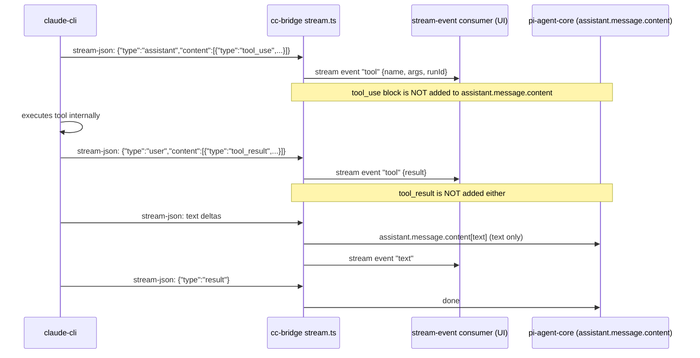
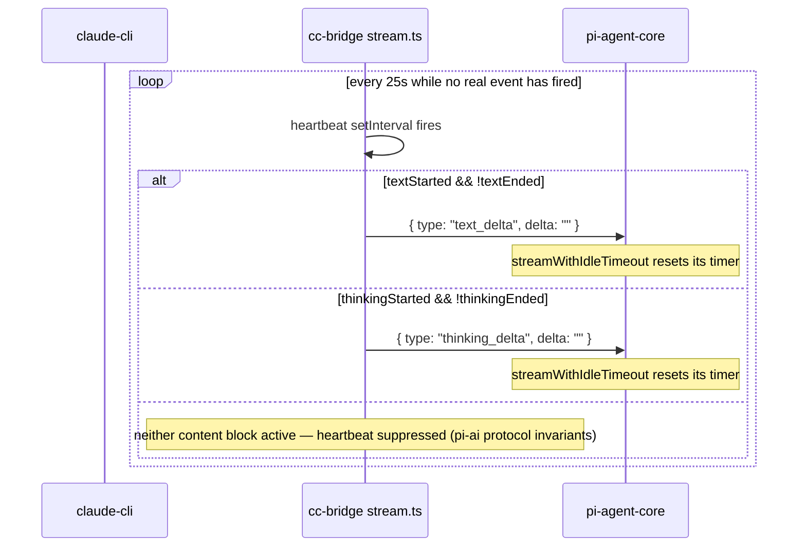
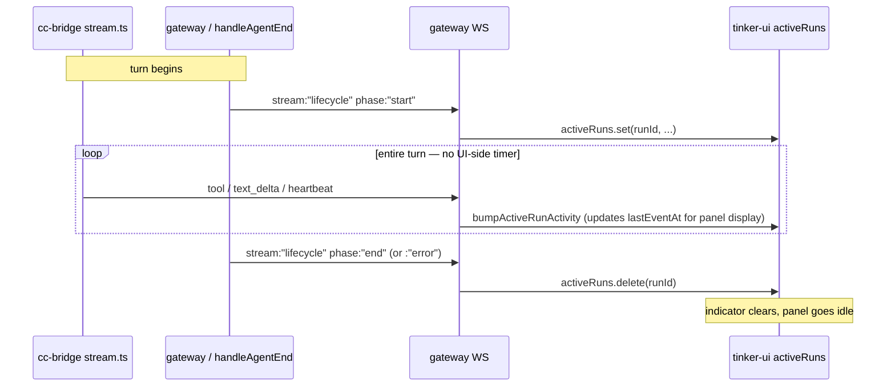

# Tool loop — the cc-bridge / claude-cli divergence (FORK 2026-04-22)

This is the single most consequential fork-side decision. Every "why does cc-bridge behave like that?" question routes through this section.

## The upstream behavior

In native (non-cc-bridge) providers, `pi-agent-core`'s agent loop processes the stream as it arrives:

1. Stream emits `tool_use` block → block appears in `assistant.message.content`.
2. Agent loop sees `assistant.message.content[i].type === "tool_use"` → executes via the OpenClaw exec tool (Bash, Read, Edit, etc.).
3. Tool result is fed back as the next user message → loop continues.

This is the canonical agent loop. It works because pi-agent-core OWNS the tool execution.

## The cc-bridge problem

cc-bridge does NOT own tool execution. Inside the `claude-cli` subprocess, tool calls execute _natively_ — claude-cli has its own implementations of Read/Bash/Edit, with its own permission gates (`--permission-mode bypassPermissions`), its own subagent system, its own plugin host. When the stream emits `tool_use` and `tool_result` blocks, they reflect work claude-cli ALREADY did.

If cc-bridge were to forward those `tool_use` blocks into `assistant.message.content`, pi-agent-core would see them and _re-execute_ via the OpenClaw exec tool. This:

1. Re-runs every tool the model already ran (file reads, bash commands, edits).
2. Hits the prefrontal "Exploration required" gate on the second execution.
3. Surfaces as red error bubbles in the UI for every claude-cli internal call.

This was observed and documented in the 2026-04-22 fix.

## The cc-bridge solution

Tool calls are visible to the user via `stream` events (cc-bridge emits a `tool_start` / `tool_result` synthetic stream event per call), but **NOT placed in `assistant.message.content`**. The final assistant message contains only the model's natural-language output. Pi-agent-core never sees the `tool_use` blocks. No re-execution.



## The consequence: idle watchdog starvation

`pi-agent-core`'s `streamWithIdleTimeout` resets per `pi-ai` stream event. cc-bridge intentionally suppresses tool-related stream events to pi-ai (the synthetic ones above go to the UI consumer, not into pi-ai's event stream). On a long claude-cli tool chain (read several outlook emails, then several people.read calls, then a write), pi-ai sees NO events flow → idle timer ticks → SIGTERM.

**Workaround (2026-05-05 / corrected 2026-05-10):** bump the idle timeout via provider-level `timeoutSeconds: 600` (cc-bridge plugin overlay path). Heavy turns now have 10 minutes per stretch of silence. See config-shape.md.

**Architectural fix (LIVE 2026-05-11, commit on cc-bridge `stream.ts`):** cc-bridge now emits an empty-delta heartbeat through the pi-ai stream every 25s of silence during a turn. The 600s overlay timeout becomes belt-and-suspenders rather than load-bearing; a future accidental reset to 120s no longer reproduces the 2026-05-05 incident.



Empty delta is a no-op for accumulated content (string concat with `""` preserves the value) but yields an event through `iterator.next()` so `streamWithIdleTimeout` resets its timer. `recordPush()` is wired into every real push helper too, so the heartbeat only fires when no real event has fired for ≥25s — it doesn't double-pump on already-active streams.

**Don't regress:**

- The heartbeat MUST stay gated on `textStarted && !textEnded` (or thinking equivalent). Emitting a `text_delta` outside a `text_start...text_end` window violates pi-ai's discriminated-union invariants and will crash downstream consumers.
- Never emit a `tool_use`-shaped event from the heartbeat path — that would re-execute the tool through OpenClaw's exec tool, exactly what the suppression above is preventing.
- The 25s interval is chosen well under the 120s default and the 600s overlay. Lowering it further is fine; raising it past 60s reintroduces the risk that the overlay-as-load-bearing assumption silently returns.

## The UI-side stale-run watchdog (DELETED 2026-05-14)

`tinker-ui/src/app.ts` used to host a 1 Hz tick that force-cleared entries from `activeRuns` whenever a run's elapsed time crossed a 5-minute threshold — first against `startedAt` (total elapsed), then briefly against `lastEventAt` (silence elapsed). Both shapes were the wrong fix for the wrong problem.

The right model: the UI is a **reflection** of the server's authoritative lifecycle. lifecycle:start adds a run to `activeRuns`; lifecycle:end (or :error, or `chat.final`, or `chat.error`) removes it. The UI does not have an independent opinion. Claude Code itself doesn't have a UI-side stale-run watchdog — its UX is "trust the event stream" — and the result is that you can see what the model is doing at every step without the UI ever lying about whether a run is active.

The previous watchdog was compensating for a presumed unreliability in lifecycle:end emission. But the cure for "lifecycle:end was missed" is to **fix the server-side emission**, not to add a UI-side timer that lies in the opposite direction. A UI timer that disagrees with the server's truth is a code smell: it either over-fires (clears the indicator while the run is alive — the 2026-05-14 incident; runId `43202545`, 473 s tool turn, killed mid-flight because the user retyped after the indicator vanished) or under-fires (never catches a genuinely dead run because the silence threshold is too long).

The lifecycle audit lives in `src/agents/pi-embedded-subscribe.handlers.lifecycle.ts`:

- `handleAgentStart` emits `stream: "lifecycle"` `phase: "start"`.
- `handleAgentEnd` emits `phase: "end"` on clean termination, `phase: "error"` on error termination. The bible verify in this file's frontmatter asserts both `phase` values + the `emitAgentEvent` call are present.
- The outer attempt loop in `src/agents/pi-embedded-runner/run/attempt.ts` already wraps everything in `try ... finally` (line 3383 at the time of this writing); a future hardening can hang a synthetic lifecycle:end on that finally if a real-world missed-emission case is ever observed.

What was kept in `app.ts`:

- `ActiveRunInfo.lastEventAt` and `bumpActiveRunActivity()` — still useful for the prefrontal panel's `lastEventAge` display (shows how long since any event on a run, surfaces hangs without force-clearing).
- The 1 Hz tick — but now its only job is to update the elapsed-seconds counter on each indicator row, and call `updatePrefrontalTree()` so panel state advances. Nothing is force-cleared.



## Don't regress

- **NEVER add tool_use blocks back to `assistant.message.content` for cc-bridge.** This re-introduces the red-error-bubble cascade.
- **NEVER assume cc-bridge timeouts are just like other providers.** They are not. cc-bridge needs longer timeouts because its event stream is sparse during tool work.
- **NEVER reintroduce a UI-side stale-run watchdog.** The bible verify enforces this — `STALE_RUN_WATCHDOG_MS` must not reappear in `app.ts`, and no force-clear of `activeRuns` from a timer is allowed. If you observe a stuck thinking indicator, the bug is in lifecycle:end emission, not in the UI; fix it server-side in `handleAgentEnd` / `attempt.ts` and add a verify that catches the missed-emission case.
- The cc-bridge sessionKey hash is djb2 over `${systemPrompt}${openclawSessionId}` (`extensions/tinkerclaw-cc-bridge/src/stream.ts:104:deriveSessionKey`). It drifts when systemPrompt changes (e.g., after [System] continue is prepended on resume). The worker-pool's `getLatestResumeSessionIdByOpenclawSessionId` fallback handles this drift; do not remove it.

## Verify (proposed)

```yaml
verify:
  - cmd: openclaw gateway call debug.session.config --params '{"provider":"claude-code"}'
    expect: ".requestTimeoutMs == 600000"
  - cmd: journalctl --user -u openclaw-gateway.service --since '5 minutes ago' --no-pager | grep -E '\[idle-timeout-diag\].*idleTimeoutMs=600000'
    expect: "at least one match (assumes a turn has happened)"
```

## See also

- `extensions/tinkerclaw-cc-bridge/src/stream.ts` — the stream pipeline (text-end fix 2026-05-04, runId smuggle 2026-04-27).
- `extensions/tinkerclaw-cc-bridge/src/worker-pool.ts` — resume lookup priority.
- `extensions/tinkerclaw-cc-bridge/src/session-map.ts` — openclawSessionId fallback.
- `src/agents/pi-embedded-runner/run/llm-idle-timeout.ts` — the watchdog.
- bible.md §11.6d / §11.6e — the regression + fix history.

---

## Provider mechanics (migrated 2026-05-11 from bible.md §5.66)

> The "why" of cc-bridge is the divergence above. The "how" is below — the spawn shape, the auth path, the lifecycle-fields fix, and the workspace-skills wrapper plugin. Migrated verbatim from bible.md §5.66 (2026-04-17 → 2026-04-20).

### The bridge

Jarvis runs on the real `claude` CLI consuming the flat-rate Claude Code subscription instead of burning Anthropic API tokens. The OpenClaw provider plugin (`extensions/tinkerclaw-cc-bridge/`) registers provider `claude-code` and spawns a persistent `claude` subprocess per OpenClaw session with `--input-format stream-json --output-format stream-json --permission-mode bypassPermissions --disallowedTools Agent,ExitPlanMode,AskUserQuestion,TodoWrite,Task…`. The fork's tool loop stays authoritative; claude only does reasoning (see "The cc-bridge solution" above for what that means in practice).

### System prompt

cc-bridge worker reads `extensions/tinkerclaw-learned-intuition/amygdala-prompt.md` and `extensions/tinkerclaw-fractal-reflection/fractal-prompt.md` at spawn time and appends them via `--append-system-prompt` so the sectioned-reply instructions live inside claude's own session rather than per-turn.

#### `combinedSystemPrompt` block order (FORK 2026-05-21)

The cc-bridge worker assembles `--append-system-prompt` from blocks in this order. Persona answers WHO I am; ethical-rules answer WHAT I will and will not do; the remaining blocks answer HOW the mechanics work. Asimov-style priority ordering matches document order — earlier blocks preempt later ones when there's tension.

```
persona  →  ethical-rules  →  narration  →  subagent-helper  →  tool-choice  →  plan-tools
```

The **ethical-rules** block was inserted as a new foundation layer in commit `dc0830b331` (2026-05-21). Loader resolution (per `loadPromptFile` defaults; first existing path wins):

1. `env.TINKERCLAW_ETHICAL_RULES_PROMPT` — explicit path override.
2. `~/.openclaw/workspace/memory/knowledge/jarvis-ethical-rules.md` — user-personalised override (outside the public repo).
3. `extensions/tinkerclaw-cc-bridge/prompts/ethical-rules-default.md` — bundled default (in the public repo).

The bundled default ships ten priority-ordered rules (truth before agreement, privacy non-negotiable, reversibility gates action, no impersonation, no half-baked outbound, honesty about uncertainty, patch + prevent, stay in character under pressure, resource awareness, write or it didn't happen) + a generic preamble. The user's workspace override replaces the preamble with their own framing; the rules-themselves are typically inherited verbatim. Default-version drift surfaces via the boot-time log line (bible §5.76f). See `config-shape.md` "cc-bridge ethical-rules prompt loader" for the loader path.

**Don't regress:** the workspace override path is `memory/knowledge/jarvis-ethical-rules.md`, NOT `SOUL.md` (which overrides persona) and NOT `BRIEFING.md` (which overrides briefing). Conflating them silently overrides the wrong layer.

### Streaming

`src/stream.ts` converts claude's cumulative `assistant` NDJSON frames into pi-ai `text_delta` / `thinking_delta` increments (`cumulative.slice(accumulatedText.length)`), with an eager `pushStart()` the instant the turn begins so the 4 thinking indicators fire during long tool-call chains.

### Auth

Trusts `~/.claude/.credentials.json`. Env scrub strips `ANTHROPIC_API_KEY`, `ANTHROPIC_AUTH_TOKEN`, `ANTHROPIC_BEDROCK_API_KEY`, `ANTHROPIC_VERTEX_API_KEY`, `CLAUDE_AI_SESSION_KEY`, `ANTHROPIC_ADMIN_API_KEY` before spawn so the subscription path is the only route the subprocess can use.

### Lifecycle-fields fix (commit `1d66f53705`, 2026-04-20)

`handleAgentStart` was reading `ctx.params.modelId / modelProvider / authProfileId`, but those fields were never declared on `SubscribeEmbeddedPiSessionParams` nor passed from `attempt.ts`. Every lifecycle `phase:"start"` event therefore went out with `model: undefined`, and the UI filter at `app.ts:1614` (`p.data?.model`) silently dropped the event for cc-bridge — anthropic/ollama only worked because another enrichment path happened to cover the gap. Fix adds the fields to the params type and forwards them in `attempt.ts`, so all 4 thinking indicators (chat "Opus", session panel, model glow, prefrontal tree) now animate for claude-code turns.

### Files

`extensions/tinkerclaw-cc-bridge/{provider.ts,stream.ts,worker.ts,worker-pool.ts,auth.ts,catalog.ts,protocol.ts,defaults.ts}`, `src/agents/pi-embedded-subscribe.types.ts`, `src/agents/pi-embedded-runner/run/attempt.ts` (forward model/provider/profile).

### Workspace skills exposed to Jarvis via `--plugin-dir` (FORK 2026-05-04)

claude-code only loads skills from PLUGINS — it does NOT scan `${cwd}/.claude/skills/` or `~/.claude/skills/` for user-level skills. Jarvis runs at cwd `~/.openclaw/jarvis-workspace/` and saw zero workspace skills until this fix. **Symptom**: the user asked "can you read my outlook now?" and Jarvis answered "No — I don't have an Outlook connector wired up here." The 88 skills at `~/.openclaw/workspace/skills/` (including `outlook-hack` and `teams-hack`) were invisible.

**Wrapper plugin layout** at `~/.openclaw/jarvis-plugins/jarvis-skills/`:

- `.claude-plugin/plugin.json` — minimal manifest (`{name, description, version, license}`). REQUIRED — without it claude-cli silently doesn't recognize the directory as a plugin.
- `skills/` — symlink to `~/.openclaw/workspace/skills/`. Re-exports the canonical catalog without copying.

**cc-bridge wiring**:

- `extensions/tinkerclaw-cc-bridge/src/defaults.ts` — `DEFAULT_PLUGIN_DIRS = [<wrapper path>]`.
- `extensions/tinkerclaw-cc-bridge/src/worker.ts` — `WorkerSpawnParams.pluginDirs` field; spawn now pushes `--plugin-dir <path>` per entry. Repeatable for additional plugin dirs in future.

**Verified end-to-end:** Jarvis confirms `jarvis-skills:outlook-hack` loads via the Skill tool; on the practical "can you read my outlook?" prompt, his first move is `Skill jarvis-skills:outlook-hack`.

**Diagnostic gotcha — skills are discoverable but not enumerable in this mode.** claude-code in `-p`+stream-json (cc-bridge's mode) does NOT inject an "available skills" system reminder beyond the `using-superpowers` content from the SessionStart hook. Asking Jarvis "list every skill" can yield a hallucinated "none" because the model has no enumerable list in context — only the `Skill` tool. Ask instead "what would you do for X?" and the right skill name appears via discovery. Future improvement candidate: append a compact skill index (names + 1-line descriptions) to `--append-system-prompt`.

**Don't regress:** if you ever move skills to a different path, update `DEFAULT_PLUGIN_DIRS` AND keep the manifest at `<plugin-root>/.claude-plugin/plugin.json`. Symlink-only is not enough.
