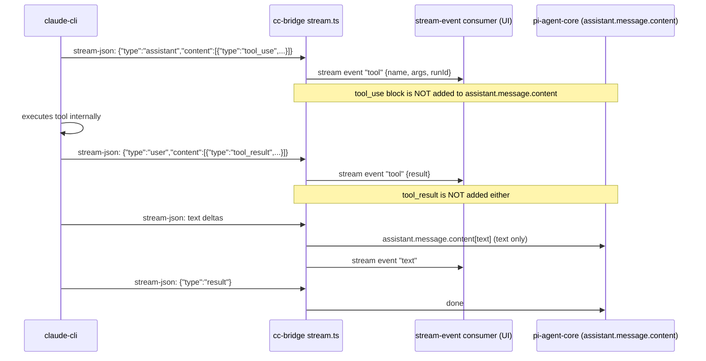
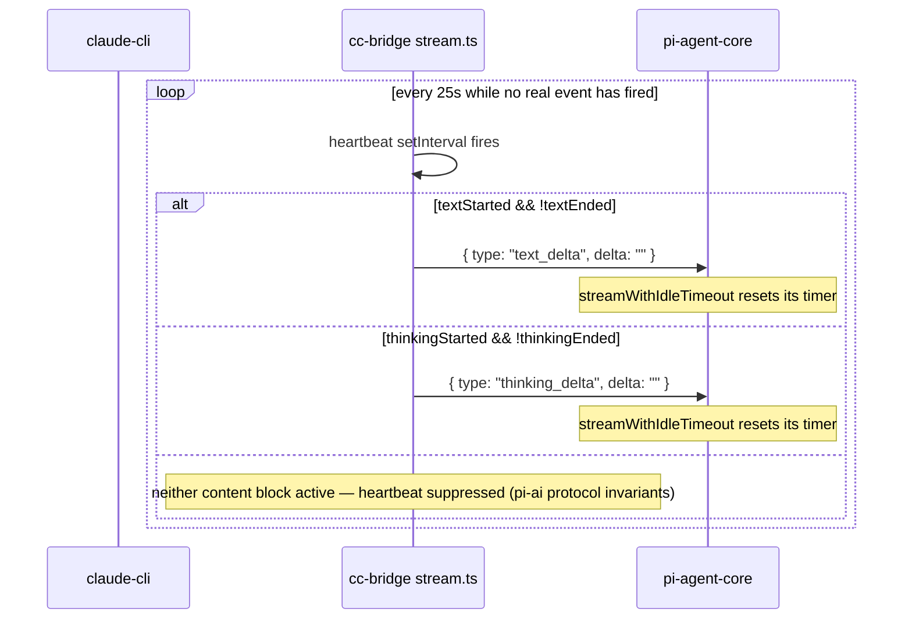
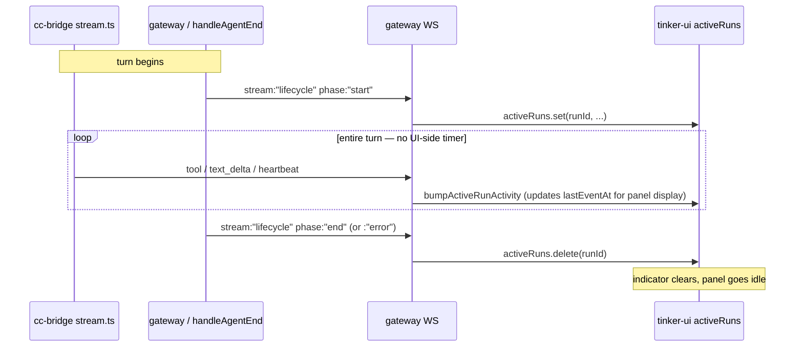

# Tool loop — the cc-bridge / claude-cli divergence (FORK 2026-04-22)

This is the single most consequential fork-side decision. Every "why does cc-bridge behave like that?" question routes through this section.

## The upstream behavior

In native (non-cc-bridge) providers, `pi-agent-core`'s agent loop processes the stream as it arrives:

1. Stream emits `tool_use` block → block appears in `assistant.message.content`.
2. Agent loop sees `assistant.message.content[i].type === "tool_use"` → executes via the OpenClaw exec tool (Bash, Read, Edit, etc.).
3. Tool result is fed back as the next user message → loop continues.

This is the canonical agent loop. It works because pi-agent-core OWNS the tool execution.

## The cc-bridge problem

cc-bridge does NOT own tool execution. Inside the `claude-cli` subprocess, tool calls execute _natively_ — claude-cli has its own implementations of Read/Bash/Edit, with its own permission gates (`--permission-mode bypassPermissions`), its own subagent system, its own plugin host. When the stream emits `tool_use` and `tool_result` blocks, they reflect work claude-cli ALREADY did.

If cc-bridge were to forward those `tool_use` blocks into `assistant.message.content`, pi-agent-core would see them and _re-execute_ via the OpenClaw exec tool. This:

1. Re-runs every tool the model already ran (file reads, bash commands, edits).
2. Hits the prefrontal "Exploration required" gate on the second execution.
3. Surfaces as red error bubbles in the UI for every claude-cli internal call.

This was observed and documented in the 2026-04-22 fix.

## The cc-bridge solution

Tool calls are visible to the user via `stream` events (cc-bridge emits a `tool_start` / `tool_result` synthetic stream event per call), but **NOT placed in `assistant.message.content`**. The final assistant message contains only the model's natural-language output. Pi-agent-core never sees the `tool_use` blocks. No re-execution.



## The consequence: idle watchdog starvation

`pi-agent-core`'s `streamWithIdleTimeout` resets per `pi-ai` stream event. cc-bridge intentionally suppresses tool-related stream events to pi-ai (the synthetic ones above go to the UI consumer, not into pi-ai's event stream). On a long claude-cli tool chain (read several outlook emails, then several people.read calls, then a write), pi-ai sees NO events flow → idle timer ticks → SIGTERM.

**Workaround (2026-05-05 / corrected 2026-05-10):** bump the idle timeout via provider-level `timeoutSeconds: 600` (cc-bridge plugin overlay path). Heavy turns now have 10 minutes per stretch of silence. See config-shape.md.

**Architectural fix (LIVE 2026-05-11, commit on cc-bridge `stream.ts`):** cc-bridge now emits an empty-delta heartbeat through the pi-ai stream every 25s of silence during a turn. The 600s overlay timeout becomes belt-and-suspenders rather than load-bearing; a future accidental reset to 120s no longer reproduces the 2026-05-05 incident.



Empty delta is a no-op for accumulated content (string concat with `""` preserves the value) but yields an event through `iterator.next()` so `streamWithIdleTimeout` resets its timer. `recordPush()` is wired into every real push helper too, so the heartbeat only fires when no real event has fired for ≥25s — it doesn't double-pump on already-active streams.

**Don't regress:**

- The heartbeat MUST stay gated on `textStarted && !textEnded` (or thinking equivalent). Emitting a `text_delta` outside a `text_start...text_end` window violates pi-ai's discriminated-union invariants and will crash downstream consumers.
- Never emit a `tool_use`-shaped event from the heartbeat path — that would re-execute the tool through OpenClaw's exec tool, exactly what the suppression above is preventing.
- The 25s interval is chosen well under the 120s default and the 600s overlay. Lowering it further is fine; raising it past 60s reintroduces the risk that the overlay-as-load-bearing assumption silently returns.

## The UI-side stale-run watchdog (DELETED 2026-05-14)

`tinker-ui/src/app.ts` used to host a 1 Hz tick that force-cleared entries from `activeRuns` whenever a run's elapsed time crossed a 5-minute threshold — first against `startedAt` (total elapsed), then briefly against `lastEventAt` (silence elapsed). Both shapes were the wrong fix for the wrong problem.

The right model: the UI is a **reflection** of the server's authoritative lifecycle. lifecycle:start adds a run to `activeRuns`; lifecycle:end (or :error, or `chat.final`, or `chat.error`) removes it. The UI does not have an independent opinion. Claude Code itself doesn't have a UI-side stale-run watchdog — its UX is "trust the event stream" — and the result is that you can see what the model is doing at every step without the UI ever lying about whether a run is active.

The previous watchdog was compensating for a presumed unreliability in lifecycle:end emission. But the cure for "lifecycle:end was missed" is to **fix the server-side emission**, not to add a UI-side timer that lies in the opposite direction. A UI timer that disagrees with the server's truth is a code smell: it either over-fires (clears the indicator while the run is alive — the 2026-05-14 incident; runId `43202545`, 473 s tool turn, killed mid-flight because the user retyped after the indicator vanished) or under-fires (never catches a genuinely dead run because the silence threshold is too long).

The lifecycle audit lives in `src/agents/embedded-agent-subscribe.handlers.lifecycle.ts`:

- `handleAgentStart` emits `stream: "lifecycle"` `phase: "start"`.
- `handleAgentEnd` emits `phase: "end"` on clean termination, `phase: "error"` on error termination. The bible verify in this file's frontmatter asserts both `phase` values + the `emitAgentEvent` call are present.
- The outer attempt loop in `src/agents/embedded-agent-runner/run/attempt.ts` already wraps everything in `try ... finally` (line 3383 at the time of this writing); a future hardening can hang a synthetic lifecycle:end on that finally if a real-world missed-emission case is ever observed.

What was kept in `app.ts`:

- `ActiveRunInfo.lastEventAt` and `bumpActiveRunActivity()` — still useful for the prefrontal panel's `lastEventAge` display (shows how long since any event on a run, surfaces hangs without force-clearing).
- The 1 Hz tick — but now its only job is to update the elapsed-seconds counter on each indicator row, and call `updatePrefrontalTree()` so panel state advances. Nothing is force-cleared.



## In-flight steer — mid-turn message folds into the live turn (FORK 2026-06-10 / P4)

A message sent while a cc-bridge turn is in flight now **folds into the current answer**, matching Claude Code (whose own loop drains its message queue between tool rounds). Previously a mid-turn message could only run as a **separate next turn** (pi steeringQueue → next `worker.send`), because pi-agent-core cannot inject between claude-cli's internal tool rounds — the whole claude-cli agentic loop is one opaque `worker.send`.

**Why it works:** `claude -p --input-format stream-json` drains additional `{"type":"user",...}` stdin lines mid-turn, between its internal tool rounds (verified empirically 2026-06-10: a stdin user-line injected during a tool chain was acknowledged before the turn's `result` line). So writing to the live subprocess's stdin reaches the model mid-answer.

**The path:**

1. `worker.steer(text)` (`extensions/tinkerclaw-cc-bridge/src/worker.ts`) writes one user line to the already-open persistent stdin — WITHOUT touching `currentTurn`/`turnQueue`/`kill` (the live turn keeps owning its `result`). No-ops between turns; EPIPE-safe.
2. `extensions/tinkerclaw-cc-bridge/src/inflight-worker-registry.ts` tracks `openclawSessionId → live worker` (set around `worker.send` in `stream.ts`) and registers a hook into the core via `registerInflightSteerHook` (`src/agents/embedded-agent-runner/inflight-steer-hook.ts`, stored on `globalThis[Symbol.for(...)]` so it crosses the core/extension bundle split).
3. `runs.ts flushSteerBuffer` calls `tryInflightSteer(sessionId, combined)` FIRST; if a live worker accepts it (folds in), it RETURNS and does NOT also `handle.queueMessage` — so the message is delivered exactly once. Only with no live worker does it fall back to the pi steeringQueue (next-turn, old behaviour).

So: during a live turn → mid-turn fold (`worker.steer`); between turns → next turn (pi steeringQueue → `worker.send`). The 300ms debounce still batches rapid messages into one injection.

**Don't regress (in-flight steer):**

- The two delivery paths MUST stay mutually exclusive (the early `return` in `flushSteerBuffer` after a successful `tryInflightSteer`). Calling both = the message delivered twice (once mid-turn, once as the next round).
- `worker.steer` MUST NOT touch `currentTurn`/`turnQueue`/`kill` — it only writes stdin. Mutating `currentTurn` would orphan the in-flight `send()` promise (caller hangs); killing would defeat the whole "queue not SIGTERM" point.
- The hook MUST live on `globalThis[Symbol.for(...)]`, not a module-level var — the registrar (cc-bridge) and caller (core) can be separate runtime bundles.

## Don't regress

- **NEVER add tool_use blocks back to `assistant.message.content` for cc-bridge.** This re-introduces the red-error-bubble cascade.
- **NEVER assume cc-bridge timeouts are just like other providers.** They are not. cc-bridge needs longer timeouts because its event stream is sparse during tool work.
- **NEVER reintroduce a UI-side stale-run watchdog.** The bible verify enforces this — `STALE_RUN_WATCHDOG_MS` must not reappear in `app.ts`, and no force-clear of `activeRuns` from a timer is allowed. If you observe a stuck thinking indicator, the bug is in lifecycle:end emission, not in the UI; fix it server-side in `handleAgentEnd` / `attempt.ts` and add a verify that catches the missed-emission case.
- The cc-bridge sessionKey hash is djb2 over `${systemPrompt}${openclawSessionId}` (`extensions/tinkerclaw-cc-bridge/src/stream.ts:104:deriveSessionKey`). It drifts when systemPrompt changes (e.g., after [System] continue is prepended on resume). The worker-pool's `getLatestResumeSessionIdByOpenclawSessionId` fallback handles this drift; do not remove it.

## Verify (proposed)

```yaml
verify:
  - cmd: openclaw gateway call debug.session.config --params '{"provider":"claude-code"}'
    expect: ".requestTimeoutMs == 600000"
  - cmd: journalctl --user -u openclaw-gateway.service --since '5 minutes ago' --no-pager | grep -E '\[idle-timeout-diag\].*idleTimeoutMs=600000'
    expect: "at least one match (assumes a turn has happened)"
```

## See also

- `extensions/tinkerclaw-cc-bridge/src/stream.ts` — the stream pipeline (text-end fix 2026-05-04, runId smuggle 2026-04-27).
- `extensions/tinkerclaw-cc-bridge/src/worker-pool.ts` — resume lookup priority.
- `extensions/tinkerclaw-cc-bridge/src/session-map.ts` — openclawSessionId fallback.
- `src/agents/embedded-agent-runner/run/llm-idle-timeout.ts` — the watchdog.
- bible.md §11.6d / §11.6e — the regression + fix history.

---

## Provider mechanics (migrated 2026-05-11 from bible.md §5.66)

> The "why" of cc-bridge is the divergence above. The "how" is below — the spawn shape, the auth path, the lifecycle-fields fix, and the workspace-skills wrapper plugin. Migrated verbatim from bible.md §5.66 (2026-04-17 → 2026-04-20).

### The bridge

Jarvis runs on the real `claude` CLI consuming the flat-rate Claude Code subscription instead of burning Anthropic API tokens. The OpenClaw provider plugin (`extensions/tinkerclaw-cc-bridge/`) registers provider `claude-code` and spawns a persistent `claude` subprocess per OpenClaw session with `--input-format stream-json --output-format stream-json --permission-mode bypassPermissions --disallowedTools Agent,ExitPlanMode,AskUserQuestion,TodoWrite,Task…`. The fork's tool loop stays authoritative; claude only does reasoning (see "The cc-bridge solution" above for what that means in practice).

### System prompt

cc-bridge worker reads `extensions/tinkerclaw-fractal-reflection/fractal-prompt.md` at spawn time and appends it via `--append-system-prompt` so the fractal-reflection instructions live inside claude's own session rather than per-turn. **FORK 2026-06-10 (amygdala retirement):** the per-turn `🧠 AMYGDALA` reply section was retired — `amygdala-prompt.md` is no longer loaded (`PROMPT_FILES` in `worker.ts` holds only the fractal entry) and the file has been deleted. The always-on Amygdala side panel (gate-decision stream) is the feedback surface now; the per-turn reply is just `💬 ANSWER → 🌿 FRACTAL`.

#### Amygdala PreToolUse hook — pre-execution enforcement on the primary runner (FORK 2026-06-11, v3.1)

> **The "observe-only on cc-bridge is a physics limit" claim is RETRACTED.** It was a spawn-config choice, not physics.

The long-standing story elsewhere in this file — the gateway only _observes_ cc-bridge tool calls (it sees `stream:"tool"` events _after_ claude-cli already ran the tool, so it can never block) — held only because cc-bridge never wired claude-cli's own hook system. claude-cli (v2.1.x) accepts `--settings <file>` whose JSON can register a **PreToolUse hook**, and a PreToolUse hook can return a `deny` permission decision that **synchronously blocks the tool — even under `--permission-mode bypassPermissions`** (the bridge's mode). So there _is_ a pre-execution seam; it was simply unused.

v3.1 wires it:

- The `tinkerclaw-learned-intuition` extension compiles its AEGIS rule set (single source of truth: `src/rule-based-gate.ts` `AEGIS_RULES`) into `~/.openclaw/data/amygdala/policy.json` and writes a claude-cli settings file `~/.openclaw/data/amygdala/cc-hook-settings.json` registering a dependency-free hook script (`hook/amygdala-pretooluse.mjs`, staged into the data dir by `src/policy-snapshot.ts`).
- `extensions/tinkerclaw-cc-bridge/src/worker.ts` pushes `--settings <that file>` into the claude spawn argv **iff the file exists** (`AMYGDALA_CC_HOOK_SETTINGS_PATH` in `defaults.ts`). Presence is the enable signal; the amygdala extension owns the file's lifecycle (writes it when `hookEnforcement` is on, deletes it when off). Absent file → identical prior behavior.
- The hook reads the PreToolUse payload on stdin, matches the policy rules, and on an **enforced** match prints `{hookSpecificOutput:{permissionDecision:"deny",…}}`. It is **fail-open** (any error → exit 0, allow), **<100 ms**, and spools every decision to `hook-decisions.jsonl`, which the extension ingests into the live feed — real enforced denials, previously invisible (the strongest feedback signal).
- **Enforce tiers (anti-cry-wolf):** only destructive-EXECUTION rules (`rm -rf /`, `mkfs`, `dd of=/dev/*`, `DROP/TRUNCATE/DELETE`, force-push main, credential exfil) deny; credential-PATTERN rules (a `.env` path, the bare word "password") are observe-only. Scope `"exec"` means a rule matches only execution-tool command text — a `.sql` file containing `DROP TABLE` is content, not an execution, so file-content tools are not scanned in v1.
- The **native** `before_tool_call` path (non-cc-bridge tools) was _also_ never actually blocking: it returned `{abort,message}`, but the host honours `{block,blockReason}` (see `src/plugins/hook-types.ts` `PluginHookBeforeToolCallResult` + `src/agents/pi-tools.before-tool-call.ts` `if (hookResult?.block)`). v3.1 returns the correct shape, so the native hard floor now actually denies. Config keys: `config-shape.md`. The rule list has a single owner: `rule-based-gate.ts`.

#### `combinedSystemPrompt` block order (FORK 2026-05-21)

The cc-bridge worker assembles `--append-system-prompt` from blocks in this order. Persona answers WHO I am; ethical-rules answer WHAT I will and will not do; the remaining blocks answer HOW the mechanics work. Asimov-style priority ordering matches document order — earlier blocks preempt later ones when there's tension.

```
persona  →  ethical-rules  →  narration  →  subagent-helper  →  tool-choice  →  plan-tools
```

The **ethical-rules** block was inserted as a new foundation layer in commit `dc0830b331` (2026-05-21). Loader resolution (per `loadPromptFile` defaults; first existing path wins):

1. `env.TINKERCLAW_ETHICAL_RULES_PROMPT` — explicit path override.
2. `~/.openclaw/workspace/memory/knowledge/jarvis-ethical-rules.md` — user-personalised override (outside the public repo).
3. `extensions/tinkerclaw-cc-bridge/prompts/ethical-rules-default.md` — bundled default (in the public repo).

The bundled default ships ten priority-ordered rules (truth before agreement, privacy non-negotiable, reversibility gates action, no impersonation, no half-baked outbound, honesty about uncertainty, patch + prevent, stay in character under pressure, resource awareness, write or it didn't happen) + a generic preamble. The user's workspace override replaces the preamble with their own framing; the rules-themselves are typically inherited verbatim. Default-version drift surfaces via the boot-time log line (bible §5.76f). See `config-shape.md` "cc-bridge ethical-rules prompt loader" for the loader path.

**Don't regress:** the workspace override path is `memory/knowledge/jarvis-ethical-rules.md`, NOT `SOUL.md` (which overrides persona) and NOT `BRIEFING.md` (which overrides briefing). Conflating them silently overrides the wrong layer.

### Streaming

`src/stream.ts` converts claude's NDJSON output into pi-ai `text_delta` / `thinking_delta` increments. Two complementary input shapes both feed the same `pushTextDelta` / `pushThinkingDelta` helpers:

- **Fine-grained path (FORK 2026-05-23 — `--include-partial-messages` flag, commit `3e343cb5ee`):** the cc-bridge spawn args now include `--include-partial-messages` (`extensions/tinkerclaw-cc-bridge/src/worker.ts:338`), which makes claude-cli emit `stream_event` lines carrying `content_block_delta.text_delta` / `.thinking_delta` events token-by-token. Without this flag claude-cli only emits the `assistant` block-complete frames (one big chunk per text block at end), so the UI saw replies appear all at once at the END of the turn instead of streaming. Diagnostic recipe: `openclaw logs | grep 'spawning claude'` — the args list shows the flag.
- **Cumulative path (legacy):** claude-cli's periodic `assistant` NDJSON frames carry the cumulative per-block text. Handler slices `cumulative.slice(blockTextSeen.get(bi) ?? "")` and pushes the new tail.

Both paths fire when `--include-partial-messages` is on. The fine-grained handler **MUST** mirror every pushed delta into `blockTextSeen[ev.index] += delta` so the cumulative-handler's slice condition (`cumulative.length > prev.length && cumulative.startsWith(prev)`) doesn't re-push the same text. **Don't regress (commit `d32e44cc24`, 2026-05-24):** before this sync, every block of streamed text was emitted twice — once via fine-grained deltas, once via the cumulative re-push (`prev = ""` → it sliced the whole cumulative as a "new delta"). The duplicate appeared in the rendered bubble as `"Good catches…Good catches…## 💬 ANSWER…"`, and with gap-split bubbles in the mix the `_segmentStart` cursors went past `finalText.length` during tail-recover, surfacing to the user as "truncation."

The `pushStart()` is eager — fires the instant the turn begins so the 4 thinking indicators (chat label, session panel, model glow, prefrontal tree) animate during long tool-call chains.

### Producer additions — forward-compat blocks, turn-incomplete badge, result flattening (FORK 2026-06-11)

Three additions on the cc-bridge **producer** side (the stream→pi-ai converter, `stream.ts`, plus the wire-shape decls in `protocol.ts`). None changes the suppression invariant above; they harden the producer against schema drift and surface non-success terminations.

#### 1. Forward-compat `CcContentBlock` arms

`protocol.ts`'s `CcContentBlock` union gains three named arms — `server_tool_use`, `web_search_tool_result`, and `redacted_thinking` — corresponding to the raw Anthropic server-tool / web-search-result / redacted-thinking block shapes.

**LIVE FACT (why they are inert today):** claude-cli currently **normalizes** its built-in `WebSearch` / `WebFetch` tools into plain `tool_use` / `tool_result` blocks before they ever reach cc-bridge's stdout. So in the present claude-cli schema these three arms **never match** — every web-search round arrives as ordinary `tool_use`/`tool_result` and flows through the existing handlers. The arms are pure **forward-compat**: they fire only if a future claude-cli schema bump starts surfacing the raw Anthropic server-tool blocks (or raw `redacted_thinking`) on the wire. Naming them now keeps such a bump from silently dropping into the open-ended `{ type: string; [key: string]: unknown }` forward-compat catch-all (where it would decode to nothing) and gives the decoder a typed branch to grow into.

**Don't regress:** keep the three named arms even though they are inert. Deleting them as "dead code" is the trap — they are a deliberate landing pad for a schema bump, and `config-shape.md`'s dead-code register should NOT list them as removable.

#### 2. `phase:"turn-incomplete"` lifecycle event

The result/done branch now emits a free-form **`stream:"lifecycle"` `phase:"turn-incomplete"`** agent event (via `emitAgentEvent`, same envelope shape as the `phase:"start"` / `phase:"end"` events) for **any non-success `result.subtype`** — `error_max_turns`, `error_during_execution`, and the generic `error` subtype all badge.

**Placement is load-bearing:** the emit sits in the result/done branch **BEFORE the `is_error` early-return** (the `if (result.is_error && …) { … return; }` block that resets accumulated text to the `__ERR_ENV__` envelope and returns). If it were placed after, the `is_error` path would `return` first and the auth/billing-error and `error_during_execution` cases would never badge. By sitting ahead of that return, every non-success subtype is reported regardless of which downstream arm (envelope-reset, tail-recover, or clean done) ultimately runs.

**Why a free-form lifecycle event and NOT a pi-ai `StopReason`:** the `done` event cc-bridge pushes is **always `stopReason:"stop"`** (pi-agent-core honors the final message and replaces partial content; cc-bridge has no incomplete `done` shape). The pi-ai `StopReason` discriminated union has **no `"incomplete"` member** — pushing one would violate pi-ai's invariants exactly like an out-of-window `text_delta` would. So "this turn ended in a non-success subtype" cannot ride the `StopReason` enum; it travels as a free-form `lifecycle` event the UI consumer reads independently of the `done` message. The thinking indicator still clears on the subsequent `phase:"end"` from the `finally` block; `turn-incomplete` is an additive badge, not a replacement for `end`.

**Don't regress:** keep `turn-incomplete` BEFORE the `is_error` early-return, and do NOT try to express it as a `StopReason` — `done` stays `stopReason:"stop"`.

#### 3. Exported `flattenResultContent` helper

The `tool_result` content-flattening that was inline in the `user`-role stream-line handler (a `tool_result.content` is `string | CcContentBlock[]`; the array form must be reduced to plain text by concatenating the `text` of its `text` blocks) is now an **exported `flattenResultContent` helper**. It is the single place that turns a `CcContentBlock` `tool_result` payload into the `resultText` string fed to `emitToolResult`, so the array-of-blocks case and the plain-string case decode identically everywhere they appear.

### Per-session thinking budget — `MAX_THINKING_TOKENS` (FORK 2026-06-11)

cc-bridge now sets a **per-session thinking budget** on the spawned `claude` child via the native Claude Code env knob `MAX_THINKING_TOKENS`. This is the **third** native Claude Code env var cc-bridge sets on the child, alongside `CLAUDE_CODE_MAX_OUTPUT_TOKENS` (the output cap) — and like that one it is added to `worker.ts`'s `allowedKeys` so the env scrub (which strips `ANTHROPIC_API_KEY` et al., see Auth) lets it through to the subprocess. It is **set from the resolved per-session think level**: a higher think level buys the model a bigger interleaved-thinking budget for the turn.

#### Level → budget map

The per-session think level maps to a `MAX_THINKING_TOKENS` value as follows:

| level      | `MAX_THINKING_TOKENS`               |
| ---------- | ----------------------------------- |
| `off`      | **omitted** (var not set — NOT `0`) |
| `minimal`  | 2 000                               |
| `low`      | 4 000                               |
| `medium`   | 8 000                               |
| `adaptive` | 8 000                               |
| `high`     | 16 000                              |
| `xhigh`    | 22 000                              |
| `max`      | 28 000                              |

The resolved value is **clamped to `maxOutputTokensFor(model) - 4000`** so the thinking budget can never crowd out the answer — at least 4 000 tokens of the model's output budget are always reserved for the natural-language reply regardless of the level requested. For level `off` the variable is **omitted entirely** (deleted from the child env), not set to `0`: omission lets claude-cli fall back to its own default thinking behaviour, whereas an explicit `0` would be a distinct (and stricter) instruction.

#### The per-run plumbing

The think level is resolved on the core side and travels to the worker spawn through the **existing pi-ai options smuggle** — the same side-channel the run already uses to carry fork-only knobs that pi-ai's typed options shape has no field for:

1. `src/agents/embedded-agent-runner/run/attempt.ts` resolves the per-session think level and writes it onto the pi-ai options as **`__openclawThinkLevel`** (the smuggle key).
2. `extensions/tinkerclaw-cc-bridge/src/stream.ts` reads `__openclawThinkLevel` off the options and passes it down to `pool.getOrCreate(...)`.
3. The worker pool threads it into the `worker` spawn, where `worker.ts` maps the level → budget (table above, clamped) and sets `MAX_THINKING_TOKENS` in the child's `env` (omitting it for `off`).

#### Next-message semantics (env is read at child spawn)

`MAX_THINKING_TOKENS`, like every process env var, is read by the `claude` child **at spawn time only** — it cannot change for an already-running subprocess. So a **pooled worker keeps the budget it was spawned with for the life of that process**: changing the session's think level does NOT re-budget the in-flight (or even the next, same-process) turn. The new level takes effect only when the worker is **respawned** (pool eviction / a fresh worker for the session). In practice: bump the level, and the change lands on the next turn that happens to spawn a fresh child — not necessarily the very next message. This mirrors the heartbeat/idle-timeout knobs, which are likewise per-spawn.

**Don't regress:**

- Keep `MAX_THINKING_TOKENS` in `worker.ts`'s `allowedKeys`. If it falls out of the allow-list, the env scrub strips it before spawn and the per-session budget silently reverts to claude-cli's default for every level.
- For level `off`, **omit** the var — do not set it to `0`. Omission and `0` are different instructions to claude-cli.
- Keep the clamp to `maxOutputTokensFor(model) - 4000`. Without it, a high/xhigh/max level on a small-output model can starve the answer.
- The level travels as `__openclawThinkLevel` on the pi-ai options smuggle; do not try to add a typed pi-ai field for it (pi-ai's options shape is upstream-owned — that is exactly why the smuggle exists).

### Per-session effort visibility — warm-worker LAG fix, the `stream:"effort"` contract, Auto semantics, honest limits (FORK 2026-06-11)

The per-session thinking budget above (`MAX_THINKING_TOKENS`) is set at child **spawn time only**. That spawn-time-only nature created a latency bug, and surfacing "how much did the model actually think this turn" to the UI needed a new server-computed event. Both are documented here.

#### (a) The warm-worker `thinkLevel` LAG + fix

**Root cause:** `worker-pool.ts` `getOrCreate(params)` returned the warm pooled worker the instant it was alive (`existing && existing.isAlive() → return existing`) **without comparing `params.thinkLevel` to the level the warm worker was spawned with**. Because `MAX_THINKING_TOKENS` is read by the `claude` child only at spawn, a level change made on a session that already had a warm worker was **silently swallowed** — the new budget did not take effect until the worker happened to be evicted (idle-TTL or LRU) and respawned, which could be many turns later. The slider moved, the chip claimed the new level, but the running process kept the old budget. That is the **warm-worker `thinkLevel` LAG**.

**Fix:** `getOrCreate` now compares the requested `thinkLevel` against the warm worker's spawned level and, on a change, does one of two things depending on whether the worker is busy:

- **idle warm worker (`!isBusy()`)** → **evict + respawn** with the new `MAX_THINKING_TOKENS`. Respawn uses `--resume <sessionId>` (the same path the post-eviction code already takes), so claude-cli **re-attaches the same conversation thread — history is preserved**; only the env-baked thinking budget changes. The new level is live on **this** turn.
- **busy warm worker (`isBusy()`, mid-turn)** → **defer one turn**: the in-flight turn keeps the budget it was spawned with (env can't change for a running process), the new level is **recorded as pending**, and a **`phase:"think-level-pending"`** lifecycle event is emitted so the UI can badge "new effort applies next turn." The pending level is consumed on the next `getOrCreate` for that session (which respawns the now-idle worker with the new budget).

**Don't regress:** `getOrCreate` MUST keep comparing `thinkLevel` before handing back a warm worker; deleting that comparison reintroduces the LAG. Never kill a **busy** worker to apply a level change — that orphans the in-flight `send()` promise and defeats the queue-not-SIGTERM contract; defer instead.

#### (b) The `stream:"effort"` agent-event contract

cc-bridge's `stream.ts` now emits a **`stream:"effort"`** agent event (same `emitAgentEvent` envelope as the `phase:"start"`/`phase:"end"` lifecycle events) so the UI can show **how much the model actually thought** this turn — not just the requested cap. It is emitted **throttled-live** during the turn (so the chip animates as thinking accumulates) and **once-final** at turn end. Fields:

| field              | meaning                                                                                                                 |
| ------------------ | ----------------------------------------------------------------------------------------------------------------------- |
| `phase`            | `"live"` for the throttled mid-turn emits, `"final"` for the single end-of-turn emit                                    |
| `thinkLevel`       | the resolved per-session level for this turn (`""`/Auto, `off`, `minimal`…`max`)                                        |
| `configuredBudget` | the `MAX_THINKING_TOKENS` value the child was spawned with (the **requested cap**; omitted/null for Auto and for `off`) |
| `thinkingChars`    | `accumulatedThinking.length` so far — the **actual-effort** measure (CHARACTERS of real thinking)                       |
| `hadRealThinking`  | boolean — true once any non-empty thinking delta has arrived (distinguishes "thought" from "answered cold")             |
| `redacted`         | true when the thinking was present but its size is hidden (redacted-thinking block) — present-but-size-unknown          |
| `output_tokens`    | from the result usage; **mixes thinking + answer** (there is no separate thinking-token count — see honest limits)      |
| `num_turns`        | claude-cli's internal turn count for the run                                                                            |

**Computed SERVER-SIDE.** The values are derived inside `stream.ts` from `accumulatedThinking` (and the result usage), so the chip works **at every level including Auto** — the client never sees `accumulatedThinking`, only the converted text deltas, so it could not compute `thinkingChars` itself. **Per-subagent automatically**: `attempt.ts` re-wraps the `streamFn` per attempt, so each spawned subagent's run goes through its own `stream.ts` instance and emits its own `effort` events — no per-subagent wiring needed.

#### (c) The `think-level-pending` lifecycle phase

When a level change lands on a **busy** warm worker (see (a)), `stream.ts` emits a free-form **`stream:"lifecycle"` `phase:"think-level-pending"`** event carrying the pending level. The UI reads it to badge that the **new effort applies on the next turn**, not the in-flight one. Like `phase:"turn-incomplete"`, it is an **additive** badge — it does not replace `phase:"end"` and does not ride the pi-ai `StopReason` enum (which has no member for it).

#### (d) AUTO semantics (`thinkLevel === ""`)

`thinkLevel === ""` (the Auto stop) means **`MAX_THINKING_TOKENS` is OMITTED** from the child env — the model **decides its own thinking budget** for the turn. Auto is **NOT** `off`, and **NOT** a fixed tier: a live Auto turn was observed producing **3 381 chars of real thinking**. **Never set the env to `0`** for Auto (or for `off`) — `0` is a distinct, stricter instruction to claude-cli; omission is the only correct encoding for "let the model choose."

**⚠ Red herring — the gateway-log `thinking.len` field is ALWAYS `0`.** The `[duprep] … thinking.len=N` / `progress … thinking.len=N` log lines in `stream.ts` report `0` even on a turn with thousands of chars of real thinking, so DO NOT use `thinking.len` to judge whether the model thought. The real thinking measure is **`accumulated.len` / `accumulatedThinking.length`** (the same value `thinkingChars` carries in the effort event). Reading `thinking.len` as "the model didn't think" is the trap.

#### (e) HONEST LIMITS — there is no provider reasoning-token count

There is **no provider-reported reasoning-token count** available to cc-bridge: claude-cli's usage payload (`CcUsage`) has **no thinking-token field**, and `output_tokens` **mixes thinking + answer** in one number. So the honest "actual effort" measure is **thinking CHARACTERS (`thinkingChars`) plus the `hadRealThinking` boolean** — never a fabricated reasoning-token number. Do not synthesize a "reasoning tokens: N" figure; if a token-shaped number is shown anywhere it can only be `configuredBudget` (the requested cap) or `output_tokens` (the mixed total), each labelled as such. **Non-claude providers do not route through cc-bridge**, so they emit **no `effort` event at all** — the chip is a claude-code-only surface, and its absence on other providers is correct, not a bug.

**Don't regress (effort visibility):**

- `thinkingChars` / `hadRealThinking` MUST be computed in `stream.ts` from `accumulatedThinking`, never on the client (the client lacks the raw thinking stream).
- Never read the log `thinking.len` field as the effort measure — it is always `0`; use `accumulatedThinking.length`.
- For Auto (`""`) and `off`, OMIT `MAX_THINKING_TOKENS`; never write `0`.
- Never present `output_tokens` or any token number as a "reasoning-token count" — there is no such count; the honest effort measure is chars + a boolean.

### Auth

Trusts `~/.claude/.credentials.json`. Env scrub strips `ANTHROPIC_API_KEY`, `ANTHROPIC_AUTH_TOKEN`, `ANTHROPIC_BEDROCK_API_KEY`, `ANTHROPIC_VERTEX_API_KEY`, `CLAUDE_AI_SESSION_KEY`, `ANTHROPIC_ADMIN_API_KEY` before spawn so the subscription path is the only route the subprocess can use.

### Lifecycle-fields fix (commit `1d66f53705`, 2026-04-20)

`handleAgentStart` was reading `ctx.params.modelId / modelProvider / authProfileId`, but those fields were never declared on `SubscribeEmbeddedAgentSessionParams` nor passed from `attempt.ts`. Every lifecycle `phase:"start"` event therefore went out with `model: undefined`, and the UI filter at `app.ts:1614` (`p.data?.model`) silently dropped the event for cc-bridge — anthropic/ollama only worked because another enrichment path happened to cover the gap. Fix adds the fields to the params type and forwards them in `attempt.ts`, so all 4 thinking indicators (chat "Opus", session panel, model glow, prefrontal tree) now animate for claude-code turns.

### Files

`extensions/tinkerclaw-cc-bridge/{provider.ts,stream.ts,worker.ts,worker-pool.ts,auth.ts,catalog.ts,protocol.ts,defaults.ts}`, `src/agents/embedded-agent-subscribe.types.ts`, `src/agents/embedded-agent-runner/run/attempt.ts` (forward model/provider/profile).

### Workspace skills exposed to Jarvis via `--plugin-dir` (FORK 2026-05-04)

claude-code only loads skills from PLUGINS — it does NOT scan `${cwd}/.claude/skills/` or `~/.claude/skills/` for user-level skills. Jarvis runs at cwd `~/.openclaw/jarvis-workspace/` and saw zero workspace skills until this fix. **Symptom**: the user asked "can you read my outlook now?" and Jarvis answered "No — I don't have an Outlook connector wired up here." The 88 skills at `~/.openclaw/workspace/skills/` (including `outlook-hack` and `teams-hack`) were invisible.

**Wrapper plugin layout** at `~/.openclaw/jarvis-plugins/jarvis-skills/`:

- `.claude-plugin/plugin.json` — minimal manifest (`{name, description, version, license}`). REQUIRED — without it claude-cli silently doesn't recognize the directory as a plugin.
- `skills/` — symlink to `~/.openclaw/workspace/skills/`. Re-exports the canonical catalog without copying.

**cc-bridge wiring**:

- `extensions/tinkerclaw-cc-bridge/src/defaults.ts` — `DEFAULT_PLUGIN_DIRS = [<wrapper path>]`.
- `extensions/tinkerclaw-cc-bridge/src/worker.ts` — `WorkerSpawnParams.pluginDirs` field; spawn now pushes `--plugin-dir <path>` per entry. Repeatable for additional plugin dirs in future.

**Verified end-to-end:** Jarvis confirms `jarvis-skills:outlook-hack` loads via the Skill tool; on the practical "can you read my outlook?" prompt, his first move is `Skill jarvis-skills:outlook-hack`.

**Diagnostic gotcha — skills are discoverable but not enumerable in this mode.** claude-code in `-p`+stream-json (cc-bridge's mode) does NOT inject an "available skills" system reminder beyond the `using-superpowers` content from the SessionStart hook. Asking Jarvis "list every skill" can yield a hallucinated "none" because the model has no enumerable list in context — only the `Skill` tool. Ask instead "what would you do for X?" and the right skill name appears via discovery. Future improvement candidate: append a compact skill index (names + 1-line descriptions) to `--append-system-prompt`.

**Don't regress:** if you ever move skills to a different path, update `DEFAULT_PLUGIN_DIRS` AND keep the manifest at `<plugin-root>/.claude-plugin/plugin.json`. Symlink-only is not enough.
