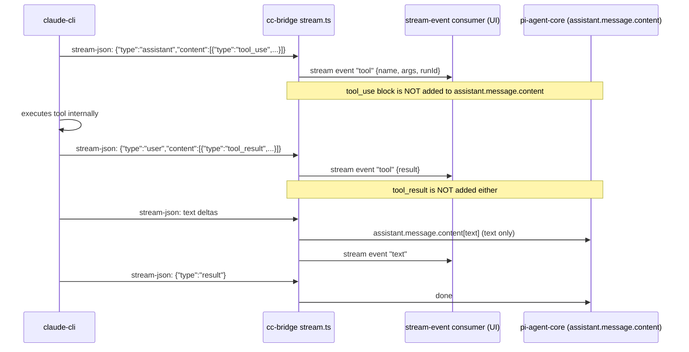
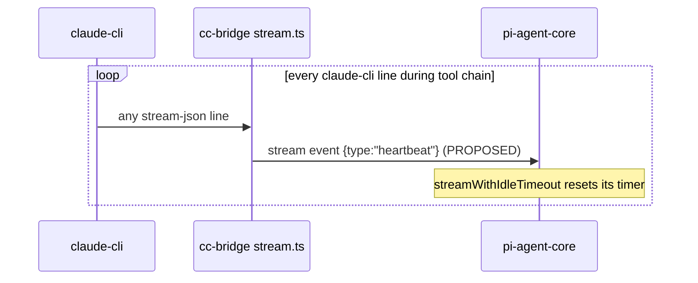

# Tool loop — the cc-bridge / claude-cli divergence (FORK 2026-04-22)

This is the single most consequential fork-side decision. Every "why does cc-bridge behave like that?" question routes through this section.

## The upstream behavior

In native (non-cc-bridge) providers, `pi-agent-core`'s agent loop processes the stream as it arrives:

1. Stream emits `tool_use` block → block appears in `assistant.message.content`.
2. Agent loop sees `assistant.message.content[i].type === "tool_use"` → executes via the OpenClaw exec tool (Bash, Read, Edit, etc.).
3. Tool result is fed back as the next user message → loop continues.

This is the canonical agent loop. It works because pi-agent-core OWNS the tool execution.

## The cc-bridge problem

cc-bridge does NOT own tool execution. Inside the `claude-cli` subprocess, tool calls execute _natively_ — claude-cli has its own implementations of Read/Bash/Edit, with its own permission gates (`--permission-mode bypassPermissions`), its own subagent system, its own plugin host. When the stream emits `tool_use` and `tool_result` blocks, they reflect work claude-cli ALREADY did.

If cc-bridge were to forward those `tool_use` blocks into `assistant.message.content`, pi-agent-core would see them and _re-execute_ via the OpenClaw exec tool. This:

1. Re-runs every tool the model already ran (file reads, bash commands, edits).
2. Hits the prefrontal "Exploration required" gate on the second execution.
3. Surfaces as red error bubbles in the UI for every claude-cli internal call.

This was observed and documented in the 2026-04-22 fix.

## The cc-bridge solution

Tool calls are visible to the user via `stream` events (cc-bridge emits a `tool_start` / `tool_result` synthetic stream event per call), but **NOT placed in `assistant.message.content`**. The final assistant message contains only the model's natural-language output. Pi-agent-core never sees the `tool_use` blocks. No re-execution.



## The consequence: idle watchdog starvation

`pi-agent-core`'s `streamWithIdleTimeout` resets per `pi-ai` stream event. cc-bridge intentionally suppresses tool-related stream events to pi-ai (the synthetic ones above go to the UI consumer, not into pi-ai's event stream). On a long claude-cli tool chain (read several outlook emails, then several people.read calls, then a write), pi-ai sees NO events flow → idle timer ticks → SIGTERM.

**Workaround (2026-05-05 / corrected 2026-05-10):** bump the idle timeout via provider-level `timeoutSeconds: 600` (cc-bridge plugin overlay path). Heavy turns now have 10 minutes per stretch of silence. See config-shape.md.

**Architectural follow-up (open):** emit a heartbeat-only stream event from cc-bridge per claude-cli line during tool work. The heartbeat resets the idle timer without being a `tool_use` block (so it doesn't re-execute). Then the 600s timeout becomes belt-and-suspenders rather than load-bearing.



The heartbeat event has no semantic content; its only job is to reset the timer.

## Don't regress

- **NEVER add tool_use blocks back to `assistant.message.content` for cc-bridge.** This re-introduces the red-error-bubble cascade.
- **NEVER assume cc-bridge timeouts are just like other providers.** They are not. cc-bridge needs longer timeouts because its event stream is sparse during tool work.
- The cc-bridge sessionKey hash is djb2 over `${systemPrompt}${openclawSessionId}` (`extensions/tinkerclaw-cc-bridge/src/stream.ts:104:deriveSessionKey`). It drifts when systemPrompt changes (e.g., after [System] continue is prepended on resume). The worker-pool's `getLatestResumeSessionIdByOpenclawSessionId` fallback handles this drift; do not remove it.

## Verify (proposed)

```yaml
verify:
  - cmd: openclaw gateway call debug.session.config --params '{"provider":"claude-code"}'
    expect: ".requestTimeoutMs == 600000"
  - cmd: journalctl --user -u openclaw-gateway.service --since '5 minutes ago' --no-pager | grep -E '\[idle-timeout-diag\].*idleTimeoutMs=600000'
    expect: "at least one match (assumes a turn has happened)"
```

## See also

- `extensions/tinkerclaw-cc-bridge/src/stream.ts` — the stream pipeline (text-end fix 2026-05-04, runId smuggle 2026-04-27).
- `extensions/tinkerclaw-cc-bridge/src/worker-pool.ts` — resume lookup priority.
- `extensions/tinkerclaw-cc-bridge/src/session-map.ts` — openclawSessionId fallback.
- `src/agents/pi-embedded-runner/run/llm-idle-timeout.ts` — the watchdog.
- bible.md §11.6d / §11.6e — the regression + fix history.
