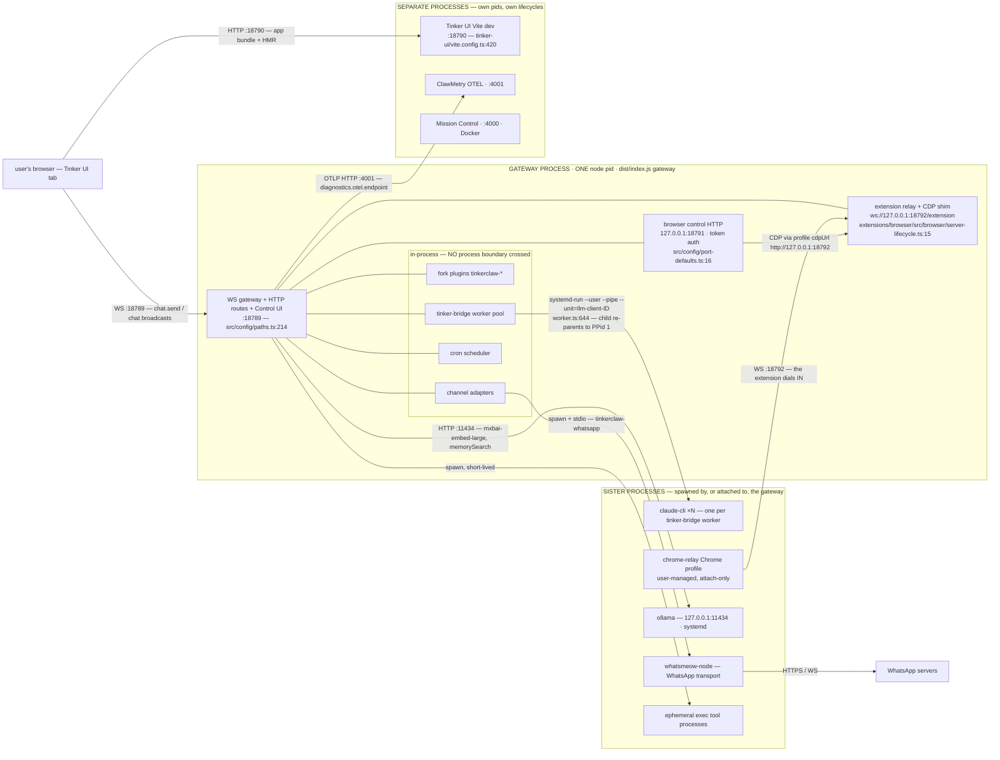
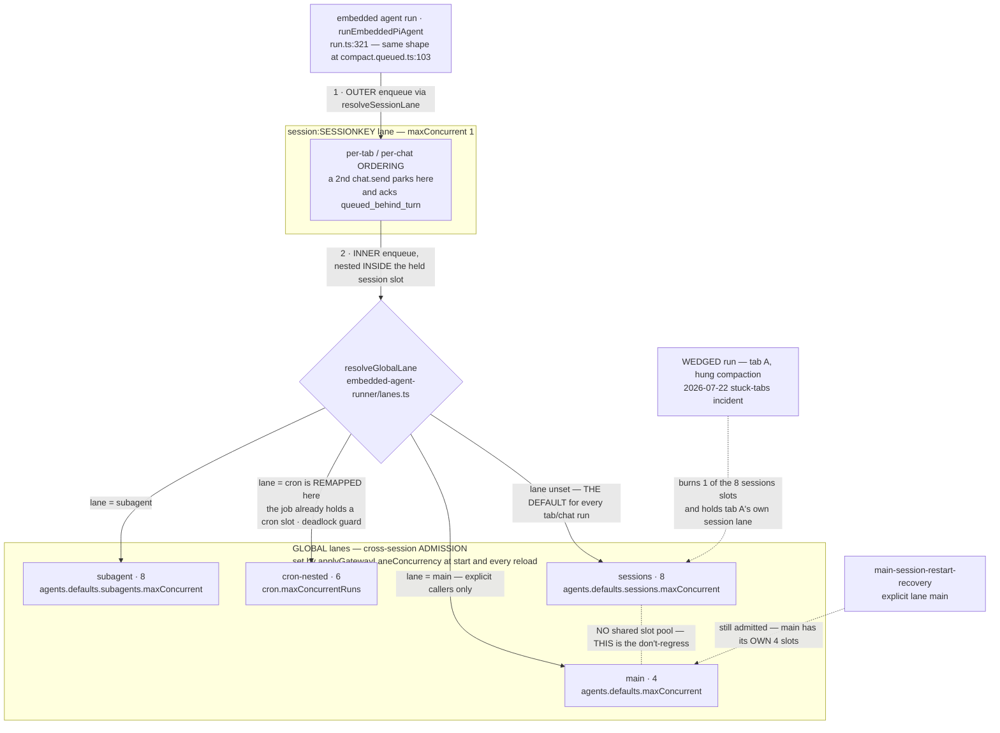
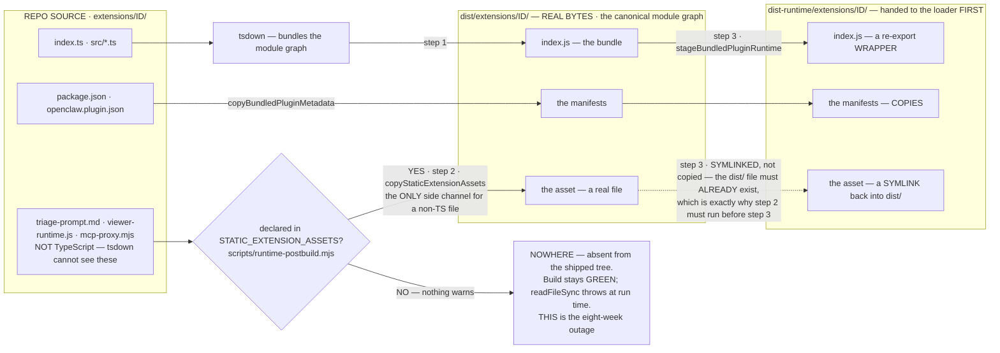
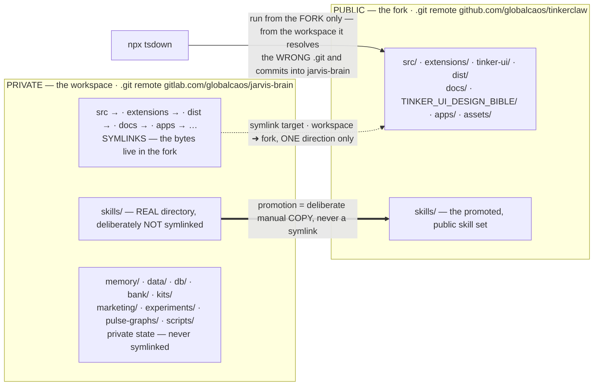

# Topology — components, ports, plugins, channels, symlinks

**How this optic is checked (2026-08-04).** Every multi-line _program_ that used to be pasted into this file's `verify:` frontmatter now lives in `scripts/bible/topology-*.mjs`, and the frontmatter entry is a one-line pointer at it. The entries that were already single-line greps stayed exactly as they were — they were never the problem. That split is `FOUNDATION.md` §"Three different jobs, three different homes": this file's job is to EXPLAIN, the scripts' job is to CHECK that the explanation still matches `src/`. Every invariant those scripts assert is also stated in words in the section it belongs to — if a rule can only be learned by reading a `.mjs`, the prose here is missing something. Two consequences worth knowing. Every check in this optic is now **source-only**: it reads files in this repo and never starts, calls or waits on a gateway, because "the daemon answered" is not evidence that a document is true — round-trips and liveness are `probes.md`'s job and are already owned there. And when a script and this file disagree, **this file is right and the script is the bug**.

## Process map

| Process                | Port  | Purpose                                           | Source                                      |
| ---------------------- | ----- | ------------------------------------------------- | ------------------------------------------- |
| OpenClaw gateway       | 18789 | WebSocket gateway + HTTP routes + Control UI      | `dist/index.js gateway --port 18789`        |
| Tinker UI Vite dev     | 18790 | HMR-enabled webchat dev server                    | `cd tinker-ui && vite --port 18790`         |
| Browser relay + health | 18792 | extension WebSocket + CDP endpoint (Chrome relay) | gateway-internal                            |
| Browser control HTTP   | 18791 | `127.0.0.1` token-auth HTTP for browser commands  | gateway-internal                            |
| ClawMetry OTEL         | 4001  | traces + metrics endpoint                         | `~/src/clawmetry/` (separate process)       |
| Mission Control        | 4000  | dashboard (Docker)                                | `~/src/mission-control/` (separate process) |

**The gateway process is the central anchor.** Everything fork-side runs in-process under it: plugins, channel adapters, cron scheduler, the tinker-bridge worker pool. Subprocesses are claude-cli per tinker-bridge worker (re-parented to systemd via `--pipe`), whatsmeow-node binary for WhatsApp transport, and ephemeral exec tool processes.

**D1 — the process boundary.** Read one thing off this diagram: three of the ports in the table above (18789, 18791, 18792) are surfaces of the SAME pid, not three processes. Measured 2026-08-03 with `ss -ltnp` — a single `node` pid held `127.0.0.1:18789`, `[::1]:18789`, `127.0.0.1:18791` and `127.0.0.1:18792`, while `127.0.0.1:18790` was held by a DIFFERENT pid (the Vite dev server). Everything in the other two boxes has its own lifecycle.



Notes on edges the diagram deliberately does or does not draw:

- **Chrome is never launched by the gateway.** `browser.attachOnly` is `true` and the `chrome-relay` profile is `driver: "existing-session"`, so the arrow points INTO the gateway: the extension dials `ws://127.0.0.1:18792/extension` (`chrome-extension/background.js:16`), and browser-control (18791) reaches CDP back over that same socket via the profile's configured `cdpUrl`.
- **18792 belongs to the CORE `browser` plugin, not to `tinkerclaw-browser-relay`** — see the plugin inventory below. `ensureExtensionRelayForProfiles` (`extensions/browser/src/browser/server-lifecycle.ts:17`, called from `runtime-lifecycle.ts:24`) starts the relay whenever ANY profile has `driver: "existing-session"`. The identically-named fork plugin is a de-allowed twin.
- **Mission Control has no edge** because this optic asserts none; it is drawn as a separate process only. ClawMetry's edge IS asserted (`diagnostics.otel.endpoint = http://localhost:4001`, `enabled: true`). Neither 4000 nor 4001 was listening at measurement time — expected for optional sidecars, not a fault.
- **Port-name trap (2026-08-03):** `src/config/port-defaults.ts:15` defines `DEFAULT_BRIDGE_PORT = 18790` with `deriveDefaultBridgePort` = gatewayPort + 1, and **nothing anywhere calls either** — grep across `src/`, `extensions/` and `tinker-ui/` returns only the definitions themselves. In practice 18790 is the Vite dev server's port; the gateway knows it only as a CORS origin for the dev server (`src/agents/context-anatomy-http.ts:60`). Do not read "bridge port" as a gateway listener. A formal entry belongs in `config-shape.md`'s dead-code trap registry.
- **18793 is also live and is NOT in the table above.** `DEFAULT_CANVAS_HOST_PORT = 18793` (`src/config/port-defaults.ts:17`) was observed bound by a third, separate pid on `0.0.0.0` — the only one of these not loopback-bound. Left out of D1 because this optic has never owned a canvas-host row; adding one needs a claim about what runs it.
- **What D1's gate asserts, and what it deliberately does not (2026-08-04).** The invariant behind D1 is an ATTRIBUTION claim: each port drawn here is still _declared_ in the file this optic attributes it to, and 18792 is still bound by the CORE `browser` plugin rather than by its de-allowed fork twin. `scripts/bible/topology-d1-process-boundary.mjs --check=ports` re-reads the five declaration sites; `--check=relay-owner` re-reads the three relay call sites plus `plugins.allow`, so the twin joining the allowlist — which would put two implementations in a race for one port — fails the build. Neither check asks whether anything is LISTENING. A `ss -ltn | grep :18789` proves the daemon is up, not that this page is accurate, and it goes yellow-SKIP on any machine without a running gateway; that question belongs to `probes.md`, which already owns it as check 1 of the post-deploy smoke (`GET 127.0.0.1:18789/health`). The old liveness entry was dropped from `verify:` for exactly that reason.

## Command-lane topology (FORK 2026-07-24, commit eba0911c7b)

In-process serialization is per-lane queues (`src/process/command-queue.ts`); every embedded agent run enqueues NESTED: its `session:<sessionKey>` lane (ordering within one chat/tab) and then a GLOBAL lane (cross-session admission). Concurrency is applied by `applyGatewayLaneConcurrency` (`src/gateway/server-lanes.ts`) at start + reload.

| Lane                   | Who runs on it                                                  | Concurrency source                                    |
| ---------------------- | --------------------------------------------------------------- | ----------------------------------------------------- |
| `sessions`             | DEFAULT global lane for embedded session runs (all tabs/chats)  | `agents.defaults.sessions.maxConcurrent` (default 8)  |
| `main`                 | Only explicit-Main callers (e.g. main-session-restart-recovery) | `agents.defaults.maxConcurrent` (default 4)           |
| `cron` / `cron-nested` | Cron jobs / their inner LLM work (remapped to avoid deadlock)   | `cron.maxConcurrentRuns` (currently 6)                |
| `subagent`             | Spawned subagent runs                                           | `agents.defaults.subagents.maxConcurrent` (default 8) |
| `session:<key>`        | One per session — the per-tab ordering anchor                   | hardcoded 1                                           |

**D2 — lane nesting.** The direction is load-bearing and easy to draw inside-out. `run.ts:321` is `return enqueueSession(() => { … return enqueueGlobal(async () => …) })` — the per-session lane is the OUTER wrapper (ordering), the global lane the INNER one (admission); `compact.queued.ts:103` has the same shape. A run therefore HOLDS its session slot while it waits for a global slot, which is exactly what contains a wedge to its own tab.



Why the wedge cannot starve `main`: a wedged tab run occupies one `session:<key>` slot (its own tab — that tab blocks, by design) plus one of the eight `sessions` slots. It never touches `main`, so `main`'s four slots stay free for explicit-Main system work. `session:<key>` keeps concurrency 1 without anyone setting it: `command-queue.ts:107` creates every new lane at `maxConcurrent: 1`, and `server-lanes.ts` is the ONLY non-test caller of `setCommandLaneConcurrency` (`command-queue.ts:235`) — it sets exactly the five global lanes and never a `session:` one. Note the diagram shows `cron-nested` but no `cron` outcome: `resolveGlobalLane` never RETURNS `cron`; the outer `cron` lane is where the scheduler enqueues the JOB, and only the job's inner LLM work is remapped.

**Don't-regress:** before eba0911c7b, embedded session runs defaulted to the shared `main` lane; wedged runs (hung compaction, 2026-07-22 stuck-tabs incident) piled up there and froze ALL Tinker tabs. One stuck tab must never starve the others: tab runs stay on `sessions`, system work stays on `main`.

Two scripts hold that shape down. `scripts/bible/topology-d2-lanes.mjs --check=ids` re-checks that every lane D2 draws is still both NAMED in `src/process/lanes.ts` and CONFIGURED by `applyGatewayLaneConcurrency`, and that all four concurrency sources still feed it — a lane the diagram draws but nothing configures silently falls back to a default nobody chose. `--check=nesting` defends the direction: it re-DERIVES the order from `run.ts` by comparing where `return enqueueSession(` appears against `return enqueueGlobal(`, rather than trusting the line numbers quoted above, because a line number in prose goes stale without anyone noticing and an offset comparison cannot. It also re-asserts that tab runs still default to `sessions` and that the `cron` → `cron-nested` remap survives — those two are the stuck-tabs incident and the anti-deadlock edge respectively.

## Plugin inventory

All fork plugins use the `tinkerclaw-` prefix in their plugin id, directory name, and openclaw.plugin.json. Four places this must match: `index.ts`, `openclaw.plugin.json`, dist-runtime manifest, openclaw.json config key.

`tinkerclaw-tinker-bridge` carries a fifth requirement that is easy to lose and impossible to notice: it is **lazy-loaded**, so its dist-runtime manifest must declare `activation.onProviders` containing `"claude-code"`. That key is the whole activation gate — delete it and the provider simply never loads, with no error anywhere, because nothing asked for it. `scripts/bible/topology-plugin-manifest.mjs` is the ratchet: manifest present, stub present, `id` equal to the directory name, and `claude-code` still in the activation list.

| Plugin id                         | Purpose                                                                                                                                                                                                                                                                                                                                                                                                                                                                                                                                                                                                                                                                                                                                                               | Hooks used                                                                                         | Status                                                                                 |
| --------------------------------- | --------------------------------------------------------------------------------------------------------------------------------------------------------------------------------------------------------------------------------------------------------------------------------------------------------------------------------------------------------------------------------------------------------------------------------------------------------------------------------------------------------------------------------------------------------------------------------------------------------------------------------------------------------------------------------------------------------------------------------------------------------------------- | -------------------------------------------------------------------------------------------------- | -------------------------------------------------------------------------------------- |
| `tinkerclaw-tinker-bridge`        | drives claude-cli as a persistent subprocess provider for `claude-code`. `combinedSystemPrompt` includes the ethical-rules block (FORK 2026-05-21) between persona and narration.                                                                                                                                                                                                                                                                                                                                                                                                                                                                                                                                                                                     | `registerProvider`, `registerPluginProviderConfigOverlay` (FORK 2026-05-10)                        | DEPLOYED                                                                               |
| `tinkerclaw-whatsapp`             | whatsmeow-backed WA channel (replaces upstream baileys)                                                                                                                                                                                                                                                                                                                                                                                                                                                                                                                                                                                                                                                                                                               | channel registration, monitor hook chain                                                           | DEPLOYED                                                                               |
| `tinkerclaw-people`               | people-profile resolver (`people.{resolve,read,list,update_consulted_at}`)                                                                                                                                                                                                                                                                                                                                                                                                                                                                                                                                                                                                                                                                                            | RPC handlers                                                                                       | DEPLOYED                                                                               |
| `tinkerclaw-control-panel`        | DEPRECATED no-op shell (2026-07-24 split, commits 11114e1beb/299fbb0cc6/6d5d3da1b0/963cbe9f2a). Registers nothing; kept so stale allowlist entries load cleanly. Historical design in the plugin's docs/SPEC.md.                                                                                                                                                                                                                                                                                                                                                                                                                                                                                                                                                      | none                                                                                               | DEPRECATED shell                                                                       |
| `tinkerclaw-pulse-panel`          | Exec Pulse tab: KPI pollers (github/npm/ga4/moltbook/youtube/localstate) + metric graph RPCs. Shares the SQLite store at `~/.openclaw/data/control-panel/store.db` (idempotent bootstrap).                                                                                                                                                                                                                                                                                                                                                                                                                                                                                                                                                                            | RPC handlers (`pulsepanel.*` + legacy `control-panel.{list,add-metric,record,query,metrics.poll}`) | DEPLOYED (2026-07-24 split)                                                            |
| `tinkerclaw-task-panel`           | Exec Today tab: task board + axes + est-presets + calendar cache (v3.5 task semantics carried over; `task_axis.parent_id` hierarchy). LIVE store stays at `~/.openclaw/data/control-panel/store.db` — never moved.                                                                                                                                                                                                                                                                                                                                                                                                                                                                                                                                                    | RPC handlers (`taskpanel.*` + legacy `control-panel.{tasks,calendar,axes,est-presets}.*`)          | DEPLOYED (2026-07-24 split)                                                            |
| `tinkerclaw-cron-panel`           | Exec Crons tab (NEW 2026-07-24): read-only board joining `~/.openclaw/cron/jobs.json` + `jobs-state.json` with per-run delta reports; silent/staleness detection.                                                                                                                                                                                                                                                                                                                                                                                                                                                                                                                                                                                                     | RPC handlers (`cronpanel.*`)                                                                       | DEPLOYED (2026-07-24)                                                                  |
| `tinkerclaw-prefrontal`           | orchestration observability (recipe-state, trail events)                                                                                                                                                                                                                                                                                                                                                                                                                                                                                                                                                                                                                                                                                                              | `before_dispatch`, `agent_end`, `llm_input`, `llm_output` hooks                                    | DEPLOYED                                                                               |
| `tinkerclaw-memory-enhancements`  | MNEMOSYNE — hippocampus index + compaction capture (J14)                                                                                                                                                                                                                                                                                                                                                                                                                                                                                                                                                                                                                                                                                                              | `retrieval_pre`, `before_message_write`, `before_compaction`, `after_compaction`                   | partial (v0.1 scaffold)                                                                |
| `tinkerclaw-computational-humor`  | LIMBIC (J7)                                                                                                                                                                                                                                                                                                                                                                                                                                                                                                                                                                                                                                                                                                                                                           | hooks                                                                                              | DEPLOYED                                                                               |
| `tinkerclaw-identity-persistence` | CORTEX (J4)                                                                                                                                                                                                                                                                                                                                                                                                                                                                                                                                                                                                                                                                                                                                                           | persona-state hooks                                                                                | DEPLOYED                                                                               |
| `tinkerclaw-learned-intuition`    | AMYGDALA (J11) v3.1 — AEGIS rules enforced pre-execution (tinker-bridge PreToolUse hook + native `{block}`) + k-NN novelty ASK channel + clause-cosine incongruity; legacy 5-net ensemble retired (legacyEnsemble=false)                                                                                                                                                                                                                                                                                                                                                                                                                                                                                                                                              | hooks + tinker-bridge `--settings` PreToolUse hook                                                 | DEPLOYED (v3.1, AEGIS on, novelty observe)                                             |
| `tinkerclaw-round-table`          | SYNAPSE (J6)                                                                                                                                                                                                                                                                                                                                                                                                                                                                                                                                                                                                                                                                                                                                                          | hooks                                                                                              | DEPLOYED — allowlisted; typebox resolves + bundle imports clean, re-checked 2026-08-03 |
| `tinkerclaw-total-recall`         | ENGRAM (J1)                                                                                                                                                                                                                                                                                                                                                                                                                                                                                                                                                                                                                                                                                                                                                           | hooks                                                                                              | DEPLOYED — allowlisted; typebox resolves + bundle imports clean, re-checked 2026-08-03 |
| `tinkerclaw-browser-relay`        | Chrome-extension relay + CDP shim — **a de-allowed duplicate of core.** Its `index.ts:10` sets `RELAY_PORT = 18792` and imports `src/browser/extension-relay.js`; the relay that actually serves 18792 is the CORE `browser` plugin's `extensions/browser/src/browser/server-lifecycle.ts:15` (`DEFAULT_RELAY_PORT = 18792`) importing its OWN `extensions/browser/src/browser/extension-relay.js`. Two copies of the same server, only one reachable. Also ships the `chrome-extension/` source (`background.js:16` dials 18792) — whether the browser has THAT build installed is not knowable from this repo. Row ADDED 2026-08-03 because D1 asserts 18792 and no inventory row claimed it; the duplicate belongs in `config-shape.md`'s dead-code trap registry. | `activation.onCapabilities: ["browser-control"]`, `gateway_start`                                  | NOT LOADED — absent from `plugins.allow`                                               |

Plus genuinely core (non-`tinkerclaw-`-prefixed) in `plugins.allow` at 2026-08-03: `browser`, `diagnostics-otel`, `memory-core`, plus the provider plugins (`anthropic`, `codex`, `github-copilot`, `google`, `ollama`, `openai`, `openrouter`, `xai`) and a stale `whatsapp` entry whose directory is `extensions/whatsapp.disabled-hostver` — that stale entry is the source of the config-warnings banner noted under "Param contracts" below.

**Corrected 2026-08-03:** this line previously listed `auth-reload` and `budget-panel` as core. Both have since been fork-adopted — the directories and the `plugins.allow` entries are now `tinkerclaw-auth-reload` and `tinkerclaw-budget-panel` — so calling them core contradicted the prefix rule stated at the top of this section. Neither has an inventory row yet. The table is NOT exhaustive (`tinkerclaw-fractal-reflection` and `tinkerclaw-orca` are allowlisted and also unlisted); derive the live set per `## Auto-generation` rather than trusting its completeness.

Note: `hippocampus` → `tinkerclaw-hippocampus` and `tinker` → `tinkerclaw-tinker` as of 2026-05-13 cleanup.

**Resolved 2026-08-03 — was "FAILING to load (missing `@sinclair/typebox`)".** The missing-module failure that grounded `tinkerclaw-round-table` (SYNAPSE/J6) and `tinkerclaw-total-recall` (ENGRAM/J1) is gone. Evidence at HEAD `e57d22f5fcf`: `@sinclair/typebox@0.34.49` is a declared dependency in the fork's root `package.json` and resolves from BOTH plugin directories to `node_modules/@sinclair/typebox/build/cjs/index.js`; both built bundles import clean under node (`dist/extensions/tinkerclaw-round-table/index.js` → `default`; `dist/extensions/tinkerclaw-total-recall/index.js` → `default, handleEngramSearch`); both ids are present in `plugins.allow`. Each bundle references typebox exactly once — it stays an EXTERNAL import, so the fix is the resolution, not inlining. The failure CLASS is still live: it is the recurring native-deps/hoisting pattern where `pnpm.onlyBuiltDependencies` gets wiped on upstream merges (bible §11.x). The ratchet that turns a silent regression back into a red build instead of a stale Status cell is `scripts/bible/topology-bundle-imports.mjs`, pointed at from this file's `verify:` block: it re-resolves typebox from each plugin directory and re-imports each built bundle in a throwaway child process (a child on purpose — importing a plugin entry into the checker itself would run its module side effects inside the bible gate). Both halves must hold together for a `DEPLOYED` cell to be honest: resolution alone does not prove the bundle loads, and a bundle that loads today can stop resolving after the next merge wipes `pnpm.onlyBuiltDependencies`.

## Build staging: what reaches dist, and how

The plugin inventory above answers "does this extension load". This section answers the question that cost eight weeks: **does the file the extension READS at run time exist where it runs.** `bug-log.md` owns the Fractal Reflection incident itself; what belongs HERE is the contract that made it possible, and that every other extension is still standing on.

### The three trees

| Tree                            | Written by                                                               | What is actually in it                                                                                                                                             |
| ------------------------------- | ------------------------------------------------------------------------ | ------------------------------------------------------------------------------------------------------------------------------------------------------------------ |
| `extensions/<id>/`              | you                                                                      | `.ts` sources **plus** every non-TypeScript asset. Loaded directly under tsx/vitest (`preferSourceCheckout`), or in a source checkout as the loader's last resort. |
| `dist/extensions/<id>/`         | tsdown, then `copyStaticExtensionAssets`                                 | REAL BYTES: the bundled `index.js`, the manifests, and every **declared** static asset as a real file. This is the canonical module graph.                         |
| `dist-runtime/extensions/<id>/` | `stageBundledPluginRuntime` (`scripts/stage-bundled-plugin-runtime.mjs`) | An OVERLAY of `dist/`: `.js` → re-export **wrappers**; the plugin manifests, `SKILL.md` and `skills/` → **copies**; **everything else → a symlink into `dist/`**.  |

**The loader prefers `dist-runtime`, and `dist-runtime` is a mirror BY REFERENCE.** `resolveBundledDirFromPackageRoot` (`src/plugins/bundled-dir.ts:79`) returns `dist-runtime/extensions` when it and a paired usable `dist/extensions` both exist, `dist/extensions` when only that is usable, and the repo `extensions/` only as a source-checkout last resort — or FIRST, under tsx/vitest, via `preferSourceCheckout`. But the overlay is not a copy of the plugin: `stagePluginRuntimeOverlay` wraps `.js` (`:223`), copies what `shouldCopyRuntimeFile` allows (`:225`), and falls through to `symlinkPath()` (`:230`) for everything else. Measured in the built checkout, 2026-08-04:

```
dist/extensions/tinkerclaw-fractal-reflection/
  index.js          56015 bytes    ← the tsdown bundle
  triage-prompt.md   5712 bytes    ← a real file, put there by copyStaticExtensionAssets
dist-runtime/extensions/tinkerclaw-fractal-reflection/
  index.js            418 bytes    ← a re-export wrapper
  triage-prompt.md   symlink   →   ../../../dist/extensions/tinkerclaw-fractal-reflection/triage-prompt.md
```

Read the consequence straight off that listing: **`dist/` is the tree that must physically contain the asset.** `dist-runtime/` cannot invent it — a symlink needs something to point at. That is why every `dest` in the list below starts with `dist/` and never `dist-runtime/`, and why the copy step is ORDERED the way it is (below). The two trees are not rivals: the loader is handed `dist-runtime`, and `resolveCanonicalDistRuntimeSource` (`src/plugins/loader.ts:693`) rewrites a `dist-runtime/extensions/…` path back to its `dist/extensions/…` twin whenever that exists — applied at `:2829`–`:2830` to both the module load source and the boundary root — so the code that EXECUTES is the `dist/` bundle either way.

### The mechanism — one list, and nothing else

`scripts/runtime-postbuild.mjs` exports `STATIC_EXTENSION_ASSETS`: an array of `{ src, dest }`, both repo-root-relative, every `dest` under `dist/`. `copyStaticExtensionAssets()` walks it, `mkdir -p`s each destination and `copyFileSync`s — and **a missing `src` is a `console.warn` and a `continue` (`:87`), not a build failure.**

tsdown bundles TypeScript. It has no idea that a string literal in your code is a filename. So, stated as the rule it is: **anything an extension reads with `readFileSync` at run time — prompts, templates, manifests, schemas, fixtures — reaches its dist dir through `STATIC_EXTENSION_ASSETS`, or it does not reach it at all.** There is no glob, no `files:` field, no convention-over-configuration fallback. Undeclared means absent, silently, from the only tree that runs.

Two sharp edges on that list:

- **Ordering is part of the mechanism, not a detail.** `runRuntimePostBuild` calls `copyStaticExtensionAssets(params)` **before** `stageBundledPluginRuntime(params)`, behind a `FORK: copyStaticExtensionAssets must run BEFORE stageBundledPluginRuntime` comment. Upstream ran the copy LAST, which put the asset into `dist/` after the overlay walk had already finished — so `dist-runtime/` got no symlink, because at overlay time there was no dirent to link to. Same silent absence, one layer further out.
- **`dest` is hand-written, not derived from `src`.** The acpx entry proves it: `extensions/acpx/src/runtime-internals/mcp-proxy.mjs` lands at `dist/extensions/acpx/mcp-proxy.mjs`, with the `src/runtime-internals/` segment dropped. Copy-paste an entry, forget to edit `dest`, and the file ships to the wrong directory — which fails exactly like not shipping it at all.

### The duplicate-declaration trap

The list lives in **two** files and must agree in both. `scripts/merge-drivers/apply-fork-wiring.mjs` re-injects the fork's entries after every upstream merge (`patchRuntimePostbuildStaticAssets`, registered as `"runtime-postbuild static asset ordering"`). Declare an asset in `scripts/runtime-postbuild.mjs` only, and the addition survives exactly until the next merge touches that file — then the driver rebuilds the block from ITS copy and your entry is gone, with a green build and no warning. `canonical-derivations.md` owns the policy for a fact that must live in more than one place; this is an instance of it, written down here because the second home is a merge driver and is therefore invisible from the file you are editing.

The driver's idempotency guards are **exact comment strings**, which makes those comments load-bearing source code:

| Guard string (must stay byte-identical)                                     | What it guards                            |
| --------------------------------------------------------------------------- | ----------------------------------------- |
| `FORK: tinkerclaw-fractal-reflection reads fractal-prompt.md`               | the whole fork static-asset block         |
| `FORK: copyStaticExtensionAssets must run BEFORE stageBundledPluginRuntime` | the call reorder in `runRuntimePostBuild` |

The two failure modes are NOT symmetric, and the difference matters:

- **Reword the fractal marker** and the driver stops recognising its own work. It tries to re-inject, but its anchor regex expects the `diffs` entry to be the LAST element of the array — which it no longer is — so the anchor misses, it warns, and it `return`s. That `return` sits ABOVE the ordering patch, so rewording this one comment silently takes the reorder down with it too.
- **Reword the ordering marker** and only the reorder is lost: its own anchor expects the UPSTREAM call order, which no longer matches, so it warns and returns after the fractal block has already been handled.

Related, and worth knowing before you trust the driver to cover you: its OTHER staging patch, `patchStagingRuntimeAssets` (`"staging runtime asset allowlist"`), currently matches nothing. It anchors on `shouldCopyRuntimeFile(sourcePath)` while `scripts/stage-bundled-plugin-runtime.mjs:143` is now `shouldCopyRuntimeFile(relativePath)` with a different body, and its `FORK: Extensions may ship runtime assets next to their entrypoint` marker is absent from that file (0 occurrences, 2026-08-04). It warns and returns. Nothing is broken by that — the overlay's default branch symlinks unknown file types through anyway, which is what the `ls` above shows — but do not read that entry as live protection for a new `.md` asset.

### D4 — the staging pipeline



Two notes on what this diagram does and does not claim:

- **The `DECL → VOID` edge is the whole point.** Nothing on that path errors. tsdown succeeds, the postbuild succeeds, the overlay succeeds, the plugin loads — and the extension then throws the first time it reads its own file. There is no build-time signal at all, which is why the invariant has to be asserted by a test rather than noticed.
- **The extension dir an extension sees is the `dist-runtime` one.** The loader sets `rootDir: candidate.rootDir` (`src/plugins/loader.ts:3423`) — the discovered plugin root, i.e. a path under whatever tree `resolveBundledPluginsDir` returned. The fractal plugin's `resolveExtensionDir` (`extensions/tinkerclaw-fractal-reflection/src/fractal-run.ts:318`) prefers exactly that (`api.rootDir`, falling back to `join(__dirname, "..")`), so its `readFileSync` traverses the symlink into `dist/`. Both trees resolve the prompt; only one of them can hold it.

### The failure shape

State it once, plainly, because it generalises well past this one extension:

> **A test that asserts the asset exists in the REPO is blind. It always does. The invariant that matters is "every file the extension reads at run time is staged into `dist/`".**

`extensions/tinkerclaw-fractal-reflection/__tests__/scaffold.test.ts` had a test named "has the v3 doctrine pair bundled" that read `triage-prompt.md` out of the extension dir and asserted its contents (`expect(triage).toContain("FRACTAL TRIAGE")`). It stayed green from the day the prompt landed (`38f943e97cc`, 2026-06-11) while every fractal run died on `triage-prompt.md missing or unreadable in the extension dir` (`src/fractal-run.ts:548`). The assertion was true and useless: it described the tree it ran in, not the tree that runs.

The same file now asserts the DERIVED invariant, from two directions (`9bf4ec00e26`), and this is the pattern to copy into any extension that reads its own files:

1. **Source-derived** — scan the shipped (non-test) sources for `*.md` filename literals, keep the ones that really exist in the extension dir, and require each to be declared in `STATIC_EXTENSION_ASSETS`. Nothing is hardcoded, so a newly-read prompt is covered the moment somebody reads it. It carries an explicit **non-vacuity guard** (`expect(read).toContain("triage-prompt.md")`): without it, a derivation that silently returns an empty list makes the loop pass trivially and re-opens precisely the blind spot it was written to close.
2. **Disk-derived** — every `*-prompt.md` shipped in the extension dir must have an entry whose `dest` is exactly `dist/<ext-rel>/<name>`. This catches the file with no reader YET: `fix-prompt.md` has none (the fix lane is unwired), so a purely source-derived scan would let it ship un-staged and reproduce the same outage on the day it is finally wired up.

Both halves import `STATIC_EXTENSION_ASSETS` from `scripts/runtime-postbuild.mjs` rather than restating it, so the list stays single-owner and the test is a derivation instead of a third copy. This file's `verify:` block deliberately does NOT re-check that — it covers only what no unit test can see: the second declaration site, its marker strings, and the call ordering.

### Assets currently declared

| `src` (repo-root-relative)                                   | `dest`                                                            | Read at run time by                                                                                                                                                                                       |
| ------------------------------------------------------------ | ----------------------------------------------------------------- | --------------------------------------------------------------------------------------------------------------------------------------------------------------------------------------------------------- |
| `extensions/acpx/src/runtime-internals/mcp-proxy.mjs`        | `dist/extensions/acpx/mcp-proxy.mjs`                              | `acpx` — co-deployed so `path.resolve(dirname(import.meta.url), "mcp-proxy.mjs")` resolves from the built ACPX dir (per the entry's own comment)                                                          |
| `extensions/diffs/assets/viewer-runtime.js`                  | `dist/extensions/diffs/assets/viewer-runtime.js`                  | `diffs` — `extensions/diffs/src/viewer-assets.ts:10-11` probes `./assets/viewer-runtime.js` then `../assets/viewer-runtime.js`                                                                            |
| `extensions/tinkerclaw-fractal-reflection/fractal-prompt.md` | `dist/extensions/tinkerclaw-fractal-reflection/fractal-prompt.md` | **`tinkerclaw-tinker-bridge`, not the fractal extension** — `src/worker.ts:73-84` builds its candidate list with `resolvePromptFile(...)`, which includes `$OPENCLAW_BUNDLED_PLUGINS_DIR/<plugin>/<file>` |
| `extensions/tinkerclaw-fractal-reflection/triage-prompt.md`  | `dist/extensions/tinkerclaw-fractal-reflection/triage-prompt.md`  | `tinkerclaw-fractal-reflection` — `src/fractal-run.ts:305`, inside `loadTriagePrompt(extensionDir)`                                                                                                       |
| `extensions/tinkerclaw-fractal-reflection/fix-prompt.md`     | `dist/extensions/tinkerclaw-fractal-reflection/fix-prompt.md`     | **nothing yet** — the fix lane is unwired. Declared anyway, on purpose: see failure shape #2                                                                                                              |

The table is a snapshot; the list in `scripts/runtime-postbuild.mjs` is the owner. Anything countable is derived at check time — `listStaticExtensionAssetOutputs()` in that same file returns the sorted `dest` list if you need it programmatically.

One correction worth carrying, because the comment in `scripts/runtime-postbuild.mjs` still implies otherwise: **the fractal extension does not read `fractal-prompt.md`.** Nothing under `extensions/tinkerclaw-fractal-reflection/src/` mentions it; the v1 prompt is consumed only by the tinker-bridge worker above, and is kept for exactly that reason until that loader is removed. `src/fork/attempt-hooks.ts` also loads a fractal prompt, but its `FRACTAL_PROMPT_PATHS` (`:1304-1308`) names only `src/fork/fractal-prompt.md` and the workspace copy — never the extension dir — and its injector is dead code that no longer fires (`:1288-1290`). So this asset is staged for the bridge, not for the extension that owns the file.

**If you are adding an asset,** all four of these or it does not ship: declare it in `scripts/runtime-postbuild.mjs`; mirror it into `scripts/merge-drivers/apply-fork-wiring.mjs`; point `dest` at `dist/` (never `dist-runtime/`, never a hand-mangled path); and assert the derived invariant in the extension's own test rather than asserting that the repo file exists.

## Fork RPC bundles (gateway server-methods)

All fork RPCs are spread into `coreGatewayHandlers` in `src/gateway/server-methods.ts` (one `...handlersObject` per bundle, same pattern as upstream). Each bundle is a `GatewayRequestHandlers` map whose string keys ARE the wire method names. This optic owns the registration map; `probes.md` owns how to call each one; `config-shape.md` owns the config keys that gate them.

The OSS-harness upgrade wave (develop `06f8647fdc` on top of `70ad58e45d`) added/extended these fork bundles. The full upgrade roadmap is `docs/notes/2026-05-30-papers-coverage-and-oss-roadmap.md` Part 3 in the jarvis-icu repo.

| Bundle export                 | Import path (`src/…`)                       | Wire methods                                                                             | Upgrade                | Status                                                        |
| ----------------------------- | ------------------------------------------- | ---------------------------------------------------------------------------------------- | ---------------------- | ------------------------------------------------------------- |
| `forkSubagentsHandlers`       | `fork/subagents-rpc.js`                     | `fork.subagents.spawn`                                                                   | —                      | DEPLOYED                                                      |
| `forkPrefrontalStateHandlers` | `fork/prefrontal-state-rpc.js`              | prefrontal recipe-state + trail events                                                   | —                      | DEPLOYED                                                      |
| `forkCuriosityHandlers`       | `fork/curiosity-rpc.js`                     | `fork.curiosity.logGap`, `fork.curiosity.topGaps`, `fork.curiosity.resolveGap`           | U2 (J8)                | DEPLOYED                                                      |
| `forkOverseerHandlers`        | `fork/overseer-runtime.js`                  | overseer activate/deactivate/status                                                      | —                      | DEPLOYED                                                      |
| `forkReasoningHandlers`       | `fork/reasoning-runtime.js`                 | `fork.reasoning.search`                                                                  | U10 (J3↔J13)           | DEPLOYED (RPC registered; runs a model — NOT in verify suite) |
| `forkStrategyHandlers`        | `gateway/server-methods/engram-strategy.js` | `fork.strategy.switch.list`, `fork.strategy.switch.apply`, `fork.strategy.switch.review` | U4 (J5)                | DEPLOYED + VERIFIED-LIVE                                      |
| `forkSkillHandlers`           | `fork/skill-rpc.js`                         | `fork.skill.search` (semantic, SS3), `fork.skill.recordOutcome`, `fork.skill.put` (SS3)  | U6 (J5+J2) · SS3 (J16) | DEPLOYED + VERIFIED-LIVE                                      |
| `forkMemoryHandlers`          | `fork/memory-rpc.js`                        | `fork.memory.search` (+ `fork.engram.consolidate.run`)                                   | U3 (J2+J14)            | DEPLOYED + VERIFIED-LIVE                                      |

**Param contracts (probe-relevant gotcha).** `fork.strategy.switch.list` takes NO params → returns `{ok:true,decisions:[]}` on an empty failure-state map. But `fork.skill.search` and `fork.memory.search` REQUIRE a `query` param — calling them with no params returns `GatewayClientRequestError: '…': 'query' required` (rc=1), NOT `{ok:true}`. `fork.memory.search` additionally threads `temporalMode` (`current` | `as-of`) / `asOfTime` into manager-search for point-in-time recall (the U3 bi-temporal read path; the supersede WRITE path is owned by `lifecycles.md`/ENGRAM). The CLI prints a config-warnings banner to stderr (stale `whatsapp`/`telegram` plugin entries) before the JSON on stdout — assert a substring of stdout, never parse the whole stream.

**Calling these live is `probes.md`'s job, not this optic's (2026-08-04).** Until now three of the entries in this file's `verify:` block shelled out to `openclaw gateway call` for U3/U4/U6. That made the truth of a DOCUMENT depend on a running daemon: 4–18s per call, a yellow SKIP on any machine with the gateway down, and — the real defect — a straight duplicate of `probes.md`, which already carries those exact live probes in its own `verify:` block and describes each one in its Live-probes table. Two owners for one fact is the drift this bible is built to prevent. The invariant THIS optic owns is registration, and registration is a source fact: `scripts/bible/topology-fork-rpc-registration.mjs` asserts from `src/` that each bundle in the table above is still spread into `coreGatewayHandlers`, that every wire method listed is still a key in its bundle, and that the two `'query' required` guards described in this paragraph are still in the code. It never opens a socket. "…and it answers" stays where it belongs — a `VERIFIED-LIVE` Status cell above is earned in `probes.md`, not here.

**SS3 — `forkSkillHandlers` gained `fork.skill.put`; `fork.skill.search` went semantic (develop `24237e0cd22`).** `forkSkillHandlers` now exports a THIRD method, `fork.skill.put` — the Voyager deposit RPC (`lib.put` was previously unexposed, so depositing a reusable skill was unimplementable via RPC). It is caller-driven (`prefrontal.recipe.compose` + the consolidation path call it). **Param-contract gotcha (the deposit gate fails CLOSED):** unlike search (which gates on a missing `query`), `fork.skill.put` gates on a malformed _skill object_ — a skill with an empty `name` or zero `steps` returns `INVALID_REQUEST` (rc=1, NOT `{ok:true}`); `promote:true` additionally requires a measured `candidateRate` and applies `clearsPromotionBar()` (a J16 live-margin bar — mean + 1σ of the library's current `successRate` distribution, never a frozen N; non-clearing returns `{ok:false,promoted:false}`). A valid deposit is reversible/idempotent for free (never-delete archive + same-name version-bump). And `fork.skill.search` now resolves an in-process embed fn via `resolveSkillEmbedFn` (`src/memory/engram/skill-embed.ts`, the SAME path the consolidation cron uses — DRY) → batched-embed + cosine ranking, keyword fallback only when no provider. **Single-owner boundary (do not duplicate here):** `prefrontal.recipe.compose` (compose-from-library) is registered in the prefrontal extension's `recipe-rpcs.ts`, NOT spread into `coreGatewayHandlers` in `src/gateway/server-methods.ts` — so it is NOT a fork bundle and stays OUT of this table; the `prefrontal.recipe.*` family + the `invoke skill:` directive behavior are owned by `subagents-and-recipes.md`.

**Dead-code trap (U7 7D/7G).** `extensions/tinkerclaw-round-table/src/orchestrator-api.ts` calls two gateway RPCs that DO NOT EXIST yet: `agent.getBillingState` (7D budget clamp) and `plugins.getOrchestrator` (7G external orchestrator load). Both degrade gracefully — billing clamp becomes a no-op and `getOrchestrator(id)` falls back to the built-in `raacOrchestrator`. These bind only once those host RPCs land. Registered as a dead-code trap; full registry in `config-shape.md`.

## New components (06f8647fdc — OSS-harness upgrade wave)

These are new source modules/registries that are NOT plugins (no `openclaw.plugin.json`) — they are libraries/runtimes wired into existing plugins or the embedded-runner. Listed here for the component map; behavior/intent lives in the cited optic.

| Component                 | Path                                     | Role                                                                                                                                                                                                                                                                 | see also                                                                       |
| ------------------------- | ---------------------------------------- | -------------------------------------------------------------------------------------------------------------------------------------------------------------------------------------------------------------------------------------------------------------------- | ------------------------------------------------------------------------------ |
| `orchestrator-api.ts`     | `extensions/tinkerclaw-round-table/src/` | U7: `DebateOrchestrator` iface + built-in `raacOrchestrator` + `getOrchestrator(id)` + `setExternalOrchestratorLoader`. Round-table speaker-select ext.                                                                                                              | flows.md (debate flow), config-shape.md (`orchestratorId`)                     |
| `cc-skills-bridge.ts`     | `extensions/tinkerclaw-prefrontal/`      | U11: external recipe acquisition — `SKILL.md → RecipeSpec` (`validateRecipeSpec` + `buildRecipeMd`); local fallback for `recipe.search` when Journey unreachable.                                                                                                    | subagents-and-recipes.md                                                       |
| `link-builder-runtime.ts` | `src/agents/pi-extensions/`              | U9 (A-MEM): per-session [[wikilink]]/backlink registry. `setLinkBuilderRuntime(sessionManager, builder)` registered at the session-setup site `src/agents/embedded-agent-runner/extensions.ts:176`, beside `setIngestionRuntime` (169).                              | memory-layout.md (link-index JSONL)                                            |
| `reasoning-runtime.ts`    | `src/fork/`                              | U10 (ToT/LATS): per-session reasoning registry — `setReasoningRuntime`/`getReasoningRuntime`, tri-state `getReasoningMode` (`none`\|`tree`\|`lats`), `runReasoningSearch`, plus the `forkReasoningHandlers` RPC bundle and `maybeRunThoughtSearch` pre-prompt entry. | tool-loop.md (pre-prompt search), config-shape.md (`fork.cognitive.reasoning`) |

Per-session registries (U9 link-builder, U10 reasoning) follow the existing `setIngestionRuntime` pattern: a module-level `Map<sessionManager, runtime>` set at embedded-runner session setup, read fire-and-forget from `onTurnComplete`. They are NOT gateway RPCs themselves (except `reasoning-runtime` which ALSO exports the `forkReasoningHandlers` RPC bundle above).

## Channel inventory

| Channel id            | Surface                 | Auth model                                           | Config key                                          |
| --------------------- | ----------------------- | ---------------------------------------------------- | --------------------------------------------------- |
| webchat (Tinker UI)   | browser at 18790 (Vite) | token (`?token=…`)                                   | `channels.tinker` (implicit, via the tinker plugin) |
| whatsapp (DM + group) | whatsmeow subprocess    | linked-device session (`.openclaw/state/whatsmeow/`) | `channels.whatsapp`                                 |
| telegram              | bot HTTPS               | bot token                                            | `channels.telegram` (DISABLED at present)           |
| cron                  | gateway-internal        | scheduler                                            | `~/.openclaw/cron/jobs.json`                        |
| subagent              | gateway-internal RPC    | parent session inherits                              | `fork.subagents.spawn`                              |

**WhatsApp specifics:** the fork uses `tinkerclaw-whatsapp` exclusively. Upstream's baileys channel is not loaded. The delivery function is named `deliverWebReply` despite delivering to WhatsApp — historical name preserved across many call sites; do NOT rename without a coordinated update.

## Workspace symlink architecture (FORK 2026-04-09)

The runtime workspace is `~/.openclaw/workspace/`. Code paths under it — directories AND loose files — are SYMLINKS into `~/src/tinkerclaw/`. The non-symlinked entries are private state: `memory/`, `skills/`, `data/`, `db/`, `bank/`, `kits/`, `marketing/`, `experiments/`, `pulse-graphs/`, `scripts/`.

**No count is written here, on purpose.** An earlier revision hard-coded the total as 164; measured 2026-08-03 the real figure was 109 top-level, so that sentence was wrong four ways at once — the number, "directories" (only 27 resolve to directories, 17 to plain files), "into `~/src/tinkerclaw/`" (two are intra-workspace aliases: `CLAUDE.md → AGENTS.md`, `CRON-REPORT-CONTRACT.md → CRON_REPORT_CONTRACT.md`), and the private-state list (`agents/` and `channels/` are NOT under `workspace/` at all — they live one level up, under `~/.openclaw/`, as the layout snapshot below shows). A frozen figure in prose is exactly the defect `INDEX.md` calls out: anything countable is derived at check time. Derive it:

```bash
find ~/.openclaw/workspace -maxdepth 1 -type l | wc -l    # all top-level symlinks
find ~/.openclaw/workspace -maxdepth 1 -xtype l | wc -l   # of those, DANGLING
```

**Expect dangling links; do not read them as breakage.** At 2026-08-03, 65 of the 109 top-level symlinks dangled — mostly `vitest.*.config.ts` links whose fork-side targets were deleted upstream. Nothing reads them, so nothing broke, but it means the symlink farm is a HISTORICAL accretion, not a curated set: never infer "the fork has file X" from "the workspace has a link named X".

The rule "anything countable is derived at check time" is itself enforced: `scripts/bible/topology-d3-two-repos.mjs --check=derived-count` fails if a frozen `There are N such symlinks` sentence reappears anywhere in this file, and fails if either of the two derive commands above is deleted — without them the next editor has nothing to run and will just write a number down again.

Rules:

- **Build from the fork only.** `cd ~/src/tinkerclaw && npx tsdown`. NEVER `tsdown` from `~/.openclaw/workspace` (wrong .git, will commit into jarvis-brain).
- **Skills stay real, not symlinked.** `workspace/skills/` lives in jarvis-brain (private). Promotion to public = copy to `~/src/tinkerclaw/skills/`.
- **Full restart for code changes.** SIGUSR1 (`openclaw-restart` no flag) doesn't re-import ES modules. `openclaw-restart --full` after dist changes.

Two git repos coexist:

- `~/src/tinkerclaw/.git` → public GitHub (`globalcaos/tinkerclaw`)
- `~/.openclaw/workspace/.git` → private GitLab (`globalcaos/jarvis-brain`)

The PII boundary between these two repos is critical. See `pii-boundary.md` — the rules for what may cross are owned there and are NOT restated here. D3 below shows only the FILESYSTEM cut those rules operate on.



Read it as a one-way valve. Code flows INTO the workspace by symlink, so there is exactly one copy of it and that copy lives in the public repo. Private material flows OUT to public only by an explicit copy. `workspace/skills/` is real-not-symlinked precisely so a `git add` in the fork can never sweep up a private skill — that is the STRUCTURAL half of the boundary; the POLICY half is `pii-boundary.md`.

`scripts/bible/topology-d3-two-repos.mjs --check=boundary` is the ratchet for the structural half, and only for that half. It fails if `workspace/skills` or `workspace/memory` ever becomes a symlink (which would put private material one `git add` away from the public repo), if `workspace/src` stops being one (which would mean a second copy of the code exists), if either repository's `origin` changes host, or if no top-level workspace symlink points into the fork any more. It never inspects file CONTENT — content is the leak grep owned by `pii-boundary.md`, and the two must not be confused: a green structural check says the valve still has the right shape, not that nothing private has been written on the public side.

## Sister processes (out-of-gateway)

| Process                | Purpose                                                        | Location                                                                  |
| ---------------------- | -------------------------------------------------------------- | ------------------------------------------------------------------------- |
| `whatsmeow-node`       | WhatsApp transport subprocess (spawned by tinkerclaw-whatsapp) | `node_modules/@whatsmeow-node/linux-x64/bin/`                             |
| `claude-cli`           | one subprocess per tinker-bridge worker                        | `~/.claude/` install, spawned by tinker-bridge with `--pipe` re-parenting |
| `ollama`               | local embedding model (mxbai-embed-large) for `memorySearch`   | `127.0.0.1:11434` (systemd)                                               |
| `chrome-relay` profile | persistent Chrome at `CDP=127.0.0.1:18792`                     | user-managed, attached-only                                               |

## External services (HTTPS)

Services called outbound by the gateway or its plugins over HTTPS.

| Service         | Protocol | Purpose                                     | Source file                                   | Base URL                     | Auth                                                       |
| --------------- | -------- | ------------------------------------------- | --------------------------------------------- | ---------------------------- | ---------------------------------------------------------- |
| journeykits.ai  | HTTPS    | kit registry — search/get/install/publish   | `extensions/prefrontal/recipe-rpcs.ts`        | `https://www.journeykits.ai` | `integrations.journey.apiKey` required for publish/private |
| Anthropic API   | HTTPS    | LLM inference (claude models via api key)   | `src/agents/auth-profiles/credential-file.ts` | `https://api.anthropic.com`  | `auth-profiles.json` api key                               |
| claude.ai OAuth | HTTPS    | OAuth2 refresh for cli-gm / cli-sv profiles | `src/agents/auth-profiles/credential-file.ts` | `https://claude.ai`          | refresh_token in `.credentials-*.json`                     |

## File-system layout snapshot

```
~/src/tinkerclaw/                        # fork code (public)
  TINKER_UI_DESIGN_BIBLE/                # the bible (this directory)
  src/                                   # gateway source
  extensions/tinkerclaw-*/               # fork plugins
  tinker-ui/                             # Tinker UI Vite app
  dist/                                  # built gateway (committed for runtime)

~/.openclaw/                             # runtime state (mostly private)
  openclaw.json                          # config
  workspace/                             # symlinks into fork + private memory
    skills/                              # real (not symlinked) — private
    memory/                              # private
  agents/main/sessions/                  # session store + transcripts
  tinker-bridge/session-map.json             # tinker-bridge ↔ claude-cli mapping
  cron/jobs.json + runs/                 # cron registry + receipts
  data/                                  # databases (whatsapp-history.db, etc.) + tinker-ui snapshot probe

~/Documents/AI_reports/Papers/J*/        # J-series papers (public-ish)
```

## Auto-generation

This file can be partially auto-generated:

- Plugin inventory from `find dist/extensions -name openclaw.plugin.json`
- Channel inventory from `openclaw.json` `channels.*` keys
- Port map from `dist/index.js` greps + `openclaw.json` `diagnostics.otel.endpoint` etc.

The prose explaining boundaries and rules stays hand-written.
